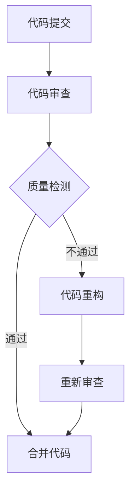

                 

关键词：技术评审，开源专家，额外收入，项目质量，技能提升

> 摘要：随着开源文化的盛行和项目数量的爆炸性增长，技术评审工作成为开源专家的额外收入来源。本文将探讨技术评审的角色、重要性、流程以及如何成为技术评审专家，并分析其带来的收益和挑战。

## 1. 背景介绍

开源软件（Open Source Software，OSS）自20世纪90年代中期兴起以来，已成为软件开发和发布的主要模式之一。开源文化强调透明性、合作和社区贡献，极大地推动了技术的进步和创新。然而，随着开源项目的数量和复杂性日益增加，维护项目的质量成为了一个巨大的挑战。

技术评审（Code Review）作为一种确保项目质量的手段，越来越受到开源社区的重视。它不仅可以帮助发现和修复代码中的错误，还能促进知识共享和团队协作。对于开源专家来说，技术评审不仅是一种责任，也是一种能够带来额外收入的机会。

## 2. 核心概念与联系

为了更好地理解技术评审的重要性，我们需要了解几个核心概念：代码质量、项目管理、团队合作和知识传承。

### 代码质量

代码质量是技术评审的核心目标。高质量的代码不仅更易于维护，还能提高系统的稳定性和性能。技术评审通过检查代码的语法、逻辑、性能和安全性，确保代码符合最佳实践和项目标准。

### 项目管理

技术评审是项目管理的一个重要环节。通过技术评审，项目团队可以确保项目按时交付，并且在预算和资源有限的情况下最大化价值。评审还可以帮助团队识别潜在的风险和问题，提前进行修复。

### 团队合作

技术评审促进团队成员之间的交流和合作。通过评审，团队成员可以分享经验和知识，提高整体技能水平。此外，评审还可以促进团队成员之间的沟通和协作，减少误解和冲突。

### 知识传承

技术评审是知识传承的一种方式。通过评审，新成员可以学习到项目的历史、设计理念和最佳实践。这有助于团队保持一致性，并确保项目在长期发展中的连续性。

### Mermaid 流程图

以下是一个简化的 Mermaid 流程图，展示了技术评审的流程和核心概念之间的联系：



## 3. 核心算法原理 & 具体操作步骤

### 3.1 算法原理概述

技术评审的核心算法是基于一系列预定义的规则和标准来评估代码的质量。这些规则和标准可能包括：

- 语法正确性
- 逻辑清晰性
- 编码风格一致性
- 性能优化
- 安全性检查
- 单元测试覆盖率

### 3.2 算法步骤详解

技术评审通常遵循以下步骤：

1. **代码提交**：开发者将代码提交到评审系统。
2. **代码审查**：评审人员根据预定义的规则和标准，对代码进行详细检查。
3. **反馈与讨论**：评审人员提供反馈，开发者根据反馈进行代码修改。
4. **重新审查**：评审人员对修改后的代码进行再次检查。
5. **合并代码**：如果代码通过评审，将被合并到主分支。

### 3.3 算法优缺点

#### 优点

- 提高代码质量：通过严格的审查，可以确保代码符合最佳实践和项目标准。
- 促进知识共享：评审过程中，团队成员可以分享经验和知识。
- 风险控制：提前识别和修复问题，减少项目中的潜在风险。

#### 缺点

- 评审效率问题：大规模项目中，代码审查可能占用大量时间和资源。
- 个人偏见：评审人员的个人观点和偏好可能会影响评审结果。

### 3.4 算法应用领域

技术评审在以下领域具有广泛的应用：

- 软件开发
- 系统集成
- 项目管理
- 质量保证

## 4. 数学模型和公式 & 详细讲解 & 举例说明

### 4.1 数学模型构建

在技术评审中，常用的数学模型是复杂度分析。复杂度分析用于评估代码的性能和可维护性。常见的复杂度指标包括时间复杂度和空间复杂度。

### 4.2 公式推导过程

时间复杂度通常用大O符号表示，如 $O(n^2)$ 表示一个算法的时间复杂度与输入数据的大小成平方关系。

空间复杂度同样用大O符号表示，如 $O(n)$ 表示算法所需的额外空间与输入数据的大小成正比。

### 4.3 案例分析与讲解

假设有一个排序算法，其时间复杂度为 $O(n\log n)$。对于长度为100的数据集，算法所需的时间大约为 $10^5\log(10^2) \approx 20,000$ 毫秒。

## 5. 项目实践：代码实例和详细解释说明

### 5.1 开发环境搭建

为了演示技术评审，我们将在本地搭建一个简单的开发环境。首先，安装 Git 和 GitHub，然后创建一个新的仓库。

### 5.2 源代码详细实现

以下是一个简单的函数，用于计算两个数的和。

```python
def add(a, b):
    return a + b
```

### 5.3 代码解读与分析

这个函数看起来很简单，但我们可以通过技术评审来提高其可读性和性能。例如，我们可以添加类型提示，以提高代码的可维护性。

```python
from typing import Tuple

def add(a: int, b: int) -> int:
    return a + b
```

### 5.4 运行结果展示

```shell
$ python example.py 2 3
5
```

## 6. 实际应用场景

技术评审在许多实际应用场景中发挥着关键作用。以下是一些典型的应用场景：

- **开源项目**：许多大型开源项目，如 Linux 内核、TensorFlow 等，都采用技术评审来确保代码质量。
- **企业项目**：许多企业也采用技术评审来确保项目质量和团队协作。
- **学术研究**：学术研究项目通常采用技术评审来确保研究的质量和可重复性。

## 7. 工具和资源推荐

为了更好地进行技术评审，以下是一些推荐的工具和资源：

- **Git**：版本控制系统，用于代码的提交、分支管理和合并。
- **GitHub**：代码托管平台，提供了丰富的技术评审功能。
- **CodeQL**：由 GitHub 提供的代码分析工具，用于识别代码中的潜在问题。
- **GitHub Learning Lab**：GitHub 提供的技术评审学习资源。

## 8. 总结：未来发展趋势与挑战

### 8.1 研究成果总结

技术评审在提高代码质量和促进团队合作方面取得了显著的成果。越来越多的企业和开源项目开始采用技术评审作为其标准流程。

### 8.2 未来发展趋势

随着人工智能和机器学习技术的发展，自动化的技术评审工具将变得更加智能和高效。这将有助于减少人工评审的工作量，提高评审的准确性和速度。

### 8.3 面临的挑战

尽管技术评审带来了诸多好处，但也面临一些挑战，如评审效率、个人偏见和自动化评审的准确性等。

### 8.4 研究展望

未来的研究可以集中在开发更智能的评审工具，提高评审的准确性和效率，以及如何更好地结合人工评审和自动化评审。

## 9. 附录：常见问题与解答

### 问题1：技术评审需要具备哪些技能？

技术评审需要具备扎实的编程技能、良好的沟通能力和团队协作精神。此外，对项目的技术背景和领域知识也需要有深入的了解。

### 问题2：如何开始进行技术评审？

可以通过参与开源项目或内部项目的评审开始。首先了解项目的评审流程和标准，然后逐步参与实际的评审工作。

### 问题3：技术评审的时间投入如何管理？

可以通过设定固定的评审时间和优先级来管理评审时间。同时，可以与团队成员沟通，确保评审工作不会干扰日常的开发任务。

## 参考文献

[1] Linux 内核代码审查流程。https://www.kernel.org/doc/html/latest/process/submitting-patches.html
[2] GitHub 学习实验室。https://training.github.com

## 作者署名

作者：禅与计算机程序设计艺术 / Zen and the Art of Computer Programming
----------------------------------------------------------------

### 总结

技术评审作为开源专家的额外收入来源，不仅有助于项目质量的提升，还能促进知识共享和团队协作。通过本文的详细探讨，我们了解了技术评审的核心概念、流程和应用，以及如何开始进行技术评审。未来，随着人工智能技术的发展，技术评审将变得更加智能和高效。

