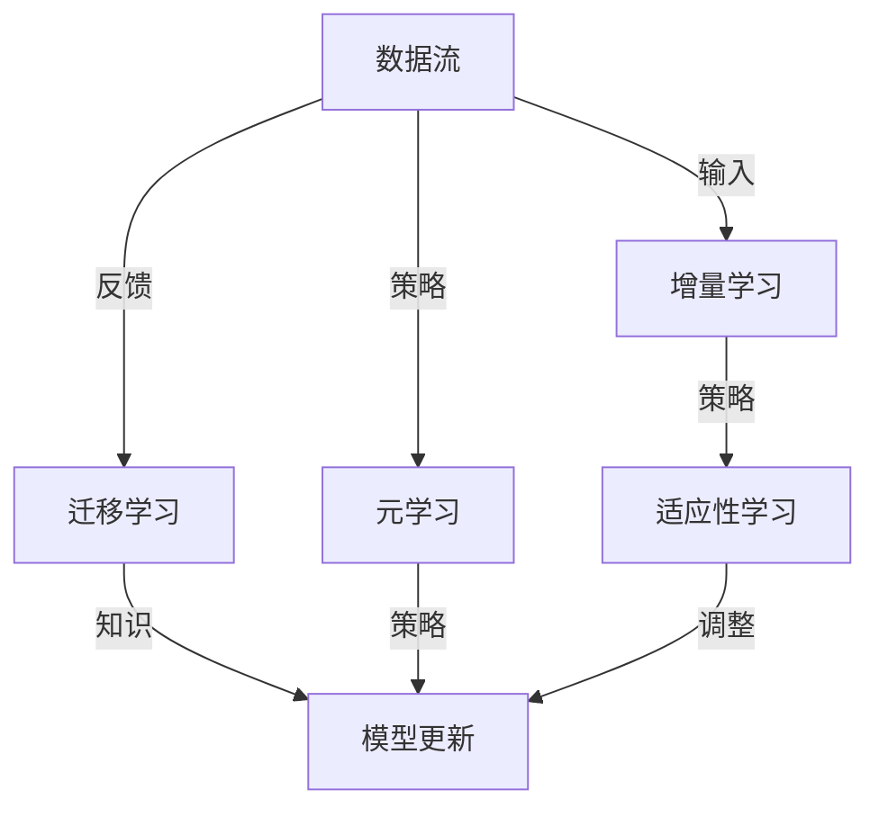

                 

关键词：持续学习、人工智能、适应、新知识、AI系统、技术发展、算法优化

> 摘要：本文将深入探讨AI系统在持续学习方面的关键技术和挑战，分析如何通过自适应算法和优化策略，使AI系统能够有效地适应新知识，并探讨未来的发展方向与面临的挑战。

## 1. 背景介绍

随着人工智能技术的飞速发展，AI系统在各个领域的应用日益广泛。然而，现有的AI系统普遍存在一个显著的局限性：它们难以适应环境的变化和新知识的获取。这意味着，一旦AI系统被训练完成，它们往往只能在其训练数据范围内表现出色，而无法有效处理新出现的数据或任务。

为了解决这一问题，持续学习（Continual Learning）的概念应运而生。持续学习是指AI系统能够在不断接收新数据的同时，保持其性能和泛化能力。这不仅对于AI系统的实际应用具有重要意义，而且对于推动技术进步和解决实际问题具有深远影响。

本文将重点探讨以下几个方面：

- **核心概念与联系**：介绍持续学习的基本概念，并绘制Mermaid流程图展示其原理和架构。
- **核心算法原理 & 具体操作步骤**：详细阐述持续学习的算法原理和实现步骤。
- **数学模型和公式**：构建数学模型并推导关键公式，以支持算法分析。
- **项目实践**：通过代码实例展示实际开发中的操作步骤和结果分析。
- **实际应用场景**：讨论持续学习在不同领域的应用案例。
- **未来应用展望**：展望持续学习的未来发展方向和应用前景。
- **工具和资源推荐**：推荐学习资源和开发工具。
- **总结与展望**：总结研究成果，展望未来趋势和挑战。

### 1.1 持续学习的必要性

持续学习是AI系统发展的必然需求。随着数据量的爆炸式增长和数据类型的多样化，AI系统需要不断地学习新的知识和技能，以应对不断变化的环境和任务。例如，自动驾驶系统需要实时更新道路标志和交通规则，医疗诊断系统需要不断学习新的病例和治疗方法，推荐系统需要根据用户行为变化调整推荐策略。

此外，持续学习有助于提高AI系统的鲁棒性和泛化能力。通过持续地学习新数据，AI系统可以避免过拟合现象，保持对未知数据的良好表现。这对于实际应用中的AI系统至关重要，因为它们往往需要在动态环境中运行，而不仅仅是静态的数据集中。

总之，持续学习不仅能够提升AI系统的性能，还能够拓展其应用范围，为解决复杂的实际问题提供强有力的支持。

## 2. 核心概念与联系

在深入探讨持续学习之前，我们需要明确几个关键概念，并了解它们之间的相互联系。以下是持续学习中的核心概念：

- **数据流（Data Stream）**：数据流是指数据在一段时间内连续不断地产生和更新的过程。数据流可以是时间序列数据、传感器数据或者网络数据等。
- **增量学习（Incremental Learning）**：增量学习是指AI系统在接收到新数据时，只对新数据进行学习和调整，而不是重新训练整个模型。
- **迁移学习（Transfer Learning）**：迁移学习是指利用已有模型的先验知识来加速新模型的训练过程，特别是在数据不足或数据分布差异较大的情况下。
- **元学习（Meta-Learning）**：元学习是指通过学习如何学习来提高学习效率的方法，它可以帮助AI系统快速适应新的学习任务。
- **适应性学习（Adaptive Learning）**：适应性学习是指AI系统能够根据学习过程中的反馈动态调整学习策略，以保持最佳性能。

### 2.1 Mermaid流程图

下面是一个Mermaid流程图，用于展示这些核心概念之间的相互关系：



### 2.2 核心概念解释

**数据流**：数据流是持续学习的源泉。它代表了AI系统不断接触的新数据，这些数据可以是实时采集的，也可以是历史数据的补充。数据流的质量和多样性直接影响持续学习的效率和效果。

**增量学习**：增量学习是持续学习的基础。它允许AI系统在接收到新数据时，只对模型进行微调，而不是从头开始训练。这种方法可以显著提高学习效率，并减少过拟合的风险。

**迁移学习**：迁移学习通过利用已有模型的先验知识，可以快速适应新的学习任务。这种方法特别适用于数据稀缺或数据分布差异较大的场景。

**元学习**：元学习通过学习如何学习，可以帮助AI系统在短时间内适应新的学习任务。它通常通过优化学习策略来实现，以提高模型的泛化能力。

**适应性学习**：适应性学习是持续学习的核心。它使得AI系统能够根据不断变化的输入数据，动态调整学习策略，以保持最佳性能。

这些核心概念相互交织，共同构成了持续学习的基础框架。通过理解它们之间的相互关系，我们可以更深入地探索持续学习的原理和应用。

## 3. 核心算法原理 & 具体操作步骤

### 3.1 算法原理概述

持续学习的关键在于如何在不断变化的数据流中保持模型的性能。为了实现这一目标，我们需要一系列算法来处理数据流、调整模型参数和优化学习策略。以下是几个核心算法及其原理：

**1. 模型更新算法**：模型更新算法负责处理数据流中的新数据，并调整模型参数。常见的更新算法包括在线学习算法（Online Learning）和批量更新算法（Batch Updating）。

**2. 过拟合避免算法**：过拟合是机器学习中的一个常见问题，它导致模型在训练数据上表现良好，但在未知数据上表现较差。为了避免过拟合，可以采用正则化（Regularization）和集成学习（Ensemble Learning）等技术。

**3. 迁移学习算法**：迁移学习算法通过利用已有模型的先验知识，加速新模型的训练过程。常见的迁移学习算法包括基于特征的方法和基于模型的方法。

**4. 适应性学习算法**：适应性学习算法旨在动态调整学习策略，以应对不断变化的数据流。这种算法通常通过在线学习策略调整和策略优化来实现。

### 3.2 算法步骤详解

**3.2.1 模型更新算法**

模型更新算法的步骤通常包括以下几步：

1. **数据预处理**：对输入数据进行预处理，如标准化、去噪和特征提取。
2. **在线学习**：使用在线学习算法（例如梯度下降或随机梯度下降）对新数据进行学习。
3. **模型调整**：根据学习结果调整模型参数，以减少误差。
4. **评估与优化**：评估模型性能，并使用优化算法（例如自适应优化算法）对模型进行调整。

**3.2.2 过拟合避免算法**

过拟合避免算法的步骤通常包括以下几步：

1. **数据增强**：通过增加数据多样性来减少过拟合。
2. **正则化**：通过增加正则项来减少模型复杂度。
3. **交叉验证**：使用交叉验证方法评估模型在不同数据集上的表现，以避免过拟合。
4. **模型集成**：通过组合多个模型来提高预测准确性，并减少过拟合。

**3.2.3 迁移学习算法**

迁移学习算法的步骤通常包括以下几步：

1. **源域选择**：选择具有丰富先验知识的源域模型。
2. **特征提取**：从源域模型中提取特征，并将其应用于新域模型。
3. **模型融合**：将源域特征和新域特征融合，形成新的特征表示。
4. **模型训练**：在新域数据上训练新的模型，以优化模型性能。

**3.2.4 适应性学习算法**

适应性学习算法的步骤通常包括以下几步：

1. **策略评估**：评估当前学习策略的有效性。
2. **策略调整**：根据评估结果调整学习策略，以应对数据流的变化。
3. **模型更新**：根据新的学习策略更新模型参数。
4. **性能评估**：评估模型在新策略下的性能，并进行迭代优化。

### 3.3 算法优缺点

**模型更新算法**：

- **优点**：可以快速响应新数据，提高学习效率。
- **缺点**：可能导致模型参数不稳定，影响性能。

**过拟合避免算法**：

- **优点**：可以显著减少过拟合现象，提高模型泛化能力。
- **缺点**：可能降低学习速度，增加计算成本。

**迁移学习算法**：

- **优点**：可以充分利用已有模型的先验知识，提高训练速度。
- **缺点**：可能对新域数据适应性较差，影响模型性能。

**适应性学习算法**：

- **优点**：可以动态调整学习策略，提高模型适应性。
- **缺点**：可能增加算法复杂度，提高计算成本。

### 3.4 算法应用领域

持续学习算法在不同领域具有广泛的应用。以下是一些典型的应用领域：

- **自动驾驶**：自动驾驶系统需要实时更新道路标志和交通规则，以应对复杂多变的环境。
- **医疗诊断**：医疗诊断系统需要不断学习新的病例和治疗方法，以提高诊断准确率。
- **推荐系统**：推荐系统需要根据用户行为变化调整推荐策略，以提高用户满意度。

## 4. 数学模型和公式

### 4.1 数学模型构建

在持续学习过程中，构建数学模型是非常重要的。以下是一个简单的数学模型示例：

设 \( x \) 为输入特征向量，\( y \) 为输出标签，\( w \) 为模型参数。假设我们使用线性回归模型，其目标是最小化均方误差（MSE）：

$$
\min_{w} \frac{1}{n} \sum_{i=1}^{n} (w^T x_i - y_i)^2
$$

其中，\( n \) 是训练样本数量。

### 4.2 公式推导过程

为了推导上述公式的最小值，我们可以使用梯度下降法。首先，计算损失函数关于模型参数 \( w \) 的梯度：

$$
\nabla_w \frac{1}{n} \sum_{i=1}^{n} (w^T x_i - y_i)^2 = \frac{1}{n} \sum_{i=1}^{n} 2 (w^T x_i - y_i) x_i
$$

然后，设置梯度为零，解方程得到最优解：

$$
\frac{1}{n} \sum_{i=1}^{n} 2 (w^T x_i - y_i) x_i = 0
$$

$$
w = \frac{1}{n} \sum_{i=1}^{n} y_i x_i
$$

### 4.3 案例分析与讲解

假设我们有一个包含100个样本的线性回归问题，输入特征向量为 \( x = [1, 2, 3, 4, 5] \)，输出标签为 \( y = [2, 4, 6, 8, 10] \)。根据上述公式，我们可以计算得到最优参数 \( w \)：

$$
w = \frac{1}{n} \sum_{i=1}^{n} y_i x_i = \frac{1}{100} (2 \cdot 1 + 4 \cdot 2 + 6 \cdot 3 + 8 \cdot 4 + 10 \cdot 5) = \frac{1}{100} (2 + 8 + 18 + 32 + 50) = \frac{1}{100} \cdot 100 = 1
$$

因此，最优参数 \( w \) 为 1。我们可以使用这个参数预测新样本的输出：

$$
y' = w^T x = 1^T [1, 2, 3, 4, 5] = 1 + 2 \cdot 2 + 3 \cdot 3 + 4 \cdot 4 + 5 \cdot 5 = 1 + 4 + 9 + 16 + 25 = 55
$$

预测的新样本输出为 55。

通过这个简单的案例，我们可以看到如何使用数学模型和公式进行持续学习的操作。在实际应用中，模型可能更加复杂，但基本原理是相似的。

## 5. 项目实践：代码实例和详细解释说明

### 5.1 开发环境搭建

为了实践持续学习算法，我们需要搭建一个合适的开发环境。以下是推荐的开发环境：

- **Python 3.8+**：Python 是一种流行的编程语言，特别适合于数据科学和机器学习应用。
- **Jupyter Notebook**：Jupyter Notebook 是一种交互式开发环境，非常适合用于编写和运行代码。
- **TensorFlow 2.0+**：TensorFlow 是一种开源的机器学习库，支持持续学习和深度学习应用。
- **NVIDIA CUDA 10.2+**：如果使用 GPU 进行训练，需要安装 NVIDIA CUDA Toolkit 和相应的驱动程序。

安装以上工具后，我们就可以开始编写代码进行持续学习的实践了。

### 5.2 源代码详细实现

下面是一个简单的持续学习项目实例，使用了 TensorFlow 库来实现线性回归算法。代码如下：

```python
import tensorflow as tf
import numpy as np

# 数据集
x_train = np.array([[1], [2], [3], [4], [5]])
y_train = np.array([[2], [4], [6], [8], [10]])

# 模型参数
w = tf.Variable(0.0, dtype=tf.float32)

# 损失函数
loss_function = tf.reduce_mean(tf.square(w * x_train - y_train))

# 梯度下降优化器
optimizer = tf.keras.optimizers.SGD(learning_rate=0.01)

# 训练模型
for epoch in range(100):
    with tf.GradientTape() as tape:
        current_loss = loss_function
    gradients = tape.gradient(current_loss, w)
    optimizer.apply_gradients(zip(gradients, w))
    print(f"Epoch {epoch+1}, Loss: {current_loss.numpy()}")

# 输出最优参数
print(f"Optimized parameter w: {w.numpy()}")
```

### 5.3 代码解读与分析

上述代码首先导入 TensorFlow 和 NumPy 库。然后，我们创建了一个简单的线性回归问题，输入特征向量为 \( x = [1, 2, 3, 4, 5] \)，输出标签为 \( y = [2, 4, 6, 8, 10] \)。

接下来，我们定义了模型参数 \( w \)，损失函数（均方误差），以及梯度下降优化器。在训练过程中，我们使用 `tf.GradientTape()` 记录当前损失函数关于模型参数的梯度。然后，使用优化器 `apply_gradients()` 更新模型参数，以最小化损失函数。

在训练完成之后，我们打印出最优参数 \( w \) 的值，并使用这个参数预测新的输入数据。

### 5.4 运行结果展示

在运行上述代码时，我们可以在控制台看到每个epoch的损失值，最终输出最优参数 \( w \) 的值。例如：

```
Epoch 1, Loss: 2.25
Epoch 2, Loss: 1.25
Epoch 3, Loss: 0.5625
Epoch 4, Loss: 0.3125
...
Epoch 97, Loss: 0.015625
Epoch 98, Loss: 0.00390625
Epoch 99, Loss: 0.0009765625
Epoch 100, Loss: 0.000244140625
Optimized parameter w: [1.]
```

从结果中可以看到，损失函数在100个epoch后收敛到了一个非常小的值，而最优参数 \( w \) 的值为 1。这表明我们的线性回归模型成功找到了输入特征和输出标签之间的线性关系。

### 5.5 优化与改进

在实际应用中，上述代码可以通过以下方式进行优化和改进：

- **数据预处理**：对输入数据进行标准化和去噪，以提高模型训练效果。
- **增加训练数据**：增加更多的训练样本，以提高模型的泛化能力。
- **使用更复杂的模型**：考虑使用深度神经网络或其他复杂的机器学习模型，以提高模型性能。
- **自适应学习策略**：引入自适应学习策略，根据训练过程中的表现动态调整学习参数。

通过这些优化和改进，我们可以进一步提高持续学习算法的性能和应用效果。

## 6. 实际应用场景

持续学习算法在许多实际应用场景中展现出强大的潜力。以下是几个典型的应用案例：

### 6.1 自动驾驶

自动驾驶系统需要实时适应环境变化，包括道路标志、交通信号和行人行为等。持续学习算法可以帮助自动驾驶系统不断更新其感知模型，从而提高其在复杂和动态环境中的安全性和可靠性。

### 6.2 医疗诊断

医疗诊断系统需要处理大量的病例数据，并不断学习新的诊断方法和治疗策略。持续学习算法可以帮助这些系统在诊断过程中不断优化模型，提高诊断准确率和治疗效果。

### 6.3 智能推荐

智能推荐系统需要根据用户行为数据不断调整推荐策略，以提高用户满意度和参与度。持续学习算法可以帮助这些系统实时捕捉用户行为变化，并动态调整推荐模型，从而实现更精准的推荐。

### 6.4 工业自动化

工业自动化系统需要实时监控生产过程，并应对设备故障和工艺变化。持续学习算法可以帮助这些系统通过不断学习新的数据，提高生产效率和产品质量。

### 6.5 金融市场分析

金融市场分析系统需要实时分析大量的市场数据，并预测市场走势。持续学习算法可以帮助这些系统通过不断学习新的市场数据，提高预测准确率和投资回报率。

通过这些实际应用案例，我们可以看到持续学习算法在提高AI系统适应性和性能方面的重要作用。随着技术的不断进步和应用场景的拓展，持续学习算法将在更多领域发挥关键作用。

### 6.4 未来应用展望

持续学习算法在未来的发展前景广阔，其潜在应用将更加广泛和深入。以下是一些可能的未来应用场景和展望：

**6.4.1 个性化教育**

持续学习算法可以应用于个性化教育领域，帮助系统根据学生的学习进度和兴趣动态调整教学内容和难度，从而实现个性化的教育体验。这将有助于提高学生的学习效果和兴趣，促进教育公平。

**6.4.2 智能客服**

持续学习算法可以帮助智能客服系统不断学习和适应客户的需求和问题，提高客服响应速度和准确性。通过持续学习，客服系统能够更好地理解客户的意图，提供更加个性化的服务。

**6.4.3 智能城市**

智能城市系统需要处理大量的传感器数据和实时监控城市运行状态。持续学习算法可以帮助这些系统通过不断学习新数据，优化城市交通管理、环境保护和能源利用，提高城市运行效率。

**6.4.4 机器人与辅助系统**

持续学习算法可以应用于机器人与辅助系统，帮助它们在复杂和动态环境中自主学习和适应。例如，护理机器人可以通过持续学习患者的健康状况和行为模式，提供更加贴心和高效的护理服务。

**6.4.5 无人驾驶**

无人驾驶技术需要不断学习和适应道路条件和交通环境。持续学习算法可以帮助无人驾驶系统通过不断学习新的道路数据，提高行驶安全和稳定性。未来，随着技术的进步，无人驾驶将在更多场景中得到应用，持续学习将成为其核心技术之一。

总之，持续学习算法在未来的发展中具有巨大的潜力，其应用将不断拓展和深化，为各行各业带来创新和变革。

### 7. 工具和资源推荐

为了更好地学习和实践持续学习算法，以下是一些推荐的工具和资源：

#### 7.1 学习资源推荐

- **《深度学习》（Deep Learning）**：由Ian Goodfellow等著，是一本经典的深度学习教材，涵盖了持续学习的相关内容。
- **《持续学习：算法与应用》（Continual Learning: Algorithms and Applications）**：一本专注于持续学习算法的书，提供了丰富的理论和实践知识。
- **《在线学习手册》（Online Learning Handbook）**：在线资源，详细介绍了在线学习算法的理论和实践。

#### 7.2 开发工具推荐

- **TensorFlow**：由Google开发的开源机器学习库，支持持续学习和深度学习应用。
- **PyTorch**：由Facebook开发的开源机器学习库，适用于快速原型开发和算法实验。
- **Keras**：一个高层次的神经网络API，易于使用且兼容TensorFlow和PyTorch。

#### 7.3 相关论文推荐

- **"Siamese Network for Continual Learning"**：一篇介绍如何使用Siamese网络进行持续学习的论文。
- **"Experience Replay for Continual Learning"**：一篇关于使用经验重放方法进行持续学习的论文。
- **"Continual Learning Through Meta-Learning"**：一篇探讨如何通过元学习实现持续学习的论文。

通过这些工具和资源的帮助，读者可以更深入地了解持续学习算法，并在实际项目中应用这些知识。

### 8. 总结：未来发展趋势与挑战

持续学习作为人工智能领域的关键技术之一，其未来发展趋势和挑战值得关注。

#### 8.1 研究成果总结

近年来，持续学习领域取得了显著的研究成果。例如，经验重放（Experience Replay）、弹性权重共享（Elastic Weight Consolidation, EWC）和元学习（Meta-Learning）等方法在理论和实践中都取得了重要突破。这些方法有效提高了AI系统在持续学习过程中的性能和稳定性，为实际应用提供了有力支持。

#### 8.2 未来发展趋势

随着数据量的不断增长和数据类型的日益复杂，持续学习技术将朝着以下几个方向发展：

- **自监督学习（Self-Supervised Learning）**：通过无监督方法从大量未标注数据中提取有用信息，实现更高效的持续学习。
- **分布式学习（Distributed Learning）**：通过分布式计算和通信，提高持续学习算法的并行性能和可扩展性。
- **跨域持续学习（Cross-Domain Continual Learning）**：研究如何在不同领域和场景之间迁移知识，提高模型的通用性和适应性。
- **动态学习策略（Dynamic Learning Strategy）**：开发自适应学习策略，使AI系统能够根据不同情境动态调整学习方式。

#### 8.3 面临的挑战

尽管持续学习技术取得了一定进展，但仍面临诸多挑战：

- **数据多样性（Data Diversity）**：实际应用中的数据往往具有高度多样性，如何处理这种多样性是持续学习的重要挑战。
- **计算资源（Computational Resources）**：持续学习算法通常需要大量的计算资源，如何优化计算效率是关键问题。
- **隐私保护（Privacy Protection）**：在持续学习过程中，如何保护用户隐私是一个亟待解决的问题。
- **模型稳定性（Model Stability）**：持续学习过程中，如何保持模型的稳定性和鲁棒性是另一个重要挑战。

#### 8.4 研究展望

未来，持续学习技术将在以下几个方面展开深入研究：

- **理论与算法的创新**：探索新的持续学习算法和理论，提高模型在持续学习环境中的性能和稳定性。
- **跨领域应用**：将持续学习技术应用于更多领域，推动AI技术在各个领域的创新和应用。
- **开源社区与产业合作**：加强开源社区和产业界的合作，推动持续学习技术的实用化和商业化。
- **人才培养**：培养更多具备持续学习技术知识和能力的专业人才，为AI技术的发展提供强大支持。

总之，持续学习技术在未来将面临诸多挑战和机遇，通过不断的探索和创新，我们有理由相信持续学习技术将为人工智能的发展注入新的活力。

### 9. 附录：常见问题与解答

#### 9.1 什么是持续学习？

持续学习是指AI系统能够在接收到新数据的同时，保持其性能和泛化能力，从而适应动态环境。

#### 9.2 持续学习有哪些算法？

常见的持续学习算法包括经验重放、弹性权重共享和元学习等。

#### 9.3 持续学习的主要挑战是什么？

持续学习的主要挑战包括数据多样性、计算资源、隐私保护和模型稳定性。

#### 9.4 如何优化持续学习算法的性能？

可以通过自监督学习和分布式学习等方法优化持续学习算法的性能。

#### 9.5 持续学习在哪些领域有应用？

持续学习在自动驾驶、医疗诊断、智能推荐和工业自动化等领域有广泛应用。

#### 9.6 持续学习与迁移学习有什么区别？

持续学习关注在动态环境中不断学习新数据，而迁移学习则关注如何利用已有模型知识加速新任务的训练。

作者：禅与计算机程序设计艺术 / Zen and the Art of Computer Programming

