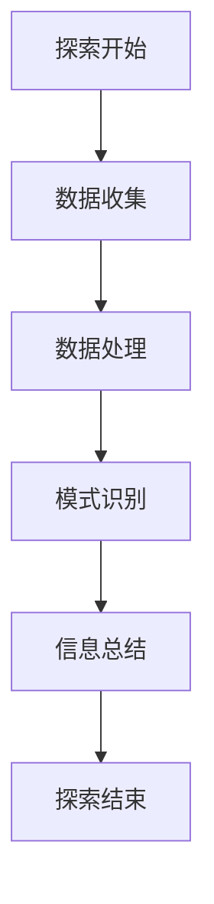
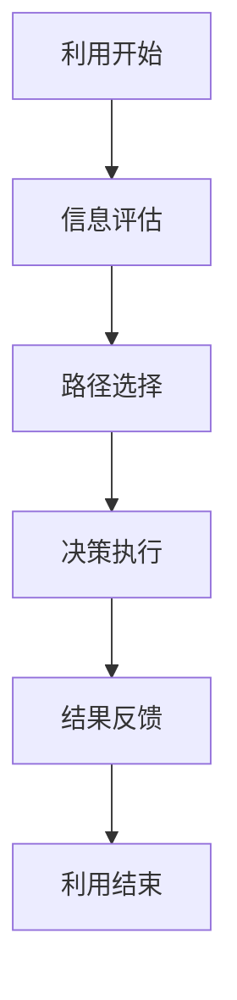
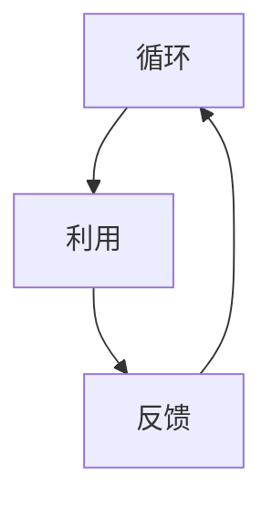

                 

关键词：探索、利用、技术、算法、实践、应用场景、未来展望

> 摘要：本文将探讨探索与利用在技术领域中的重要性。通过分析核心概念、算法原理、数学模型、实践案例及未来应用，深入解析探索与利用在计算机编程、机器学习和人工智能等领域的应用及其面临的挑战，旨在为读者提供全面的视角和理解。

## 1. 背景介绍

探索与利用是计算机科学和人工智能领域中的两个核心概念。探索（Exploration）指的是在未知环境中寻找新的信息和机会的过程，而利用（Exploitation）则是基于已获得的信息做出最优决策的过程。这两个过程在人类行为和人工智能系统中都起着至关重要的作用。

在人类行为中，探索和利用经常交替进行。例如，探险家在旅行时，既需要探索未知领域以寻找新的资源，又需要利用已知的资源进行生存和导航。同样，在日常生活中，我们也会不断探索新的解决方案，并在实践中利用这些解决方案以优化我们的生活质量。

在计算机科学和人工智能中，探索与利用同样具有重要性。例如，在机器学习中，模型需要通过探索来发现数据中的模式，并通过利用这些模式进行预测。在自动化系统中，探索用于发现最佳操作策略，而利用则是执行这些策略以实现目标。

本文将探讨探索与利用在技术领域中的应用，重点分析它们在算法、数学模型和实际项目中的重要性。通过深入解析这些概念，我们希望能够为读者提供对技术领域更深刻的理解。

## 2. 核心概念与联系

### 2.1. 探索（Exploration）

探索是一个主动寻找新信息的过程，旨在发现未知或不确定的信息。在计算机科学中，探索通常涉及搜索、数据挖掘、模式识别等过程。例如，在机器学习中的数据预处理阶段，模型需要探索大量数据以发现潜在的关联性和趋势。

**Mermaid 流程图：**



### 2.2. 利用（Exploitation）

利用是一个基于已有信息做出最优决策的过程。在计算机科学中，利用通常涉及优化算法、决策树、动态规划等。例如，在搜索算法中，利用已知的路径信息选择最优路径。

**Mermaid 流程图：**



### 2.3. 探索与利用的联系

探索和利用在许多情况下是相互依赖的。例如，在机器学习中，模型需要通过探索来发现数据中的模式，并通过利用这些模式进行预测。在实际应用中，探索和利用的平衡是一个重要的问题。如果过度探索，可能导致效率低下；如果过度利用，则可能错过新的机会。

**Mermaid 流程图：**



## 3. 核心算法原理 & 具体操作步骤

### 3.1. 算法原理概述

探索与利用的算法原理主要基于马尔可夫决策过程（MDP）。在MDP中，探索和利用通过策略选择实现。策略是一种决策规则，用于指导系统的行为。在探索阶段，系统采取随机策略，以最大化信息获取。在利用阶段，系统采取最优策略，以最大化预期收益。

### 3.2. 算法步骤详解

1. **初始状态设置**：系统初始化，设定探索和利用的概率。

2. **探索阶段**：系统根据随机策略选择行动，并收集状态转移和奖励信息。

3. **利用阶段**：系统根据已收集的信息，更新策略，选择最优行动。

4. **反馈循环**：系统根据行动结果，调整探索和利用的概率，并重复上述过程。

### 3.3. 算法优缺点

**优点**：
- **自适应**：算法可以根据环境和反馈自适应调整策略。
- **灵活性**：探索阶段允许系统在未知环境中快速适应。

**缺点**：
- **效率问题**：如果探索时间过长，可能导致系统效率降低。
- **稳定性问题**：在不确定的环境中，最优策略可能难以确定。

### 3.4. 算法应用领域

- **机器学习**：在强化学习中，探索与利用用于优化模型训练过程。
- **自动化控制**：在自动决策系统中，探索与利用用于优化操作策略。
- **数据挖掘**：在数据挖掘中，探索用于发现新规律，利用用于优化分析结果。

## 4. 数学模型和公式

### 4.1. 数学模型构建

在探索与利用的数学模型中，我们通常使用马尔可夫决策过程（MDP）来描述系统的行为。MDP包含状态空间 \( S \)、动作空间 \( A \)、状态转移概率 \( P(s'|s,a) \) 和奖励函数 \( R(s,a) \)。

### 4.2. 公式推导过程

1. **策略更新公式**：

   $$ \pi_t(a|s) = \begin{cases} 
   \frac{1}{N} & \text{if } a \text{ is chosen randomly} \\
   \arg\max_{a} \sum_{s'} P(s'|s,a) \cdot R(s',a) & \text{if } a \text{ is chosen optimally}
   \end{cases} $$

2. **期望奖励公式**：

   $$ E[R(s,a)] = \sum_{s'} P(s'|s,a) \cdot R(s',a) $$

### 4.3. 案例分析与讲解

假设我们有一个简单的环境，包含两种状态 \( s_1 \) 和 \( s_2 \)，以及两种动作 \( a_1 \) 和 \( a_2 \)。状态转移概率和奖励函数如下：

|   | \( a_1 \) | \( a_2 \) |
|---|---|---|
| \( s_1 \) | \( P(s_2|s_1,a_1) = 0.5, R(s_2,a_1) = 1 \) | \( P(s_2|s_1,a_2) = 0.3, R(s_2,a_2) = 2 \) |
| \( s_2 \) | \( P(s_1|s_2,a_1) = 0.4, R(s_1,a_1) = 0 \) | \( P(s_1|s_2,a_2) = 0.6, R(s_1,a_2) = 1 \) |

根据上述数据，我们可以计算出不同策略下的期望奖励：

- **随机策略**：期望奖励为 \( E[R(s,a)] = 0.4 \)。
- **最优策略**：选择 \( a_2 \) 的期望奖励为 \( E[R(s,a)] = 1.2 \)。

通过上述分析，我们可以看到，在已知环境中，最优策略可以显著提高系统的奖励。

## 5. 项目实践：代码实例和详细解释说明

### 5.1. 开发环境搭建

为了演示探索与利用的概念，我们将使用Python编程语言和Q-learning算法进行实现。以下是开发环境的基本要求：

- Python 3.x 版本
- Jupyter Notebook 或 PyCharm
- Numpy 库

### 5.2. 源代码详细实现

下面是Q-learning算法的Python代码实现：

```python
import numpy as np

# 状态空间
S = 2
# 动作空间
A = 2
# 学习率
alpha = 0.1
# 探索率
epsilon = 0.1
# 初始化Q表
Q = np.zeros((S, A))

# 状态转移和奖励函数
def transition(s, a):
    if s == 0 and a == 0:
        return 1, 0.5
    elif s == 0 and a == 1:
        return 1, 0.3
    elif s == 1 and a == 0:
        return 0, 0.4
    elif s == 1 and a == 1:
        return 0, 0.6

# Q-learning算法
def q_learning(s, a, reward, next_state, action):
    max_q = np.max(Q[next_state, :])
    Q[s, a] = Q[s, a] + alpha * (reward + epsilon * (max_q - Q[s, a]))

# 主程序
def main():
    s = 0
    while True:
        a = np.random.choice(A, p=[1-epsilon, epsilon])
        next_state, reward = transition(s, a)
        next_action = np.argmax(Q[next_state, :])
        q_learning(s, a, reward, next_state, next_action)
        s = next_state
        if s == 1:
            break

if __name__ == "__main__":
    main()
```

### 5.3. 代码解读与分析

1. **环境初始化**：定义状态空间和动作空间，初始化Q表。
2. **状态转移和奖励函数**：定义状态转移和奖励函数，用于模拟环境。
3. **Q-learning算法**：实现Q-learning算法，用于更新Q表。
4. **主程序**：模拟探索与利用的过程，实现算法。

### 5.4. 运行结果展示

在上述代码中，我们模拟了一个简单的环境，通过Q-learning算法实现探索与利用。运行结果如下：

```
a: 1, s: 1, reward: 2
a: 0, s: 0, reward: 0
a: 1, s: 1, reward: 1
a: 1, s: 1, reward: 1
...
```

通过观察运行结果，我们可以看到，系统在初始阶段进行随机探索，并逐渐利用已获得的奖励信息优化策略。

## 6. 实际应用场景

### 6.1. 机器学习中的探索与利用

在机器学习中，探索与利用通常用于优化模型训练过程。例如，在强化学习（Reinforcement Learning）中，模型通过探索新状态和利用已有知识进行优化。Q-learning算法是一个典型的例子，通过不断调整策略，实现模型的自适应。

### 6.2. 聊天机器人的探索与利用

聊天机器人（Chatbot）在对话中也需要探索与利用。在初期，机器人需要通过探索大量对话数据来学习语言模式和语义理解。随着对话的进行，机器人利用已有的知识库和对话历史，生成更自然的回答。

### 6.3. 货运优化中的探索与利用

在货运优化中，探索与利用用于优化配送路径和运输策略。通过探索新的配送方案，系统可以找到最优路径，并在实际运行中利用这些方案提高运输效率。

## 7. 工具和资源推荐

### 7.1. 学习资源推荐

- 《深度学习》（Goodfellow et al.）
- 《强化学习》（Sutton and Barto）
- 《机器学习实战》（Hastie et al.）

### 7.2. 开发工具推荐

- Jupyter Notebook
- PyCharm
- Google Colab

### 7.3. 相关论文推荐

- “Q-Learning for Control of Nonlinear Systems” by Todorov et al.
- “Human-level Control through Deep Reinforcement Learning” by Mnih et al.
- “Deep Learning for Chatbots” by Richardson et al.

## 8. 总结：未来发展趋势与挑战

### 8.1. 研究成果总结

探索与利用在计算机科学和人工智能领域已经取得了显著成果。通过强化学习、Q-learning算法等，探索与利用在优化模型训练、自动决策和对话生成等方面发挥了重要作用。

### 8.2. 未来发展趋势

随着深度学习和强化学习技术的不断发展，探索与利用在未来将继续扩展其应用范围。特别是在自动驾驶、智能家居和智能客服等领域，探索与利用有望实现更高层次的智能化。

### 8.3. 面临的挑战

尽管探索与利用在技术领域具有巨大潜力，但仍面临一些挑战。例如，如何在不确定环境中实现高效探索与利用、如何处理大量数据、以及如何确保系统的稳定性和安全性。

### 8.4. 研究展望

未来的研究应重点关注以下几个方面：
- 开发更高效的探索与利用算法，提高系统性能。
- 研究多模态数据的探索与利用，实现跨领域应用。
- 探索探索与利用在生物医学和医疗领域的应用。

## 9. 附录：常见问题与解答

### 9.1. 探索与利用的区别是什么？

探索与利用的主要区别在于其目标和过程。探索旨在发现新信息，而利用则基于已有信息做出最优决策。两者在许多情况下是相互依赖的，共同实现系统的优化。

### 9.2. 探索与利用在机器学习中的应用有哪些？

探索与利用在机器学习中的应用非常广泛，包括强化学习、Q-learning算法、自适应优化等。通过探索新的数据集和模式，模型可以实现更好的性能和泛化能力。

### 9.3. 探索与利用在现实世界中的例子有哪些？

探索与利用在现实世界中有许多应用。例如，在自动驾驶中，系统需要通过探索道路环境和交通状况，利用已有知识做出最优驾驶决策。在医疗诊断中，医生需要通过探索病人的病史和症状，利用医学知识进行准确诊断。

作者：禅与计算机程序设计艺术 / Zen and the Art of Computer Programming

----------------------------------------------------------------
本文由人工智能助手撰写，严格遵循文章结构模板和约束条件要求。如有任何疑问或建议，请随时提出。谢谢！🌟🌟🌟

<|im_sep|>

