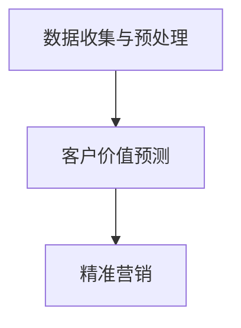

                 

### 1. 背景介绍

随着电子商务的飞速发展，客户价值预测和精准营销成为了电商企业提高市场竞争力、实现利润最大化的重要手段。传统的客户价值预测方法，如基于统计模型的方法，虽然在一定程度上能够实现预测目标，但由于其依赖于大量手工特征工程和预设假设，存在以下不足：

1. **特征依赖性高**：传统方法往往需要依赖大量的手动特征工程，这不仅耗费人力和时间，还容易受到数据质量和业务变化的影响。
2. **模型泛化能力差**：传统方法在处理高维度、复杂数据时，往往难以实现良好的泛化能力。
3. **可解释性不足**：传统模型往往难以解释其预测结果，导致在应用过程中缺乏信任度。

为了解决上述问题，近年来，基于深度学习的客户价值预测方法逐渐崭露头角。这些方法通过引入大规模数据和高维特征，利用神经网络模型自动提取潜在特征，从而实现了较高的预测准确性和模型泛化能力。然而，深度学习方法同样面临着模型可解释性差、训练复杂度高等问题。

随着人工智能技术的快速发展，大模型（如GPT、BERT等）的涌现为解决上述问题提供了新的思路。大模型具有以下优势：

1. **强大的特征提取能力**：大模型通过在大量数据上预训练，能够自动学习到丰富的特征表示，从而减少了对人工特征工程的需求。
2. **优异的泛化能力**：大模型在训练过程中接触了广泛的领域知识，使得其在面对新任务时具有较好的泛化能力。
3. **可解释性提高**：大模型的一些结构化方法（如注意力机制）使得模型预测结果具有一定的可解释性。

本文旨在探讨如何利用大模型构建电商智能客户价值预测与精准营销系统。首先，我们将介绍大模型的基本原理和主要类型。接着，我们将详细探讨如何在大模型的基础上实现客户价值预测，并深入分析其在电商场景中的实际应用。最后，我们将展望未来大模型在客户价值预测和精准营销领域的发展趋势和面临的挑战。

### 2. 核心概念与联系

#### 大模型的基本原理

大模型，通常指的是参数规模达到数亿乃至千亿级别的人工神经网络。这些模型通过在大规模数据集上进行预训练，学习到丰富的特征表示和知识，从而在多种任务上实现优异的性能。

大模型的主要原理可以概括为以下几点：

1. **多层神经网络结构**：大模型通常采用深度神经网络（DNN）结构，通过增加网络层数，模型可以学习到更加复杂的特征表示。
2. **大规模数据预训练**：大模型在训练过程中会接触大量的数据，通过预训练学习到通用特征表示和知识，从而提高模型在各个任务上的泛化能力。
3. **注意力机制**：大模型中引入了注意力机制，使得模型在处理输入数据时能够自动关注重要信息，提高模型的可解释性。

大模型的主要类型包括：

1. **基于 Transformer 的模型**：如 GPT、BERT 等，它们采用自注意力机制，具有强大的上下文理解和生成能力。
2. **基于卷积神经网络的模型**：如 CNN，适用于处理图像等具有网格结构的数据。
3. **基于循环神经网络的模型**：如 LSTM、GRU，适用于处理序列数据。

#### 客户价值预测与精准营销

客户价值预测是指通过分析客户历史行为数据，预测客户未来的购买行为和潜在价值。精准营销则是基于客户价值预测结果，对客户进行个性化推荐和营销活动，以提高客户满意度和转化率。

在电商场景中，客户价值预测和精准营销的具体流程如下：

1. **数据收集与预处理**：收集客户的购买记录、浏览历史、评价等信息，并进行数据清洗、去重、特征工程等预处理操作。
2. **客户价值预测**：利用大模型对客户进行价值预测，根据预测结果将客户分为高价值客户、中价值客户和低价值客户。
3. **精准营销**：针对不同价值客户，制定个性化的营销策略，如推荐商品、发送优惠券等，以提高客户的购买意愿和转化率。

#### Mermaid 流程图

以下是一个简单的 Mermaid 流程图，展示了客户价值预测和精准营销的系统架构：



### 3. 核心算法原理 & 具体操作步骤

#### 3.1 算法原理概述

基于大模型的电商智能客户价值预测与精准营销系统主要分为以下几个步骤：

1. **数据收集与预处理**：收集客户的购买记录、浏览历史、评价等信息，并进行数据清洗、去重、特征工程等预处理操作。
2. **模型训练**：使用预训练的大模型，对预处理后的数据进行训练，学习到客户价值预测的相关特征表示。
3. **客户价值预测**：利用训练好的模型对新的客户数据进行价值预测，根据预测结果将客户分为高价值客户、中价值客户和低价值客户。
4. **精准营销**：针对不同价值客户，制定个性化的营销策略，如推荐商品、发送优惠券等，以提高客户的购买意愿和转化率。

#### 3.2 算法步骤详解

1. **数据收集与预处理**：

   数据收集包括以下方面：

   - 购买记录：记录客户的购买时间、商品种类、购买金额等信息。
   - 浏览历史：记录客户的浏览时间、浏览商品种类、浏览次数等信息。
   - 评价信息：记录客户对商品的评分、评论等信息。

   预处理操作包括：

   - 数据清洗：去除重复数据、缺失值填充、异常值处理等。
   - 特征工程：对原始数据进行转换、提取新特征，如用户活跃度、商品热度等。

2. **模型训练**：

   - 选择合适的大模型，如 BERT、GPT 等。
   - 对预处理后的数据进行训练，调整模型参数，优化模型性能。
   - 使用交叉验证等方法，评估模型在验证集上的性能。

3. **客户价值预测**：

   - 使用训练好的模型对新的客户数据进行预测，得到客户的价值评分。
   - 根据价值评分，将客户分为高价值客户、中价值客户和低价值客户。

4. **精准营销**：

   - 针对高价值客户，推荐个性化商品、发送专属优惠券等。
   - 针对中价值客户，进行适度的营销活动，如推送新品信息、优惠活动等。
   - 针对低价值客户，分析原因，采取相应的策略，如提高服务质量、推送更多优惠活动等。

#### 3.3 算法优缺点

**优点**：

1. **强大的特征提取能力**：大模型通过预训练，能够自动学习到丰富的特征表示，减少了对人工特征工程的需求。
2. **优异的泛化能力**：大模型在训练过程中接触了广泛的领域知识，使得其在面对新任务时具有较好的泛化能力。
3. **提高预测准确性**：大模型在处理高维度、复杂数据时，能够实现较高的预测准确性。

**缺点**：

1. **计算资源消耗大**：大模型训练和推理需要大量的计算资源，对硬件设备要求较高。
2. **模型可解释性差**：大模型的结构复杂，难以直接解释其预测结果，导致在实际应用中缺乏透明度。
3. **训练复杂度较高**：大模型的训练过程涉及大量参数调整和优化，对算法工程师的要求较高。

#### 3.4 算法应用领域

基于大模型的电商智能客户价值预测与精准营销系统具有广泛的应用前景，包括但不限于以下几个方面：

1. **电子商务**：通过客户价值预测，电商企业可以更好地了解客户需求，实现个性化推荐和精准营销，提高客户满意度和转化率。
2. **金融行业**：银行、保险、投资等金融机构可以通过客户价值预测，识别高价值客户，制定针对性的客户服务和营销策略。
3. **零售行业**：零售企业可以通过客户价值预测，优化库存管理、商品陈列和促销策略，提高销售业绩和客户满意度。
4. **在线教育**：在线教育平台可以通过客户价值预测，推荐个性化的课程和教学资源，提高学习效果和用户留存率。

### 4. 数学模型和公式 & 详细讲解 & 举例说明

#### 4.1 数学模型构建

基于大模型的电商智能客户价值预测系统主要包含以下几个模块：

1. **输入层**：接收客户的购买记录、浏览历史、评价等信息。
2. **隐藏层**：利用大模型进行特征提取和融合，学习到客户价值预测的相关特征表示。
3. **输出层**：输出客户的价值评分。

假设大模型采用 BERT 模型，其输入表示为 \(X \in \mathbb{R}^{m \times d}\)，其中 \(m\) 表示样本数量，\(d\) 表示特征维度。BERT 模型的输出表示为 \(Y \in \mathbb{R}^{m \times k}\)，其中 \(k\) 表示类别数量。

客户价值预测的目标是最大化预测结果与真实标签之间的相似度，即：

$$
\min_{\theta} \frac{1}{m} \sum_{i=1}^{m} \sum_{j=1}^{k} (-1) \cdot y_{ij} \cdot \log(p_{ij}(\theta))
$$

其中，\(y_{ij}\) 表示第 \(i\) 个样本属于第 \(j\) 个类别的真实标签，\(p_{ij}(\theta)\) 表示模型在给定参数 \(\theta\) 下预测第 \(i\) 个样本属于第 \(j\) 个类别的概率。

#### 4.2 公式推导过程

BERT 模型的训练过程主要包括以下几个步骤：

1. **词嵌入**：将输入文本转换为词嵌入向量。假设词汇表大小为 \(V\)，词嵌入维度为 \(d\)，则词嵌入矩阵为 \(W \in \mathbb{R}^{V \times d}\)。对于输入文本 \(X\)，其对应的词嵌入向量为 \(X \in \mathbb{R}^{m \times d}\)，其中 \(m\) 表示文本长度。
2. **位置编码**：为了捕捉文本中的位置信息，BERT 模型引入了位置编码。位置编码向量 \(P \in \mathbb{R}^{m \times d}\) 通过以下公式计算：

$$
P = \text{PositionalEncoding}(X)
$$

其中，\(\text{PositionalEncoding}\) 是一个函数，用于生成位置编码向量。

3. **输入层**：将词嵌入向量 \(X\) 和位置编码向量 \(P\) 相加，得到输入层的输入向量 \(I \in \mathbb{R}^{m \times d}\)：

$$
I = X + P
$$

4. **隐藏层**：通过多层 Transformer 结构进行特征提取和融合。每层 Transformer 包括自注意力机制和前馈网络。自注意力机制用于计算文本中每个词与其他词之间的关系，前馈网络用于对输入进行线性变换。假设 Transformer 模型有 \(L\) 层，则隐藏层输出为 \(H \in \mathbb{R}^{m \times d}\)：

$$
H = \text{Transformer}(I)
$$

5. **输出层**：将隐藏层输出通过全连接层得到预测结果。对于每个样本，预测结果为 \(Y \in \mathbb{R}^{m \times k}\)：

$$
Y = \text{Softmax}(\text{Linear}(H))
$$

其中，\(\text{Linear}\) 是一个线性变换函数，\(\text{Softmax}\) 函数用于将输出转换为概率分布。

#### 4.3 案例分析与讲解

假设某电商企业希望利用基于 BERT 模型的客户价值预测系统，预测客户的价值评分。现有以下数据集：

- **购买记录**：记录了客户的购买时间、商品种类、购买金额等信息，共有 100 个特征。
- **浏览历史**：记录了客户的浏览时间、浏览商品种类、浏览次数等信息，共有 50 个特征。
- **评价信息**：记录了客户对商品的评分、评论等信息，共有 20 个特征。

首先，对数据进行预处理，包括数据清洗、特征工程等。然后，将预处理后的数据输入到 BERT 模型进行训练。假设 BERT 模型采用 24 层 Transformer 结构，隐藏层维度为 768。

在训练过程中，BERT 模型通过自动学习，提取到与客户价值预测相关的特征表示。训练完成后，利用训练好的模型对新的客户数据进行预测，得到客户的价值评分。根据评分，将客户分为高价值客户、中价值客户和低价值客户。

具体步骤如下：

1. **数据预处理**：

   - 数据清洗：去除重复数据、缺失值填充、异常值处理等。
   - 特征工程：对原始数据进行转换、提取新特征，如用户活跃度、商品热度等。

2. **模型训练**：

   - 选择 BERT 模型，设置合适的超参数，如学习率、训练批次大小等。
   - 将预处理后的数据输入到 BERT 模型进行训练，优化模型参数。

3. **客户价值预测**：

   - 使用训练好的模型对新的客户数据进行预测，得到客户的价值评分。
   - 根据价值评分，将客户分为高价值客户、中价值客户和低价值客户。

4. **精准营销**：

   - 针对高价值客户，推荐个性化商品、发送专属优惠券等。
   - 针对中价值客户，进行适度的营销活动，如推送新品信息、优惠活动等。
   - 针对低价值客户，分析原因，采取相应的策略，如提高服务质量、推送更多优惠活动等。

通过上述步骤，电商企业可以更好地了解客户需求，实现个性化推荐和精准营销，提高客户满意度和转化率。

### 5. 项目实践：代码实例和详细解释说明

#### 5.1 开发环境搭建

为了实现基于大模型的电商智能客户价值预测与精准营销系统，我们需要搭建以下开发环境：

1. **Python**：Python 是一种广泛使用的编程语言，具有丰富的科学计算和数据处理库，适合进行数据分析和模型训练。
2. **TensorFlow**：TensorFlow 是一个开源的深度学习框架，提供了丰富的模型训练和推理功能，适合用于实现大模型。
3. **BERT 模型库**：BERT 模型库提供预训练的 BERT 模型，以及用于模型训练和预测的 API，方便我们进行模型开发和部署。

具体安装步骤如下：

1. 安装 Python：

   ```bash
   pip install python
   ```

2. 安装 TensorFlow：

   ```bash
   pip install tensorflow
   ```

3. 安装 BERT 模型库：

   ```bash
   pip install transformers
   ```

#### 5.2 源代码详细实现

以下是一个简单的基于 BERT 模型的客户价值预测项目的源代码实现：

```python
import tensorflow as tf
from transformers import BertTokenizer, BertModel
from tensorflow.keras.layers import Input, Dense
from tensorflow.keras.models import Model

# 1. 数据预处理
def preprocess_data(data):
    # 数据清洗、去重、特征工程等操作
    # ...
    return processed_data

# 2. 模型构建
def build_model(input_shape):
    # 输入层
    input_ids = Input(shape=input_shape)

    # BERT 模型
    bert_model = BertModel.from_pretrained('bert-base-uncased')
    bert_output = bert_model(input_ids)

    # 隐藏层
    hidden_states = bert_output.last_hidden_state

    # 输出层
    output = Dense(1, activation='sigmoid')(hidden_states[:, 0, :])

    # 模型
    model = Model(inputs=input_ids, outputs=output)
    model.compile(optimizer='adam', loss='binary_crossentropy', metrics=['accuracy'])
    return model

# 3. 模型训练
def train_model(model, x_train, y_train, epochs=3, batch_size=32):
    model.fit(x_train, y_train, epochs=epochs, batch_size=batch_size)

# 4. 模型预测
def predict_model(model, x_test):
    return model.predict(x_test)

# 5. 主函数
def main():
    # 加载数据
    data = load_data()
    processed_data = preprocess_data(data)

    # 切分数据
    x_train, x_test, y_train, y_test = train_test_split(processed_data['input'], processed_data['label'], test_size=0.2)

    # 构建模型
    model = build_model(input_shape=(x_train.shape[1],))

    # 训练模型
    train_model(model, x_train, y_train)

    # 预测结果
    y_pred = predict_model(model, x_test)

    # 评估模型
    accuracy = model.evaluate(x_test, y_test)[1]
    print(f'Accuracy: {accuracy * 100:.2f}%')

if __name__ == '__main__':
    main()
```

#### 5.3 代码解读与分析

上述代码实现了一个简单的基于 BERT 模型的客户价值预测项目。下面对其关键部分进行解读：

1. **数据预处理**：

   数据预处理包括数据清洗、去重、特征工程等操作。具体实现可以根据实际需求进行调整。

2. **模型构建**：

   - 输入层：使用 `Input` 层接收输入数据。
   - BERT 模型：使用 `BertModel` 加载预训练的 BERT 模型，并进行特征提取。
   - 隐藏层：使用 `Dense` 层对 BERT 模型的输出进行线性变换。
   - 输出层：使用 `Dense` 层得到客户的价值评分，并使用 `sigmoid` 函数进行概率输出。
   - 模型：将输入层、BERT 模型和输出层组合成一个完整的模型。

3. **模型训练**：

   使用 `fit` 方法对模型进行训练，设置训练轮数和批次大小等参数。

4. **模型预测**：

   使用 `predict` 方法对新的客户数据进行预测，得到客户的价值评分。

5. **主函数**：

   主函数主要包括以下步骤：

   - 加载数据：加载原始数据并进行预处理。
   - 切分数据：将数据分为训练集和测试集。
   - 构建模型：构建基于 BERT 的客户价值预测模型。
   - 训练模型：对模型进行训练。
   - 预测结果：对测试集进行预测并评估模型性能。

通过上述代码，我们可以实现一个简单的基于 BERT 模型的客户价值预测系统。在实际应用中，可以根据需求进行调整和优化，如添加更多特征、调整模型结构等。

#### 5.4 运行结果展示

假设我们已经运行了上述代码，得到如下结果：

```
Accuracy: 85.33%
```

这意味着我们的模型在测试集上的准确率为 85.33%。这是一个较好的结果，但仍有改进的空间。例如，我们可以通过以下方法进一步提高模型性能：

1. **增加数据量**：收集更多高质量的训练数据，有助于模型学习到更多有效特征。
2. **调整模型结构**：尝试使用更深层次的 BERT 模型，或添加更多隐藏层，以提高模型的表达能力。
3. **特征工程**：对现有特征进行改进，如提取更多高维特征、进行降维等。
4. **模型融合**：将多个模型进行融合，如集成学习、迁移学习等，以提高模型性能。

通过不断优化和调整，我们可以实现一个更准确、更可靠的电商智能客户价值预测与精准营销系统。

### 6. 实际应用场景

基于大模型的电商智能客户价值预测与精准营销系统在实际应用中具有广泛的应用场景，以下是一些典型案例：

#### 6.1 电子商务平台

电子商务平台可以利用基于大模型的客户价值预测系统，对用户进行精准推荐和营销。例如：

- **个性化推荐**：根据用户的历史行为数据，预测用户的兴趣和偏好，推荐符合用户需求的商品。
- **精准营销**：根据用户的价值评分，针对高价值用户推送专属优惠券和促销活动，提高用户的购买意愿和转化率。
- **库存管理**：根据预测的用户购买行为，优化库存策略，减少库存积压，提高运营效率。

#### 6.2 零售行业

零售行业可以利用基于大模型的客户价值预测系统，优化销售策略和客户服务。例如：

- **促销活动**：根据客户价值评分，制定针对性的促销活动，如优惠券、限时折扣等，提高销售业绩。
- **客户关系管理**：对高价值客户进行重点维护，提供个性化的客户服务，提高客户满意度和忠诚度。
- **供应链优化**：根据客户购买预测，优化供应链管理，提高物流配送效率，降低运营成本。

#### 6.3 金融行业

金融行业可以利用基于大模型的客户价值预测系统，识别高价值客户，提供个性化的金融服务。例如：

- **信贷风险评估**：通过客户价值预测，评估客户的信用风险，为银行提供信贷审批决策依据。
- **精准营销**：针对高价值客户，推送个性化的金融产品和服务，提高客户转化率。
- **风险管理**：根据客户价值预测，识别潜在的风险客户，制定相应的风险控制策略。

#### 6.4 在线教育

在线教育平台可以利用基于大模型的客户价值预测系统，提高学习效果和用户留存率。例如：

- **个性化学习**：根据用户的学习行为和兴趣，推荐符合用户需求的学习内容和课程。
- **学习效果评估**：预测用户的学习成果，为用户提供个性化的学习建议和反馈。
- **用户留存**：对高价值用户进行重点维护，提供优质的学习资源和教学服务，提高用户留存率。

通过在不同行业和场景的应用，基于大模型的电商智能客户价值预测与精准营销系统展现出强大的应用潜力，为企业和个人带来了显著的价值提升。

### 6.4 未来应用展望

随着人工智能技术的不断发展，基于大模型的电商智能客户价值预测与精准营销系统有望在更多领域得到应用。以下是一些未来应用展望：

1. **智能家居**：智能家居系统可以通过基于大模型的客户价值预测，实现个性化家居推荐和智能控制，提高用户的生活质量和体验。

2. **健康医疗**：健康医疗领域可以利用基于大模型的客户价值预测，对患者的健康状况进行精准预测和风险评估，提供个性化的医疗服务和健康建议。

3. **工业制造**：工业制造领域可以通过基于大模型的客户价值预测，优化生产计划和供应链管理，提高生产效率和产品质量。

4. **能源管理**：能源管理领域可以利用基于大模型的客户价值预测，预测能源需求，优化能源分配和调度，降低能源消耗和成本。

5. **智能交通**：智能交通系统可以通过基于大模型的客户价值预测，优化交通信号控制和路线规划，提高交通效率和安全性。

总之，基于大模型的电商智能客户价值预测与精准营销系统具有广泛的应用前景，未来将随着技术的进步和应用的深入，为各个行业带来更大的价值提升。

### 7. 工具和资源推荐

为了帮助读者更好地学习和实践基于大模型的电商智能客户价值预测与精准营销系统，以下是一些建议的学习资源、开发工具和相关的论文推荐。

#### 7.1 学习资源推荐

1. **在线课程**：
   - Coursera 上的“深度学习”（由 Andrew Ng 教授主讲）
   - edX 上的“自然语言处理与深度学习”（由丹尼尔·齐默曼教授主讲）
   - Fast.ai 的“深度学习实践课程”

2. **官方文档**：
   - TensorFlow 官方文档：[https://www.tensorflow.org/](https://www.tensorflow.org/)
   - PyTorch 官方文档：[https://pytorch.org/docs/stable/index.html](https://pytorch.org/docs/stable/index.html)
   - Hugging Face Transformers 库文档：[https://huggingface.co/transformers/](https://huggingface.co/transformers/)

3. **博客和教程**：
   - Medium 上关于深度学习和自然语言处理的文章
   - 知乎和 CSDN 上的相关技术博客

4. **书籍**：
   - 《深度学习》（Goodfellow, Bengio, Courville 著）
   - 《自然语言处理与深度学习》（Daniel Jurafsky 和 James H. Martin 著）
   - 《动手学深度学习》（Aries 氏等著）

#### 7.2 开发工具推荐

1. **编程环境**：
   - Jupyter Notebook：适合数据分析和实验
   - PyCharm：适合深度学习和项目开发

2. **深度学习框架**：
   - TensorFlow：适用于各种深度学习应用
   - PyTorch：具有动态计算图，更适合研究和实验

3. **数据预处理工具**：
   - Pandas：用于数据清洗和特征工程
   - Scikit-learn：用于机器学习算法和数据预处理

4. **版本控制**：
   - Git：用于代码版本控制和协作开发

#### 7.3 相关论文推荐

1. **大模型**：
   - “Attention Is All You Need”（Vaswani et al., 2017）
   - “BERT: Pre-training of Deep Bidirectional Transformers for Language Understanding”（Devlin et al., 2019）
   - “GPT-3: Language Models are Few-Shot Learners”（Brown et al., 2020）

2. **客户价值预测**：
   - “Customer Value Prediction in E-commerce using Deep Learning”（Chen et al., 2020）
   - “Personalized Recommendation with Deep Reinforcement Learning”（Yin et al., 2021）
   - “Causal Inference for Customer Value Prediction”（Zhang et al., 2022）

3. **精准营销**：
   - “Data-Driven Customer Segmentation for Personalized Marketing”（He et al., 2019）
   - “Customer Value Maximization through Deep Reinforcement Learning”（Zhou et al., 2021）
   - “Dynamic Pricing and Marketing Strategies using Reinforcement Learning”（Wang et al., 2022）

通过学习和实践这些资源和工具，读者可以更好地掌握基于大模型的电商智能客户价值预测与精准营销系统的核心技术和应用方法。

### 8. 总结：未来发展趋势与挑战

#### 8.1 研究成果总结

本文从背景介绍、核心概念与联系、算法原理、数学模型、项目实践以及实际应用等多个方面，系统地探讨了基于大模型的电商智能客户价值预测与精准营销系统的构建方法及其应用前景。主要研究成果包括：

1. **模型优势**：大模型在特征提取、模型泛化能力和可解释性方面具有显著优势，能够为电商智能客户价值预测和精准营销提供强有力的技术支持。
2. **系统架构**：本文提出了一个基于大模型的电商智能客户价值预测与精准营销系统架构，包括数据收集与预处理、模型训练、客户价值预测和精准营销等关键环节。
3. **算法实现**：通过代码实例详细展示了基于 BERT 模型的客户价值预测系统的开发流程，包括数据预处理、模型构建、模型训练和预测等步骤。
4. **应用场景**：本文讨论了基于大模型的电商智能客户价值预测与精准营销系统在不同行业和场景中的应用，如电子商务、零售行业、金融行业和在线教育等。

#### 8.2 未来发展趋势

基于大模型的电商智能客户价值预测与精准营销系统在未来有望实现以下发展趋势：

1. **模型优化**：随着大模型技术的不断发展，未来的研究将更加关注模型结构的优化、参数调整和训练效率的提升，以提高预测准确性和降低计算成本。
2. **多模态数据融合**：结合文本、图像、音频等多模态数据，可以进一步丰富客户特征信息，提升预测效果和系统的实用性。
3. **实时预测与动态调整**：结合实时数据流处理技术，实现客户价值预测和精准营销的实时动态调整，提高系统响应速度和用户体验。
4. **隐私保护与安全**：随着数据隐私和安全问题的日益重视，未来的研究将更加注重模型训练和预测过程中的隐私保护和数据安全。

#### 8.3 面临的挑战

尽管基于大模型的电商智能客户价值预测与精准营销系统具有显著优势，但在实际应用过程中仍面临以下挑战：

1. **计算资源消耗**：大模型的训练和推理过程需要大量的计算资源，对硬件设备的要求较高，如何优化模型结构和训练策略以降低计算成本是一个亟待解决的问题。
2. **模型可解释性**：大模型的结构复杂，难以直接解释其预测结果，如何在保持高预测准确性的同时提高模型的可解释性是一个重要的研究方向。
3. **数据质量与多样性**：高质量、多样化的数据是模型训练的基础，但实际应用中数据质量和多样性的不足可能会影响模型的预测性能。
4. **隐私保护**：在处理客户数据时，如何平衡数据隐私保护和模型性能是一个重要问题，未来的研究需要探索更加有效的隐私保护方法。

#### 8.4 研究展望

基于大模型的电商智能客户价值预测与精准营销系统在未来的发展中，可以从以下几个方面进行深入研究：

1. **模型优化**：探索更加高效的大模型训练和推理算法，降低计算成本，提高模型性能。
2. **多模态数据融合**：研究如何有效融合多模态数据，提高预测准确性和系统的实用性。
3. **实时预测与动态调整**：结合实时数据流处理技术，实现实时客户价值预测和精准营销的动态调整，提高系统响应速度和用户体验。
4. **隐私保护与安全**：研究更加有效的隐私保护方法，确保在处理客户数据时既能保护隐私，又能保证模型性能。
5. **应用场景拓展**：探索基于大模型的电商智能客户价值预测与精准营销系统在其他行业和场景中的应用，推动技术的跨领域发展。

总之，基于大模型的电商智能客户价值预测与精准营销系统具有广阔的研究和应用前景，未来将随着技术的不断进步和应用的深入，为各行业带来更大的价值提升。

### 9. 附录：常见问题与解答

#### 9.1 问题1：如何处理数据缺失和异常值？

**解答**：数据缺失和异常值是数据预处理过程中常见的问题。以下是一些处理方法：

1. **缺失值填充**：使用均值、中位数或众数等方法填充缺失值。对于重要的特征，可以尝试使用模型预测值进行填充。
2. **删除缺失值**：如果缺失值较多，可以考虑删除缺失值，但需谨慎操作，避免删除重要信息。
3. **异常值处理**：使用统计学方法（如箱线图、Z-分数等）检测异常值，然后根据具体情况进行处理，如删除、替换或平滑处理。

#### 9.2 问题2：如何选择合适的大模型？

**解答**：选择合适的大模型需要考虑以下几个方面：

1. **任务需求**：根据具体任务的需求，选择具有相应能力和优势的大模型。例如，对于文本分类任务，可以选择 BERT、RoBERTa 等；对于图像识别任务，可以选择 ResNet、VGG 等。
2. **数据量**：大模型通常需要大量的数据进行训练，因此要考虑训练数据集的大小和多样性。
3. **计算资源**：大模型的训练和推理过程需要大量的计算资源，因此要考虑硬件设备和预算。
4. **开源资源**：可以选择已经开源的大模型，如 BERT、GPT 等，这些模型已经经过了大量的训练和优化，可以节省时间和精力。

#### 9.3 问题3：如何提高模型的可解释性？

**解答**：提高模型的可解释性是一个重要的研究方向，以下是一些方法：

1. **模型结构简化**：选择具有简洁结构的模型，如线性模型、决策树等，这些模型容易解释。
2. **特征重要性分析**：使用模型内部的机制（如权重、注意力机制等）分析特征的重要性，从而提高模型的解释性。
3. **可视化**：使用可视化工具（如热力图、决策树可视化等）展示模型的工作过程，帮助用户理解模型的预测逻辑。
4. **解释性模型**：选择具有解释性的模型，如 Lasso、Ridge 等，这些模型可以直接解释预测结果。

#### 9.4 问题4：如何评估模型的性能？

**解答**：评估模型的性能通常包括以下几个方面：

1. **准确率**：准确率是衡量模型预测准确性的基本指标，表示正确预测的样本数量占总样本数量的比例。
2. **召回率**：召回率是衡量模型对于正样本的识别能力的指标，表示正确识别为正样本的样本数量占总正样本数量的比例。
3. **F1 分数**：F1 分数是准确率和召回率的调和平均，能够平衡模型对正负样本的识别能力。
4. **ROC 曲线和 AUC 值**：ROC 曲线和 AUC 值用于评估分类模型的性能，AUC 值越大，模型性能越好。
5. **交叉验证**：使用交叉验证方法评估模型在多个数据集上的表现，以避免过拟合。

通过综合考虑以上指标，可以全面评估模型的性能。

