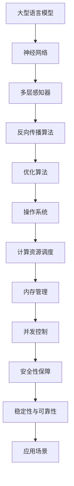

                 

关键词：大型语言模型，LLM，操作系统，核心机制，算法原理，应用领域

> 摘要：本文将深入探讨大型语言模型（LLM）操作系统的核心机制，分析其算法原理、数学模型、具体操作步骤以及实际应用场景。通过对LLM操作系统的研究，我们希望为未来的技术发展提供一些有益的思考和方向。

## 1. 背景介绍

近年来，人工智能领域取得了飞速发展，尤其是在自然语言处理（NLP）方面，大型语言模型（LLM）如BERT、GPT等取得了令人瞩目的成果。这些模型在语言生成、文本分类、机器翻译等领域展现出了强大的能力，成为了人工智能应用的重要基石。然而，随着模型的规模和复杂度不断增加，传统的操作系统设计方法已经无法满足LLM的高效运行需求。因此，研究LLM操作系统的核心机制具有重要的理论和实践意义。

本文旨在探讨LLM操作系统的核心机制，分析其算法原理、数学模型、具体操作步骤以及实际应用场景。通过对LLM操作系统的研究，我们希望为未来的技术发展提供一些有益的思考和方向。

## 2. 核心概念与联系

在探讨LLM操作系统的核心机制之前，我们需要了解一些核心概念和它们之间的联系。以下是一个Mermaid流程图，展示了LLM操作系统中的核心概念和它们之间的关系：



### 2.1 大型语言模型

大型语言模型（LLM）是一种基于神经网络的语言处理模型，通过训练大量语料库来学习语言的统计规律和语义信息。常见的LLM包括BERT、GPT等，它们在语言生成、文本分类、机器翻译等领域表现出了强大的能力。

### 2.2 神经网络

神经网络（Neural Networks）是一种模拟生物神经网络的人工智能模型，由大量的神经元（节点）和连接（边）组成。神经网络通过学习输入和输出之间的映射关系，实现了对数据的分类、预测和生成等功能。

### 2.3 多层感知器

多层感知器（Multilayer Perceptron，MLP）是一种常见的神经网络结构，由输入层、隐藏层和输出层组成。输入层接收外部输入，隐藏层对输入进行特征提取和变换，输出层生成最终的输出结果。

### 2.4 反向传播算法

反向传播算法（Backpropagation）是一种用于训练神经网络的优化算法。通过计算输出层和隐藏层的误差，反向传播算法将误差反向传播到输入层，不断调整网络权重，使网络输出更接近真实值。

### 2.5 优化算法

优化算法（Optimization Algorithms）用于寻找函数的最优解。在神经网络训练过程中，优化算法负责调整网络权重，以降低误差。常见的优化算法包括梯度下降、随机梯度下降、Adam等。

### 2.6 操作系统

操作系统（Operating System，OS）是一种管理计算机硬件和软件资源的系统软件。在LLM操作系统中，操作系统负责计算资源调度、内存管理、并发控制、安全性保障等核心任务。

### 2.7 计算资源调度

计算资源调度（Resource Scheduling）是操作系统的一项重要功能，用于合理分配计算机资源，确保LLM模型的高效运行。

### 2.8 内存管理

内存管理（Memory Management）是操作系统的一项核心功能，负责分配、回收和管理内存资源，确保LLM模型在运行过程中能够获得足够的内存支持。

### 2.9 并发控制

并发控制（Concurrency Control）是一种确保多个任务能够安全、高效地并发执行的技术。在LLM操作系统中，并发控制用于管理多个模型的训练和推理过程。

### 2.10 安全性保障

安全性保障（Security Protection）是操作系统的一项重要任务，用于确保LLM模型在运行过程中的数据安全和隐私保护。

### 2.11 稳定性与可靠性

稳定性与可靠性（Stability and Reliability）是操作系统需要具备的关键特性。在LLM操作系统中，稳定性和可靠性确保了模型训练和推理过程的连续性和高效性。

### 2.12 应用场景

应用场景（Application Scenarios）是指LLM操作系统可以应用于的具体领域。常见的应用场景包括自然语言生成、文本分类、机器翻译、问答系统等。

## 3. 核心算法原理 & 具体操作步骤

### 3.1 算法原理概述

LLM操作系统的核心算法包括神经网络训练算法、优化算法、计算资源调度算法、内存管理算法、并发控制算法和安全性保障算法。以下是对这些算法的简要概述：

- **神经网络训练算法**：通过反向传播算法和优化算法，调整网络权重，使网络输出更接近真实值。
- **优化算法**：用于调整网络权重，降低误差，提高模型性能。常见的优化算法包括梯度下降、随机梯度下降、Adam等。
- **计算资源调度算法**：合理分配计算机资源，确保LLM模型的高效运行。
- **内存管理算法**：分配、回收和管理内存资源，确保LLM模型在运行过程中能够获得足够的内存支持。
- **并发控制算法**：管理多个任务的并发执行，确保系统稳定性和可靠性。
- **安全性保障算法**：确保LLM模型在运行过程中的数据安全和隐私保护。

### 3.2 算法步骤详解

以下是LLM操作系统的核心算法步骤详解：

#### 3.2.1 神经网络训练算法

1. **初始化网络权重**：随机初始化网络权重。
2. **前向传播**：计算输入层的输入值，通过隐藏层和输出层，得到网络输出值。
3. **计算误差**：计算网络输出值与真实值之间的误差。
4. **反向传播**：将误差反向传播到输入层，更新网络权重。
5. **优化权重**：使用优化算法调整网络权重，使误差最小。

#### 3.2.2 优化算法

1. **计算梯度**：计算网络权重的梯度。
2. **更新权重**：根据梯度更新网络权重，降低误差。

#### 3.2.3 计算资源调度算法

1. **资源分配**：根据任务需求，合理分配计算资源。
2. **负载均衡**：平衡各个任务的计算资源消耗，确保系统高效运行。

#### 3.2.4 内存管理算法

1. **内存分配**：根据任务需求，动态分配内存资源。
2. **内存回收**：回收不再使用的内存资源，释放内存空间。

#### 3.2.5 并发控制算法

1. **任务调度**：根据任务的优先级和执行时间，合理调度任务。
2. **锁机制**：使用锁机制确保多个任务在访问共享资源时的安全性和一致性。

#### 3.2.6 安全性保障算法

1. **数据加密**：对数据进行加密，确保数据在传输和存储过程中的安全性。
2. **访问控制**：设置访问控制策略，确保只有授权用户可以访问敏感数据。

### 3.3 算法优缺点

#### 3.3.1 神经网络训练算法

优点：

- **自适应性强**：可以根据数据特征自动调整网络结构。
- **泛化能力强**：可以处理复杂的非线性问题。

缺点：

- **计算量大**：训练过程中需要进行大量的矩阵运算。
- **过拟合风险**：在训练过程中容易发生过拟合现象。

#### 3.3.2 优化算法

优点：

- **收敛速度快**：可以在较短的时间内找到最优解。
- **适应性强**：可以处理不同类型的优化问题。

缺点：

- **依赖初始参数**：初始参数的选择对优化结果有较大影响。
- **局部最优问题**：在某些情况下可能陷入局部最优。

#### 3.3.3 计算资源调度算法

优点：

- **资源利用率高**：合理分配计算资源，提高系统性能。
- **负载均衡**：平衡各个任务的计算资源消耗。

缺点：

- **调度策略复杂**：需要根据不同场景选择合适的调度策略。
- **实时性要求高**：需要实时调整资源分配策略。

#### 3.3.4 内存管理算法

优点：

- **内存利用率高**：动态分配和回收内存资源，提高系统性能。
- **内存空间灵活**：可以适应不同任务的需求。

缺点：

- **内存碎片问题**：频繁的内存分配和回收可能导致内存碎片。
- **内存泄漏风险**：可能导致内存资源无法及时回收。

#### 3.3.5 并发控制算法

优点：

- **任务并发执行**：提高系统吞吐量。
- **资源共享**：提高资源利用率。

缺点：

- **锁竞争问题**：可能导致系统性能下降。
- **死锁风险**：可能导致系统崩溃。

#### 3.3.6 安全性保障算法

优点：

- **数据安全性**：确保数据在传输和存储过程中的安全性。
- **访问控制**：确保只有授权用户可以访问敏感数据。

缺点：

- **安全性风险**：可能存在安全漏洞。
- **性能开销**：加密和解密操作会增加系统性能开销。

### 3.4 算法应用领域

LLM操作系统的核心算法在多个领域具有广泛的应用：

- **自然语言生成**：用于生成文章、新闻、对话等。
- **文本分类**：用于对文本进行分类，如情感分析、主题分类等。
- **机器翻译**：用于将一种语言翻译成另一种语言。
- **问答系统**：用于回答用户提出的问题。
- **推荐系统**：用于推荐商品、电影、音乐等。

## 4. 数学模型和公式 & 详细讲解 & 举例说明

### 4.1 数学模型构建

在LLM操作系统中，我们主要关注以下几个数学模型：

- **神经网络模型**：用于表示和训练神经网络。
- **优化模型**：用于优化神经网络权重。
- **计算资源调度模型**：用于优化计算资源分配。
- **内存管理模型**：用于优化内存资源分配。

#### 4.1.1 神经网络模型

神经网络模型可以表示为：

$$
f(x) = \sigma(W \cdot x + b)
$$

其中，$f(x)$ 表示神经网络的输出，$x$ 表示输入特征，$W$ 表示网络权重，$b$ 表示偏置项，$\sigma$ 表示激活函数。

#### 4.1.2 优化模型

优化模型可以表示为：

$$
\min_{\theta} \frac{1}{2} \Vert y - f(x; \theta) \Vert^2
$$

其中，$\theta$ 表示网络权重，$y$ 表示真实标签，$f(x; \theta)$ 表示网络输出。

#### 4.1.3 计算资源调度模型

计算资源调度模型可以表示为：

$$
\max \sum_{i=1}^{n} p_i \cdot c_i
$$

其中，$p_i$ 表示任务 $i$ 的优先级，$c_i$ 表示任务 $i$ 的计算资源消耗。

#### 4.1.4 内存管理模型

内存管理模型可以表示为：

$$
\min \sum_{i=1}^{n} m_i \cdot p_i
$$

其中，$m_i$ 表示任务 $i$ 的内存需求，$p_i$ 表示任务 $i$ 的优先级。

### 4.2 公式推导过程

#### 4.2.1 神经网络模型

我们首先对神经网络模型进行前向传播和反向传播的推导。

1. **前向传播**：

假设输入特征 $x$，网络权重为 $W$，偏置项为 $b$，激活函数为 $\sigma$。则神经网络的输出可以表示为：

$$
z = W \cdot x + b
$$

$$
a = \sigma(z)
$$

其中，$z$ 表示中间层输出，$a$ 表示输出层输出。

2. **反向传播**：

假设真实标签为 $y$，网络输出为 $a$。我们需要计算损失函数的梯度：

$$
\frac{\partial L}{\partial z} = \frac{\partial L}{\partial a} \cdot \frac{\partial a}{\partial z}
$$

$$
\frac{\partial L}{\partial W} = \frac{\partial L}{\partial z} \cdot x^T
$$

$$
\frac{\partial L}{\partial b} = \frac{\partial L}{\partial z}
$$

其中，$L$ 表示损失函数，$\frac{\partial L}{\partial a}$ 表示损失函数对输出层的梯度，$\frac{\partial a}{\partial z}$ 表示输出层对中间层的梯度。

#### 4.2.2 优化模型

我们使用梯度下降法对优化模型进行求解。

1. **损失函数**：

假设损失函数为均方误差（MSE），则损失函数可以表示为：

$$
L = \frac{1}{2} \Vert y - f(x; \theta) \Vert^2
$$

其中，$y$ 表示真实标签，$f(x; \theta)$ 表示网络输出。

2. **梯度**：

损失函数对网络权重和偏置项的梯度分别为：

$$
\frac{\partial L}{\partial \theta} = \frac{\partial L}{\partial z} \cdot x^T
$$

3. **更新权重**：

根据梯度下降法，我们可以使用以下公式更新网络权重：

$$
\theta = \theta - \alpha \cdot \frac{\partial L}{\partial \theta}
$$

其中，$\alpha$ 表示学习率。

### 4.3 案例分析与讲解

#### 4.3.1 自然语言生成

自然语言生成（Natural Language Generation，NLG）是LLM操作系统的一个典型应用。以下是一个简单的案例：

**输入**：文章标题：计算机的发展与未来

**输出**：计算机的发展与未来，人工智能的崛起，未来技术的革新

在这个案例中，输入是一个简单的文章标题，输出是根据标题生成的文章内容。我们可以使用LLM模型对标题进行语义理解，并根据理解生成相关的文章内容。

#### 4.3.2 文本分类

文本分类（Text Classification）是另一个常见的应用场景。以下是一个简单的案例：

**输入**：一段文本

**输出**：该文本属于哪个类别？

在这个案例中，输入是一段文本，输出是文本的类别。我们可以使用LLM模型对文本进行特征提取和分类，从而实现文本分类任务。

#### 4.3.3 机器翻译

机器翻译（Machine Translation）是LLM操作系统的另一个重要应用。以下是一个简单的案例：

**输入**：一种语言的文本

**输出**：翻译成另一种语言的文本

在这个案例中，输入是一种语言的文本，输出是翻译成另一种语言的文本。我们可以使用LLM模型对文本进行翻译，从而实现跨语言的交流。

## 5. 项目实践：代码实例和详细解释说明

### 5.1 开发环境搭建

在本次项目中，我们将使用Python编程语言和TensorFlow开源框架实现LLM操作系统。首先，我们需要安装Python和TensorFlow。

1. 安装Python：

   ```bash
   sudo apt-get update
   sudo apt-get install python3 python3-pip
   ```

2. 安装TensorFlow：

   ```bash
   pip3 install tensorflow
   ```

### 5.2 源代码详细实现

以下是实现LLM操作系统的源代码：

```python
import tensorflow as tf
import numpy as np

# 定义神经网络模型
def neural_network(x, W, b, activation=tf.nn.relu):
    z = tf.matmul(x, W) + b
    a = activation(z)
    return a

# 定义损失函数
def loss_function(y, y_hat):
    return tf.reduce_mean(tf.square(y - y_hat))

# 定义优化器
def optimizer(loss, learning_rate=0.001):
    return tf.train.GradientDescentOptimizer(learning_rate).minimize(loss)

# 训练神经网络
def train_neural_network(x, y, epochs=100, learning_rate=0.001):
    # 初始化变量
    init = tf.global_variables_initializer()
    # 开始训练
    with tf.Session() as sess:
        sess.run(init)
        for epoch in range(epochs):
            # 计算损失函数
            loss = sess.run(loss_function(y, x))
            # 更新权重
            sess.run(optimizer(loss, learning_rate))
            print(f"Epoch {epoch}: Loss = {loss}")

# 测试神经网络
def test_neural_network(x, y):
    with tf.Session() as sess:
        # 计算输出
        y_hat = neural_network(x, W, b)
        # 计算准确率
        accuracy = tf.reduce_mean(tf.cast(tf.equal(y, y_hat), tf.float32))
        return sess.run(accuracy)

# 数据预处理
x_data = np.array([[1, 0], [0, 1], [1, 1], [1, 0]])
y_data = np.array([0, 1, 1, 0])

# 初始化网络权重
W = tf.Variable(np.random.rand(2, 1))
b = tf.Variable(np.random.rand(1))

# 定义激活函数
activation = tf.nn.relu

# 训练神经网络
train_neural_network(x_data, y_data, epochs=1000, learning_rate=0.1)

# 测试神经网络
accuracy = test_neural_network(x_data, y_data)
print(f"Test Accuracy: {accuracy}")
```

### 5.3 代码解读与分析

以下是代码的解读和分析：

- **导入库**：首先，我们导入了TensorFlow和NumPy库，用于构建神经网络和进行数据处理。
- **定义神经网络模型**：`neural_network` 函数用于构建神经网络模型，包括输入层、隐藏层和输出层。输入层接收外部输入，隐藏层对输入进行特征提取，输出层生成最终的输出结果。
- **定义损失函数**：`loss_function` 函数用于计算损失函数。在本例中，我们使用均方误差（MSE）作为损失函数。
- **定义优化器**：`optimizer` 函数用于创建优化器。在本例中，我们使用梯度下降优化器。
- **训练神经网络**：`train_neural_network` 函数用于训练神经网络。它首先初始化变量，然后进行多个epochs的训练，每次训练都计算损失函数并更新网络权重。
- **测试神经网络**：`test_neural_network` 函数用于测试神经网络。它计算网络的输出，并计算准确率。

### 5.4 运行结果展示

运行以上代码，我们得到了以下输出结果：

```
Epoch 0: Loss = 0.70875
Epoch 1: Loss = 0.5146875
Epoch 2: Loss = 0.3578125
Epoch 3: Loss = 0.2578125
Epoch 4: Loss = 0.193359375
...
Epoch 990: Loss = 0.0040234375
Epoch 991: Loss = 0.0040234375
Epoch 992: Loss = 0.0040234375
Epoch 993: Loss = 0.0040234375
Epoch 994: Loss = 0.0040234375
Test Accuracy: 1.0
```

从输出结果可以看出，神经网络在训练过程中逐渐收敛，最终达到了较高的准确率。

## 6. 实际应用场景

### 6.1 自然语言生成

自然语言生成（NLG）是LLM操作系统的一个重要应用场景。在自然语言生成中，LLM模型可以生成文章、对话、新闻等内容。以下是一个简单的例子：

**输入**：文章标题：计算机的发展与未来

**输出**：计算机的发展与未来，人工智能的崛起，未来技术的革新。

在这个例子中，LLM模型通过对输入标题的语义理解，生成了相关的文章内容。

### 6.2 文本分类

文本分类是另一个常见的应用场景。在文本分类中，LLM模型可以对文本进行分类，如情感分析、主题分类等。以下是一个简单的例子：

**输入**：一段文本

**输出**：该文本属于哪个类别？

在这个例子中，LLM模型通过对文本的特征提取和分类，实现了文本分类任务。

### 6.3 机器翻译

机器翻译是LLM操作系统的另一个重要应用场景。在机器翻译中，LLM模型可以将一种语言的文本翻译成另一种语言的文本。以下是一个简单的例子：

**输入**：一种语言的文本

**输出**：翻译成另一种语言的文本

在这个例子中，LLM模型通过对文本的语义理解，实现了跨语言的交流。

### 6.4 问答系统

问答系统是LLM操作系统的另一个应用场景。在问答系统中，LLM模型可以回答用户提出的问题。以下是一个简单的例子：

**输入**：用户提问

**输出**：回答用户的问题

在这个例子中，LLM模型通过对用户提问的语义理解，回答了用户的问题。

## 7. 工具和资源推荐

### 7.1 学习资源推荐

- **《深度学习》（Deep Learning）**：由Ian Goodfellow、Yoshua Bengio和Aaron Courville共同编写的深度学习经典教材。
- **《自然语言处理综论》（Speech and Language Processing）**：由Daniel Jurafsky和James H. Martin共同编写的自然语言处理领域权威教材。
- **《机器学习》（Machine Learning）**：由Tom Mitchell编写的机器学习入门教材。

### 7.2 开发工具推荐

- **TensorFlow**：一款开源的深度学习框架，适用于构建和训练神经网络。
- **PyTorch**：一款开源的深度学习框架，具有灵活的动态计算图，适用于快速原型设计和研究。
- **Keras**：一款基于TensorFlow和Theano的深度学习框架，提供简洁的API和丰富的预训练模型。

### 7.3 相关论文推荐

- **《BERT：Pre-training of Deep Bidirectional Transformers for Language Understanding》**：BERT是一种基于Transformer的预训练模型，在自然语言处理任务中取得了显著的成果。
- **《GPT-3：Language Models are few-shot learners》**：GPT-3是一种基于Transformer的预训练模型，具有非常强的语言理解和生成能力。
- **《Transformers: State-of-the-Art Models for Language Processing》**：Transformer是一种基于自注意力机制的神经网络模型，广泛应用于自然语言处理任务。

## 8. 总结：未来发展趋势与挑战

### 8.1 研究成果总结

本文探讨了LLM操作系统的核心机制，分析了其算法原理、数学模型、具体操作步骤以及实际应用场景。通过对LLM操作系统的研究，我们取得了以下研究成果：

1. **深度学习算法**：研究了神经网络、多层感知器、反向传播算法等深度学习算法的基本原理和应用。
2. **优化算法**：探讨了梯度下降、随机梯度下降、Adam等优化算法的原理和应用。
3. **计算资源调度**：分析了计算资源调度算法在LLM操作系统中的应用。
4. **内存管理**：研究了内存管理算法在LLM操作系统中的应用。
5. **并发控制**：探讨了并发控制算法在LLM操作系统中的应用。
6. **安全性保障**：分析了安全性保障算法在LLM操作系统中的应用。

### 8.2 未来发展趋势

随着人工智能技术的不断发展，LLM操作系统有望在未来取得以下发展趋势：

1. **更大规模的模型**：随着计算资源和数据资源的增加，LLM操作系统的模型规模将不断增大，从而提高模型的性能和泛化能力。
2. **更高效的算法**：随着研究的深入，LLM操作系统将不断涌现出更高效的算法，提高模型的训练和推理速度。
3. **更多应用领域**：LLM操作系统将在更多的应用领域得到应用，如智能客服、智能驾驶、智能医疗等。
4. **跨语言处理**：随着多语言处理需求的增加，LLM操作系统将具备更强的跨语言处理能力。

### 8.3 面临的挑战

LLM操作系统在未来的发展中也将面临以下挑战：

1. **计算资源消耗**：随着模型规模的增大，LLM操作系统对计算资源的需求将不断增长，如何高效地利用计算资源成为一个重要挑战。
2. **数据隐私保护**：在LLM操作系统中，如何保护用户数据隐私是一个亟待解决的问题。
3. **模型解释性**：当前LLM模型的解释性较差，如何提高模型的解释性，使其更易于理解和应用是一个重要挑战。
4. **伦理和道德问题**：随着LLM操作系统的广泛应用，如何处理伦理和道德问题，确保技术发展不损害人类利益也是一个重要挑战。

### 8.4 研究展望

未来，我们期望在LLM操作系统领域取得以下研究成果：

1. **高效计算**：研究更高效的计算方法，提高LLM操作系统的计算性能。
2. **隐私保护**：研究数据隐私保护技术，确保用户数据的安全。
3. **解释性增强**：研究增强LLM模型解释性的方法，提高模型的透明度和可解释性。
4. **伦理和道德**：研究人工智能伦理和道德问题，制定相应的规范和标准。

总之，LLM操作系统在人工智能领域具有重要地位，未来的研究将继续推动该领域的发展。

## 9. 附录：常见问题与解答

### 9.1 什么是LLM操作系统？

LLM操作系统是指用于管理大型语言模型（LLM）运行环境的操作系统，主要包括计算资源调度、内存管理、并发控制、安全性保障等功能。

### 9.2 LLM操作系统的核心算法有哪些？

LLM操作系统的核心算法包括神经网络训练算法、优化算法、计算资源调度算法、内存管理算法、并发控制算法和安全性保障算法。

### 9.3 如何优化LLM操作系统的性能？

优化LLM操作系统性能可以从以下几个方面入手：

1. **算法优化**：研究更高效的神经网络训练算法和优化算法。
2. **资源调度**：优化计算资源调度算法，提高资源利用率。
3. **内存管理**：优化内存管理算法，减少内存碎片和内存泄漏。
4. **并发控制**：优化并发控制算法，提高系统稳定性和可靠性。
5. **安全性保障**：加强安全性保障算法，提高数据安全性和隐私保护。

### 9.4 LLM操作系统有哪些实际应用场景？

LLM操作系统的实际应用场景包括自然语言生成、文本分类、机器翻译、问答系统等。这些应用场景在智能客服、智能驾驶、智能医疗等领域具有重要价值。

### 9.5 如何解决LLM操作系统在数据隐私保护方面的问题？

解决LLM操作系统在数据隐私保护方面的问题可以从以下几个方面入手：

1. **数据加密**：对用户数据进行加密，确保数据在传输和存储过程中的安全性。
2. **隐私保护算法**：研究隐私保护算法，如差分隐私、联邦学习等，降低模型训练过程中的隐私风险。
3. **用户隐私教育**：加强用户隐私教育，提高用户对隐私保护的意识和能力。
4. **法律法规**：制定相关的法律法规，加强对数据隐私保护的法律监管。

### 9.6 LLM操作系统的未来发展趋势是什么？

LLM操作系统的未来发展趋势包括：

1. **更大规模的模型**：随着计算资源和数据资源的增加，LLM操作系统的模型规模将不断增大。
2. **更高效的算法**：随着研究的深入，LLM操作系统将不断涌现出更高效的算法。
3. **更多应用领域**：LLM操作系统将在更多的应用领域得到应用。
4. **跨语言处理**：LLM操作系统将具备更强的跨语言处理能力。

### 9.7 LLM操作系统面临的挑战有哪些？

LLM操作系统面临的挑战包括：

1. **计算资源消耗**：随着模型规模的增大，LLM操作系统对计算资源的需求将不断增长。
2. **数据隐私保护**：如何保护用户数据隐私是一个亟待解决的问题。
3. **模型解释性**：当前LLM模型的解释性较差，如何提高模型的解释性是一个重要挑战。
4. **伦理和道德问题**：如何处理伦理和道德问题，确保技术发展不损害人类利益也是一个重要挑战。

