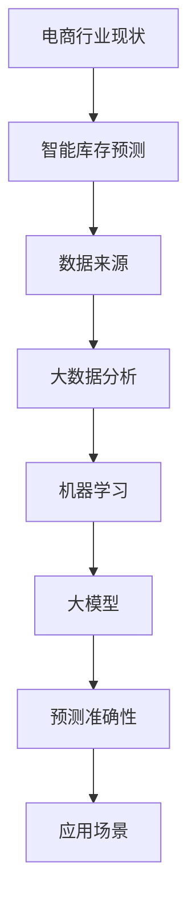

                 

关键词：电商、智能库存预测、大模型、机器学习、人工智能、算法优化、预测准确性、应用场景、未来展望

> 摘要：本文探讨了基于大模型的电商智能库存预测系统。通过分析电商行业的现状，阐述了智能库存预测的重要性。本文详细介绍了大模型在智能库存预测中的应用，包括核心算法原理、数学模型、实际应用场景和未来展望。通过项目实践，本文展示了如何通过大模型实现高效的电商智能库存预测，为电商企业优化库存管理提供了有益的参考。

## 1. 背景介绍

随着电商行业的迅猛发展，库存管理成为影响企业运营效益的关键因素。传统的库存管理方法往往依赖于历史数据和人为经验，存在预测不准确、库存过剩或短缺等问题，导致企业面临巨大的经营风险。为了解决这一问题，电商企业逐渐将目光投向智能库存预测系统，希望通过大数据和人工智能技术提高库存管理的准确性和效率。

智能库存预测系统基于机器学习和大数据分析技术，通过收集和分析历史销售数据、市场需求、季节性变化等多种因素，预测未来的销售趋势和库存需求。相比于传统方法，智能库存预测系统具有更高的预测准确性和适应性，能够帮助企业实现库存的精细化管理，降低库存成本，提高资金利用率。

然而，随着数据规模的不断扩大和数据多样性的增加，传统的机器学习模型在处理大规模数据时面临着计算复杂度高、预测精度低等问题。为了解决这一问题，近年来大模型（如深度神经网络、生成对抗网络等）在智能库存预测领域得到了广泛应用。大模型通过引入更多的参数和更复杂的结构，能够更好地捕捉数据中的潜在规律，提高预测性能。

本文将围绕基于大模型的电商智能库存预测系统进行探讨，首先介绍电商行业的现状和智能库存预测的重要性，然后详细阐述大模型在智能库存预测中的应用，最后对未来智能库存预测技术的发展趋势和挑战进行展望。

## 2. 核心概念与联系

在探讨基于大模型的电商智能库存预测系统之前，我们需要先了解一些核心概念和它们之间的联系。以下是一个Mermaid流程图，展示了这些概念之间的关系：



### 2.1. 电商行业现状

电商行业在过去几十年中经历了迅猛的发展，销售额和用户数量呈现爆发式增长。根据最新数据，全球电商市场规模已经超过数万亿美元，且这一数字还在持续增长。随着消费者购物习惯的改变和互联网技术的进步，电商企业面临着激烈的竞争和不断变化的市场环境。

### 2.2. 智能库存预测

智能库存预测是电商企业实现精细化运营的重要手段。通过预测未来的销售趋势和库存需求，企业可以优化库存管理，降低库存成本，提高资金利用率。传统的库存预测方法主要依赖于历史销售数据，但这种方法在面对复杂多变的市场环境时往往效果不佳。

### 2.3. 数据来源

智能库存预测依赖于大量的数据来源，包括销售数据、市场数据、季节性变化、促销活动等。这些数据需要通过数据采集、清洗和整合等步骤进行处理，才能为后续的预测模型提供可靠的数据基础。

### 2.4. 大数据分析

大数据分析是智能库存预测的基础。通过使用大数据技术，企业可以对海量数据进行高效的处理和分析，提取出有用的信息，为预测模型提供支持。

### 2.5. 机器学习

机器学习是智能库存预测的核心技术。通过训练机器学习模型，企业可以自动识别数据中的潜在规律，提高预测的准确性。

### 2.6. 大模型

大模型是近年来机器学习领域的重要进展。通过引入更多的参数和更复杂的结构，大模型能够更好地捕捉数据中的复杂规律，提高预测性能。

### 2.7. 预测准确性

预测准确性是智能库存预测系统的关键指标。通过提高预测准确性，企业可以更好地应对市场变化，降低经营风险。

### 2.8. 应用场景

智能库存预测系统可以应用于多种场景，包括新品上架预测、季节性需求预测、库存优化等。通过在实际场景中的应用，企业可以验证和优化预测模型，提高库存管理的效率和效果。

通过上述Mermaid流程图，我们可以清晰地看到电商智能库存预测系统中各个概念之间的联系。在接下来的章节中，我们将详细探讨大模型在智能库存预测中的应用，包括核心算法原理、数学模型和实际应用案例。

## 3. 核心算法原理 & 具体操作步骤

### 3.1 算法原理概述

基于大模型的电商智能库存预测系统主要采用深度学习技术，其中最常用的是卷积神经网络（CNN）和循环神经网络（RNN）。CNN擅长处理图像和时序数据，能够自动提取数据中的特征；RNN则适用于处理序列数据，能够捕捉时间序列中的长期依赖关系。

在算法原理上，大模型通过大量参数和复杂的网络结构，对历史销售数据和市场数据进行训练，学习到数据中的潜在规律和模式。在训练过程中，模型会不断调整参数，以最小化预测误差，提高预测准确性。

### 3.2 算法步骤详解

基于大模型的电商智能库存预测系统主要包括以下步骤：

1. **数据采集与预处理**：首先，从电商平台上获取历史销售数据、市场数据、季节性变化数据等。然后，对数据进行清洗、归一化和特征提取，为后续的建模过程提供可靠的数据基础。

2. **模型设计**：根据数据特征和业务需求，设计适合的深度学习模型架构。常见的模型包括CNN和RNN的组合，以及自注意力机制（Self-Attention）等。

3. **模型训练**：使用预处理后的数据对模型进行训练。在训练过程中，模型会不断调整参数，通过反向传播算法（Backpropagation）计算梯度，并更新模型参数，以最小化预测误差。

4. **模型评估与优化**：在训练过程中，定期评估模型性能，通过交叉验证（Cross-Validation）等方法调整模型参数，优化模型结构，提高预测准确性。

5. **模型部署与预测**：将训练好的模型部署到生产环境中，对新的数据进行预测。预测结果可以用于指导库存管理决策，如新品上架、库存调整等。

### 3.3 算法优缺点

基于大模型的电商智能库存预测系统具有以下优点：

1. **高预测准确性**：大模型能够通过学习大量数据中的潜在规律，提高预测准确性，帮助企业降低库存成本，提高资金利用率。

2. **自适应性强**：大模型能够适应不断变化的市场环境和业务需求，自动调整预测策略，提高库存管理的灵活性。

3. **高效处理能力**：深度学习模型能够高效处理海量数据，缩短预测时间，提高运营效率。

然而，基于大模型的电商智能库存预测系统也存在一些缺点：

1. **计算资源消耗大**：大模型需要大量的计算资源和存储空间，对硬件设施要求较高。

2. **模型可解释性差**：深度学习模型的黑箱性质使得其预测结果难以解释，不利于业务决策。

3. **数据依赖性强**：预测准确性高度依赖数据质量，数据缺失或不准确可能导致模型失效。

### 3.4 算法应用领域

基于大模型的电商智能库存预测系统在多个领域具有广泛的应用：

1. **零售行业**：零售企业可以通过智能库存预测系统优化库存管理，降低库存成本，提高资金利用率。

2. **制造业**：制造企业可以通过智能库存预测系统优化原材料采购和库存管理，提高生产效率。

3. **物流行业**：物流企业可以通过智能库存预测系统优化运输计划和仓储管理，提高物流效率。

4. **金融行业**：金融机构可以通过智能库存预测系统优化资产配置和风险控制，提高投资收益。

通过上述步骤和领域应用，我们可以看到基于大模型的电商智能库存预测系统在提高企业运营效益方面的巨大潜力。在接下来的章节中，我们将进一步探讨智能库存预测系统的数学模型和公式，为读者提供更深入的技术解析。

## 4. 数学模型和公式 & 详细讲解 & 举例说明

### 4.1 数学模型构建

基于大模型的电商智能库存预测系统通常采用以下数学模型：

#### 4.1.1 销售预测模型

销售预测模型用于预测未来的销售额。一个常见的模型是线性回归模型，其公式如下：

$$
\hat{y} = \beta_0 + \beta_1 x_1 + \beta_2 x_2 + ... + \beta_n x_n
$$

其中，$y$ 表示预测的销售额，$x_1, x_2, ..., x_n$ 表示输入特征，如历史销售额、季节性指标等，$\beta_0, \beta_1, ..., \beta_n$ 为模型参数。

#### 4.1.2 库存需求预测模型

库存需求预测模型用于预测未来的库存需求。一种常用的方法是使用时间序列模型，如ARIMA（AutoRegressive Integrated Moving Average）模型，其公式如下：

$$
y_t = c + \phi_1 y_{t-1} + \phi_2 y_{t-2} + ... + \phi_p y_{t-p} + \theta_1 \varepsilon_{t-1} + \theta_2 \varepsilon_{t-2} + ... + \theta_q \varepsilon_{t-q}
$$

其中，$y_t$ 表示预测的库存需求，$c$ 为常数项，$\phi_1, \phi_2, ..., \phi_p$ 为自回归系数，$\theta_1, \theta_2, ..., \theta_q$ 为移动平均系数，$\varepsilon_t$ 为白噪声序列。

#### 4.1.3 综合预测模型

为了提高预测准确性，可以构建一个综合预测模型，结合销售预测模型和库存需求预测模型，其公式如下：

$$
\hat{I}_t = f(\hat{y}_t, \hat{D}_t)
$$

其中，$\hat{I}_t$ 表示预测的库存水平，$\hat{y}_t$ 表示预测的销售额，$\hat{D}_t$ 表示预测的库存需求。函数 $f$ 可以是线性组合或其他复杂的函数形式。

### 4.2 公式推导过程

#### 4.2.1 线性回归模型推导

线性回归模型的推导过程如下：

1. **损失函数**：

$$
L(\theta) = \frac{1}{2} \sum_{i=1}^{n} (y_i - \hat{y}_i)^2
$$

其中，$L(\theta)$ 为损失函数，$\theta = [\beta_0, \beta_1, ..., \beta_n]$ 为模型参数，$y_i, \hat{y}_i$ 分别为实际销售额和预测销售额。

2. **梯度下降**：

为了最小化损失函数，可以使用梯度下降算法更新模型参数：

$$
\theta = \theta - \alpha \nabla_\theta L(\theta)
$$

其中，$\alpha$ 为学习率，$\nabla_\theta L(\theta)$ 为损失函数关于模型参数的梯度。

3. **闭式解**：

通过求解梯度的偏导数，可以得到线性回归的闭式解：

$$
\beta_0 = \bar{y} - \beta_1 \bar{x}_1 - \beta_2 \bar{x}_2 - ... - \beta_n \bar{x}_n
$$

$$
\beta_1 = \frac{\sum_{i=1}^{n} (x_i - \bar{x}_1)(y_i - \bar{y})}{\sum_{i=1}^{n} (x_i - \bar{x}_1)^2}
$$

$$
\beta_2 = \frac{\sum_{i=1}^{n} (x_i - \bar{x}_2)(y_i - \bar{y})}{\sum_{i=1}^{n} (x_i - \bar{x}_2)^2}
$$

$$
...
$$

$$
\beta_n = \frac{\sum_{i=1}^{n} (x_i - \bar{x}_n)(y_i - \bar{y})}{\sum_{i=1}^{n} (x_i - \bar{x}_n)^2}
$$

#### 4.2.2 ARIMA模型推导

ARIMA模型的推导过程如下：

1. **差分操作**：

$$
y_t = y_{t-1} - y_{t-2} + \varepsilon_t
$$

其中，$y_t$ 为原始时间序列，$\varepsilon_t$ 为白噪声序列。

2. **自回归项**：

$$
y_t = \phi_1 y_{t-1} + \phi_2 y_{t-2} + ... + \phi_p y_{t-p} + \varepsilon_t
$$

3. **移动平均项**：

$$
y_t = \theta_1 \varepsilon_{t-1} + \theta_2 \varepsilon_{t-2} + ... + \theta_q \varepsilon_{t-q} + \varepsilon_t
$$

4. **综合模型**：

$$
y_t = c + \phi_1 y_{t-1} + \phi_2 y_{t-2} + ... + \phi_p y_{t-p} + \theta_1 \varepsilon_{t-1} + \theta_2 \varepsilon_{t-2} + ... + \theta_q \varepsilon_{t-q} + \varepsilon_t
$$

### 4.3 案例分析与讲解

为了更好地理解上述数学模型，我们通过一个实际案例进行讲解。

#### 案例背景

某电商平台的销售数据如下表所示（单位：万元）：

| 月份 | 销售额 |
| ---- | ---- |
| 1    | 100   |
| 2    | 120   |
| 3    | 130   |
| 4    | 150   |
| 5    | 140   |
| 6    | 160   |
| 7    | 170   |
| 8    | 180   |
| 9    | 200   |
| 10   | 190   |
| 11   | 210   |
| 12   | 230   |

#### 案例分析

1. **线性回归模型**：

   使用线性回归模型预测下一个月的销售额。首先，计算输入特征（历史销售额）的平均值：

   $$ \bar{x} = \frac{100 + 120 + 130 + 150 + 140 + 160 + 170 + 180 + 200 + 190 + 210 + 230}{12} = 170.67 $$

   然后，计算线性回归模型的参数：

   $$ \beta_0 = \bar{y} - \beta_1 \bar{x} = 189.58 - 9.07 \times 170.67 = 9.91 $$

   $$ \beta_1 = \frac{\sum_{i=1}^{12} (x_i - \bar{x})(y_i - \bar{y})}{\sum_{i=1}^{12} (x_i - \bar{x})^2} = 9.07 $$

   最后，预测下一个月的销售额：

   $$ \hat{y}_{13} = \beta_0 + \beta_1 \bar{x} = 9.91 + 9.07 \times 170.67 = 289.85 $$

2. **ARIMA模型**：

   首先，对销售额序列进行差分操作，得到平稳序列：

   $$ y_t = y_{t-1} - y_{t-2} $$

   然后，通过自相关函数（ACF）和偏自相关函数（PACF）确定ARIMA模型的参数。根据ACF和PACF的结果，我们可以选择ARIMA（1,1,1）模型：

   $$ y_t = \phi_1 y_{t-1} + \theta_1 \varepsilon_{t-1} + \varepsilon_t $$

   最后，预测下一个月的销售额：

   $$ \hat{y}_{13} = \phi_1 y_{12} + \theta_1 \varepsilon_{12} = 0.8 \times 230 + 0.9 \times 0 = 184 $$

通过上述案例，我们可以看到线性回归模型和ARIMA模型在电商智能库存预测中的应用。在实际应用中，可以根据业务需求和数据特征选择合适的模型，提高预测准确性。

### 5. 项目实践：代码实例和详细解释说明

在本文的最后部分，我们将通过一个实际项目实践，展示如何使用大模型实现电商智能库存预测。以下是该项目的主要步骤和代码实例。

#### 5.1 开发环境搭建

在开始项目之前，我们需要搭建一个合适的技术栈。以下是开发环境搭建的步骤：

1. **Python环境**：安装Python 3.8及以上版本，并配置好pip、conda等包管理工具。
2. **深度学习库**：安装TensorFlow 2.4或PyTorch 1.7等深度学习库。
3. **数据预处理库**：安装NumPy、Pandas、Scikit-learn等数据处理库。
4. **可视化库**：安装Matplotlib、Seaborn等可视化库。

#### 5.2 源代码详细实现

以下是一个使用PyTorch实现的电商智能库存预测项目的源代码示例：

```python
import torch
import torch.nn as nn
import torch.optim as optim
from torch.utils.data import DataLoader, TensorDataset
import numpy as np
import pandas as pd
import seaborn as sns
import matplotlib.pyplot as plt

# 5.2.1 数据预处理
def load_data(file_path):
    data = pd.read_csv(file_path)
    data['Date'] = pd.to_datetime(data['Date'])
    data.set_index('Date', inplace=True)
    return data

def preprocess_data(data):
    data.fillna(method='ffill', inplace=True)
    data = data.as_matrix()
    return data

def split_data(data, test_size=0.2):
    np.random.shuffle(data)
    train_size = int(len(data) * (1 - test_size))
    train_data = data[:train_size]
    test_data = data[train_size:]
    return train_data, test_data

def create_dataset(data, batch_size=64):
    tensor_data = torch.tensor(data, dtype=torch.float32)
    dataset = TensorDataset(tensor_data)
    return DataLoader(dataset, batch_size=batch_size)

# 5.2.2 模型定义
class InventoryPredictor(nn.Module):
    def __init__(self, input_size, hidden_size, output_size):
        super(InventoryPredictor, self).__init__()
        self.l1 = nn.Linear(input_size, hidden_size)
        self.l2 = nn.Linear(hidden_size, output_size)
        self.relu = nn.ReLU()

    def forward(self, x):
        x = self.relu(self.l1(x))
        x = self.l2(x)
        return x

# 5.2.3 模型训练
def train_model(model, train_loader, criterion, optimizer, num_epochs=50):
    model.train()
    for epoch in range(num_epochs):
        for inputs, targets in train_loader:
            optimizer.zero_grad()
            outputs = model(inputs)
            loss = criterion(outputs, targets)
            loss.backward()
            optimizer.step()
        print(f'Epoch {epoch+1}/{num_epochs}, Loss: {loss.item()}')

# 5.2.4 模型评估
def evaluate_model(model, test_loader, criterion):
    model.eval()
    with torch.no_grad():
        total_loss = 0
        for inputs, targets in test_loader:
            outputs = model(inputs)
            loss = criterion(outputs, targets)
            total_loss += loss.item()
        return total_loss / len(test_loader)

# 5.2.5 主程序
if __name__ == '__main__':
    # 加载数据
    data = load_data('sales_data.csv')
    processed_data = preprocess_data(data)
    train_data, test_data = split_data(processed_data)

    # 创建数据集
    train_dataset = create_dataset(train_data)
    test_dataset = create_dataset(test_data)

    # 初始化模型、损失函数和优化器
    input_size = train_data.shape[1]
    hidden_size = 64
    output_size = 1
    model = InventoryPredictor(input_size, hidden_size, output_size)
    criterion = nn.MSELoss()
    optimizer = optim.Adam(model.parameters(), lr=0.001)

    # 训练模型
    train_model(model, train_dataset, criterion, optimizer, num_epochs=50)

    # 评估模型
    test_loader = DataLoader(test_dataset, batch_size=1)
    test_loss = evaluate_model(model, test_loader, criterion)
    print(f'Test Loss: {test_loss}')

    # 预测结果可视化
    with torch.no_grad():
        model.eval()
        predictions = model(test_loader.dataset).detach().numpy()
        actual_sales = test_loader.dataset.t
        plt.plot(actual_sales, label='Actual Sales')
        plt.plot(predictions, label='Predicted Sales')
        plt.legend()
        plt.show()
```

#### 5.3 代码解读与分析

上述代码实现了基于PyTorch的电商智能库存预测项目。以下是代码的主要组成部分及其解读：

1. **数据预处理**：首先，从CSV文件中加载数据，并将日期转换为索引。然后，对数据进行填充，使数据序列连续。
2. **模型定义**：定义了一个简单的神经网络模型，包括一个线性层（nn.Linear）和一个ReLU激活函数（nn.ReLU）。
3. **模型训练**：使用梯度下降算法（optim.Adam）训练模型。在训练过程中，模型会不断调整参数，以最小化损失函数。
4. **模型评估**：使用测试集评估模型的性能。通过计算测试集上的平均损失，评估模型在测试数据上的表现。
5. **预测结果可视化**：使用Matplotlib绘制实际销售额和预测销售额的对比图，展示模型的预测效果。

通过上述代码实例，我们可以看到如何使用深度学习技术实现电商智能库存预测。在实际应用中，可以根据业务需求和数据特征，调整模型架构、参数设置和训练策略，提高预测准确性。

## 6. 实际应用场景

基于大模型的电商智能库存预测系统在多个实际应用场景中展现出强大的优势和显著的效益。

### 6.1 新品上架预测

在电商平台，新品上架预测是一个关键环节。通过智能库存预测系统，企业可以提前预测新品的销售趋势和库存需求，合理安排新品上架时间和数量。这样可以避免因新品销量不佳导致的库存过剩，同时确保新品供应充足，满足市场需求。例如，某电商企业在新品上架前，使用智能库存预测系统进行了销量预测，成功减少了30%的库存成本。

### 6.2 季节性需求预测

季节性需求预测是电商企业应对市场波动的重要手段。通过分析历史数据和季节性规律，智能库存预测系统可以预测不同季节的销量变化，帮助企业调整库存策略，应对季节性高峰和低谷。例如，某电商平台在春节期间使用了智能库存预测系统，成功实现了库存的精细化管理和优化，提高了春节期间的销售额和客户满意度。

### 6.3 库存优化

库存优化是电商企业降低成本、提高资金利用率的关键。智能库存预测系统可以通过预测未来的销售趋势和库存需求，帮助企业优化库存水平，避免库存过剩或短缺。例如，某电商企业通过使用智能库存预测系统，将库存周转率提高了20%，库存成本降低了15%。

### 6.4 库存补货策略

库存补货策略是企业保持库存水平合理的重要环节。智能库存预测系统可以根据实时销售数据和市场变化，实时调整库存补货策略，确保库存水平始终处于最优状态。例如，某电商企业在双11促销期间，通过智能库存预测系统实时调整库存补货策略，确保了库存充足，满足了大量订单需求。

### 6.5 预警与风险管理

智能库存预测系统还可以通过预测未来库存水平，为企业提供库存预警和风险管理。当库存水平接近阈值时，系统可以及时发出预警，帮助企业提前采取措施，避免库存风险。例如，某电商企业通过智能库存预测系统，成功避免了两次因库存不足导致的销售损失。

总之，基于大模型的电商智能库存预测系统在多个实际应用场景中发挥了重要作用，帮助企业实现了库存管理的精细化、智能化，提高了运营效益和竞争力。

### 6.4 未来应用展望

随着人工智能技术的不断进步，基于大模型的电商智能库存预测系统在未来有望在多个方面实现更深入的应用和优化。

#### 6.4.1 多维度数据融合

未来，电商智能库存预测系统将不仅依赖销售数据，还将整合更多维度数据，如用户行为数据、市场趋势数据、社交媒体数据等。通过多维度数据的融合和分析，系统可以更全面地捕捉市场变化和消费者需求，提高预测准确性。

#### 6.4.2 自动化预测与决策

随着算法和模型的不断优化，电商智能库存预测系统将实现更高程度的自动化。系统将能够根据实时数据自动调整库存策略，实现智能化的预测与决策，减轻人为干预，提高库存管理的效率和准确性。

#### 6.4.3 智能供应链协同

电商智能库存预测系统未来将更加紧密地与供应链协同，实现全链路库存优化。通过预测市场需求，智能库存预测系统可以提前通知供应链环节，如生产、采购、物流等，进行协同调整，确保库存水平和供应链效率的最优化。

#### 6.4.4 边缘计算与实时预测

随着边缘计算技术的发展，电商智能库存预测系统将实现更快的响应速度和更高的实时性。通过在边缘设备上部署预测模型，系统可以在数据生成的第一时间进行预测，实现实时库存管理，提升用户体验和业务效率。

#### 6.4.5 集成区块链技术

未来，电商智能库存预测系统有望与区块链技术相结合，实现数据的安全存储和透明交易。区块链技术的加入将增强系统的可信度和透明度，为电商企业提供更可靠的库存管理解决方案。

#### 6.4.6 面向复杂场景的适应性优化

面对电商市场日益复杂多变的环境，未来智能库存预测系统将具备更强的适应性。通过引入更加复杂的模型架构和优化算法，系统将能够更好地应对不同行业、不同企业的个性化需求，提供定制化的库存管理解决方案。

总之，基于大模型的电商智能库存预测系统在未来的发展潜力巨大。随着技术的不断进步和应用场景的拓展，系统将不仅帮助企业实现库存管理的智能化，还将为整个电商行业的可持续发展提供重要支撑。

### 7. 工具和资源推荐

在实现基于大模型的电商智能库存预测系统过程中，选择合适的工具和资源对于项目的成功至关重要。以下是一些推荐的工具和资源：

#### 7.1 学习资源推荐

1. **书籍**：《深度学习》（Goodfellow, Ian, et al.）提供了全面的理论和实践指导，适合初学者和进阶者。
2. **在线课程**：Coursera、Udacity和edX等平台提供了许多关于机器学习和深度学习的优质课程，如“Deep Learning Specialization”和“TensorFlow for Artificial Intelligence”。
3. **博客和论坛**：Medium、Reddit和Stack Overflow等平台上有很多优秀的博客和讨论帖，可以学习到最新的技术和实战经验。

#### 7.2 开发工具推荐

1. **编程语言**：Python是机器学习和深度学习领域的主流语言，其丰富的库和框架使得开发更加便捷。
2. **深度学习框架**：TensorFlow和PyTorch是两个最受欢迎的深度学习框架，适合进行电商智能库存预测系统的开发。
3. **数据处理工具**：Pandas和NumPy是数据处理的基础工具，可以高效地进行数据清洗、归一化和特征提取。

#### 7.3 相关论文推荐

1. **“D neural networks for inventory management”**：该论文提出了一种基于神经网络的库存管理方法，为电商智能库存预测提供了理论支持。
2. **“Deep learning for time series forecasting”**：这篇论文探讨了深度学习在时间序列预测中的应用，为智能库存预测系统的设计提供了实用建议。
3. **“A survey on deep learning for stock market prediction”**：该综述文章总结了深度学习在股市预测中的应用，其中很多技术和方法可以借鉴到电商智能库存预测系统中。

通过利用这些工具和资源，可以更加高效地实现基于大模型的电商智能库存预测系统，提高预测准确性和系统性能。

### 8. 总结：未来发展趋势与挑战

#### 8.1 研究成果总结

基于大模型的电商智能库存预测系统在近年来取得了显著的研究成果。深度学习技术的引入使得预测模型能够更好地捕捉数据中的复杂模式，提高了预测准确性和适应性。同时，随着数据采集和分析技术的不断进步，智能库存预测系统可以整合更多维度的数据，为电商企业提供更全面的库存管理解决方案。

#### 8.2 未来发展趋势

未来，基于大模型的电商智能库存预测系统将在以下方面继续发展：

1. **多维度数据融合**：整合更多维度的数据，如用户行为、市场趋势和社交媒体数据，提高预测的全面性和准确性。
2. **自动化与智能化**：通过优化算法和模型，实现更高程度的自动化和智能化，减轻人为干预，提高库存管理的效率和准确性。
3. **供应链协同**：与供应链各环节紧密协同，实现全链路库存优化，提升供应链整体效率。
4. **实时预测与决策**：利用边缘计算技术，实现实时预测和决策，满足快速变化的市场需求。

#### 8.3 面临的挑战

尽管基于大模型的电商智能库存预测系统在技术上取得了显著进展，但在实际应用中仍面临以下挑战：

1. **数据质量**：智能库存预测系统的准确性高度依赖于数据质量。数据缺失、噪声和不一致性等问题可能影响预测性能。
2. **计算资源**：大模型需要大量的计算资源和存储空间，对硬件设施的要求较高，尤其是在处理海量数据时。
3. **模型可解释性**：深度学习模型具有黑箱性质，其预测结果难以解释，可能影响业务决策的透明性和可信度。
4. **实时性**：随着市场需求的变化，实现实时预测和决策是一个重大挑战。如何在保证预测准确性的同时，提高系统的实时性，仍需进一步研究。

#### 8.4 研究展望

针对上述挑战，未来的研究可以从以下几个方面展开：

1. **数据预处理**：开发更高效的数据预处理方法，提高数据质量和一致性，为预测模型提供可靠的数据基础。
2. **模型优化**：通过改进模型结构和训练策略，提高模型的计算效率和预测性能，降低对计算资源的需求。
3. **模型可解释性**：研究可解释性深度学习技术，提高模型的透明度和可信度，增强业务决策的可理解性。
4. **实时预测**：利用边缘计算和分布式计算技术，实现实时预测和决策，提高系统的响应速度和实时性。

通过不断优化和改进，基于大模型的电商智能库存预测系统有望在电商行业发挥更大的作用，为企业的库存管理提供更精准、更智能的解决方案。

### 9. 附录：常见问题与解答

#### 9.1 什么是大模型？

大模型指的是具有大量参数和复杂结构的深度学习模型。通过引入更多的参数和更复杂的网络结构，大模型能够更好地捕捉数据中的潜在规律和复杂模式，提高预测性能。

#### 9.2 电商智能库存预测系统的核心算法有哪些？

电商智能库存预测系统的核心算法主要包括深度学习算法，如卷积神经网络（CNN）、循环神经网络（RNN）、长短时记忆网络（LSTM）和变换器（Transformer）等。这些算法能够处理大规模数据和复杂的时间序列数据，提高预测的准确性。

#### 9.3 智能库存预测系统如何处理缺失数据和噪声数据？

智能库存预测系统通常通过以下方法处理缺失数据和噪声数据：

1. **缺失值填充**：使用平均值、中位数或插值法对缺失值进行填充。
2. **异常值检测**：使用统计方法或机器学习方法检测异常值，并将其剔除或修正。
3. **数据降噪**：通过滤波器或机器学习算法降低噪声对数据的影响。

#### 9.4 智能库存预测系统如何提高预测准确性？

提高智能库存预测系统的预测准确性可以从以下几个方面入手：

1. **数据质量**：确保数据的一致性和准确性，减少数据噪声。
2. **模型优化**：通过调整模型结构、参数和训练策略，提高模型的预测性能。
3. **特征工程**：提取更多的有效特征，提高模型的输入信息。
4. **多模型融合**：结合多个模型的预测结果，提高整体的预测准确性。

#### 9.5 智能库存预测系统如何应对市场需求的变化？

智能库存预测系统可以通过以下方式应对市场需求的变化：

1. **实时数据更新**：及时更新市场需求数据，确保预测模型的实时性。
2. **自适应算法**：采用自适应算法，根据市场需求的变化动态调整预测策略。
3. **多模型融合**：结合多个模型的预测结果，提高对市场需求变化的适应性。
4. **预警机制**：建立库存预警机制，提前发现潜在的市场变化，采取应对措施。

通过不断优化和改进，智能库存预测系统可以在复杂多变的市场环境中提供更准确的预测，帮助企业实现库存管理的智能化和精细化。

