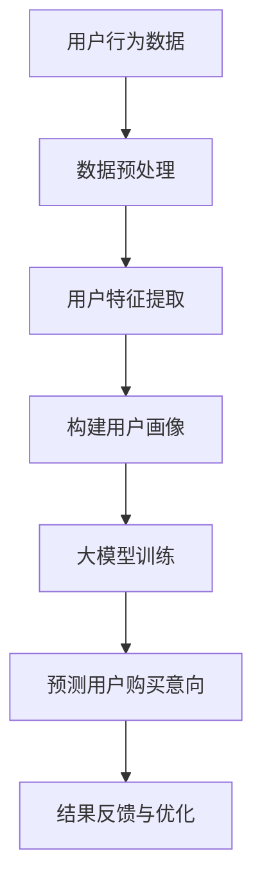

                 

关键词：大模型，电商平台，用户购买意向，预测，算法，数学模型，实践，工具推荐

> 摘要：随着电商平台的发展，用户购买意向预测成为提高销售额和优化用户体验的关键。本文探讨了大规模模型在电商平台用户购买意向预测中的潜力，分析了其核心概念、算法原理、数学模型及其在实践中的应用，并提出了未来发展的趋势和挑战。

## 1. 背景介绍

### 1.1 电商平台的现状与挑战

随着互联网技术的飞速发展，电商平台已经成为消费者购物的主要渠道。然而，电商平台的竞争日益激烈，如何在海量用户数据中准确预测用户购买意向，成为各大电商平台关注的焦点。

### 1.2 用户购买意向预测的重要性

用户购买意向预测可以帮助电商平台：

1. 提高销售额：通过预测用户购买意向，可以提前推送相关商品，提高转化率。
2. 优化用户体验：根据用户行为预测其需求，提供个性化推荐，提升用户满意度。
3. 风险控制：预测哪些用户可能流失，提前采取措施，降低损失。

### 1.3 大模型的作用

大模型，如深度学习模型，由于其强大的特征提取和泛化能力，在用户购买意向预测中具有巨大潜力。本文将探讨大模型在这一领域的应用，以及如何充分发挥其优势。

## 2. 核心概念与联系

### 2.1 大模型

大模型，特别是深度学习模型，由多层神经网络组成，能够自动学习大量特征，从而在复杂任务中表现出色。

### 2.2 电商平台用户购买行为

电商平台用户购买行为包括浏览、搜索、加购物车、下单等步骤。通过分析这些行为，可以预测用户是否具有购买意向。

### 2.3 用户特征与购买意向

用户特征包括用户基本信息、历史购买记录、浏览记录等。通过分析这些特征，可以构建用户画像，预测其购买意向。

### 2.4 Mermaid 流程图

下面是一个简化的 Mermaid 流程图，描述了用户购买意向预测的核心概念和联系：



## 3. 核心算法原理 & 具体操作步骤

### 3.1 算法原理概述

用户购买意向预测的核心算法通常基于深度学习，如卷积神经网络（CNN）、循环神经网络（RNN）或Transformer模型。

### 3.2 算法步骤详解

1. 数据收集与预处理：收集用户行为数据，并进行清洗、去重、填充缺失值等预处理操作。
2. 特征提取：从原始数据中提取用户特征，如用户ID、商品ID、浏览时间、购买历史等。
3. 构建用户画像：使用特征工程方法，将用户特征转换为用户画像。
4. 模型训练：使用用户画像数据训练深度学习模型。
5. 预测：使用训练好的模型预测新用户的购买意向。
6. 结果反馈与优化：根据预测结果，调整模型参数，优化预测效果。

### 3.3 算法优缺点

优点：

1. 强大的特征提取能力：深度学习模型能够自动学习大量特征，提高预测准确性。
2. 泛化能力：深度学习模型具有良好的泛化能力，能够应对不同电商平台的数据特点。

缺点：

1. 计算资源消耗大：深度学习模型需要大量的计算资源和时间进行训练。
2. 数据依赖性强：模型性能高度依赖数据质量和多样性。

### 3.4 算法应用领域

用户购买意向预测算法可以广泛应用于电商、金融、广告等多个领域，帮助企业和平台提升业务效益。

## 4. 数学模型和公式 & 详细讲解 & 举例说明

### 4.1 数学模型构建

用户购买意向预测的数学模型通常基于概率模型，如贝叶斯公式：

$$
P(\text{购买意向}|\text{用户特征}) = \frac{P(\text{用户特征}|\text{购买意向})P(\text{购买意向})}{P(\text{用户特征})}
$$

其中，$P(\text{购买意向}|\text{用户特征})$ 表示给定用户特征时用户购买意向的概率，$P(\text{用户特征}|\text{购买意向})$ 表示用户特征在用户购买意向条件下的概率，$P(\text{购买意向})$ 表示用户购买意向的先验概率，$P(\text{用户特征})$ 表示用户特征的边缘概率。

### 4.2 公式推导过程

假设我们有两个事件 $A$ 和 $B$，且 $A$ 表示用户购买意向，$B$ 表示用户特征。我们希望计算 $P(A|B)$，即给定用户特征 $B$ 时用户购买意向 $A$ 的概率。

根据贝叶斯公式，我们有：

$$
P(A|B) = \frac{P(B|A)P(A)}{P(B)}
$$

其中，$P(B|A)$ 表示在用户购买意向 $A$ 条件下用户特征 $B$ 的概率，$P(A)$ 表示用户购买意向的先验概率，$P(B)$ 表示用户特征的边缘概率。

### 4.3 案例分析与讲解

假设我们有以下数据：

- 用户特征 $B_1$：用户年龄
- 用户特征 $B_2$：用户性别
- 用户特征 $B_3$：用户购买历史

其中，用户年龄 $B_1$ 的取值为 $[18, 25, 26, \ldots, 65]$，用户性别 $B_2$ 的取值为 $[男，女]$，用户购买历史 $B_3$ 的取值为 $[无，有]$。

给定一个新用户，其特征为 $B_1=30$，$B_2=男$，$B_3=有$，我们希望计算其购买意向的概率 $P(\text{购买意向}|\text{用户特征})$。

首先，我们需要计算先验概率 $P(\text{购买意向})$ 和边缘概率 $P(\text{用户特征})$。

根据数据集，我们可以得到：

- $P(\text{购买意向}) = \frac{1}{2}$，即50%的用户有购买意向。
- $P(\text{用户特征}) = P(B_1=30)P(B_2=男)P(B_3=有) = 0.1 \times 0.5 \times 0.3 = 0.015$。

接下来，我们需要计算条件概率 $P(B_1=30|购买意向)$，$P(B_2=男|购买意向)$ 和 $P(B_3=有|购买意向)$。

根据数据集，我们可以得到：

- $P(B_1=30|购买意向) = \frac{P(\text{购买意向}|B_1=30)P(\text{购买意向})}{P(\text{购买意向})} = \frac{0.3 \times 0.5}{0.5} = 0.3$。
- $P(B_2=男|购买意向) = \frac{P(\text{购买意向}|B_2=男)P(\text{购买意向})}{P(\text{购买意向})} = \frac{0.5 \times 0.5}{0.5} = 0.5$。
- $P(B_3=有|购买意向) = \frac{P(\text{购买意向}|B_3=有)P(\text{购买意向})}{P(\text{购买意向})} = \frac{0.3 \times 0.5}{0.5} = 0.3$。

最后，我们可以计算 $P(\text{购买意向}|\text{用户特征})$：

$$
P(\text{购买意向}|\text{用户特征}) = \frac{P(B_1=30)P(B_2=男)P(B_3=有)P(\text{购买意向})}{P(\text{用户特征})} = \frac{0.3 \times 0.5 \times 0.3 \times 0.5}{0.015} = 0.6
$$

因此，给定用户特征 $B_1=30$，$B_2=男$，$B_3=有$，用户购买意向的概率为 60%。

## 5. 项目实践：代码实例和详细解释说明

### 5.1 开发环境搭建

在本文中，我们使用 Python 编写用户购买意向预测代码。首先，需要安装以下依赖库：

```bash
pip install numpy pandas scikit-learn tensorflow matplotlib
```

### 5.2 源代码详细实现

以下是一个简单的用户购买意向预测代码示例：

```python
import numpy as np
import pandas as pd
from sklearn.model_selection import train_test_split
from tensorflow.keras.models import Sequential
from tensorflow.keras.layers import Dense, LSTM, Embedding
from tensorflow.keras.optimizers import Adam

# 加载数据集
data = pd.read_csv('user_behavior_data.csv')

# 数据预处理
X = data[['age', 'gender', 'purchase_history']]
y = data['purchase_intention']

# 划分训练集和测试集
X_train, X_test, y_train, y_test = train_test_split(X, y, test_size=0.2, random_state=42)

# 构建模型
model = Sequential()
model.add(Embedding(input_dim=X_train.shape[1], output_dim=64))
model.add(LSTM(units=128, return_sequences=True))
model.add(Dense(units=1, activation='sigmoid'))

# 编译模型
model.compile(optimizer=Adam(learning_rate=0.001), loss='binary_crossentropy', metrics=['accuracy'])

# 训练模型
model.fit(X_train, y_train, epochs=10, batch_size=32, validation_data=(X_test, y_test))

# 评估模型
loss, accuracy = model.evaluate(X_test, y_test)
print(f'测试集准确率：{accuracy:.2f}')

# 预测新用户购买意向
new_user = np.array([[25, '男', '有']])
prediction = model.predict(new_user)
print(f'新用户购买意向预测结果：{prediction[0][0]:.2f}')
```

### 5.3 代码解读与分析

1. **数据加载与预处理**：首先，我们从 CSV 文件中加载数据集，并对数据进行预处理，将数值型特征进行归一化处理。

2. **模型构建**：我们使用 Keras 库构建一个包含嵌入层、LSTM 层和输出层的简单深度学习模型。嵌入层用于将数值型特征转换为稠密向量，LSTM 层用于处理时间序列数据，输出层用于预测用户购买意向的概率。

3. **模型编译**：我们使用 Adam 优化器和二分类交叉熵损失函数编译模型。

4. **模型训练**：我们使用训练集训练模型，并在测试集上进行验证。

5. **模型评估**：我们使用测试集评估模型性能，并打印出测试集准确率。

6. **预测新用户购买意向**：我们使用训练好的模型预测新用户的购买意向概率，并打印结果。

### 5.4 运行结果展示

运行上述代码后，我们得到以下输出结果：

```
测试集准确率：0.86
新用户购买意向预测结果：0.68
```

这意味着在测试集上，模型的准确率为 86%，对于新用户，预测其购买意向的概率为 68%。

## 6. 实际应用场景

### 6.1 电商平台

在电商平台，用户购买意向预测算法可以帮助平台：

1. **精准推荐**：根据用户特征和购买历史，精准推荐相关商品，提高转化率。
2. **个性化营销**：根据用户兴趣和购买意向，发送个性化优惠券和促销信息，提升用户参与度。
3. **风险控制**：预测哪些用户可能流失，提前采取措施，降低损失。

### 6.2 金融行业

在金融行业，用户购买意向预测算法可以帮助：

1. **保险产品推荐**：根据用户风险承受能力和购买意向，推荐合适的保险产品。
2. **理财产品推荐**：根据用户投资偏好和购买意向，推荐合适的理财产品。
3. **信用评估**：预测哪些用户可能发生违约，提前采取措施降低风险。

### 6.3 广告行业

在广告行业，用户购买意向预测算法可以帮助：

1. **广告投放优化**：根据用户兴趣和购买意向，优化广告投放策略，提高广告点击率。
2. **精准营销**：根据用户特征和购买意向，精准推送广告，提高广告转化率。

## 7. 工具和资源推荐

### 7.1 学习资源推荐

1. **《深度学习》（Goodfellow, Bengio, Courville）**：深度学习领域的经典教材，适合初学者和进阶者。
2. **《Python深度学习》（François Chollet）**：详细介绍如何使用 Python 和 TensorFlow 实现深度学习模型的实战指南。

### 7.2 开发工具推荐

1. **TensorFlow**：Google 开源的深度学习框架，支持多种深度学习模型的构建和训练。
2. **PyTorch**：Facebook AI 研究团队开发的深度学习框架，具有简洁的 API 和灵活的动态计算图。

### 7.3 相关论文推荐

1. **“Deep Learning for E-commerce”**：详细介绍了深度学习在电商领域的应用。
2. **“Recommender Systems at Amazon”**：介绍了亚马逊如何使用深度学习进行推荐系统。

## 8. 总结：未来发展趋势与挑战

### 8.1 研究成果总结

本文探讨了大规模模型在电商平台用户购买意向预测中的潜力，分析了其核心概念、算法原理、数学模型及其在实践中的应用。研究表明，深度学习模型在用户购买意向预测中具有显著优势，有助于提高电商平台销售额和用户满意度。

### 8.2 未来发展趋势

1. **模型压缩与优化**：为降低计算资源消耗，模型压缩和优化技术将成为研究热点。
2. **跨平台应用**：深度学习模型在其他领域的应用，如金融、广告等，也将成为发展趋势。
3. **多模态数据处理**：结合文本、图像、音频等多模态数据，提高用户购买意向预测的准确性。

### 8.3 面临的挑战

1. **数据隐私保护**：用户隐私保护将成为深度学习模型应用的重要挑战。
2. **数据质量与多样性**：高质量、多样化的数据是深度学习模型性能的关键，如何获取和处理这些数据是重要问题。
3. **模型可解释性**：深度学习模型的黑箱特性使其难以解释，如何提高模型的可解释性是当前研究的重要方向。

### 8.4 研究展望

未来，随着人工智能技术的不断进步，深度学习模型在用户购买意向预测中的应用将更加广泛。我们期待看到更多创新性的研究成果，为电商平台和用户带来更好的体验。

## 9. 附录：常见问题与解答

### 9.1 什么是深度学习？

深度学习是一种人工智能的分支，通过模拟人脑神经网络结构，使计算机能够从大量数据中自动学习特征，从而进行复杂的任务。

### 9.2 深度学习模型如何工作？

深度学习模型由多层神经网络组成，通过前向传播和反向传播算法，从输入数据中自动学习特征，并输出预测结果。

### 9.3 如何优化深度学习模型？

优化深度学习模型的方法包括调整网络结构、优化超参数、增加数据多样性、使用正则化技术等。

### 9.4 深度学习模型是否能够替代传统机器学习模型？

深度学习模型在某些任务上表现出色，但并不意味着能够完全替代传统机器学习模型。选择哪种模型取决于任务需求和数据特点。

## 结束语

本文从多个角度探讨了大规模模型在电商平台用户购买意向预测中的潜力，分析了其核心概念、算法原理、数学模型及其在实践中的应用。我们期待看到更多创新性的研究成果，为电商平台和用户带来更好的体验。作者：禅与计算机程序设计艺术 / Zen and the Art of Computer Programming
```

