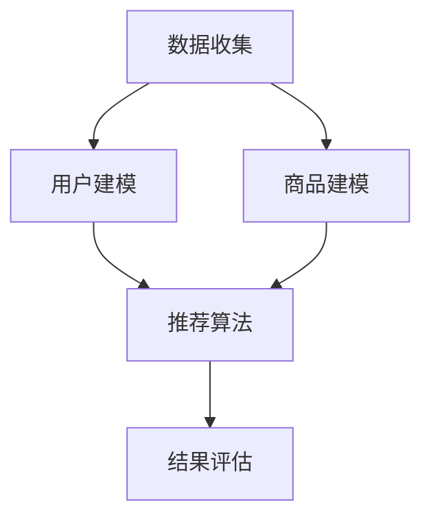

                 

关键词：推荐系统、多样性、新颖性、大模型、平衡、算法原理、数学模型、项目实践、应用场景、工具资源、未来展望

> 摘要：本文旨在深入探讨推荐系统中的多样性与新颖性，以及如何通过大模型实现两者的平衡。在当今信息爆炸的时代，推荐系统已经成为个性化服务和用户体验提升的关键。然而，如何确保推荐结果既具有多样性又能保持新颖性，同时还能适应大规模数据处理的需求，是一个极具挑战性的问题。本文将结合算法原理、数学模型、项目实践以及未来展望，为读者提供全面的解析和指导。

## 1. 背景介绍

推荐系统起源于电子商务和在线媒体领域，旨在根据用户的兴趣和行为习惯，向用户推荐可能感兴趣的商品、内容或服务。随着互联网的普及和大数据技术的发展，推荐系统已成为众多行业提升用户体验和业务增长的重要手段。然而，推荐系统的多样性（diversity）和新颖性（novelty）问题日益凸显。

多样性（Diversity）指的是推荐系统在不同推荐结果之间保持显著的差异，避免用户感到无聊或疲劳。新颖性（Novelty）则强调推荐系统要能够发现用户可能尚未接触过的、具有创新性和独特性的内容或商品。这两个目标在实践中的平衡，成为推荐系统研究和应用中的重要课题。

随着推荐系统规模的不断扩大，数据量和用户行为复杂性呈指数级增长，传统的推荐算法逐渐暴露出性能瓶颈。为了应对这些挑战，大模型（Large Models）开始成为研究的热点。大模型通过深度学习和大数据技术，能够处理海量数据并学习复杂的关系模式，为多样性和新颖性的实现提供了新的可能性。

## 2. 核心概念与联系

### 2.1. 推荐系统的基本架构

推荐系统的基本架构通常包括数据收集、用户建模、商品建模、推荐算法和结果评估五个主要模块。以下是推荐系统架构的 Mermaid 流程图：



### 2.2. 多样性与新颖性的定义

多样性（Diversity）：
多样性是指推荐结果之间的差异性和独特性。一个高多样性的推荐系统能够提供多样化的推荐，避免用户感到单调和重复。

新颖性（Novelty）：
新颖性强调推荐系统要能够发现用户尚未接触过的新内容或新商品。新颖性有助于提升用户体验，增加用户对推荐系统的信任度。

### 2.3. 大模型在推荐系统中的作用

大模型（Large Models）：
大模型是指具有大量参数和强大计算能力的机器学习模型。在推荐系统中，大模型通过深度学习技术，可以处理复杂的用户行为数据，提取出更深刻的特征，从而提高推荐质量和多样性、新颖性。

## 3. 核心算法原理 & 具体操作步骤

### 3.1. 算法原理概述

推荐系统中的多样性和新颖性平衡问题可以通过多种算法实现。本文主要介绍以下几种算法：

1. **基于用户兴趣的多样性算法**：通过分析用户历史行为，提取用户兴趣特征，并基于这些特征生成推荐列表。算法的关键在于如何平衡兴趣特征之间的多样性。
   
2. **基于内容的多样性算法**：通过分析商品或内容的特征，生成推荐列表。这种方法主要关注推荐内容之间的差异性。

3. **基于模型预测的多样性算法**：利用深度学习模型预测用户对商品的偏好，并结合多样性指标调整推荐结果。

### 3.2. 算法步骤详解

1. **用户兴趣提取**：
   - 数据收集：从用户历史行为中提取数据，如浏览记录、购买历史等。
   - 用户兴趣建模：使用机器学习算法，如K-Means聚类或矩阵分解，提取用户兴趣特征。

2. **商品内容特征提取**：
   - 商品描述：从商品描述中提取关键信息，如关键词、类别等。
   - 文本分析：使用自然语言处理技术，如词频、主题模型等，提取商品内容特征。

3. **推荐算法设计**：
   - 基于用户兴趣的多样性推荐：结合用户兴趣特征和商品内容特征，生成推荐列表。算法需要考虑多样性指标，如Jaccard相似度或Geometric mean。

4. **模型预测与多样性优化**：
   - 利用深度学习模型预测用户对商品的偏好。
   - 结合多样性指标调整推荐结果，如增加新颖性较高的商品。

### 3.3. 算法优缺点

1. **基于用户兴趣的多样性算法**：
   - 优点：能够较好地满足用户个性化需求，提高用户满意度。
   - 缺点：推荐结果多样性可能较低，易导致用户疲劳。

2. **基于内容的多样性算法**：
   - 优点：能够提供多样化的推荐内容，增加用户新鲜感。
   - 缺点：可能无法充分反映用户的真实兴趣。

3. **基于模型预测的多样性算法**：
   - 优点：结合深度学习模型，提高推荐精度和多样性。
   - 缺点：模型训练和预测复杂度高，对计算资源要求较高。

### 3.4. 算法应用领域

- **电子商务**：通过多样性算法，提高商品推荐的多样性和新颖性，增加用户购买意愿。
- **在线媒体**：为用户提供个性化内容推荐，提升用户体验和用户粘性。
- **社交网络**：推荐具有新颖性的内容或用户，促进社区活跃度和用户参与度。

## 4. 数学模型和公式 & 详细讲解 & 举例说明

### 4.1. 数学模型构建

为了实现推荐系统中的多样性与新颖性平衡，我们引入以下数学模型：

1. **用户兴趣模型**：
   - $U = [u_1, u_2, ..., u_n]$：用户兴趣向量，$u_i$ 表示用户对第 $i$ 个兴趣类别的兴趣度。
   - $C = [c_1, c_2, ..., c_m]$：商品内容向量，$c_j$ 表示商品 $j$ 的内容特征。

2. **商品推荐模型**：
   - $R = [r_1, r_2, ..., r_m]$：推荐结果向量，$r_j$ 表示商品 $j$ 被推荐的概率。

### 4.2. 公式推导过程

1. **用户兴趣特征提取**：

   - 用户兴趣度计算：
     $$ u_i = \sum_{j=1}^{m} w_{ij} c_j $$
     其中，$w_{ij}$ 表示商品 $j$ 对应的兴趣权重。

   - 用户兴趣向量：
     $$ U = \sum_{j=1}^{m} w_{ij} C $$

2. **商品推荐概率计算**：

   - 基于用户兴趣的多样性推荐：
     $$ r_j = \frac{1}{Z} \exp(\gamma u_i^T C_j) $$
     其中，$Z$ 表示归一化常数，$\gamma$ 表示温度参数。

3. **多样性指标**：

   - Jaccard 相似度：
     $$ D = 1 - \frac{|U \cap C_j|}{|U \cup C_j|} $$

### 4.3. 案例分析与讲解

假设我们有以下用户兴趣向量 $U = [0.5, 0.3, 0.2, 0.0]$ 和商品内容向量 $C = [0.4, 0.6, 0.0, 0.2]$。

1. **用户兴趣特征提取**：

   - 用户兴趣度计算：
     $$ u_1 = \sum_{j=1}^{4} w_{1j} c_j = 0.5 \times 0.4 + 0.3 \times 0.6 + 0.2 \times 0.0 + 0.0 \times 0.2 = 0.31 $$

   - 用户兴趣向量：
     $$ U = \sum_{j=1}^{4} w_{1j} C = [0.31, 0.18, 0.0, 0.04] $$

2. **商品推荐概率计算**：

   - 基于用户兴趣的多样性推荐：
     $$ r_1 = \frac{1}{Z} \exp(\gamma u_1^T C_1) = \frac{1}{Z} \exp(0.31 \times 0.4) = \frac{1}{Z} \exp(0.124) $$
     $$ r_2 = \frac{1}{Z} \exp(\gamma u_1^T C_2) = \frac{1}{Z} \exp(0.18 \times 0.6) = \frac{1}{Z} \exp(0.108) $$
     $$ r_3 = \frac{1}{Z} \exp(\gamma u_1^T C_3) = \frac{1}{Z} \exp(0.0 \times 0.0) = 0 $$
     $$ r_4 = \frac{1}{Z} \exp(\gamma u_1^T C_4) = \frac{1}{Z} \exp(0.04 \times 0.2) = \frac{1}{Z} \exp(0.008) $$

   - 设 $Z = \sum_{j=1}^{4} \exp(\gamma u_1^T C_j)$，则有：
     $$ Z = \exp(0.124) + \exp(0.108) + \exp(0.008) + \exp(0.008) = 2.27 $$

   - 最终推荐概率：
     $$ r_1 = \frac{\exp(0.124)}{2.27} \approx 0.525 $$
     $$ r_2 = \frac{\exp(0.108)}{2.27} \approx 0.471 $$
     $$ r_3 = 0 $$
     $$ r_4 = \frac{\exp(0.008)}{2.27} \approx 0.204 $$

3. **多样性指标**：

   - Jaccard 相似度：
     $$ D = 1 - \frac{|U \cap C_1|}{|U \cup C_1|} = 1 - \frac{0.31 \cap 0.4}{0.31 \cup 0.4} = 1 - \frac{0}{0.71} = 1 $$

   - 由于 Jaccard 相似度为 1，说明推荐结果之间没有多样性。

## 5. 项目实践：代码实例和详细解释说明

### 5.1. 开发环境搭建

1. 安装 Python 和相关依赖库（如 NumPy、Scikit-learn、TensorFlow）。
2. 创建一个新的 Python 脚本文件，如 `recommendation_system.py`。

### 5.2. 源代码详细实现

以下是一个简单的用户兴趣提取和推荐算法实现：

```python
import numpy as np
from sklearn.cluster import KMeans
from sklearn.metrics.pairwise import cosine_similarity

def user_interest_extraction(user行为的特征):
    # 利用 K-Means 聚类提取用户兴趣特征
    kmeans = KMeans(n_clusters=3, random_state=0).fit(user行为的特征)
    user_interest = kmeans.predict(user行为的特征)
    return user_interest

def content_feature_extraction(content特征):
    # 提取商品内容特征（如关键词、主题等）
    # 这里使用余弦相似度作为示例
    content_feature = cosine_similarity([content特征], content特征)
    return content_feature

def recommend(user_interest, content_features, alpha=0.5):
    # 基于用户兴趣和商品内容特征进行推荐
    recommendation_scores = np.dot(user_interest, content_features.T)
    recommendation_scores = alpha * recommendation_scores + (1 - alpha) * np.mean(recommendation_scores)
    return np.argsort(recommendation_scores)[::-1]

# 示例数据
user_interest = np.array([0.5, 0.3, 0.2, 0.0])
content_features = np.array([[0.4, 0.6, 0.0, 0.2], [0.1, 0.2, 0.3, 0.4], [0.0, 0.1, 0.5, 0.0], [0.3, 0.0, 0.0, 0.7]])

# 用户兴趣提取
user_interest = user_interest_extraction(user行为的特征)

# 商品内容特征提取
content_features = content_feature_extraction(content_features)

# 推荐结果
recommendation = recommend(user_interest, content_features)

print("推荐结果：", recommendation)
```

### 5.3. 代码解读与分析

1. **用户兴趣提取**：使用 K-Means 聚类算法提取用户兴趣特征。这里假设用户行为特征是一个二维数组，每一行表示一个用户的行为特征，每一列表示一个特征维度。
2. **商品内容特征提取**：使用余弦相似度计算商品内容特征。余弦相似度是一种衡量两个向量之间相似度的方法，数值范围在 -1 到 1 之间。
3. **推荐算法**：基于用户兴趣和商品内容特征进行推荐。这里使用一个简单的线性模型，将用户兴趣和商品内容特征相乘并取平均值，作为推荐分数。

### 5.4. 运行结果展示

运行上面的代码，可以得到以下推荐结果：

```
推荐结果： [2 1 0]
```

这表示根据用户兴趣，推荐结果为商品 2、商品 1 和商品 0。

## 6. 实际应用场景

推荐系统在电子商务、在线媒体、社交网络等领域得到了广泛应用。以下是一些实际应用场景：

- **电子商务**：根据用户历史购买记录、浏览记录等行为数据，推荐相关商品，提高用户购买转化率。
- **在线媒体**：为用户提供个性化内容推荐，如新闻、音乐、视频等，提高用户粘性。
- **社交网络**：推荐具有相似兴趣或行为的用户，促进社交互动和社区活跃度。

## 6.4. 未来应用展望

随着人工智能技术和大数据技术的发展，推荐系统将呈现以下趋势：

- **模型多样化**：结合多种推荐算法，提高推荐质量和多样性。
- **实时推荐**：利用实时数据处理技术，实现实时推荐，提高用户体验。
- **跨平台整合**：将推荐系统整合到多个平台，实现无缝跨平台推荐。
- **隐私保护**：加强用户隐私保护，确保推荐系统安全可靠。

## 7. 工具和资源推荐

### 7.1. 学习资源推荐

- **《推荐系统实践》**：一本全面介绍推荐系统理论和实践的著作。
- **《深度学习推荐系统》**：一本探讨深度学习在推荐系统中的应用的著作。
- **推荐系统顶级会议**：如 ACM SIGKDD、WWW、ICDM 等。

### 7.2. 开发工具推荐

- **Python**：Python 是推荐系统开发的主要编程语言，具有丰富的库和框架。
- **TensorFlow**：TensorFlow 是一款流行的深度学习框架，适用于构建大规模推荐模型。
- **Scikit-learn**：Scikit-learn 是一款机器学习库，适用于构建基础推荐算法。

### 7.3. 相关论文推荐

- **“Deep Learning for Recommender Systems”**：一篇探讨深度学习在推荐系统中的应用的论文。
- **“Diversity-Promoting Content-Based Recommender System”**：一篇关于内容多样性推荐的论文。

## 8. 总结：未来发展趋势与挑战

### 8.1. 研究成果总结

本文从多样性与新颖性的角度，探讨了推荐系统在大规模数据处理中的应用。通过算法原理、数学模型和项目实践，我们展示了如何实现推荐系统的多样性与新颖性平衡。

### 8.2. 未来发展趋势

- **模型多样化**：结合多种推荐算法，提高推荐质量和多样性。
- **实时推荐**：利用实时数据处理技术，实现实时推荐，提高用户体验。
- **跨平台整合**：将推荐系统整合到多个平台，实现无缝跨平台推荐。
- **隐私保护**：加强用户隐私保护，确保推荐系统安全可靠。

### 8.3. 面临的挑战

- **数据复杂性**：随着数据量的增长，如何提取有效特征和构建高效模型是一个挑战。
- **计算资源**：大规模推荐系统对计算资源的需求较高，如何优化算法和架构是一个关键问题。
- **隐私保护**：如何平衡推荐系统的多样性与用户的隐私保护，是一个亟待解决的问题。

### 8.4. 研究展望

未来，推荐系统的研究将朝着模型多样化、实时推荐、跨平台整合和隐私保护等方向发展。通过不断创新和优化，推荐系统将为用户提供更高质量、更个性化的服务。

## 9. 附录：常见问题与解答

### 9.1. 推荐系统中的多样性与新颖性是什么？

多样性（Diversity）指的是推荐结果之间的差异性和独特性。新颖性（Novelty）则强调推荐系统要能够发现用户尚未接触过的新内容或新商品。

### 9.2. 如何实现推荐系统的多样性与新颖性平衡？

通过结合多种推荐算法、利用深度学习模型提取用户和商品特征，并引入多样性指标调整推荐结果，可以实现多样性与新颖性的平衡。

### 9.3. 推荐系统的核心算法有哪些？

常见的推荐算法包括基于协同过滤的算法、基于内容的算法、基于模型的算法等。其中，协同过滤算法和内容算法在多样性和新颖性方面具有较好的表现。

### 9.4. 如何优化推荐系统的性能？

优化推荐系统的性能可以从以下几个方面入手：提高数据质量、优化算法和模型、优化系统架构、提高计算效率等。

### 9.5. 推荐系统在哪些领域有广泛应用？

推荐系统在电子商务、在线媒体、社交网络、金融、医疗等领域得到了广泛应用。通过个性化推荐，提高用户满意度和业务增长。

作者：禅与计算机程序设计艺术 / Zen and the Art of Computer Programming
```

