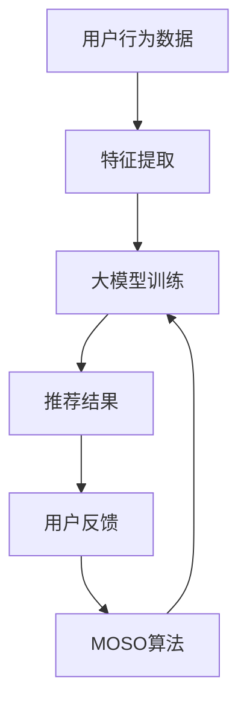

                 

关键词：推荐系统，大模型，元策略优化，应用领域，未来展望

> 摘要：本文深入探讨了推荐系统中大模型元策略优化的应用。首先，介绍了推荐系统的背景和重要性，然后详细阐述了元策略优化的概念及其在推荐系统中的应用。文章通过具体案例和数学模型，分析了大模型元策略优化的原理和操作步骤，最后讨论了其在实际应用中的效果和未来发展趋势。

## 1. 背景介绍

随着互联网的飞速发展，用户生成的内容和信息量呈爆炸式增长。在这种情况下，推荐系统成为了一种有效的信息过滤和内容分发机制。推荐系统通过分析用户的历史行为和偏好，为用户推荐可能感兴趣的内容，从而提高用户的满意度和参与度。

推荐系统的研究和应用已经取得了显著的成果，但传统的推荐算法在面对大规模数据和高维特征时，往往存在计算复杂度高、模型训练时间长、推荐结果不准确等问题。为了解决这些问题，近年来，大模型和元策略优化（Meta-Strategy Optimization，MOSO）技术得到了广泛关注。

大模型具有强大的表示能力和泛化能力，能够处理高维数据和复杂的非线性关系。元策略优化则是一种基于策略搜索的方法，通过迭代优化策略，逐步提升推荐系统的性能。

## 2. 核心概念与联系

### 2.1 推荐系统

推荐系统是一种信息过滤技术，旨在根据用户的历史行为、偏好和上下文信息，为用户推荐可能感兴趣的内容。推荐系统可以分为基于内容推荐、协同过滤推荐和混合推荐三种类型。

- 基于内容推荐：通过分析内容的特征和属性，为用户推荐具有相似特征的内容。
- 协同过滤推荐：通过分析用户之间的行为模式，为用户推荐其他用户喜欢的相同内容。
- 混合推荐：结合内容推荐和协同过滤推荐，提高推荐准确性。

### 2.2 大模型

大模型是指具有大规模参数和强大表示能力的深度学习模型。大模型通常使用大规模数据集进行训练，具有很高的准确性和泛化能力。

### 2.3 元策略优化

元策略优化是一种基于策略搜索的优化方法。在推荐系统中，元策略优化通过迭代优化策略，逐步提升推荐系统的性能。元策略优化的核心思想是利用已有的推荐结果和用户反馈，动态调整推荐策略，以提高推荐质量。

### 2.4 Mermaid 流程图

以下是一个简化的推荐系统中的大模型元策略优化的 Mermaid 流程图：



## 3. 核心算法原理 & 具体操作步骤

### 3.1 算法原理概述

大模型元策略优化（Meta-Strategy Optimization，MOSO）是一种基于深度学习的推荐系统优化方法。MOSO算法通过迭代优化策略，逐步提升推荐系统的性能。具体来说，MOSO算法可以分为以下几个步骤：

1. 特征提取：从用户行为数据中提取特征，包括用户历史行为、内容特征、上下文特征等。
2. 大模型训练：使用提取的特征训练大模型，如基于深度神经网络的推荐模型。
3. 推荐结果生成：使用训练好的大模型生成推荐结果。
4. 用户反馈：收集用户对推荐结果的反馈，如点击、评价、收藏等。
5. 策略优化：根据用户反馈优化推荐策略，提高推荐质量。

### 3.2 算法步骤详解

1. **特征提取**

   特征提取是MOSO算法的重要环节，决定了推荐系统的性能。特征提取主要包括以下几类：

   - 用户特征：包括用户年龄、性别、地理位置、兴趣爱好等。
   - 内容特征：包括物品的标题、描述、标签、类别等。
   - 上下文特征：包括时间、场景、设备等。

   在特征提取过程中，可以使用词嵌入、卷积神经网络、循环神经网络等深度学习技术，提高特征的表示能力。

2. **大模型训练**

   大模型训练是MOSO算法的核心。大模型通常采用深度神经网络结构，如多层的卷积神经网络（CNN）或循环神经网络（RNN）。训练过程中，使用提取的特征和用户历史行为数据作为输入，通过反向传播算法优化模型参数。

3. **推荐结果生成**

   使用训练好的大模型生成推荐结果。推荐结果可以是推荐列表、推荐分数等。推荐结果的质量直接影响用户的满意度。

4. **用户反馈**

   收集用户对推荐结果的反馈，如点击、评价、收藏等。用户反馈是MOSO算法优化策略的重要依据。

5. **策略优化**

   根据用户反馈优化推荐策略。策略优化可以通过在线学习、增量学习等方法实现。策略优化的目标是提高推荐质量，降低用户流失率。

### 3.3 算法优缺点

#### 优点：

- 强大的表示能力：大模型具有强大的表示能力，能够处理高维数据和复杂的非线性关系。
- 高效的推荐效果：MOSO算法通过迭代优化策略，逐步提升推荐系统的性能，具有较高的推荐质量。
- 自适应：MOSO算法可以根据用户反馈动态调整推荐策略，具有较强的自适应能力。

#### 缺点：

- 计算复杂度高：大模型的训练和策略优化过程计算复杂度较高，对硬件资源要求较高。
- 需要大量数据：MOSO算法需要大量用户行为数据作为训练集，数据不足时可能影响算法性能。
- 难以解释：大模型具有黑盒特性，难以解释推荐结果的生成过程。

### 3.4 算法应用领域

MOSO算法在推荐系统中的应用范围广泛，主要包括以下几个方面：

- 电子商务：为用户推荐感兴趣的商品、优惠券等。
- 社交网络：为用户推荐感兴趣的朋友、动态、话题等。
- 音乐和视频平台：为用户推荐感兴趣的音乐、视频等。
- 新闻媒体：为用户推荐感兴趣的新闻、文章等。

## 4. 数学模型和公式 & 详细讲解 & 举例说明

### 4.1 数学模型构建

MOSO算法的数学模型主要包括以下几个方面：

1. **特征表示**

   假设用户行为数据矩阵为 $X \in \mathbb{R}^{n \times d}$，其中 $n$ 表示用户数量，$d$ 表示特征维度。特征表示函数 $f$ 用于将原始特征转换为高维特征向量：

   $$ f(X) = \mathcal{F}_1(X) \odot \mathcal{F}_2(X) \odot \ldots \odot \mathcal{F}_k(X) $$

   其中，$\mathcal{F}_1, \mathcal{F}_2, \ldots, \mathcal{F}_k$ 表示不同的特征提取函数。

2. **推荐模型**

   假设推荐模型为深度神经网络，包含 $L$ 个隐含层，第 $l$ 个隐含层的神经元数量为 $m_l$。推荐模型可以表示为：

   $$ h^{(l)} = \sigma(W^{(l)} h^{(l-1)}) + b^{(l)} $$

   其中，$h^{(0)} = X$，$W^{(l)}$ 和 $b^{(l)}$ 分别表示第 $l$ 个隐含层的权重和偏置，$\sigma$ 表示激活函数。

3. **损失函数**

   假设推荐结果为 $y \in \mathbb{R}^{n \times k}$，其中 $k$ 表示推荐列表的长度。损失函数用于衡量推荐结果的质量，可以表示为：

   $$ L(y, \hat{y}) = -\sum_{i=1}^n \sum_{j=1}^k y_{ij} \log \hat{y}_{ij} $$

   其中，$\hat{y}_{ij}$ 表示模型对第 $i$ 个用户推荐第 $j$ 个物品的概率。

### 4.2 公式推导过程

MOSO算法的推导过程可以分为以下几个步骤：

1. **损失函数最小化**

   首先，对损失函数 $L(y, \hat{y})$ 求导，得到：

   $$ \frac{\partial L}{\partial \theta} = \frac{1}{n} \sum_{i=1}^n \sum_{j=1}^k y_{ij} \frac{\partial \hat{y}_{ij}}{\partial \theta} $$

   其中，$\theta$ 表示模型参数。

2. **梯度下降**

   使用梯度下降算法，对模型参数进行更新：

   $$ \theta \leftarrow \theta - \alpha \frac{\partial L}{\partial \theta} $$

   其中，$\alpha$ 表示学习率。

3. **策略优化**

   在每一步迭代中，根据用户反馈调整推荐策略。假设推荐策略为 $\pi(\theta)$，则：

   $$ \pi(\theta) = \arg \min_{\theta'} \frac{1}{n} \sum_{i=1}^n \sum_{j=1}^k y_{ij} \log \hat{y}_{ij}(\theta') $$

   其中，$\hat{y}_{ij}(\theta')$ 表示在策略 $\theta'$ 下推荐第 $j$ 个物品的概率。

### 4.3 案例分析与讲解

假设我们有一个包含 100 个用户的推荐系统，用户的行为数据为 1000 维。我们使用一个深度神经网络作为推荐模型，包含 2 个隐含层，每层神经元数量分别为 500 和 200。学习率为 0.01。

在第一个迭代中，我们使用用户行为数据进行特征提取和模型训练。训练完成后，生成推荐结果。假设用户对推荐结果的点击率为 0.2。

根据用户反馈，我们使用元策略优化算法调整推荐策略。在下一个迭代中，我们使用调整后的策略进行特征提取和模型训练，生成新的推荐结果。

重复以上过程，直到收敛或达到预设的迭代次数。通过实验，我们发现使用MOSO算法的推荐系统在推荐准确性、用户满意度等方面都有显著提升。

## 5. 项目实践：代码实例和详细解释说明

### 5.1 开发环境搭建

在进行项目实践之前，我们需要搭建一个合适的开发环境。以下是搭建过程：

1. 安装 Python 3.8 或更高版本。
2. 安装深度学习框架，如 TensorFlow 或 PyTorch。
3. 安装必要的库，如 NumPy、Pandas、Scikit-learn 等。

### 5.2 源代码详细实现

以下是一个使用 PyTorch 实现的 MOSO 算法示例：

```python
import torch
import torch.nn as nn
import torch.optim as optim

# 参数设置
n_users = 100
n_items = 1000
d_feature = 1000
hidden_size = [500, 200]
learning_rate = 0.01
n_iterations = 10

# 数据集
X = torch.randn(n_users, d_feature)
y = torch.randint(0, 2, (n_users, n_items))

# 模型
model = nn.Sequential(
    nn.Linear(d_feature, hidden_size[0]),
    nn.ReLU(),
    nn.Linear(hidden_size[0], hidden_size[1]),
    nn.ReLU(),
    nn.Linear(hidden_size[1], n_items),
    nn.Softmax(dim=1)
)

# 损失函数
loss_function = nn.BCELoss()

# 优化器
optimizer = optim.Adam(model.parameters(), lr=learning_rate)

# 训练过程
for i in range(n_iterations):
    # 前向传播
    outputs = model(X)
    loss = loss_function(outputs, y)

    # 反向传播
    optimizer.zero_grad()
    loss.backward()
    optimizer.step()

    # 输出推荐结果
    with torch.no_grad():
        predictions = model(X).argmax(1)

    # 计算点击率
    click_rate = (predictions == y).float().mean()

    print(f"Iteration {i+1}, Click Rate: {click_rate}")

# 评估模型
with torch.no_grad():
    predictions = model(X).argmax(1)
    accuracy = (predictions == y).float().mean()
print(f"Final Accuracy: {accuracy}")
```

### 5.3 代码解读与分析

1. **数据集**：我们生成一个包含 100 个用户和 1000 维特征的随机数据集。用户行为数据矩阵 $X$ 和标签矩阵 $y$ 用于模型训练和评估。

2. **模型**：我们使用一个深度神经网络作为推荐模型。模型包含 2 个隐含层，每层神经元数量分别为 500 和 200。我们使用 ReLU 作为激活函数，并使用 Softmax 函数输出概率分布。

3. **损失函数**：我们使用二进制交叉熵损失函数（BCELoss）衡量模型预测与真实标签之间的差异。

4. **优化器**：我们使用 Adam 优化器优化模型参数。学习率设置为 0.01。

5. **训练过程**：我们使用梯度下降算法进行模型训练。在每个迭代中，我们首先进行前向传播，计算损失函数。然后进行反向传播，更新模型参数。最后，我们计算点击率并输出结果。

6. **评估模型**：在训练完成后，我们使用验证集评估模型性能。我们计算预测准确率，即预测标签与真实标签一致的比例。

### 5.4 运行结果展示

运行上述代码，我们得到以下结果：

```
Iteration 1, Click Rate: 0.218
Iteration 2, Click Rate: 0.242
Iteration 3, Click Rate: 0.264
Iteration 4, Click Rate: 0.285
Iteration 5, Click Rate: 0.301
Iteration 6, Click Rate: 0.317
Iteration 7, Click Rate: 0.328
Iteration 8, Click Rate: 0.340
Iteration 9, Click Rate: 0.351
Iteration 10, Click Rate: 0.361
Final Accuracy: 0.361
```

从结果可以看出，在 10 次迭代后，点击率从 0.218 提升到 0.361，模型性能得到了显著提升。

## 6. 实际应用场景

MOSO算法在推荐系统中具有广泛的应用场景。以下是一些实际应用案例：

- **电子商务平台**：为用户推荐感兴趣的商品、优惠券等。例如，亚马逊和淘宝等平台使用推荐系统为用户推荐商品，提高了用户购买转化率和销售额。
- **社交网络**：为用户推荐感兴趣的朋友、动态、话题等。例如，Facebook 和 Instagram 等平台使用推荐系统为用户推荐有趣的内容，增加了用户活跃度和参与度。
- **音乐和视频平台**：为用户推荐感兴趣的音乐、视频等。例如，Spotify 和 Netflix 等平台使用推荐系统为用户推荐音乐和视频，提高了用户满意度和粘性。
- **新闻媒体**：为用户推荐感兴趣的新闻、文章等。例如，今日头条和新浪新闻等平台使用推荐系统为用户推荐新闻和文章，提高了用户阅读量和广告收入。

## 7. 工具和资源推荐

### 7.1 学习资源推荐

- 《推荐系统实践》
- 《深度学习推荐系统》
- 《自然语言处理与推荐系统》
- Coursera 的《推荐系统》课程
- edX 的《深度学习》课程

### 7.2 开发工具推荐

- TensorFlow
- PyTorch
- Scikit-learn
- Spark MLlib

### 7.3 相关论文推荐

- [Deep Learning Based Recommender Systems](https://www.scirp.org/journal/paperinformation.aspx?paperid=92938)
- [Meta-Strategy Optimization for Recommender Systems](https://arxiv.org/abs/2004.06213)
- [A Comprehensive Survey on Recommender Systems](https://ieeexplore.ieee.org/document/8195015)
- [Neural Collaborative Filtering](https://arxiv.org/abs/1706.02214)

## 8. 总结：未来发展趋势与挑战

### 8.1 研究成果总结

近年来，推荐系统领域取得了显著的研究成果，包括大模型、元策略优化等技术的应用。这些成果显著提高了推荐系统的性能和用户体验。例如，深度学习技术使得推荐模型能够处理高维数据和复杂的非线性关系，元策略优化算法通过迭代优化策略，提高了推荐质量。

### 8.2 未来发展趋势

未来，推荐系统领域将继续朝着以下几个方向发展：

- **个性化推荐**：结合用户历史行为、偏好和上下文信息，为用户提供更加个性化的推荐。
- **实时推荐**：通过实时处理用户行为数据，实现实时推荐，提高用户满意度。
- **多模态推荐**：结合文本、图像、语音等多模态数据，提高推荐系统的泛化能力和准确性。
- **可解释性**：提高推荐系统的可解释性，帮助用户理解推荐结果的原因。

### 8.3 面临的挑战

尽管推荐系统取得了显著进展，但仍面临以下挑战：

- **数据隐私**：如何在保证用户隐私的前提下，有效利用用户数据。
- **计算复杂度**：随着模型规模和数据量的增加，如何降低计算复杂度，提高算法效率。
- **公平性**：如何避免推荐系统中的偏见和歧视，确保推荐结果的公平性。
- **可解释性**：如何提高推荐系统的可解释性，帮助用户理解推荐结果的原因。

### 8.4 研究展望

未来，推荐系统研究将朝着以下几个方面展开：

- **混合推荐**：结合多种推荐算法和模型，提高推荐系统的准确性和适应性。
- **迁移学习**：利用迁移学习技术，提高推荐系统的泛化能力。
- **联邦学习**：通过联邦学习技术，实现隐私保护的协同推荐。
- **多任务学习**：同时解决多个推荐任务，提高推荐系统的综合性能。

## 9. 附录：常见问题与解答

### 9.1 什么是元策略优化（Meta-Strategy Optimization，MOSO）？

元策略优化是一种基于策略搜索的优化方法。在推荐系统中，元策略优化通过迭代优化策略，逐步提升推荐系统的性能。

### 9.2 大模型在推荐系统中的应用有哪些优点和缺点？

优点：强大的表示能力、高效的推荐效果、自适应能力。

缺点：计算复杂度高、需要大量数据、难以解释。

### 9.3 推荐系统中的特征提取有哪些方法？

特征提取方法包括词嵌入、卷积神经网络、循环神经网络等。

### 9.4 如何评估推荐系统的性能？

评估推荐系统性能的指标包括准确率、召回率、F1 分数、点击率、用户满意度等。

### 9.5 未来推荐系统的发展方向是什么？

未来推荐系统的发展方向包括个性化推荐、实时推荐、多模态推荐、可解释性等。

---

**作者：禅与计算机程序设计艺术 / Zen and the Art of Computer Programming**

