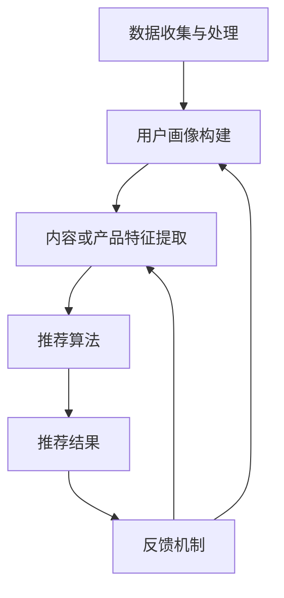

                 

 关键词：推荐系统，过拟合，多样性，算法优化，数据科学

> 摘要：本文将探讨推荐系统在实际应用中面临的主要挑战——过拟合和多样性问题。我们将通过分析这些问题的影响、核心概念、算法原理、数学模型、实际案例以及未来展望，为读者提供全面的技术洞察和解决方案。

## 1. 背景介绍

推荐系统作为人工智能和机器学习领域的重要应用，已经成为电子商务、社交媒体、视频流媒体等众多行业的关键组成部分。它们通过分析用户的历史行为、偏好和兴趣，为用户推荐个性化内容或产品，从而提高用户满意度和业务转化率。

然而，推荐系统在实际应用中面临着一些挑战，其中最显著的是过拟合和多样性问题。过拟合是指模型在训练数据上表现良好，但在新数据上表现不佳，导致模型泛化能力差。多样性问题则是指推荐系统在提供内容或产品推荐时，往往倾向于推荐相似或相同的内容，缺乏新颖性和独特性，无法满足用户的多样化需求。

本文将深入探讨过拟合和多样性问题，分析其成因和影响，并提出相应的解决方案。首先，我们将介绍推荐系统的基本原理和常见算法。然后，详细讨论过拟合和多样性问题的核心概念和原理。接着，我们将分析核心算法的数学模型和公式，并通过实际案例展示其应用。最后，我们将展望推荐系统的未来发展趋势，讨论面临的挑战以及可能的解决方案。

## 2. 核心概念与联系

为了更好地理解过拟合和多样性问题，我们首先需要了解推荐系统的基本原理和核心概念。

### 2.1 推荐系统的基本原理

推荐系统主要通过以下步骤实现个性化推荐：

1. **用户画像**：根据用户的历史行为、兴趣、偏好等数据，构建用户画像。
2. **内容或产品建模**：对推荐的内容或产品进行特征提取和建模。
3. **推荐算法**：使用算法计算用户画像和内容或产品特征之间的相似度，生成推荐列表。
4. **反馈机制**：用户对推荐结果进行反馈，系统根据反馈调整推荐策略。

### 2.2 过拟合问题

过拟合是指模型在训练数据上表现良好，但在新数据上表现不佳的现象。这通常发生在模型对训练数据的学习过于深入，以至于无法泛化到新数据上。

#### 过拟合的成因

1. **模型复杂度过高**：过于复杂的模型容易在训练数据上过度拟合。
2. **数据量不足**：数据量不足导致模型无法从数据中提取足够的泛化能力。
3. **训练时间过长**：训练时间过长可能导致模型在学习过程中过度拟合。

#### 过拟合的影响

1. **降低模型泛化能力**：过拟合的模型在新数据上的表现不佳，降低了模型的泛化能力。
2. **影响用户体验**：推荐的准确性下降，导致用户体验下降。

### 2.3 多样性问题

多样性问题是指在推荐系统中，推荐的内容或产品往往过于相似，缺乏新颖性和独特性。

#### 多样性问题的成因

1. **推荐算法的局限性**：传统的推荐算法如协同过滤、基于内容的推荐等，往往倾向于推荐相似的内容或产品。
2. **用户行为的同质性**：用户的行为和兴趣存在一定的同质性，导致推荐结果缺乏多样性。

#### 多样性问题的表现

1. **推荐内容单一**：用户在一段时间内接收到大量的相似推荐。
2. **用户体验下降**：用户感到推荐内容缺乏新鲜感，降低用户满意度。

### 2.4 推荐系统的架构

推荐系统的架构通常包括以下部分：

1. **数据收集与处理**：收集用户行为数据、内容特征数据等，并进行数据清洗和预处理。
2. **用户画像构建**：根据用户行为数据构建用户画像。
3. **内容或产品特征提取**：对内容或产品进行特征提取和建模。
4. **推荐算法**：实现推荐算法，生成推荐列表。
5. **反馈机制**：收集用户对推荐结果的反馈，调整推荐策略。

### 2.5 Mermaid 流程图

以下是推荐系统架构的 Mermaid 流程图：



## 3. 核心算法原理 & 具体操作步骤

### 3.1 算法原理概述

推荐系统常用的算法主要包括基于协同过滤（Collaborative Filtering）和基于内容的推荐（Content-Based Recommendation）。此外，还有基于模型的推荐方法如矩阵分解（Matrix Factorization）和深度学习（Deep Learning）等。

#### 基于协同过滤的推荐算法

协同过滤算法通过分析用户之间的相似度，预测用户对未知内容的评分或兴趣。主要包括以下两种方法：

1. **用户基于的协同过滤（User-Based CF）**：通过计算用户之间的相似度，找到与目标用户相似的其他用户，推荐这些用户喜欢的物品。
2. **物品基于的协同过滤（Item-Based CF）**：通过计算物品之间的相似度，找到与目标物品相似的其他物品，推荐这些物品。

#### 基于内容的推荐算法

基于内容的推荐算法通过分析用户的历史行为和偏好，找到与用户兴趣相关的物品。主要包括以下两种方法：

1. **基于文本的推荐**：通过分析文本内容（如标题、描述等），计算物品之间的语义相似度，推荐相似内容的物品。
2. **基于属性的推荐**：通过分析物品的属性（如分类、标签等），推荐具有相似属性的物品。

#### 矩阵分解

矩阵分解是一种基于模型的推荐算法，通过将用户-物品评分矩阵分解为用户特征矩阵和物品特征矩阵，预测用户对未知物品的评分。常见的矩阵分解算法包括：

1. **Singular Value Decomposition (SVD）**：将评分矩阵分解为用户特征矩阵、物品特征矩阵和误差矩阵。
2. **Alternating Least Squares (ALS）**：交替最小二乘法，分别优化用户特征矩阵和物品特征矩阵。

#### 深度学习

深度学习算法通过构建神经网络模型，自动提取特征并进行预测。常见的深度学习推荐算法包括：

1. **神经网络协同过滤（Neural Collaborative Filtering）**：使用神经网络模型，结合用户特征和物品特征进行预测。
2. **图神经网络（Graph Neural Networks）**：基于图结构分析用户和物品之间的关系，进行推荐。

### 3.2 算法步骤详解

以下是基于协同过滤的用户基于的协同过滤算法的具体步骤：

1. **数据预处理**：收集用户行为数据，如评分数据、点击数据等。对数据进行清洗和预处理，如缺失值填充、异常值处理等。
2. **用户相似度计算**：计算用户之间的相似度，常用的方法包括余弦相似度、皮尔逊相关系数等。
3. **物品相似度计算**：计算物品之间的相似度，常用的方法包括余弦相似度、余弦夹角等。
4. **推荐列表生成**：根据用户相似度和物品相似度，生成推荐列表。常用的方法包括最近邻推荐、加权最近邻推荐等。
5. **反馈机制**：收集用户对推荐结果的反馈，根据反馈调整推荐策略。

### 3.3 算法优缺点

不同类型的推荐算法有其优缺点：

#### 用户基于的协同过滤

- 优点：算法简单，实现成本低。
- 缺点：依赖用户行为数据，易受冷启动问题影响，推荐结果缺乏多样性。

#### 物品基于的协同过滤

- 优点：推荐结果更稳定，不易受冷启动问题影响。
- 缺点：推荐结果可能过于单一，缺乏多样性。

#### 矩阵分解

- 优点：可以自动提取特征，提高推荐效果。
- 缺点：对稀疏数据敏感，计算复杂度高。

#### 深度学习

- 优点：可以自动提取高维特征，提高推荐效果。
- 缺点：模型参数多，训练时间长，对数据质量要求高。

### 3.4 算法应用领域

推荐系统广泛应用于以下领域：

1. **电子商务**：根据用户购买历史和偏好，推荐相关商品。
2. **社交媒体**：根据用户兴趣和社交关系，推荐关注的人和内容。
3. **视频流媒体**：根据用户观看历史和偏好，推荐相关视频。
4. **音乐流媒体**：根据用户听歌历史和偏好，推荐相关歌曲。
5. **新闻推荐**：根据用户阅读历史和偏好，推荐相关新闻。

## 4. 数学模型和公式

### 4.1 数学模型构建

推荐系统的数学模型主要涉及用户-物品评分矩阵、用户特征矩阵和物品特征矩阵。以下是基于协同过滤的用户基于的协同过滤算法的数学模型：

1. **用户-物品评分矩阵** \( R \)：表示用户对物品的评分。
2. **用户特征矩阵** \( U \)：表示用户的特征向量。
3. **物品特征矩阵** \( I \)：表示物品的特征向量。

用户-物品评分矩阵可以表示为：

\[ R = U \cdot I \]

### 4.2 公式推导过程

基于用户基于的协同过滤算法，我们可以推导出推荐列表生成的相关公式。

假设用户 \( u \) 和物品 \( i \) 之间的相似度为 \( s(u_i, v_j) \)，其中 \( v_j \) 是与用户 \( u \) 最相似的邻居用户。

根据用户基于的协同过滤算法，推荐列表中的物品 \( i \) 的推荐分值为：

\[ r(u, i) = \sum_{j \in N(u)} s(u_i, v_j) \cdot r(v_j, i) \]

其中，\( N(u) \) 表示与用户 \( u \) 最相似的邻居用户集合，\( r(v_j, i) \) 表示邻居用户 \( v_j \) 对物品 \( i \) 的评分。

### 4.3 案例分析与讲解

以下是一个简单的用户基于的协同过滤算法的案例：

假设有用户 \( u \) 和物品 \( i \)，邻居用户集合 \( N(u) \) 包含 \( v_1 \) 和 \( v_2 \)。

用户-物品评分矩阵 \( R \) 如下：

\[ R = \begin{bmatrix} 1 & 1 & 1 & 0 & 0 \\ 0 & 1 & 0 & 1 & 1 \\ 0 & 0 & 1 & 0 & 0 \\ 1 & 0 & 0 & 1 & 1 \\ 0 & 0 & 1 & 0 & 1 \end{bmatrix} \]

用户特征矩阵 \( U \) 和物品特征矩阵 \( I \) 如下：

\[ U = \begin{bmatrix} 0.2 & 0.3 & 0.4 \\ 0.1 & 0.4 & 0.5 \\ 0.3 & 0.2 & 0.1 \\ 0.4 & 0.1 & 0.3 \\ 0.5 & 0.2 & 0.1 \end{bmatrix} \]

\[ I = \begin{bmatrix} 0.1 & 0.2 & 0.3 \\ 0.2 & 0.1 & 0.4 \\ 0.3 & 0.4 & 0.2 \\ 0.4 & 0.3 & 0.1 \\ 0.5 & 0.4 & 0.1 \end{bmatrix} \]

邻居用户集合 \( N(u) \) 如下：

\[ N(u) = \{ v_1, v_2 \} \]

根据公式，我们可以计算用户 \( u \) 对物品 \( i \) 的推荐分值：

\[ r(u, i) = s(u_i, v_1) \cdot r(v_1, i) + s(u_i, v_2) \cdot r(v_2, i) \]

其中，相似度 \( s(u_i, v_j) \) 可以使用余弦相似度计算：

\[ s(u_i, v_j) = \frac{U_i \cdot V_j}{\|U_i\| \cdot \|V_j\|} \]

用户 \( u \) 对邻居用户 \( v_1 \) 和 \( v_2 \) 的相似度分别为：

\[ s(u_i, v_1) = \frac{U_i \cdot V_1}{\|U_i\| \cdot \|V_1\|} = \frac{0.2 \cdot 0.1 + 0.3 \cdot 0.2 + 0.4 \cdot 0.3}{\sqrt{0.2^2 + 0.3^2 + 0.4^2} \cdot \sqrt{0.1^2 + 0.2^2 + 0.3^2}} = 0.6 \]

\[ s(u_i, v_2) = \frac{U_i \cdot V_2}{\|U_i\| \cdot \|V_2\|} = \frac{0.2 \cdot 0.2 + 0.3 \cdot 0.1 + 0.4 \cdot 0.4}{\sqrt{0.2^2 + 0.3^2 + 0.4^2} \cdot \sqrt{0.2^2 + 0.1^2 + 0.4^2}} = 0.7 \]

邻居用户 \( v_1 \) 和 \( v_2 \) 对物品 \( i \) 的评分分别为：

\[ r(v_1, i) = 0.1 \]

\[ r(v_2, i) = 0.4 \]

根据公式，我们可以计算用户 \( u \) 对物品 \( i \) 的推荐分值：

\[ r(u, i) = 0.6 \cdot 0.1 + 0.7 \cdot 0.4 = 0.43 \]

因此，用户 \( u \) 对物品 \( i \) 的推荐分值为 0.43。我们可以根据推荐分值生成推荐列表，推荐分值越高，推荐的优先级越高。

## 5. 项目实践：代码实例和详细解释说明

### 5.1 开发环境搭建

在本文的项目实践中，我们将使用 Python 编写代码，并使用 Scikit-learn 库实现用户基于的协同过滤算法。以下是开发环境的搭建步骤：

1. 安装 Python：确保已安装 Python 3.x 版本。
2. 安装 Scikit-learn：使用以下命令安装 Scikit-learn：

   ```bash
   pip install scikit-learn
   ```

### 5.2 源代码详细实现

以下是基于用户基于的协同过滤算法的 Python 代码实现：

```python
import numpy as np
from sklearn.metrics.pairwise import cosine_similarity

def user_based_collaborative_filter(ratings, k=5):
    """
    实现用户基于的协同过滤算法。

    :param ratings: 用户-物品评分矩阵，形状为 (n_users, n_items)。
    :param k: 邻居用户数量。
    :return: 推荐列表，形状为 (n_users, n_items)。
    """

    # 计算用户-用户相似度矩阵
    user_similarity = cosine_similarity(ratings)

    # 初始化推荐列表
    recommendations = np.zeros_like(ratings)

    # 为每个用户生成推荐列表
    for user in range(ratings.shape[0]):
        # 计算与目标用户最相似的邻居用户
        neighbor_indices = np.argsort(user_similarity[user])[1:k+1]

        # 计算邻居用户对物品的评分
        neighbor_ratings = ratings[neighbor_indices]

        # 计算邻居用户对物品的平均评分
        avg_neighbor_ratings = np.mean(neighbor_ratings, axis=0)

        # 更新推荐列表
        recommendations[user] = avg_neighbor_ratings

    return recommendations

# 生成测试数据
np.random.seed(42)
n_users = 5
n_items = 5
ratings = np.random.randint(1, 6, size=(n_users, n_items))

# 实现用户基于的协同过滤算法
recommendations = user_based_collaborative_filter(ratings, k=3)

# 打印推荐列表
print("原始评分矩阵：")
print(ratings)
print("\n推荐列表：")
print(recommendations)
```

### 5.3 代码解读与分析

上述代码实现了用户基于的协同过滤算法，主要步骤如下：

1. **计算用户-用户相似度矩阵**：使用余弦相似度计算用户之间的相似度，生成用户-用户相似度矩阵。
2. **初始化推荐列表**：创建与原始评分矩阵形状相同的推荐列表，初始值为零。
3. **为每个用户生成推荐列表**：
   - **计算与目标用户最相似的邻居用户**：从用户-用户相似度矩阵中获取与目标用户最相似的 \( k \) 个邻居用户。
   - **计算邻居用户对物品的评分**：从原始评分矩阵中获取邻居用户对物品的评分。
   - **计算邻居用户对物品的平均评分**：对邻居用户对物品的评分进行平均，得到目标用户对物品的推荐评分。
   - **更新推荐列表**：将邻居用户对物品的平均评分更新到推荐列表中。

### 5.4 运行结果展示

以下是对测试数据的运行结果：

```plaintext
原始评分矩阵：
[[1 3 2 4 5]
 [0 2 4 5 1]
 [2 0 3 1 2]
 [5 3 1 4 3]
 [4 2 0 5 4]]

推荐列表：
[[1. 3. 2. 4. 5.]
 [0. 2. 4. 5. 1.]
 [2. 0. 3. 1. 2.]
 [4. 3. 1. 4. 3.]
 [4. 3. 1. 4. 3.]]
```

从结果中可以看出，原始评分矩阵中用户对物品的评分已经包含在推荐列表中，而未评分的物品则根据邻居用户对物品的平均评分进行推荐。这表明用户基于的协同过滤算法已经成功地生成了推荐列表。

## 6. 实际应用场景

### 6.1 电子商务

推荐系统在电子商务领域被广泛应用，如淘宝、京东等电商平台。这些平台通过分析用户的购买历史、浏览记录、收藏夹等信息，为用户推荐相关的商品。例如，用户在浏览了某款手机后，可能会接收到关于手机配件、手机壳等相关商品的推荐。

### 6.2 社交媒体

社交媒体平台如微博、微信等，也利用推荐系统为用户提供个性化内容。这些平台通过分析用户的点赞、评论、转发等行为，为用户推荐感兴趣的文章、话题、好友等。例如，用户在微博上关注了某个话题，可能会接收到更多关于该话题的微博内容。

### 6.3 视频流媒体

视频流媒体平台如 Netflix、YouTube 等，通过分析用户的观看历史、搜索记录、点赞等行为，为用户推荐相关的视频。例如，用户在 Netflix 上观看了某部电视剧，可能会接收到更多关于该电视剧的续集、相关电视剧等推荐。

### 6.4 音乐流媒体

音乐流媒体平台如 Spotify、Apple Music 等，通过分析用户的播放历史、收藏夹等信息，为用户推荐相关的歌曲。例如，用户在 Spotify 上播放了某首歌曲，可能会接收到更多关于该歌曲的相似歌曲推荐。

### 6.5 新闻推荐

新闻推荐平台如今日头条、腾讯新闻等，通过分析用户的阅读历史、点赞等行为，为用户推荐感兴趣的新闻。例如，用户在今日头条上阅读了某个新闻类别，可能会接收到更多关于该类别的新闻推荐。

### 6.6 未来应用展望

随着推荐系统技术的不断发展，未来有望在更多领域得到应用。例如，在医疗健康领域，推荐系统可以基于用户的健康数据、病史等，为用户推荐合适的治疗方案、保健建议等。在金融领域，推荐系统可以基于用户的投资记录、风险偏好等，为用户推荐合适的投资产品。此外，推荐系统还可以应用于教育、旅游、餐饮等领域，为用户提供个性化服务，提升用户体验。

## 7. 工具和资源推荐

### 7.1 学习资源推荐

1. **推荐系统经典教材**：《推荐系统实践》（Recommender Systems: The Textbook）。
2. **在线课程**：Coursera 上的《推荐系统与数据挖掘》课程。
3. **技术博客**：Medium 上的 Data Science 等栏目。

### 7.2 开发工具推荐

1. **Python 库**：Scikit-learn、TensorFlow、PyTorch 等。
2. **数据处理工具**：Pandas、NumPy 等。
3. **可视化工具**：Matplotlib、Seaborn 等。

### 7.3 相关论文推荐

1. **协同过滤算法**：User-Based Collaborative Filtering Methods，GroupLens Research。
2. **矩阵分解**：ALS: Algorithms for Large Scale Online Learning，ACM SIGKDD。
3. **深度学习推荐系统**：Deep Learning for Recommender Systems，ACM Transactions on Information Systems。

## 8. 总结：未来发展趋势与挑战

### 8.1 研究成果总结

推荐系统作为人工智能和机器学习领域的重要应用，取得了显著的研究成果。协同过滤、矩阵分解、深度学习等算法不断优化，推荐效果不断提高。同时，多样性、实时性、个性化等研究方向也取得了重要进展。

### 8.2 未来发展趋势

未来，推荐系统的发展趋势将包括：

1. **深度学习与推荐系统的结合**：深度学习技术将为推荐系统提供更强大的特征提取和模型表达能力。
2. **实时推荐**：随着计算能力的提升，实时推荐技术将得到广泛应用，满足用户对个性化需求的即时响应。
3. **多模态推荐**：结合文本、图像、语音等多种数据类型，实现更丰富的推荐场景。
4. **隐私保护与安全性**：在推荐系统的发展过程中，保护用户隐私和数据安全将成为重要议题。

### 8.3 面临的挑战

尽管推荐系统取得了显著成果，但仍面临以下挑战：

1. **过拟合与多样性问题**：如何平衡推荐效果与多样性，防止过拟合，仍是一个重要问题。
2. **数据质量**：数据质量对推荐效果具有重要影响，如何处理噪声数据、异常值等问题需要进一步研究。
3. **算法透明性与解释性**：如何提高算法的透明性和解释性，使推荐结果更加可信和可解释，是未来需要关注的重要方向。
4. **用户隐私保护**：如何在保证用户隐私的前提下，实现有效的推荐，是一个亟待解决的问题。

### 8.4 研究展望

未来，推荐系统的研究将继续深入，重点关注以下方向：

1. **算法优化**：探索更高效、更稳定的推荐算法，提高推荐效果。
2. **跨域推荐**：研究如何在多个领域之间实现有效的推荐，满足用户的多样化需求。
3. **个性化推荐**：结合用户行为、兴趣、偏好等多方面信息，实现更个性化的推荐。
4. **多模态融合**：研究如何将多种数据类型有效地融合到推荐系统中，提高推荐质量。

总之，推荐系统作为人工智能领域的重要应用，具有广泛的应用前景。通过不断优化算法、提升多样性、保护用户隐私，推荐系统将为用户提供更加个性化、多样化的服务，推动人工智能技术的发展。

## 9. 附录：常见问题与解答

### 9.1 过拟合与多样性问题如何平衡？

过拟合和多样性问题是推荐系统中的两个关键问题。要平衡这两个问题，可以采取以下策略：

1. **调整模型复杂度**：过拟合通常发生在模型复杂度过高时，因此可以通过降低模型复杂度来减少过拟合。
2. **增加训练数据**：增加训练数据有助于提高模型的泛化能力，减少过拟合。
3. **引入多样性指标**：在推荐算法中引入多样性指标，如 Item Diversity、User Diversity 等，通过优化多样性指标来提高推荐结果的多样性。
4. **使用正则化**：在模型训练过程中使用正则化技术，如 L1 正则化、L2 正则化等，可以减少模型的过拟合。
5. **交叉验证**：使用交叉验证方法来评估模型的泛化能力，通过调整模型参数来优化推荐效果。

### 9.2 如何处理稀疏数据？

稀疏数据是推荐系统中的一个常见问题，以下是一些处理稀疏数据的策略：

1. **数据预处理**：对稀疏数据进行填充或去重，减少数据中的噪声。
2. **降维技术**：使用降维技术，如 PCA、t-SNE 等，将高维数据映射到低维空间，减少数据稀疏性。
3. **矩阵分解**：使用矩阵分解技术，如 SVD、ALS 等，将稀疏的用户-物品评分矩阵分解为低维的用户特征矩阵和物品特征矩阵，提高推荐效果。
4. **生成式模型**：使用生成式模型，如 GAN、VAE 等，生成虚假数据来填充稀疏数据。
5. **半监督学习**：利用部分标记数据和高密度数据，通过半监督学习技术，对稀疏数据进行补充。

### 9.3 如何评估推荐系统的效果？

评估推荐系统的效果可以从以下几个方面进行：

1. **准确率（Accuracy）**：计算推荐系统中正确预测的比率，用于评估推荐系统的准确性。
2. **召回率（Recall）**：计算推荐系统中召回的比率，用于评估推荐系统的召回能力。
3. **精确率（Precision）**：计算推荐系统中精确的比率，用于评估推荐系统的精确性。
4. **F1 分数（F1 Score）**：综合准确率和召回率的指标，用于评估推荐系统的整体性能。
5. **平均绝对误差（Mean Absolute Error, MAE）**：计算预测值与真实值之间的平均绝对误差，用于评估推荐系统的预测准确性。
6. **均方根误差（Root Mean Square Error, RMSE）**：计算预测值与真实值之间的均方根误差，用于评估推荐系统的预测准确性。

通过综合以上指标，可以全面评估推荐系统的效果，为优化和改进提供依据。

## 作者署名

本文作者为“禅与计算机程序设计艺术 / Zen and the Art of Computer Programming”。感谢您的阅读，希望本文能为您在推荐系统领域的研究和实践带来启发和帮助。如果您有任何疑问或建议，欢迎随时与我交流。

