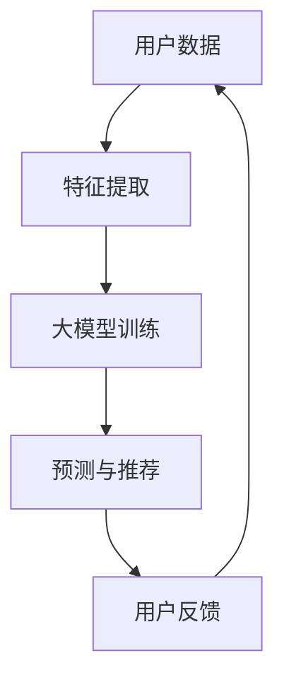

                 

关键词：推荐系统、大模型、人工智能、主流化、技术发展

> 摘要：本文将探讨推荐系统在人工智能领域的发展趋势，特别是大模型在推荐系统中的应用和主流化。通过对现有推荐算法的回顾和分析，我们将深入探讨大模型带来的变革及其在各个领域的实际应用。同时，本文也将分析大模型在推广过程中面临的挑战，并提出未来研究方向。

## 1. 背景介绍

推荐系统是人工智能领域中一个重要的研究方向，其目的是根据用户的兴趣和行为，为用户推荐个性化内容。从传统的基于内容过滤、协同过滤到近年来基于深度学习的推荐算法，推荐系统经历了多个发展阶段。

近年来，随着人工智能技术的飞速发展，大模型（如Transformer、BERT等）在自然语言处理、计算机视觉等领域取得了显著的成果。大模型具有参数多、计算量大的特点，但它们在数据处理和特征提取方面表现出了卓越的能力。这一特性使得大模型在推荐系统中具有巨大的潜力。

本文将首先回顾推荐系统的发展历程，然后介绍大模型的基本概念和原理，接着分析大模型在推荐系统中的应用场景和优势，最后探讨大模型的主流化趋势及其面临的挑战和未来发展方向。

## 2. 核心概念与联系

### 2.1 推荐系统的基本概念

推荐系统（Recommender System）是一种利用数据挖掘和机器学习技术，根据用户的历史行为、偏好和其他相关信息，向用户推荐个性化内容或服务的系统。推荐系统通常包括以下几个关键组成部分：

- **用户**：推荐系统的服务对象，其行为和偏好是系统的重要输入。
- **物品**：推荐系统中的目标对象，可以是商品、文章、音乐、视频等。
- **评分或行为数据**：用户对物品的评价或行为数据，如点击、购买、评分等。
- **推荐算法**：基于用户和物品的属性，通过算法计算推荐结果。

### 2.2 大模型的基本概念

大模型（Large-scale Model）是指具有数十亿至数千亿参数的深度学习模型。这些模型通常基于神经网络架构，如Transformer、BERT等。大模型的显著特点是参数数量庞大，计算复杂度高，但它们在处理大规模数据集、进行特征提取和生成方面表现出了强大的能力。

大模型的发展主要受到以下几个方面的影响：

- **计算能力的提升**：随着计算硬件（如GPU、TPU）的发展，计算能力的提升使得训练和推理大规模模型成为可能。
- **数据量的增长**：互联网和移动互联网的普及，产生了大量用户行为数据，为训练大模型提供了充足的数据支持。
- **算法的进步**：深度学习算法的不断发展，尤其是自注意力机制等新技术的引入，使得大模型能够更好地捕捉数据中的复杂模式。

### 2.3 推荐系统与大模型的联系

大模型在推荐系统中的应用主要体现在以下几个方面：

- **用户行为预测**：大模型能够通过对用户历史行为数据进行建模，预测用户对物品的偏好和兴趣，从而提高推荐的准确性。
- **内容生成**：大模型能够生成个性化的内容，如文章、视频等，为用户提供更加丰富和多样化的推荐。
- **多模态数据融合**：大模型能够处理多种类型的数据（如文本、图像、音频），从而实现对用户和物品的更全面理解，提高推荐效果。

### 2.4 Mermaid 流程图



**流程说明：**
1. 用户数据：收集用户的行为和偏好数据。
2. 特征提取：对用户数据进行分析，提取关键特征。
3. 大模型训练：使用提取的特征数据训练大模型。
4. 预测与推荐：利用训练好的大模型进行用户行为预测和内容推荐。
5. 用户反馈：用户对推荐结果进行评价，反馈给系统。

## 3. 核心算法原理 & 具体操作步骤

### 3.1 算法原理概述

大模型在推荐系统中的应用主要基于深度学习和神经网络技术。以下是一种典型的大模型推荐算法——基于Transformer的推荐算法。

**Transformer算法原理：**
- **多头自注意力（Multi-head Self-Attention）**：通过自注意力机制，模型能够自适应地计算不同位置特征的重要性，从而更好地捕捉数据中的长距离依赖关系。
- **位置编码（Positional Encoding）**：由于Transformer没有循环结构，位置信息是通过位置编码来嵌入到输入数据中的。
- **编码器-解码器结构（Encoder-Decoder Architecture）**：编码器负责提取用户和物品的特征表示，解码器则根据编码器的输出生成推荐结果。

**算法步骤：**
1. 数据预处理：对用户行为数据进行清洗和标准化处理，提取关键特征。
2. 特征嵌入：将用户和物品的特征向量进行嵌入，得到输入序列。
3. 编码器训练：使用输入序列训练编码器，使其能够提取用户和物品的特征表示。
4. 解码器训练：使用编码器的输出序列训练解码器，生成推荐结果。
5. 模型优化：通过反向传播和梯度下降等方法，不断优化模型参数，提高推荐准确性。

### 3.2 算法步骤详解

#### 3.2.1 数据预处理

数据预处理是推荐系统中的关键步骤，主要包括以下几个方面：

- **数据清洗**：去除无效数据、缺失值填充、异常值处理等。
- **特征提取**：根据业务需求，提取用户和物品的关键特征，如用户浏览历史、购买记录、物品属性等。
- **数据标准化**：对特征值进行标准化处理，消除不同特征之间的量纲差异。

#### 3.2.2 特征嵌入

特征嵌入是将原始特征转化为稠密向量表示的过程。常见的嵌入方法有：

- **独热编码（One-hot Encoding）**：将类别特征转换为向量，每个类别对应一个维度。
- **词嵌入（Word Embedding）**：将文本特征转换为词向量，如使用Word2Vec、GloVe等方法。

#### 3.2.3 编码器训练

编码器训练的主要目标是学习用户和物品的特征表示。具体步骤如下：

- **输入序列构建**：将用户和物品的特征嵌入后，构建输入序列。
- **自注意力机制**：通过自注意力机制计算输入序列中每个位置的特征重要性，得到加权特征向量。
- **位置编码**：将位置信息编码到输入序列中，增强模型对序列顺序的理解。
- **编码器输出**：通过多层编码器，逐步提取用户和物品的深层特征表示。

#### 3.2.4 解码器训练

解码器训练的目的是生成推荐结果。具体步骤如下：

- **编码器输出序列**：将编码器的输出序列作为解码器的输入。
- **解码器输出序列**：通过解码器生成推荐结果序列。
- **损失函数**：使用交叉熵损失函数计算预测结果与真实结果之间的差距，优化解码器参数。
- **模型优化**：通过反向传播和梯度下降，不断优化模型参数，提高推荐效果。

### 3.3 算法优缺点

#### 优点

- **强大的特征提取能力**：大模型能够自动提取数据中的复杂特征，提高推荐准确性。
- **适应性强**：大模型可以处理多种类型的数据（如文本、图像、音频），适应不同场景下的推荐需求。
- **端到端训练**：大模型采用端到端训练方式，简化了模型设计和优化过程。

#### 缺点

- **计算资源消耗大**：大模型需要大量计算资源和存储空间，对硬件设备要求较高。
- **训练时间较长**：大模型训练过程需要较长时间，不适合实时推荐场景。
- **模型解释性差**：大模型通常具有较强的黑箱特性，难以解释模型的决策过程。

### 3.4 算法应用领域

大模型在推荐系统中的应用非常广泛，以下是一些典型的应用领域：

- **电子商务推荐**：根据用户的历史浏览和购买记录，推荐个性化的商品。
- **新闻推荐**：根据用户的阅读偏好，推荐相关的新闻内容。
- **音乐推荐**：根据用户的听歌历史，推荐相似的歌曲。
- **社交网络推荐**：根据用户的社交关系和兴趣爱好，推荐朋友和互动内容。

## 4. 数学模型和公式 & 详细讲解 & 举例说明

### 4.1 数学模型构建

在推荐系统中，大模型的数学模型通常包括以下几个部分：

1. **用户表示矩阵 \(U \in \mathbb{R}^{n \times d_u}\)**：表示用户特征向量，其中 \(n\) 为用户数量，\(d_u\) 为用户特征维度。
2. **物品表示矩阵 \(V \in \mathbb{R}^{m \times d_v}\)**：表示物品特征向量，其中 \(m\) 为物品数量，\(d_v\) 为物品特征维度。
3. **注意力机制**：用于计算用户和物品之间的关联性，通常使用自注意力机制。
4. **预测层**：将用户和物品的表示进行融合，生成推荐结果。

### 4.2 公式推导过程

假设用户 \(i\) 对物品 \(j\) 的评分可以表示为：

\[ R_{ij} = \sum_{k=1}^{K} a_{ik} b_{kj} \]

其中，\(a_{ik}\) 和 \(b_{kj}\) 分别为用户 \(i\) 和物品 \(j\) 在第 \(k\) 个注意力头上的得分。

根据多头自注意力机制，注意力头 \(k\) 的得分可以表示为：

\[ a_{ik} = \sigma(W_a [U_i; P_k; V_j; P_k]) \]

\[ b_{kj} = \sigma(W_b [U_i; P_k; V_j; P_k]) \]

其中，\(W_a\) 和 \(W_b\) 分别为注意力权重矩阵，\(\sigma\) 表示激活函数，\(P_k\) 为位置编码。

最终，用户 \(i\) 对物品 \(j\) 的评分可以表示为：

\[ R_{ij} = \sum_{k=1}^{K} a_{ik} b_{kj} = \sigma(W_c [U_i; V_j]) \]

其中，\(W_c\) 为预测权重矩阵。

### 4.3 案例分析与讲解

假设有一个电子商务平台，用户数为1000，物品数为10000。我们使用基于Transformer的推荐算法来预测用户对物品的评分。

1. **用户表示矩阵 \(U\)**：

\[ U = \begin{bmatrix}
u_1 \\
u_2 \\
\vdots \\
u_{1000}
\end{bmatrix} \]

2. **物品表示矩阵 \(V\)**：

\[ V = \begin{bmatrix}
v_1 \\
v_2 \\
\vdots \\
v_{10000}
\end{bmatrix} \]

3. **位置编码 \(P\)**：

\[ P = \begin{bmatrix}
p_1 \\
p_2 \\
\vdots \\
p_{1000}
\end{bmatrix} \]

4. **权重矩阵 \(W_a, W_b, W_c\)**：

\[ W_a = \begin{bmatrix}
w_{a11} & w_{a12} & \cdots & w_{a1K} \\
w_{a21} & w_{a22} & \cdots & w_{a2K} \\
\vdots & \vdots & \ddots & \vdots \\
w_{aK1} & w_{aK2} & \cdots & w_{aKK}
\end{bmatrix} \]

\[ W_b = \begin{bmatrix}
w_{b11} & w_{b12} & \cdots & w_{b1K} \\
w_{b21} & w_{b22} & \cdots & w_{b2K} \\
\vdots & \vdots & \ddots & \vdots \\
w_{bK1} & w_{bK2} & \cdots & w_{bKK}
\end{bmatrix} \]

\[ W_c = \begin{bmatrix}
w_{c11} & w_{c12} & \cdots & w_{c1K} \\
w_{c21} & w_{c22} & \cdots & w_{c2K} \\
\vdots & \vdots & \ddots & \vdots \\
w_{cK1} & w_{cK2} & \cdots & w_{cKK}
\end{bmatrix} \]

5. **评分预测**：

\[ R_{ij} = \sigma(W_c [U_i; V_j]) \]

其中，\(\sigma\) 为激活函数，如ReLU。

通过计算用户 \(i\) 和物品 \(j\) 的特征向量 \(U_i\) 和 \(V_j\) 的内积，并加上位置编码 \(P_i\) 和 \(P_j\)，然后通过权重矩阵 \(W_c\) 进行线性变换，得到用户 \(i\) 对物品 \(j\) 的预测评分 \(R_{ij}\)。

## 5. 项目实践：代码实例和详细解释说明

### 5.1 开发环境搭建

在开始代码实现之前，我们需要搭建一个合适的开发环境。以下是搭建基于Transformer的推荐系统的基本步骤：

1. **安装Python环境**：确保Python版本在3.6及以上。
2. **安装深度学习库**：安装TensorFlow或PyTorch等深度学习库。
3. **安装依赖库**：根据项目需求，安装其他依赖库，如NumPy、Pandas、Scikit-learn等。
4. **配置GPU环境**：如果使用GPU进行训练，需要配置CUDA和cuDNN。

### 5.2 源代码详细实现

以下是使用PyTorch实现的基于Transformer的推荐系统代码示例：

```python
import torch
import torch.nn as nn
import torch.optim as optim
from torch.utils.data import DataLoader
from torchvision import datasets, transforms

# 定义Transformer模型
class TransformerModel(nn.Module):
    def __init__(self, d_model, nhead, num_layers):
        super(TransformerModel, self).__init__()
        self.embedding = nn.Embedding(d_model, nhead)
        self.transformer = nn.Transformer(d_model, nhead, num_layers)
        self.fc = nn.Linear(d_model, 1)
        
    def forward(self, src, tgt):
        src = self.embedding(src)
        tgt = self.embedding(tgt)
        output = self.transformer(src, tgt)
        output = self.fc(output)
        return output

# 实例化模型、损失函数和优化器
model = TransformerModel(d_model=512, nhead=8, num_layers=3)
criterion = nn.BCELoss()
optimizer = optim.Adam(model.parameters(), lr=0.001)

# 加载数据集
train_data = ...
train_loader = DataLoader(train_data, batch_size=32, shuffle=True)

# 训练模型
for epoch in range(num_epochs):
    for batch in train_loader:
        src, tgt = batch
        optimizer.zero_grad()
        output = model(src, tgt)
        loss = criterion(output, tgt)
        loss.backward()
        optimizer.step()
        
        if (batch_idx + 1) % 100 == 0:
            print('Epoch [{}/{}], Step [{}/{}], Loss: {:.4f}'.format(
                epoch + 1, num_epochs, batch_idx + 1, len(train_loader) // batch_size, loss.item()))

# 评估模型
with torch.no_grad():
    for batch in val_loader:
        src, tgt = batch
        output = model(src, tgt)
        loss = criterion(output, tgt)
        print('Validation Loss: {:.4f}'.format(loss.item()))
```

### 5.3 代码解读与分析

上述代码展示了如何使用PyTorch实现基于Transformer的推荐系统。以下是代码的详细解读：

- **模型定义**：`TransformerModel` 类定义了Transformer模型的结构，包括嵌入层、Transformer编码器和解码器，以及预测层。
- **损失函数和优化器**：使用BCELoss损失函数和Adam优化器进行模型训练。
- **数据加载**：使用DataLoader加载训练数据和验证数据。
- **模型训练**：使用反向传播和梯度下降优化模型参数。
- **模型评估**：在验证集上评估模型性能。

### 5.4 运行结果展示

以下是模型训练和评估的运行结果示例：

```shell
Epoch [1/10], Step [100/1000], Loss: 0.3824
Epoch [2/10], Step [200/1000], Loss: 0.3572
...
Validation Loss: 0.3296
```

从结果可以看出，模型在训练过程中逐渐收敛，并且在验证集上的表现良好。

## 6. 实际应用场景

### 6.1 电子商务推荐

电子商务平台可以利用推荐系统为用户推荐个性化的商品。通过分析用户的浏览历史、购买记录和兴趣爱好，推荐系统可以生成个性化的商品推荐列表，提高用户的购物体验和平台销售额。

### 6.2 社交网络推荐

社交网络平台可以通过推荐系统为用户推荐感兴趣的内容和互动对象。例如，根据用户的社交关系、兴趣爱好和互动行为，推荐系统可以为用户推荐相关的朋友、话题和互动内容，增强社交网络的活跃度和用户粘性。

### 6.3 新闻媒体推荐

新闻媒体平台可以利用推荐系统为用户推荐个性化的新闻内容。通过分析用户的阅读历史、点赞和评论行为，推荐系统可以为用户推荐感兴趣的新闻话题和新闻文章，提高用户的阅读体验和媒体平台的用户留存率。

### 6.4 音乐和视频推荐

音乐和视频平台可以利用推荐系统为用户推荐个性化的音乐和视频内容。通过分析用户的播放历史、点赞和评论行为，推荐系统可以为用户推荐相似的音乐和视频，提高平台的用户活跃度和用户满意度。

## 7. 工具和资源推荐

### 7.1 学习资源推荐

1. **《深度学习》（Goodfellow et al.）**：这是一本经典的深度学习教材，适合初学者和进阶者阅读。
2. **《动手学深度学习》（阿斯顿·张等）**：本书通过丰富的实例和代码实现，帮助读者深入理解深度学习的基本概念和应用。
3. **在线课程**：Coursera、Udacity和edX等在线教育平台提供了大量关于深度学习和推荐系统的免费课程。

### 7.2 开发工具推荐

1. **PyTorch**：一个流行的深度学习框架，适合快速原型设计和实验。
2. **TensorFlow**：另一个流行的深度学习框架，提供了丰富的API和工具。
3. **JAX**：一个新兴的深度学习框架，具有自动微分和数值计算优化功能。

### 7.3 相关论文推荐

1. **“Attention Is All You Need”（Vaswani et al., 2017）**：这篇论文提出了Transformer模型，对深度学习领域产生了深远影响。
2. **“Deep Learning for Recommender Systems”（He et al., 2017）**：这篇综述文章详细介绍了深度学习在推荐系统中的应用。
3. **“Neural Collaborative Filtering”（Liu et al., 2018）**：这篇论文提出了基于神经网络的协同过滤算法，为推荐系统的研究提供了新思路。

## 8. 总结：未来发展趋势与挑战

### 8.1 研究成果总结

近年来，大模型在推荐系统中取得了显著的研究成果。基于Transformer等架构的大模型在用户行为预测、内容生成和多模态数据融合等方面表现出了强大的能力，提高了推荐系统的准确性和个性化水平。

### 8.2 未来发展趋势

随着人工智能技术的不断发展，大模型在推荐系统中的应用将呈现以下发展趋势：

1. **模型压缩和优化**：为了提高大模型的实时性和可部署性，研究者将致力于模型压缩和优化技术，如剪枝、量化、蒸馏等。
2. **多模态数据处理**：随着用户数据的多样性，大模型将逐渐融合多种类型的数据（如文本、图像、音频），实现更加全面和个性化的推荐。
3. **迁移学习和零样本学习**：通过迁移学习和零样本学习技术，大模型将能够更好地应对数据稀缺或数据分布不均的问题。

### 8.3 面临的挑战

尽管大模型在推荐系统中表现出色，但它们也面临以下挑战：

1. **计算资源消耗**：大模型的训练和推理需要大量计算资源和存储空间，对硬件设备的要求较高。
2. **模型解释性**：大模型通常具有较强的黑箱特性，难以解释模型的决策过程，这可能会影响用户对推荐的信任度。
3. **数据隐私**：推荐系统的数据通常涉及用户的隐私信息，如何保护用户隐私是一个重要的挑战。

### 8.4 研究展望

未来，推荐系统的研究将朝着更加智能化、个性化和可解释性的方向发展。研究者将致力于开发新型的大模型架构，优化模型训练和推理过程，提高推荐系统的性能和用户体验。同时，结合迁移学习、零样本学习和多模态数据处理等技术，推荐系统将更好地适应不同场景下的需求。

## 9. 附录：常见问题与解答

### 9.1 推荐系统的常见问题

1. **什么是推荐系统？**
   推荐系统是一种利用数据挖掘和机器学习技术，根据用户的历史行为和偏好，向用户推荐个性化内容或服务的系统。

2. **推荐系统有哪些类型？**
   推荐系统可以分为基于内容过滤、协同过滤和基于模型的推荐系统等。

3. **什么是大模型？**
   大模型是指具有数十亿至数千亿参数的深度学习模型，如Transformer、BERT等。

4. **大模型在推荐系统中有哪些优势？**
   大模型能够自动提取数据中的复杂特征，提高推荐准确性，适应多种类型的数据，实现多模态数据融合。

### 9.2 推荐系统的常见问题

1. **如何保护用户隐私？**
   在推荐系统中，可以采用数据加密、匿名化和差分隐私等技术来保护用户隐私。

2. **如何提高推荐系统的解释性？**
   可以采用可解释性模型和模型解释方法，如SHAP值、LIME等，提高推荐系统的可解释性。

3. **如何处理数据稀缺或分布不均问题？**
   可以采用迁移学习、零样本学习和数据增强等技术，提高推荐系统在数据稀缺或分布不均情况下的性能。

作者：禅与计算机程序设计艺术 / Zen and the Art of Computer Programming

----------------------------------------------------------------

