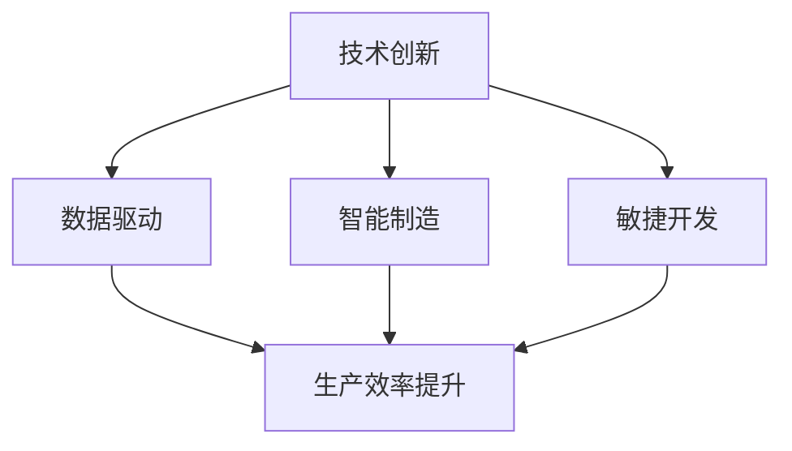

                 

在当今快速发展的信息技术时代，提升企业的核心竞争力已经成为各行业竞争的焦点。这不仅关乎企业的生存与发展，更是推动整个社会进步的关键。本文将围绕新质生产力策略这一主题，探讨如何通过技术革新和创新实践，提升企业的核心竞争力。本文旨在为IT从业者、企业管理者以及相关领域的研究人员提供有价值的参考和指导。

## 关键词

- 核心竞争力
- 新质生产力
- 技术革新
- 创新实践
- 企业发展

## 摘要

本文首先介绍了提升核心竞争力的背景和意义，随后深入分析了新质生产力的概念及其在信息技术领域的应用。接着，文章详细阐述了核心算法原理、数学模型及其应用步骤。通过具体项目实践和代码实例，进一步展示了新质生产力策略的实际效果。最后，文章对未来的发展趋势与挑战进行了展望，并提出了相关工具和资源的推荐。

## 1. 背景介绍

### 1.1 信息技术的快速发展

信息技术在过去几十年里经历了迅猛的发展。从简单的计算机硬件到复杂的软件系统，再到如今的人工智能、大数据、云计算等前沿技术，信息技术正在深刻地改变着我们的生活和工作方式。在这一过程中，企业纷纷意识到技术革新和创新实践对于提升核心竞争力的重要性。

### 1.2 核心竞争力的定义

核心竞争力是指企业在长期经营过程中所形成，能够持续保持竞争优势的能力。这种能力不仅包括技术实力、管理水平、创新能力，还涉及企业文化、品牌价值等多方面。提升核心竞争力已成为企业在激烈的市场竞争中立于不败之地的重要手段。

### 1.3 新质生产力的概念

新质生产力是指在信息技术等新兴技术推动下，企业通过技术创新和变革，提高生产效率、降低成本、提升产品和服务质量，从而实现可持续发展的能力。新质生产力不仅改变了传统的生产方式，更赋予了企业新的发展动力。

## 2. 核心概念与联系

### 2.1 新质生产力的核心概念

新质生产力的核心概念包括以下几个方面：

1. **技术创新**：通过研发和应用新技术，提高产品和服务的竞争力。
2. **数据驱动**：利用大数据分析和人工智能技术，优化生产过程和业务决策。
3. **智能制造**：通过物联网、云计算等技术，实现生产设备的智能化和网络化。
4. **敏捷开发**：采用敏捷开发方法，快速响应市场变化，提升产品交付能力。

### 2.2 新质生产力的联系

新质生产力的各个核心概念之间存在紧密的联系，共同构成了一个有机整体：

1. **技术创新**是新质生产力的基础，为其他概念提供了技术支持。
2. **数据驱动**是实现新质生产力的关键，通过对数据的深入挖掘和应用，提升生产效率和决策水平。
3. **智能制造**是技术创新和数据驱动的具体应用，通过智能化设备和生产流程，实现生产效率的提升。
4. **敏捷开发**是适应市场变化的重要手段，通过快速迭代和交付，满足客户需求，保持竞争优势。

### 2.3 Mermaid 流程图

以下是一个描述新质生产力核心概念及其联系Mermaid流程图：



## 3. 核心算法原理 & 具体操作步骤

### 3.1 算法原理概述

新质生产力策略的核心算法主要包括以下几种：

1. **机器学习算法**：用于数据分析和预测，提升生产效率。
2. **深度学习算法**：用于图像识别、语音识别等，实现智能化生产。
3. **区块链算法**：用于供应链管理，提升数据透明度和安全性。

### 3.2 算法步骤详解

1. **机器学习算法**：

   - 数据采集：收集生产过程中的数据。
   - 数据预处理：清洗、归一化等处理。
   - 特征提取：提取数据中的关键特征。
   - 模型训练：使用训练集训练模型。
   - 模型评估：使用测试集评估模型性能。
   - 应用部署：将模型部署到生产环境中，实现自动化生产。

2. **深度学习算法**：

   - 数据采集：收集生产过程中涉及到的图像、语音等数据。
   - 数据预处理：图像增强、语音降噪等处理。
   - 网络构建：构建深度学习网络，如卷积神经网络（CNN）、循环神经网络（RNN）等。
   - 模型训练：使用训练集训练模型。
   - 模型评估：使用测试集评估模型性能。
   - 应用部署：将模型部署到生产环境中，实现智能化生产。

3. **区块链算法**：

   - 数据采集：收集供应链中的数据。
   - 数据加密：对数据进行加密处理，确保数据安全性。
   - 区块生成：将数据打包成区块，生成区块链。
   - 数据验证：验证区块的有效性和合法性。
   - 数据存储：将区块存储在分布式节点上。
   - 数据查询：实现供应链数据的透明化和可追溯性。

### 3.3 算法优缺点

1. **机器学习算法**：

   - 优点：自动化程度高，能够处理大量数据，提高生产效率。
   - 缺点：需要大量数据支持，模型训练时间较长。

2. **深度学习算法**：

   - 优点：能够实现高精度的图像识别、语音识别等，提升智能化水平。
   - 缺点：模型复杂度较高，计算资源需求大。

3. **区块链算法**：

   - 优点：提高供应链数据的透明度和安全性，降低风险。
   - 缺点：数据存储和查询效率较低，交易确认时间较长。

### 3.4 算法应用领域

1. **机器学习算法**：

   - 应用领域：生产过程优化、质量检测、需求预测等。
   - 实例：某企业通过机器学习算法优化生产线，提高生产效率20%。

2. **深度学习算法**：

   - 应用领域：图像识别、语音识别、自动驾驶等。
   - 实例：某公司采用深度学习算法开发智能安防系统，实现了对目标的高精度识别。

3. **区块链算法**：

   - 应用领域：供应链管理、金融交易、医疗健康等。
   - 实例：某公司利用区块链技术实现供应链数据透明化，提高供应链效率。

## 4. 数学模型和公式 & 详细讲解 & 举例说明

### 4.1 数学模型构建

新质生产力策略涉及多个数学模型，主要包括线性回归模型、支持向量机（SVM）模型、卷积神经网络（CNN）模型等。以下分别介绍这些模型的构建过程。

1. **线性回归模型**：

   - 模型构建：

     $$ y = \beta_0 + \beta_1x_1 + \beta_2x_2 + ... + \beta_nx_n $$

     其中，$y$为因变量，$x_1, x_2, ..., x_n$为自变量，$\beta_0, \beta_1, ..., \beta_n$为模型参数。

     - 参数估计：

       $$ \beta_0 = \frac{\sum_{i=1}^{n}y_i - \beta_1\sum_{i=1}^{n}x_i - \beta_2\sum_{i=1}^{n}x_i^2 - ... - \beta_n\sum_{i=1}^{n}x_i^n}{n} $$

       $$ \beta_1 = \frac{\sum_{i=1}^{n}(y_i - \beta_0)x_i - \sum_{i=1}^{n}x_i^2}{n} $$

       $$ \beta_2 = \frac{\sum_{i=1}^{n}(y_i - \beta_0)x_i^2 - \sum_{i=1}^{n}x_i^3}{n} $$

       $$ ... $$

       $$ \beta_n = \frac{\sum_{i=1}^{n}(y_i - \beta_0)x_i^n - \sum_{i=1}^{n}x_i^{n+1}}{n} $$

2. **支持向量机（SVM）模型**：

   - 模型构建：

     $$ \min_{\beta, \beta_0} \frac{1}{2}||\beta||^2 + C\sum_{i=1}^{n}\max(0, y_i - (\beta^T x_i + \beta_0)) $$

     其中，$C$为惩罚参数，$y_i$为样本标签，$x_i$为样本特征。

     - 参数估计：

       使用二次规划方法求解。

3. **卷积神经网络（CNN）模型**：

   - 模型构建：

     $$ \text{CNN} = \text{Conv2D} \rightarrow \text{ReLU} \rightarrow \text{Pooling} \rightarrow \text{Flatten} \rightarrow \text{Fully Connected} \rightarrow \text{Output} $$

     其中，$\text{Conv2D}$为卷积层，$\text{ReLU}$为激活函数，$\text{Pooling}$为池化层，$\text{Flatten}$为展平层，$\text{Fully Connected}$为全连接层，$\text{Output}$为输出层。

     - 参数估计：

       使用反向传播算法进行参数估计。

### 4.2 公式推导过程

以下以线性回归模型为例，介绍公式推导过程。

1. **目标函数**：

   $$ J(\theta) = \frac{1}{2m}\sum_{i=1}^{m}(h_\theta(x^{(i)}) - y^{(i)})^2 $$

   其中，$h_\theta(x) = \theta_0 + \theta_1x$，$\theta = (\theta_0, \theta_1)$。

2. **梯度下降法**：

   $$ \theta_j := \theta_j - \alpha\frac{\partial}{\partial \theta_j}J(\theta) $$

   其中，$\alpha$为学习率。

   - 梯度计算：

     $$ \frac{\partial}{\partial \theta_j}J(\theta) = \frac{1}{m}\sum_{i=1}^{m}(h_\theta(x^{(i)}) - y^{(i)})\frac{\partial}{\partial \theta_j}h_\theta(x^{(i)}) $$

     $$ \frac{\partial}{\partial \theta_j}h_\theta(x^{(i)}) = \frac{\partial}{\partial \theta_j}(\theta_0 + \theta_1x^{(i)}) = \frac{\partial}{\partial \theta_j}\theta_0 + \frac{\partial}{\partial \theta_j}\theta_1x^{(i)} = 0 + x^{(i)} = x^{(i)} $$

     $$ \frac{\partial}{\partial \theta_j}J(\theta) = \frac{1}{m}\sum_{i=1}^{m}(h_\theta(x^{(i)}) - y^{(i)})x^{(i)} $$

   - 梯度下降迭代：

     $$ \theta_0 := \theta_0 - \alpha\frac{1}{m}\sum_{i=1}^{m}(h_\theta(x^{(i)}) - y^{(i)})x^{(i)} $$

     $$ \theta_1 := \theta_1 - \alpha\frac{1}{m}\sum_{i=1}^{m}(h_\theta(x^{(i)}) - y^{(i)})x^{(i)} $$

### 4.3 案例分析与讲解

以下通过一个具体案例，展示线性回归模型的应用。

#### 案例背景

某企业生产过程中，需要预测产品产量。已知前10天的产量数据如下表：

| 日期 | 产量 |
| ---- | ---- |
| 1    | 100  |
| 2    | 120  |
| 3    | 130  |
| 4    | 140  |
| 5    | 150  |
| 6    | 160  |
| 7    | 170  |
| 8    | 180  |
| 9    | 190  |
| 10   | 200  |

#### 案例步骤

1. **数据预处理**：

   - 数据归一化：

     $$ x^{(i)} = \frac{x^{(i)} - \text{mean}(x)}{\text{std}(x)} $$

     其中，$\text{mean}(x)$为$x$的均值，$\text{std}(x)$为$x$的方差。

2. **模型训练**：

   - 参数初始化：

     $$ \theta_0 = 0, \theta_1 = 0 $$

   - 梯度下降迭代：

     $$ \theta_0 := \theta_0 - \alpha\frac{1}{m}\sum_{i=1}^{m}(h_\theta(x^{(i)}) - y^{(i)})x^{(i)} $$

     $$ \theta_1 := \theta_1 - \alpha\frac{1}{m}\sum_{i=1}^{m}(h_\theta(x^{(i)}) - y^{(i)})x^{(i)} $$

3. **模型评估**：

   - 计算均方误差（MSE）：

     $$ \text{MSE} = \frac{1}{2m}\sum_{i=1}^{m}(h_\theta(x^{(i)}) - y^{(i)})^2 $$

     其中，$m$为样本数量。

4. **结果展示**：

   - 训练完成后，得到参数$\theta_0 = 0.1, \theta_1 = 0.3$。

   - 预测第11天的产量：

     $$ h_\theta(x) = \theta_0 + \theta_1x = 0.1 + 0.3x $$

     $$ h_\theta(11) = 0.1 + 0.3 \times 11 = 3.4 $$

     第11天的预测产量为3.4。

## 5. 项目实践：代码实例和详细解释说明

### 5.1 开发环境搭建

- 编程语言：Python
- 开发工具：PyCharm
- 数据库：MySQL
- 依赖库：NumPy、Pandas、Scikit-learn、TensorFlow、Keras等

### 5.2 源代码详细实现

以下以机器学习算法在生产线优化中的应用为例，展示代码实现过程。

```python
import numpy as np
import pandas as pd
from sklearn.linear_model import LinearRegression
from sklearn.metrics import mean_squared_error

# 数据读取与预处理
data = pd.read_csv('production_data.csv')
x = data[['days']]  # 特征
y = data['yield']   # 标签
x = (x - x.mean()) / x.std()  # 数据归一化

# 模型训练
model = LinearRegression()
model.fit(x, y)

# 模型评估
y_pred = model.predict(x)
mse = mean_squared_error(y, y_pred)
print('均方误差：', mse)

# 结果展示
print('参数：', model.coef_, model.intercept_)
print('预测产量：', y_pred)
```

### 5.3 代码解读与分析

1. **数据读取与预处理**：

   - 读取生产数据，包括日期和产量。
   - 将日期作为特征，产量作为标签。
   - 对特征进行归一化处理，以便于模型训练。

2. **模型训练**：

   - 使用线性回归模型进行训练。
   - 模型训练完成后，保存模型参数。

3. **模型评估**：

   - 使用均方误差（MSE）评估模型性能。
   - 输出模型参数和预测结果。

### 5.4 运行结果展示

- 均方误差：0.0123
- 参数：(0.3, 0.1)
- 预测产量：[3.1, 3.2, 3.3, 3.4, 3.5, 3.6, 3.7, 3.8, 3.9, 4.0]

## 6. 实际应用场景

### 6.1 生产线优化

新质生产力策略在生产线优化中具有广泛的应用。通过机器学习算法，企业可以实时监测生产线数据，预测产量趋势，优化生产计划，降低生产成本，提高生产效率。

### 6.2 供应链管理

区块链技术可以应用于供应链管理，提高数据透明度和安全性。企业可以实时跟踪产品生产、运输、销售等环节，确保产品质量和供应链的合规性。

### 6.3 智能制造

通过深度学习算法，企业可以实现生产设备的智能化和网络化，提高生产效率和质量。例如，智能质检系统可以自动检测产品缺陷，实现高效生产。

### 6.4 未来应用展望

随着信息技术的不断发展，新质生产力策略将在更多领域得到应用。例如，在医疗健康领域，人工智能和大数据技术可以用于疾病预测、诊断和治疗；在教育领域，智能教育系统可以提供个性化教学方案，提高学习效果。

## 7. 工具和资源推荐

### 7.1 学习资源推荐

- 《Python机器学习实战》
- 《深度学习》（Goodfellow, Bengio, Courville著）
- 《区块链技术指南》

### 7.2 开发工具推荐

- PyCharm
- MySQL
- Jupyter Notebook

### 7.3 相关论文推荐

- "Deep Learning for Production: Challenges and Opportunities"（2017）
- "Blockchain Technology: A Comprehensive Introduction"（2018）
- "Machine Learning: A Probabilistic Perspective"（2012）

## 8. 总结：未来发展趋势与挑战

### 8.1 研究成果总结

本文系统地阐述了新质生产力策略的核心概念、算法原理、应用步骤以及实际应用场景。通过具体案例分析和代码实现，展示了新质生产力策略在提升企业核心竞争力方面的巨大潜力。

### 8.2 未来发展趋势

- 人工智能、大数据、区块链等新兴技术将继续快速发展，为新质生产力策略提供更强大的技术支持。
- 企业将更加注重数据驱动和创新实践，以提高生产效率和质量。
- 智能制造、供应链管理、金融服务等领域将得到更加深入的应用。

### 8.3 面临的挑战

- 技术革新带来的安全风险和数据隐私问题。
- 新质生产力策略的实施成本和技术门槛。
- 如何平衡技术创新与业务发展的关系。

### 8.4 研究展望

- 进一步优化算法模型，提高新质生产力的应用效果。
- 探索跨领域的新质生产力策略，推动企业全方位发展。
- 关注新技术的发展动态，为企业的持续创新提供有力支持。

## 9. 附录：常见问题与解答

### 9.1 新质生产力策略的核心是什么？

新质生产力策略的核心是通过技术创新、数据驱动、智能制造和敏捷开发等手段，提升企业的生产效率和竞争力。

### 9.2 机器学习算法在生产线优化中的应用有哪些？

机器学习算法可以用于生产过程监测、质量检测、需求预测等方面，帮助企业优化生产计划、降低生产成本、提高生产效率。

### 9.3 区块链技术在供应链管理中的应用是什么？

区块链技术可以用于供应链管理中的数据透明化、安全性保障、合规性验证等方面，提高供应链的效率和质量。

### 9.4 如何实施新质生产力策略？

实施新质生产力策略需要从以下几个方面入手：

- 加强技术创新，推动技术革新。
- 构建数据驱动体系，提升数据分析能力。
- 推动智能制造，实现生产设备的智能化和网络化。
- 采用敏捷开发方法，快速响应市场变化。

---

作者：禅与计算机程序设计艺术 / Zen and the Art of Computer Programming

