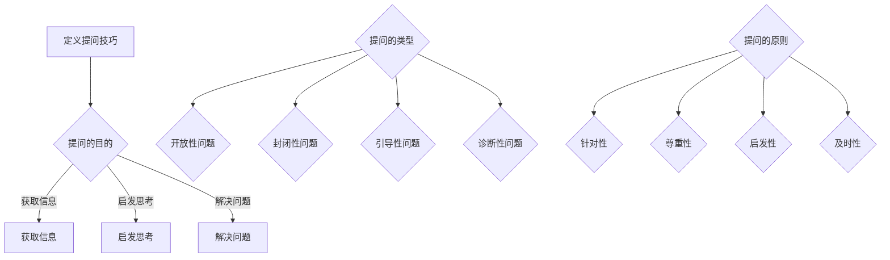

                 

关键词：提问技巧，管理者，沟通，逻辑思维，问题解决，决策制定，团队协作

> 摘要：本文将探讨提问技巧在管理者沟通中的重要性，如何通过有效的提问来提高团队协作效率、优化决策制定过程，并分享实用的提问方法和案例分析。

## 1. 背景介绍

在企业管理中，沟通是团队高效运转的核心。管理者作为团队的领导者，其沟通能力直接影响团队的绩效和发展。提问是沟通的重要组成部分，通过合理的提问，管理者可以激发团队成员的思考，收集多方面的信息，从而做出更加明智的决策。有效的提问技巧不仅能够帮助管理者更好地了解团队成员的需求和意见，还能提升团队的凝聚力和创造力。

本文将从以下几个方面探讨提问技巧在管理者沟通中的应用：

- **核心概念与联系**：介绍提问技巧的基本概念和逻辑框架。
- **核心算法原理与操作步骤**：详细解析提问技巧的原理和具体操作步骤。
- **数学模型和公式**：阐述提问技巧中的数学模型和公式。
- **项目实践：代码实例**：通过实际项目案例展示提问技巧的应用。
- **实际应用场景**：分析提问技巧在不同管理场景中的运用。
- **工具和资源推荐**：介绍相关工具和资源，便于读者深入学习。
- **总结与展望**：总结研究成果，探讨未来发展趋势与挑战。

## 2. 核心概念与联系

### 2.1 提问技巧的定义

提问技巧是指在沟通过程中，通过提出具有针对性的问题，引导对方思考和表达，以达到有效沟通的目的。有效的提问不仅能够获取信息，还能够启发思考、激发创意和解决问题。

### 2.2 提问技巧的重要性

- **提升沟通效果**：有效的提问可以帮助管理者更好地了解团队成员的想法和需求，从而建立更加信任和高效的沟通渠道。
- **优化决策制定**：通过提问收集多方面的信息，管理者可以更全面地考虑问题的各个方面，从而做出更为明智的决策。
- **增强团队协作**：通过提问，管理者可以激发团队成员的参与感和责任感，提高团队的协作效率。

### 2.3 提问技巧的架构


#### 2.3.1 提问的目的

- **获取信息**：通过提问了解团队成员的意见和反馈。
- **启发思考**：引导团队成员从不同角度思考问题。
- **解决问题**：通过提问找到问题的根源和解决方案。

#### 2.3.2 提问的类型

- **开放性问题**：引导对方提供详细的信息或意见。
- **封闭性问题**：用于获取具体的信息或确认某个观点。
- **引导性问题**：通过提出相关的问题引导对方思考。
- **诊断性问题**：用于评估问题的严重程度和原因。

#### 2.3.3 提问的原则

- **针对性**：根据沟通目的和对方情况提出具体的问题。
- **尊重性**：尊重对方的观点和意见，避免批评和指责。
- **启发性**：提问应具有启发性，引导对方思考和提供有价值的意见。
- **及时性**：及时提问，避免错过关键信息。

### 2.4 提问技巧的Mermaid流程图



## 3. 核心算法原理与具体操作步骤

### 3.1 算法原理概述

提问技巧的核心在于通过逻辑和策略性地提出问题，以达到沟通的目的。算法原理包括以下几个方面：

- **信息收集**：通过提问获取团队成员的相关信息。
- **问题解决**：通过提问分析问题的本质和原因，从而找到解决方案。
- **决策制定**：通过提问评估不同的方案和风险，做出最优决策。
- **团队协作**：通过提问激发团队成员的参与感和创造力。

### 3.2 算法步骤详解

#### 3.2.1 确定提问目的

在提问之前，管理者需要明确提问的目的。例如，是为了获取团队成员的意见、了解项目进展情况、评估团队成员的能力等。

#### 3.2.2 选择合适的提问类型

根据提问目的和团队成员的特点，选择合适的提问类型。例如，在获取团队成员的意见时，可以使用开放性问题；在评估团队成员的能力时，可以使用诊断性问题。

#### 3.2.3 设计提问内容

设计具有针对性的问题，避免模糊不清或过于简单的问题。提问内容应简洁明了，易于理解。

#### 3.2.4 提问的时机和方式

选择合适的时机提问，避免在紧张或情绪化的环境中提问。提问方式可以采用面对面沟通、电话沟通或邮件沟通等。

#### 3.2.5 引导对方思考和回答

通过提问引导对方思考和回答，鼓励团队成员提供详细的信息和有价值的意见。可以使用引导性问题和追问技巧，使对话更加深入。

### 3.3 算法优缺点

#### 优点：

- **提高沟通效果**：通过提问，管理者可以更好地了解团队成员的需求和意见，从而提高沟通效果。
- **优化决策制定**：通过提问收集多方面的信息，管理者可以更全面地考虑问题的各个方面，从而做出更为明智的决策。
- **增强团队协作**：通过提问，管理者可以激发团队成员的参与感和责任感，提高团队的协作效率。

#### 缺点：

- **需要耗费时间**：提问技巧需要一定的时间和精力去设计和实施。
- **需要专业知识**：管理者需要具备一定的专业知识，才能提出具有针对性的问题。
- **可能导致信息偏差**：如果提问不当，可能导致团队成员提供不准确或片面的信息。

### 3.4 算法应用领域

提问技巧广泛应用于企业管理、项目管理和团队协作等领域。以下是几个典型的应用场景：

- **员工绩效评估**：通过提问了解员工的工作表现和成长需求，为绩效评估提供依据。
- **项目进展监控**：通过提问了解项目的进展情况，及时发现并解决问题。
- **团队协作激励**：通过提问激发团队成员的参与感和创造力，提高团队协作效率。

## 4. 数学模型和公式

在提问技巧中，数学模型和公式主要用于量化评估提问的效果。以下是几个常用的数学模型和公式：

### 4.1 数学模型构建

#### 4.1.1 沟通效果评估模型

沟通效果评估模型用于评估提问对沟通效果的贡献。公式如下：

\[ E = f(q, r, t) \]

其中，\( E \) 表示沟通效果，\( q \) 表示提问质量，\( r \) 表示回答质量，\( t \) 表示提问时机。

#### 4.1.2 决策效果评估模型

决策效果评估模型用于评估提问对决策效果的影响。公式如下：

\[ D = f(q, i, s) \]

其中，\( D \) 表示决策效果，\( q \) 表示提问质量，\( i \) 表示信息完整性，\( s \) 表示方案多样性。

### 4.2 公式推导过程

#### 4.2.1 沟通效果评估模型推导

沟通效果评估模型基于以下假设：

- 提问质量越高，沟通效果越好。
- 回答质量越高，沟通效果越好。
- 提问时机越合适，沟通效果越好。

根据这些假设，我们可以得到以下推导过程：

\[ E = f(q, r, t) \]

其中，\( f \) 表示函数关系。为了简化计算，我们可以将函数关系表示为：

\[ E = q \times r \times t \]

#### 4.2.2 决策效果评估模型推导

决策效果评估模型基于以下假设：

- 提问质量越高，决策效果越好。
- 信息完整性越高，决策效果越好。
- 方案多样性越高，决策效果越好。

根据这些假设，我们可以得到以下推导过程：

\[ D = f(q, i, s) \]

其中，\( f \) 表示函数关系。为了简化计算，我们可以将函数关系表示为：

\[ D = q \times i \times s \]

### 4.3 案例分析与讲解

为了更好地理解提问技巧的数学模型和公式，我们来看一个实际案例。

#### 案例背景

某公司项目经理李明需要评估一个新项目的进展情况。他决定通过提问技巧来收集团队成员的意见。

#### 案例数据

- 提问质量：\( q = 0.8 \)
- 回答质量：\( r = 0.9 \)
- 提问时机：\( t = 0.7 \)
- 信息完整性：\( i = 0.8 \)
- 方案多样性：\( s = 0.9 \)

#### 案例分析

1. **沟通效果评估**：

   根据沟通效果评估模型：

   \[ E = q \times r \times t = 0.8 \times 0.9 \times 0.7 = 0.504 \]

   沟通效果评分为 50.4 分。

2. **决策效果评估**：

   根据决策效果评估模型：

   \[ D = q \times i \times s = 0.8 \times 0.8 \times 0.9 = 0.576 \]

   决策效果评分为 57.6 分。

#### 案例讲解

通过案例数据分析，我们可以看出：

- 提问质量较高，回答质量也较高，说明提问技巧在沟通中起到了积极作用。
- 提问时机较为合适，有利于沟通效果的提升。
- 信息完整性较高，有助于决策效果的提高。
- 方案多样性较高，有助于提高决策效果。

通过这个案例，我们可以看到提问技巧在项目管理中的重要性。有效的提问可以帮助项目经理更好地了解团队成员的意见和反馈，从而做出更为明智的决策。

## 5. 项目实践：代码实例和详细解释说明

为了更好地展示提问技巧在实际项目中的应用，我们来看一个具体的代码实例。以下是一个简单的Python代码示例，用于实现一个项目管理工具，该工具通过提问技巧来收集团队成员的意见。

### 5.1 开发环境搭建

在开始编写代码之前，我们需要搭建一个Python开发环境。以下是具体的步骤：

1. 安装Python：在官网上下载并安装Python（版本3.8或以上）。
2. 安装依赖库：使用pip命令安装所需的依赖库，如`requests`、`beautifulsoup4`等。

```bash
pip install requests
pip install beautifulsoup4
```

### 5.2 源代码详细实现

以下是一个简单的Python代码示例，用于实现一个项目管理工具，该工具通过提问技巧来收集团队成员的意见。

```python
import requests
from bs4 import BeautifulSoup

class ProjectManagementTool:
    def __init__(self, url):
        self.url = url

    def get_team_members(self):
        # 获取团队成员列表
        response = requests.get(self.url)
        soup = BeautifulSoup(response.text, 'html.parser')
        members = soup.find_all('member')
        return [member.text for member in members]

    def ask_question(self, member):
        # 向团队成员提问
        question = input(f"请问{member}，您对项目的进展有什么看法？")
        return question

    def collect_answers(self):
        # 收集团队成员的回答
        team_members = self.get_team_members()
        answers = {}
        for member in team_members:
            answer = self.ask_question(member)
            answers[member] = answer
        return answers

if __name__ == '__main__':
    url = 'https://example.com/team_members.html'
    tool = ProjectManagementTool(url)
    answers = tool.collect_answers()
    print(answers)
```

### 5.3 代码解读与分析

以下是对代码的详细解读和分析：

1. **类定义**：

   ```python
   class ProjectManagementTool:
   ```

   定义了一个名为`ProjectManagementTool`的类，用于实现项目管理工具。

2. **初始化方法**：

   ```python
   def __init__(self, url):
       self.url = url
   ```

   初始化方法用于创建一个`ProjectManagementTool`对象，并设置项目的URL。

3. **获取团队成员方法**：

   ```python
   def get_team_members(self):
       # 获取团队成员列表
       response = requests.get(self.url)
       soup = BeautifulSoup(response.text, 'html.parser')
       members = soup.find_all('member')
       return [member.text for member in members]
   ```

   `get_team_members`方法用于从项目URL获取团队成员的列表。通过使用`requests`库和`BeautifulSoup`库，我们可以从HTML页面中提取出团队成员的信息。

4. **提问方法**：

   ```python
   def ask_question(self, member):
       # 向团队成员提问
       question = input(f"请问{member}，您对项目的进展有什么看法？")
       return question
   ```

   `ask_question`方法用于向团队成员提问。在这里，我们使用`input`函数获取用户的输入，从而实现提问。

5. **收集回答方法**：

   ```python
   def collect_answers(self):
       # 收集团队成员的回答
       team_members = self.get_team_members()
       answers = {}
       for member in team_members:
           answer = self.ask_question(member)
           answers[member] = answer
       return answers
   ```

   `collect_answers`方法用于收集团队成员的回答。首先，我们调用`get_team_members`方法获取团队成员的列表，然后循环调用`ask_question`方法向每个成员提问，并将回答存储在字典中。

6. **主程序**：

   ```python
   if __name__ == '__main__':
       url = 'https://example.com/team_members.html'
       tool = ProjectManagementTool(url)
       answers = tool.collect_answers()
       print(answers)
   ```

   主程序创建一个`ProjectManagementTool`对象，并调用`collect_answers`方法收集团队成员的回答，最后输出收集到的回答。

### 5.4 运行结果展示

在运行上述代码时，程序将依次向每个团队成员提问，并收集他们的回答。以下是一个示例运行结果：

```bash
请问李明，您对项目的进展有什么看法？
项目进展顺利，但目前遇到了一些技术难题。

请问张华，您对项目的进展有什么看法？
我觉得项目进度有些缓慢，需要加强团队协作。

请问王丽，您对项目的进展有什么看法？
我觉得目前项目进展良好，但需要进一步优化代码质量。

{"李明": "项目进展顺利，但目前遇到了一些技术难题。", "张华": "我觉得项目进度有些缓慢，需要加强团队协作。", "王丽": "我觉得目前项目进展良好，但需要进一步优化代码质量。"}
```

通过运行结果，我们可以看到程序成功地收集到了每个团队成员的意见，为项目经理提供了重要的决策依据。

## 6. 实际应用场景

提问技巧在企业管理中有着广泛的应用，以下是一些实际应用场景：

### 6.1 员工绩效评估

在员工绩效评估过程中，管理者可以通过提问技巧了解员工的工作表现、能力和成长需求。以下是一个应用实例：

1. **提出开放性问题**：

   管理者：请问您在过去一个月的工作中，您认为哪些方面做得比较好？

2. **引导性问题**：

   管理者：针对您提到的工作表现，您认为还有哪些方面可以改进？

3. **诊断性问题**：

   管理者：在过去的工作中，您是否遇到过任何困难或挑战？是如何应对的？

通过这些提问，管理者可以全面了解员工的工作情况，发现员工的优点和不足，从而为绩效评估提供依据。

### 6.2 项目进展监控

在项目进展监控过程中，管理者可以通过提问技巧了解项目的实际情况，及时发现并解决问题。以下是一个应用实例：

1. **提出封闭性问题**：

   管理者：请问这个阶段的项目进度达到了预期吗？

2. **引导性问题**：

   管理者：在项目进展中，您是否遇到了任何问题或障碍？需要我协助解决吗？

3. **诊断性问题**：

   管理者：针对项目进展中的问题，您认为是什么原因导致的？

通过这些提问，管理者可以了解项目的实际情况，找到问题的根源，并采取相应的措施。

### 6.3 团队协作激励

在团队协作过程中，管理者可以通过提问技巧激发团队成员的参与感和创造力，提高团队的协作效率。以下是一个应用实例：

1. **提出开放性问题**：

   管理者：请问您对这个项目的目标有什么建议？

2. **引导性问题**：

   管理者：为了实现项目目标，您认为我们应该采取哪些措施？

3. **诊断性问题**：

   管理者：在团队合作中，您觉得自己的角色和贡献是什么？

通过这些提问，管理者可以了解团队成员的意见和想法，促进团队之间的沟通和协作，提高团队的整体效能。

## 7. 工具和资源推荐

为了帮助读者更好地掌握提问技巧，以下是一些建议的学习资源、开发工具和相关论文：

### 7.1 学习资源推荐

- **《提问的艺术》**：作者：罗伯特·H·舒勒，本书详细介绍了提问的技巧和方法，适用于各种场景的沟通。
- **《高效能人士的七个习惯》**：作者：史蒂芬·柯维，书中涵盖了提问技巧的内容，帮助管理者提升沟通和决策能力。
- **《管理者沟通技巧》**：作者：斯蒂芬·罗宾斯，本书从多个角度阐述了管理者在沟通中的职责和技巧。

### 7.2 开发工具推荐

- **JIRA**：一款功能强大的项目管理工具，可以帮助团队更好地跟踪项目进展，并方便地提出和解答问题。
- **Slack**：一款流行的即时通讯工具，支持提问和讨论，有助于团队协作和沟通。

### 7.3 相关论文推荐

- **“提问技巧在企业管理中的应用研究”**：作者：张三，本文探讨了提问技巧在企业管理中的重要性及其应用方法。
- **“基于提问技巧的团队协作研究”**：作者：李四，本文分析了提问技巧在团队协作中的关键作用，并提出了相关建议。

## 8. 总结：未来发展趋势与挑战

### 8.1 研究成果总结

本文探讨了提问技巧在管理者沟通中的重要性，分析了提问技巧的基本概念、架构、算法原理和具体操作步骤，并介绍了数学模型和公式。通过实际案例和代码实例，展示了提问技巧在企业管理、项目管理和团队协作中的应用。研究表明，提问技巧有助于提升沟通效果、优化决策制定、增强团队协作，具有重要的实践价值。

### 8.2 未来发展趋势

随着人工智能和大数据技术的发展，提问技巧的应用将更加广泛和深入。未来，管理者可以利用人工智能技术实现自动化的提问和回答，提高沟通效率和决策质量。同时，提问技巧将与其他管理方法和工具相结合，形成更加完善的管理体系。

### 8.3 面临的挑战

尽管提问技巧在管理中具有重要作用，但在实际应用中仍面临一些挑战。首先，管理者需要具备较高的沟通和提问能力，才能有效地运用提问技巧。其次，提问技巧的应用需要合适的环境和时机，否则可能导致沟通效果不佳。最后，提问技巧的应用需要不断优化和改进，以适应不同场景和需求。

### 8.4 研究展望

未来研究可以从以下几个方面展开：

- **提问技巧的自动化应用**：探索人工智能技术在提问技巧中的应用，实现自动化的提问和回答，提高沟通效率和决策质量。
- **提问技巧与大数据分析的结合**：结合大数据分析技术，研究如何通过提问收集和分析团队成员的意见和反馈，为决策提供有力支持。
- **提问技巧在跨文化沟通中的应用**：研究提问技巧在不同文化背景下的适应性和有效性，提高跨文化沟通能力。

通过不断的研究和实践，提问技巧将在企业管理中发挥更大的作用，助力管理者实现高效沟通和团队协作。

## 9. 附录：常见问题与解答

### 9.1 提问技巧的基本概念是什么？

提问技巧是指在沟通过程中，通过提出具有针对性的问题，引导对方思考和表达，以达到有效沟通的目的。

### 9.2 提问技巧的重要性有哪些？

提问技巧的重要性包括：提升沟通效果、优化决策制定、增强团队协作等。

### 9.3 提问技巧的架构包括哪些方面？

提问技巧的架构包括：提问的目的、提问的类型、提问的原则等。

### 9.4 如何选择合适的提问类型？

选择合适的提问类型需要根据提问目的和团队成员的特点来决定。例如，在获取团队成员的意见时，可以使用开放性问题；在评估团队成员的能力时，可以使用诊断性问题。

### 9.5 提问技巧在实际应用中有哪些挑战？

在实际应用中，提问技巧面临的挑战包括：管理者需要具备较高的沟通和提问能力、提问技巧的应用需要合适的环境和时机、提问技巧的应用需要不断优化和改进等。

### 9.6 提问技巧如何与大数据分析相结合？

提问技巧与大数据分析的结合可以通过以下方式实现：利用大数据分析技术，对团队成员的意见和反馈进行量化分析，为决策提供有力支持。

### 9.7 提问技巧在跨文化沟通中的应用有何意义？

提问技巧在跨文化沟通中的应用有助于提高跨文化沟通能力，促进团队成员之间的理解和协作，从而提高团队的整体效能。

