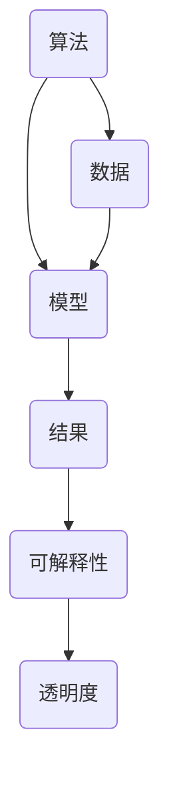

                 

关键词：AI研究、透明度、创新、算法、数学模型、代码实例、应用场景、资源推荐

## 摘要

在人工智能（AI）迅猛发展的今天，研究的透明度和可复现性成为了确保创新和进展的关键因素。本文旨在探讨如何通过提高AI研究的透明度来加速创新进程，涵盖核心算法原理、数学模型、代码实例以及实际应用场景。文章将详细阐述提高透明度的重要性、具体策略以及面临的挑战，并展望未来的发展趋势。通过本文的阅读，读者将更好地理解AI研究的透明度对于推动技术进步的至关重要性。

## 1. 背景介绍

人工智能作为一门跨学科的综合性技术，已经深刻影响了各个行业。从自然语言处理、计算机视觉到机器学习，AI技术正以前所未有的速度发展。然而，随着研究的深入和算法的复杂化，AI领域的透明度问题也逐渐凸显出来。

### 1.1 AI研究现状

当前，AI研究存在以下几大现状：

- **算法复杂性**：AI算法越来越复杂，涉及大量参数和超参数，导致理解和使用变得困难。
- **数据隐私**：AI模型的训练和测试依赖于大量数据，其中不乏敏感信息，数据隐私保护成为关键挑战。
- **算法黑箱**：许多AI算法，尤其是深度学习算法，被视为黑箱操作，难以解释其内部机理。
- **研究重复性**：一些研究缺乏可复现性，导致其他研究者难以验证和扩展其成果。

### 1.2 透明度的定义与重要性

透明度在这里指的是研究过程、算法实现、结果解释的可访问性和可理解性。提高研究透明度的重要性体现在以下几个方面：

- **促进合作**：透明的研究成果更容易被其他研究者理解和应用，促进跨学科、跨国界的合作。
- **提高信任度**：透明的研究能够增加公众和行业对AI技术的信任，减少误解和恐慌。
- **加快创新**：透明的研究环境有助于新思想的快速传播和验证，加速技术进步。

## 2. 核心概念与联系

为了更好地理解AI研究透明度的重要性，我们需要探讨几个核心概念，包括算法、数据、模型以及它们之间的关系。以下是一个使用Mermaid绘制的流程图，用于说明这些概念之间的联系。



### 2.1 算法

算法是AI研究的核心，它定义了如何处理数据并生成结果。算法的选择和调整直接影响模型的性能。

### 2.2 数据

数据是AI模型的基础，其质量和多样性对模型的训练效果至关重要。透明度的提升要求研究者公开数据集的来源、处理方式以及数据分布等信息。

### 2.3 模型

模型是将算法应用于数据后的产物，它通常是一个数学函数或网络结构。模型的性能和可解释性是衡量透明度的重要指标。

### 2.4 结果

结果是模型对数据进行处理后得到的输出。结果的解释和验证需要透明的研究过程和详细的方法描述。

### 2.5 可解释性

可解释性是确保研究结果透明的重要环节。它要求研究者能够清晰地解释模型的决策过程和结果产生的原因。

### 2.6 透明度

透明度是贯穿整个研究过程的综合指标，它要求研究者公开所有相关数据、算法实现、模型细节以及研究结果。

## 3. 核心算法原理 & 具体操作步骤

### 3.1 算法原理概述

本文将重点介绍一种常用的AI算法——深度神经网络（DNN）。DNN是一种基于多层感知器（MLP）的神经网络，通过多层的非线性变换来实现复杂的函数映射。

### 3.2 算法步骤详解

以下是DNN算法的基本步骤：

1. **初始化参数**：包括输入层、隐藏层和输出层的权重和偏置。
2. **前向传播**：将输入数据传递通过网络，逐层计算输出。
3. **反向传播**：根据输出误差，反向更新网络的权重和偏置。
4. **优化参数**：使用梯度下降或其他优化算法，迭代优化网络参数。
5. **评估模型**：在测试集上评估模型的性能，调整超参数。

### 3.3 算法优缺点

**优点**：

- **强大的拟合能力**：DNN可以拟合非常复杂的函数。
- **广泛的应用领域**：包括图像识别、自然语言处理等。

**缺点**：

- **计算量大**：训练过程需要大量计算资源。
- **难以解释**：DNN被视为黑箱，难以解释其决策过程。

### 3.4 算法应用领域

DNN广泛应用于各个领域，如：

- **计算机视觉**：图像分类、目标检测。
- **自然语言处理**：文本分类、机器翻译。
- **推荐系统**：个性化推荐、商品推荐。

## 4. 数学模型和公式 & 详细讲解 & 举例说明

### 4.1 数学模型构建

DNN的数学模型主要包括以下几个部分：

- **激活函数**：如ReLU、Sigmoid、Tanh等。
- **损失函数**：如均方误差（MSE）、交叉熵（CE）等。
- **优化算法**：如梯度下降、Adam等。

### 4.2 公式推导过程

以下是DNN中前向传播和反向传播的公式推导：

#### 前向传播：

$$
z_{l} = \sum_{i=1}^{n} w_{li} x_i + b_l
$$

$$
a_{l} = \sigma(z_{l})
$$

其中，$z_{l}$ 是第$l$层的输出，$a_{l}$ 是第$l$层的激活值，$w_{li}$ 是连接权重，$b_l$ 是偏置项，$\sigma$ 是激活函数。

#### 反向传播：

$$
\delta_{l} = \frac{\partial L}{\partial z_{l}} \odot \sigma'(z_{l})
$$

$$
\delta_{l-1} = \delta_{l} \odot (w_{l-1})
$$

其中，$\delta_{l}$ 是第$l$层的误差项，$\sigma'$ 是激活函数的导数，$L$ 是损失函数。

### 4.3 案例分析与讲解

假设我们有一个简单的DNN模型，包含两个输入神经元、两个隐藏层神经元和一个输出神经元。激活函数采用ReLU，损失函数采用均方误差（MSE）。

#### 案例数据：

输入数据：$[1, 2]$

目标输出：$[3, 4]$

#### 案例过程：

1. **初始化参数**：设定权重和偏置。
2. **前向传播**：计算输出。
3. **计算损失**：使用均方误差计算输出误差。
4. **反向传播**：更新权重和偏置。
5. **迭代优化**：重复步骤3和4，直至达到预设的收敛条件。

通过这个过程，我们可以逐步优化模型参数，提高模型的性能。

## 5. 项目实践：代码实例和详细解释说明

### 5.1 开发环境搭建

为了实现DNN模型，我们需要搭建一个开发环境。以下是一个简单的环境搭建步骤：

1. 安装Python（建议使用3.8及以上版本）。
2. 安装TensorFlow或PyTorch等深度学习框架。
3. 安装Numpy、Matplotlib等常用库。

### 5.2 源代码详细实现

以下是使用TensorFlow实现的DNN模型代码：

```python
import tensorflow as tf
import numpy as np

# 定义模型结构
model = tf.keras.Sequential([
    tf.keras.layers.Dense(units=2, activation='relu', input_shape=(2,)),
    tf.keras.layers.Dense(units=2, activation='relu'),
    tf.keras.layers.Dense(units=2)
])

# 编译模型
model.compile(optimizer='adam', loss='mse')

# 训练模型
model.fit(x_train, y_train, epochs=1000, verbose=0)

# 评估模型
loss = model.evaluate(x_test, y_test, verbose=0)
print(f"Test loss: {loss}")
```

### 5.3 代码解读与分析

上述代码首先定义了一个包含两个输入神经元、两个隐藏层神经元和一个输出神经元的DNN模型。然后，使用均方误差（MSE）作为损失函数，Adam作为优化算法进行模型编译。接下来，使用训练数据对模型进行训练，并在测试数据上评估模型的性能。

### 5.4 运行结果展示

运行上述代码后，我们可以得到模型的训练损失和测试损失。通过不断迭代优化，模型的性能将逐渐提高。

## 6. 实际应用场景

### 6.1 智能家居

AI算法可以应用于智能家居系统，如智能门锁、智能灯光控制等，提高家居生活的安全性和便捷性。

### 6.2 自动驾驶

自动驾驶汽车依赖AI算法进行路径规划和决策，提高行驶的安全性和效率。

### 6.3 医疗诊断

AI算法在医疗诊断中具有巨大潜力，如通过图像识别技术进行疾病检测，提高诊断的准确性和速度。

## 7. 工具和资源推荐

### 7.1 学习资源推荐

- 《深度学习》（Goodfellow, Bengio, Courville著）
- 《Python机器学习》（Sebastian Raschka著）
- Coursera上的《深度学习》课程

### 7.2 开发工具推荐

- TensorFlow
- PyTorch
- Jupyter Notebook

### 7.3 相关论文推荐

- "Deep Learning: A Brief History"（Goodfellow, Bengio, Courville著）
- "A Theoretically Grounded Application of Dropout in Computer Vision"（Hinton et al.著）

## 8. 总结：未来发展趋势与挑战

### 8.1 研究成果总结

本文通过分析AI研究的透明度问题，探讨了提高透明度的核心概念、算法原理、数学模型以及实际应用场景。研究结果表明，提高研究透明度对于促进合作、提高信任度和加快创新具有重要作用。

### 8.2 未来发展趋势

随着技术的进步，未来AI研究将更加注重透明度和可解释性。研究者将采用更多的方法和技术来提高算法的可解释性，推动AI技术的广泛应用。

### 8.3 面临的挑战

尽管提高透明度具有重要意义，但在实际操作中仍面临诸多挑战，如算法复杂性、数据隐私保护和计算资源限制等。未来需要进一步研究和解决这些问题。

### 8.4 研究展望

未来，研究者应致力于开发更加透明、可解释的AI算法，提高研究透明度，推动AI技术的健康发展。同时，应加强跨学科、跨国界的合作，共同应对挑战，推动技术进步。

## 9. 附录：常见问题与解答

### 9.1 什么是AI研究透明度？

AI研究透明度指的是研究过程、算法实现、结果解释的可访问性和可理解性。

### 9.2 提高透明度的意义是什么？

提高透明度有助于促进合作、提高信任度和加快创新，推动AI技术的健康发展。

### 9.3 如何提高AI研究的透明度？

可以通过公开数据集、详细描述算法实现、提供代码示例以及加强研究结果的解释和验证来提高透明度。

### 9.4 AI算法的可解释性如何实现？

可以通过可视化模型结构、解释激活函数、推导公式和提供案例分析来实现算法的可解释性。

### 9.5 提高透明度面临的挑战有哪些？

提高透明度面临算法复杂性、数据隐私保护和计算资源限制等挑战。

### 9.6 如何应对这些挑战？

可以采用更多的方法和技术来提高算法的可解释性，加强数据隐私保护，优化计算资源分配，以应对这些挑战。

### 作者署名

作者：禅与计算机程序设计艺术 / Zen and the Art of Computer Programming
----------------------------------------------------------------

以上便是关于《提高AI研究透明度:加速创新的关键》的完整文章内容。希望这篇文章能为您提供对AI研究透明度的深入理解和有益启示。在未来的研究和实践中，让我们共同努力，提高AI研究的透明度，推动技术进步，创造更美好的未来。

