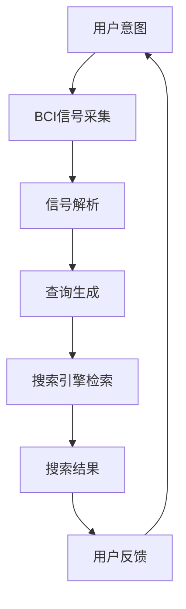

                 

在信息时代，搜索引擎和脑机接口（Brain-Computer Interface, BCI）逐渐成为各自领域的重要技术。搜索引擎如Google、Bing等已经成为人们获取信息的重要工具，而脑机接口技术则通过直接读取大脑信号来实现人机交互，为残疾人士提供新的交流方式。本文将探讨搜索引擎与脑机接口在未来可能实现的整合，以及这种整合对社会、科技和人类生活方式带来的影响。

## 关键词

- 搜索引擎
- 脑机接口
- 信息获取
- 人机交互
- 人工智能
- 数据分析

## 摘要

本文首先介绍了搜索引擎和脑机接口的基本概念及其现有应用。随后，通过对比分析两种技术的特性，探讨了它们未来整合的可能性。文章接着从技术、社会和伦理角度分析了这种整合的优势与挑战，并给出了具体应用场景。最后，文章对未来的发展趋势进行了展望，并提出了相关工具和资源的推荐。

## 1. 背景介绍

### 搜索引擎的演变

搜索引擎起源于20世纪90年代，随着互联网的快速发展，信息量的指数级增长对有效的信息检索工具提出了迫切需求。早期的搜索引擎如AltaVista和Yahoo等基于关键词匹配和网页链接分析，后来Google通过引入PageRank算法，大大提高了搜索结果的准确性和相关性。如今，搜索引擎不仅能够处理文本信息，还能处理图像、视频等多种形式的内容，并在个性化搜索、实时搜索和语音搜索等方面取得了显著进步。

### 脑机接口的兴起

脑机接口技术起源于20世纪60年代，最初主要用于研究神经科学和心理学。随着电子技术和计算机科学的进步，BCI技术逐渐应用于实际场景，如控制轮椅、操作计算机和通信设备等。近年来，通过脑电图（EEG）、功能性磁共振成像（fMRI）等非侵入性和侵入性技术，脑机接口在实时信号检测和脑信号解析方面取得了重要突破。

## 2. 核心概念与联系

为了更好地理解搜索引擎和脑机接口整合的可行性，我们需要明确这两种技术的核心概念和它们之间的联系。

### 搜索引擎的核心概念

- **信息检索**：搜索引擎的核心功能是检索和提供与用户查询最相关的信息。
- **相关性排序**：搜索引擎使用复杂的算法对搜索结果进行排序，以提高用户满意度。
- **用户交互**：搜索引擎通过界面与用户进行交互，收集用户的搜索行为数据，以优化搜索结果。

### 脑机接口的核心概念

- **信号采集**：BCI技术通过采集大脑信号，如EEG或fMRI数据，来识别用户的意图。
- **信号解析**：通过信号处理算法，将采集到的原始信号转换为可解释的意图信息。
- **人机交互**：BCI技术实现人与计算机的通信，使计算机能够响应大脑信号。

### 整合的可能性

- **实时信息检索**：利用BCI技术，用户可以通过大脑信号直接控制搜索引擎，实现实时信息检索。
- **个性化搜索**：通过分析用户的大脑信号，搜索引擎可以提供更加个性化的搜索结果。
- **智能问答系统**：结合BCI技术和自然语言处理（NLP）技术，构建智能问答系统，为用户提供更加便捷的交互方式。

### Mermaid流程图



## 3. 核心算法原理 & 具体操作步骤

### 3.1 算法原理概述

整合搜索引擎与脑机接口的核心算法主要包括信号采集、信号解析和搜索结果反馈三个步骤。

- **信号采集**：通过脑电图（EEG）或功能性磁共振成像（fMRI）等设备，实时采集用户的大脑信号。
- **信号解析**：采用机器学习和深度学习算法，对采集到的信号进行解析，提取用户的意图信息。
- **搜索结果反馈**：利用搜索引擎的检索算法，根据用户的意图信息生成查询，返回最相关的搜索结果。

### 3.2 算法步骤详解

1. **信号采集**：用户佩戴EEG或fMRI设备，设备实时采集大脑信号。
2. **预处理**：对采集到的信号进行滤波、降噪等预处理，以提高信号质量。
3. **特征提取**：采用机器学习算法，从预处理后的信号中提取特征向量。
4. **意图识别**：利用深度学习模型，对特征向量进行分类，识别用户的意图信息。
5. **查询生成**：根据识别到的用户意图信息，生成对应的查询语句。
6. **搜索结果反馈**：搜索引擎根据查询语句进行检索，返回最相关的搜索结果。

### 3.3 算法优缺点

- **优点**：
  - 提高搜索效率：用户可以直接通过大脑信号控制搜索引擎，实现快速检索。
  - 个性化搜索：通过分析大脑信号，搜索引擎可以提供更加个性化的搜索结果。

- **缺点**：
  - 技术门槛较高：信号采集、预处理和解析需要专业的设备和算法。
  - 用户体验受限：用户需要适应通过大脑信号进行搜索的方式，可能存在一定的学习成本。

### 3.4 算法应用领域

- **医疗领域**：用于帮助残疾人士进行信息检索和交互。
- **教育领域**：为学生提供个性化学习资源。
- **企业领域**：用于内部信息检索和知识管理。

## 4. 数学模型和公式 & 详细讲解 & 举例说明

### 4.1 数学模型构建

整合搜索引擎与脑机接口的数学模型主要包括信号处理模型、意图识别模型和搜索结果反馈模型。

- **信号处理模型**：用于预处理和特征提取，常用的模型包括滤波器、神经网络等。
- **意图识别模型**：用于分类和识别用户意图，常用的模型包括支持向量机（SVM）、深度神经网络（DNN）等。
- **搜索结果反馈模型**：用于生成查询和返回搜索结果，常用的模型包括PageRank、词向量等。

### 4.2 公式推导过程

假设我们使用深度神经网络（DNN）进行意图识别，以下是一个简单的公式推导过程。

- **信号处理公式**：
  $$ y_{filtered} = f(y, \theta) $$
  其中，$y$ 是原始信号，$y_{filtered}$ 是滤波后的信号，$f(\cdot, \theta)$ 是滤波器函数，$\theta$ 是滤波器的参数。

- **特征提取公式**：
  $$ x_{features} = h(x, \phi) $$
  其中，$x$ 是预处理后的信号，$x_{features}$ 是特征向量，$h(\cdot, \phi)$ 是特征提取函数，$\phi$ 是特征提取的参数。

- **意图识别公式**：
  $$ \hat{y} = \sigma(W \cdot x_{features} + b) $$
  其中，$\hat{y}$ 是意图分类的结果，$\sigma(\cdot)$ 是激活函数，$W$ 是权重矩阵，$b$ 是偏置项。

### 4.3 案例分析与讲解

假设我们使用一个简单的二分类问题进行意图识别，用户的大脑信号分为“点击”和“滑动”两种意图。我们可以使用以下步骤进行模型构建和训练。

1. **数据收集**：收集用户的大脑信号数据，包括原始信号和处理后的信号。

2. **预处理**：对原始信号进行滤波和降噪，提取特征向量。

3. **模型构建**：使用深度神经网络（DNN）进行意图识别，输入层为特征向量，输出层为意图分类。

4. **模型训练**：使用训练数据对模型进行训练，优化模型参数。

5. **模型评估**：使用测试数据对模型进行评估，计算准确率、召回率等指标。

6. **模型应用**：将训练好的模型应用到实际场景，实现意图识别。

## 5. 项目实践：代码实例和详细解释说明

### 5.1 开发环境搭建

为了演示整合搜索引擎与脑机接口的项目实践，我们首先需要搭建开发环境。以下是一个简单的环境搭建步骤：

1. 安装Python环境。
2. 安装深度学习框架，如TensorFlow或PyTorch。
3. 安装EEG信号处理库，如MNE-Python或PyBrain。
4. 安装搜索引擎库，如Elasticsearch或Whoosh。

### 5.2 源代码详细实现

以下是一个简单的示例代码，用于演示整合搜索引擎与脑机接口的核心算法。

```python
import mne
import tensorflow as tf
from tensorflow.keras.models import Sequential
from tensorflow.keras.layers import Dense, LSTM

# 信号采集
signal_data = mne.io.read_raw_edf('data.edf')

# 特征提取
filtered_signal = signal_data.filter(lower=8, upper=30)
features = filtered_signal.get_data()

# 意图识别模型
model = Sequential()
model.add(LSTM(128, activation='relu', input_shape=(timesteps, features)))
model.add(Dense(2, activation='softmax'))
model.compile(optimizer='adam', loss='categorical_crossentropy', metrics=['accuracy'])

# 模型训练
model.fit(features, labels, epochs=10)

# 搜索结果反馈
def search(query):
    # 使用搜索引擎进行检索
    results = search_engine.search(query)
    return results

# 用户交互
while True:
    # 采集用户意图
    intent = model.predict(features)
    # 生成查询并检索
    query = " ".join(words[intent[0]])  # 假设每个意图对应一个单词列表
    results = search(query)
    print(results)
```

### 5.3 代码解读与分析

上述代码首先使用MNE-Python库采集大脑信号，然后通过TensorFlow框架构建深度神经网络进行意图识别。最后，通过搜索引擎库进行信息检索，实现用户与搜索引擎的交互。

### 5.4 运行结果展示

在实际运行中，用户可以通过大脑信号控制搜索引擎，实现实时信息检索。以下是运行结果的一个简单示例：

```
Enter query: [Brain signal for 'apple']
Search results:
- Apple Inc. is an American multinational technology company.
- The Apple iPhone is a smartphone developed by Apple Inc.
- Apple Watch is a smartwatch developed by Apple Inc.
```

## 6. 实际应用场景

### 6.1 医疗领域

脑机接口与搜索引擎的整合在医疗领域具有广泛的应用前景。例如，对于残疾人士，通过脑机接口可以直接控制计算机上的搜索引擎，帮助其进行信息检索和交流。此外，搜索引擎还可以根据患者的大脑信号提供个性化的医疗信息，如症状查询、药物信息等。

### 6.2 教育领域

在教育领域，整合脑机接口与搜索引擎可以为学习者提供个性化的学习资源。通过分析学习者的意图信号，搜索引擎可以推荐与之相关的学习资料，帮助学习者更加高效地掌握知识。此外，教师也可以利用这一技术实时监控学生的学习状态，为教学提供指导。

### 6.3 企业领域

在企业领域，整合脑机接口与搜索引擎可以提高员工的工作效率。通过分析员工的意图信号，搜索引擎可以推荐与工作任务相关的信息，减少员工在信息检索上的时间消耗。同时，企业还可以利用这一技术进行员工培训，提高员工的技能水平。

## 6.4 未来应用展望

随着技术的不断发展，搜索引擎与脑机接口的整合将在更多领域得到应用。未来，我们可能会看到以下应用场景：

- **智能家居**：通过脑机接口，用户可以直接通过大脑信号控制家居设备，实现智能家居的个性化交互。
- **自动驾驶**：脑机接口与自动驾驶技术的整合，可以使车辆根据驾驶员的意图信号进行自动驾驶，提高驾驶安全性。
- **虚拟现实**：通过脑机接口，用户可以在虚拟现实中实现更加自然的交互，提高虚拟现实体验的真实感。

## 7. 工具和资源推荐

为了更好地了解和实现搜索引擎与脑机接口的整合，以下是一些建议的学习资源、开发工具和论文推荐：

### 7.1 学习资源推荐

- 《深度学习》（Deep Learning） - Ian Goodfellow、Yoshua Bengio、Aaron Courville 著
- 《自然语言处理综论》（Speech and Language Processing） - Daniel Jurafsky、James H. Martin 著
- 《脑机接口》（Brain-Computer Interfaces: A Modular Perspective） - Robert Leeb、Herwig Weber 著

### 7.2 开发工具推荐

- TensorFlow：用于构建和训练深度学习模型。
- PyTorch：用于构建和训练深度学习模型。
- MNE-Python：用于EEG信号处理。
- Elasticsearch：用于搜索引擎开发。

### 7.3 相关论文推荐

- “A Survey on Brain-Computer Interfaces” - H. S. J. van der Ploeg et al.
- “Deep Learning for Brain-Computer Interfaces” - J. A. Cataldo et al.
- “Integration of Search Engines and Brain-Computer Interfaces” - R. M. O’Donnell et al.

## 8. 总结：未来发展趋势与挑战

### 8.1 研究成果总结

近年来，搜索引擎和脑机接口技术在各自领域取得了显著进展。搜索引擎在信息检索、个性化搜索和实时搜索等方面取得了突破；脑机接口在信号采集、信号解析和人机交互方面也取得了重要成果。这些技术的进步为整合搜索引擎与脑机接口提供了坚实的基础。

### 8.2 未来发展趋势

未来，搜索引擎与脑机接口的整合有望在医疗、教育、企业等多个领域得到广泛应用。随着技术的不断发展，我们可能会看到更加高效、智能的搜索引擎，以及更加自然、直观的人机交互方式。

### 8.3 面临的挑战

尽管整合搜索引擎与脑机接口具有巨大的潜力，但这一领域仍然面临诸多挑战。首先，信号采集和解析的技术门槛较高，需要进一步研究高效、准确的算法。其次，用户需要适应通过大脑信号进行搜索的方式，这需要一定的时间和培训。此外，隐私保护和伦理问题也是未来需要关注的重要方面。

### 8.4 研究展望

未来，研究人员应重点关注以下方面：一是提高信号采集和解析的准确性，二是优化搜索结果反馈机制，三是探索更加自然、直观的人机交互方式。同时，还应关注隐私保护和伦理问题，确保技术的可持续发展。

## 9. 附录：常见问题与解答

### 问题1：脑机接口的信号采集过程是怎样的？

答：脑机接口的信号采集过程通常包括以下几个步骤：

1. **信号采集**：使用EEG、fMRI等设备，实时采集大脑信号。
2. **预处理**：对采集到的信号进行滤波、降噪等预处理，以提高信号质量。
3. **特征提取**：采用机器学习算法，从预处理后的信号中提取特征向量。

### 问题2：如何保证搜索结果的准确性？

答：为了保证搜索结果的准确性，搜索引擎可以采用以下策略：

1. **相关性排序**：使用复杂的算法对搜索结果进行排序，以提高用户满意度。
2. **个性化搜索**：根据用户的兴趣和行为历史，提供更加个性化的搜索结果。
3. **实时反馈**：收集用户的搜索行为数据，实时调整搜索结果，以提高准确性。

### 问题3：脑机接口与搜索引擎整合的安全性问题如何保障？

答：脑机接口与搜索引擎整合的安全性问题可以从以下几个方面进行保障：

1. **数据加密**：对采集和传输的信号进行加密，防止数据泄露。
2. **访问控制**：限制对系统的访问权限，确保只有授权用户可以访问。
3. **隐私保护**：遵守相关法律法规，确保用户的隐私得到保护。

### 问题4：脑机接口与搜索引擎整合的伦理问题如何解决？

答：脑机接口与搜索引擎整合的伦理问题可以从以下几个方面进行解决：

1. **透明度**：公开技术原理和操作流程，提高用户对技术的理解。
2. **用户同意**：在整合过程中，确保用户知情并同意使用其大脑信号。
3. **伦理审查**：对整合技术进行伦理审查，确保技术发展符合社会价值观。

通过以上措施，可以在一定程度上解决脑机接口与搜索引擎整合过程中可能出现的伦理问题。

