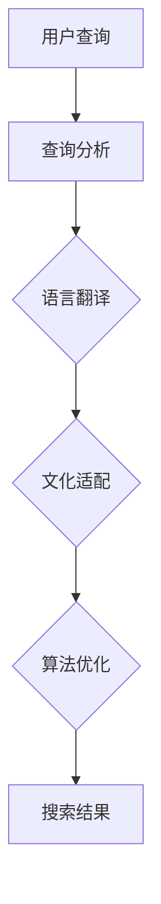

                 

关键词：搜索引擎、本地化、文化、语言、算法、数学模型、实践、应用场景、未来展望

> 摘要：随着全球化的深入发展，搜索引擎的本地化成为了一个日益重要的课题。本文将探讨搜索引擎如何通过适应不同文化和语言，提高搜索体验和满足用户需求。从核心概念、算法原理、数学模型到实际应用，我们将深入分析这一领域的最新研究成果和未来发展趋势。

## 1. 背景介绍

在互联网时代，搜索引擎已经成为人们获取信息的主要途径。然而，不同国家和地区的用户在使用搜索引擎时，往往面临语言和文化差异带来的挑战。例如，英文搜索引擎对于非英语母语的用户可能不够友好，而中文搜索引擎在国际市场上的影响力也有限。因此，搜索引擎的本地化成为提升用户体验和扩大市场的重要手段。

搜索引擎本地化涉及多个方面，包括语言翻译、文化适配、算法优化等。语言翻译是基础，但仅靠翻译无法完全解决文化差异带来的问题。例如，同一词汇在不同文化背景下的含义可能截然不同，这需要搜索引擎在算法层面进行深度处理。此外，本地化还包括对用户行为、搜索习惯、内容推荐等方面的优化。

本文旨在探讨搜索引擎本地化的核心问题，包括：

1. 核心概念与联系
2. 核心算法原理与具体操作步骤
3. 数学模型和公式
4. 项目实践：代码实例和详细解释说明
5. 实际应用场景
6. 未来应用展望

通过这些方面的深入分析，本文希望能够为搜索引擎的本地化提供一些有益的思路和参考。

## 2. 核心概念与联系

### 2.1. 语言翻译

语言翻译是搜索引擎本地化的基础。它通过将用户输入的查询语句翻译为目标语言，从而实现跨语言搜索。目前，常用的翻译方法包括基于规则的方法、统计机器翻译（SMT）和基于神经网络的机器翻译（NMT）。

- **基于规则的方法**：这种方法依赖于预定义的翻译规则，通过对源语言和目标语言之间的对应关系进行编码来实现翻译。尽管这种方法在早期取得了较好的效果，但其在处理复杂句式和未知词汇时存在明显局限。

- **统计机器翻译**：统计机器翻译通过大量双语语料库训练模型，将源语言转换为目标语言。这种方法基于概率模型，能够较好地处理复杂句式和未知词汇，但在处理低频词和特定领域术语时可能表现不佳。

- **基于神经网络的机器翻译**：近年来，随着深度学习技术的快速发展，基于神经网络的机器翻译（NMT）逐渐成为主流。NMT通过端到端的神经网络模型实现翻译，能够在处理复杂句式和特定领域术语方面表现出色。目前，如Google翻译、百度翻译等主流翻译工具均采用了NMT技术。

### 2.2. 文化适配

文化适配是搜索引擎本地化的关键。它涉及将搜索结果和文化背景相匹配，确保用户在本地环境中获得最相关的信息。文化适配包括以下几个方面：

- **命名实体识别**：命名实体识别（NER）是一种用于识别文本中特定类型的实体的技术。在搜索引擎本地化中，NER可以用于识别地名、人名、组织名等，确保搜索结果与用户的本地文化背景相匹配。

- **地理信息处理**：地理信息处理（GIS）技术可以用于处理地理相关的搜索请求。例如，当用户在搜索时输入一个地名，搜索引擎可以通过GIS技术为用户提供该地名的地理位置信息，从而更好地满足用户的需求。

- **文化敏感内容过滤**：搜索引擎需要过滤掉可能引起文化冲突或敏感的内容。例如，某些词汇或表达方式在某些文化背景下可能被视为不适当或敏感，搜索引擎需要对这些内容进行识别和过滤，以确保搜索结果符合用户的价值观和文化背景。

### 2.3. 算法优化

算法优化是搜索引擎本地化的核心。通过优化算法，搜索引擎可以提高搜索结果的准确性和相关性，从而提升用户体验。算法优化包括以下几个方面：

- **个性化搜索**：个性化搜索通过分析用户的历史搜索行为、浏览记录等数据，为用户提供个性化的搜索结果。个性化搜索可以更好地满足用户的需求，提高用户满意度。

- **相关性排序**：相关性排序是搜索引擎的核心技术之一。通过优化排序算法，搜索引擎可以提高搜索结果的排序质量，确保用户能够快速找到最相关的信息。

- **推荐系统**：推荐系统通过分析用户的兴趣和行为，为用户提供相关的搜索建议和推荐结果。推荐系统可以增加用户的使用时长，提高用户粘性。

### 2.4. 语言与文化关系的Mermaid流程图

以下是一个简化的Mermaid流程图，展示语言和文化在搜索引擎本地化中的作用。

在这个流程图中，用户查询首先经过查询分析，然后进行语言翻译和文化适配，最终通过算法优化生成搜索结果。这一过程不仅涉及技术层面的翻译和适配，还包括用户需求的理解和满足。

## 3. 核心算法原理与具体操作步骤

### 3.1. 算法原理概述

搜索引擎本地化的核心算法主要包括语言翻译、文化适配和算法优化。这些算法通过不同的技术手段，共同实现搜索引擎的本地化。以下将分别介绍这些算法的基本原理。

#### 3.1.1. 语言翻译

语言翻译算法的核心任务是理解用户的查询意图，并将其翻译成目标语言。这涉及到以下几个方面：

- **分词与词性标注**：分词是将文本切分成一个个独立的词语，词性标注则是为每个词语赋予相应的词性（如名词、动词等）。
- **词义消歧**：由于同一词汇在不同语境下可能有不同的含义，词义消歧技术用于确定词汇的正确含义。
- **语法分析**：语法分析用于理解文本的语法结构，确保翻译结果符合目标语言的语法规则。
- **翻译模型**：基于统计或神经网络的翻译模型用于生成目标语言的翻译结果。

#### 3.1.2. 文化适配

文化适配算法的核心任务是确保搜索结果与用户的本地文化背景相匹配。这包括以下几个方面：

- **命名实体识别**：命名实体识别技术用于识别文本中的特定实体（如人名、地名等），确保其在搜索结果中的正确呈现。
- **地理信息处理**：地理信息处理技术用于处理地理相关的搜索请求，为用户提供地理位置信息。
- **文化敏感内容过滤**：文化敏感内容过滤技术用于识别和过滤可能引起文化冲突或敏感的内容。

#### 3.1.3. 算法优化

算法优化算法的核心任务是提高搜索结果的准确性和相关性。这包括以下几个方面：

- **个性化搜索**：个性化搜索算法通过分析用户的历史搜索行为、浏览记录等数据，为用户提供个性化的搜索结果。
- **相关性排序**：相关性排序算法用于优化搜索结果的排序，确保用户能够快速找到最相关的信息。
- **推荐系统**：推荐系统通过分析用户的兴趣和行为，为用户提供相关的搜索建议和推荐结果。

### 3.2. 算法步骤详解

#### 3.2.1. 语言翻译算法

语言翻译算法的具体步骤如下：

1. **分词与词性标注**：输入查询语句，使用分词算法将其切分成词语，并对每个词语进行词性标注。
2. **词义消歧**：使用词义消歧技术，根据上下文确定每个词语的正确含义。
3. **语法分析**：使用语法分析技术，理解查询语句的语法结构。
4. **翻译模型**：使用翻译模型，将查询语句翻译成目标语言。
5. **后处理**：对翻译结果进行后处理，如去除冗余信息、调整句子结构等，以确保翻译结果的自然性和准确性。

#### 3.2.2. 文化适配算法

文化适配算法的具体步骤如下：

1. **命名实体识别**：使用命名实体识别技术，识别文本中的特定实体。
2. **地理信息处理**：使用地理信息处理技术，为用户提供地理位置信息。
3. **文化敏感内容过滤**：使用文化敏感内容过滤技术，识别和过滤可能引起文化冲突或敏感的内容。
4. **结果调整**：根据本地文化背景，对搜索结果进行调整，确保其与用户的文化背景相匹配。

#### 3.2.3. 算法优化算法

算法优化算法的具体步骤如下：

1. **用户数据分析**：收集并分析用户的历史搜索行为、浏览记录等数据。
2. **个性化搜索**：基于用户数据分析，为用户提供个性化的搜索结果。
3. **相关性排序**：使用相关性排序算法，优化搜索结果的排序，确保用户能够快速找到最相关的信息。
4. **推荐系统**：基于用户兴趣和行为，为用户提供相关的搜索建议和推荐结果。

### 3.3. 算法优缺点

#### 3.3.1. 语言翻译算法

**优点**：

- **跨语言搜索**：能够实现跨语言搜索，为非本地语言用户提供便捷的搜索服务。
- **快速响应**：基于模型和算法的快速响应，提高了搜索效率。

**缺点**：

- **准确性有限**：尽管翻译算法不断进步，但仍然难以完全理解上下文和语境，导致翻译准确性有限。
- **特定领域挑战**：在处理特定领域术语和表达时，翻译算法可能面临较大挑战。

#### 3.3.2. 文化适配算法

**优点**：

- **文化敏感性**：能够根据用户的文化背景，提供更符合本地文化的搜索结果。
- **用户体验**：提高用户在本地环境中的搜索体验。

**缺点**：

- **数据依赖**：文化适配算法依赖于大量的本地数据，缺乏数据的地区可能难以实现有效的文化适配。
- **复杂性增加**：文化适配增加了算法的复杂性，可能导致性能下降。

#### 3.3.3. 算法优化算法

**优点**：

- **个性化搜索**：为用户提供个性化的搜索结果，提高用户满意度。
- **相关性提升**：优化搜索结果的排序，提高搜索结果的准确性。

**缺点**：

- **数据隐私**：个性化搜索和数据分析可能涉及用户隐私，需要妥善处理。
- **算法偏见**：算法优化过程中可能引入偏见，影响搜索结果的公正性。

### 3.4. 算法应用领域

**电子商务**：在电子商务领域，搜索引擎本地化可以帮助跨语言和跨文化用户进行商品搜索和购买。

**旅游行业**：在旅游行业，搜索引擎本地化可以为用户提供本地化的旅游信息，提高旅游体验。

**新闻媒体**：在新闻媒体领域，搜索引擎本地化可以帮助用户获取与本地文化相关的新闻资讯。

**社交媒体**：在社交媒体领域，搜索引擎本地化可以帮助用户发现和关注与本地文化相关的社交内容。

## 4. 数学模型和公式

### 4.1. 数学模型构建

搜索引擎本地化的数学模型主要涉及概率模型、神经网络模型和推荐系统模型。以下分别介绍这些模型的基本构建方法。

#### 4.1.1. 概率模型

概率模型是搜索引擎本地化中常用的基础模型之一。它通过概率分布来描述查询和搜索结果之间的关系。以下是一个简化的概率模型构建过程：

1. **查询概率分布**：根据用户的历史搜索行为，计算每个查询词在所有查询中的概率分布。
2. **搜索结果概率分布**：根据用户的历史点击行为，计算每个搜索结果在所有结果中的概率分布。
3. **查询-结果概率分布**：计算每个查询词和每个搜索结果之间的联合概率分布。

#### 4.1.2. 神经网络模型

神经网络模型在搜索引擎本地化中具有广泛的应用。以下是一个简化的神经网络模型构建过程：

1. **输入层**：输入层包括查询词和搜索结果的特征向量。
2. **隐藏层**：隐藏层通过激活函数对输入特征进行非线性变换，形成新的特征表示。
3. **输出层**：输出层输出查询词和搜索结果之间的相似度分数或概率分布。

#### 4.1.3. 推荐系统模型

推荐系统模型用于为用户提供个性化的搜索结果。以下是一个简化的推荐系统模型构建过程：

1. **用户特征提取**：提取用户的历史搜索行为、浏览记录等特征。
2. **项目特征提取**：提取搜索结果的特征，如内容、标题、标签等。
3. **用户-项目相似度计算**：计算用户和项目之间的相似度分数，如基于协同过滤或内容推荐的相似度计算。

### 4.2. 公式推导过程

以下分别介绍概率模型、神经网络模型和推荐系统模型的基本公式推导过程。

#### 4.2.1. 概率模型公式推导

1. **查询概率分布**：
   $$ P(Q) = \frac{f(Q)}{Z} $$
   其中，$f(Q)$ 是查询词 $Q$ 在所有查询中的频率，$Z$ 是规范化常数，用于确保概率分布的归一性。

2. **搜索结果概率分布**：
   $$ P(R) = \frac{g(R)}{Z'} $$
   其中，$g(R)$ 是搜索结果 $R$ 在所有结果中的频率，$Z'$ 是规范化常数。

3. **查询-结果概率分布**：
   $$ P(Q, R) = \frac{f(Q) \cdot g(R)}{Z''} $$
   其中，$Z''$ 是规范化常数。

#### 4.2.2. 神经网络模型公式推导

1. **输入层到隐藏层**：
   $$ H = \sigma(W \cdot X + b) $$
   其中，$H$ 是隐藏层的激活值，$W$ 是输入层到隐藏层的权重矩阵，$X$ 是输入特征向量，$\sigma$ 是激活函数（如ReLU、Sigmoid等），$b$ 是偏置项。

2. **隐藏层到输出层**：
   $$ O = \sigma(W' \cdot H + b') $$
   其中，$O$ 是输出层的激活值，$W'$ 是隐藏层到输出层的权重矩阵，$H$ 是隐藏层的激活值，$b'$ 是偏置项。

3. **输出层概率分布**：
   $$ P(O) = \frac{1}{Z'''} \cdot \exp(O) $$
   其中，$Z'''$ 是规范化常数。

#### 4.2.3. 推荐系统模型公式推导

1. **用户特征提取**：
   $$ X_u = [x_{u1}, x_{u2}, ..., x_{un}] $$
   其中，$X_u$ 是用户特征向量，$x_{ui}$ 是用户在第 $i$ 个特征上的值。

2. **项目特征提取**：
   $$ X_r = [x_{r1}, x_{r2}, ..., x_{rn}] $$
   其中，$X_r$ 是项目特征向量，$x_{ri}$ 是项目在第 $i$ 个特征上的值。

3. **用户-项目相似度计算**：
   $$ \sim

