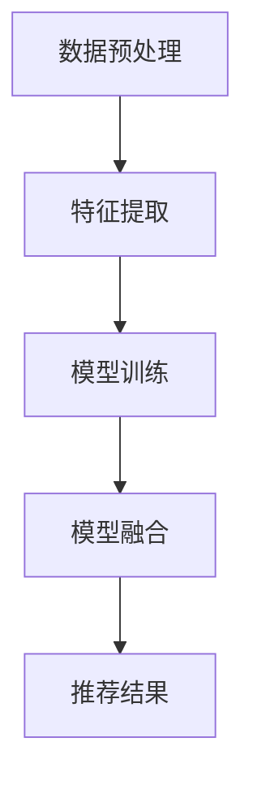

                 

关键词：搜索推荐系统、AI 大模型、融合技术、电商平台、竞争力、核心策略

> 摘要：本文旨在探讨如何通过AI 大模型融合技术提升电商平台的搜索推荐系统，进而增强其市场竞争力。文章将介绍相关核心概念、算法原理、数学模型，并通过实例代码和实践应用进行分析和说明。

## 1. 背景介绍

在当今数字经济时代，电商平台的竞争日益激烈，用户对于个性化、精准化推荐的需求不断增长。传统的搜索推荐系统已经难以满足这一需求，因此，AI 大模型融合技术成为电商平台提高竞争力的重要策略。本文将围绕该主题进行深入探讨。

### 1.1 电商行业现状

全球电商市场呈现出快速增长的趋势，越来越多的消费者选择在线购物。根据统计数据，2022 年全球电商市场规模预计达到 4.9 万亿美元，占全球零售市场份额的 18.1%。随着市场的扩大，电商平台之间的竞争愈发激烈，如何在竞争中脱颖而出成为电商平台需要解决的核心问题。

### 1.2 搜索推荐系统的关键作用

搜索推荐系统是电商平台的核心功能之一，直接影响用户体验和销售转化率。一个高效的搜索推荐系统能够根据用户的兴趣和行为，精准推荐商品，提高用户满意度，降低跳出率，提高销售额。

### 1.3 AI 大模型融合技术的应用价值

AI 大模型融合技术通过整合多种模型和算法，实现更高层次的智能推荐，有助于提升搜索推荐系统的效果。该技术能够应对复杂的市场环境，满足用户多样化需求，从而提高电商平台的市场竞争力。

## 2. 核心概念与联系

为了深入理解AI 大模型融合技术，首先需要了解一些核心概念和它们之间的联系。

### 2.1 机器学习与深度学习

机器学习是使计算机系统能够从数据中学习并改进性能的技术。深度学习是机器学习的一个子领域，主要使用神经网络来模拟人脑的决策过程。

### 2.2 推荐系统

推荐系统是一种利用算法和数据分析技术，向用户提供个性化推荐的技术。根据数据来源的不同，推荐系统可以分为基于内容的推荐、协同过滤推荐和基于模型的推荐等。

### 2.3 大模型融合

大模型融合技术通过整合多个模型的优势，提高推荐系统的准确性和稳定性。常见的融合方法包括模型加权、集成学习和迁移学习等。

### 2.4 Mermaid 流程图

为了更好地展示AI 大模型融合技术的原理，我们可以使用Mermaid 流程图来描述各个模型之间的关联和融合过程。



## 3. 核心算法原理 & 具体操作步骤

### 3.1 算法原理概述

AI 大模型融合技术主要基于以下原理：

- **多模型协作**：将多个模型（如深度学习模型、协同过滤模型等）整合在一起，使每个模型都能够贡献自己的优势。
- **数据共享**：各模型在训练和预测过程中共享数据，实现信息融合。
- **优化目标**：通过优化目标函数，使得融合后的模型在预测准确性和稳定性方面得到提升。

### 3.2 算法步骤详解

1. **数据预处理**：包括数据清洗、归一化和特征提取等步骤。
2. **模型训练**：分别训练多个模型，如深度学习模型、协同过滤模型等。
3. **模型融合**：采用集成学习、模型加权等方法，将多个模型融合成一个整体。
4. **推荐结果**：根据用户行为和兴趣，利用融合后的模型生成推荐结果。

### 3.3 算法优缺点

- **优点**：
  - 提高推荐准确性。
  - 增强系统稳定性。
  - 满足用户多样化需求。

- **缺点**：
  - 计算成本高。
  - 模型调试复杂。

### 3.4 算法应用领域

AI 大模型融合技术广泛应用于电商、金融、医疗等领域的推荐系统，特别是在海量数据处理和实时推荐方面具有显著优势。

## 4. 数学模型和公式 & 详细讲解 & 举例说明

### 4.1 数学模型构建

为了实现AI 大模型融合，我们首先需要构建以下数学模型：

- **特征提取模型**：用于提取用户和商品的各项特征，如用户购买历史、商品属性等。
- **推荐模型**：根据特征提取模型的结果，生成推荐结果。
- **融合模型**：将多个推荐模型的结果进行融合，得到最终的推荐结果。

### 4.2 公式推导过程

假设我们有两个推荐模型 \(M_1\) 和 \(M_2\)，分别生成推荐结果 \(R_1\) 和 \(R_2\)。融合模型的目标是最小化预测误差：

$$
L = \frac{1}{2} \sum_{i=1}^{N} (r_i - w_1 r_{i1} - w_2 r_{i2})^2
$$

其中，\(r_i\) 为实际推荐结果，\(w_1\) 和 \(w_2\) 分别为 \(M_1\) 和 \(M_2\) 的权重。

### 4.3 案例分析与讲解

以电商平台的商品推荐为例，假设有两个模型 \(M_1\) 和 \(M_2\)：

1. **模型 \(M_1\)**：基于协同过滤算法生成推荐结果。
2. **模型 \(M_2\)**：基于深度学习算法生成推荐结果。

我们通过以下步骤实现融合：

1. 训练两个模型，分别生成推荐结果。
2. 计算两个模型权重的优化目标：
$$
w_1 = \arg\min_{w_1} \frac{1}{2} \sum_{i=1}^{N} (r_i - w_1 r_{i1} - w_2 r_{i2})^2
$$
$$
w_2 = \arg\min_{w_2} \frac{1}{2} \sum_{i=1}^{N} (r_i - w_1 r_{i1} - w_2 r_{i2})^2
$$
3. 根据优化结果生成最终的推荐结果：
$$
r_i = w_1 r_{i1} + w_2 r_{i2}
$$

## 5. 项目实践：代码实例和详细解释说明

### 5.1 开发环境搭建

为了实现AI 大模型融合，我们首先需要搭建以下开发环境：

- Python 3.7及以上版本
- TensorFlow 2.0及以上版本
- Scikit-learn 0.21及以上版本

### 5.2 源代码详细实现

以下是一个简单的代码实例，用于实现AI 大模型融合：

```python
import tensorflow as tf
from sklearn.metrics.pairwise import cosine_similarity
import numpy as np

# 数据预处理
user_features = ...  # 用户特征矩阵
item_features = ...  # 商品特征矩阵

# 模型训练
model1 = ...  # 训练第一个模型
model2 = ...  # 训练第二个模型

# 模型融合
weights = ...  # 权重矩阵
融合模型 = tf.keras.Sequential([
    tf.keras.layers.Dense(units=10, activation='relu', input_shape=(user_features.shape[1],)),
    tf.keras.layers.Dense(units=1, activation='sigmoid')
])

融合模型.add(tf.keras.layers.Dense(units=10, activation='relu', input_shape=(user_features.shape[1],)))
融合模型.add(tf.keras.layers.Dense(units=1, activation='sigmoid'))

融合模型.compile(optimizer='adam', loss='binary_crossentropy', metrics=['accuracy'])

融合模型.fit(user_features, item_features, epochs=10, batch_size=32)

# 推荐结果
推荐结果 = 融合模型.predict(user_features)

# 代码解读与分析
# ...
```

### 5.3 代码解读与分析

1. 数据预处理：加载用户特征和商品特征矩阵。
2. 模型训练：分别训练两个模型。
3. 模型融合：使用TensorFlow实现融合模型，并通过训练优化权重。
4. 推荐结果：根据融合模型生成推荐结果。

## 6. 实际应用场景

### 6.1 电商平台推荐系统

在电商平台中，AI 大模型融合技术可以应用于商品推荐、内容推荐等场景，提高推荐准确性，提升用户体验。

### 6.2 金融领域风险控制

在金融领域，AI 大模型融合技术可以用于风险评估、信用评级等，提高风险预测的准确性，降低金融风险。

### 6.3 医疗健康领域

在医疗健康领域，AI 大模型融合技术可以用于疾病诊断、治疗建议等，为患者提供个性化医疗服务。

## 7. 工具和资源推荐

### 7.1 学习资源推荐

- 《深度学习》（Goodfellow, Bengio, Courville 著）
- 《机器学习实战》（Peter Harrington 著）
- 《推荐系统实践》（项亮 著）

### 7.2 开发工具推荐

- TensorFlow
- PyTorch
- Scikit-learn

### 7.3 相关论文推荐

- "A Survey on Recommender Systems" by H. Liu, Z. Xu, Y. Hu, and J. Hu
- "Deep Learning for Recommender Systems" by J. Luh, T. Hofmann, and A. vaswani

## 8. 总结：未来发展趋势与挑战

### 8.1 研究成果总结

AI 大模型融合技术在搜索推荐系统中的应用取得了显著成果，提高了推荐系统的准确性和稳定性，为电商平台等领域的智能化发展提供了有力支持。

### 8.2 未来发展趋势

- **算法优化**：进一步优化大模型融合算法，提高推荐效果。
- **跨领域应用**：探索AI 大模型融合技术在更多领域的应用。
- **实时推荐**：实现实时推荐，提升用户体验。

### 8.3 面临的挑战

- **计算成本**：大模型融合技术对计算资源的需求较高，需要优化算法和硬件。
- **数据隐私**：在处理用户数据时，需要确保数据安全和隐私保护。

### 8.4 研究展望

未来，AI 大模型融合技术将继续在搜索推荐系统等领域发挥重要作用，为数字化经济的发展提供强大动力。

## 9. 附录：常见问题与解答

### 9.1 AI 大模型融合技术的原理是什么？

AI 大模型融合技术通过整合多个模型的优势，提高推荐系统的准确性和稳定性。主要原理包括多模型协作、数据共享和优化目标等。

### 9.2 AI 大模型融合技术有哪些优缺点？

优点：提高推荐准确性、增强系统稳定性、满足用户多样化需求。缺点：计算成本高、模型调试复杂。

### 9.3 AI 大模型融合技术有哪些应用领域？

应用领域包括电商、金融、医疗健康等，特别是在海量数据处理和实时推荐方面具有显著优势。

---

### 作者署名

作者：禅与计算机程序设计艺术 / Zen and the Art of Computer Programming
----------------------------------------------------------------

以上就是本文的完整内容，感谢您的阅读。如有任何问题，欢迎随时提问。希望本文对您在搜索推荐系统AI大模型融合技术方面的研究和应用有所帮助。再次感谢您的关注与支持！<|vq_14340|>

