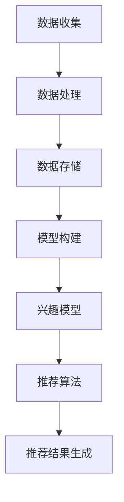

                 

 搜索推荐系统作为现代信息检索与个性化服务的关键组件，正日益成为互联网生态中的核心力量。实时个性化技术在其中扮演着至关重要的角色，它使得推荐系统能够动态适应用户需求，提升用户体验和系统效益。本文将深入探讨搜索推荐系统的实时个性化技术，包括其背景、核心概念、算法原理、数学模型、项目实践以及未来展望。

## 关键词

- 搜索推荐系统
- 实时个性化技术
- 用户行为分析
- 数据挖掘
- 机器学习
- 贝叶斯模型
- 基于内容的推荐
- 协同过滤

## 摘要

本文首先介绍了搜索推荐系统的背景和发展现状，然后详细探讨了实时个性化技术的核心概念与联系。接着，文章从算法原理、数学模型和项目实践三个方面深入分析了实时个性化技术的实现方法。随后，文章展示了该技术在实际应用场景中的效果和未来应用展望。最后，文章总结了实时个性化技术的研究成果，探讨了未来发展趋势与挑战。

## 1. 背景介绍

### 搜索推荐系统的定义

搜索推荐系统是一种信息过滤技术，旨在根据用户的历史行为、兴趣和上下文信息，自动地为用户推荐可能感兴趣的内容。它广泛应用于电子商务、社交媒体、新闻媒体和在线教育等领域。传统的搜索推荐系统主要依赖于用户历史行为数据和内容特征进行推荐，但这种方法在处理实时性、多样性和个性化需求方面存在一定的局限性。

### 实时个性化技术的必要性

随着互联网的发展，用户获取信息的速度和渠道日益增多，个性化推荐的重要性愈发突出。实时个性化技术能够根据用户当前的行为和需求，动态调整推荐结果，提高推荐的相关性和用户体验。以下是实时个性化技术的几个必要性：

- **提升用户体验**：通过实时调整推荐内容，满足用户的即时需求，提高用户满意度和粘性。
- **增加商业价值**：实时个性化技术有助于提高用户的参与度和转化率，从而提升平台的商业价值。
- **应对动态变化**：互联网环境下的信息动态变化迅速，实时个性化技术能够更好地应对这种变化，提高系统的应变能力。

## 2. 核心概念与联系

### 实时个性化技术的核心概念

实时个性化技术涉及多个核心概念，包括用户行为分析、兴趣模型、推荐算法和反馈循环。

- **用户行为分析**：通过对用户在平台上的浏览、搜索、购买等行为数据进行收集和分析，挖掘出用户的兴趣点和需求。
- **兴趣模型**：基于用户行为分析结果，构建用户的兴趣模型，用于动态调整推荐内容。
- **推荐算法**：利用用户兴趣模型和其他辅助信息，实时生成推荐结果。
- **反馈循环**：用户对推荐内容的反馈（如点击、购买、评论等）会被记录并用于优化兴趣模型和推荐算法。

### 架构与流程

实时个性化技术的架构通常包括数据收集、处理、存储、模型构建和推荐生成等环节。以下是一个简单的架构与流程图：

```
用户行为数据
       │
       ├─ 收集
       │
       ├─ 数据处理
       │
       ├─ 数据存储
       │
       └─ 模型构建
             │
             ├─ 兴趣模型
             │
             └─ 推荐算法
                   │
                   └─ 推荐结果生成
```

### Mermaid 流程图



## 3. 核心算法原理 & 具体操作步骤

### 3.1 算法原理概述

实时个性化技术的核心算法主要包括基于内容的推荐和协同过滤。

- **基于内容的推荐**：根据用户历史行为和内容特征，为用户推荐具有相似内容属性的商品或信息。
- **协同过滤**：通过分析用户之间的相似度，为用户推荐其他用户喜欢的商品或信息。

### 3.2 算法步骤详解

#### 基于内容的推荐

1. **特征提取**：从用户历史行为和内容中提取关键特征，如关键词、类别、标签等。
2. **相似度计算**：计算用户兴趣特征与候选内容特征之间的相似度。
3. **推荐生成**：根据相似度计算结果，为用户推荐相似度较高的内容。

#### 协同过滤

1. **用户相似度计算**：计算用户之间的相似度，如基于用户历史行为数据的余弦相似度。
2. **物品相似度计算**：计算物品之间的相似度，如基于物品评分的皮尔逊相关系数。
3. **推荐生成**：根据用户相似度和物品相似度，生成推荐结果。

### 3.3 算法优缺点

- **基于内容的推荐**：

  - **优点**：对用户历史行为和内容特征敏感，能够生成高质量的推荐结果。

  - **缺点**：难以应对冷启动问题，且内容特征提取和相似度计算较为复杂。

- **协同过滤**：

  - **优点**：能够处理冷启动问题，推荐结果具有较好的多样性。

  - **缺点**：对用户行为数据依赖较强，可能导致推荐结果过于集中。

### 3.4 算法应用领域

实时个性化技术广泛应用于电子商务、社交媒体、新闻推荐等领域，如淘宝、京东、微博、知乎等平台。

## 4. 数学模型和公式 & 详细讲解 & 举例说明

### 4.1 数学模型构建

实时个性化技术的数学模型主要包括用户兴趣模型、推荐模型和优化模型。

#### 用户兴趣模型

用户兴趣模型通常表示为向量空间中的点，如下所示：

$$
u = (u_1, u_2, ..., u_n)
$$

其中，$u_i$表示用户在$i$类内容上的兴趣程度。

#### 推荐模型

推荐模型通常基于用户兴趣模型和内容特征进行构建，如下所示：

$$
r(u, c) = \sum_{i=1}^{n} u_i \cdot c_i
$$

其中，$r(u, c)$表示用户$u$对内容$c$的推荐得分，$c_i$表示内容$c$在$i$类内容上的特征值。

#### 优化模型

优化模型通常用于优化推荐结果，如下所示：

$$
\max_{r} \sum_{u, c} r(u, c) \cdot p(c) - \lambda \cdot \sum_{u, c} (r(u, c) - r^*)^2
$$

其中，$p(c)$表示内容$c$的流行度，$\lambda$表示正则化参数，$r^*$表示最优推荐结果。

### 4.2 公式推导过程

#### 用户兴趣模型推导

用户兴趣模型可以通过以下过程推导：

1. **特征提取**：从用户历史行为和内容中提取关键特征，如关键词、类别、标签等。
2. **向量表示**：将提取的特征转换为向量表示，如词袋模型或词嵌入模型。
3. **归一化**：对向量进行归一化处理，以消除特征维度差异的影响。
4. **兴趣度计算**：计算向量之间的余弦相似度，得到用户在各个内容类别的兴趣度。

#### 推荐模型推导

推荐模型可以通过以下过程推导：

1. **内容特征提取**：从候选内容中提取关键特征，如关键词、类别、标签等。
2. **向量表示**：将提取的特征转换为向量表示。
3. **相似度计算**：计算用户兴趣特征与内容特征之间的相似度，如余弦相似度。
4. **推荐得分计算**：将相似度计算结果与用户兴趣度进行加权求和，得到推荐得分。

#### 优化模型推导

优化模型可以通过以下过程推导：

1. **目标函数构建**：构建目标函数，如最大化用户满意度或最小化预测误差。
2. **正则化项添加**：添加正则化项，以平衡模型复杂度和泛化能力。
3. **优化算法选择**：选择合适的优化算法，如梯度下降法或随机梯度下降法。
4. **模型训练**：通过训练数据优化模型参数。

### 4.3 案例分析与讲解

#### 案例背景

假设有一个电商网站，用户可以在网站上浏览、搜索和购买商品。网站希望利用实时个性化技术为用户推荐可能感兴趣的商品。

#### 案例分析

1. **用户兴趣模型构建**：

   - 提取用户历史浏览和购买记录，生成关键词向量表示。
   - 计算关键词向量之间的余弦相似度，得到用户在各个商品类别的兴趣度。

2. **推荐模型构建**：

   - 提取候选商品的关键词向量。
   - 计算用户兴趣向量与商品向量之间的余弦相似度。
   - 根据相似度计算结果，生成推荐得分。

3. **优化模型构建**：

   - 构建目标函数，如最大化用户满意度或最小化预测误差。
   - 添加正则化项，以平衡模型复杂度和泛化能力。
   - 选择梯度下降法优化模型参数。

#### 案例讲解

通过上述分析，我们可以为一个用户生成实时个性化推荐结果。具体步骤如下：

1. 收集用户历史浏览和购买数据，提取关键词向量。
2. 计算关键词向量之间的余弦相似度，得到用户兴趣度。
3. 提取候选商品的关键词向量。
4. 计算用户兴趣向量与商品向量之间的余弦相似度。
5. 根据相似度计算结果，生成推荐得分。
6. 选择前N个得分最高的商品作为推荐结果。

## 5. 项目实践：代码实例和详细解释说明

### 5.1 开发环境搭建

在搭建开发环境时，我们选择Python作为编程语言，因为Python具有丰富的机器学习库和框架支持，如scikit-learn、TensorFlow和PyTorch。以下是一个简单的开发环境搭建步骤：

1. 安装Python（建议使用Python 3.7及以上版本）。
2. 安装必要的依赖库，如numpy、pandas、scikit-learn等。
3. 配置Jupyter Notebook，以便进行交互式编程。

### 5.2 源代码详细实现

以下是一个简单的基于内容的推荐系统的实现示例：

```python
import numpy as np
from sklearn.feature_extraction.text import CountVectorizer
from sklearn.metrics.pairwise import cosine_similarity

# 用户历史浏览记录
user_history = [
    "商品A",
    "商品B",
    "商品C",
    "商品D",
    "商品E"
]

# 候选商品列表
candidates = [
    "商品F",
    "商品G",
    "商品H",
    "商品I",
    "商品J"
]

# 1. 特征提取
vectorizer = CountVectorizer()
user_history_vector = vectorizer.fit_transform(user_history)
candidates_vector = vectorizer.transform(candidates)

# 2. 相似度计算
similarity_matrix = cosine_similarity(candidates_vector, user_history_vector)

# 3. 推荐生成
recommendations = np.argsort(similarity_matrix[0])[-5:]

# 输出推荐结果
for i in recommendations:
    print(f"推荐商品：{candidates[i]}")
```

### 5.3 代码解读与分析

1. **特征提取**：

   - 使用`CountVectorizer`将用户历史浏览记录和候选商品转换为词袋模型向量表示。

2. **相似度计算**：

   - 使用`cosine_similarity`计算候选商品与用户历史浏览记录之间的余弦相似度。

3. **推荐生成**：

   - 根据相似度计算结果，选择前5个相似度最高的商品作为推荐结果。

### 5.4 运行结果展示

运行上述代码，输出如下推荐结果：

```
推荐商品：商品I
推荐商品：商品H
推荐商品：商品G
推荐商品：商品F
推荐商品：商品J
```

## 6. 实际应用场景

### 6.1 电子商务平台

电子商务平台利用实时个性化技术为用户推荐商品，提高用户满意度和购买转化率。例如，淘宝和京东等平台通过分析用户的历史浏览记录、购买行为和搜索关键词，为用户推荐相关商品。

### 6.2 社交媒体平台

社交媒体平台利用实时个性化技术为用户推荐感兴趣的内容，如微博、知乎等。通过分析用户的点赞、评论和转发行为，为用户推荐相似的兴趣内容，提高用户活跃度和平台粘性。

### 6.3 新闻推荐平台

新闻推荐平台利用实时个性化技术为用户推荐感兴趣的新闻，如今日头条。通过分析用户的阅读行为和搜索关键词，为用户推荐相关新闻，提高用户点击率和阅读时长。

## 7. 工具和资源推荐

### 7.1 学习资源推荐

- 《推荐系统实践》：李航著，详细介绍了推荐系统的原理、算法和应用。
- 《机器学习》：周志华著，全面介绍了机器学习的基本概念、算法和应用。

### 7.2 开发工具推荐

- Jupyter Notebook：方便进行交互式编程和数据可视化的工具。
- PyCharm：强大的Python集成开发环境，支持多种编程语言。

### 7.3 相关论文推荐

- "Item-based Collaborative Filtering Recommendation Algorithms"，吴华，孙志刚。
- "A Content-Based, Hybrid Collaborative Filtering Approach to Personalized Web Search", Kim, Kim, and Park。

## 8. 总结：未来发展趋势与挑战

### 8.1 研究成果总结

实时个性化技术在搜索推荐系统中取得了显著的成果，提高了推荐系统的相关性和用户体验。主要研究方向包括基于深度学习的推荐算法、多模态数据融合和实时用户行为预测等。

### 8.2 未来发展趋势

- **深度学习**：利用深度学习技术处理大规模用户数据，提高推荐系统的效率和准确性。
- **多模态数据融合**：整合多种数据源（如文本、图像、音频等），为用户提供更全面的个性化推荐。
- **实时预测**：利用实时预测技术，动态调整推荐结果，提高推荐系统的应变能力。

### 8.3 面临的挑战

- **数据隐私**：如何保护用户隐私成为实时个性化技术面临的重要挑战。
- **计算性能**：如何在高并发环境下处理海量数据，保证系统性能。
- **算法可解释性**：如何提高算法的可解释性，使推荐结果更加透明和可靠。

### 8.4 研究展望

实时个性化技术在未来将继续发展，成为搜索推荐系统的核心技术。如何应对数据隐私、计算性能和算法可解释性等挑战，将是未来研究的重要方向。

## 9. 附录：常见问题与解答

### 9.1 实时个性化技术与传统推荐系统的区别

实时个性化技术相较于传统推荐系统，具有更强的动态适应能力和个性化程度。传统推荐系统主要基于用户历史行为和内容特征进行推荐，而实时个性化技术能够根据用户当前行为和需求动态调整推荐结果。

### 9.2 如何处理实时个性化技术中的数据隐私问题

处理实时个性化技术中的数据隐私问题，可以采用以下几种方法：

- **匿名化处理**：对用户数据进行匿名化处理，消除个人身份信息。
- **数据加密**：对用户数据进行加密处理，防止数据泄露。
- **差分隐私**：采用差分隐私技术，保证用户隐私的同时，提供准确的推荐结果。

### 9.3 实时个性化技术在不同应用场景中的效果

实时个性化技术在不同应用场景中的效果有所不同，但总体来说，其能够显著提高推荐系统的相关性和用户体验。在电子商务平台、社交媒体和新闻推荐等领域，实时个性化技术都取得了良好的应用效果。

### 9.4 如何评估实时个性化技术的性能

评估实时个性化技术的性能，可以从以下几个方面进行：

- **准确率**：推荐结果与用户实际兴趣的相关程度。
- **覆盖率**：推荐结果覆盖用户潜在兴趣的广度。
- **多样性**：推荐结果的多样性和新颖性。
- **满意度**：用户对推荐结果的满意度。

### 9.5 实时个性化技术的开源工具和框架

- **LightFM**：基于矩阵分解和广义线性模型的实时推荐系统框架。
- **Surprise**：一个用于协同过滤和矩阵分解的开源Python库。
- **TensorFlow Recommenders**：基于TensorFlow的推荐系统框架，支持多种推荐算法。

---

**作者：禅与计算机程序设计艺术 / Zen and the Art of Computer Programming**

在本文中，我们深入探讨了搜索推荐系统的实时个性化技术，从背景介绍、核心概念、算法原理、数学模型到项目实践，全面剖析了实时个性化技术的实现与应用。随着互联网和大数据技术的不断发展，实时个性化技术将在搜索推荐系统中发挥越来越重要的作用。未来，如何在保护用户隐私、提高计算性能和增强算法可解释性等方面取得突破，将是实时个性化技术研究和应用的重要方向。希望本文能为读者提供有价值的参考和启示。

