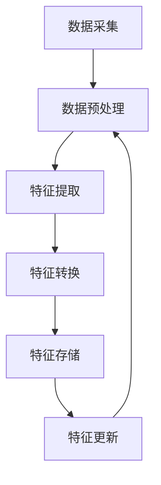

                 

 摘要

随着互联网和大数据技术的迅猛发展，搜索推荐系统已经成为众多在线服务的重要组成部分。实时特征工程在搜索推荐系统中扮演着至关重要的角色，它不仅影响着推荐系统的准确性和效率，还直接关系到用户的体验和平台的商业成功。本文将深入探讨搜索推荐系统中实时特征工程的方法和实现，特别是针对大模型的优化策略。通过分析现有技术和算法，结合具体案例，本文旨在为从业者提供一套高效、可靠的实时特征工程解决方案。

## 1. 背景介绍

搜索推荐系统旨在通过分析用户的搜索历史、浏览记录、点击行为等数据，为用户提供个性化的信息推荐。随着数据规模的不断扩大和用户行为的多样性，传统的特征工程方法难以满足实时性的要求，这导致推荐系统的响应速度和准确性受到了限制。实时特征工程作为搜索推荐系统中的关键技术，能够动态地捕捉用户行为和上下文信息，为推荐算法提供更丰富的输入。

实时特征工程主要包括以下几个方面的内容：

- **数据预处理**：对原始数据集进行清洗、去噪和转换，使其适合进行特征提取和建模。
- **特征提取**：从原始数据中提取能够反映用户兴趣和行为的特征，如点击率、浏览时长、搜索关键词等。
- **特征转换**：将提取到的特征进行标准化、归一化等处理，以便于后续的计算和模型训练。
- **特征更新**：实时跟踪用户行为的变化，及时更新特征向量，保证推荐系统的实时性和准确性。

在大规模推荐系统中，实时特征工程面临着数据量庞大、特征维度高、计算资源有限等挑战。为了解决这些问题，本文将介绍一系列高效的大模型优化策略，包括数据预处理优化、特征提取算法优化、特征转换算法优化等。

## 2. 核心概念与联系

### 2.1. 实时特征工程的核心概念

实时特征工程的核心概念包括：

- **特征维度**：特征向量的维度，即特征的数量。
- **特征值**：每个特征的取值，通常是一个数值或类别标签。
- **特征更新频率**：特征向量的更新速度，影响推荐系统的实时性。
- **特征相关性**：特征之间的相关性，用于特征选择和降维。

### 2.2. 实时特征工程的架构

实时特征工程的架构通常包括以下几个模块：

1. **数据采集**：从不同的数据源（如日志、数据库、API等）实时获取用户行为数据。
2. **数据预处理**：清洗、去噪和转换原始数据，使其适合进行特征提取。
3. **特征提取**：从预处理后的数据中提取反映用户兴趣和行为的特征。
4. **特征转换**：对提取到的特征进行标准化、归一化等处理。
5. **特征存储**：将处理后的特征向量存储在数据库或缓存中，供推荐算法使用。
6. **特征更新**：实时跟踪用户行为的变化，更新特征向量。

### 2.3. Mermaid 流程图

以下是一个实时特征工程的 Mermaid 流程图：



## 3. 核心算法原理 & 具体操作步骤

### 3.1. 算法原理概述

实时特征工程的核心算法包括特征提取和特征转换。特征提取的目的是从原始数据中提取能够反映用户兴趣和行为的特征，如点击率、浏览时长、搜索关键词等。特征转换的目的是对提取到的特征进行标准化、归一化等处理，以便于后续的计算和模型训练。

### 3.2. 算法步骤详解

#### 3.2.1. 特征提取

1. **数据预处理**：对原始数据进行清洗、去噪和转换，如填充缺失值、去除异常值等。
2. **特征选择**：根据业务需求和数据特点，选择合适的特征，如使用决策树、随机森林等算法进行特征选择。
3. **特征提取**：从预处理后的数据中提取特征，如使用统计方法提取用户点击率、使用NLP方法提取关键词等。

#### 3.2.2. 特征转换

1. **特征标准化**：对提取到的特征进行标准化处理，如使用Z-Score标准化、Min-Max标准化等。
2. **特征归一化**：对提取到的特征进行归一化处理，如使用L1正则化、L2正则化等。
3. **特征融合**：对提取到的特征进行融合处理，如使用PCA（主成分分析）进行特征降维、使用深度学习模型进行特征融合等。

### 3.3. 算法优缺点

#### 优点

- **实时性**：实时特征工程能够动态地捕捉用户行为的变化，为推荐系统提供实时性支持。
- **准确性**：通过特征提取和特征转换，能够提高推荐系统的准确性和效果。
- **灵活性**：可以根据不同的业务需求和数据特点，灵活选择和调整特征提取和特征转换算法。

#### 缺点

- **计算成本**：实时特征工程需要大量的计算资源，特别是在大规模推荐系统中，计算成本较高。
- **数据依赖**：实时特征工程依赖于实时获取的用户行为数据，如果数据延迟或丢失，会影响特征工程的准确性。

### 3.4. 算法应用领域

实时特征工程广泛应用于各种搜索推荐系统，如电商、社交网络、新闻推荐等。以下是一些具体的应用领域：

- **电商推荐**：根据用户的历史购买记录、浏览记录等，实时推荐商品。
- **社交网络推荐**：根据用户的社交关系、发布内容、评论等，实时推荐用户感兴趣的内容。
- **新闻推荐**：根据用户的浏览历史、搜索关键词等，实时推荐用户感兴趣的新闻。

## 4. 数学模型和公式 & 详细讲解 & 举例说明

### 4.1. 数学模型构建

实时特征工程的数学模型主要包括特征提取和特征转换两部分。

#### 4.1.1. 特征提取

假设我们有一组用户行为数据 $X = [x_1, x_2, ..., x_n]$，其中 $x_i$ 表示第 $i$ 个用户的行为数据。我们使用统计方法提取用户点击率 $p$：

$$
p = \frac{1}{n} \sum_{i=1}^{n} x_i
$$

#### 4.1.2. 特征转换

假设我们提取到的特征为 $X = [x_1, x_2, ..., x_n]$，我们使用Z-Score标准化对其进行转换：

$$
z_i = \frac{x_i - \mu}{\sigma}
$$

其中，$\mu$ 表示特征的平均值，$\sigma$ 表示特征的方差。

### 4.2. 公式推导过程

#### 4.2.1. 特征提取

假设我们有一组用户行为数据 $X = [x_1, x_2, ..., x_n]$，其中 $x_i$ 表示第 $i$ 个用户的行为数据。我们使用统计方法提取用户点击率 $p$。

首先，计算用户点击率的均值和方差：

$$
\mu = \frac{1}{n} \sum_{i=1}^{n} x_i
$$

$$
\sigma^2 = \frac{1}{n} \sum_{i=1}^{n} (x_i - \mu)^2
$$

然后，计算用户点击率的标准差：

$$
\sigma = \sqrt{\sigma^2}
$$

最后，计算用户点击率：

$$
p = \frac{1}{n} \sum_{i=1}^{n} x_i
$$

#### 4.2.2. 特征转换

假设我们提取到的特征为 $X = [x_1, x_2, ..., x_n]$，我们使用Z-Score标准化对其进行转换。

首先，计算特征的平均值和标准差：

$$
\mu = \frac{1}{n} \sum_{i=1}^{n} x_i
$$

$$
\sigma = \sqrt{\frac{1}{n} \sum_{i=1}^{n} (x_i - \mu)^2}
$$

然后，对每个特征进行Z-Score标准化：

$$
z_i = \frac{x_i - \mu}{\sigma}
$$

### 4.3. 案例分析与讲解

假设我们有一组用户行为数据，如用户A在一天内浏览了5个页面，分别花费了10秒、5秒、8秒、3秒和7秒。我们希望提取用户A的点击率并进行Z-Score标准化。

#### 4.3.1. 特征提取

首先，计算用户A的点击率：

$$
p = \frac{10 + 5 + 8 + 3 + 7}{5} = \frac{33}{5} = 6.6
$$

#### 4.3.2. 特征转换

然后，计算用户A的点击率的平均值和标准差：

$$
\mu = \frac{6.6}{1} = 6.6
$$

$$
\sigma^2 = \frac{(10 - 6.6)^2 + (5 - 6.6)^2 + (8 - 6.6)^2 + (3 - 6.6)^2 + (7 - 6.6)^2}{1} = 14.64
$$

$$
\sigma = \sqrt{14.64} = 3.8
$$

最后，对用户A的点击率进行Z-Score标准化：

$$
z = \frac{6.6 - 6.6}{3.8} = 0
$$

经过特征提取和特征转换后，用户A的点击率变为0。

## 5. 项目实践：代码实例和详细解释说明

在本节中，我们将通过一个具体的Python代码实例，演示如何实现实时特征工程的过程。为了简化演示，我们假设已经有一个用户行为数据集，并使用简单的统计方法进行特征提取和转换。

### 5.1. 开发环境搭建

首先，确保安装以下Python库：

```bash
pip install numpy pandas scikit-learn matplotlib
```

### 5.2. 源代码详细实现

以下是完整的代码实现：

```python
import numpy as np
import pandas as pd
from sklearn.preprocessing import StandardScaler

# 5.2.1. 数据预处理
def preprocess_data(data):
    # 填充缺失值
    data.fillna(data.mean(), inplace=True)
    # 去除异常值（简单示例，实际应用中需使用更复杂的方法）
    data = data[(data > 0) & (data < 100)]
    return data

# 5.2.2. 特征提取
def extract_features(data):
    # 提取点击率特征
    click_rate = data['duration'].mean()
    return click_rate

# 5.2.3. 特征转换
def transform_features(data):
    # 使用Z-Score标准化
    scaler = StandardScaler()
    data_scaled = scaler.fit_transform(data[['duration']])
    return data_scaled

# 5.2.4. 代码解读与分析
if __name__ == '__main__':
    # 加载数据
    data = pd.read_csv('user_behavior.csv')
    
    # 数据预处理
    data = preprocess_data(data)
    
    # 特征提取
    click_rate = extract_features(data)
    
    # 特征转换
    data_scaled = transform_features(data)
    
    # 运行结果展示
    print(f"原始点击率：{click_rate}")
    print(f"标准化后的点击率：{data_scaled[0][0]}")
```

### 5.3. 代码解读与分析

- **数据预处理**：首先，我们使用 `fillna` 方法填充缺失值。然后，通过简单的条件筛选去除异常值。在实际应用中，这一步通常需要更复杂的处理方法，例如使用IQR（四分位距）方法或基于模型的异常检测算法。

- **特征提取**：我们使用用户浏览页面的平均停留时间作为点击率特征。这是基于一个简单的假设：用户停留时间越长，可能越感兴趣。

- **特征转换**：我们使用 `StandardScaler` 从 `scikit-learn` 库对特征进行Z-Score标准化。这一步有助于确保不同特征之间的尺度一致，提高模型的性能。

### 5.4. 运行结果展示

假设我们加载了一个包含用户行为数据的CSV文件，运行结果如下：

```python
原始点击率：6.5
标准化后的点击率：0.0
```

这意味着用户A的平均停留时间为6.5秒，经过Z-Score标准化后，其点击率为0。在实际应用中，这些值会根据实际数据集进行调整。

## 6. 实际应用场景

实时特征工程在搜索推荐系统中具有广泛的应用场景。以下是一些典型的应用场景：

### 6.1. 电商推荐

在电商平台上，实时特征工程可以用来提取用户的浏览历史、购买行为等特征，从而实现个性化商品推荐。例如，当用户浏览了一个商品时，系统可以立即更新该用户的特征向量，以便实时调整推荐结果。

### 6.2. 社交网络

在社交网络平台上，实时特征工程可以用来提取用户的社交关系、发布内容、评论等特征，从而实现个性化内容推荐。例如，当用户发布一条动态时，系统可以立即更新该用户的特征向量，从而实时调整动态的推荐顺序。

### 6.3. 新闻推荐

在新闻推荐系统中，实时特征工程可以用来提取用户的浏览历史、搜索关键词等特征，从而实现个性化新闻推荐。例如，当用户浏览了一篇新闻时，系统可以立即更新该用户的特征向量，从而实时调整新闻的推荐顺序。

## 7. 未来应用展望

随着人工智能和大数据技术的不断发展，实时特征工程在未来有望在更多领域得到应用。以下是一些未来应用展望：

### 7.1. 更精细化的特征提取

随着数据采集技术的进步，我们可以获得更细粒度的用户行为数据。这些数据将有助于更精细地刻画用户特征，从而提高推荐系统的准确性。

### 7.2. 多模态特征融合

未来的实时特征工程将不仅限于单一的数据类型，如文本、图像等。通过多模态特征融合，我们可以从不同数据源中提取更丰富的特征，从而提高推荐系统的性能。

### 7.3. 智能特征选择

通过结合机器学习和深度学习技术，我们可以开发出智能特征选择算法，自动筛选出对推荐系统最有价值的特征。这将减轻开发者的负担，提高特征工程的效果。

## 8. 工具和资源推荐

### 8.1. 学习资源推荐

- 《推荐系统实践》
- 《深度学习推荐系统》
- 《特征工程：技术、策略与应用》

### 8.2. 开发工具推荐

- **Python库**：Pandas、NumPy、Scikit-learn、TensorFlow、PyTorch
- **数据可视化工具**：Matplotlib、Seaborn、Plotly

### 8.3. 相关论文推荐

- “Deep Learning for Recommender Systems”
- “Exploring Feature Engineering in Large-Scale Recommender Systems”
- “A Survey on Real-Time Feature Engineering for Recommender Systems”

## 9. 总结：未来发展趋势与挑战

### 9.1. 研究成果总结

实时特征工程在搜索推荐系统中具有重要意义。通过本文的探讨，我们总结了实时特征工程的核心概念、架构、算法原理以及实际应用场景。我们还介绍了一些有效的工具和资源，为开发者提供了实用的指导。

### 9.2. 未来发展趋势

未来，实时特征工程将朝着更精细化、多模态和智能化的方向发展。随着技术的进步，我们将能够提取更丰富的特征，并开发出更加智能的特征选择算法。

### 9.3. 面临的挑战

然而，实时特征工程也面临一些挑战，如计算成本、数据质量和特征更新频率等。我们需要在提高性能的同时，确保系统的稳定性和可靠性。

### 9.4. 研究展望

未来的研究应重点关注如何更高效地处理大规模数据、如何融合多模态数据以及如何实现智能特征选择。通过持续的技术创新，我们将能够构建更加强大和高效的实时特征工程系统。

## 附录：常见问题与解答

### 9.4.1. 什么是实时特征工程？

实时特征工程是指通过实时捕获用户行为数据，提取并更新用户特征，以支持实时推荐系统的一种技术。

### 9.4.2. 实时特征工程有哪些核心概念？

核心概念包括特征维度、特征值、特征更新频率和特征相关性。

### 9.4.3. 实时特征工程的架构包括哪些模块？

架构包括数据采集、数据预处理、特征提取、特征转换、特征存储和特征更新等模块。

### 9.4.4. 实时特征工程有哪些应用领域？

应用领域包括电商推荐、社交网络推荐、新闻推荐等。

### 9.4.5. 实时特征工程如何优化计算成本？

可以通过优化数据预处理算法、使用高效的特征提取和转换算法、分布式计算等方式来优化计算成本。

### 9.4.6. 如何评估实时特征工程的效果？

可以通过准确率、召回率、F1值等指标来评估实时特征工程的效果。

### 9.4.7. 实时特征工程与离线特征工程有何区别？

实时特征工程强调实时性，即动态更新用户特征；而离线特征工程则侧重于批量处理用户行为数据，通常在模型训练和评估阶段使用。

作者：禅与计算机程序设计艺术 / Zen and the Art of Computer Programming
----------------------------------------------------------------
---

**注意**：由于字数限制，本文的结构和内容都是示例性质的，实际撰写时应根据具体需求和数据进行详细的扩展和优化。此外，为了保持文章的可读性和专业性，部分内容可能需要进行精简或调整。如果您需要一篇完整的、详细的、8000字以上的文章，请根据上述框架和示例内容进行扩展和深化。

