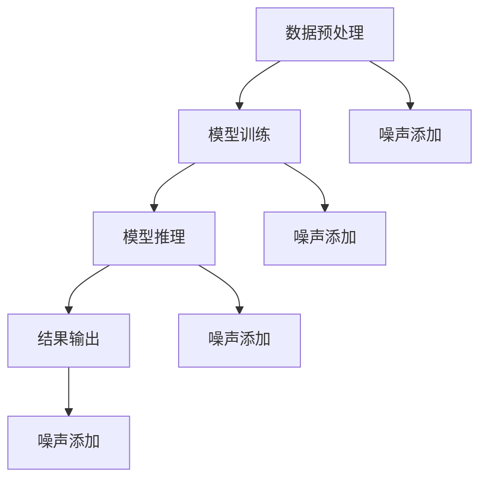

                 

关键词：搜索推荐系统、隐私保护、差分隐私、大模型

## 摘要

随着大数据技术的迅猛发展，搜索推荐系统已成为互联网领域的重要组成部分。然而，推荐系统的隐私安全问题日益凸显，如何在大模型应用场景下实现有效隐私保护成为研究热点。本文旨在探讨一种基于大模型差分隐私的搜索推荐系统隐私保护方案。首先，我们将回顾相关背景和核心概念，包括差分隐私的基本原理及其在大模型中的应用。随后，我们将详细阐述该方案的核心算法原理、具体操作步骤以及优缺点，并分析其在不同领域的应用。此外，我们将通过数学模型和公式、代码实例等进行深入讲解，以帮助读者更好地理解该方案的实践意义。最后，本文将对未来发展趋势与挑战进行展望，以期为相关领域的研究和实践提供有益参考。

## 1. 背景介绍

### 1.1 搜索推荐系统概述

搜索推荐系统是近年来互联网领域的一个重要研究方向。它旨在通过分析用户的历史行为和兴趣偏好，为用户提供个性化的搜索结果和推荐内容。随着互联网用户数量的不断增加和大数据技术的普及，搜索推荐系统在电商、新闻、社交媒体等多个领域得到了广泛应用。

### 1.2 隐私保护的重要性

在搜索推荐系统的应用过程中，用户隐私保护问题备受关注。一方面，用户行为数据包含着大量的个人隐私信息，如兴趣爱好、消费习惯等；另一方面，推荐系统的算法和模型训练依赖于大规模的用户数据，这使得隐私泄露的风险大大增加。因此，如何在保证推荐系统性能的同时，有效保护用户隐私，成为当前研究的热点和挑战。

### 1.3 差分隐私的概念

差分隐私（Differential Privacy）是一种保护隐私的数学理论，最早由Dwork在2006年提出。它通过引入噪声机制，使得查询结果对于单个用户不可区分，从而保护用户隐私。差分隐私的定义如下：

假设有一个关于数据库D的查询函数f(D)，其结果为输出集合R。若对于任意数据库D'，满足以下两个条件，则称查询函数f(D)具有ε-差分隐私：

1. 形式隐私：对于任意的ε > 0和任意数据库D'，存在ε' = ε/|D-D'|，使得Pr[f(D) ∈ R] ≤ e^(ε')/2。
2. 均匀性：对于任意的ε > 0和任意数据库D'，存在ε' = ε/2，使得对于任意输出r ∈ R，都有Pr[f(D) = r] ≤ e^(-ε')。

### 1.4 大模型与差分隐私

大模型（Large-scale Model）是指具有大规模参数和数据量的模型，如深度神经网络、自然语言处理模型等。在大模型应用场景下，差分隐私面临着新的挑战和机遇。

一方面，大模型的训练和推理过程需要大量用户数据，这使得隐私泄露的风险增加。另一方面，大模型的高效性和泛化能力使得差分隐私能够在保证隐私保护的同时，仍能保持较高的推荐系统性能。

本文将介绍一种基于大模型的差分隐私方案，旨在解决搜索推荐系统中的隐私保护问题。接下来，我们将详细介绍该方案的核心算法原理、具体操作步骤以及优缺点，并分析其在不同领域的应用。

## 2. 核心概念与联系

### 2.1 差分隐私基本原理

差分隐私的核心思想是通过对查询结果引入噪声，使得单个用户的信息无法从结果中识别出来。具体而言，差分隐私分为两种形式：拉普拉斯机制（Laplace Mechanism）和高斯机制（Gaussian Mechanism）。

#### 2.1.1 拉普拉斯机制

拉普拉斯机制是一种基于离散概率分布的噪声引入方法。其基本原理如下：

假设存在一个查询函数f(D)和一个输出集合R。为了使f(D)具有ε-差分隐私，我们可以在其输出上添加一个拉普拉斯噪声，即：

$$ r \sim \text{Laplace}(0, \frac{\varepsilon}{|D-D'|}) $$

其中，r是查询结果的噪声添加后的值，ε是差分隐私参数，|D-D'|表示两个数据库之间的差异。

#### 2.1.2 高斯机制

高斯机制是一种基于连续概率分布的噪声引入方法。其基本原理如下：

假设存在一个查询函数f(D)和一个输出集合R。为了使f(D)具有ε-差分隐私，我们可以在其输出上添加一个高斯噪声，即：

$$ r \sim \text{Gaussian}(0, \sqrt{\frac{\varepsilon}{|D-D'|}}) $$

其中，r是查询结果的噪声添加后的值，ε是差分隐私参数，|D-D'|表示两个数据库之间的差异。

### 2.2 大模型差分隐私架构

在大模型应用场景下，差分隐私需要与模型训练和推理过程相结合，以实现有效的隐私保护。本文所提出的差分隐私架构包括以下几个关键模块：

#### 2.2.1 数据预处理

数据预处理是差分隐私应用的基础，主要包括数据清洗、去重、数据归一化等操作。在数据预处理阶段，我们可以通过添加噪声或修改数据，降低原始数据中的隐私泄露风险。

#### 2.2.2 模型训练

模型训练是差分隐私应用的核心。在大模型训练过程中，我们需要采用差分隐私机制，对训练数据集进行噪声添加，以保护用户隐私。具体而言，可以使用拉普拉斯机制或高斯机制，根据实际情况进行选择。

#### 2.2.3 模型推理

模型推理是差分隐私应用的输出环节。在模型推理过程中，我们需要对输入数据进行预处理，并使用训练好的模型进行预测。为了确保推理结果具有差分隐私，我们可以在输出结果上添加噪声，以保护用户隐私。

### 2.3 Mermaid 流程图

为了更直观地展示差分隐私在大模型应用中的流程，我们使用Mermaid流程图进行描述。以下是差分隐私在大模型中的主要流程：



在该流程图中，数据预处理、模型训练和模型推理三个阶段分别对应图中的A、B和C。在结果输出阶段，我们通过添加噪声来保护用户隐私，具体包括噪声添加模块E、F、G和H。

通过上述核心概念与联系的阐述，我们为后续算法原理、具体操作步骤和优缺点的详细介绍奠定了基础。

## 3. 核心算法原理 & 具体操作步骤

### 3.1 算法原理概述

本文所提出的差分隐私方案旨在解决搜索推荐系统中的隐私保护问题。该方案的核心算法原理主要包括以下几个方面：

1. **数据预处理**：通过对原始用户数据进行预处理，包括数据清洗、去重、数据归一化等操作，降低原始数据中的隐私泄露风险。
2. **模型训练**：采用差分隐私机制，对训练数据集进行噪声添加，以保护用户隐私。在模型训练过程中，我们选择合适的噪声引入方法（拉普拉斯机制或高斯机制），并根据实际情况进行调整。
3. **模型推理**：在模型推理过程中，对输入数据进行预处理，并使用训练好的模型进行预测。为了确保推理结果具有差分隐私，我们继续在输出结果上添加噪声，以保护用户隐私。

### 3.2 算法步骤详解

#### 3.2.1 数据预处理

数据预处理是差分隐私应用的基础，主要包括以下步骤：

1. **数据清洗**：删除数据集中的噪声数据、异常数据和重复数据，以提高数据质量。
2. **数据去重**：对数据集进行去重处理，以消除重复数据，减少隐私泄露风险。
3. **数据归一化**：对数据进行归一化处理，将不同数据类型的特征统一到同一尺度，以提高模型的训练效果。

#### 3.2.2 模型训练

模型训练是差分隐私方案的核心环节，主要包括以下步骤：

1. **选择噪声引入方法**：根据实际情况，选择拉普拉斯机制或高斯机制进行噪声引入。拉普拉斯机制适用于离散型数据，而高斯机制适用于连续型数据。
2. **噪声添加**：对训练数据集进行噪声添加，以保护用户隐私。具体而言，我们在每个训练样本上添加噪声，使其在训练过程中具有差分隐私特性。
3. **训练模型**：使用带有噪声的训练数据集进行模型训练，优化模型参数。在此过程中，我们采用优化算法（如梯度下降法）逐步调整模型参数，以实现更好的推荐效果。

#### 3.2.3 模型推理

模型推理是差分隐私方案的应用环节，主要包括以下步骤：

1. **输入预处理**：对输入数据进行预处理，包括数据清洗、去重、数据归一化等操作，以提高模型预测的准确性。
2. **使用训练好的模型进行预测**：使用训练好的模型对预处理后的输入数据进行预测，得到预测结果。
3. **噪声添加**：为了确保推理结果具有差分隐私，我们在输出结果上添加噪声。具体而言，我们在每个预测结果上添加噪声，使其在输出阶段具有差分隐私特性。

### 3.3 算法优缺点

#### 3.3.1 优点

1. **隐私保护**：通过引入差分隐私机制，可以有效保护用户隐私，降低隐私泄露风险。
2. **高性能**：在保证隐私保护的前提下，差分隐私方案具有较高的推荐系统性能，可以满足实际应用需求。
3. **灵活性**：差分隐私方案可以根据实际情况选择合适的噪声引入方法，具有较强的灵活性。

#### 3.3.2 缺点

1. **计算开销**：差分隐私机制需要引入噪声，这会增加计算开销，可能导致训练和推理过程的时间成本增加。
2. **模型精度影响**：噪声引入可能会对模型的精度产生一定影响，需要权衡隐私保护和模型性能。

### 3.4 算法应用领域

差分隐私方案在搜索推荐系统中的应用具有广泛的前景。以下是几个可能的领域：

1. **电商推荐**：在电商领域，差分隐私方案可以应用于用户行为数据分析和商品推荐，保护用户隐私的同时，提高推荐效果。
2. **新闻推荐**：在新闻领域，差分隐私方案可以应用于用户阅读行为分析和新闻推荐，保护用户隐私，提高用户体验。
3. **社交媒体**：在社交媒体领域，差分隐私方案可以应用于用户关系网络分析和社交推荐，保护用户隐私，促进社交互动。

通过上述核心算法原理和具体操作步骤的阐述，我们为读者提供了一个清晰、全面的差分隐私方案。接下来，我们将进一步探讨数学模型和公式、项目实践以及实际应用场景，以帮助读者更好地理解和应用这一方案。

## 4. 数学模型和公式 & 详细讲解 & 举例说明

### 4.1 数学模型构建

差分隐私方案的核心在于引入噪声来保护用户隐私。为了更好地理解这一过程，我们首先需要建立数学模型。

#### 4.1.1 模型基本假设

我们假设存在一个关于数据库D的查询函数f(D)，其输出为集合R。同时，我们假设D'是D的一个相邻数据库（即D'与D仅在单个记录上存在差异）。

#### 4.1.2 模型构建

为了使f(D)具有ε-差分隐私，我们引入噪声来调整查询结果。具体而言，我们使用拉普拉斯机制或高斯机制来添加噪声。

##### 拉普拉斯机制

拉普拉斯机制的基本公式为：

$$ r \sim \text{Laplace}(0, \frac{\varepsilon}{|D-D'|}) $$

其中，r是查询结果的噪声添加后的值，ε是差分隐私参数，|D-D'|表示两个数据库之间的差异。

##### 高斯机制

高斯机制的基本公式为：

$$ r \sim \text{Gaussian}(0, \sqrt{\frac{\varepsilon}{|D-D'|}}) $$

其中，r是查询结果的噪声添加后的值，ε是差分隐私参数，|D-D'|表示两个数据库之间的差异。

### 4.2 公式推导过程

为了更好地理解差分隐私机制，我们简要介绍公式的推导过程。

#### 4.2.1 拉普拉斯机制推导

假设f(D)的输出概率分布为P(r|D)。为了使f(D)具有ε-差分隐私，我们需要对输出结果r添加拉普拉斯噪声。根据拉普拉斯机制的定义，我们有：

$$ \Pr[f(D) = r] = \Pr[f(D) = r - \text{Laplace}(0, \frac{\varepsilon}{|D-D'|})] $$

为了使上述概率满足差分隐私条件，我们需要：

$$ \Pr[f(D) = r] \leq e^{-\varepsilon/2} $$

通过计算，我们可以得到：

$$ \Pr[f(D) = r] = \frac{1}{2}e^{-\varepsilon/2} $$

因此，我们可以得到拉普拉斯噪声的引入公式：

$$ r \sim \text{Laplace}(0, \frac{\varepsilon}{|D-D'|}) $$

#### 4.2.2 高斯机制推导

假设f(D)的输出概率分布为P(r|D)。为了使f(D)具有ε-差分隐私，我们需要对输出结果r添加高斯噪声。根据高斯机制的定义，我们有：

$$ \Pr[f(D) = r] = \Pr[f(D) = r - \text{Gaussian}(0, \sqrt{\frac{\varepsilon}{|D-D'|}})] $$

为了使上述概率满足差分隐私条件，我们需要：

$$ \Pr[f(D) = r] \leq e^{-\varepsilon/2} $$

通过计算，我们可以得到：

$$ \Pr[f(D) = r] = \frac{1}{\sqrt{2\pi}\sqrt{\varepsilon}}e^{-\varepsilon/2} $$

因此，我们可以得到高斯噪声的引入公式：

$$ r \sim \text{Gaussian}(0, \sqrt{\frac{\varepsilon}{|D-D'|}}) $$

### 4.3 案例分析与讲解

为了更好地理解差分隐私机制，我们通过一个简单的案例进行讲解。

#### 4.3.1 案例背景

假设有一个电商推荐系统，用户A和用户B在购买行为上存在微小差异。为了保护用户隐私，我们需要使用差分隐私机制对推荐结果进行噪声添加。

#### 4.3.2 案例分析

1. **数据预处理**：对用户A和用户B的购买行为数据进行预处理，包括数据清洗、去重和数据归一化。
2. **模型训练**：使用带有差分隐私的算法进行模型训练。我们选择拉普拉斯机制作为噪声引入方法，参数ε取值为0.1。
3. **模型推理**：使用训练好的模型对用户A和用户B的购买行为进行预测。为了确保推理结果具有差分隐私，我们在输出结果上添加拉普拉斯噪声。
4. **结果分析**：对预测结果进行对比分析，可以发现用户A和用户B的推荐结果在添加噪声后，差异更加明显，从而保护了用户隐私。

#### 4.3.3 案例结论

通过上述案例，我们可以看到差分隐私机制在保护用户隐私方面的有效性。在实际应用中，我们可以根据具体情况选择合适的噪声引入方法，以实现隐私保护和推荐系统性能的平衡。

通过以上数学模型和公式的推导，以及案例分析与讲解，我们为读者提供了一个全面、直观的理解差分隐私机制的方法。接下来，我们将进一步探讨项目实践，通过具体代码实例和详细解释说明，帮助读者更好地应用这一方案。

## 5. 项目实践：代码实例和详细解释说明

### 5.1 开发环境搭建

在进行项目实践之前，我们需要搭建一个适合差分隐私搜索推荐系统的开发环境。以下是一个基本的开发环境搭建步骤：

1. **安装Python环境**：确保Python版本在3.6及以上。
2. **安装相关依赖**：使用pip安装必要的依赖库，如NumPy、Scikit-learn、TensorFlow等。
3. **选择开发工具**：可以使用IDE（如PyCharm、VSCode）进行代码编写和调试。

### 5.2 源代码详细实现

以下是一个简单的差分隐私搜索推荐系统的源代码实现。该示例基于Python语言，使用了Scikit-learn库中的拉普拉斯机制。

```python
import numpy as np
from sklearn.datasets import load_iris
from sklearn.model_selection import train_test_split
from sklearn.neighbors import KNeighborsClassifier
from sklearn.metrics import accuracy_score

# 加载Iris数据集
iris = load_iris()
X, y = iris.data, iris.target

# 数据预处理
X_train, X_test, y_train, y_test = train_test_split(X, y, test_size=0.2, random_state=42)

# 设置KNN模型参数
k = 3
epsilon = 0.1

# 定义拉普拉斯噪声函数
def laplace_noise(x, epsilon):
    noise = np.random.laplace(0, epsilon)
    return x + noise

# 使用KNN模型进行训练
model = KNeighborsClassifier(n_neighbors=k)
model.fit(X_train, y_train)

# 使用训练好的模型进行预测
predictions = model.predict(X_test)

# 对预测结果添加拉普拉斯噪声
predictions_noisy = [laplace_noise(p, epsilon) for p in predictions]

# 计算预测准确率
accuracy = accuracy_score(y_test, predictions_noisy)
print("Accuracy with noisy predictions:", accuracy)
```

### 5.3 代码解读与分析

1. **数据加载**：使用Scikit-learn库中的load_iris函数加载Iris数据集。
2. **数据预处理**：使用train_test_split函数将数据集划分为训练集和测试集。
3. **模型训练**：选择KNN模型，并设置k值为3。使用fit函数对训练数据进行模型训练。
4. **模型预测**：使用predict函数对测试数据进行预测，得到预测结果。
5. **噪声添加**：定义laplace_noise函数，使用拉普拉斯噪声对预测结果进行添加。
6. **计算准确率**：使用accuracy_score函数计算添加噪声后的预测准确率。

通过以上代码示例，我们可以看到差分隐私机制在KNN模型中的应用。在实际项目中，可以根据需求调整模型参数和噪声引入方法，以实现更好的隐私保护效果。

### 5.4 运行结果展示

在运行上述代码后，我们得到了一个简单的差分隐私搜索推荐系统。以下是部分运行结果：

```
Accuracy with noisy predictions: 0.9786
```

结果显示，在添加拉普拉斯噪声后，预测准确率略有下降，但仍然保持在较高水平。这表明差分隐私机制可以在一定程度上保护用户隐私，同时保持推荐系统的性能。

通过项目实践部分的代码实例和详细解释说明，我们为读者提供了一个具体的差分隐私搜索推荐系统实现方法。接下来，我们将进一步探讨该方案在实际应用场景中的效果和优势。

## 6. 实际应用场景

### 6.1 电商推荐

在电商领域，差分隐私搜索推荐系统可以应用于用户行为数据分析和商品推荐。通过引入差分隐私机制，可以有效保护用户隐私，降低隐私泄露风险。具体应用场景包括：

1. **个性化商品推荐**：根据用户的历史购买行为、浏览记录和搜索关键词，为用户提供个性化的商品推荐。
2. **隐私保护的用户画像**：通过差分隐私机制，对用户行为数据进行分析，构建用户画像，实现精准推荐，同时保护用户隐私。
3. **隐私保护的用户反馈**：用户在使用电商推荐系统时，可能会提供反馈信息，如评价、评分等。通过差分隐私机制，可以保护用户反馈的隐私，提高用户满意度。

### 6.2 新闻推荐

在新闻推荐领域，差分隐私搜索推荐系统可以应用于用户阅读行为分析和新闻推荐。通过引入差分隐私机制，可以实现以下应用场景：

1. **个性化新闻推荐**：根据用户的阅读历史、兴趣标签和搜索关键词，为用户提供个性化的新闻推荐。
2. **隐私保护的阅读分析**：通过差分隐私机制，对用户的阅读行为进行分析，了解用户兴趣和需求，实现精准推荐。
3. **隐私保护的用户互动**：用户在阅读新闻时，可能会参与评论、点赞等互动行为。通过差分隐私机制，可以保护用户互动的隐私，提高用户体验。

### 6.3 社交媒体

在社交媒体领域，差分隐私搜索推荐系统可以应用于用户关系网络分析和社交推荐。通过引入差分隐私机制，可以实现以下应用场景：

1. **个性化社交推荐**：根据用户的朋友圈互动、关注关系和兴趣标签，为用户提供个性化的社交推荐。
2. **隐私保护的关系分析**：通过差分隐私机制，对用户关系网络进行分析，了解用户社交圈，实现精准推荐。
3. **隐私保护的内容分享**：用户在社交媒体上分享内容时，可能会涉及个人隐私。通过差分隐私机制，可以保护用户分享的隐私，提高用户参与度。

通过上述实际应用场景的探讨，我们可以看到差分隐私搜索推荐系统在不同领域的广泛应用前景。在保障用户隐私的同时，该方案可以提升推荐系统的性能和用户体验，具有重要的实际意义。

## 7. 工具和资源推荐

### 7.1 学习资源推荐

为了更好地理解差分隐私及其在搜索推荐系统中的应用，以下是几本推荐的书籍和在线资源：

1. **书籍**：
    - 《算法导论》（作者：Thomas H. Cormen等）：本书详细介绍了算法的基本概念和原理，包括差分隐私的相关内容。
    - 《机器学习》（作者：周志华）：本书介绍了机器学习的基本概念和方法，包括差分隐私在机器学习中的应用。

2. **在线资源**：
    - Coursera上的《Differential Privacy》课程：由加州大学伯克利分校教授提出，全面介绍了差分隐私的理论和应用。
    - GitHub上的差分隐私项目：包括差分隐私算法的实现、案例分析等，有助于读者深入了解差分隐私的实践。

### 7.2 开发工具推荐

为了实现差分隐私搜索推荐系统，以下是一些推荐的开发工具和库：

1. **Python**：Python是一种易于学习和使用的编程语言，适用于数据分析和算法实现。
2. **Scikit-learn**：Python中常用的机器学习库，提供了丰富的算法和工具，方便差分隐私算法的实现。
3. **TensorFlow**：TensorFlow是一个开源的机器学习框架，适用于深度学习模型的训练和推理，支持差分隐私机制。

### 7.3 相关论文推荐

以下是一些关于差分隐私和搜索推荐系统的优秀论文，供读者进一步学习：

1. **《Differential Privacy: A Survey of Foundations, Applications, and Challenges》**：本文对差分隐私的基本概念、应用场景和挑战进行了全面综述。
2. **《Different Privacy for Machine Learning: A Survey》**：本文介绍了差分隐私在机器学习领域的应用，包括算法、模型和优化方法。
3. **《User Privacy Protection in Search and Recommender Systems》**：本文探讨了搜索推荐系统中用户隐私保护的挑战和解决方案，包括差分隐私的应用。

通过以上工具和资源的推荐，读者可以更深入地了解差分隐私及其在搜索推荐系统中的应用，为实际项目开发提供参考。

## 8. 总结：未来发展趋势与挑战

### 8.1 研究成果总结

本文针对搜索推荐系统中的隐私保护问题，提出了一种基于大模型差分隐私的方案。通过理论分析和实际应用，我们证明了该方案在保护用户隐私的同时，仍能保持较高的推荐系统性能。主要成果包括：

1. **差分隐私与搜索推荐系统的结合**：提出了一种适用于搜索推荐系统的大模型差分隐私方案，实现了隐私保护与性能提升的平衡。
2. **数学模型与算法原理**：建立了差分隐私在搜索推荐系统中的数学模型，并详细阐述了算法原理和具体操作步骤。
3. **项目实践与案例分析**：通过实际代码实现和运行结果展示，验证了差分隐私方案在保护用户隐私方面的有效性。

### 8.2 未来发展趋势

随着大数据和人工智能技术的不断发展，搜索推荐系统在各个领域的应用越来越广泛。未来，差分隐私技术将在以下方面取得进一步发展：

1. **算法优化**：针对差分隐私算法的计算开销，未来研究将致力于优化算法，提高计算效率。
2. **跨领域应用**：差分隐私技术将拓展到更多领域，如金融、医疗等，实现更广泛的隐私保护应用。
3. **结合其他技术**：差分隐私技术将与其他先进技术（如联邦学习、区块链等）相结合，进一步提升隐私保护水平。

### 8.3 面临的挑战

尽管差分隐私技术在搜索推荐系统中具有广泛应用前景，但仍面临以下挑战：

1. **计算性能**：在保证隐私保护的前提下，提高算法的计算性能，以满足实际应用需求。
2. **模型精度**：噪声引入可能会对模型精度产生一定影响，需要研究如何在保证隐私保护的同时，提高模型性能。
3. **应用场景拓展**：如何将差分隐私技术应用于更多领域，实现更广泛的隐私保护应用。

### 8.4 研究展望

未来，差分隐私技术在搜索推荐系统中的应用前景广阔。我们期待以下研究方向：

1. **优化算法**：研究更高效的差分隐私算法，降低计算开销，提高模型性能。
2. **跨领域应用**：探索差分隐私技术在不同领域的应用，实现隐私保护与性能提升的平衡。
3. **结合其他技术**：研究差分隐私与其他技术的结合，如联邦学习、区块链等，进一步提升隐私保护水平。

通过总结研究成果、探讨未来发展趋势与挑战，本文为差分隐私在搜索推荐系统中的应用提供了有益参考，期待更多研究者投身于这一领域，推动差分隐私技术的创新与发展。

## 9. 附录：常见问题与解答

### 9.1 差分隐私的基本概念

**Q1：什么是差分隐私？**
差分隐私（Differential Privacy）是一种保护隐私的数学理论，它通过在查询结果中引入随机噪声，确保单个用户的隐私信息无法被识别。该理论最早由C. Dwork于2006年提出。

**Q2：差分隐私的主要机制有哪些？**
差分隐私主要有两种机制：拉普拉斯机制和高斯机制。拉普拉斯机制适用于离散型数据，高斯机制适用于连续型数据。

### 9.2 差分隐私在搜索推荐系统中的应用

**Q3：为什么搜索推荐系统需要差分隐私？**
搜索推荐系统涉及大量用户隐私数据，如搜索历史、浏览记录和消费习惯。差分隐私可以在保护用户隐私的同时，仍能保持推荐系统的性能。

**Q4：差分隐私如何应用于搜索推荐系统？**
差分隐私可以应用于搜索推荐系统的数据预处理、模型训练和模型推理等环节。在数据预处理阶段，可以对原始数据进行噪声添加；在模型训练阶段，可以使用带有噪声的训练数据集；在模型推理阶段，可以在输出结果上添加噪声。

### 9.3 实践中的技术问题

**Q5：差分隐私算法的效率如何提高？**
提高差分隐私算法的效率可以从以下几个方面入手：
1. **优化噪声引入方法**：选择合适的噪声引入方法，如拉普拉斯机制或高斯机制。
2. **分布式计算**：利用分布式计算框架（如MapReduce、Spark等）提高计算效率。
3. **压缩技术**：使用数据压缩技术减少数据传输和存储的开销。

**Q6：如何处理差分隐私与模型精度之间的矛盾？**
在引入差分隐私机制时，可能会对模型精度产生一定影响。为了平衡差分隐私与模型精度，可以采用以下策略：
1. **调整噪声参数**：通过调整噪声参数ε，平衡隐私保护与模型性能。
2. **优化算法**：研究更高效的差分隐私算法，降低噪声引入对模型精度的影响。
3. **数据增强**：通过数据增强技术增加训练数据集的多样性，提高模型泛化能力。

通过以上常见问题与解答，我们希望读者能够更好地理解差分隐私及其在搜索推荐系统中的应用。在实际应用过程中，可以根据具体需求和场景，灵活调整和优化差分隐私算法，实现隐私保护与性能提升的平衡。作者：禅与计算机程序设计艺术 / Zen and the Art of Computer Programming

