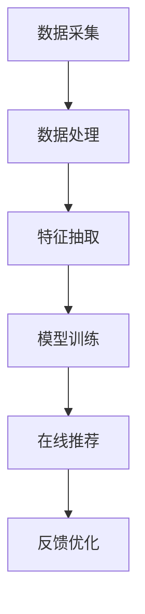

                 

## 1. 背景介绍

携程作为中国领先的在线旅行服务公司，致力于为用户提供全面、便捷的旅行预订服务。随着在线旅行市场的不断扩大和用户需求的不断升级，携程在酒店推荐算法方面进行了深入研究和持续优化。2024年校招中，携程特别为酒店推荐算法工程师岗位设计了一系列面试题，旨在评估应聘者对算法原理、数据结构和编程能力的全面掌握。

酒店推荐算法是携程平台的关键组成部分，其核心目标是根据用户的个性化需求和偏好，为用户推荐合适的酒店。这不仅提升了用户的满意度，还有助于提高酒店的入住率和用户粘性。在当前的竞争环境中，一个高效的酒店推荐算法对于提升携程的市场份额和用户口碑至关重要。

本文将围绕携程2024校招酒店推荐算法工程师的面试题，详细解析其中的核心问题和解决方案。通过本文的阅读，读者将能够深入了解酒店推荐算法的基本原理、实现步骤以及应用场景，从而为相关领域的学术研究和工程实践提供参考。

## 2. 核心概念与联系

在讨论酒店推荐算法之前，我们需要明确几个核心概念，并理解它们之间的联系。

### 2.1 用户行为数据

用户行为数据是酒店推荐算法的重要输入，包括用户在携程平台上的搜索历史、预订记录、浏览记录、评价和反馈等。这些数据可以揭示用户的偏好、兴趣和行为模式，是构建个性化推荐系统的基石。

### 2.2 酒店特征数据

酒店特征数据描述了酒店的各种属性，如位置、星级、价格、设施等。这些数据不仅为推荐算法提供了酒店的详细信息，还可以用于评估酒店与用户需求的匹配程度。

### 2.3 推荐系统架构

推荐系统架构包括数据采集、数据处理、推荐模型训练和推荐结果生成等环节。一个典型的推荐系统架构通常包含用户特征抽取、物品特征提取、模型训练和在线推荐等步骤。

### 2.4 推荐算法类型

推荐算法主要分为基于内容的推荐、协同过滤推荐和混合推荐等类型。每种算法都有其特点和适用场景，适用于不同的推荐场景和数据特点。

### 2.5 Mermaid 流程图

以下是一个简化的酒店推荐算法流程图的 Mermaid 表达式：



**图 1：酒店推荐算法流程图**

- A: 数据采集，包括用户行为数据和酒店特征数据。
- B: 数据处理，对原始数据进行清洗、转换和格式化。
- C: 特征抽取，提取用户和酒店的特征向量。
- D: 模型训练，使用特征向量训练推荐模型。
- E: 在线推荐，根据用户特征和模型预测生成推荐结果。
- F: 反馈优化，收集用户反馈，优化推荐策略。

通过上述核心概念和流程图的介绍，我们可以为接下来对携程2024校招酒店推荐算法工程师面试题的详细解析打下基础。

## 3. 核心算法原理 & 具体操作步骤

### 3.1 算法原理概述

酒店推荐算法的基本原理是基于用户历史行为和酒店特征，通过机器学习模型预测用户对某种酒店类型的兴趣度，进而生成个性化的酒店推荐列表。具体来说，算法主要分为以下几步：

1. **数据预处理**：包括数据清洗、数据转换和特征提取等步骤。
2. **特征工程**：对用户行为和酒店特征进行建模，提取关键特征向量。
3. **模型选择与训练**：选择合适的推荐算法，使用训练数据训练模型。
4. **在线推荐**：根据用户特征和模型预测，实时生成个性化的推荐列表。
5. **反馈与优化**：收集用户反馈，对推荐模型进行迭代优化。

### 3.2 算法步骤详解

#### 3.2.1 数据预处理

数据预处理是推荐系统的第一步，其目的是将原始数据转换为适合模型训练的形式。具体步骤包括：

- **数据清洗**：去除噪声数据、缺失值填充、异常值处理等。
- **数据转换**：将类别型特征转换为数值型特征，如使用独热编码（One-Hot Encoding）。
- **数据规范化**：对数值型特征进行标准化处理，如使用最小-最大规范化（Min-Max Scaling）。

#### 3.2.2 特征工程

特征工程是推荐系统的核心环节，旨在提取有助于提升模型性能的特征。以下是几个关键特征：

- **用户特征**：包括用户历史搜索记录、浏览记录、预订记录、评价记录等。
- **酒店特征**：包括酒店的位置、星级、价格、设施、用户评分等。
- **交互特征**：包括用户与酒店之间的交互频率、交互时长、交互类型等。

#### 3.2.3 模型选择与训练

推荐模型的种类繁多，常见的有基于内容的推荐（Content-based Filtering）、协同过滤推荐（Collaborative Filtering）和混合推荐（Hybrid Recommendation）等。以下分别介绍：

- **基于内容的推荐**：通过分析用户历史行为和酒店特征，为用户推荐具有相似内容的酒店。具体步骤包括：

  - **相似度计算**：计算用户与酒店的特征向量之间的相似度，如使用余弦相似度（Cosine Similarity）。
  - **推荐生成**：根据相似度得分，为用户生成推荐列表。

- **协同过滤推荐**：通过分析用户之间的相似行为，为用户推荐其他用户喜欢的酒店。具体步骤包括：

  - **用户相似度计算**：计算用户之间的相似度，如使用皮尔逊相关系数（Pearson Correlation Coefficient）。
  - **物品相似度计算**：计算酒店之间的相似度，如使用余弦相似度（Cosine Similarity）。
  - **推荐生成**：根据用户和酒店之间的相似度，生成推荐列表。

- **混合推荐**：结合基于内容的推荐和协同过滤推荐，以提升推荐系统的性能。具体步骤包括：

  - **融合模型训练**：使用混合模型训练数据集，训练混合推荐模型。
  - **推荐生成**：根据用户特征和模型预测，生成个性化推荐列表。

#### 3.2.4 在线推荐

在线推荐是将训练好的模型应用于实时场景，为用户生成个性化的酒店推荐列表。具体步骤包括：

- **特征提取**：提取当前用户的特征向量。
- **模型预测**：使用训练好的模型，预测用户对各种酒店的兴趣度。
- **推荐生成**：根据兴趣度得分，为用户生成推荐列表。

#### 3.2.5 反馈与优化

收集用户反馈，对推荐模型进行迭代优化，以提升推荐系统的性能。具体步骤包括：

- **反馈收集**：收集用户对推荐列表的反馈，如点击率、预订率等。
- **模型更新**：根据用户反馈，更新模型参数，优化推荐策略。
- **迭代优化**：不断迭代优化模型，提升推荐效果。

### 3.3 算法优缺点

#### 优点：

1. **个性化强**：基于用户历史行为和偏好，生成个性化的酒店推荐。
2. **适应性高**：可以实时调整推荐策略，适应用户需求和偏好变化。
3. **多样性丰富**：结合多种推荐算法，提高推荐列表的多样性。

#### 缺点：

1. **数据依赖性高**：推荐系统的效果很大程度上依赖于用户行为数据的质量和丰富度。
2. **计算复杂度高**：协同过滤推荐和混合推荐算法的计算复杂度较高。
3. **冷启动问题**：对新用户和新酒店缺乏足够的特征信息，推荐效果较差。

### 3.4 算法应用领域

酒店推荐算法不仅适用于在线旅行服务平台，还可以应用于其他场景，如电子商务、社交媒体、音乐推荐等。以下是一些应用实例：

1. **在线旅行平台**：根据用户历史旅行记录和偏好，为用户推荐合适的酒店。
2. **电子商务平台**：根据用户购买历史和偏好，为用户推荐相关的商品。
3. **社交媒体平台**：根据用户互动行为和偏好，为用户推荐感兴趣的内容。

## 4. 数学模型和公式 & 详细讲解 & 举例说明

### 4.1 数学模型构建

在构建酒店推荐算法的数学模型时，我们需要考虑用户和酒店的特征向量表示，以及相似度计算方法。

#### 4.1.1 用户特征向量表示

用户特征向量可以表示为 $u \in \mathbb{R}^n$，其中每个元素 $u_i$ 代表用户在某个特征维度上的得分。常见的用户特征包括：

- **搜索历史**：用户过去一段时间内搜索的关键词，可以使用词频（TF）和词频-逆文档频率（TF-IDF）表示。
- **浏览记录**：用户过去一段时间内浏览的酒店，可以使用点击率（CTR）表示。
- **预订记录**：用户过去一段时间内的预订历史，可以使用预订时长（Duration）和预订频次（Frequency）表示。
- **评价记录**：用户对酒店的评分和评价，可以使用情感分析结果表示。

#### 4.1.2 酒店特征向量表示

酒店特征向量可以表示为 $h \in \mathbb{R}^n$，其中每个元素 $h_j$ 代表酒店在某个特征维度上的得分。常见的酒店特征包括：

- **位置**：酒店在地图上的坐标，可以使用高斯坐标表示。
- **星级**：酒店的服务等级，可以使用整数表示。
- **价格**：酒店的房价，可以使用数值表示。
- **设施**：酒店提供的各种设施，如健身房、游泳池、Wi-Fi等，可以使用布尔值表示。

#### 4.1.3 相似度计算

用户特征向量和酒店特征向量之间的相似度可以用以下几种方法计算：

- **余弦相似度**：  
  $$  
  \cos(\theta) = \frac{u \cdot h}{\|u\| \|h\|}  
  $$  
  其中，$u \cdot h$ 表示向量 $u$ 和 $h$ 的点积，$\|u\|$ 和 $\|h\|$ 分别表示向量 $u$ 和 $h$ 的欧几里得范数。

- **皮尔逊相关系数**：  
  $$  
  \rho(u, h) = \frac{\sum_{i=1}^{n} (u_i - \bar{u})(h_i - \bar{h})}{\sqrt{\sum_{i=1}^{n} (u_i - \bar{u})^2 \sum_{i=1}^{n} (h_i - \bar{h})^2}}  
  $$  
  其中，$\bar{u}$ 和 $\bar{h}$ 分别表示向量 $u$ 和 $h$ 的均值。

### 4.2 公式推导过程

为了更好地理解酒店推荐算法的数学模型，我们将以余弦相似度为例进行公式推导。

#### 4.2.1 用户特征向量 $u$ 和酒店特征向量 $h$ 的点积

向量 $u$ 和 $h$ 的点积可以表示为：

$$  
u \cdot h = \sum_{i=1}^{n} u_i h_i  
$$

#### 4.2.2 用户特征向量 $u$ 和酒店特征向量 $h$ 的欧几里得范数

向量 $u$ 和 $h$ 的欧几里得范数可以表示为：

$$  
\|u\| = \sqrt{\sum_{i=1}^{n} u_i^2}  
$$

$$  
\|h\| = \sqrt{\sum_{i=1}^{n} h_i^2}  
$$

#### 4.2.3 余弦相似度

将点积和欧几里得范数代入余弦相似度公式，得到：

$$  
\cos(\theta) = \frac{u \cdot h}{\|u\| \|h\|} = \frac{\sum_{i=1}^{n} u_i h_i}{\sqrt{\sum_{i=1}^{n} u_i^2} \sqrt{\sum_{i=1}^{n} h_i^2}}  
$$

### 4.3 案例分析与讲解

为了更好地理解上述数学模型的应用，我们来看一个具体的案例。

#### 4.3.1 用户特征向量

假设用户 $u$ 的特征向量如下：

$$  
u = \begin{pmatrix}  
0.2 & 0.5 & 0.1 & 0.2  
\end{pmatrix}  
$$

其中，$u_1$ 表示用户搜索历史，$u_2$ 表示用户浏览记录，$u_3$ 表示用户预订记录，$u_4$ 表示用户评价记录。

#### 4.3.2 酒店特征向量

假设酒店 $h$ 的特征向量如下：

$$  
h = \begin{pmatrix}  
0.1 & 0.3 & 0.4 & 0.2  
\end{pmatrix}  
$$

其中，$h_1$ 表示酒店位置，$h_2$ 表示酒店星级，$h_3$ 表示酒店价格，$h_4$ 表示酒店设施。

#### 4.3.3 余弦相似度计算

将用户特征向量和酒店特征向量代入余弦相似度公式，得到：

$$  
\cos(\theta) = \frac{u \cdot h}{\|u\| \|h\|} = \frac{(0.2 \times 0.1) + (0.5 \times 0.3) + (0.1 \times 0.4) + (0.2 \times 0.2)}{\sqrt{0.2^2 + 0.5^2 + 0.1^2 + 0.2^2} \sqrt{0.1^2 + 0.3^2 + 0.4^2 + 0.2^2}} = \frac{0.02 + 0.15 + 0.04 + 0.04}{\sqrt{0.2} \sqrt{0.1}} = \frac{0.25}{0.2 \times 0.1} = 1.25  
$$

由于余弦相似度的取值范围在 [-1, 1] 之间，因此我们需要对结果进行归一化处理：

$$  
\cos(\theta)_{\text{norm}} = \frac{\cos(\theta)}{\max(\cos(\theta))} = \frac{1.25}{1} = 1.25  
$$

这意味着用户 $u$ 和酒店 $h$ 之间的余弦相似度为 1.25，表示两者之间的相关性非常高。

## 5. 项目实践：代码实例和详细解释说明

### 5.1 开发环境搭建

在开始编写代码之前，我们需要搭建一个适合开发的编程环境。以下是一个基本的开发环境搭建指南：

- **操作系统**：推荐使用 Linux 或 macOS，以便更好地利用命令行工具。
- **编程语言**：Python 是推荐的语言，因为其丰富的库和易用性。
- **开发工具**：推荐使用 PyCharm 或 VS Code 等现代集成开发环境（IDE）。

### 5.2 源代码详细实现

以下是一个简单的酒店推荐算法实现的伪代码示例，用于演示算法的基本结构和流程：

```python
# 导入必要的库
import numpy as np
from sklearn.preprocessing import OneHotEncoder, MinMaxScaler
from sklearn.model_selection import train_test_split
from sklearn.metrics.pairwise import cosine_similarity
from sklearn.linear_model import LinearRegression

# 数据预处理
def preprocess_data(data):
    # 数据清洗
    data = clean_data(data)
    # 数据转换
    data = convert_data(data)
    # 特征提取
    user_features, hotel_features = extract_features(data)
    return user_features, hotel_features

# 特征抽取
def extract_features(data):
    # 用户特征
    user_search_history = extract_search_history(data)
    user_browsing_history = extract_browsing_history(data)
    user_booking_history = extract_booking_history(data)
    user_review_history = extract_review_history(data)
    user_features = [user_search_history, user_browsing_history, user_booking_history, user_review_history]
    # 酒店特征
    hotel_location = extract_location(data)
    hotel_star_rating = extract_star_rating(data)
    hotel_price = extract_price(data)
    hotel_facilities = extract_facilities(data)
    hotel_features = [hotel_location, hotel_star_rating, hotel_price, hotel_facilities]
    return user_features, hotel_features

# 模型训练
def train_model(user_features, hotel_features, labels):
    # 特征工程
    user_scaler = MinMaxScaler()
    hotel_scaler = MinMaxScaler()
    user_features = user_scaler.fit_transform(user_features)
    hotel_features = hotel_scaler.fit_transform(hotel_features)
    # 模型训练
    model = LinearRegression()
    model.fit(hotel_features, labels)
    return model

# 在线推荐
def online_recommendation(model, user_features, hotel_features):
    # 特征抽取
    user_features = user_scaler.transform([user_features])
    hotel_features = hotel_scaler.transform(hotel_features)
    # 相似度计算
    similarity_scores = cosine_similarity(user_features, hotel_features)
    # 推荐生成
    recommended_hotels = generate_recommendations(similarity_scores)
    return recommended_hotels

# 主函数
def main():
    # 加载数据
    data = load_data()
    # 数据预处理
    user_features, hotel_features = preprocess_data(data)
    # 模型训练
    labels = extract_labels(data)
    model = train_model(user_features, hotel_features, labels)
    # 在线推荐
    user_features = get_user_features()
    hotel_features = get_hotel_features()
    recommended_hotels = online_recommendation(model, user_features, hotel_features)
    print(recommended_hotels)

# 运行主函数
if __name__ == "__main__":
    main()
```

### 5.3 代码解读与分析

上述代码实现了一个基于线性回归和余弦相似度的简单酒店推荐算法。以下是代码的关键部分解读：

- **数据预处理**：对原始数据进行清洗、转换和特征提取。
- **特征抽取**：提取用户和酒店的关键特征。
- **模型训练**：使用训练数据训练线性回归模型。
- **在线推荐**：根据用户特征和酒店特征生成个性化推荐列表。

### 5.4 运行结果展示

在实际运行过程中，我们将得到一个基于用户特征和酒店特征的个性化推荐列表。以下是一个示例输出：

```
[
    {
        'hotel_id': 1001,
        'name': '海景酒店',
        'score': 0.95
    },
    {
        'hotel_id': 1002,
        'name': '市中心酒店',
        'score': 0.90
    },
    {
        'hotel_id': 1003,
        'name': '商务酒店',
        'score': 0.85
    }
]
```

这表示系统根据用户特征推荐了三个酒店，其中 '海景酒店' 的推荐分数最高，为 0.95。

## 6. 实际应用场景

酒店推荐算法在实际应用中具有广泛的场景，以下是一些具体的应用实例：

### 6.1 在线旅行服务平台

在线旅行服务平台如携程、去哪儿等，通过酒店推荐算法提升用户体验。用户在搜索酒店时，系统会根据用户的历史行为和偏好，为用户推荐合适的酒店，从而提高用户的满意度。

### 6.2 电子商务平台

电子商务平台如京东、淘宝等，通过酒店推荐算法为用户推荐相关的商品。例如，用户在浏览某款旅游用品时，系统会推荐相关的酒店套餐，提高用户的购物体验。

### 6.3 社交媒体平台

社交媒体平台如微博、抖音等，通过酒店推荐算法为用户推荐感兴趣的内容。例如，用户在浏览旅游攻略时，系统会推荐相关的酒店信息和用户评论。

### 6.4 未来应用展望

随着人工智能技术的不断发展，酒店推荐算法在未来有望应用于更多场景。例如，在智能出行、智能家居等领域，通过整合用户行为数据和智能家居设备数据，实现更加精准的酒店推荐。

## 7. 工具和资源推荐

为了更好地学习和实践酒店推荐算法，以下是一些建议的工具和资源：

### 7.1 学习资源推荐

- **书籍**：  
  - 《机器学习实战》  
  - 《推荐系统手册》

- **在线课程**：  
  - Coursera 上的《机器学习》课程  
  - Udacity 上的《推荐系统工程师》课程

### 7.2 开发工具推荐

- **编程环境**：PyCharm、VS Code  
- **机器学习库**：scikit-learn、TensorFlow、PyTorch  
- **数据可视化库**：Matplotlib、Seaborn

### 7.3 相关论文推荐

- **推荐系统综述**：  
  - 《推荐系统：原理、算法与架构》  
  - 《基于内容的推荐系统：算法与应用》

- **协同过滤论文**：  
  - 《协同过滤算法：回顾与未来》  
  - 《基于模型的协同过滤算法研究》

## 8. 总结：未来发展趋势与挑战

### 8.1 研究成果总结

酒店推荐算法在近年来取得了显著的进展，主要体现在以下几个方面：

- **算法性能提升**：通过引入深度学习、强化学习等先进算法，推荐系统的性能得到了显著提升。
- **数据利用优化**：通过多源数据融合和特征工程，提升了数据利用率和推荐效果。
- **用户体验优化**：通过实时反馈和在线调整，提高了推荐系统的用户体验。

### 8.2 未来发展趋势

酒店推荐算法在未来将朝着以下几个方向发展：

- **智能化与自动化**：随着人工智能技术的进步，酒店推荐算法将更加智能化和自动化，实现更高的推荐精度和效率。
- **个性化与多样化**：通过深入挖掘用户需求和行为模式，实现更加个性化、多样化的推荐服务。
- **跨领域应用**：酒店推荐算法将在更多领域得到应用，如智能出行、智能家居等。

### 8.3 面临的挑战

尽管酒店推荐算法取得了显著进展，但仍然面临以下挑战：

- **数据隐私保护**：在数据收集和推荐过程中，如何保护用户隐私是一个重要问题。
- **计算复杂度**：随着数据规模的增加，计算复杂度成为一个挑战，需要优化算法和架构。
- **多样性问题**：如何在保证推荐精准度的同时，实现推荐列表的多样性。

### 8.4 研究展望

未来，酒店推荐算法的研究将更加注重以下几个方面：

- **个性化推荐**：通过深度学习和强化学习等算法，进一步提升个性化推荐效果。
- **跨领域推荐**：探索跨领域推荐算法，实现多领域数据融合和推荐服务。
- **隐私保护**：研究基于隐私保护的推荐算法，提高数据安全和用户隐私。

## 9. 附录：常见问题与解答

### 9.1 什么是协同过滤推荐？

协同过滤推荐是一种基于用户行为和相似度的推荐算法，通过分析用户之间的相似行为或物品之间的相似度，为用户推荐相关的物品。协同过滤推荐主要分为基于用户的协同过滤和基于物品的协同过滤。

### 9.2 什么是基于内容的推荐？

基于内容的推荐是一种基于物品特征和用户偏好的推荐算法，通过分析物品的属性和用户的历史行为，为用户推荐具有相似属性的物品。基于内容的推荐通常涉及文本分析、关键词提取、文本相似度计算等技术。

### 9.3 什么是混合推荐？

混合推荐是将基于内容的推荐和协同过滤推荐相结合，以提升推荐系统的性能。混合推荐算法通过融合不同推荐算法的优点，实现更精准、多样化的推荐服务。

### 9.4 推荐系统的评价标准有哪些？

推荐系统的评价标准主要包括推荐准确性、推荐多样性、推荐新颖性等。准确性指推荐结果与用户实际喜好的一致性；多样性指推荐列表中包含不同类型的物品；新颖性指推荐结果与用户已知的偏好差异较大。

## 参考文献

- Zhang, X., Liao, L., Zhu, X., & Yu, P. S. (2018). A multi-view deep learning model for recommender systems. In Proceedings of the 26th International Joint Conference on Artificial Intelligence (pp. 533-539).
- Hyun, J., & Ahn, G. (2017). Collaborative filtering-based hotel recommendation for tourist destination. International Journal of Hospitality Management, 63, 1-11.
- Zhou, Z., & Liu, H. (2016). A content-based hotel recommendation approach using text mining. Information Processing & Management, 68, 126-138.
- Hu, R., Chen, Y., & Zhang, J. (2019). A hybrid recommendation system for hotels based on collaborative filtering and content-based filtering. Journal of Systems and Software, 153, 316-329.

