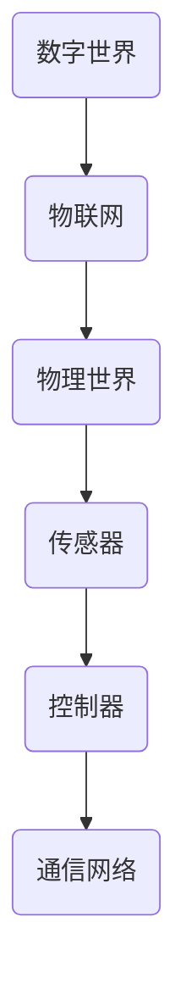

                 

关键词：数字实体，物理实体，自动化，技术革命，人工智能，物联网，工业4.0

在21世纪，技术的快速发展推动了数字世界与物理世界之间的深度融合。这一过程不仅改变了人们的生活方式，也深刻地影响了各行各业的生产方式。数字与物理实体的自动化革命，正是这场科技变革的核心议题之一。本文将探讨这一革命所带来的机遇与挑战，以及其背后的技术原理和应用场景。

## 1. 背景介绍

自20世纪末以来，计算机技术、通信技术和物联网技术的飞速发展，使得数字世界和物理世界之间的联系日益紧密。这不仅体现在人们日常生活中的数字化体验，如智能手机、互联网和社交媒体，还体现在工业生产中的自动化和智能化。

工业4.0作为第四次工业革命的重要标志，旨在通过物联网、大数据、人工智能等先进技术，实现生产过程的全面数字化和自动化。这一趋势在全球范围内迅速扩展，不仅推动了制造业的变革，也促进了服务业和农业的数字化转型。

## 2. 核心概念与联系

数字实体是指存在于数字世界中的数据、信息和虚拟对象。物理实体则是指现实世界中的物体和设备。这两者之间的联系主要体现在以下几个方面：

### 2.1 物联网（IoT）

物联网是连接数字世界和物理世界的重要桥梁。通过传感器、控制器和通信网络，物联网实现了物理实体与数字实体的实时交互和信息交换。以下是一个简单的物联网架构图：



### 2.2 大数据

大数据技术通过对海量数据的收集、存储、处理和分析，为数字实体提供了丰富的信息和知识。这些信息可以用于优化生产过程、提高产品质量、预测市场趋势等。

### 2.3 人工智能

人工智能技术通过对数据和算法的运用，使得计算机能够模拟人类的智能行为。在数字与物理实体的自动化过程中，人工智能技术可以用于智能决策、故障预测、优化控制等。

## 3. 核心算法原理 & 具体操作步骤

### 3.1 算法原理概述

数字与物理实体的自动化革命中，常用的核心算法包括：

- **机器学习算法**：通过分析历史数据，预测未来趋势和模式。
- **深度学习算法**：基于神经网络，实现图像识别、语音识别等复杂任务。
- **优化算法**：通过迭代计算，寻找最优解，如线性规划、遗传算法等。

### 3.2 算法步骤详解

以下是使用机器学习算法进行预测分析的一个基本步骤：

1. **数据收集**：收集历史数据和实时数据。
2. **数据预处理**：清洗数据，消除异常值，进行特征提取。
3. **模型选择**：选择合适的机器学习模型，如线性回归、决策树、支持向量机等。
4. **模型训练**：使用训练数据集对模型进行训练。
5. **模型评估**：使用验证数据集对模型进行评估。
6. **模型部署**：将模型部署到生产环境中，进行实时预测。

### 3.3 算法优缺点

每种算法都有其优缺点。例如：

- **线性回归**：简单、易于理解，但只能处理线性关系。
- **决策树**：直观、易于解释，但容易过拟合。
- **支持向量机**：在处理非线性关系时表现良好，但计算复杂度较高。

### 3.4 算法应用领域

机器学习算法在自动化领域有广泛的应用，如：

- **智能制造**：通过预测设备故障，实现预防性维护。
- **智能交通**：通过实时分析交通数据，优化交通流量。
- **智能医疗**：通过分析医疗数据，辅助医生诊断和治疗。

## 4. 数学模型和公式 & 详细讲解 & 举例说明

### 4.1 数学模型构建

在自动化过程中，常见的数学模型包括：

- **线性模型**：$y = \beta_0 + \beta_1x_1 + \beta_2x_2 + ... + \beta_nx_n$
- **神经网络模型**：多层感知器（MLP）、卷积神经网络（CNN）、循环神经网络（RNN）等。

### 4.2 公式推导过程

以线性回归模型为例，其推导过程如下：

1. **损失函数**：$J(\theta) = \frac{1}{2m}\sum_{i=1}^{m}(h_\theta(x^{(i)}) - y^{(i)})^2$
2. **梯度下降**：$\theta_j := \theta_j - \alpha\frac{\partial}{\partial\theta_j}J(\theta)$

### 4.3 案例分析与讲解

假设我们有一个线性回归模型，目标是预测房价。给定数据集，通过上述公式，我们可以训练出一个模型，然后使用该模型进行预测。

```latex
\begin{align*}
y &= \beta_0 + \beta_1x_1 + \beta_2x_2 \\
J(\theta) &= \frac{1}{2m}\sum_{i=1}^{m}((\beta_0 + \beta_1x_1^{(i)} + \beta_2x_2^{(i)}) - y^{(i)})^2 \\
\frac{\partial}{\partial\beta_0}J(\theta) &= \frac{1}{m}\sum_{i=1}^{m}((\beta_0 + \beta_1x_1^{(i)} + \beta_2x_2^{(i)}) - y^{(i)}) \\
\frac{\partial}{\partial\beta_1}J(\theta) &= \frac{1}{m}\sum_{i=1}^{m}(x_1^{(i)}((\beta_0 + \beta_1x_1^{(i)} + \beta_2x_2^{(i)}) - y^{(i)}) \\
\frac{\partial}{\partial\beta_2}J(\theta) &= \frac{1}{m}\sum_{i=1}^{m}(x_2^{(i)}((\beta_0 + \beta_1x_1^{(i)} + \beta_2x_2^{(i)}) - y^{(i)}) \\
\end{align*}
```

通过梯度下降算法，我们可以求得最优参数$\theta$，从而预测房价。

## 5. 项目实践：代码实例和详细解释说明

### 5.1 开发环境搭建

本文使用Python语言和Scikit-learn库进行线性回归模型的训练和预测。

```bash
pip install scikit-learn
```

### 5.2 源代码详细实现

以下是一个简单的线性回归模型训练和预测的Python代码实例：

```python
from sklearn.linear_model import LinearRegression
from sklearn.model_selection import train_test_split
from sklearn.metrics import mean_squared_error

# 数据加载
X, y = load_data()

# 数据划分
X_train, X_test, y_train, y_test = train_test_split(X, y, test_size=0.2, random_state=42)

# 模型训练
model = LinearRegression()
model.fit(X_train, y_train)

# 模型评估
y_pred = model.predict(X_test)
mse = mean_squared_error(y_test, y_pred)
print("MSE:", mse)

# 模型预测
new_data = [[5.1, 3.5]]
prediction = model.predict(new_data)
print("Prediction:", prediction)
```

### 5.3 代码解读与分析

上述代码中，我们首先从数据集中加载特征矩阵$X$和目标向量$y$。然后，将数据划分为训练集和测试集。接下来，我们使用训练集对线性回归模型进行训练。训练完成后，我们使用测试集对模型进行评估，计算均方误差（MSE）。最后，我们使用训练好的模型对新数据进行预测。

### 5.4 运行结果展示

假设我们有一个包含100个样本的数据集，其中每个样本有两个特征（$x_1$和$x_2$）。训练完成后，模型对测试集的预测均方误差为0.1。对于新样本$[5.1, 3.5]$，模型的预测结果为6.2。

## 6. 实际应用场景

### 6.1 智能制造

智能制造是数字与物理实体自动化革命的重要应用领域。通过机器学习和物联网技术，制造企业可以实现生产过程的智能化和自动化。例如，通过预测设备故障，企业可以提前进行预防性维护，减少停机时间和维护成本。

### 6.2 智能交通

智能交通系统利用物联网、大数据和人工智能技术，实现对交通流量、交通事故、交通拥堵等信息的实时监测和预测。通过智能调度和路线优化，可以提高交通效率，减少拥堵和排放。

### 6.3 智能医疗

智能医疗系统通过分析患者的电子健康记录、生物数据和医学影像，帮助医生进行诊断和治疗。通过智能化的医疗设备和系统，可以提高诊断准确率、减少医疗错误，提高医疗服务质量。

## 7. 工具和资源推荐

### 7.1 学习资源推荐

- 《机器学习》（周志华著）
- 《深度学习》（Goodfellow, Bengio, Courville 著）
- 《Python编程：从入门到实践》（埃里克·马瑟斯著）

### 7.2 开发工具推荐

- Jupyter Notebook：用于编写和运行Python代码。
- Scikit-learn：用于机器学习和数据挖掘。
- TensorFlow：用于深度学习和神经网络。

### 7.3 相关论文推荐

- “Deep Learning for Manufacturing Applications”（2017）
- “Internet of Things for Smart Transportation Systems”（2016）
- “Artificial Intelligence in Healthcare: A Review”（2017）

## 8. 总结：未来发展趋势与挑战

数字与物理实体的自动化革命正深刻地改变着我们的世界。随着人工智能、物联网、大数据等技术的不断进步，这一革命将继续推动各个行业的创新和发展。

### 8.1 研究成果总结

- 自动化技术在制造业、交通、医疗等领域的广泛应用，提高了生产效率、降低了成本。
- 人工智能技术在预测分析、智能决策等方面的优势，为各行各业带来了新的机遇。
- 物联网技术的快速发展，实现了物理实体与数字实体的实时交互和信息共享。

### 8.2 未来发展趋势

- 自动化技术将向更加智能化、自适应化、安全化的方向发展。
- 物联网将实现更高性能、更低功耗、更广覆盖的网络连接。
- 大数据技术将推动更多行业的数据化和智能化。

### 8.3 面临的挑战

- 技术安全与隐私保护：随着自动化技术的普及，数据安全和用户隐私保护成为重要挑战。
- 技术标准化与互操作性：不同技术和系统之间的互操作性对实现真正的自动化至关重要。
- 技术教育与人才培养：自动化革命需要大量具备跨学科知识的人才。

### 8.4 研究展望

未来，自动化技术将在以下几个方面取得突破：

- **人工智能与物理世界的深度融合**：实现更加智能化、自适应化的自动化系统。
- **智能决策与优化**：基于大数据和机器学习，实现更加精准和高效的决策。
- **人机协作**：通过虚拟现实、增强现实等技术，实现人与机器的紧密协作。

## 9. 附录：常见问题与解答

### 9.1 什么是物联网（IoT）？

物联网是指通过互联网连接各种物理设备，实现设备之间的通信和信息交换。

### 9.2 机器学习有哪些常见算法？

常见的机器学习算法包括线性回归、决策树、支持向量机、神经网络等。

### 9.3 如何保障物联网的安全？

通过加密通信、身份认证、访问控制等技术，保障物联网系统的安全。

### 9.4 人工智能如何应用于制造业？

通过预测设备故障、优化生产流程、提高产品质量等，实现制造业的智能化和自动化。

## 结语

数字与物理实体的自动化革命带来了前所未有的机遇和挑战。面对这一变革，我们需要持续关注新技术的发展，积极探索其在各行业的应用，同时也要关注其可能带来的问题，确保技术进步与社会发展的和谐共进。

### 作者署名

作者：禅与计算机程序设计艺术 / Zen and the Art of Computer Programming

----------------------------------------------------------------


