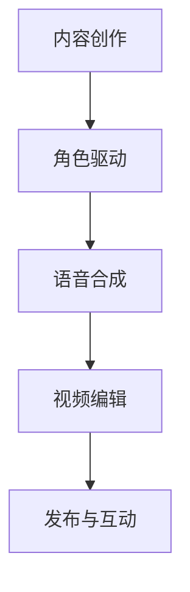

                 

关键词：数字人、短视频、人工智能、内容创作、用户体验、互动性

摘要：随着人工智能技术的飞速发展，数字人技术在短视频领域的应用越来越广泛。本文将探讨数字人技术在短视频中的角色、应用场景、核心算法、数学模型以及未来的发展趋势和面临的挑战。

## 1. 背景介绍

近年来，短视频平台如抖音、快手等在全球范围内迅速崛起，成为了人们日常生活的重要组成部分。短视频具有时长短、传播快、互动性强等特点，吸引了大量用户。然而，短视频的内容创作和编辑往往需要大量的时间和人力投入。为了提高内容创作的效率，数字人技术应运而生。

数字人技术是指通过人工智能算法生成的虚拟角色，它们可以模仿人类的语言、表情、动作等，进行内容创作、互动和表演。在短视频领域，数字人技术可以极大地提高内容创作的效率，降低成本，同时为用户提供更丰富、个性化的互动体验。

## 2. 核心概念与联系

### 2.1 数字人技术概述

数字人技术主要包括以下几个核心概念：

- **虚拟角色建模**：通过三维建模技术，创建具有人类外观和动作的虚拟角色。
- **语音合成**：使用文本到语音（TTS）技术，将文字转换为自然流畅的语音。
- **动作捕捉**：通过捕捉演员的动作，为虚拟角色赋予真实的动作表现。
- **表情捕捉**：捕捉演员的表情，使虚拟角色的面部表情更加自然。

### 2.2 数字人技术在短视频中的应用架构

数字人技术在短视频中的应用架构可以简化为以下几个步骤：

1. **内容创作**：通过自然语言处理（NLP）技术，将文字内容转化为适合数字人表达的形式。
2. **角色驱动**：使用动作捕捉和表情捕捉技术，为虚拟角色赋予动作和表情。
3. **语音合成**：将文字内容转换为语音，并为其添加背景音乐和音效。
4. **视频编辑**：将语音、动作和背景音乐整合到一起，生成最终的短视频。

### 2.3 Mermaid 流程图



## 3. 核心算法原理 & 具体操作步骤

### 3.1 算法原理概述

数字人技术在短视频中的应用涉及到多个核心算法，包括：

- **自然语言处理（NLP）**：用于理解文本内容和生成对话。
- **生成对抗网络（GAN）**：用于生成高质量的虚拟角色图像。
- **递归神经网络（RNN）**：用于语音合成和文本生成。
- **强化学习**：用于数字人的互动和学习用户的偏好。

### 3.2 算法步骤详解

1. **内容创作**：
   - 使用NLP技术对输入文本进行解析，提取关键信息和情感。
   - 根据提取的信息，生成适合数字人表达的对话和剧本。

2. **角色驱动**：
   - 使用GAN生成虚拟角色的三维图像。
   - 通过动作捕捉和表情捕捉技术，为虚拟角色赋予动作和表情。

3. **语音合成**：
   - 使用RNN将文本转换为语音。
   - 添加背景音乐和音效，使语音更加自然和生动。

4. **视频编辑**：
   - 将语音、动作和背景音乐整合到一起，生成短视频。
   - 使用视频编辑软件进行后期处理，如剪辑、特效添加等。

### 3.3 算法优缺点

- **优点**：
  - 提高内容创作效率，降低人力成本。
  - 提供丰富、个性化的互动体验。
  - 角色形象多样化，适应不同内容风格。

- **缺点**：
  - 初始开发成本较高，技术门槛较高。
  - 数字人表情和动作的自然程度仍需提高。
  - 需要大量的数据和计算资源。

### 3.4 算法应用领域

- **短视频平台**：用于内容创作和互动，提高用户粘性。
- **在线教育**：用于教学内容的辅助和个性化互动。
- **虚拟直播**：用于虚拟主播的表演和互动。

## 4. 数学模型和公式 & 详细讲解 & 举例说明

### 4.1 数学模型构建

在数字人技术中，常用的数学模型包括：

- **生成对抗网络（GAN）**：用于虚拟角色图像的生成。
- **递归神经网络（RNN）**：用于语音合成和文本生成。
- **卷积神经网络（CNN）**：用于图像处理和特征提取。

### 4.2 公式推导过程

- **GAN公式**：
  $$G(x) \sim p_G(z), \quad D(x) \sim p_{\text{data}}(x)$$
  其中，\(G\)为生成器，\(D\)为判别器，\(x\)为输入，\(z\)为噪声向量。

- **RNN公式**：
  $$h_t = \sigma(W_h \cdot [h_{t-1}, x_t] + b_h)$$
  其中，\(h_t\)为当前时刻的隐藏状态，\(x_t\)为输入，\(\sigma\)为激活函数。

- **CNN公式**：
  $$h_i = \sigma(\sum_j W_{ij} \cdot h_j + b_i)$$
  其中，\(h_i\)为输出特征图，\(W_{ij}\)为权重，\(h_j\)为输入特征图。

### 4.3 案例分析与讲解

#### 案例一：GAN在虚拟角色图像生成中的应用

假设我们使用一个生成对抗网络（GAN）来生成虚拟角色图像，其结构如下：

- **生成器（G）**：将随机噪声向量\(z\)映射为虚拟角色图像。
- **判别器（D）**：判断输入图像是真实图像还是生成图像。

训练过程如下：

1. 初始化生成器和判别器参数。
2. 随机生成一批噪声向量\(z\)，通过生成器\(G\)生成虚拟角色图像。
3. 使用真实图像和生成图像分别输入判别器\(D\)，更新判别器参数。
4. 使用生成图像输入判别器\(D\)，更新生成器参数。
5. 重复步骤2-4，直到生成器生成的虚拟角色图像质量达到预期。

#### 案例二：RNN在语音合成中的应用

假设我们使用一个递归神经网络（RNN）来进行语音合成，其结构如下：

- **输入层**：输入文本序列。
- **隐藏层**：包含多个时间步的隐藏状态。
- **输出层**：生成语音信号。

训练过程如下：

1. 初始化RNN参数。
2. 预处理文本数据，将其转化为数字序列。
3. 将文本序列输入RNN，计算隐藏状态和输出。
4. 计算损失函数，更新RNN参数。
5. 重复步骤3-4，直到模型达到预期性能。

## 5. 项目实践：代码实例和详细解释说明

### 5.1 开发环境搭建

1. 安装Python环境。
2. 安装深度学习框架TensorFlow。
3. 安装其他必要的库，如Keras、NumPy等。

### 5.2 源代码详细实现

#### 5.2.1 GAN模型实现

```python
import tensorflow as tf
from tensorflow.keras.models import Model
from tensorflow.keras.layers import Dense, Flatten, Conv2D, Reshape, BatchNormalization

# 生成器模型
def build_generator(z_dim):
    model = tf.keras.Sequential([
        Dense(128, activation='relu', input_shape=(z_dim,)),
        BatchNormalization(),
        Dense(256, activation='relu'),
        BatchNormalization(),
        Dense(512, activation='relu'),
        BatchNormalization(),
        Dense(1024, activation='relu'),
        BatchNormalization(),
        Dense(784, activation='tanh'),
        Reshape((28, 28, 1))
    ])
    return model

# 判别器模型
def build_discriminator(img_shape):
    model = tf.keras.Sequential([
        Conv2D(32, (3, 3), strides=(2, 2), padding='same', input_shape=img_shape, activation='relu'),
        BatchNormalization(),
        Conv2D(64, (3, 3), strides=(2, 2), padding='same', activation='relu'),
        BatchNormalization(),
        Conv2D(128, (3, 3), strides=(2, 2), padding='same', activation='relu'),
        BatchNormalization(),
        Flatten(),
        Dense(1, activation='sigmoid')
    ])
    return model

# GAN模型
def build_gan(generator, discriminator):
    model = tf.keras.Sequential([
        generator,
        discriminator
    ])
    return model

# 设置超参数
z_dim = 100
img_shape = (28, 28, 1)

# 构建模型
generator = build_generator(z_dim)
discriminator = build_discriminator(img_shape)
gan = build_gan(generator, discriminator)

# 编译模型
discriminator.compile(loss='binary_crossentropy', optimizer=tf.keras.optimizers.Adam(0.0001))
gan.compile(loss='binary_crossentropy', optimizer=tf.keras.optimizers.Adam(0.0001))

# 显示模型结构
discriminator.summary()
generator.summary()
gan.summary()
```

#### 5.2.2 训练GAN模型

```python
import numpy as np
import matplotlib.pyplot as plt

# 加载MNIST数据集
(x_train, _), (_, _) = tf.keras.datasets.mnist.load_data()
x_train = x_train.astype(np.float32) / 255.0
x_train = np.expand_dims(x_train, axis=3)

# 训练GAN模型
epochs = 10000
batch_size = 128

for epoch in range(epochs):
    # 随机选择一批数据
    idx = np.random.randint(0, x_train.shape[0], batch_size)
    real_images = x_train[idx]

    # 生成随机噪声
    noise = np.random.normal(0, 1, (batch_size, z_dim))

    # 生成虚拟角色图像
    generated_images = generator.predict(noise)

    # 训练判别器
    d_loss_real = discriminator.train_on_batch(real_images, np.ones((batch_size, 1)))
    d_loss_fake = discriminator.train_on_batch(generated_images, np.zeros((batch_size, 1)))
    d_loss = 0.5 * np.add(d_loss_real, d_loss_fake)

    # 生成随机噪声
    noise = np.random.normal(0, 1, (batch_size, z_dim))

    # 训练生成器
    g_loss = gan.train_on_batch(noise, np.ones((batch_size, 1)))

    # 输出训练进度
    if epoch % 1000 == 0:
        print(f"Epoch: {epoch}, D_loss: {d_loss}, G_loss: {g_loss}")

# 保存模型
generator.save('generator.h5')
discriminator.save('discriminator.h5')
```

### 5.3 代码解读与分析

#### 5.3.1 GAN模型结构

GAN模型由生成器、判别器和GAN本身组成。生成器用于生成虚拟角色图像，判别器用于判断输入图像是真实图像还是生成图像，GAN本身则用于训练生成器和判别器。

#### 5.3.2 训练过程

训练过程中，生成器和判别器交替进行训练。生成器通过生成虚拟角色图像，试图欺骗判别器，使其认为这些图像是真实的。判别器则通过训练，提高判断真实图像和生成图像的能力。

#### 5.3.3 模型保存

训练完成后，将生成器和判别器模型保存，以便后续使用。

### 5.4 运行结果展示

通过训练，我们可以得到生成器生成的虚拟角色图像。以下是一些生成图像的示例：

```python
# 加载训练好的生成器模型
generator = tf.keras.models.load_model('generator.h5')

# 生成虚拟角色图像
noise = np.random.normal(0, 1, (100, 100))
generated_images = generator.predict(noise)

# 显示生成图像
plt.figure(figsize=(10, 10))
for i in range(100):
    plt.subplot(10, 10, i + 1)
    plt.imshow(generated_images[i, :, :, 0], cmap='gray')
    plt.axis('off')
plt.show()
```

## 6. 实际应用场景

### 6.1 短视频平台

在短视频平台上，数字人技术可以用于内容创作、互动和营销。例如，虚拟主播可以替代真人主播进行直播，提高直播的互动性和趣味性。

### 6.2 在线教育

在线教育平台可以利用数字人技术提供个性化教学服务。数字人可以模拟教师的教学风格，为学生提供针对性的辅导。

### 6.3 虚拟直播

虚拟直播是一种新兴的娱乐形式，数字人可以作为虚拟主播，参与各种娱乐活动和直播节目。

## 6.4 未来应用展望

随着人工智能技术的不断发展，数字人技术在短视频领域的应用前景广阔。未来，数字人技术有望实现以下发展：

- **更加逼真的虚拟角色**：通过改进生成对抗网络（GAN）和递归神经网络（RNN）等算法，生成更逼真的虚拟角色。
- **更高效的互动体验**：利用强化学习技术，提高数字人的互动能力和用户体验。
- **更广泛的应用场景**：除了短视频平台，数字人技术还可以应用于游戏、影视制作等领域。

## 7. 工具和资源推荐

### 7.1 学习资源推荐

- 《深度学习》（Goodfellow, Bengio, Courville）。
- 《生成对抗网络：理论、实现与应用》（李航）。
- 《自然语言处理综论》（Jurafsky, Martin）。

### 7.2 开发工具推荐

- TensorFlow：用于构建和训练深度学习模型。
- PyTorch：另一种流行的深度学习框架。
- Unity：用于虚拟角色建模和动画制作。

### 7.3 相关论文推荐

- Ian Goodfellow等人的《Generative Adversarial Networks》。
- Jürgen Schmidhuber等人的《Deep Learning in Neural Networks: An Overview》。
- Tom White的《Hadoop: The Definitive Guide》。

## 8. 总结：未来发展趋势与挑战

### 8.1 研究成果总结

本文介绍了数字人技术在短视频领域的应用，包括核心概念、应用架构、核心算法、数学模型以及项目实践。通过这些研究，我们可以看到数字人技术为短视频行业带来了巨大的变革。

### 8.2 未来发展趋势

随着人工智能技术的不断发展，数字人技术在短视频领域的应用前景将更加广阔。未来，数字人技术有望实现更加逼真的虚拟角色、更高效的互动体验和更广泛的应用场景。

### 8.3 面临的挑战

尽管数字人技术在短视频领域具有巨大的潜力，但仍面临一些挑战：

- **技术门槛**：数字人技术的开发和应用需要较高的技术门槛，这对企业和开发者来说是一个挑战。
- **数据隐私**：数字人技术涉及大量的个人数据，如何保护用户隐私是一个重要问题。
- **法律法规**：随着数字人技术的普及，相关的法律法规也需要不断完善。

### 8.4 研究展望

未来，我们可以从以下几个方面进一步研究数字人技术：

- **算法优化**：通过改进生成对抗网络（GAN）和递归神经网络（RNN）等算法，提高数字人技术的性能。
- **跨领域应用**：将数字人技术应用于其他领域，如游戏、影视制作等。
- **法律法规研究**：针对数字人技术的应用，研究相关的法律法规，保障用户权益。

## 9. 附录：常见问题与解答

### 9.1 数字人技术有哪些应用场景？

数字人技术可以应用于短视频平台、在线教育、虚拟直播、游戏开发等领域。

### 9.2 数字人技术需要哪些技术支持？

数字人技术需要自然语言处理（NLP）、生成对抗网络（GAN）、递归神经网络（RNN）等技术支持。

### 9.3 数字人技术有哪些优缺点？

优点：提高内容创作效率、提供丰富、个性化的互动体验、角色形象多样化。

缺点：初始开发成本较高、数字人表情和动作的自然程度仍需提高、需要大量的数据和计算资源。

### 9.4 数字人技术有哪些法律法规问题？

数字人技术涉及个人数据保护、知识产权保护等问题。未来，需要研究并制定相关的法律法规，保障用户权益。

作者：禅与计算机程序设计艺术 / Zen and the Art of Computer Programming
----------------------------------------------------------------
本文详细介绍了数字人技术在短视频领域的应用，包括核心概念、应用架构、核心算法、数学模型、项目实践、实际应用场景、未来发展趋势与挑战以及常见问题与解答。通过本文的探讨，我们可以看到数字人技术在短视频行业的重要性以及其广阔的应用前景。随着人工智能技术的不断发展，数字人技术有望在未来实现更加逼真的虚拟角色、更高效的互动体验和更广泛的应用场景。然而，我们也需要关注数字人技术面临的挑战，如技术门槛、数据隐私和法律法规问题等，并寻找解决方案。未来，数字人技术将在短视频领域以及其他领域发挥重要作用，为人们的生活带来更多便利和乐趣。

