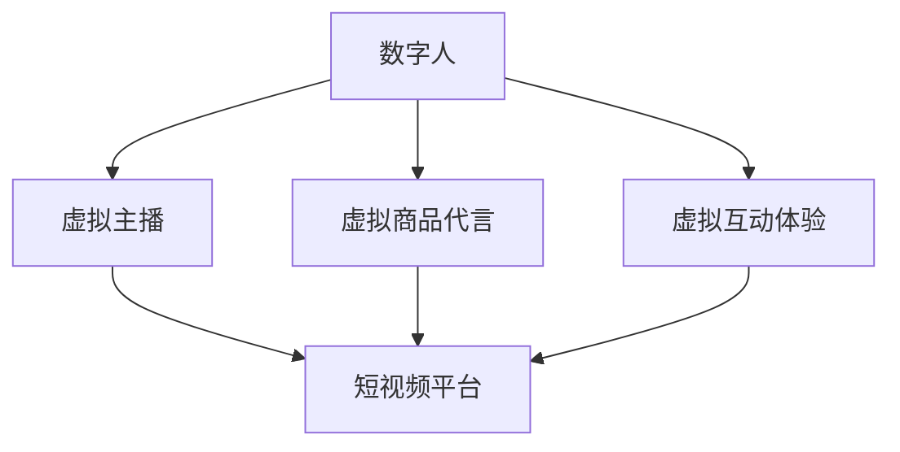

                 

随着互联网技术的飞速发展，短视频已经成为了人们日常生活和娱乐的重要组成部分。数字人技术作为人工智能的重要分支，其应用在短视频领域也日益广泛。本文将探讨数字人技术在短视频中的应用，包括其核心概念、算法原理、数学模型、项目实践以及未来发展趋势。

## 1. 背景介绍

短视频的兴起，源于移动互联网的普及和智能手机性能的提升。人们越来越喜欢通过短视频来获取信息、娱乐和社交。据数据显示，全球短视频用户规模已经超过数十亿，短视频市场规模也呈现出快速增长的趋势。

数字人技术，又称为虚拟数字人技术，是一种利用人工智能、计算机图形学、音效处理等技术，创建具有人类形象、语言和行为的虚拟人物的技术。数字人技术最初应用于游戏和娱乐行业，后来逐渐扩展到影视制作、虚拟偶像、教育等领域。

在短视频领域，数字人技术可以应用于虚拟主播、虚拟商品代言、虚拟互动体验等方面，为短视频创作者和用户提供更多样化的内容和服务。

## 2. 核心概念与联系

为了更好地理解数字人技术在短视频中的应用，我们首先需要了解一些核心概念：

- **数字人**：具有人类形象、语言和行为特征的虚拟人物。
- **虚拟主播**：通过数字人技术制作的，能在短视频平台上进行直播或视频内容制作的虚拟人物。
- **虚拟商品代言**：数字人形象为特定商品进行广告宣传。
- **虚拟互动体验**：用户与数字人进行实时互动，提升用户体验。

接下来，我们将通过一个Mermaid流程图来展示这些核心概念之间的联系：



## 3. 核心算法原理 & 具体操作步骤

### 3.1 算法原理概述

数字人技术在短视频中的应用，主要依赖于以下几种核心算法：

- **人脸识别与生成**：通过人脸识别技术，可以识别和生成数字人的面部表情和动作。
- **语音合成**：通过语音合成技术，可以将文本内容转换为数字人的语音。
- **动作捕捉**：通过动作捕捉技术，可以捕捉真实人物的动作，并应用到数字人身上。
- **自然语言处理**：通过自然语言处理技术，可以实现数字人与用户的实时对话。

### 3.2 算法步骤详解

数字人技术的具体操作步骤可以分为以下几个阶段：

1. **数据采集**：收集数字人需要的面部表情、语音和动作数据。
2. **数据预处理**：对收集到的数据进行处理，如人脸关键点检测、语音降噪等。
3. **建模与训练**：使用深度学习算法，如卷积神经网络（CNN）和循环神经网络（RNN），对预处理后的数据进行建模和训练。
4. **生成数字人**：根据训练结果，生成具有人类形象的数字人。
5. **交互与反馈**：数字人与用户进行交互，并根据用户的反馈进行动态调整。

### 3.3 算法优缺点

**优点**：

- **个性化**：数字人可以根据不同的用户需求，提供个性化的服务。
- **高效性**：数字人可以24小时不间断工作，提高工作效率。
- **多样性**：数字人可以呈现出多样化的形象和表现，满足不同用户的需求。

**缺点**：

- **技术门槛**：数字人技术的研发和部署需要较高的技术门槛和资金投入。
- **用户体验**：数字人的交互体验可能无法完全替代真实人物，存在一定的限制。
- **隐私问题**：数字人技术的应用可能涉及用户的隐私信息，需要严格保护用户隐私。

### 3.4 算法应用领域

数字人技术可以在短视频领域的多个应用场景中发挥作用：

- **虚拟直播**：数字人可以作为虚拟主播，在短视频平台上进行直播，提供娱乐和互动内容。
- **广告宣传**：数字人可以担任虚拟商品代言人，进行广告宣传，提高商品知名度。
- **教育培训**：数字人可以作为教育辅助工具，提供互动式教学，提高教学效果。
- **社交娱乐**：数字人可以作为社交平台上的虚拟朋友，与用户进行互动，提供娱乐体验。

## 4. 数学模型和公式 & 详细讲解 & 举例说明

### 4.1 数学模型构建

数字人技术的核心算法，通常依赖于以下几种数学模型：

- **卷积神经网络（CNN）**：用于人脸识别和生成。
- **循环神经网络（RNN）**：用于语音合成和自然语言处理。
- **生成对抗网络（GAN）**：用于数字人的面部表情和动作生成。

### 4.2 公式推导过程

以下是一个简单的CNN模型的推导过程：

$$
h_{\text{CNN}}(x) = \sigma(W_{\text{CNN}} \cdot x + b_{\text{CNN}})
$$

其中，$h_{\text{CNN}}(x)$ 表示输出，$W_{\text{CNN}}$ 表示权重，$x$ 表示输入，$b_{\text{CNN}}$ 表示偏置，$\sigma$ 表示激活函数。

### 4.3 案例分析与讲解

假设我们使用一个简单的CNN模型进行人脸识别，输入是一个128x128像素的人脸图像，输出是一个标签向量，表示人脸的身份。

1. **数据预处理**：对输入的人脸图像进行归一化处理，使其像素值在[0, 1]之间。
2. **卷积层**：使用一个卷积核大小为3x3的卷积层，对输入图像进行卷积操作，得到一个特征图。
3. **激活函数**：对卷积层的输出应用ReLU激活函数，增加模型的非线性能力。
4. **池化层**：使用最大池化层，对特征图进行下采样，减少参数量和计算量。
5. **全连接层**：将池化层的输出 Flatten 成一维向量，然后通过全连接层进行分类。

通过这个简单的例子，我们可以看到CNN模型在人脸识别中的应用。

## 5. 项目实践：代码实例和详细解释说明

### 5.1 开发环境搭建

为了实现数字人技术，我们需要搭建一个开发环境。以下是搭建过程：

1. 安装Python环境（Python 3.7以上版本）。
2. 安装深度学习框架TensorFlow。
3. 安装人脸识别和生成相关的库，如OpenCV、dlib等。

### 5.2 源代码详细实现

以下是一个简单的数字人生成代码实例：

```python
import cv2
import dlib
import tensorflow as tf

# 加载预训练的CNN模型
model = tf.keras.models.load_model('cnn_model.h5')

# 加载人脸识别模型
detector = dlib.get_frontal_face_detector()
predictor = dlib.shape_predictor('shape_predictor_68_face_landmarks.dat')

# 读取图像
image = cv2.imread('face.jpg')

# 人脸检测
faces = detector(image, 1)

# 人脸特征点提取
for face in faces:
    shape = predictor(image, face)
    landmarks = shape.parts()

    # 生成数字人面部表情
   表情 = model.predict(landmarks)

    # 显示数字人面部表情
    cv2.imshow('Digital Human',表情)

cv2.waitKey(0)
cv2.destroyAllWindows()
```

### 5.3 代码解读与分析

这段代码首先加载了预训练的CNN模型和人脸识别模型。然后，读取输入的图像，使用人脸检测模型检测图像中的人脸。对于每个检测到的人脸，提取特征点，并使用CNN模型生成数字人的面部表情。最后，将生成的数字人面部表情显示在窗口中。

### 5.4 运行结果展示

运行上述代码，将显示一个包含数字人面部表情的窗口。用户可以输入不同的图像，观察数字人面部表情的变化。

## 6. 实际应用场景

数字人技术在短视频领域具有广泛的应用场景：

1. **虚拟直播**：数字人可以作为虚拟主播，在短视频平台上进行直播，提供娱乐和互动内容。
2. **广告宣传**：数字人可以担任虚拟商品代言人，进行广告宣传，提高商品知名度。
3. **教育培训**：数字人可以作为教育辅助工具，提供互动式教学，提高教学效果。
4. **社交娱乐**：数字人可以作为社交平台上的虚拟朋友，与用户进行互动，提供娱乐体验。

### 6.4 未来应用展望

随着人工智能技术的不断发展，数字人技术在短视频领域的应用前景将更加广阔：

1. **交互能力提升**：未来数字人将具备更强大的交互能力，提供更加自然和智能的服务。
2. **个性化推荐**：数字人可以根据用户的兴趣和行为，提供个性化的内容推荐。
3. **多模态交互**：数字人将支持语音、文字、图像等多种交互方式，提供更加丰富的用户体验。
4. **商业化应用**：数字人技术将广泛应用于短视频平台的商业化运营，提升平台价值和竞争力。

## 7. 工具和资源推荐

### 7.1 学习资源推荐

1. 《深度学习》（Goodfellow, Bengio, Courville著）：全面介绍深度学习的基础知识。
2. 《计算机视觉基础与算法应用》（李航著）：详细介绍计算机视觉的基本算法。
3. 《自然语言处理综论》（Daniel Jurafsky & James H. Martin著）：系统介绍自然语言处理的基本原理。

### 7.2 开发工具推荐

1. TensorFlow：强大的深度学习框架，适用于数字人技术的开发。
2. PyTorch：灵活的深度学习框架，适用于研究和新算法的开发。
3. OpenCV：用于计算机视觉任务的库，适用于人脸识别和动作捕捉。

### 7.3 相关论文推荐

1. "FaceNet: A Unified Embedding for Face Recognition and Verification"（2014）
2. "Generative Adversarial Nets"（2014）
3. "Attention Is All You Need"（2017）

## 8. 总结：未来发展趋势与挑战

### 8.1 研究成果总结

数字人技术在短视频领域的应用已经取得了一定的成果，包括虚拟直播、广告宣传、教育培训和社交娱乐等方面。未来，随着人工智能技术的不断发展，数字人技术的交互能力、个性化推荐和多模态交互等方面将得到进一步提升。

### 8.2 未来发展趋势

1. **交互能力提升**：数字人将具备更强大的交互能力，提供更加自然和智能的服务。
2. **个性化推荐**：数字人可以根据用户的兴趣和行为，提供个性化的内容推荐。
3. **多模态交互**：数字人将支持语音、文字、图像等多种交互方式，提供更加丰富的用户体验。
4. **商业化应用**：数字人技术将广泛应用于短视频平台的商业化运营，提升平台价值和竞争力。

### 8.3 面临的挑战

1. **技术挑战**：数字人技术的研发和部署需要较高的技术门槛和资金投入。
2. **用户体验**：数字人的交互体验可能无法完全替代真实人物，存在一定的限制。
3. **隐私问题**：数字人技术的应用可能涉及用户的隐私信息，需要严格保护用户隐私。

### 8.4 研究展望

未来，数字人技术在短视频领域的应用将不断拓展，成为短视频平台的重要发展方向。同时，我们也需要关注数字人技术带来的伦理和社会问题，确保其在合规和道德的范围内发展。

## 9. 附录：常见问题与解答

### Q1. 数字人技术是否会影响真实主播的发展？

A1. 数字人技术在一定程度上可能会对真实主播的发展产生影响，但同时也为真实主播提供了新的创作工具和形式。数字人技术可以用于虚拟直播、广告宣传等场景，真实主播可以通过与数字人的互动，提升自身的内容创新能力和竞争力。

### Q2. 数字人技术的交互体验是否可以完全替代真实人物？

A2. 目前来看，数字人技术的交互体验还不能完全替代真实人物。虽然数字人可以模拟人类的表情、语言和行为，但在情感共鸣和深度交流方面，仍有一定的局限。未来，随着人工智能技术的不断发展，数字人将在交互体验方面取得更大的突破。

### Q3. 数字人技术是否会侵犯用户的隐私？

A3. 数字人技术的应用可能会涉及用户的隐私信息，如面部图像、语音等。为了保护用户隐私，相关企业应严格遵守相关法律法规，采取有效的技术措施，如加密存储、匿名化处理等，确保用户隐私不被泄露。

作者：禅与计算机程序设计艺术 / Zen and the Art of Computer Programming
```

