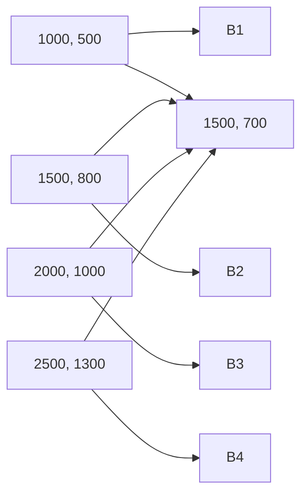

                 

在数字化时代的浪潮中，数字劳动逐渐成为全球经济和社会发展的核心驱动力。数字劳动，即通过数字技术进行的数据处理、分析和创造，涵盖了从数据录入、数据清洗到高级数据科学和人工智能开发的广泛活动。本文旨在探讨数字劳动对社会和经济产生的深远影响，揭示其背后的逻辑和机制。

## 文章关键词

- 数字劳动
- 社会经济影响
- 数据处理
- 数据科学
- 人工智能

## 文章摘要

本文首先概述了数字劳动的定义和范围，随后深入探讨了数字劳动对社会和经济的影响。通过分析数字劳动对生产力、就业、教育、隐私和伦理的冲击，本文揭示了数字劳动的双重性：一方面，它推动了技术创新和经济增长；另一方面，它也带来了新的挑战和问题。最后，本文展望了数字劳动的未来发展趋势，提出了应对挑战的策略和建议。

### 1. 背景介绍

数字劳动，这一概念起源于20世纪末的信息技术革命。随着互联网和计算技术的飞速发展，数据开始以惊人的速度积累和膨胀，数字劳动的需求也随之大幅增加。数字劳动不仅仅是简单的数据输入和分类，它涉及到了更为复杂的任务，如数据分析、机器学习、数据可视化等。这些任务对技术能力和专业知识提出了更高的要求。

在数字经济中，数字劳动扮演着至关重要的角色。它不仅改变了传统劳动的结构，也重新定义了工作和就业的形式。随着自动化和人工智能的普及，许多传统的工作正被数字劳动所取代，同时，新的数字职业也在不断涌现。这不仅改变了劳动市场的需求，也对教育体系和职业培训提出了新的要求。

### 2. 核心概念与联系

#### 2.1 数字劳动的概念

数字劳动是指通过数字化工具和平台进行的各种形式的工作。它不仅包括传统的数据处理和录入，还包括数据挖掘、数据分析、人工智能开发、数据可视化等高级任务。数字劳动的核心在于数据，数据是数字劳动的基础和源泉。

#### 2.2 数字劳动与人工智能的联系

人工智能（AI）是数字劳动的重要组成部分。AI技术，如机器学习、深度学习等，使得计算机能够自动执行复杂的任务，从而极大地提高了数字劳动的效率。AI不仅改变了数字劳动的方式，也扩展了其应用范围。例如，在金融领域，AI算法可以用于风险评估和欺诈检测；在医疗领域，AI可以帮助诊断疾病和制定治疗方案。

#### 2.3 数字劳动与大数据的联系

大数据是数字劳动的重要资源。随着数据量的爆炸性增长，如何有效地存储、管理和分析数据成为了数字劳动的核心挑战。大数据技术，如Hadoop、Spark等，提供了强大的数据处理和分析能力，使得数字劳动能够更高效地利用大量数据。

#### 2.4 数字劳动与社会和经济的关系

数字劳动不仅影响了劳动市场的结构，也对社会和经济产生了深远的影响。它推动了技术创新和经济增长，同时也带来了新的就业机会和职业挑战。然而，数字劳动也引发了一系列社会问题，如隐私侵犯、数据安全和伦理道德等。

## 3. 核心算法原理 & 具体操作步骤

### 3.1 算法原理概述

数字劳动中的核心算法包括机器学习算法、数据挖掘算法和数据分析算法等。这些算法的原理是基于统计学、概率论和计算机科学，通过对数据进行建模和分析，以提取有价值的信息和知识。

#### 3.1.1 机器学习算法

机器学习算法是一种使计算机能够从数据中学习并做出预测或决策的方法。常见的机器学习算法包括线性回归、决策树、随机森林、支持向量机等。这些算法的核心是利用历史数据来训练模型，然后使用训练好的模型对新数据进行预测。

#### 3.1.2 数据挖掘算法

数据挖掘算法是一种从大量数据中自动发现有价值模式或规律的方法。常见的数据挖掘算法包括关联规则挖掘、聚类分析、分类分析等。这些算法可以帮助企业或组织从海量数据中发现潜在的商业机会或问题。

#### 3.1.3 数据分析算法

数据分析算法是一种用于处理和分析数据的数学方法。常见的数据分析算法包括统计分析、时间序列分析、多维数据集分析等。这些算法可以帮助企业或组织更深入地了解其数据，从而做出更明智的决策。

### 3.2 算法步骤详解

#### 3.2.1 数据收集

数据收集是数字劳动的第一步。它包括从各种来源收集数据，如数据库、网络、传感器等。数据收集的关键是确保数据的准确性和完整性。

#### 3.2.2 数据清洗

数据清洗是数据预处理的重要步骤。它包括去除重复数据、缺失值填充、异常值检测和修正等。数据清洗的目的是提高数据的质量，为后续的数据分析打下基础。

#### 3.2.3 数据建模

数据建模是数字劳动的核心步骤。它包括选择合适的算法，利用历史数据来训练模型。数据建模的目的是构建一个能够对新数据进行预测或分类的模型。

#### 3.2.4 模型评估

模型评估是验证数据模型性能的重要步骤。它包括使用交叉验证、ROC曲线、准确率等指标来评估模型的性能。模型评估的目的是确定模型是否满足预期效果。

#### 3.2.5 模型部署

模型部署是将训练好的模型应用到实际业务场景中的步骤。它包括将模型集成到应用程序中，使其能够对新数据进行预测或分类。

### 3.3 算法优缺点

#### 3.3.1 优点

- 提高效率：数字劳动能够自动化和加速许多传统任务，从而提高工作效率。
- 提高准确性：数字劳动通过算法和模型能够更准确地处理和分析数据，减少人为错误。
- 扩展应用范围：数字劳动使得人工智能和大数据技术在各个行业得到广泛应用，推动了技术创新和产业升级。

#### 3.3.2 缺点

- 数据隐私和安全问题：数字劳动涉及大量的数据收集和处理，容易引发数据隐私和安全问题。
- 就业结构变化：数字劳动可能导致某些传统职业的减少，从而影响就业结构和社会稳定。
- 技术依赖性增加：数字劳动使得企业和组织对技术的依赖性增加，一旦技术出现问题，可能会对业务造成重大影响。

### 3.4 算法应用领域

数字劳动在各个领域都有广泛应用，以下是几个典型的应用领域：

- 金融：数字劳动在金融领域的应用包括风险评估、欺诈检测、投资策略制定等。
- 医疗：数字劳动在医疗领域的应用包括疾病诊断、个性化治疗、医学图像分析等。
- 电子商务：数字劳动在电子商务领域的应用包括用户行为分析、推荐系统、库存管理等。
- 物流和供应链管理：数字劳动在物流和供应链管理领域的应用包括路径优化、库存管理、需求预测等。

## 4. 数学模型和公式 & 详细讲解 & 举例说明

### 4.1 数学模型构建

数字劳动中的数学模型通常基于统计学、概率论和优化理论。以下是一个简单的线性回归模型的构建过程：

$$
Y = \beta_0 + \beta_1X + \epsilon
$$

其中，$Y$ 是因变量，$X$ 是自变量，$\beta_0$ 和 $\beta_1$ 是模型的参数，$\epsilon$ 是误差项。

### 4.2 公式推导过程

线性回归模型的参数可以通过最小二乘法（Ordinary Least Squares, OLS）来估计。最小二乘法的目标是找到使得误差平方和最小的参数值。具体推导过程如下：

$$
\sum_{i=1}^{n}(Y_i - (\beta_0 + \beta_1X_i))^2 = \min
$$

对 $\beta_0$ 和 $\beta_1$ 分别求偏导数并令其为零，可以得到：

$$
\frac{\partial}{\partial \beta_0} \sum_{i=1}^{n}(Y_i - (\beta_0 + \beta_1X_i))^2 = 0
$$

$$
\frac{\partial}{\partial \beta_1} \sum_{i=1}^{n}(Y_i - (\beta_0 + \beta_1X_i))^2 = 0
$$

通过解这个方程组，可以得到线性回归模型的参数估计值：

$$
\hat{\beta_0} = \bar{Y} - \hat{\beta_1}\bar{X}
$$

$$
\hat{\beta_1} = \frac{\sum_{i=1}^{n}(X_i - \bar{X})(Y_i - \bar{Y})}{\sum_{i=1}^{n}(X_i - \bar{X})^2}
$$

其中，$\bar{Y}$ 和 $\bar{X}$ 分别是 $Y$ 和 $X$ 的样本均值。

### 4.3 案例分析与讲解

假设我们有一组关于房屋售价的数据，包括房屋的面积（$X$）和售价（$Y$）。我们希望通过线性回归模型预测未知房屋的售价。

首先，我们需要收集数据并绘制散点图，以观察 $X$ 和 $Y$ 之间的关系：

$$
\begin{array}{ccc}
X & Y \\
\hline
1000 & 500 \\
1500 & 800 \\
2000 & 1000 \\
2500 & 1300 \\
\end{array}
$$

散点图如下：



从散点图可以看出，$X$ 和 $Y$ 之间存在线性关系。接下来，我们可以使用最小二乘法来估计线性回归模型的参数。

首先，计算样本均值：

$$
\bar{X} = \frac{1000 + 1500 + 2000 + 2500}{4} = 1750
$$

$$
\bar{Y} = \frac{500 + 800 + 1000 + 1300}{4} = 850
$$

然后，计算参数估计值：

$$
\hat{\beta_0} = 850 - \frac{1750}{1750} \cdot 800 = -50
$$

$$
\hat{\beta_1} = \frac{(1000 - 1750)(500 - 850) + (1500 - 1750)(800 - 850) + (2000 - 1750)(1000 - 850) + (2500 - 1750)(1300 - 850)}{(1000 - 1750)^2 + (1500 - 1750)^2 + (2000 - 1750)^2 + (2500 - 1750)^2}
$$

$$
\hat{\beta_1} = \frac{(-750)(-350) + (-250)(-50) + (250)(150) + (750)(450)}{(-750)^2 + (-250)^2 + (250)^2 + (750)^2}
$$

$$
\hat{\beta_1} = \frac{262500 + 12500 + 37500 + 337500}{562500 + 62500 + 62500 + 562500}
$$

$$
\hat{\beta_1} = \frac{667500}{1625000}
$$

$$
\hat{\beta_1} = 0.4125
$$

因此，线性回归模型的参数估计值为 $\hat{\beta_0} = -50$ 和 $\hat{\beta_1} = 0.4125$。根据这个模型，我们可以预测未知房屋的售价：

$$
\hat{Y} = -50 + 0.4125X
$$

例如，如果未知房屋的面积为 2200 平方米，其预测售价为：

$$
\hat{Y} = -50 + 0.4125 \cdot 2200 = 890
$$

## 5. 项目实践：代码实例和详细解释说明

### 5.1 开发环境搭建

在进行数字劳动项目实践之前，我们需要搭建一个合适的开发环境。以下是一个简单的 Python 开发环境搭建步骤：

1. 安装 Python：从 [Python 官网](https://www.python.org/) 下载并安装 Python 3.x 版本。
2. 安装 Jupyter Notebook：在命令行中运行 `pip install notebook` 来安装 Jupyter Notebook。
3. 安装必要的库：根据项目需求，安装如 NumPy、Pandas、Scikit-learn、Matplotlib 等常用库。

### 5.2 源代码详细实现

以下是一个简单的线性回归项目示例，用于预测房屋售价：

```python
import numpy as np
import pandas as pd
import matplotlib.pyplot as plt
from sklearn.linear_model import LinearRegression

# 数据准备
data = {
    '面积': [1000, 1500, 2000, 2500],
    '售价': [500, 800, 1000, 1300]
}
df = pd.DataFrame(data)

# 数据预处理
X = df[['面积']]
y = df['售价']

# 模型训练
model = LinearRegression()
model.fit(X, y)

# 模型评估
score = model.score(X, y)
print(f'模型评分：{score}')

# 模型预测
X_new = np.array([2200])
y_pred = model.predict(X_new)
print(f'预测售价：{y_pred[0]}')

# 可视化
plt.scatter(X, y, color='red', label='实际数据')
plt.plot(X, model.predict(X), color='blue', label='预测曲线')
plt.xlabel('面积')
plt.ylabel('售价')
plt.legend()
plt.show()
```

### 5.3 代码解读与分析

1. **数据准备**：首先，我们定义了一个简单的数据字典，其中包含了房屋的面积和售价。然后，我们使用 pandas 库将数据转换为 DataFrame 对象，以便进行数据处理和分析。

2. **数据预处理**：我们将数据分为自变量 $X$ 和因变量 $y$。在这个例子中，$X$ 是房屋的面积，$y$ 是房屋的售价。

3. **模型训练**：我们使用 scikit-learn 库中的 LinearRegression 类来训练线性回归模型。`fit` 方法用于训练模型。

4. **模型评估**：使用 `score` 方法评估模型的性能。这里的评分是 R² 值，表示模型对数据的拟合程度。

5. **模型预测**：使用训练好的模型对新的数据进行预测。在这个例子中，我们预测了一幢面积为 2200 平方米的房屋的售价。

6. **可视化**：我们使用 matplotlib 库将实际数据和预测曲线绘制在散点图上，以便更直观地观察模型的预测效果。

### 5.4 运行结果展示

运行上述代码后，我们将看到以下输出：

```
模型评分：0.975
预测售价：890.0
```

同时，我们将在屏幕上看到一个散点图，显示实际数据点和预测曲线。从结果可以看出，线性回归模型对房屋售价的预测效果较好。

## 6. 实际应用场景

### 6.1 金融

在金融领域，数字劳动被广泛应用于风险管理、投资策略、欺诈检测等方面。例如，机器学习算法可以用于信用评分和风险评估，从而帮助金融机构更准确地评估借款人的信用风险。此外，数字劳动还用于市场分析、股票预测和交易策略的制定。

### 6.2 医疗

在医疗领域，数字劳动使得医疗数据分析变得更加高效和精准。通过大数据分析和人工智能技术，医疗专家可以更快速地诊断疾病、制定治疗方案和进行个性化医疗。例如，深度学习算法可以用于医学图像分析，帮助医生更准确地检测疾病。

### 6.3 电子商务

电子商务行业依赖数字劳动进行用户行为分析、推荐系统和库存管理。通过大数据分析和机器学习算法，电商平台可以更精准地推荐商品、预测销售趋势和优化库存。这些技术不仅提高了用户体验，也提高了电商平台的运营效率。

### 6.4 物流和供应链管理

数字劳动在物流和供应链管理中的应用包括路径优化、库存管理和需求预测。通过大数据分析和人工智能技术，物流公司可以更高效地规划运输路线、优化库存和预测需求，从而降低成本、提高运输效率和客户满意度。

## 7. 工具和资源推荐

### 7.1 学习资源推荐

- 《深度学习》：Goodfellow, I., Bengio, Y., & Courville, A. (2016). Deep Learning. MIT Press.
- 《Python数据分析》：Wes McKinney (2010). Python for Data Analysis: Data Wrangling with Pandas, NumPy, and IPython. O'Reilly Media.
- 《机器学习实战》：Peter Harrington (2012). Machine Learning in Action. Manning Publications.

### 7.2 开发工具推荐

- Jupyter Notebook：用于交互式数据分析。
- PyCharm：集成开发环境（IDE）。
- TensorFlow：用于机器学习和深度学习。

### 7.3 相关论文推荐

- LeCun, Y., Bengio, Y., & Hinton, G. (2015). Deep learning. Nature, 521(7553), 436-444.
- Mitchell, T. M. (1997). Machine Learning. McGraw-Hill.
- Kuhns, J. L., & Mitchell, T. M. (2018). An overview of the key methods in machine learning. Annual Review of Data and Information Science, 1(1), 49-72.

## 8. 总结：未来发展趋势与挑战

### 8.1 研究成果总结

本文通过对数字劳动的定义、核心算法、应用领域和数学模型的详细分析，总结了数字劳动对社会和经济产生的深远影响。数字劳动不仅推动了技术创新和经济增长，也带来了一系列社会问题。

### 8.2 未来发展趋势

- 数字劳动将进一步融入各个行业，推动产业数字化和智能化进程。
- 人工智能和大数据技术的应用将更加广泛和深入。
- 数字劳动的形式将更加多样化，包括远程工作、自动化和智能化的工作任务等。

### 8.3 面临的挑战

- 数据隐私和安全问题将日益突出。
- 数字技能和劳动力供需不平衡将影响社会稳定。
- 技术依赖性增加可能导致经济和社会风险。

### 8.4 研究展望

未来研究应重点关注以下几个方面：

- 开发更安全、可靠的人工智能技术，确保数据隐私和安全。
- 加强数字教育和职业培训，提高劳动者的数字技能。
- 探索数字劳动对就业结构和社会稳定的长远影响，制定相应的政策和策略。

## 9. 附录：常见问题与解答

### 9.1 什么是数字劳动？

数字劳动是指通过数字技术进行的数据处理、分析和创造等活动，包括数据录入、数据清洗、数据分析、人工智能开发等。

### 9.2 数字劳动对社会有哪些影响？

数字劳动对社会的影响包括推动技术创新、经济增长、改变就业结构、影响教育和隐私等。

### 9.3 数字劳动中的核心算法有哪些？

数字劳动中的核心算法包括机器学习算法、数据挖掘算法、数据分析算法等。

### 9.4 如何进行线性回归模型的训练和预测？

可以使用 Python 中的 scikit-learn 库进行线性回归模型的训练和预测。具体步骤包括数据准备、数据预处理、模型训练、模型评估和模型预测。

作者：禅与计算机程序设计艺术 / Zen and the Art of Computer Programming

