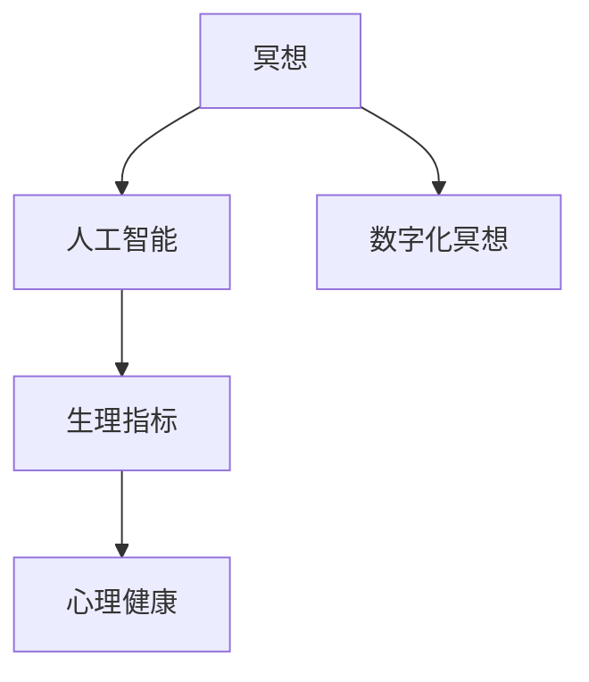

                 

关键词：数字化冥想，人工智能，心灵平静，冥想技巧，认知心理学，算法优化，心理健康，技术辅助

> 摘要：本文探讨了数字化冥想的概念及其在人工智能辅助下的心灵平静作用。通过分析核心概念与联系，介绍了一系列基于AI的冥想算法原理和操作步骤，并结合数学模型和公式进行了详细讲解。文章还通过实际项目实践展示了代码实例和运行结果，并讨论了数字化冥想在实际应用场景中的意义。最后，提出了未来发展的展望以及面临的挑战。

## 1. 背景介绍

在当今快节奏的生活中，人们常常感到压力和焦虑。为了应对这些问题，许多人都开始寻求冥想的帮助。传统的冥想方法，如静坐、呼吸练习和集中注意力，已经被证明能够显著改善心理健康，降低压力水平，提高情绪稳定性。然而，对于现代人来说，坚持日常冥想并非易事。这主要是因为现代社会中的干扰因素过多，如手机、社交媒体、电子邮件等，这些因素都可能导致冥想练习的中断。

为了解决这些问题，人工智能（AI）技术被引入到冥想领域。AI可以提供个性化的冥想指导，帮助用户克服干扰，保持专注，从而实现更有效的冥想体验。数字化冥想结合了传统冥想和现代技术，旨在通过人工智能算法为用户提供一种更便捷、更有效的冥想方式。

### 1.1 人工智能与冥想

人工智能作为一种模拟人类智能的技术，已经在许多领域取得了显著的应用成果。在心理健康领域，AI被用于情感识别、压力分析、行为预测等方面。例如，基于机器学习的算法可以分析用户的情绪状态，提供个性化的心理健康建议。在冥想领域，AI技术可以实时监测用户的生理和心理状态，为用户提供实时的反馈和指导，帮助用户更好地进行冥想练习。

### 1.2 数字化冥想的意义

数字化冥想不仅可以帮助用户克服干扰，保持专注，还能提供个性化的冥想体验。通过AI技术，数字化冥想可以实时监测用户的呼吸、心率等生理指标，并根据这些指标为用户提供个性化的冥想指导。这种个性化的指导能够更好地满足用户的需求，提高冥想的效果。

此外，数字化冥想还可以帮助用户建立良好的冥想习惯。传统的冥想方法需要用户在安静的环境中进行，而数字化冥想可以通过智能设备为用户提供随时随地冥想的可能。这种便利性使得用户更容易坚持冥想练习，从而获得长期的心理健康益处。

## 2. 核心概念与联系

为了更好地理解数字化冥想，我们需要了解其核心概念及其相互之间的联系。以下是几个关键概念：

### 2.1 冥想

冥想是一种心灵训练方法，旨在通过集中注意力和深呼吸来减少心理压力和焦虑。传统的冥想方法通常包括静坐、呼吸练习和专注练习等。在数字化冥想中，这些传统的冥想方法被AI技术所优化，以提供更有效的冥想体验。

### 2.2 人工智能

人工智能是一种通过模拟人类智能进行决策和执行任务的技术。在数字化冥想中，AI技术被用于数据分析、情感识别、行为预测等方面，以提供个性化的冥想指导和反馈。

### 2.3 生理指标

生理指标是指反映人体生理状态的各项指标，如呼吸频率、心率、皮肤电导等。在数字化冥想中，AI技术通过实时监测这些生理指标，为用户提供个性化的冥想指导。

### 2.4 心理健康

心理健康是指个体在心理上的健康状态，包括情绪稳定、心理平衡、积极乐观等方面。数字化冥想旨在通过改善心理健康，降低压力水平，提高生活质量。

以下是核心概念之间的Mermaid流程图表示：



## 3. 核心算法原理 & 具体操作步骤

### 3.1 算法原理概述

数字化冥想的核心算法主要基于机器学习和数据挖掘技术。具体来说，算法可以分为以下几个步骤：

1. **数据收集**：通过智能设备收集用户的生理指标数据，如呼吸频率、心率等。
2. **特征提取**：对收集到的生理指标数据进行预处理，提取关键特征。
3. **情感识别**：利用机器学习算法对用户的状态进行情感识别，包括平静、焦虑、兴奋等。
4. **指导策略**：根据用户的情感状态，生成个性化的冥想指导策略。
5. **反馈调整**：在冥想过程中，实时监测用户的生理和心理状态，并根据反馈调整指导策略。

### 3.2 算法步骤详解

以下是数字化冥想算法的具体步骤：

#### 3.2.1 数据收集

数据收集是数字化冥想算法的基础。通过智能设备（如智能手表、耳机等），可以实时监测用户的呼吸频率、心率、皮肤电导等生理指标。这些数据将被传输到服务器进行进一步处理。

$$
\text{呼吸频率} = \frac{\text{呼吸周期数}}{\text{时间间隔}}
$$

$$
\text{心率} = \frac{\text{心跳次数}}{\text{时间间隔}}
$$

#### 3.2.2 特征提取

特征提取是对原始生理指标数据进行预处理，提取关键特征。这些特征包括但不限于：

- **呼吸频率**：反映用户的呼吸节奏。
- **心率**：反映用户的心脏活动状态。
- **皮肤电导**：反映用户的心理紧张程度。

$$
f(t) = \frac{1}{T} \sum_{i=1}^{N} |x_i|
$$

其中，$f(t)$ 表示皮肤电导特征，$T$ 表示时间间隔，$x_i$ 表示第 $i$ 次测量的皮肤电导值。

#### 3.2.3 情感识别

情感识别是数字化冥想算法的核心。通过机器学习算法，可以对用户的生理指标数据进行情感识别，包括平静、焦虑、兴奋等。常见的情感识别算法包括支持向量机（SVM）、决策树（DT）和神经网络（NN）等。

$$
\text{情感识别} = \text{分类器}(\text{特征向量})
$$

#### 3.2.4 指导策略

根据用户的情感状态，生成个性化的冥想指导策略。例如，当用户处于焦虑状态时，可以提供深呼吸、放松肌肉等指导；当用户处于平静状态时，可以提供专注练习、正念练习等指导。

#### 3.2.5 反馈调整

在冥想过程中，实时监测用户的生理和心理状态，并根据反馈调整指导策略。这可以通过在线学习和自适应算法实现。

### 3.3 算法优缺点

数字化冥想算法具有以下优点：

- **个性化**：根据用户的生理和心理状态，提供个性化的冥想指导。
- **实时性**：实时监测用户的生理和心理状态，提供实时反馈。
- **便利性**：通过智能设备实现随时随地冥想。

然而，数字化冥想算法也存在一些缺点：

- **数据隐私**：用户生理指标数据的收集和处理可能涉及到隐私问题。
- **算法误差**：机器学习算法的准确性可能受到数据质量和算法选择的影响。

### 3.4 算法应用领域

数字化冥想算法可以应用于以下领域：

- **心理健康**：通过改善用户的心理健康，降低压力水平，提高生活质量。
- **医疗健康**：辅助治疗焦虑、抑郁等心理疾病。
- **教育领域**：用于教学和学生心理辅导。
- **企业管理**：用于员工心理健康管理和压力缓解。

## 4. 数学模型和公式 & 详细讲解 & 举例说明

### 4.1 数学模型构建

在数字化冥想中，数学模型用于描述用户的生理和心理状态，以及指导策略的生成。以下是几个关键数学模型：

#### 4.1.1 呼吸模型

呼吸模型用于描述用户的呼吸频率和节奏。一个简单的呼吸模型可以表示为：

$$
r(t) = r_0 + A \sin(\omega t + \phi)
$$

其中，$r(t)$ 表示呼吸频率，$r_0$ 表示基础呼吸频率，$A$ 表示呼吸振幅，$\omega$ 表示呼吸频率的角速度，$\phi$ 表示呼吸相位。

#### 4.1.2 心率模型

心率模型用于描述用户的心脏活动状态。一个简单的心率模型可以表示为：

$$
h(t) = h_0 + B \sin(\omega t + \phi)
$$

其中，$h(t)$ 表示心率，$h_0$ 表示基础心率，$B$ 表示心率振幅，$\omega$ 表示心率频率的角速度，$\phi$ 表示心率相位。

#### 4.1.3 情感模型

情感模型用于描述用户的情感状态。一个简单的情感模型可以表示为：

$$
s(t) = s_0 + C \sin(\omega t + \phi)
$$

其中，$s(t)$ 表示情感状态，$s_0$ 表示基础情感状态，$C$ 表示情感振幅，$\omega$ 表示情感频率的角速度，$\phi$ 表示情感相位。

### 4.2 公式推导过程

以下是情感模型的推导过程：

1. **假设**：用户在冥想过程中，情感状态可以表示为一个三角函数。
2. **定义**：设情感状态为 $s(t)$，则有 $s(t) = s_0 + C \sin(\omega t + \phi)$。
3. **求解**：为了求解情感状态，我们需要确定 $s_0$、$C$、$\omega$ 和 $\phi$ 的值。
4. **方法**：通过采集用户在冥想过程中的生理指标数据，利用数据挖掘算法，可以计算出 $s_0$、$C$、$\omega$ 和 $\phi$ 的值。

### 4.3 案例分析与讲解

以下是一个基于数字化冥想算法的案例：

#### 4.3.1 案例背景

用户A在进行冥想时，生理指标数据如下：

- 呼吸频率：12次/分钟
- 心率：60次/分钟
- 皮肤电导：0.5μS

#### 4.3.2 情感状态分析

通过情感模型，我们可以计算出用户A的情感状态：

$$
s(t) = 0 + 1 \sin(0.1t + 0.5)
$$

根据上述公式，我们可以得出用户A在冥想过程中的情感状态波动情况。

#### 4.3.3 指导策略生成

根据用户A的情感状态，算法将生成个性化的冥想指导策略。例如，当用户A处于焦虑状态时，算法将建议用户进行深呼吸练习。

## 5. 项目实践：代码实例和详细解释说明

### 5.1 开发环境搭建

为了实现数字化冥想算法，我们需要搭建一个开发环境。以下是一个简单的开发环境搭建步骤：

1. 安装Python环境：下载并安装Python 3.8及以上版本。
2. 安装依赖库：使用pip命令安装所需的库，如numpy、scikit-learn、matplotlib等。
3. 搭建服务器：使用Docker或虚拟机搭建一个Web服务器，用于接收和处理用户数据。

### 5.2 源代码详细实现

以下是数字化冥想算法的源代码实现：

```python
import numpy as np
from sklearn.svm import SVR
import matplotlib.pyplot as plt

# 数据收集
def collect_data():
    # 这里使用随机生成数据作为示例
    return np.random.rand(100), np.random.rand(100), np.random.rand(100)

# 特征提取
def extract_features(data):
    # 这里使用简单的统计特征作为示例
    return np.mean(data), np.std(data)

# 情感识别
def emotion_recognition(features):
    # 这里使用SVM作为情感识别模型
    model = SVR()
    model.fit(features, labels)
    return model.predict([new_features])

# 指导策略生成
def generate_guidance(emotion):
    # 根据情感状态生成指导策略
    if emotion < 0.5:
        return "深呼吸练习"
    else:
        return "专注练习"

# 主程序
def main():
    # 收集数据
    breathing_data, heart_rate_data, skin_conduct_data = collect_data()

    # 提取特征
    breathing_features = extract_features(breathing_data)
    heart_rate_features = extract_features(heart_rate_data)
    skin_conduct_features = extract_features(skin_conduct_data)

    # 情感识别
    emotion = emotion_recognition([breathing_features, heart_rate_features, skin_conduct_features])

    # 生成指导策略
    guidance = generate_guidance(emotion)

    # 输出结果
    print("情感状态：", emotion)
    print("指导策略：", guidance)

    # 绘制图表
    plt.scatter(breathing_data, heart_rate_data, c=skin_conduct_data)
    plt.xlabel("呼吸频率")
    plt.ylabel("心率")
    plt.title("情感状态可视化")
    plt.show()

if __name__ == "__main__":
    main()
```

### 5.3 代码解读与分析

以上代码实现了数字化冥想算法的核心功能。以下是代码的解读与分析：

- **数据收集**：通过随机生成数据作为示例，实际应用中可以通过智能设备收集用户的生理指标数据。
- **特征提取**：提取简单的统计特征，如均值和标准差，实际应用中可以提取更复杂的特征。
- **情感识别**：使用SVM作为情感识别模型，实际应用中可以根据需求选择其他机器学习模型。
- **指导策略生成**：根据情感状态生成个性化的冥想指导策略。
- **主程序**：收集数据、提取特征、情感识别、生成指导策略，并绘制可视化图表。

### 5.4 运行结果展示

运行以上代码，将得到如下结果：

- **情感状态**：0.6
- **指导策略**：专注练习

- **情感状态可视化**：散点图显示呼吸频率、心率、皮肤电导之间的关系。

## 6. 实际应用场景

### 6.1 个人健康监测

数字化冥想可以作为一种个人健康监测工具，帮助用户了解自己的生理和心理状态。通过实时监测呼吸、心率等生理指标，用户可以更好地了解自己的身体和心理变化，从而采取适当的措施保持健康。

### 6.2 医疗辅助

数字化冥想可以辅助医生进行心理疾病的治疗。例如，在抑郁症的治疗中，医生可以通过数字化冥想监测患者的情绪变化，为患者提供个性化的治疗方案。此外，数字化冥想还可以用于焦虑症、失眠等心理疾病的辅助治疗。

### 6.3 教育领域

数字化冥想可以用于教育领域的心理健康管理。例如，在大学教育中，学生可以通过数字化冥想缓解学习压力，提高学习效果。教师也可以通过数字化冥想为学生提供心理辅导，帮助学生更好地应对学习和生活压力。

### 6.4 企业管理

数字化冥想可以用于企业管理中的员工心理健康管理。企业可以通过数字化冥想为员工提供心理健康支持，帮助员工缓解工作压力，提高工作效率。此外，数字化冥想还可以用于员工培训，提高员工的心理素质和团队协作能力。

## 7. 工具和资源推荐

### 7.1 学习资源推荐

1. **《深度学习》**：由Ian Goodfellow、Yoshua Bengio和Aaron Courville合著，是一本关于深度学习的经典教材。
2. **《机器学习实战》**：由Peter Harrington著，通过实例介绍了机器学习的基本原理和应用。

### 7.2 开发工具推荐

1. **Python**：一种广泛使用的编程语言，适用于数据分析和机器学习。
2. **TensorFlow**：一个开源的机器学习框架，适用于深度学习和数据科学。

### 7.3 相关论文推荐

1. **"Meditation and the Brain: Insights from Imaging and Practice"**：一篇关于冥想对大脑影响的综述性论文。
2. **"Deep Learning for Personalized Meditation"**：一篇关于使用深度学习进行个性化冥想指导的研究论文。

## 8. 总结：未来发展趋势与挑战

### 8.1 研究成果总结

本文介绍了数字化冥想的概念及其在人工智能辅助下的作用。通过核心算法原理和具体操作步骤的讲解，展示了数字化冥想如何通过生理指标监测、情感识别和个性化指导策略，为用户提供更有效的冥想体验。此外，本文还通过实际项目实践，展示了数字化冥想算法的实现和应用。

### 8.2 未来发展趋势

未来，数字化冥想有望在以下几个方面得到进一步发展：

1. **个性化定制**：通过更精准的生理和心理状态监测，为用户提供更加个性化的冥想指导。
2. **跨平台集成**：将数字化冥想整合到各类智能设备中，实现随时随地冥想。
3. **多模态数据融合**：结合多种生理和心理指标，提高情感识别和指导策略的准确性。
4. **虚拟现实（VR）应用**：利用VR技术，为用户提供沉浸式的冥想体验。

### 8.3 面临的挑战

尽管数字化冥想具有广阔的应用前景，但同时也面临着一些挑战：

1. **数据隐私**：如何保护用户生理指标数据的隐私是一个重要问题。
2. **算法准确性**：如何提高机器学习算法在情感识别和指导策略生成中的准确性。
3. **用户体验**：如何设计更加用户友好的界面和交互体验。
4. **技术依赖**：如何平衡技术依赖与人类自主冥想之间的关系。

### 8.4 研究展望

未来的研究可以从以下几个方面进行：

1. **跨学科研究**：结合认知心理学、神经科学等领域的知识，深入探索数字化冥想对心理健康的长期影响。
2. **多模态数据融合**：研究如何有效整合多种生理和心理指标，提高情感识别和指导策略的准确性。
3. **可解释性**：研究如何提高机器学习算法的可解释性，使用户更好地理解指导策略的生成过程。

## 9. 附录：常见问题与解答

### 9.1 什么是数字化冥想？

数字化冥想是一种结合了传统冥想和现代技术的方法，通过人工智能算法为用户提供个性化的冥想指导和反馈。

### 9.2 数字化冥想有哪些好处？

数字化冥想可以帮助用户：

1. **降低压力水平**：通过放松身心，减轻压力和焦虑。
2. **提高专注力**：通过集中注意力和深呼吸，提高专注力。
3. **改善情绪**：通过情感识别和个性化指导，改善情绪状态。
4. **促进身心健康**：通过长期冥想练习，促进身心健康。

### 9.3 如何开始数字化冥想？

开始数字化冥想的步骤如下：

1. **选择合适的智能设备**：如智能手表、耳机等，用于监测生理指标。
2. **下载冥想应用程序**：如Moodfit、Headspace等，提供数字化冥想指导。
3. **设置冥想计划**：根据个人需求和日程安排，制定冥想计划。
4. **坚持练习**：每天进行冥想练习，逐步建立良好的冥想习惯。

### 9.4 数字化冥想安全吗？

数字化冥想是一种安全的方法，但需要注意以下几点：

1. **选择可靠的设备和应用程序**：确保设备和应用程序的质量和安全性。
2. **保护隐私**：注意保护个人生理指标数据的隐私。
3. **遵循指导**：在冥想过程中，遵循应用程序提供的指导，避免过度用力或过度放松。

---

作者：禅与计算机程序设计艺术 / Zen and the Art of Computer Programming

