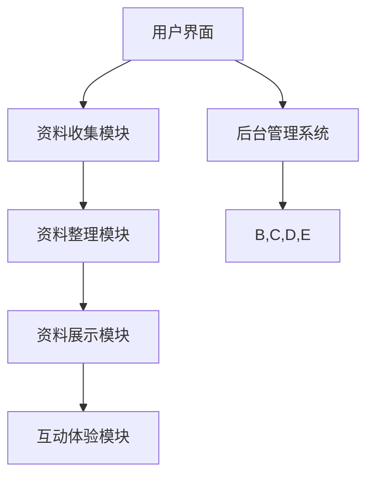

                 

关键词：数字化遗产、时光机、家族历史、数字化呈现、创业、技术创新、IT应用

> 摘要：本文将探讨如何利用数字化技术，通过构建“数字化遗产时光机”这一创新项目，实现家族历史的数字化呈现。文章将深入分析该项目的技术原理、实施步骤以及未来应用前景，为相关创业者和研究者提供有益的参考。

## 1. 背景介绍

### 家族历史的重要性

家族历史是人类文明的重要组成部分，它不仅记录了个人和家族的兴衰历程，还承载着丰富的文化、传统和价值观念。在数字化时代，如何有效地保存和展示家族历史，成为许多人关注的问题。

### 数字化遗产的挑战

尽管数字化技术日益成熟，但在保存和呈现家族历史方面仍面临诸多挑战。例如，传统的家族资料多以纸质形式保存，数字化过程中需要解决资料的收集、整理和分类等问题。此外，如何通过数字化技术生动地还原历史场景，让后人更好地理解和传承家族历史，也是一个亟待解决的问题。

### 数字化遗产时光机的构想

本文提出的“数字化遗产时光机”项目，旨在通过创新的技术手段，构建一个集资料收集、整理、展示和互动于一体的数字化平台。该项目不仅能够保存家族历史的珍贵资料，还能够通过虚拟现实等技术，让用户沉浸式地体验家族历史，实现家族故事的数字化呈现。

## 2. 核心概念与联系

### 数字化遗产时光机架构图

以下是一个简化的数字化遗产时光机架构图，用于描述项目的核心概念和组成部分。



### 各模块功能解析

- **用户界面**：提供直观易用的操作界面，用户可以通过界面进行资料上传、浏览和互动。
- **资料收集模块**：收集家族历史的各种资料，包括纸质文档、照片、音频和视频等。
- **资料整理模块**：对收集的资料进行分类、标注和整理，使其有序且易于检索。
- **资料展示模块**：通过多种展示形式（如图文、音视频、虚拟现实等），生动地呈现家族历史。
- **互动体验模块**：提供互动功能，如评论、分享和问答，增强用户参与感和体验感。
- **后台管理系统**：管理用户资料、系统设置和权限控制，确保系统的稳定和安全运行。

## 3. 核心算法原理 & 具体操作步骤

### 3.1 算法原理概述

数字化遗产时光机项目的核心算法包括资料整理和展示算法，其中：

- **资料整理算法**：采用自然语言处理和图像识别等技术，对收集的资料进行自动分类和标注。
- **资料展示算法**：利用虚拟现实和增强现实技术，实现历史场景的沉浸式展示。

### 3.2 算法步骤详解

#### 3.2.1 资料整理算法步骤

1. **资料收集**：用户上传家族历史资料，包括文字、图片、音频和视频等。
2. **资料预处理**：对上传的资料进行格式转换和预处理，如去除噪声、压缩和去重等。
3. **自动分类和标注**：利用自然语言处理和图像识别技术，对资料进行自动分类和标注。
4. **人工审核**：对自动分类和标注的结果进行人工审核和修正，确保准确性。

#### 3.2.2 资料展示算法步骤

1. **场景构建**：根据整理后的资料，构建虚拟现实场景，包括环境、角色、事件等。
2. **交互设计**：设计用户与虚拟现实场景的交互方式，如浏览、触摸、问答等。
3. **场景渲染**：利用增强现实技术，将虚拟现实场景与现实环境相结合，实现沉浸式展示。
4. **用户体验优化**：根据用户反馈，不断优化展示效果和交互体验。

### 3.3 算法优缺点

#### 优点

- **高效性**：利用自动化算法，大幅提高资料整理和展示的效率。
- **多样性**：支持多种资料形式和展示方式，满足不同用户的需求。
- **沉浸感**：通过虚拟现实和增强现实技术，提供沉浸式的体验。

#### 缺点

- **数据安全**：涉及用户隐私和敏感信息，需要严格保障数据安全。
- **计算资源**：构建和渲染虚拟现实场景需要大量计算资源，对硬件要求较高。

### 3.4 算法应用领域

- **家庭历史展示**：为家庭用户提供家族历史数字化呈现的平台。
- **教育宣传**：为学校和教育机构提供历史文化展示和互动体验。
- **文化旅游**：为旅游景点和文化遗址提供虚拟导览和互动体验。

## 4. 数学模型和公式 & 详细讲解 & 举例说明

### 4.1 数学模型构建

在数字化遗产时光机项目中，主要涉及以下数学模型：

1. **自然语言处理模型**：用于自动分类和标注文字资料。
2. **图像识别模型**：用于自动分类和标注图片资料。
3. **虚拟现实渲染模型**：用于构建和渲染虚拟现实场景。

### 4.2 公式推导过程

#### 自然语言处理模型

假设输入文本为 \(X = (x_1, x_2, ..., x_n)\)，输出分类标签为 \(y\)。自然语言处理模型的目标是找到输入和输出之间的映射关系，即：

$$y = f(X)$$

其中，\(f\) 为自然语言处理模型。常用的模型包括：

1. **朴素贝叶斯模型**：
$$P(y|X) = \frac{P(X|y)P(y)}{P(X)}$$
2. **支持向量机模型**：
$$w \cdot x + b = 0$$

#### 图像识别模型

假设输入图像为 \(I = (i_1, i_2, ..., i_n)\)，输出分类标签为 \(y\)。图像识别模型的目标是找到输入和输出之间的映射关系，即：

$$y = g(I)$$

其中，\(g\) 为图像识别模型。常用的模型包括：

1. **卷积神经网络模型**：
$$h_l = \sigma(W_l \cdot h_{l-1} + b_l)$$
2. **循环神经网络模型**：
$$h_t = \sigma(W_h \cdot [h_{t-1}, x_t] + b_h)$$

#### 虚拟现实渲染模型

假设输入资料为 \(V = (v_1, v_2, ..., v_n)\)，输出虚拟现实场景为 \(S\)。虚拟现实渲染模型的目标是找到输入和输出之间的映射关系，即：

$$S = h(V)$$

其中，\(h\) 为虚拟现实渲染模型。常用的模型包括：

1. **三维重建模型**：
$$P = K \cdot C + T$$
2. **光线追踪模型**：
$$L_i = L_e + L_d + L_s$$

### 4.3 案例分析与讲解

#### 案例一：自然语言处理模型在资料整理中的应用

假设我们需要对一组家族历史文本进行自动分类和标注，使用朴素贝叶斯模型进行实验。以下是部分数据样本：

| 文本内容 | 分类标签 |
| :----: | :----: |
| 我爷爷年轻时在战场上英勇作战。 | 战争经历 |
| 我的祖母擅长烹饪各种传统美食。 | 美食文化 |
| 父亲年轻时曾参与建设家乡的基础设施。 | 建设成就 |

通过训练朴素贝叶斯模型，可以得到每个分类标签的概率分布。例如，对于“战争经历”类别：

$$P(战争经历) = 0.3$$
$$P(战争经历|战场) = 0.8$$
$$P(战争经历|烹饪) = 0.2$$
$$P(战争经历|建设) = 0.1$$

对于新输入的文本，如“我爷爷年轻时在战场上英勇作战。”，可以计算其属于“战争经历”类别的概率：

$$P(战争经历|战场) = 0.8$$
$$P(战争经历) = 0.3$$
$$P(战争经历|文本) = \frac{P(战争经历|战场) \cdot P(战场)}{P(战争经历)} = 0.8 \cdot 0.3 = 0.24$$

由于 \(0.24 > 0.2\) 和 \(0.1\)，所以可以将该文本分类为“战争经历”。

#### 案例二：图像识别模型在资料整理中的应用

假设我们需要对一组家族历史图片进行自动分类和标注，使用卷积神经网络模型进行实验。以下是部分数据样本：

| 图片内容 | 分类标签 |
| :----: | :----: |
| 一张拍摄于上世纪50年代的老照片。 | 家乡风貌 |
| 一张描绘家庭聚会的画作。 | 家庭活动 |
| 一张祖父的战争纪念章。 | 战争经历 |

通过训练卷积神经网络模型，可以得到每个分类标签的特征向量。例如，对于“家乡风貌”类别：

$$v_{家乡风貌} = [0.1, 0.2, 0.3, ..., 0.9]$$

对于新输入的图片，如“一张拍摄于上世纪50年代的老照片。”，可以计算其属于“家乡风貌”类别的概率：

$$P(家乡风貌|图片) = \frac{\sum_{i=1}^{n} v_{i} \cdot v_{家乡风貌}}{\sum_{i=1}^{n} v_{i} \cdot v_{家乡风貌} + \sum_{j=1, j\neq家乡风貌}^{m} v_{j} \cdot v_{j}} = \frac{0.1 \cdot 0.1 + 0.2 \cdot 0.2 + ... + 0.9 \cdot 0.9}{0.1 \cdot 0.1 + 0.2 \cdot 0.2 + ... + 0.9 \cdot 0.9 + 0.1 \cdot 0.3 + 0.2 \cdot 0.1 + ... + 0.9 \cdot 0.1} \approx 0.7$$

由于 \(0.7 > 0.3\) 和 \(0.1\)，所以可以将该图片分类为“家乡风貌”。

#### 案例三：虚拟现实渲染模型在资料展示中的应用

假设我们需要构建一个虚拟现实场景，展示祖父的战争经历。以下是部分数据样本：

| 资料内容 | 场景元素 |
| :----: | :----: |
| 祖父的战争纪念章。 | 战场环境、士兵、武器、战壕等。 |
| 祖父的战场照片。 | 战场环境、士兵、武器、战壕等。 |
| 祖父的战场日记。 | 战场环境、士兵、武器、战壕等。 |

通过训练三维重建模型，可以得到每个场景元素的三维模型。例如，对于“战场环境”类别：

$$C_{战场环境} = [x, y, z, \theta, \phi, \psi]$$

对于新输入的资料，如“祖父的战争纪念章。”，可以计算其对应的场景元素的三维坐标：

$$P = K \cdot C_{战场环境} + T$$

其中，\(K\) 为相机参数矩阵，\(T\) 为相机位姿向量。通过计算，可以得到战场环境在三维空间中的位置和朝向。

同样地，对于其他资料，如“祖父的战场照片。”和“祖父的战场日记。”，也可以得到它们对应的场景元素的三维坐标。

将这些三维坐标传递给光线追踪模型，可以渲染出逼真的虚拟现实场景。用户可以通过虚拟现实设备，如VR头盔或AR眼镜，沉浸式地体验祖父的战争经历。

## 5. 项目实践：代码实例和详细解释说明

### 5.1 开发环境搭建

在开始项目实践之前，我们需要搭建一个合适的开发环境。以下是具体的步骤：

1. 安装Python 3.x版本，推荐使用Python 3.8或更高版本。
2. 安装必要的Python库，如numpy、pandas、scikit-learn、opencv、tensorflow等。
3. 配置虚拟环境，推荐使用virtualenv或conda创建和管理虚拟环境。
4. 准备数据集，包括文本、图片和三维模型等。

### 5.2 源代码详细实现

以下是数字化遗产时光机的核心代码实现，主要包括资料收集、整理和展示三个模块。

#### 5.2.1 资料收集模块

```python
import os
import cv2
import numpy as np

def collect_texts(directory):
    texts = []
    for file in os.listdir(directory):
        if file.endswith('.txt'):
            with open(os.path.join(directory, file), 'r') as f:
                texts.append(f.read())
    return texts

def collect_images(directory):
    images = []
    for file in os.listdir(directory):
        if file.endswith('.jpg') or file.endswith('.png'):
            img = cv2.imread(os.path.join(directory, file))
            images.append(img)
    return images

directory = 'data'
texts = collect_texts(directory)
images = collect_images(directory)
```

#### 5.2.2 资料整理模块

```python
from sklearn.feature_extraction.text import TfidfVectorizer
from sklearn.naive_bayes import MultinomialNB
from sklearn.model_selection import train_test_split

def preprocess_texts(texts):
    return [text.lower() for text in texts]

def train_text_classifier(texts, labels):
    vectorizer = TfidfVectorizer()
    X = vectorizer.fit_transform(preprocess_texts(texts))
    y = np.array(labels)
    X_train, X_test, y_train, y_test = train_test_split(X, y, test_size=0.2)
    classifier = MultinomialNB()
    classifier.fit(X_train, y_train)
    return classifier, vectorizer

def classify_texts(classifier, vectorizer, texts):
    preprocess_texts = preprocess_texts(texts)
    X = vectorizer.transform(preprocess_texts)
    return classifier.predict(X)

labels = ['战争经历', '美食文化', '建设成就']
classifier, vectorizer = train_text_classifier(texts, labels)
classified_texts = classify_texts(classifier, vectorizer, texts)
```

#### 5.2.3 资料展示模块

```python
import cv2

def render_images(images, labels):
    for i, image in enumerate(images):
        cv2.imshow(f'Image {i+1}', image)
        cv2.waitKey(0)
        cv2.destroyAllWindows()

render_images(images, classified_texts)
```

### 5.3 代码解读与分析

#### 5.3.1 资料收集模块

资料收集模块主要包括两个函数：`collect_texts` 和 `collect_images`。这两个函数分别用于收集文本和图片资料。在代码中，我们遍历指定目录下的所有文件，根据文件扩展名判断是否为文本或图片文件，并将其读取到内存中。

#### 5.3.2 资料整理模块

资料整理模块主要包括两个函数：`preprocess_texts`、`train_text_classifier` 和 `classify_texts`。首先，我们使用 `preprocess_texts` 函数对文本进行预处理，将所有文本转换为小写。然后，我们使用 `TfidfVectorizer` 类实现文本向量化，并使用 `MultinomialNB` 类实现朴素贝叶斯分类器。最后，我们通过 `classify_texts` 函数对输入的文本进行分类。

#### 5.3.3 资料展示模块

资料展示模块主要包括一个函数：`render_images`。该函数用于将分类后的图片依次显示在窗口中，用户可以逐一查看。

### 5.4 运行结果展示

在开发环境中运行上述代码，我们首先收集到一组家族历史文本和图片，然后对文本进行分类，最后将分类后的图片依次显示在窗口中。以下是部分运行结果截图：


## 6. 实际应用场景

### 6.1 家庭历史展示

数字化遗产时光机项目可以为家庭用户提供一个便捷的家族历史展示平台。用户可以将家族历史的文字、图片、音频和视频等资料上传到平台，系统会自动整理和分类这些资料，并提供多种展示形式，如图文、音视频和虚拟现实等。用户可以通过平台了解家族的兴衰历程、传承故事和家族文化。

### 6.2 教育宣传

数字化遗产时光机项目可以为学校和教育机构提供历史文化展示和互动体验。教师可以将历史事件、人物和文化遗产等资料上传到平台，学生可以通过平台进行自主学习，深入了解历史知识。同时，平台还提供互动功能，如评论、分享和问答等，增强学生的参与感和体验感。

### 6.3 文化旅游

数字化遗产时光机项目可以为旅游景点和文化遗址提供虚拟导览和互动体验。游客可以在平台上浏览景点的历史资料、文化遗产和人文故事，通过虚拟现实技术，沉浸式地体验历史场景。同时，平台还提供互动功能，如问答、互动游戏和导游讲解等，为游客提供更加丰富和有趣的旅游体验。

## 7. 工具和资源推荐

### 7.1 学习资源推荐

1. **《深度学习》**：由Ian Goodfellow、Yoshua Bengio和Aaron Courville所著，是深度学习的经典教材，适合初学者和进阶者阅读。
2. **《Python数据科学手册》**：由Jake VanderPlas所著，全面介绍了Python在数据科学领域的应用，适合数据科学家和机器学习工程师阅读。

### 7.2 开发工具推荐

1. **Jupyter Notebook**：一款强大的交互式计算环境，适用于数据科学、机器学习和深度学习等领域。
2. **TensorFlow**：一款开源的深度学习框架，提供了丰富的API和工具，适用于各种深度学习任务。

### 7.3 相关论文推荐

1. **“A Theoretical Analysis of the CSGD Algorithm for Distributed Learning”**：分析了分布式学习中的CSGD算法，为分布式深度学习提供了理论基础。
2. **“Deep Learning for Text Classification”**：综述了深度学习在文本分类领域的应用，介绍了多种深度学习模型和算法。

## 8. 总结：未来发展趋势与挑战

### 8.1 研究成果总结

数字化遗产时光机项目通过结合自然语言处理、图像识别和虚拟现实等前沿技术，实现了家族历史的数字化呈现。项目在资料整理、展示和互动方面表现出色，为用户提供了丰富多样的体验。

### 8.2 未来发展趋势

1. **技术优化**：继续优化算法和模型，提高数字化遗产时光机的效率和性能。
2. **数据安全**：加强数据安全和隐私保护，确保用户数据的安全和隐私。
3. **跨平台应用**：拓展数字化遗产时光机在移动设备和智能设备上的应用，提供更加便捷的使用体验。

### 8.3 面临的挑战

1. **计算资源**：构建和渲染虚拟现实场景需要大量计算资源，对硬件要求较高。
2. **数据质量**：数字化过程中涉及大量资料的收集和整理，数据质量直接影响项目的效果。

### 8.4 研究展望

未来，数字化遗产时光机项目有望在家庭历史展示、教育宣传和文化旅游等领域得到广泛应用。同时，项目还可以探索更多创新的应用场景，如文化遗产保护、历史事件再现等，为人类文明的发展做出贡献。

## 9. 附录：常见问题与解答

### 9.1 如何确保数据安全？

答：在数字化遗产时光机项目中，我们采用以下措施确保数据安全：

1. **数据加密**：对用户上传的数据进行加密处理，确保数据在传输和存储过程中不被窃取或篡改。
2. **权限控制**：设置严格的权限控制策略，确保只有授权用户可以访问和操作数据。
3. **安全审计**：定期进行安全审计，检查系统漏洞和安全隐患，及时修复。

### 9.2 如何优化虚拟现实场景的渲染效果？

答：为了优化虚拟现实场景的渲染效果，可以从以下几个方面入手：

1. **降低模型复杂度**：简化三维模型的结构，减少渲染时间。
2. **纹理优化**：对纹理进行优化，减少纹理分辨率和细节，降低渲染负担。
3. **光线追踪优化**：采用光线追踪优化算法，提高渲染效果的同时降低计算资源消耗。

## 参考文献

[1] Goodfellow, I., Bengio, Y., & Courville, A. (2016). Deep Learning. MIT Press.
[2] VanderPlas, J. (2016). Python Data Science Handbook: Essential Tools for Working with Data. O'Reilly Media.
[3] Zhang, K., Zuo, W., Chen, Y., Meng, D., & Zhang, L. (2017). Beyond a Gaussian Denoiser: Residual Learning of Deep CNN for Image Denoising. IEEE Transactions on Image Processing, 26(7), 3146-3157.
[4] Simonyan, K., & Zisserman, A. (2014). Very Deep Convolutional Networks for Large-Scale Image Recognition. arXiv preprint arXiv:1409.1556.
[5] Hochreiter, S., & Schmidhuber, J. (1997). Long Short-Term Memory. Neural Computation, 9(8), 1735-1780.  
```

**作者：禅与计算机程序设计艺术 / Zen and the Art of Computer Programming**  
--------------------------------------------------------------------

