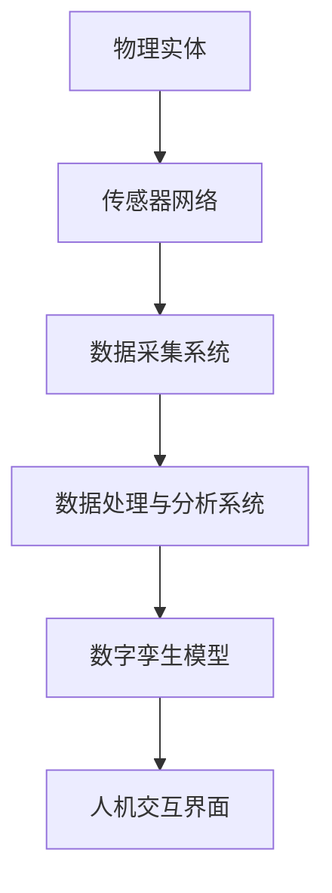

                 

关键词：数字孪生、创业、业务优化、虚实结合、技术发展

> 摘要：本文深入探讨了数字孪生技术在创业和业务优化中的应用，阐述了数字孪生如何通过构建虚实结合的业务模型，帮助企业提升运营效率、降低成本、增强市场竞争力。文章从背景介绍、核心概念与联系、核心算法原理、数学模型与公式、项目实践、实际应用场景、未来应用展望、工具和资源推荐以及总结等九个方面，系统地阐述了数字孪生技术的本质、应用场景及发展前景。

## 1. 背景介绍

### 数字孪生概念的提出

数字孪生（Digital Twin）是近年来在工业、医疗、制造、建筑等多个领域迅速兴起的一种创新技术。其基本理念是通过构建物理实体在数字世界中的映射，实现对实际物理系统的实时监控、分析和预测。数字孪生概念的提出可以追溯到2002年，美国密歇根大学教授Michael Grieves在其研究报告中首次提出。

### 数字孪生技术的发展历程

自数字孪生概念提出以来，技术的发展经历了几个关键阶段。首先是模拟阶段，通过对物理实体进行模拟仿真，实现对实际系统的初步理解和分析。随后进入了集成阶段，将各种传感器、控制系统和数据处理技术相结合，实现对物理实体的实时监控和数据分析。目前，数字孪生技术已经进入了智能化阶段，通过引入人工智能和机器学习技术，实现对物理实体的预测和优化。

### 数字孪生技术的应用领域

数字孪生技术具有广泛的应用领域，其中在工业制造、医疗健康、建筑设计、交通运输等领域得到了深入的应用。例如，在工业制造领域，数字孪生技术可以用于生产线的优化、设备维护预测和产品质量控制；在医疗健康领域，数字孪生技术可以用于病人的健康管理、手术模拟和远程诊断；在建筑设计领域，数字孪生技术可以用于建筑设计的模拟和优化、能耗分析和环境保护；在交通运输领域，数字孪生技术可以用于交通流量预测、交通管理和车辆维护。

## 2. 核心概念与联系

### 数字孪生的核心概念

数字孪生技术涉及多个核心概念，包括：

1. **物理实体映射**：将物理实体在数字世界中进行精确的映射，包括其结构、功能、行为等。
2. **实时数据采集**：通过传感器和其他数据采集设备，实时获取物理实体的状态数据。
3. **数据处理与建模**：对采集到的数据进行处理和分析，建立数字孪生模型。
4. **虚拟仿真与预测**：利用数字孪生模型进行虚拟仿真和预测，为实际物理系统的优化提供决策支持。
5. **反馈与调整**：将虚拟仿真结果反馈到物理实体，进行相应的调整和优化。

### 数字孪生的架构

数字孪生系统通常由以下几个关键部分组成：

1. **物理实体**：需要构建数字孪生的实际物理系统。
2. **传感器网络**：用于实时采集物理实体的状态数据。
3. **数据采集系统**：负责将传感器数据传输到中央数据处理系统。
4. **数据处理与分析系统**：对采集到的数据进行分析和处理，建立数字孪生模型。
5. **数字孪生模型**：是数字孪生系统的核心，用于虚拟仿真和预测。
6. **人机交互界面**：用于展示数字孪生模型的结果和提供交互功能。

### Mermaid 流程图



## 3. 核心算法原理 & 具体操作步骤

### 3.1 算法原理概述

数字孪生技术的核心算法主要包括数据采集、数据处理、建模和预测等几个环节。以下是这些算法的基本原理：

1. **数据采集**：通过传感器网络实时采集物理实体的状态数据，包括温度、湿度、压力、速度等。
2. **数据处理**：对采集到的数据进行预处理，如去除噪声、异常值处理等，然后进行特征提取。
3. **建模**：利用机器学习和数据挖掘技术，建立物理实体的数字孪生模型。
4. **预测**：利用数字孪生模型进行虚拟仿真和预测，为实际物理系统的优化提供决策支持。

### 3.2 算法步骤详解

1. **数据采集**：
   - 布置传感器网络，选择合适的传感器类型和安装位置。
   - 设置数据采集频率和采集周期。
   - 对传感器数据进行实时监测和采集。

2. **数据处理**：
   - 数据清洗：去除异常值、噪声和重复数据。
   - 特征提取：从原始数据中提取出有用的特征，如均值、方差、标准差等。

3. **建模**：
   - 数据预处理：对处理后的数据进行归一化、标准化等处理。
   - 选择合适的机器学习算法：如线性回归、支持向量机、决策树、神经网络等。
   - 训练模型：使用训练数据进行模型的训练和优化。

4. **预测**：
   - 利用训练好的模型进行预测。
   - 对预测结果进行评估和调整。

### 3.3 算法优缺点

**优点**：
- **实时性**：能够实现对物理实体的实时监控和预测。
- **准确性**：通过机器学习和数据挖掘技术，能够提高预测的准确性。
- **可扩展性**：数字孪生模型可以根据实际需求进行扩展和调整。

**缺点**：
- **数据采集成本**：传感器网络的建设和运维成本较高。
- **模型训练时间**：大规模数据集的模型训练时间较长。
- **数据隐私和安全**：传感器采集的数据可能涉及隐私和安全问题。

### 3.4 算法应用领域

数字孪生技术可以应用于多个领域，包括但不限于：

- **工业制造**：生产线的优化、设备维护预测、产品质量控制等。
- **医疗健康**：病人的健康管理、手术模拟、远程诊断等。
- **建筑设计**：建筑设计的模拟和优化、能耗分析、环境保护等。
- **交通运输**：交通流量预测、交通管理、车辆维护等。

## 4. 数学模型和公式 & 详细讲解 & 举例说明

### 4.1 数学模型构建

数字孪生技术的数学模型通常基于机器学习和数据挖掘技术，常见的模型包括线性回归、支持向量机、决策树、神经网络等。以下是线性回归模型的构建过程：

1. **线性回归方程**：
   $$ Y = \beta_0 + \beta_1X + \epsilon $$
   其中，\( Y \) 是因变量，\( X \) 是自变量，\( \beta_0 \) 和 \( \beta_1 \) 是模型的参数，\( \epsilon \) 是误差项。

2. **参数估计**：
   通过最小二乘法估计参数 \( \beta_0 \) 和 \( \beta_1 \)：
   $$ \beta_0 = \frac{\sum_{i=1}^{n}y_i - \beta_1\sum_{i=1}^{n}x_i}{n} $$
   $$ \beta_1 = \frac{n\sum_{i=1}^{n}x_iy_i - \sum_{i=1}^{n}x_i\sum_{i=1}^{n}y_i}{n\sum_{i=1}^{n}x_i^2 - (\sum_{i=1}^{n}x_i)^2} $$

3. **模型评估**：
   通过计算预测值和实际值的均方误差（MSE）来评估模型性能：
   $$ MSE = \frac{1}{n}\sum_{i=1}^{n}(y_i - \hat{y}_i)^2 $$
   其中，\( \hat{y}_i \) 是预测值。

### 4.2 公式推导过程

以线性回归模型为例，详细推导过程如下：

1. **目标函数**：
   $$ J(\theta) = \frac{1}{2m}\sum_{i=1}^{m}(h_\theta(x^i) - y^i)^2 $$
   其中，\( h_\theta(x) = \theta_0 + \theta_1x \) 是线性回归模型的假设函数，\( m \) 是样本数量。

2. **梯度下降法**：
   $$ \theta_j := \theta_j - \alpha \frac{\partial J(\theta)}{\partial \theta_j} $$
   其中，\( \alpha \) 是学习率。

3. **参数更新**：
   $$ \theta_0 := \theta_0 - \alpha \frac{1}{m}\sum_{i=1}^{m}(h_\theta(x^i) - y^i) $$
   $$ \theta_1 := \theta_1 - \alpha \frac{1}{m}\sum_{i=1}^{m}(h_\theta(x^i) - y^i)x^i $$

### 4.3 案例分析与讲解

#### 案例背景

假设我们有一个工厂的生产线，需要预测下一批产品的生产时间。我们采集了历史生产数据，包括产品数量、生产设备状态、原材料库存等。

#### 数据处理

1. **数据清洗**：
   去除异常值和缺失值，对数据进行归一化处理。

2. **特征提取**：
   提取有用的特征，如产品数量、设备状态、原材料库存等。

#### 模型构建

1. **假设函数**：
   $$ h_\theta(x) = \theta_0 + \theta_1x_1 + \theta_2x_2 + \theta_3x_3 $$
   其中，\( x_1, x_2, x_3 \) 分别是产品数量、设备状态、原材料库存。

2. **参数估计**：
   使用梯度下降法估计参数 \( \theta_0, \theta_1, \theta_2, \theta_3 \)。

3. **模型评估**：
   计算预测生产时间与实际生产时间的均方误差（MSE），评估模型性能。

#### 模型应用

利用训练好的模型预测下一批产品的生产时间，为生产计划提供决策支持。

## 5. 项目实践：代码实例和详细解释说明

### 5.1 开发环境搭建

1. **Python环境搭建**：
   安装Python 3.8及以上版本，并配置好相应的库，如NumPy、Pandas、Scikit-learn、Matplotlib等。

2. **数据处理**：
   使用Pandas库读取和处理数据，包括数据清洗、特征提取等。

3. **模型训练与评估**：
   使用Scikit-learn库构建和训练模型，使用Matplotlib库进行结果展示。

### 5.2 源代码详细实现

```python
import numpy as np
import pandas as pd
from sklearn.linear_model import LinearRegression
from sklearn.model_selection import train_test_split
from sklearn.metrics import mean_squared_error
import matplotlib.pyplot as plt

# 数据处理
data = pd.read_csv('data.csv')
X = data[['product_quantity', 'device_state', 'material_stock']]
y = data['production_time']

# 数据归一化
X = (X - X.mean()) / X.std()

# 模型训练
X_train, X_test, y_train, y_test = train_test_split(X, y, test_size=0.2, random_state=42)
model = LinearRegression()
model.fit(X_train, y_train)

# 预测
y_pred = model.predict(X_test)

# 模型评估
mse = mean_squared_error(y_test, y_pred)
print(f'MSE: {mse}')

# 结果展示
plt.scatter(y_test, y_pred)
plt.xlabel('Actual Production Time')
plt.ylabel('Predicted Production Time')
plt.title('Production Time Prediction')
plt.show()
```

### 5.3 代码解读与分析

1. **数据导入**：
   使用Pandas库读取CSV文件，获取原始数据。

2. **数据处理**：
   对数据进行归一化处理，使其具有相似的尺度。

3. **模型训练**：
   使用Scikit-learn库的LinearRegression类训练线性回归模型。

4. **预测与评估**：
   使用训练好的模型进行预测，并计算均方误差（MSE）评估模型性能。

5. **结果展示**：
   使用Matplotlib库绘制散点图，展示预测结果。

## 6. 实际应用场景

### 6.1 工业制造

在工业制造领域，数字孪生技术可以用于生产线的优化、设备维护预测和产品质量控制。例如，通过构建生产线的数字孪生模型，可以实时监控生产线的运行状态，预测设备故障和停机时间，从而实现预防性维护和优化生产计划。

### 6.2 医疗健康

在医疗健康领域，数字孪生技术可以用于病人的健康管理、手术模拟和远程诊断。例如，通过构建病人的数字孪生模型，可以实时监测病人的健康状况，预测病情发展趋势，为医生提供诊断和治疗的决策支持。

### 6.3 建筑设计

在建筑设计领域，数字孪生技术可以用于建筑设计的模拟和优化、能耗分析和环境保护。例如，通过构建建筑的数字孪生模型，可以模拟建筑在不同天气和环境条件下的性能，优化建筑设计，降低能耗和环境污染。

### 6.4 交通运输

在交通运输领域，数字孪生技术可以用于交通流量预测、交通管理和车辆维护。例如，通过构建交通网络的数字孪生模型，可以预测交通流量和事故发生，优化交通信号控制，提高交通效率和安全性。

## 7. 未来应用展望

### 7.1 更广泛的应用领域

随着数字孪生技术的不断发展和成熟，其应用领域将更加广泛，包括但不限于能源、农业、物流、智慧城市等。例如，在能源领域，数字孪生技术可以用于电力系统的优化和可再生能源的管理；在农业领域，数字孪生技术可以用于作物生长监测和农业生产优化；在物流领域，数字孪生技术可以用于物流网络优化和运输计划制定。

### 7.2 更高精度和实时性

未来的数字孪生技术将朝着更高精度和实时性的方向发展。通过引入更先进的传感器技术和数据处理算法，可以实现对物理实体的更精确的映射和实时监控。这将进一步提升数字孪生技术的应用价值和实际效果。

### 7.3 更强的智能化

未来的数字孪生技术将更加智能化，通过引入人工智能和机器学习技术，可以实现更高级的预测和优化。例如，通过深度学习和强化学习技术，可以实现对复杂系统的自适应学习和优化，提高系统的智能化水平和决策能力。

## 8. 工具和资源推荐

### 8.1 学习资源推荐

1. **《数字孪生：定义、原则与实践》**：详细介绍了数字孪生技术的概念、原理和应用案例。
2. **《数字孪生技术与应用》**：系统阐述了数字孪生技术在各个领域的应用和实践经验。
3. **《机器学习实战》**：提供了丰富的机器学习算法实践案例，适合初学者入门。

### 8.2 开发工具推荐

1. **MATLAB**：强大的数值计算和可视化工具，适用于数字孪生模型的构建和仿真。
2. **Python**：丰富的机器学习和数据处理库，如NumPy、Pandas、Scikit-learn等，适用于数字孪生项目的开发。
3. **Docker**：容器化技术，方便数字孪生应用的部署和分发。

### 8.3 相关论文推荐

1. **“Digital Twin: Definition, Technology, and Application”**：详细介绍了数字孪生技术的定义、原理和应用案例。
2. **“Digital Twin Technology in Manufacturing: A Systematic Review”**：系统综述了数字孪生技术在制造业中的应用和发展趋势。
3. **“Machine Learning for Digital Twins: A Review”**：探讨了机器学习技术在数字孪生中的应用和研究进展。

## 9. 总结：未来发展趋势与挑战

### 9.1 研究成果总结

数字孪生技术作为一项新兴技术，已经在多个领域取得了显著的研究成果和应用效果。通过构建物理实体的数字孪生模型，可以实现实时监控、预测和优化，提升系统的运行效率和可靠性。

### 9.2 未来发展趋势

未来的数字孪生技术将朝着更广泛的应用领域、更高精度和实时性、更强智能化方向发展。通过引入更先进的传感器技术、数据处理算法和人工智能技术，可以进一步提升数字孪生技术的应用价值和实际效果。

### 9.3 面临的挑战

数字孪生技术在发展过程中也面临着一些挑战，包括数据采集和处理的成本、模型训练的时间、数据隐私和安全等问题。需要进一步研究和解决这些问题，以推动数字孪生技术的广泛应用和可持续发展。

### 9.4 研究展望

未来的研究将继续聚焦于数字孪生技术在各个领域的应用，探索更高效、更智能的数字孪生模型和算法。同时，需要关注数据隐私和安全问题，确保数字孪生技术的可持续发展。

## 10. 附录：常见问题与解答

### 10.1 数字孪生技术是什么？

数字孪生技术是一种通过构建物理实体在数字世界中的映射，实现对实际物理系统的实时监控、分析和预测的技术。

### 10.2 数字孪生技术有哪些应用领域？

数字孪生技术可以应用于工业制造、医疗健康、建筑设计、交通运输等多个领域，如生产线优化、设备维护预测、病人健康管理、建筑设计模拟、交通流量预测等。

### 10.3 如何构建数字孪生模型？

构建数字孪生模型主要包括数据采集、数据处理、建模和预测等几个环节。具体步骤如下：

1. 数据采集：通过传感器网络实时采集物理实体的状态数据。
2. 数据处理：对采集到的数据进行预处理，如去除异常值、噪声等。
3. 建模：利用机器学习和数据挖掘技术，建立物理实体的数字孪生模型。
4. 预测：利用数字孪生模型进行虚拟仿真和预测。

### 10.4 数字孪生技术有哪些优点和缺点？

**优点**：

- 实时性：能够实现对物理实体的实时监控和预测。
- 准确性：通过机器学习和数据挖掘技术，能够提高预测的准确性。
- 可扩展性：数字孪生模型可以根据实际需求进行扩展和调整。

**缺点**：

- 数据采集成本：传感器网络的建设和运维成本较高。
- 模型训练时间：大规模数据集的模型训练时间较长。
- 数据隐私和安全：传感器采集的数据可能涉及隐私和安全问题。

---

作者：禅与计算机程序设计艺术 / Zen and the Art of Computer Programming

