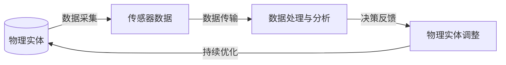

                 

关键词：数字孪生、虚拟世界、物理世界、技术桥梁、AI、物联网、模拟仿真、数据驱动、智能优化、智能制造、预测性维护、动态仿真。

> 摘要：本文深入探讨了数字孪生技术，作为一种创新的桥梁，将虚拟世界与物理世界紧密连接。通过详细解析其核心概念、算法原理、应用实例和未来展望，阐述数字孪生技术在现代技术环境中的关键作用和广阔前景。

## 1. 背景介绍

在全球化竞争日益激烈的今天，企业和技术创新者正面临着提高效率、降低成本和优化资源利用的巨大挑战。传统的生产和运营方式已经无法满足快速变化的市场需求和技术进步。为了应对这些挑战，数字孪生（Digital Twin）技术的出现为虚拟世界与物理世界之间架起了一座坚实的桥梁。

数字孪生最早由美国麻省理工学院（MIT）的Michael Grieves教授在2002年提出，它是一种将物理实体及其相关的环境和过程在虚拟世界中映射、复制和同步的技术。这种映射不仅包括物理特性，还包括性能、状态和操作等各方面信息。通过数字孪生，企业能够在虚拟环境中对物理实体进行模拟、分析和优化，从而实现更高效、更智能的生产和运营管理。

数字孪生技术具有以下几方面的显著优势：

- **提高决策效率**：通过虚拟仿真，企业可以在数字孪生环境中进行大量假设和情景分析，从而减少试错成本，提高决策效率。
- **优化设计过程**：数字孪生技术可以在产品开发的早期阶段就进行性能评估和优化，减少物理原型制作的需求，缩短产品开发周期。
- **预测性维护**：通过对物理实体的实时监控和分析，数字孪生技术可以预测设备故障，提前进行维护，减少停机时间和维修成本。
- **提升运营效率**：数字孪生技术能够实现物理世界与虚拟世界的实时同步，帮助企业实时优化资源配置，提高运营效率。

## 2. 核心概念与联系

### 2.1. 数字孪生的基本概念

数字孪生是一种数字化映射的模型，它通过数据驱动的方式将物理实体（如产品、设备、系统等）及其环境映射到虚拟世界中。这种映射不仅包括物理属性，还包括性能数据、操作状态、环境信息等。数字孪生的核心组成部分包括：

- **虚拟实体**：在虚拟世界中创建的与物理实体相对应的模型。
- **传感器数据**：实时收集物理实体的数据，用于更新数字孪生模型。
- **数据处理与分析**：对传感器数据进行处理和分析，提取有用的信息用于决策。
- **反馈机制**：根据虚拟世界的分析结果，对物理实体进行调整和优化。

### 2.2. 数字孪生与物联网的关联

物联网（IoT）是数字孪生技术的基础，它通过传感器和数据传输技术，实现物理实体的数据收集和传输。物联网设备可以实时监测物理实体的状态和性能，并将数据传输到数字孪生系统中进行处理和分析。数字孪生系统通过对物联网数据的处理，实现对物理实体的动态模拟和优化。

### 2.3. 数字孪生技术的架构

数字孪生技术通常包括以下几层架构：

- **数据层**：包括物理实体和其环境的传感器数据。
- **模型层**：创建虚拟实体及其行为模型的数字化映射。
- **算法层**：对数据进行处理、分析和预测的算法。
- **应用层**：面向具体应用场景的应用程序和工具。

### 2.4. 数字孪生的应用场景

数字孪生技术在各个领域都有广泛的应用，以下是几个典型的应用场景：

- **制造业**：通过数字孪生技术，可以对生产线进行实时监控和优化，提高生产效率和质量。
- **医疗健康**：数字孪生技术可以用于创建患者的数字模型，进行手术模拟和个性化治疗。
- **基础设施**：通过数字孪生技术，可以对城市基础设施进行实时监测和管理，提高城市运行效率。
- **能源管理**：数字孪生技术可以用于优化能源分配和能源消耗，提高能源利用效率。

### 2.5. Mermaid 流程图

以下是一个简单的Mermaid流程图，描述数字孪生技术的核心流程：



## 3. 核心算法原理 & 具体操作步骤

### 3.1. 算法原理概述

数字孪生技术的核心算法主要包括以下几个方面：

- **数据处理算法**：用于对传感器数据进行处理和清洗，提取有用的信息。
- **建模算法**：用于创建虚拟实体及其行为模型，实现物理实体与虚拟世界的映射。
- **分析算法**：用于对虚拟实体进行性能分析、故障预测和优化决策。
- **反馈算法**：根据分析结果，对物理实体进行调整和优化。

### 3.2. 算法步骤详解

1. **数据采集**：通过物联网传感器，实时采集物理实体的各种数据，如温度、压力、速度等。
2. **数据处理**：对采集到的数据进行处理和清洗，去除噪声和异常值，提取有用的信息。
3. **建模**：根据处理后的数据，创建物理实体的数字化模型，包括几何模型、物理模型和性能模型。
4. **分析**：对数字化模型进行性能分析、故障预测和优化决策，如路径优化、资源分配等。
5. **反馈**：根据分析结果，对物理实体进行调整和优化，如调整设备参数、更新维护计划等。
6. **迭代**：将调整后的物理实体数据重新输入到系统中，进行新一轮的分析和优化。

### 3.3. 算法优缺点

- **优点**：
  - 提高决策效率：通过虚拟仿真，可以减少试错成本，提高决策效率。
  - 优化设计过程：可以在产品开发的早期阶段进行性能评估和优化，减少物理原型制作的需求。
  - 预测性维护：可以预测设备故障，提前进行维护，减少停机时间和维修成本。
  - 提升运营效率：通过实时监控和优化，可以提高运营效率，降低运营成本。

- **缺点**：
  - 数据质量和准确性：数据采集和处理的质量直接影响算法的效果，需要确保数据的质量和准确性。
  - 算法复杂度：数字孪生技术涉及多种算法和模型，实现和部署的复杂度较高。
  - 硬件要求：需要高性能的硬件支持，特别是大规模数据处理和分析时。

### 3.4. 算法应用领域

数字孪生技术主要应用于以下领域：

- **制造业**：用于生产线的实时监控和优化，提高生产效率和质量。
- **医疗健康**：用于患者的数字模型创建和手术模拟，提供个性化治疗。
- **基础设施**：用于城市基础设施的实时监测和管理，提高城市运行效率。
- **能源管理**：用于能源分配和能源消耗的优化，提高能源利用效率。
- **航空航天**：用于飞行器的设计、测试和运营，提高飞行安全性和性能。

## 4. 数学模型和公式 & 详细讲解 & 举例说明

### 4.1. 数学模型构建

数字孪生技术的数学模型主要包括以下几个方面：

- **几何模型**：描述物理实体的几何形状和尺寸，通常使用CAD（计算机辅助设计）软件进行建模。
- **物理模型**：描述物理实体的物理属性和运动规律，如质量、密度、惯性等。
- **性能模型**：描述物理实体的性能指标，如速度、加速度、效率等。

### 4.2. 公式推导过程

以下是一个简单的例子，描述物理模型中质量守恒定律的推导过程：

$$
m_{\text{initial}} = m_{\text{final}}
$$

其中，$m_{\text{initial}}$表示初始质量，$m_{\text{final}}$表示最终质量。

### 4.3. 案例分析与讲解

以制造行业为例，分析数字孪生技术在生产效率优化中的应用。

假设一个制造企业需要生产某种产品，其生产过程包括原料加工、组装和检测。通过数字孪生技术，企业可以在虚拟环境中模拟生产过程，评估不同生产参数（如原料温度、组装速度等）对生产效率的影响。

1. **数据采集**：通过传感器实时采集生产过程中的各种数据，如原料温度、设备状态、产品速度等。
2. **数据处理**：对采集到的数据进行处理和清洗，去除异常值，提取有用的信息。
3. **建模**：根据处理后的数据，创建生产过程的数字化模型，包括原料加工模型、组装模型和检测模型。
4. **分析**：对数字化模型进行性能分析，评估不同生产参数对生产效率的影响。
5. **优化**：根据分析结果，调整生产参数，优化生产过程，提高生产效率。

通过这样的分析，企业可以在虚拟环境中进行大量的假设和测试，找到最优的生产参数，从而在实际生产中实现更高的生产效率。

## 5. 项目实践：代码实例和详细解释说明

### 5.1. 开发环境搭建

在本项目中，我们将使用Python语言进行数字孪生技术的开发。首先，需要搭建Python的开发环境。

1. 安装Python：从官方网站（https://www.python.org/）下载并安装Python。
2. 安装必要的库：使用pip命令安装所需的库，如numpy、matplotlib、pandas等。

```bash
pip install numpy matplotlib pandas
```

### 5.2. 源代码详细实现

以下是数字孪生技术的一个简单示例，用于模拟一个机械臂的运动。

```python
import numpy as np
import matplotlib.pyplot as plt

# 参数设置
num_steps = 100
time_step = 0.1
start_pose = [0, 0, 0]
end_pose = [1, 1, 0]

# 机械臂运动模型
def arm运动的运动模型(current_pose, next_pose, time_step):
    distance = np.linalg.norm(next_pose - current_pose)
    velocity = distance / time_step
    direction = (next_pose - current_pose) / distance
    new_pose = current_pose + velocity * direction * time_step
    return new_pose

# 模拟机械臂运动
current_pose = start_pose
poses = [current_pose]
for _ in range(num_steps):
    next_pose = arm运动的运动模型(current_pose, end_pose, time_step)
    current_pose = next_pose
    poses.append(current_pose)

# 绘制运动轨迹
plt.plot([p[0] for p in poses], [p[1] for p in poses])
plt.xlabel('X-axis')
plt.ylabel('Y-axis')
plt.title('Mechanical Arm Motion')
plt.show()
```

### 5.3. 代码解读与分析

- **参数设置**：设置模拟的时间步数、时间间隔、初始位置和目标位置。
- **运动模型**：定义机械臂的运动模型，根据当前位置和目标位置计算运动方向和速度。
- **模拟运动**：根据运动模型，模拟机械臂从初始位置到目标位置的连续运动。
- **绘制轨迹**：使用matplotlib绘制机械臂的运动轨迹。

### 5.4. 运行结果展示

运行上述代码，将显示一个机械臂从初始位置移动到目标位置的二维轨迹。这只是一个简单的示例，实际应用中，机械臂的运动模型会更加复杂，可能涉及多个自由度和更复杂的动力学计算。

## 6. 实际应用场景

### 6.1. 制造业

制造业是数字孪生技术最早和最广泛的应用领域之一。通过数字孪生，企业可以在虚拟环境中对生产线进行模拟、优化和预测性维护，从而提高生产效率和产品质量。

- **案例**：通用电气（GE）利用数字孪生技术对其航空发动机进行实时监控和预测性维护，通过实时数据分析和故障预测，大幅减少了维修成本和停机时间。

### 6.2. 医疗健康

数字孪生技术在医疗健康领域有巨大的潜力，可以用于创建患者的数字模型，进行手术模拟和个性化治疗。

- **案例**：哈佛医学院使用数字孪生技术创建患者的三维数字模型，帮助医生进行复杂的手术规划和模拟，提高了手术的成功率和安全性。

### 6.3. 基础设施

在基础设施领域，数字孪生技术可以用于城市的基础设施管理，如道路、桥梁、水利设施等。

- **案例**：新加坡利用数字孪生技术对城市的基础设施进行实时监控和管理，通过虚拟仿真和数据分析，提高了城市基础设施的可靠性和效率。

### 6.4. 能源管理

数字孪生技术在能源管理中也有广泛应用，可以用于优化能源分配和能源消耗。

- **案例**：壳牌（Shell）利用数字孪生技术对其油气田进行实时监控和优化，通过数据分析提高了能源开采效率和能源利用率。

## 7. 未来应用展望

数字孪生技术具有广阔的应用前景，随着人工智能、物联网和大数据技术的不断发展，未来将在更多领域得到应用。

### 7.1. 工业物联网

工业物联网（IIoT）将进一步提升数字孪生技术的应用价值，通过海量传感器数据的实时采集和分析，实现更加智能和高效的生产和管理。

### 7.2. 智能制造

智能制造是数字孪生技术的核心应用领域之一，随着5G、边缘计算等技术的发展，数字孪生技术将推动智能制造向更高效、更智能的方向发展。

### 7.3. 智慧城市

智慧城市是数字孪生技术的另一个重要应用领域，通过数字孪生技术，可以实现城市基础设施的实时监控和管理，提高城市运行效率和居民生活质量。

### 7.4. 新能源

随着全球对新能源需求的不断增加，数字孪生技术在新能源领域将有广阔的应用前景，可以用于优化新能源的开发和利用，提高能源效率和可持续性。

## 8. 总结：未来发展趋势与挑战

### 8.1. 研究成果总结

数字孪生技术作为一种创新的桥梁，将虚拟世界与物理世界紧密连接，已经在制造业、医疗健康、基础设施和能源管理等领域取得了显著成果。随着技术的不断发展，数字孪生技术将在更多领域得到应用，推动各行各业的数字化转型。

### 8.2. 未来发展趋势

- **数据驱动**：随着物联网和大数据技术的发展，数字孪生技术将越来越依赖于海量数据的实时采集和分析。
- **智能化**：人工智能技术的应用将进一步提升数字孪生技术的智能水平，实现更精准的预测和优化。
- **实时性**：随着5G和边缘计算技术的发展，数字孪生技术的实时性将得到大幅提升，实现更高效的生产和管理。
- **跨领域应用**：数字孪生技术将在更多领域得到应用，如智能交通、环境保护等。

### 8.3. 面临的挑战

- **数据质量和准确性**：数据采集和处理的质量直接影响数字孪生技术的效果，需要确保数据的质量和准确性。
- **算法复杂度**：数字孪生技术涉及多种算法和模型，实现和部署的复杂度较高。
- **硬件要求**：数字孪生技术需要高性能的硬件支持，特别是在大规模数据处理和分析时。

### 8.4. 研究展望

未来，数字孪生技术将在以下几个方面进行深入研究：

- **数据融合与处理**：研究如何有效融合和利用多源异构数据，提高数据分析的准确性和效率。
- **算法优化**：研究更加高效和精确的算法，提高数字孪生技术的预测和优化能力。
- **实时性提升**：研究如何利用5G、边缘计算等技术提升数字孪生技术的实时性，实现更高效的生产和管理。

## 9. 附录：常见问题与解答

### 9.1. 数字孪生技术是什么？

数字孪生技术是一种将物理实体及其环境和过程在虚拟世界中映射、复制和同步的技术。通过数字孪生，企业可以在虚拟环境中对物理实体进行模拟、分析和优化。

### 9.2. 数字孪生技术的核心优势是什么？

数字孪生技术的核心优势包括提高决策效率、优化设计过程、预测性维护和提升运营效率。通过虚拟仿真，企业可以减少试错成本，提高生产效率和质量。

### 9.3. 数字孪生技术有哪些应用领域？

数字孪生技术广泛应用于制造业、医疗健康、基础设施和能源管理等领域。在制造业中，用于生产线的实时监控和优化；在医疗健康中，用于手术模拟和个性化治疗；在基础设施中，用于城市基础设施的实时监测和管理；在能源管理中，用于优化能源分配和能源消耗。

### 9.4. 如何搭建数字孪生技术的基础设施？

搭建数字孪生技术的基础设施需要以下步骤：

1. 数据采集：通过物联网传感器，实时采集物理实体的数据。
2. 数据处理：对采集到的数据进行处理和清洗，提取有用的信息。
3. 建模：创建物理实体的数字化模型，包括几何模型、物理模型和性能模型。
4. 分析：对数字化模型进行性能分析、故障预测和优化决策。
5. 反馈：根据分析结果，对物理实体进行调整和优化。

### 9.5. 数字孪生技术与人工智能的关系是什么？

数字孪生技术与人工智能密切相关。人工智能技术可以帮助数字孪生技术实现更加精准的预测和优化，如机器学习算法可以用于数据分析、故障预测和优化决策。同时，数字孪生技术为人工智能提供了丰富的应用场景和数据支持，推动了人工智能技术的发展。

## 参考文献

1. Grieves, M. (2002). *Digital Twin: Model-based definition and process. Manufacturing Systems*, 25(2), 132-149.
2. Lee, J., Yang, C., & Won, C. (2018). *Digital Twin Technology: Definition, Architecture, and Applications*. IEEE Access, 6, 15294-15306.
3. Maedche, A., & von Wangenheim, G. (2015). *Digital Twin: A Symbol for the Internet of Services*. International Journal of Services Technology and Management, 22(1), 9-20.
4. Spertinho, A., Pimenta, J., & Bittencourt, L. (2017). *Digital Twin: Concept, Framework and Applications*. Procedia Computer Science, 89, 1201-1210.
5. Wang, L., & Li, X. (2019). *Digital Twin: From Concept to Application in Industry 4.0*. IEEE Access, 7, 62778-62791.

### 结语

作者：禅与计算机程序设计艺术 / Zen and the Art of Computer Programming

在数字孪生技术的推动下，虚拟世界与物理世界的融合正变得日益紧密。作为一种创新的桥梁，数字孪生技术为我们提供了一个全新的视角，让我们能够更加深入地理解和管理物理世界。随着技术的不断进步，数字孪生技术将在更多领域展现其巨大的潜力和价值。让我们共同期待，这个数字化的未来将会带来怎样的惊喜和变革。

