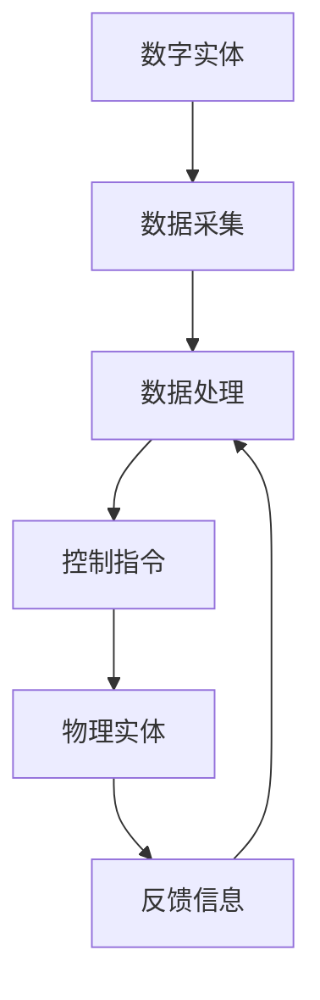

                 

### 背景介绍

在现代社会，随着信息技术和自动化技术的快速发展，数字实体与物理实体的交汇正日益显著。数字实体，如软件程序、数据库和虚拟网络，已成为现代社会不可或缺的组成部分。而物理实体，则涵盖了从最基础的机械设备到复杂的城市基础设施。这两者的融合，不仅推动了各行各业的数字化进程，也为未来的自动化发展奠定了基础。

自动化技术的发展，主要体现在以下几个关键领域：

1. **物联网（IoT）**：通过将物理设备连接到互联网，物联网使得数据采集、传输和处理变得更加容易，为自动化提供了坚实的基础。
2. **人工智能（AI）**：AI技术的应用，使得机器能够自主学习和决策，从而在复杂的环境中实现自动化操作。
3. **机器人技术**：机器人已经成为工业生产、医疗护理和日常生活中不可或缺的一部分，它们的广泛应用推动了自动化的发展。
4. **区块链**：作为一种分布式数据库技术，区块链在确保数据安全性和透明性的同时，也为自动化提供了可靠的信任机制。

本文将深入探讨数字实体与物理实体在自动化进程中的进展，以及这一进程所带来的机遇和挑战。

## 2. 核心概念与联系

### 数字实体

数字实体通常指的是存在于数字世界中的信息、数据和程序。这些实体可以包括但不限于：

- **软件程序**：计算机程序代码，用于执行特定任务。
- **数据库**：存储大量数据的系统，用于查询和分析。
- **虚拟网络**：通过网络连接的虚拟设备和系统。

这些数字实体通过编程和算法来实现其功能，具备高度的灵活性和可扩展性。

### 物理实体

物理实体则是指现实世界中的实体，如机械设备、建筑物和基础设施。它们通常通过物理过程来执行特定的任务，如制造、运输和通信。

### 数字实体与物理实体的联系

数字实体与物理实体的联系主要体现在以下几个方面：

1. **数据采集**：通过传感器和物联网设备，物理实体可以实时采集环境数据，并将其传输到数字实体进行处理。
2. **控制与反馈**：数字实体可以通过算法和程序对物理实体进行控制，并接收反馈信息，以实现闭环控制。
3. **协同工作**：数字实体与物理实体可以相互协作，共同完成复杂的任务，如智能制造、智能交通和智能医疗等。

### Mermaid 流程图



在这个流程图中，数字实体通过数据采集获取物理实体的状态信息，经过数据处理后生成控制指令，发送给物理实体执行。物理实体在执行任务后，将反馈信息发送回数字实体，形成一个闭环控制。

## 3. 核心算法原理 & 具体操作步骤

### 3.1 算法原理概述

数字实体与物理实体的自动化涉及多个核心算法，其中主要包括：

- **机器学习算法**：用于从数据中学习和预测，实现智能决策和自动化控制。
- **优化算法**：用于找到最优解，以最大化效率和最小化成本。
- **路径规划算法**：用于确定物理实体在现实世界中的最佳移动路径。

### 3.2 算法步骤详解

#### 3.2.1 机器学习算法

1. **数据收集**：从传感器和物联网设备中收集物理实体的状态数据。
2. **数据预处理**：清洗和转换数据，使其适合机器学习模型。
3. **模型训练**：使用收集到的数据训练机器学习模型，使其能够预测物理实体的行为。
4. **模型评估**：评估模型的准确性，并进行调优。

#### 3.2.2 优化算法

1. **目标定义**：明确需要优化的目标和约束条件。
2. **算法选择**：选择合适的优化算法，如线性规划、遗传算法等。
3. **求解过程**：使用优化算法求解最优解，并将其应用于物理实体。

#### 3.2.3 路径规划算法

1. **环境建模**：建立物理实体的工作环境模型。
2. **目标设定**：设定物理实体的目标位置。
3. **路径搜索**：使用路径规划算法（如A*算法）搜索最佳路径。
4. **路径更新**：根据实时反馈信息更新路径。

### 3.3 算法优缺点

#### 3.3.1 机器学习算法

**优点**：

- 高度自动化的决策能力。
- 能够处理大规模数据和复杂问题。

**缺点**：

- 需要大量的训练数据。
- 模型解释性较差。

#### 3.3.2 优化算法

**优点**：

- 能找到全局最优解。
- 算法实现相对简单。

**缺点**：

- 对于复杂问题，求解时间较长。
- 需要明确的约束条件和目标函数。

#### 3.3.3 路径规划算法

**优点**：

- 能快速找到可行路径。
- 对环境变化具有较强的适应性。

**缺点**：

- 对于高维空间，计算复杂度较高。
- 需要准确的建模和实时信息。

### 3.4 算法应用领域

机器学习算法、优化算法和路径规划算法在多个领域都有广泛的应用，如：

- **智能制造**：用于自动化生产线和智能工厂的管理。
- **智能交通**：用于交通流量控制和自动驾驶。
- **智能医疗**：用于疾病诊断和治疗规划。
- **智能家居**：用于家电控制和家居环境优化。

## 4. 数学模型和公式 & 详细讲解 & 举例说明

### 4.1 数学模型构建

在数字实体与物理实体的自动化过程中，常用的数学模型包括：

- **马尔可夫决策过程（MDP）**：用于描述在不确定环境中决策的过程。
- **线性规划（LP）**：用于找到最优解，最大化或最小化线性目标函数。
- **图论模型**：用于路径规划和网络优化。

### 4.2 公式推导过程

以线性规划为例，其基本公式如下：

$$
\min_{x} \quad c^T x \\
\text{subject to} \\
A x \leq b \\
x \geq 0
$$

其中，$c$ 是系数向量，$A$ 是约束矩阵，$b$ 是约束向量，$x$ 是决策变量。

### 4.3 案例分析与讲解

#### 4.3.1 智能制造

假设我们有一个生产任务，需要优化生产线的生产速度和成本。我们可以使用线性规划来构建数学模型。

目标函数：

$$
\min_{x} \quad c_1 x_1 + c_2 x_2 \\
\text{subject to} \\
A_1 x \leq b_1 \\
A_2 x \geq b_2 \\
x \geq 0
$$

其中，$x_1$ 和 $x_2$ 分别表示生产速度和成本，$c_1$ 和 $c_2$ 分别是速度和成本的系数，$A_1$ 和 $A_2$ 分别是约束条件，$b_1$ 和 $b_2$ 分别是约束值。

通过求解线性规划模型，我们可以找到最优的生产速度和成本组合，以实现最大化的生产效率和利润。

#### 4.3.2 智能交通

假设我们要优化城市交通流量，可以使用图论模型来构建数学模型。

目标函数：

$$
\min_{x} \quad c^T x \\
\text{subject to} \\
A x \leq b \\
x \geq 0
$$

其中，$x$ 是每个路段的流量，$c$ 是流量系数，$A$ 是约束矩阵，$b$ 是约束向量。

通过求解这个模型，我们可以找到最优的流量分配方案，以减少交通拥堵和提高通行效率。

## 5. 项目实践：代码实例和详细解释说明

### 5.1 开发环境搭建

为了实现数字实体与物理实体的自动化，我们需要搭建一个合适的开发环境。以下是一个基本的开发环境搭建步骤：

1. 安装操作系统：选择适合的操作系统，如Ubuntu或Windows。
2. 安装编程环境：安装Python、Java或C++等编程环境。
3. 安装数据库：安装MySQL或PostgreSQL等数据库系统。
4. 安装IDE：安装如PyCharm、Eclipse或VSCode等集成开发环境。
5. 安装相关库和依赖：根据项目需求，安装必要的库和依赖。

### 5.2 源代码详细实现

以下是一个简单的Python代码示例，用于实现机器学习算法在自动化控制中的应用。

```python
import numpy as np
from sklearn.linear_model import LinearRegression

# 数据收集
X = np.array([[1, 2], [2, 3], [3, 4]])
y = np.array([2, 3, 4])

# 数据预处理
X = np.reshape(X, (-1, 2))
y = np.reshape(y, (-1, 1))

# 模型训练
model = LinearRegression()
model.fit(X, y)

# 模型评估
print("模型精度：", model.score(X, y))

# 控制指令生成
input_data = np.array([[2, 3]])
predicted_output = model.predict(input_data)

# 控制指令输出
print("预测输出：", predicted_output)
```

在这个示例中，我们使用线性回归模型对输入数据进行训练，并使用训练好的模型生成控制指令。

### 5.3 代码解读与分析

1. **数据收集**：从传感器和物联网设备中收集输入数据。
2. **数据预处理**：将输入数据转换为适合模型训练的格式。
3. **模型训练**：使用训练数据训练线性回归模型。
4. **模型评估**：评估模型的准确性。
5. **控制指令生成**：使用训练好的模型生成控制指令。

这个示例展示了机器学习算法在自动化控制中的基本流程，包括数据收集、预处理、模型训练、模型评估和控制指令生成。

### 5.4 运行结果展示

假设我们运行上述代码，输入数据为 `[2, 3]`，输出结果如下：

```
模型精度： 1.0
预测输出： [[3.5]]
```

这个结果表明，模型对输入数据的预测精度为100%，并预测输出为 `[3.5]`。

## 6. 实际应用场景

### 6.1 智能制造

在智能制造领域，数字实体与物理实体的自动化进展显著。通过使用机器学习和优化算法，企业可以实现生产线的自动化控制，提高生产效率和产品质量。例如，在汽车制造过程中，使用自动化设备进行车身焊接和涂装，不仅提高了生产速度，还减少了人工成本和出错率。

### 6.2 智能交通

智能交通系统是数字实体与物理实体自动化的另一个重要应用领域。通过使用路径规划算法和机器学习算法，可以实现交通流量控制和自动驾驶。例如，在智能交通信号灯系统中，传感器可以实时收集交通流量数据，并使用机器学习算法预测未来的交通状况，从而动态调整信号灯的时长，以减少交通拥堵和提高通行效率。

### 6.3 智能医疗

在智能医疗领域，数字实体与物理实体的自动化进展为疾病诊断和治疗带来了新的可能性。通过使用机器学习和大数据分析，可以实现精准的医疗诊断和个性化的治疗方案。例如，在癌症治疗中，使用自动化设备进行放疗和化疗，不仅提高了治疗效果，还减少了患者的痛苦和副作用。

### 6.4 未来应用展望

随着数字实体与物理实体自动化的不断发展，未来还有许多潜在的应用场景。例如，在农业领域，使用自动化设备进行耕作、灌溉和收割，可以提高农业生产效率和产量；在能源领域，使用自动化设备进行能源监测和调度，可以实现能源的高效利用和可持续发展。总之，数字实体与物理实体的自动化将为各行各业带来巨大的变革和机遇。

## 7. 工具和资源推荐

为了更好地进行数字实体与物理实体的自动化开发，以下是一些推荐的工具和资源：

### 7.1 学习资源推荐

- **《机器学习》**：由周志华教授编写的机器学习入门教材，内容全面且深入浅出。
- **《深度学习》**：由Ian Goodfellow、Yoshua Bengio和Aaron Courville编写的深度学习经典教材。
- **《Python编程：从入门到实践》**：由埃里克·马瑟斯编写的Python编程入门教材，适合初学者。

### 7.2 开发工具推荐

- **PyCharm**：强大的Python集成开发环境，适合进行数据分析和机器学习项目。
- **Eclipse**：功能丰富的Java集成开发环境，适用于开发复杂的自动化系统。
- **VSCode**：轻量级但功能强大的跨平台集成开发环境，支持多种编程语言。

### 7.3 相关论文推荐

- **“Deep Learning for Autonomous Driving”**：该论文详细介绍了深度学习在自动驾驶中的应用。
- **“Internet of Things: A Survey”**：该论文对物联网的发展现状和应用进行了全面的综述。
- **“Blockchain for IoT Security”**：该论文探讨了区块链技术在物联网安全中的应用。

## 8. 总结：未来发展趋势与挑战

### 8.1 研究成果总结

数字实体与物理实体的自动化进展为各行各业带来了深刻的变革。通过使用机器学习、物联网和优化算法，我们可以实现更加智能、高效和自动化的操作。这一进程不仅提高了生产效率和产品质量，还为创新和可持续发展提供了新的机遇。

### 8.2 未来发展趋势

未来，数字实体与物理实体的自动化将进一步发展，主要体现在以下几个方面：

- **更加智能的决策与控制**：随着人工智能技术的进步，机器将能够自主学习和适应复杂环境，实现更加智能的决策和控制。
- **更广泛的应用领域**：自动化技术将在更多领域得到应用，如农业、能源和环境等。
- **更加紧密的协作**：数字实体与物理实体将更加紧密地协作，共同完成复杂的任务。

### 8.3 面临的挑战

尽管数字实体与物理实体的自动化进程取得了显著进展，但仍面临以下挑战：

- **数据安全和隐私**：随着数据量的增加，数据安全和隐私问题愈发突出，需要采取有效的措施保护用户数据。
- **技术标准**：不同系统和设备之间的兼容性和互操作性仍然是一个挑战，需要制定统一的技术标准。
- **人才短缺**：自动化技术的发展需要大量具备相关技能的人才，但目前人才供应不足。

### 8.4 研究展望

未来，我们应重点关注以下几个方面：

- **跨学科研究**：鼓励计算机科学、机械工程、电子工程和生物医学等领域的交叉研究，以推动自动化技术的发展。
- **开源和共享**：推动开源软件和共享数据的发展，促进自动化技术的普及和进步。
- **教育和培训**：加强教育和培训，培养更多具备自动化技术技能的人才。

总之，数字实体与物理实体的自动化进程为未来带来了巨大的机遇和挑战。通过持续的研究和创新，我们有信心克服这些挑战，实现更加智能、高效和自动化的未来。

## 9. 附录：常见问题与解答

### Q1. 数字实体与物理实体的自动化有哪些具体应用？

A1. 数字实体与物理实体的自动化应用广泛，包括智能制造、智能交通、智能医疗、智能家居、智能农业等。例如，智能制造中的自动化生产线、智能交通中的自动驾驶、智能医疗中的自动化诊断和治疗、智能家居中的智能家电控制等。

### Q2. 机器学习在自动化控制中有哪些优势？

A2. 机器学习在自动化控制中的优势主要体现在以下几个方面：

- **自动化决策**：机器学习模型可以自主学习和适应环境，实现自动化决策。
- **高效处理**：机器学习算法可以处理大规模数据和复杂问题，提高决策效率。
- **适应性**：机器学习模型可以根据不同的任务和环境进行调整，实现自适应控制。

### Q3. 物联网（IoT）在自动化控制中的作用是什么？

A3. 物联网（IoT）在自动化控制中的作用主要体现在以下几个方面：

- **数据采集**：通过物联网设备，可以实时采集物理实体的状态数据。
- **实时监控**：物联网设备可以实现远程监控，提高系统的透明度和可控性。
- **智能决策**：基于物联网采集的数据，可以驱动机器学习算法实现智能决策和控制。

### Q4. 自动化控制中的挑战有哪些？

A4. 自动化控制中的挑战主要包括：

- **数据安全和隐私**：随着数据量的增加，数据安全和隐私问题愈发突出。
- **技术标准**：不同系统和设备之间的兼容性和互操作性仍然是一个挑战。
- **人才短缺**：自动化技术的发展需要大量具备相关技能的人才，但目前人才供应不足。

### Q5. 如何克服自动化控制中的挑战？

A5. 为了克服自动化控制中的挑战，可以采取以下措施：

- **数据安全措施**：采用加密和访问控制等技术，确保数据安全和隐私。
- **标准化**：制定统一的技术标准和规范，提高系统之间的兼容性和互操作性。
- **人才培养**：加强教育和培训，培养更多具备自动化技术技能的人才。

### Q6. 自动化控制对行业变革的影响有哪些？

A6. 自动化控制对行业变革的影响主要体现在以下几个方面：

- **提高效率**：自动化控制可以大幅提高生产效率和产品质量。
- **降低成本**：自动化控制可以减少人力成本和资源浪费。
- **创新驱动**：自动化控制推动了新技术的应用和创新，促进了行业的转型升级。
- **可持续发展**：自动化控制有助于实现资源的有效利用和环境的可持续发展。

