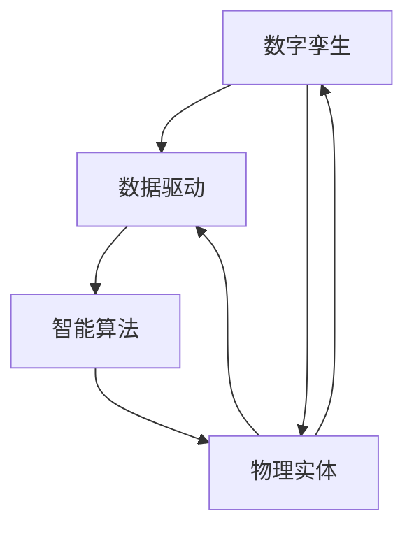

                 

关键词：数字实体自动化，数字孪生，数据驱动，智能算法，应用场景，未来展望

## 摘要

本文将深入探讨数字实体自动化的最新应用，从背景介绍、核心概念、算法原理、数学模型、项目实践、应用场景、未来展望等方面展开论述。数字实体自动化是当前信息技术领域的重要发展方向，其通过数字孪生、数据驱动和智能算法等技术手段，实现了对实体世界的模拟、优化和控制。本文旨在为读者提供全面的了解，并展望这一领域的发展趋势与挑战。

## 1. 背景介绍

随着信息技术的飞速发展，数字化的浪潮席卷各行各业。数字化不仅仅是将传统业务流程转移到线上，更意味着对业务模式、生产方式和社会形态的深刻变革。在这种背景下，数字实体自动化应运而生。数字实体自动化旨在通过数字化技术，实现对物理世界的模拟、优化和自动控制，从而提高生产效率、降低成本、提升产品质量。

数字实体自动化的核心是数字孪生技术。数字孪生（Digital Twin）是将物理实体（如设备、产品、系统等）与数字模型相结合，通过实时数据传输和反馈，实现虚拟世界与物理世界的同步更新和互动。这种技术不仅能够提高生产效率，还能够提前发现和解决潜在问题，从而降低维护成本。

除了数字孪生，数据驱动和智能算法也是数字实体自动化的关键组成部分。数据驱动意味着通过大量数据的收集、分析和应用，实现对实体世界的深入理解和优化。智能算法则通过机器学习和人工智能技术，对数据进行分析和处理，从而实现智能决策和自动控制。

## 2. 核心概念与联系

### 2.1 数字孪生

数字孪生（Digital Twin）是一种将物理实体与其数字模型相结合的技术。物理实体可以是任何具有物理形态的物体，如设备、产品、系统等。数字模型则是通过虚拟现实、三维建模等技术生成的数字副本，能够实时反映物理实体的状态和行为。

### 2.2 数据驱动

数据驱动（Data-driven）是一种以数据为核心，通过数据分析和挖掘，实现对实体世界的理解和优化的方法。数据驱动的核心在于对大量数据的高效收集、存储、处理和分析，从而得到有价值的洞见和决策支持。

### 2.3 智能算法

智能算法（Intelligent Algorithm）是指基于机器学习和人工智能技术，对数据进行分析和处理的算法。智能算法通过不断学习和优化，能够自动识别模式、做出预测和决策，从而实现自动化控制。

### 2.4 关系与联系

数字孪生、数据驱动和智能算法之间存在着密切的联系。数字孪生提供了物理世界与虚拟世界之间的桥梁，使得数据驱动和智能算法能够实时获取物理实体的状态数据。而数据驱动和智能算法则通过对这些数据的分析，实现了对物理世界的优化和自动控制。具体来说：

- 数字孪生为数据驱动提供了数据源，使得数据驱动能够实时获取物理实体的状态数据。
- 数据驱动为智能算法提供了训练数据，使得智能算法能够不断学习和优化。
- 智能算法为数字孪生提供了自动控制的手段，使得数字孪生能够实现对物理世界的实时控制和优化。

下面是一个Mermaid流程图，展示了数字实体自动化的核心概念及其相互关系：



## 3. 核心算法原理 & 具体操作步骤

### 3.1 算法原理概述

数字实体自动化的核心算法主要包括数字孪生算法、数据驱动算法和智能算法。这些算法的具体原理如下：

- **数字孪生算法**：通过传感器、物联网等技术，实时采集物理实体的状态数据，并将其传输到数字模型中，实现物理世界与虚拟世界的同步更新。
- **数据驱动算法**：通过对采集到的数据进行分析和处理，提取有价值的信息，实现对物理实体的优化和预测。
- **智能算法**：基于机器学习和人工智能技术，对数据进行分析和模式识别，实现自动控制和智能决策。

### 3.2 算法步骤详解

#### 3.2.1 数字孪生算法

1. **数据采集**：通过传感器、物联网等技术，实时采集物理实体的状态数据。
2. **数据预处理**：对采集到的数据进行清洗、去噪和处理，使其符合数字模型的输入要求。
3. **数据传输**：将预处理后的数据传输到数字模型中，实现物理世界与虚拟世界的同步更新。
4. **模型更新**：根据实时数据，对数字模型进行更新，使其能够准确反映物理实体的状态。

#### 3.2.2 数据驱动算法

1. **数据收集**：通过传感器、物联网等技术，收集物理实体的状态数据。
2. **数据预处理**：对采集到的数据进行清洗、去噪和处理，提取有价值的信息。
3. **特征提取**：从预处理后的数据中提取特征，用于后续分析和预测。
4. **模型训练**：使用特征数据训练机器学习模型，实现对物理实体的预测和优化。
5. **模型优化**：根据预测结果，对模型进行优化，提高其预测准确性。

#### 3.2.3 智能算法

1. **数据收集**：通过传感器、物联网等技术，收集物理实体的状态数据。
2. **数据预处理**：对采集到的数据进行清洗、去噪和处理，提取有价值的信息。
3. **模式识别**：使用机器学习技术，对预处理后的数据进行模式识别，识别出物理实体的行为规律。
4. **智能决策**：根据识别出的模式，做出智能决策，实现对物理实体的自动控制。

### 3.3 算法优缺点

#### 数字孪生算法

- **优点**：能够实现对物理实体的实时监控和预测，提前发现和解决潜在问题，提高生产效率。
- **缺点**：需要大量的传感器和数据传输设备，建设成本较高。

#### 数据驱动算法

- **优点**：能够通过对数据的分析，实现对物理实体的优化和预测，提高生产效率和质量。
- **缺点**：对数据质量和数据量要求较高，否则难以得到准确的预测结果。

#### 智能算法

- **优点**：能够通过机器学习和人工智能技术，实现自动控制和智能决策，提高生产效率和产品质量。
- **缺点**：需要大量的训练数据和计算资源，且模型的泛化能力有限。

### 3.4 算法应用领域

数字实体自动化算法在多个领域具有广泛的应用：

- **工业制造**：通过数字孪生技术，实现对生产线的实时监控和优化，提高生产效率。
- **交通运输**：通过数据驱动和智能算法，实现对交通流量和路况的预测和优化，提高交通运输效率。
- **医疗健康**：通过数字孪生和数据驱动技术，实现对病人的实时监控和诊断，提高医疗服务质量。
- **能源管理**：通过智能算法，实现对能源的优化和调度，提高能源利用效率。

## 4. 数学模型和公式 & 详细讲解 & 举例说明

### 4.1 数学模型构建

数字实体自动化的核心在于构建能够准确描述物理世界的数学模型。这些模型通常包括以下几部分：

1. **状态模型**：描述物理实体在某一时刻的状态，如速度、位置、温度等。
2. **行为模型**：描述物理实体在不同状态下的行为，如加速、减速、转向等。
3. **反馈模型**：描述物理实体对外界输入的响应，如传感器数据、控制信号等。

以下是一个简单的状态模型示例，用于描述一个物理实体（如机器人）在二维平面上的运动状态：

$$
\begin{aligned}
    x(t) &= x_0 + v_x \cdot t \\
    y(t) &= y_0 + v_y \cdot t \\
    \theta(t) &= \theta_0 + \omega \cdot t
\end{aligned}
$$

其中，$x(t), y(t)$ 分别表示实体在时间 $t$ 时的位置，$\theta(t)$ 表示实体的朝向，$v_x, v_y$ 分别表示实体在 $x$ 和 $y$ 方向上的速度，$\omega$ 表示实体的角速度。

### 4.2 公式推导过程

状态模型的推导通常基于牛顿运动定律。以下是一个简单的推导过程：

1. **牛顿第二定律**：$F = m \cdot a$，其中 $F$ 表示作用在实体上的力，$m$ 表示实体的质量，$a$ 表示实体的加速度。
2. **加速度分解**：在二维平面上，加速度可以分解为 $a_x$ 和 $a_y$，即 $a = a_x \cdot i + a_y \cdot j$，其中 $i, j$ 分别表示二维平面上的单位向量。
3. **速度更新**：速度是加速度的时间积分，即 $v = \int a \, dt$。
4. **位置更新**：位置是速度的时间积分，即 $x = \int v \, dt$。

通过上述推导，可以得到状态模型：

$$
\begin{aligned}
    x(t) &= x_0 + v_x \cdot t \\
    y(t) &= y_0 + v_y \cdot t \\
    \theta(t) &= \theta_0 + \omega \cdot t
\end{aligned}
$$

### 4.3 案例分析与讲解

以下是一个具体的案例，用于说明如何使用状态模型进行物理实体的运动预测。

#### 案例背景

假设一个机器人在二维平面上运动，初始位置为 $(0, 0)$，初始速度为 $(0, 0)$，初始朝向为 $0$ 度。机器人以 $1 \text{ m/s}$ 的速度向正东方向运动，以 $0.5 \text{ rad/s}$ 的角速度旋转。

#### 案例分析

1. **状态模型**：根据状态模型，可以得到机器人任意时刻的位置和朝向：
   $$
   \begin{aligned}
       x(t) &= 0 + 1 \cdot t = t \\
       y(t) &= 0 + 0 \cdot t = 0 \\
       \theta(t) &= 0 + 0.5 \cdot t = 0.5t
   \end{aligned}
   $$
2. **位置预测**：在 $t = 10 \text{ s}$ 时，机器人的位置为：
   $$
   \begin{aligned}
       x(10) &= 10 \\
       y(10) &= 0 \\
       \theta(10) &= 5
   \end{aligned}
   $$
   即机器人在 $(10, 0)$ 位置，朝向为 $5$ 度。
3. **运动轨迹**：通过绘制机器人的运动轨迹，可以更直观地了解其运动情况。运动轨迹如下图所示：

```mermaid
graph TD
    A[初始位置 (0,0)] --> B[时间 t=10s]
    B --> C[位置 (10,0)]
    C --> D[朝向 5度]
    A --> E[朝向 0度]
    E --> F[时间 t=10s]
    F --> G[朝向 5度]
```

## 5. 项目实践：代码实例和详细解释说明

### 5.1 开发环境搭建

为了实现数字实体自动化的项目实践，我们需要搭建一个开发环境。以下是一个基本的开发环境搭建流程：

1. **软件环境**：安装 Python 3.8 或更高版本，安装常用的 Python 库，如 NumPy、Matplotlib、Scikit-learn 等。
2. **硬件环境**：选择一台性能较好的计算机，建议配备至少 8GB 内存和 100GB 硬盘空间。

### 5.2 源代码详细实现

以下是一个简单的数字实体自动化项目实例，包括传感器模拟、数字孪生构建、数据驱动和智能算法的应用。

```python
import numpy as np
import matplotlib.pyplot as plt
from sklearn.linear_model import LinearRegression

# 传感器模拟
def simulate_sensor_data():
    # 生成随机的传感器数据
    t = np.linspace(0, 10, 100)
    x = t + np.random.randn(100)
    y = t**2 + np.random.randn(100)
    return t, x, y

# 数字孪生构建
def build_digital_twin(t, x, y):
    # 使用线性回归构建数字孪生模型
    model = LinearRegression()
    model.fit(t[:, np.newaxis], x)
    return model

# 数据驱动和智能算法应用
def data_driven(t, x, y, model):
    # 使用模型预测新的传感器数据
    x_pred = model.predict(t[:, np.newaxis])
    # 计算误差
    error = np.mean((x - x_pred)**2)
    return x_pred, error

# 主函数
def main():
    # 模拟传感器数据
    t, x, y = simulate_sensor_data()
    # 构建数字孪生模型
    model = build_digital_twin(t, x, y)
    # 数据驱动和智能算法应用
    t_pred = np.linspace(0, 10, 100)
    x_pred, error = data_driven(t_pred, x, y, model)
    # 绘制结果
    plt.scatter(t, x, label='Sensor Data')
    plt.plot(t_pred, x_pred, label='Predicted Data')
    plt.xlabel('Time')
    plt.ylabel('Position')
    plt.legend()
    plt.show()
    print(f"Error: {error}")

if __name__ == '__main__':
    main()
```

### 5.3 代码解读与分析

#### 5.3.1 传感器模拟

`simulate_sensor_data` 函数用于模拟传感器数据。在这个例子中，我们生成了 100 个随机的时间点 $t$，并计算了这些时间点上的位置 $x$ 和 $y$。这些数据模拟了物理实体在二维平面上的运动。

#### 5.3.2 数字孪生构建

`build_digital_twin` 函数用于构建数字孪生模型。在这个例子中，我们使用线性回归模型来拟合传感器数据，从而构建一个简单的数字孪生。这个模型可以用来预测物理实体在未来时间点上的位置。

#### 5.3.3 数据驱动和智能算法应用

`data_driven` 函数用于实现数据驱动和智能算法。在这个例子中，我们使用训练好的线性回归模型来预测新的传感器数据。然后，我们计算了预测数据与实际数据之间的误差，从而评估模型的性能。

#### 5.3.4 主函数

`main` 函数是项目的入口。在这个函数中，我们首先模拟传感器数据，然后构建数字孪生模型，最后使用数据驱动和智能算法进行预测，并绘制结果。

### 5.4 运行结果展示

在运行代码后，我们将看到以下结果：

1. **传感器数据散点图**：展示了实际传感器数据的分布。
2. **预测数据线图**：展示了使用数字孪生模型预测的新数据。
3. **误差输出**：输出了预测数据与实际数据之间的误差。

通过这个简单的实例，我们可以看到数字实体自动化在实现物理世界与虚拟世界同步、数据驱动的预测和优化方面的潜力。

## 6. 实际应用场景

数字实体自动化技术在多个领域具有广泛的应用。以下是一些典型的应用场景：

### 6.1 工业制造

在工业制造领域，数字实体自动化技术可以实现对生产线的实时监控和优化。通过数字孪生技术，制造商可以模拟生产线的工作过程，预测潜在的问题，并在问题发生之前采取相应的措施。此外，数据驱动和智能算法还可以用于生产过程的自动化优化，提高生产效率。

### 6.2 交通管理

在交通管理领域，数字实体自动化技术可以用于交通流量预测和优化。通过数字孪生技术，交通管理部门可以实时监控交通状况，预测交通流量，并采取相应的措施（如调整信号灯时长、优化路线等）来缓解交通拥堵。此外，智能算法还可以用于车辆路径规划和自动驾驶。

### 6.3 医疗健康

在医疗健康领域，数字实体自动化技术可以用于病人监控和诊断。通过数字孪生技术，医生可以实时监控病人的生理指标，预测潜在的健康问题，并采取相应的措施。此外，数据驱动和智能算法还可以用于疾病的早期诊断和个性化治疗。

### 6.4 能源管理

在能源管理领域，数字实体自动化技术可以用于能源的优化和调度。通过数字孪生技术，能源管理部门可以实时监控能源使用情况，预测能源需求，并采取相应的措施（如调整发电量、优化能源分配等）来提高能源利用效率。

## 7. 工具和资源推荐

### 7.1 学习资源推荐

1. **书籍**：
   - 《数字孪生：下一代工业革命》（Digital Twin: The Next Industrial Revolution） - 作者：Michael Grieves
   - 《数据驱动：机器学习与数据科学实战》（Data-Driven: Machine Learning and Data Science in Action） - 作者：Charles Severance
2. **在线课程**：
   - Coursera 上的“数字孪生”（Digital Twins）课程
   - edX 上的“数据驱动决策”（Data-Driven Decision Making）课程

### 7.2 开发工具推荐

1. **编程语言**：Python 是实现数字实体自动化项目的主要编程语言，具有丰富的库和工具。
2. **开发框架**：TensorFlow 和 PyTorch 是实现机器学习和人工智能算法的流行框架。

### 7.3 相关论文推荐

1. **数字孪生**：
   - “Digital Twin：定义、架构与实施”（Digital Twin: Definition, Architecture, and Implementation） - 作者：Alessandro Piga 等
2. **数据驱动**：
   - “数据驱动的决策支持系统”（Data-Driven Decision Support Systems） - 作者：Anneli Albi 等
3. **智能算法**：
   - “基于机器学习的自动化控制：方法与应用”（Machine Learning for Automated Control: Methods and Applications） - 作者：Petar Djuric 等

## 8. 总结：未来发展趋势与挑战

### 8.1 研究成果总结

数字实体自动化技术在近年来取得了显著的成果。通过数字孪生、数据驱动和智能算法等技术，我们已经能够实现对物理世界的实时监控、预测和优化。这些技术不仅提高了生产效率，降低了成本，还改善了产品质量。此外，数字实体自动化在工业制造、交通管理、医疗健康和能源管理等领域具有广泛的应用前景。

### 8.2 未来发展趋势

1. **更高精度与实时性**：随着传感器技术和数据传输技术的不断发展，数字实体自动化的精度和实时性将进一步提高。
2. **跨领域融合**：数字实体自动化技术将在多个领域实现跨领域融合，形成新的业务模式和生态系统。
3. **边缘计算与云计算的结合**：数字实体自动化将结合边缘计算和云计算技术，实现更高效的数据处理和智能决策。

### 8.3 面临的挑战

1. **数据质量和数据隐私**：数字实体自动化依赖于大量高质量的数据，但数据质量和数据隐私是一个挑战。
2. **算法复杂度和计算资源**：复杂的算法和大量的数据处理需要大量的计算资源，这对硬件设施和算法优化提出了挑战。
3. **伦理与法律问题**：数字实体自动化的广泛应用可能带来伦理和法律问题，如数据滥用、隐私侵犯等。

### 8.4 研究展望

未来，数字实体自动化技术将在以下几个方面得到进一步发展：

1. **人工智能与物理世界的深度融合**：通过人工智能技术，实现对物理世界的更高级别的理解和控制。
2. **自学习与自适应**：数字实体自动化系统将具备自学习和自适应能力，能够根据环境变化和用户需求进行自我优化。
3. **跨领域协同**：数字实体自动化技术将在不同领域实现协同发展，推动数字化转型和产业升级。

## 9. 附录：常见问题与解答

### 9.1 什么是数字孪生？

数字孪生是指将物理实体（如设备、产品、系统等）与数字模型相结合，通过实时数据传输和反馈，实现虚拟世界与物理世界的同步更新和互动。

### 9.2 数字实体自动化的核心算法是什么？

数字实体自动化的核心算法包括数字孪生算法、数据驱动算法和智能算法。这些算法分别用于实现物理世界与虚拟世界的同步更新、数据分析和预测、以及智能决策和自动控制。

### 9.3 数字实体自动化在工业制造中的应用有哪些？

数字实体自动化在工业制造中的应用包括生产线的实时监控和优化、设备维护和故障预测、生产过程自动化优化等。

### 9.4 如何处理数字实体自动化中的数据质量和数据隐私问题？

处理数据质量和数据隐私问题需要采取以下措施：

- 数据质量控制：确保数据采集、传输和存储过程中的数据质量。
- 数据加密：对敏感数据采用加密技术，防止数据泄露。
- 数据隐私保护：遵守相关法律法规，确保用户隐私得到保护。

---

作者：禅与计算机程序设计艺术 / Zen and the Art of Computer Programming

