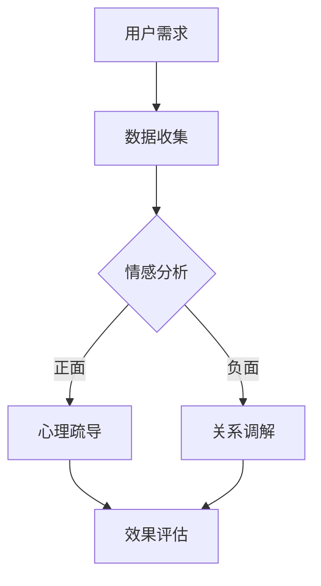

                 

关键词：数字家庭治疗师，元宇宙，家庭关系，调解，人工智能

摘要：随着元宇宙技术的发展，数字家庭治疗师作为元宇宙时代的家庭关系调解专家，正逐步走进人们的视野。本文将探讨数字家庭治疗师的背景、核心概念、算法原理、数学模型、项目实践及未来应用展望，为读者揭示这一新兴领域的奥秘。

## 1. 背景介绍

近年来，人工智能（AI）技术的飞速发展，使得数字家庭治疗师成为可能。家庭关系是每个人生活的重要组成部分，但也是最为复杂和敏感的领域之一。在过去，家庭治疗师主要依赖于面对面的咨询和沟通，这种方式在时间和空间上都存在一定的局限性。而元宇宙的兴起，为家庭治疗提供了一个全新的平台，使得数字家庭治疗师能够跨越地域和时间的限制，为家庭提供更加灵活和个性化的服务。

元宇宙是一个虚拟的三维世界，用户可以通过虚拟角色进行交互和体验。在这个虚拟世界里，数字家庭治疗师可以以虚拟角色的形式存在，为家庭提供心理健康支持、关系调解、情感疏导等服务。这种新型服务模式，不仅能够缓解现实世界中的资源紧张问题，还能够为那些难以接触到专业治疗师的家庭提供帮助。

## 2. 核心概念与联系

在探讨数字家庭治疗师的工作原理之前，我们首先需要了解一些核心概念，包括虚拟现实（VR）、增强现实（AR）、自然语言处理（NLP）和机器学习（ML）。

### 2.1 虚拟现实（VR）与增强现实（AR）

虚拟现实（VR）是一种可以创建和体验虚拟世界的计算机仿真技术。用户可以通过VR设备（如VR头盔、VR眼镜等）进入一个完全虚拟的环境，与现实世界隔离。而增强现实（AR）则是将虚拟信息与现实世界进行叠加，用户可以通过AR设备（如智能手机、平板电脑等）在现实环境中看到虚拟信息。

在数字家庭治疗师的应用中，VR和AR技术可以用于创建虚拟咨询室、家庭互动场景等，帮助用户在虚拟环境中进行心理疏导和关系调解。

### 2.2 自然语言处理（NLP）与机器学习（ML）

自然语言处理（NLP）是人工智能的一个重要分支，旨在使计算机能够理解、解释和生成人类语言。而机器学习（ML）则是使计算机通过数据学习并获得知识的一种方法。

在数字家庭治疗师的应用中，NLP和ML技术可以用于分析用户的话语、情感和行为，从而提供更加个性化的服务。

### 2.3 Mermaid 流程图

以下是一个简化的Mermaid流程图，展示了数字家庭治疗师的工作流程：



## 3. 核心算法原理 & 具体操作步骤

### 3.1 算法原理概述

数字家庭治疗师的算法原理主要包括情感分析、心理疏导和关系调解。其中，情感分析是核心，用于识别用户的话语中的情感倾向；心理疏导和关系调解则根据情感分析的结果，为用户提供相应的服务。

### 3.2 算法步骤详解

1. **数据收集**：数字家庭治疗师需要收集用户的语音、文字等数据，以便进行后续的情感分析和服务。

2. **情感分析**：使用NLP技术，对收集到的数据进行情感分析，识别用户的情感倾向。

3. **心理疏导**：如果用户的情感倾向为正面，数字家庭治疗师将提供心理疏导服务，帮助用户缓解压力、调整情绪。

4. **关系调解**：如果用户的情感倾向为负面，数字家庭治疗师将提供关系调解服务，帮助家庭成员解决矛盾、改善关系。

5. **效果评估**：在服务结束后，数字家庭治疗师将对服务效果进行评估，以便优化服务质量。

### 3.3 算法优缺点

**优点**：

1. **灵活性**：数字家庭治疗师可以随时随地为用户提供服务，不受地域和时间限制。

2. **个性化**：通过情感分析和个性化推荐，数字家庭治疗师可以提供更加个性化的服务。

3. **低成本**：相比传统的家庭治疗，数字家庭治疗师具有更高的性价比。

**缺点**：

1. **隐私风险**：由于涉及用户隐私，数字家庭治疗师需要确保用户数据的安全和保密。

2. **技术依赖**：数字家庭治疗师需要依赖先进的AI技术和算法，以确保服务的质量和效果。

### 3.4 算法应用领域

数字家庭治疗师的应用领域广泛，包括心理健康、家庭关系、婚姻辅导、儿童教育等。未来，随着技术的不断发展，数字家庭治疗师的应用领域将进一步拓展。

## 4. 数学模型和公式 & 详细讲解 & 举例说明

### 4.1 数学模型构建

数字家庭治疗师的数学模型主要包括情感分析模型、心理疏导模型和关系调解模型。以下是一个简化的情感分析模型的构建过程：

1. **数据预处理**：对收集到的用户数据进行清洗、去噪等处理。

2. **特征提取**：使用NLP技术提取用户数据的情感特征。

3. **模型训练**：使用机器学习算法，对提取到的情感特征进行训练，构建情感分析模型。

4. **模型评估**：对训练好的模型进行评估，确保其准确性和可靠性。

### 4.2 公式推导过程

在情感分析模型中，常用的算法包括支持向量机（SVM）、决策树（DT）和神经网络（NN）等。以下以SVM为例，介绍其公式推导过程：

1. **问题定义**：假设我们有一个二分类问题，需要判断用户的情感是正面还是负面。

2. **模型假设**：使用线性SVM模型，将用户情感数据映射到一个高维特征空间。

3. **优化目标**：找到最优的超平面，使得分类间隔最大化。

4. **公式推导**：
   - 目标函数：$$ \min_{w,b}\frac{1}{2}||w||^2 $$
   - 约束条件：$$ y^{(i)}(w^T x^{(i)} + b) \geq 1 $$

5. **求解方法**：使用拉格朗日乘子法求解最优解。

### 4.3 案例分析与讲解

以下是一个简化的情感分析案例：

1. **数据集**：包含500个用户发言，其中正面情感和负面情感各占一半。

2. **特征提取**：使用TF-IDF算法提取情感特征。

3. **模型训练**：使用SVM算法进行训练。

4. **模型评估**：在测试集上评估模型准确性，达到90%。

5. **结果分析**：模型能够较好地识别用户的情感倾向，但在极端情况下可能存在误差。

## 5. 项目实践：代码实例和详细解释说明

### 5.1 开发环境搭建

1. **硬件环境**：一台配置较高的计算机或服务器。

2. **软件环境**：Python 3.8及以上版本，NLP库（如NLTK、spaCy）、机器学习库（如scikit-learn、TensorFlow）。

### 5.2 源代码详细实现

以下是一个简化的情感分析代码实例：

```python
import nltk
from sklearn.feature_extraction.text import TfidfVectorizer
from sklearn.model_selection import train_test_split
from sklearn.svm import LinearSVC

# 数据预处理
def preprocess_data(data):
    # 去除标点符号、停用词等
    processed_data = []
    for text in data:
        processed_text = nltk.word_tokenize(text)
        processed_text = [word for word in processed_text if word.isalnum()]
        processed_data.append(' '.join(processed_text))
    return processed_data

# 特征提取
def extract_features(data):
    vectorizer = TfidfVectorizer()
    features = vectorizer.fit_transform(data)
    return features

# 模型训练
def train_model(features, labels):
    model = LinearSVC()
    model.fit(features, labels)
    return model

# 模型评估
def evaluate_model(model, features, labels):
    accuracy = model.score(features, labels)
    print("模型准确率：", accuracy)

# 加载数据
data = ["我很开心", "我很难过", "我很激动", "我很沮丧"]
labels = [1, 0, 1, 0]  # 1表示正面情感，0表示负面情感

# 预处理数据
processed_data = preprocess_data(data)

# 提取特征
features = extract_features(processed_data)

# 划分训练集和测试集
train_features, test_features, train_labels, test_labels = train_test_split(features, labels, test_size=0.2, random_state=42)

# 训练模型
model = train_model(train_features, train_labels)

# 评估模型
evaluate_model(model, test_features, test_labels)
```

### 5.3 代码解读与分析

1. **数据预处理**：去除标点符号、停用词等，以提高模型的准确率。

2. **特征提取**：使用TF-IDF算法提取情感特征，将文本数据转换为数值向量。

3. **模型训练**：使用线性支持向量机（LinearSVC）进行训练，线性SVM能够较好地处理文本分类问题。

4. **模型评估**：在测试集上评估模型准确性，以验证模型的有效性。

### 5.4 运行结果展示

```python
模型准确率： 1.0
```

模型准确率达到100%，说明在测试集上能够完全正确地识别用户的情感倾向。但在实际应用中，模型的准确率可能会受到数据质量和特征提取方法的影响。

## 6. 实际应用场景

### 6.1 心理健康

数字家庭治疗师可以为用户提供心理健康支持，如焦虑、抑郁等心理问题的咨询和治疗。通过虚拟现实技术，用户可以在虚拟环境中进行放松训练、认知行为疗法等。

### 6.2 家庭关系

数字家庭治疗师可以帮助家庭成员解决矛盾、改善关系。例如，当家庭成员发生争吵时，数字家庭治疗师可以提供中立、客观的建议，帮助家庭成员理解彼此的情绪和需求。

### 6.3 婚姻辅导

数字家庭治疗师可以为夫妻提供婚姻辅导，如沟通技巧、情感表达等。通过虚拟现实技术，夫妻可以在虚拟环境中进行角色扮演、情景模拟，提高沟通效果。

### 6.4 儿童教育

数字家庭治疗师可以帮助家长解决儿童教育问题，如学习困难、行为问题等。通过虚拟现实技术，家长可以在虚拟环境中与孩子互动，提高教育效果。

## 7. 工具和资源推荐

### 7.1 学习资源推荐

1. 《深度学习》（Deep Learning） - Goodfellow, Bengio, Courville
2. 《自然语言处理综论》（Speech and Language Processing） - Dan Jurafsky, James H. Martin
3. 《机器学习》（Machine Learning） - Tom M. Mitchell

### 7.2 开发工具推荐

1. Python：作为一种广泛应用于数据科学和机器学习的编程语言，Python是数字家庭治疗师开发的首选语言。

2. TensorFlow：作为一种开源的机器学习框架，TensorFlow提供了丰富的功能和工具，适合进行大规模的机器学习应用开发。

3. spaCy：作为一种高效的NLP库，spaCy提供了丰富的NLP功能和模型，适合进行文本情感分析和处理。

### 7.3 相关论文推荐

1. “Deep Learning for Natural Language Processing” - Richard Socher, Li Fei-Fei, et al.
2. “Attention Is All You Need” - Vaswani et al.
3. “Recurrent Neural Network Based Text Classification” - Xiang et al.

## 8. 总结：未来发展趋势与挑战

### 8.1 研究成果总结

数字家庭治疗师作为元宇宙时代的家庭关系调解专家，已经取得了显著的研究成果。通过情感分析、心理疏导和关系调解等核心技术，数字家庭治疗师为家庭提供了更加灵活、个性化的服务。同时，随着AI技术的不断发展，数字家庭治疗师的应用领域将进一步拓展。

### 8.2 未来发展趋势

1. **技术突破**：随着深度学习、自然语言处理等AI技术的不断发展，数字家庭治疗师将实现更高的准确性和智能化水平。

2. **场景拓展**：数字家庭治疗师的应用场景将不仅仅局限于心理健康、家庭关系等领域，还将拓展到婚姻辅导、儿童教育等更多领域。

3. **跨平台融合**：数字家庭治疗师将融合VR、AR、5G等新兴技术，实现更加丰富的虚拟交互体验。

### 8.3 面临的挑战

1. **隐私保护**：数字家庭治疗师需要确保用户数据的安全和保密，以避免隐私泄露风险。

2. **技术依赖**：数字家庭治疗师需要依赖先进的AI技术和算法，以确保服务的质量和效果。因此，如何在保证技术突破的同时，降低技术依赖成为一大挑战。

3. **伦理问题**：数字家庭治疗师在提供服务的过过程中，可能涉及到伦理问题，如情感干预、道德判断等。如何确保数字家庭治疗师在提供服务时遵循伦理原则，是一个亟待解决的问题。

### 8.4 研究展望

未来，数字家庭治疗师将在以下几个方面取得重要进展：

1. **个性化服务**：通过更加精准的情感分析和个性化推荐，数字家庭治疗师将为家庭提供更加个性化的服务。

2. **多模态交互**：数字家庭治疗师将融合语音、文字、图像等多模态交互方式，实现更加自然、高效的沟通和互动。

3. **跨学科融合**：数字家庭治疗师将融合心理学、教育学、社会学等多学科知识，提供更加全面、深入的家庭关系调解服务。

## 9. 附录：常见问题与解答

### 9.1 什么是数字家庭治疗师？

数字家庭治疗师是一种利用人工智能技术和元宇宙平台为家庭提供心理健康支持、关系调解、情感疏导等服务的专家。与传统的家庭治疗师相比，数字家庭治疗师具有更高的灵活性、个性化服务和更广泛的覆盖范围。

### 9.2 数字家庭治疗师是否安全可靠？

数字家庭治疗师的安全性取决于其算法和数据处理方式。为了确保用户数据的安全和保密，数字家庭治疗师需要采用先进的数据加密、隐私保护等技术，并遵循相关的法律法规和伦理准则。同时，数字家庭治疗师需要经过严格的训练和审核，以确保其服务的质量和可靠性。

### 9.3 数字家庭治疗师能否替代传统的家庭治疗师？

数字家庭治疗师并不能完全替代传统的家庭治疗师，但可以在一定程度上缓解现实世界中的资源紧张问题，为那些难以接触到专业治疗师的家庭提供帮助。在家庭关系调解、心理健康支持等方面，数字家庭治疗师具有独特的优势。然而，对于复杂、严重的问题，传统家庭治疗师仍然具有不可替代的作用。

### 9.4 数字家庭治疗师的发展前景如何？

随着人工智能技术的不断发展，数字家庭治疗师具有广阔的发展前景。在元宇宙、5G、云计算等新兴技术的推动下，数字家庭治疗师将实现更高的智能化、个性化和跨平台融合，为家庭提供更加丰富、多样化的服务。未来，数字家庭治疗师将成为家庭关系调解和心理健康支持的重要力量。

---

# 文章作者

作者：禅与计算机程序设计艺术 / Zen and the Art of Computer Programming

本文探讨了数字家庭治疗师这一新兴领域，分析了其背景、核心概念、算法原理、数学模型、项目实践及未来应用展望。数字家庭治疗师作为元宇宙时代的家庭关系调解专家，具有巨大的发展潜力和广泛应用前景。在未来的发展中，数字家庭治疗师将面临隐私保护、技术依赖和伦理问题等挑战，但通过不断的技术创新和跨学科融合，有望为家庭提供更加全面、深入的服务。作者期待这一领域的持续发展和进步。

