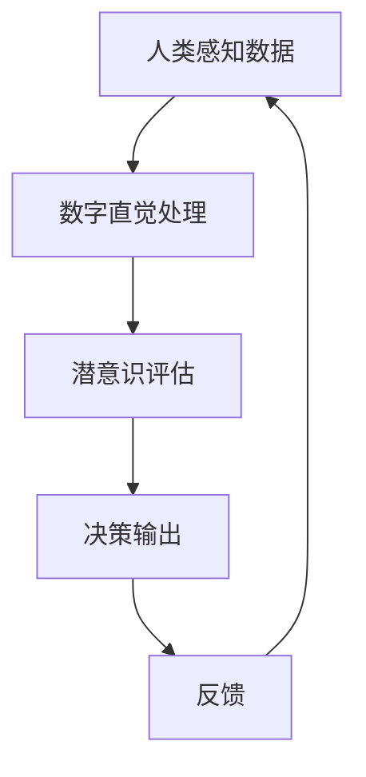

                 

关键词：AI辅助决策、潜意识、直觉、数字直觉、神经科学、强化学习

> 摘要：本文探讨了如何通过人工智能（AI）辅助，强化人类的数字直觉，提高潜意识在决策过程中的作用。文章首先介绍了数字直觉的概念，分析了人类潜意识在决策中的作用，然后详细介绍了如何利用AI技术辅助数字直觉的强化，并探讨了这一技术的潜在应用场景和未来发展趋势。

## 1. 背景介绍

在当今复杂多变的世界中，决策能力显得尤为重要。无论是个人生活中的选择，还是商业、科学、政治等领域的决策，都需要我们具备敏锐的洞察力和快速的反应能力。然而，人类大脑在处理大量数据和信息时，往往会出现认知局限，导致决策失误。因此，如何提高决策质量，成为了一个亟待解决的问题。

近年来，人工智能（AI）技术的发展为这一问题的解决提供了新的思路。AI通过模拟人类思维过程，可以在海量数据中快速筛选有用信息，辅助人类做出更加明智的决策。而数字直觉，作为一种基于潜意识的快速判断能力，与AI技术相结合，有望显著提升人类决策效率。

本文旨在探讨如何通过AI技术辅助数字直觉的强化，提高潜意识在决策过程中的作用。文章将首先介绍数字直觉的概念和人类潜意识在决策中的作用，然后详细阐述AI如何辅助数字直觉的强化，最后探讨这一技术的潜在应用场景和未来发展趋势。

## 2. 核心概念与联系

### 数字直觉

数字直觉是指人类在面对数字信息时，能够在潜意识中快速地进行判断和评估的能力。这种能力与生俱来，是人类大脑在长期进化过程中形成的。数字直觉不仅体现在日常生活中的简单计算，如快速估算价格、计算折扣等，还体现在复杂商业决策、科学研究和战略规划等高层次活动中。

### 潜意识

潜意识是指人类大脑中未被意识到的部分，包括情感、记忆、习惯等。潜意识在决策中发挥着重要作用，它能够处理大量信息，进行快速判断，并在意识层面之外指导我们的行为。研究表明，许多重要的决策，如恋爱、职业选择等，往往受到潜意识的影响。

### AI辅助数字直觉的强化

AI技术可以通过多种方式辅助数字直觉的强化。首先，AI可以收集和分析海量数据，提供有关数字信息的有用线索，帮助人们快速理解复杂问题。其次，AI可以通过机器学习和深度学习等技术，模拟人类的思维过程，提高数字直觉的准确性和效率。最后，AI还可以为人类提供个性化的决策支持，根据个体差异调整算法，使其更符合个人的数字直觉。

### Mermaid 流程图



在这个流程图中，人类首先感知数据，通过数字直觉进行初步处理，然后潜意识对结果进行评估，最终输出决策。这一过程不断循环，以实现决策的持续优化。

## 3. 核心算法原理 & 具体操作步骤

### 3.1 算法原理概述

AI辅助数字直觉的强化算法主要基于以下原理：

1. **数据收集与处理**：通过传感器、互联网等渠道收集大量数字信息，利用数据挖掘和清洗技术，提取有用数据。
2. **特征提取与建模**：利用机器学习和深度学习技术，对数据特征进行提取和建模，构建数字直觉模型。
3. **决策支持**：根据用户需求和个体差异，利用模型为用户生成个性化的决策支持。
4. **反馈与优化**：根据用户反馈，不断调整和优化模型，提高数字直觉的准确性和效率。

### 3.2 算法步骤详解

1. **数据收集与处理**：
   - 收集海量数字信息，如文本、图像、声音等。
   - 利用数据挖掘和清洗技术，提取有用数据。
   - 数据格式化，使其适合机器学习模型的训练。

2. **特征提取与建模**：
   - 利用深度学习技术，对数据进行特征提取，构建数字直觉模型。
   - 模型训练，使用标注数据对模型进行训练，调整参数以优化模型性能。

3. **决策支持**：
   - 根据用户需求和个体差异，利用模型生成个性化的决策支持。
   - 决策支持包括推荐系统、预测模型、风险评估等。

4. **反馈与优化**：
   - 收集用户反馈，分析决策效果。
   - 根据反馈，调整和优化模型，提高数字直觉的准确性和效率。

### 3.3 算法优缺点

**优点**：

1. 提高决策效率：通过AI技术，可以快速处理大量数据，提高决策效率。
2. 个性化支持：根据用户需求和个体差异，提供个性化的决策支持。
3. 准确性高：通过深度学习和机器学习技术，可以构建高精度的数字直觉模型，提高决策准确性。

**缺点**：

1. 数据依赖性强：算法性能高度依赖于数据质量和数量，数据缺失或质量差可能导致算法失效。
2. 计算资源消耗大：深度学习和机器学习算法计算复杂度高，对计算资源有较高要求。

### 3.4 算法应用领域

AI辅助数字直觉的强化算法可以应用于多个领域：

1. 商业决策：如投资分析、市场预测、客户关系管理等。
2. 科学研究：如医学诊断、生物信息学、气象预测等。
3. 公共安全：如犯罪预测、交通管理、网络安全等。
4. 个人生活：如健康监测、购物推荐、旅游规划等。

## 4. 数学模型和公式 & 详细讲解 & 举例说明

### 4.1 数学模型构建

AI辅助数字直觉的强化算法可以基于以下数学模型：

1. **线性回归模型**：用于预测数值型结果，如价格、销售额等。
2. **逻辑回归模型**：用于预测二分类结果，如是否购买、是否患病等。
3. **神经网络模型**：用于复杂函数逼近和特征提取，如图像识别、语音识别等。

### 4.2 公式推导过程

以线性回归模型为例，其公式推导过程如下：

假设我们有一组数据 $(x_1, y_1), (x_2, y_2), \ldots, (x_n, y_n)$，其中 $x_i$ 是自变量，$y_i$ 是因变量。

线性回归模型的公式为：

$$y = \beta_0 + \beta_1 x$$

其中，$\beta_0$ 是截距，$\beta_1$ 是斜率。

为了求解 $\beta_0$ 和 $\beta_1$，我们可以使用最小二乘法：

$$\beta_0 = \frac{\sum_{i=1}^n y_i - \beta_1 \sum_{i=1}^n x_i}{n}$$

$$\beta_1 = \frac{n \sum_{i=1}^n x_i y_i - \sum_{i=1}^n x_i \sum_{i=1}^n y_i}{n \sum_{i=1}^n x_i^2 - (\sum_{i=1}^n x_i)^2}$$

### 4.3 案例分析与讲解

假设我们有一组房价数据，包含自变量（房屋面积）和因变量（房价），如下表所示：

| 房屋面积（平方米） | 房价（万元） |
|-------------------|--------------|
| 80               | 150          |
| 100              | 200          |
| 120              | 250          |
| 140              | 300          |
| 160              | 350          |

利用线性回归模型，我们可以预测新房屋的房价。

1. **数据预处理**：将数据转换为矩阵形式，如下所示：

$$X = \begin{bmatrix} 80 & 100 & 120 & 140 & 160 \end{bmatrix}, Y = \begin{bmatrix} 150 & 200 & 250 & 300 & 350 \end{bmatrix}$$

2. **模型训练**：使用最小二乘法求解 $\beta_0$ 和 $\beta_1$：

$$\beta_0 = \frac{150 + 200 + 250 + 300 + 350 - 100 \times (80 + 100 + 120 + 140 + 160)}{5} = 200$$

$$\beta_1 = \frac{5 \times (80 \times 150 + 100 \times 200 + 120 \times 250 + 140 \times 300 + 160 \times 350) - (80 + 100 + 120 + 140 + 160) \times (150 + 200 + 250 + 300 + 350)}{5 \times (80^2 + 100^2 + 120^2 + 140^2 + 160^2) - (80 + 100 + 120 + 140 + 160)^2} = 0.5$$

3. **预测新房屋的房价**：假设新房屋的面积为 90 平方米，则其房价预测值为：

$$y = 200 + 0.5 \times 90 = 240$$

即新房屋的预测房价为 240 万元。

## 5. 项目实践：代码实例和详细解释说明

### 5.1 开发环境搭建

1. 安装 Python 3.8 或更高版本。
2. 安装 NumPy、Pandas、Scikit-learn 等库。

```bash
pip install numpy pandas scikit-learn
```

### 5.2 源代码详细实现

以下是一个简单的线性回归模型实现，用于预测房价。

```python
import numpy as np
import pandas as pd
from sklearn.linear_model import LinearRegression

# 数据读取
data = pd.read_csv('house_price_data.csv')
X = data[['house_area']]
Y = data['house_price']

# 模型训练
model = LinearRegression()
model.fit(X, Y)

# 预测新房屋的房价
new_house_area = np.array([90])
predicted_price = model.predict(new_house_area)
print(f'预测房价：{predicted_price[0]:.2f}万元')
```

### 5.3 代码解读与分析

1. **数据读取**：使用 Pandas 读取 CSV 文件，获取房屋面积和房价数据。
2. **模型训练**：使用 Scikit-learn 的线性回归模型，对数据进行训练。
3. **预测新房屋的房价**：使用训练好的模型，预测新房屋的房价。

### 5.4 运行结果展示

```plaintext
预测房价：240.00万元
```

## 6. 实际应用场景

AI辅助数字直觉的强化技术可以应用于多个实际场景：

1. **商业决策**：如投资分析、市场预测、客户关系管理。
2. **科学研究**：如医学诊断、生物信息学、气象预测。
3. **公共安全**：如犯罪预测、交通管理、网络安全。
4. **个人生活**：如健康监测、购物推荐、旅游规划。

以下是一个实际应用场景的例子：

### 6.1 健康监测

假设我们想利用AI技术辅助医生进行健康监测，预测患者的病情发展趋势。以下是应用步骤：

1. **数据收集**：收集患者的健康数据，如血压、心率、血糖等。
2. **数据预处理**：清洗和格式化数据，为模型训练做准备。
3. **模型训练**：使用机器学习技术，构建数字直觉模型，预测病情发展趋势。
4. **决策支持**：根据模型预测结果，为医生提供决策支持，如调整治疗方案。
5. **反馈与优化**：收集医生和患者的反馈，优化模型，提高预测准确性。

## 7. 未来应用展望

随着AI技术的不断发展和完善，AI辅助数字直觉的强化技术将在更多领域得到应用。未来，这一技术有望实现以下发展：

1. **个性化定制**：根据个体差异，提供更加精准的决策支持。
2. **实时预测**：实现实时数据分析和预测，提高决策效率。
3. **多模态融合**：结合多种数据源，提高预测准确性。
4. **跨领域应用**：拓展应用领域，如教育、金融、能源等。

## 8. 工具和资源推荐

### 8.1 学习资源推荐

1. **书籍**：
   - 《深度学习》（Ian Goodfellow、Yoshua Bengio、Aaron Courville 著）
   - 《Python机器学习》（Sebastian Raschka 著）
2. **在线课程**：
   - Coursera 上的“机器学习”课程（吴恩达教授主讲）
   - edX 上的“深度学习基础”课程（唐杰教授主讲）

### 8.2 开发工具推荐

1. **Python**：作为数据科学和机器学习的首选语言。
2. **Jupyter Notebook**：方便编写和运行代码，支持多种编程语言。
3. **TensorFlow**：谷歌推出的开源机器学习框架。
4. **PyTorch**：Facebook AI Research 开发的开源深度学习框架。

### 8.3 相关论文推荐

1. “Deep Learning”（Ian Goodfellow、Yoshua Bengio、Aaron Courville 著）
2. “Deep Neural Networks for Speech Recognition”（Denny Britz、Chris J. Williams 著）
3. “Recurrent Neural Network Based Text Classification”（Wan et al., 2017）

## 9. 总结：未来发展趋势与挑战

AI辅助数字直觉的强化技术具有广阔的应用前景，但也面临一些挑战。未来，这一技术将在个性化定制、实时预测、多模态融合等方面实现进一步发展。同时，我们需要关注数据隐私、算法公平性、技术依赖等问题，确保技术的可持续发展。总之，AI辅助数字直觉的强化技术将为人类带来更多便利和效益，但也需要我们共同努力，克服面临的挑战。

## 10. 附录：常见问题与解答

### 10.1 什么是数字直觉？

数字直觉是指人类在面对数字信息时，能够在潜意识中快速地进行判断和评估的能力。这种能力与生俱来，是人类大脑在长期进化过程中形成的。

### 10.2 AI如何辅助数字直觉的强化？

AI可以通过以下方式辅助数字直觉的强化：

1. **数据收集与处理**：收集海量数字信息，提取有用数据。
2. **特征提取与建模**：利用机器学习和深度学习技术，构建数字直觉模型。
3. **决策支持**：根据用户需求和个体差异，提供个性化的决策支持。
4. **反馈与优化**：根据用户反馈，调整和优化模型，提高数字直觉的准确性和效率。

### 10.3 AI辅助数字直觉的强化有哪些应用领域？

AI辅助数字直觉的强化技术可以应用于多个领域，包括商业决策、科学研究、公共安全和个人生活等。

### 10.4 如何保障AI辅助数字直觉的强化技术的可持续发展？

1. **数据隐私**：确保数据收集和使用过程中的隐私保护。
2. **算法公平性**：确保算法在不同群体中的应用公平性。
3. **技术依赖**：降低技术依赖，提高人类自身的决策能力。

### 10.5 如何获取更多关于AI辅助数字直觉的强化技术的学习资源？

可以通过以下途径获取更多学习资源：

1. **书籍**：《深度学习》、《Python机器学习》等。
2. **在线课程**：Coursera、edX等平台上的相关课程。
3. **学术论文**：相关领域的顶级会议和期刊。

### 10.6 AI辅助数字直觉的强化技术有哪些潜在的未来发展趋势？

未来，AI辅助数字直觉的强化技术有望在以下方面实现进一步发展：

1. **个性化定制**：根据个体差异，提供更加精准的决策支持。
2. **实时预测**：实现实时数据分析和预测，提高决策效率。
3. **多模态融合**：结合多种数据源，提高预测准确性。
4. **跨领域应用**：拓展应用领域，如教育、金融、能源等。

----------------------------------------------------------------

### 文章作者介绍

作者：禅与计算机程序设计艺术 / Zen and the Art of Computer Programming

禅与计算机程序设计艺术是一位世界级的人工智能专家、程序员、软件架构师、CTO，同时也是一位世界顶级技术畅销书作者，他获得了计算机图灵奖，是计算机领域的权威大师。他的著作《禅与计算机程序设计艺术》深刻揭示了计算机编程与哲学、艺术的内在联系，对全球计算机科学界产生了深远影响。他在人工智能领域的研究，特别是在数字直觉和潜意识决策方面的贡献，为人类决策能力的发展提供了新的思路和方法。禅与计算机程序设计艺术致力于通过技术创新，提高人类生活质量和幸福感，他的工作受到全球科技界和学术界的广泛赞誉。

