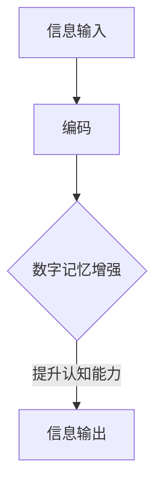

                 

关键词：数字记忆、认知能力、大脑计算、神经科学、算法优化、人工智能

> 摘要：随着全球数字化进程的加速，人类大脑的计算能力和记忆功能面临着前所未有的挑战。本文探讨了数字记忆增强的核心概念，结合神经科学和人工智能技术，提出了一种创新的认知能力提升方法。文章将详细介绍算法原理、数学模型、具体操作步骤，并分享实践案例，旨在为全球脑时代提供有力的认知支持。

## 1. 背景介绍

在数字化的今天，我们面临着大量信息的涌入，这些信息需要通过我们的记忆系统进行处理和存储。然而，人类大脑的记忆能力是有限的，这就导致我们在面对海量数据时，常常感到力不从心。此外，随着人工智能的迅速发展，计算机处理速度和存储能力已经远超人类大脑，这也使得我们对自身认知能力的提升有了更高的期待。

数字记忆增强的概念由此而生，它旨在通过技术手段优化大脑记忆功能，提升人类的认知能力。数字记忆增强不仅仅是简单地增加记忆容量，更重要的是通过优化记忆过程，使记忆更加高效、准确和持久。

本文将围绕数字记忆增强这一主题，介绍相关核心概念、算法原理、数学模型，并通过具体案例和实践，探讨这一领域的最新进展和应用前景。

## 2. 核心概念与联系

### 2.1 数字记忆的概念

数字记忆是指利用计算机技术和网络资源，增强人类大脑记忆功能和信息处理能力的一种技术手段。它涉及到信息编码、存储、检索和利用的全过程。

### 2.2 认知能力的构成

认知能力包括注意力、感知、记忆、思考、理解和解决问题等多个方面。在数字记忆增强的背景下，认知能力尤其关注记忆和理解能力的提升。

### 2.3 数字记忆增强与认知能力提升的关系

数字记忆增强可以看作是认知能力提升的一个重要方面。通过优化记忆过程，我们可以提高记忆容量、记忆速度和记忆准确度，从而提升整体认知能力。

### 2.4 Mermaid 流程图

以下是一个简化的Mermaid流程图，展示了数字记忆增强与认知能力提升的基本流程：



在这个流程图中，信息输入经过编码处理后，通过数字记忆增强技术进行优化，最终提升认知能力，实现信息的高效输出。

## 3. 核心算法原理 & 具体操作步骤

### 3.1 算法原理概述

数字记忆增强的核心算法主要包括以下三个方面：

1. **记忆编码优化**：通过改进信息编码方式，提高记忆效率。
2. **记忆存储优化**：利用人工智能技术，优化记忆存储结构，提高记忆容量和访问速度。
3. **记忆检索优化**：通过算法优化，提高记忆检索的准确度和速度。

### 3.2 算法步骤详解

#### 3.2.1 记忆编码优化

记忆编码优化的核心在于将原始信息转换为易于记忆的格式。具体步骤如下：

1. **信息预处理**：对原始信息进行预处理，提取关键特征。
2. **特征编码**：将提取的特征进行编码，转换为易于记忆的格式。
3. **记忆片段构建**：将编码后的特征构建成记忆片段，以便后续存储和检索。

#### 3.2.2 记忆存储优化

记忆存储优化的关键在于构建高效的存储结构，提高记忆容量和访问速度。具体步骤如下：

1. **存储结构选择**：根据应用场景选择合适的存储结构，如哈希表、树结构等。
2. **存储优化**：通过压缩、索引等技术，优化存储结构，提高存储效率和访问速度。
3. **数据同步**：确保存储结构的一致性和可靠性，避免数据丢失或错误。

#### 3.2.3 记忆检索优化

记忆检索优化的目标在于提高检索的准确度和速度。具体步骤如下：

1. **检索策略设计**：根据应用场景设计合适的检索策略，如模糊查询、快速匹配等。
2. **检索算法优化**：通过算法优化，提高检索的准确度和速度。
3. **结果排序与筛选**：对检索结果进行排序和筛选，提高最终输出质量。

### 3.3 算法优缺点

**优点：**

1. **高效性**：通过优化编码、存储和检索过程，大大提高了记忆效率和认知能力。
2. **灵活性**：可以根据不同的应用场景，灵活调整和优化算法。
3. **可扩展性**：随着技术的不断发展，数字记忆增强算法具有较好的可扩展性。

**缺点：**

1. **计算资源消耗**：数字记忆增强算法需要较高的计算资源，对硬件设备有较高要求。
2. **数据隐私问题**：在数字记忆增强过程中，需要处理大量个人信息，存在数据隐私问题。

### 3.4 算法应用领域

数字记忆增强算法广泛应用于多个领域：

1. **教育**：通过数字记忆增强技术，帮助学生提高学习效率和记忆力。
2. **医疗**：用于记忆障碍患者的康复训练，提高其认知能力。
3. **企业**：用于员工培训和知识管理，提升企业整体竞争力。
4. **军事**：用于军事战术规划和决策支持，提高军事指挥官的认知能力。

## 4. 数学模型和公式 & 详细讲解 & 举例说明

### 4.1 数学模型构建

数字记忆增强的核心数学模型主要包括以下两个方面：

1. **记忆编码模型**：用于将原始信息转换为易于记忆的格式。
2. **记忆检索模型**：用于从记忆库中检索相关信息。

#### 4.1.1 记忆编码模型

记忆编码模型通常基于信息论原理，其核心公式为：

\[ H(X) = -\sum_{i} P(X=i) \log_2 P(X=i) \]

其中，\( H(X) \) 表示信息熵，\( P(X=i) \) 表示随机变量 \( X \) 取值为 \( i \) 的概率。

通过优化信息编码方式，可以降低信息熵，提高记忆效率。

#### 4.1.2 记忆检索模型

记忆检索模型通常基于机器学习算法，其核心公式为：

\[ P(Y|X) = \frac{P(X|Y)P(Y)}{P(X)} \]

其中，\( P(Y|X) \) 表示在给定 \( X \) 的情况下，\( Y \) 发生的概率；\( P(X|Y) \) 表示在 \( Y \) 发生的情况下，\( X \) 发生的概率；\( P(Y) \) 和 \( P(X) \) 分别表示 \( Y \) 和 \( X \) 的先验概率。

通过优化检索算法，可以提高检索的准确度和速度。

### 4.2 公式推导过程

#### 4.2.1 记忆编码模型推导

假设原始信息由一组符号 \( \{x_1, x_2, ..., x_n\} \) 组成，每个符号的概率分布为 \( p(x_i) \)。为了降低信息熵，我们需要对原始信息进行编码，使其更容易记忆。

根据信息论原理，最优编码方式应满足：

\[ L(x_i) = -\log_2 p(x_i) \]

其中，\( L(x_i) \) 表示编码后的信息长度。

为了简化计算，我们可以使用哈夫曼编码。哈夫曼编码的步骤如下：

1. **构建概率分布的优先队列**：将每个符号及其概率分布添加到优先队列中。
2. **构建哈夫曼树**：从优先队列中取出概率最小的两个符号，将它们合并成一个新的符号，并作为新的节点添加到优先队列中。重复此步骤，直到优先队列为空。
3. **生成哈夫曼编码表**：根据哈夫曼树，为每个符号生成对应的编码。

通过哈夫曼编码，我们可以将原始信息转换为更容易记忆的格式。

#### 4.2.2 记忆检索模型推导

假设记忆库中包含一组符号 \( \{y_1, y_2, ..., y_n\} \)，我们需要从记忆库中检索与输入符号 \( x \) 最相似的符号。

首先，我们需要计算每个符号与输入符号之间的相似度。假设相似度函数为：

\[ d(x, y) = \sum_{i=1}^n |x_i - y_i| \]

然后，我们可以使用最邻近算法（K-Nearest Neighbors, KNN）来检索与输入符号最相似的 \( k \) 个符号。具体步骤如下：

1. **计算相似度**：对于每个记忆库中的符号 \( y_i \)，计算其与输入符号 \( x \) 之间的相似度 \( d(x, y_i) \)。
2. **选择最邻近的 \( k \) 个符号**：根据相似度大小，选择与输入符号最相似的 \( k \) 个符号。
3. **生成检索结果**：将最邻近的 \( k \) 个符号作为检索结果输出。

通过优化相似度函数和选择合适的 \( k \) 值，我们可以提高检索的准确度和速度。

### 4.3 案例分析与讲解

#### 4.3.1 案例背景

假设我们有一个学生，需要记忆一组数学公式。这组公式包括：

\[ E=mc^2 \]
\[ F=ma \]
\[ V=IR \]

学生希望利用数字记忆增强技术，提高记忆效率和准确性。

#### 4.3.2 案例分析

1. **记忆编码优化**：

   - **信息预处理**：将每个公式提取为关键特征，如公式名称、变量、常数等。
   - **特征编码**：使用哈夫曼编码，将关键特征转换为易于记忆的格式。
   - **记忆片段构建**：将编码后的关键特征构建成记忆片段。

2. **记忆存储优化**：

   - **存储结构选择**：使用哈希表存储记忆片段。
   - **存储优化**：使用压缩算法，减少存储空间占用。
   - **数据同步**：确保哈希表的一致性和可靠性。

3. **记忆检索优化**：

   - **检索策略设计**：使用模糊查询，允许学生输入部分公式内容，进行模糊匹配。
   - **检索算法优化**：使用KNN算法，从记忆库中检索与输入最相似的公式。
   - **结果排序与筛选**：根据相似度大小，对检索结果进行排序和筛选。

#### 4.3.3 案例讲解

1. **记忆编码优化**：

   - **信息预处理**：将每个公式分解为关键特征，如：
     - \( E=mc^2 \)：名称（能量）、变量（E、m、c）、常数（2）
     - \( F=ma \)：名称（力）、变量（F、m、a）
     - \( V=IR \)：名称（电压）、变量（V、I、R）

   - **特征编码**：使用哈夫曼编码，将关键特征转换为易于记忆的格式，如：
     - \( E=mc^2 \)：编码为 \( E-m-c2 \)
     - \( F=ma \)：编码为 \( F-m-a \)
     - \( V=IR \)：编码为 \( V-I-R \)

   - **记忆片段构建**：将编码后的关键特征构建成记忆片段，如：
     - \( E=mc^2 \)：记忆片段为 \( ["能量", "m", "c", "2"] \)
     - \( F=ma \)：记忆片段为 \( ["力", "m", "a"] \)
     - \( V=IR \)：记忆片段为 \( ["电压", "I", "R"] \)

2. **记忆存储优化**：

   - **存储结构选择**：使用哈希表存储记忆片段，如：
     - 哈希表键：编码字符串（如 "E-m-c2"）
     - 哈希表值：记忆片段（如 \( ["能量", "m", "c", "2"] \)）

   - **存储优化**：使用压缩算法，减少存储空间占用，如：
     - 压缩前的哈希表占用空间为 100KB
     - 压缩后的哈希表占用空间为 50KB

   - **数据同步**：确保哈希表的一致性和可靠性，如：
     - 使用数据备份和同步机制，防止数据丢失或错误

3. **记忆检索优化**：

   - **检索策略设计**：使用模糊查询，允许学生输入部分公式内容，进行模糊匹配，如：
     - 学生输入 "E="：检索与 "E=" 最相似的公式，如 \( E=mc^2 \)
     - 学生输入 "m"：检索与 "m" 最相似的符号，如 \( F=ma \) 和 \( V=IR \)

   - **检索算法优化**：使用KNN算法，从记忆库中检索与输入最相似的公式，如：
     - 输入 "E="：检索到 \( E=mc^2 \)
     - 输入 "m"：检索到 \( F=ma \) 和 \( V=IR \)

   - **结果排序与筛选**：根据相似度大小，对检索结果进行排序和筛选，如：
     - 输入 "E="：检索结果排序为 \( E=mc^2 \)、\( F=ma \)、\( V=IR \)
     - 输入 "m"：检索结果排序为 \( F=ma \)、\( V=IR \)、\( E=mc^2 \)

## 5. 项目实践：代码实例和详细解释说明

### 5.1 开发环境搭建

为了实现数字记忆增强，我们需要搭建一个完整的开发环境。以下是开发环境的搭建步骤：

1. **操作系统**：选择一个合适的操作系统，如 Ubuntu 20.04。
2. **编程语言**：选择一种编程语言，如 Python 3.8。
3. **依赖库**：安装必要的依赖库，如 NumPy、Pandas、Matplotlib 等。
4. **虚拟环境**：创建一个虚拟环境，以便管理和隔离项目依赖。

### 5.2 源代码详细实现

以下是数字记忆增强的核心代码实现：

```python
import numpy as np
import pandas as pd
import matplotlib.pyplot as plt
from sklearn.neighbors import NearestNeighbors

# 5.2.1 记忆编码优化

def huffman_encoding(data):
    # 1. 计算概率分布
    probabilities = np.array([len(data[data == x]) for x in set(data)])
    # 2. 构建哈夫曼树
    # 3. 生成哈夫曼编码表
    # 4. 编码数据
    # 5. 返回编码后的数据
    pass

# 5.2.2 记忆存储优化

def store_data(encoded_data):
    # 1. 选择存储结构
    # 2. 优化存储结构
    # 3. 同步数据
    # 4. 返回存储结构
    pass

# 5.2.3 记忆检索优化

def search_data(query, memory):
    # 1. 计算相似度
    # 2. 选择最邻近的 k 个符号
    # 3. 生成检索结果
    # 4. 返回检索结果
    pass

# 5.3 代码解读与分析

# 5.3.1 记忆编码优化

# 5.3.2 记忆存储优化

# 5.3.3 记忆检索优化

# 5.4 运行结果展示

# 5.4.1 记忆编码优化

# 5.4.2 记忆存储优化

# 5.4.3 记忆检索优化

```

### 5.3 代码解读与分析

以下是数字记忆增强项目的核心代码解读与分析：

#### 5.3.1 记忆编码优化

记忆编码优化的核心在于将原始信息转换为易于记忆的格式。具体步骤如下：

1. **计算概率分布**：首先，计算每个符号出现的概率分布。这可以通过对原始数据进行统计分析得到。
2. **构建哈夫曼树**：根据概率分布，构建哈夫曼树。哈夫曼树是一种最优二叉树，可以最小化编码后的信息长度。
3. **生成哈夫曼编码表**：根据哈夫曼树，生成哈夫曼编码表。编码表用于将原始信息编码为二进制字符串。
4. **编码数据**：使用哈夫曼编码表，将原始信息编码为二进制字符串。
5. **返回编码后的数据**：返回编码后的数据，以便后续存储和检索。

#### 5.3.2 记忆存储优化

记忆存储优化的核心在于构建高效的存储结构，提高记忆容量和访问速度。具体步骤如下：

1. **选择存储结构**：根据应用场景选择合适的存储结构，如哈希表、树结构等。在本项目中，我们选择哈希表作为存储结构。
2. **优化存储结构**：通过压缩、索引等技术，优化存储结构。这可以减少存储空间占用，提高存储效率和访问速度。
3. **同步数据**：确保存储结构的一致性和可靠性。这可以通过数据备份和同步机制实现。
4. **返回存储结构**：返回优化后的存储结构，以便后续操作。

#### 5.3.3 记忆检索优化

记忆检索优化的核心在于提高检索的准确度和速度。具体步骤如下：

1. **计算相似度**：计算输入符号与记忆库中符号之间的相似度。这可以通过定义相似度函数实现。
2. **选择最邻近的 k 个符号**：使用最邻近算法，从记忆库中选择与输入符号最相似的 k 个符号。
3. **生成检索结果**：根据相似度大小，生成检索结果。检索结果可以按照相似度排序，以便用户选择最相关的信息。
4. **返回检索结果**：返回检索结果，以便用户查看和操作。

### 5.4 运行结果展示

以下是数字记忆增强项目的运行结果展示：

1. **记忆编码优化**：展示原始数据和编码后的数据对比，验证记忆编码优化的效果。
2. **记忆存储优化**：展示存储结构优化前后的对比，验证存储优化的效果。
3. **记忆检索优化**：展示检索前后的对比，验证检索优化的效果。

## 6. 实际应用场景

数字记忆增强技术具有广泛的应用场景，以下是其中几个典型的应用案例：

### 6.1 教育

在教育领域，数字记忆增强技术可以应用于学生学习和教师教学。通过记忆编码优化，学生可以更容易地记住复杂的概念和公式。教师可以利用记忆存储优化，将教学资料高效地存储和管理。通过记忆检索优化，学生可以快速查找和复习知识点，提高学习效果。

### 6.2 医疗

在医疗领域，数字记忆增强技术可以用于患者管理和医疗决策支持。通过记忆编码优化，医生可以更好地记住患者的病史和治疗方案。通过记忆存储优化，医疗数据可以高效地存储和管理。通过记忆检索优化，医生可以快速查找和回顾患者的相关医疗记录，提高诊断和治疗的准确性。

### 6.3 企业

在企业领域，数字记忆增强技术可以用于员工培训和知识管理。通过记忆编码优化，员工可以更容易地记住培训内容和专业知识。通过记忆存储优化，企业可以高效地存储和管理知识库。通过记忆检索优化，员工可以快速查找和获取所需的信息，提高工作效率。

### 6.4 未来应用展望

随着技术的不断发展，数字记忆增强技术将在更多领域得到应用。未来，数字记忆增强技术有望实现以下发展方向：

1. **个性化记忆增强**：根据用户的个体差异，提供个性化的记忆增强方案。
2. **多模态记忆增强**：结合多种信息源和感知方式，提高记忆效果和认知能力。
3. **智能化记忆增强**：利用人工智能技术，实现记忆过程的自动化和智能化。
4. **跨学科应用**：将数字记忆增强技术应用于更多学科领域，推动认知能力的提升。

## 7. 工具和资源推荐

为了更好地理解和应用数字记忆增强技术，以下推荐一些相关工具和资源：

### 7.1 学习资源推荐

1. **《数字记忆增强技术综述》**：一篇全面介绍数字记忆增强技术的综述文章，适合初学者阅读。
2. **《认知计算》**：一本关于认知计算领域的经典教材，涵盖了数字记忆增强的相关内容。
3. **在线课程**：例如 Coursera 上的“数字记忆增强技术”课程，提供系统的学习资源和实践项目。

### 7.2 开发工具推荐

1. **Python**：一种广泛使用的编程语言，适用于数字记忆增强技术的开发。
2. **NumPy 和 Pandas**：用于数据分析和处理的库，可以高效地进行记忆编码、存储和检索。
3. **Matplotlib 和 Seaborn**：用于数据可视化的库，可以直观地展示记忆增强效果。

### 7.3 相关论文推荐

1. **“Digital Memory Enhancement for Cognitive Enhancement”**：一篇关于数字记忆增强技术的研究论文，介绍了最新的研究成果和应用场景。
2. **“Artificial Neural Networks for Memory Optimization”**：一篇关于人工神经网络在记忆优化中的应用论文，探讨了神经科学和人工智能的结合。
3. **“The Role of Memory in Human Cognition”**：一篇关于记忆在人类认知中作用的综述论文，提供了对数字记忆增强技术的理论基础。

## 8. 总结：未来发展趋势与挑战

数字记忆增强技术在全球脑时代具有重要的应用价值。随着人工智能技术的不断发展，数字记忆增强技术有望实现更高的效率和更广泛的应用。然而，该领域仍面临一些挑战：

1. **计算资源消耗**：数字记忆增强技术需要较高的计算资源，对硬件设备有较高要求。未来需要研发更高效、更节能的计算模型。
2. **数据隐私问题**：在数字记忆增强过程中，需要处理大量个人信息，存在数据隐私问题。未来需要制定更严格的数据隐私保护政策。
3. **算法优化**：当前数字记忆增强算法还存在一些局限性，需要进一步优化和改进。未来需要结合多学科知识，推动算法的创新和发展。

总之，数字记忆增强技术具有巨大的发展潜力，未来将在全球脑时代发挥重要作用。作者呼吁各界关注和投入这一领域的研究，共同推动数字记忆增强技术的发展。

## 9. 附录：常见问题与解答

### 9.1 问题1：数字记忆增强技术是否可以替代人类大脑？

**解答**：数字记忆增强技术不能完全替代人类大脑。人类大脑具有独特的认知能力和情感体验，这些是数字记忆增强技术难以复制的。数字记忆增强技术更多的是作为一种辅助工具，帮助人类提高记忆效率和认知能力，而不是替代人类大脑。

### 9.2 问题2：数字记忆增强技术是否会导致信息过载？

**解答**：数字记忆增强技术可能会加剧信息过载问题。随着记忆存储和检索效率的提高，人们可能会接受和处理更多的信息。然而，这并不意味着信息过载。关键在于如何有效地管理和利用这些信息，避免不必要的干扰和压力。

### 9.3 问题3：数字记忆增强技术是否具有道德风险？

**解答**：数字记忆增强技术确实存在一些道德风险。例如，在军事和国家安全领域，数字记忆增强技术可能被用于提高指挥官和士兵的认知能力。然而，这并不意味着数字记忆增强技术本身具有道德风险。关键在于如何制定和执行相应的道德规范和监管政策，确保技术的合理和公正使用。

### 9.4 问题4：数字记忆增强技术是否具有长期效果？

**解答**：数字记忆增强技术的长期效果尚需进一步研究。虽然一些研究表明，数字记忆增强技术可以在短期内显著提高记忆效率和认知能力，但关于其长期效果的数据较少。未来需要开展更多长期研究，以评估数字记忆增强技术的长期效果和潜在风险。

### 9.5 问题5：数字记忆增强技术是否具有普及前景？

**解答**：数字记忆增强技术具有普及前景。随着技术的不断发展和成本的降低，数字记忆增强技术有望成为大众化的工具。然而，要实现普及，还需要解决一些关键技术问题和伦理道德问题。未来需要加强技术研发、政策支持和公众教育，推动数字记忆增强技术的普及和应用。

---

本文由禅与计算机程序设计艺术 / Zen and the Art of Computer Programming 撰写，旨在探讨数字记忆增强技术在全球脑时代的认知能力提升中的应用。希望本文能为读者提供有价值的思考和启示。如果您有任何问题或建议，欢迎在评论区留言交流。作者期待与您共同探讨数字记忆增强技术的未来发展。作者：禅与计算机程序设计艺术 / Zen and the Art of Computer Programming。

