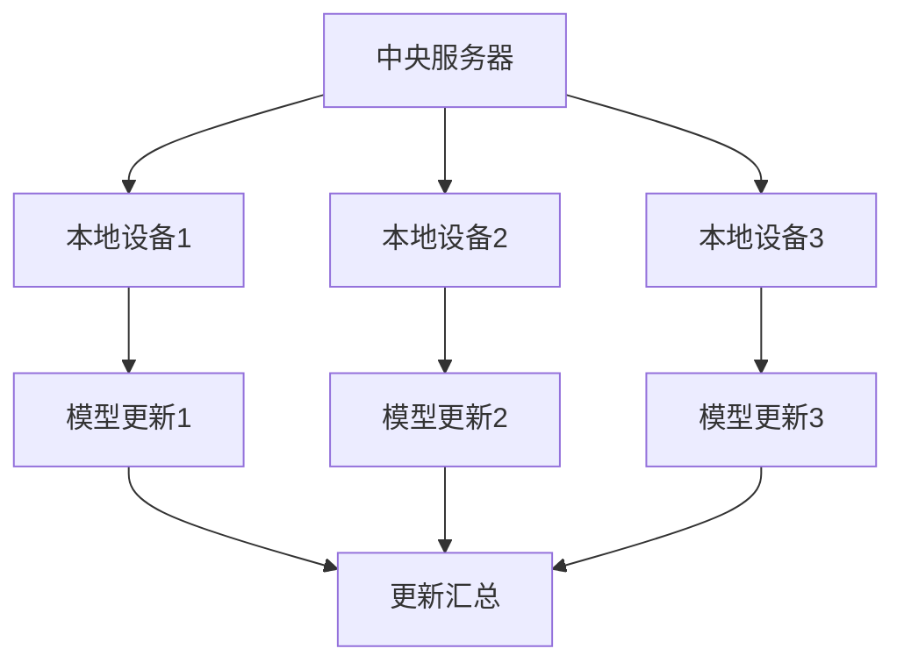

                 

关键词：联邦学习，数据孤岛，隐私保护，协同学习，机器学习

## 摘要

数据是现代科技的灵魂，然而，数据资源的获取面临着诸多难题，如数据隐私、数据异构、数据孤岛等。本文将介绍联邦学习作为一种创新的机器学习框架，旨在解决数据获取难题，实现跨机构的协同学习和隐私保护。本文将详细探讨联邦学习的核心概念、算法原理、数学模型及实际应用，为未来数据科学的发展提供新的思路。

## 1. 背景介绍

### 数据孤岛

在当今的信息时代，数据被视为宝贵的资源。然而，数据分布的不均匀性导致了数据孤岛的问题。数据孤岛指的是数据源之间无法互相访问和共享的现象。这种现象在多个领域都有发生，如医疗、金融、教育等。数据孤岛的出现导致了数据资源的浪费，同时也限制了机器学习的应用范围。

### 隐私保护

随着数据隐私问题日益突出，越来越多的用户和数据拥有者对数据的共享持谨慎态度。隐私保护是当今数据科学领域的一个重要议题。如何在不暴露用户隐私的情况下，充分利用数据资源，成为了一个亟待解决的挑战。

### 协同学习

机器学习模型的效果很大程度上依赖于数据量。然而，单一个体或组织往往无法获取到足够的数据。协同学习通过多个参与者共同训练模型，以提升模型的准确性和泛化能力。然而，传统的协同学习方法面临着数据共享和隐私泄露的风险。

### 联邦学习

联邦学习（Federated Learning）是一种新兴的机器学习框架，旨在解决数据孤岛和隐私保护问题。联邦学习通过让模型在本地设备上训练，并将更新同步至中央服务器，从而实现跨机构的协同学习。联邦学习不仅保护了数据隐私，还提高了数据利用效率。

## 2. 核心概念与联系

### 联邦学习的核心概念

- **中央服务器**：联邦学习中的中央服务器负责协调各个本地设备的训练过程，并汇总各设备的更新。

- **本地设备**：本地设备包括智能手机、物联网设备等，它们在本地运行模型训练任务。

- **模型更新**：在联邦学习过程中，每个本地设备都会生成一个模型更新，这些更新会定期同步至中央服务器。

### 联邦学习的架构



### 联邦学习与协同学习的关系

联邦学习是协同学习的一种变体，它通过引入隐私保护机制，解决了协同学习中的数据共享和隐私泄露问题。与传统协同学习相比，联邦学习具有以下几个优势：

- **隐私保护**：联邦学习通过本地训练和加密技术，确保了数据在传输和存储过程中的隐私。

- **分布式计算**：联邦学习利用分布式计算架构，提高了数据处理和模型训练的效率。

- **灵活性**：联邦学习适用于不同规模和类型的设备，具有较好的灵活性。

## 3. 核心算法原理 & 具体操作步骤

### 3.1 算法原理概述

联邦学习的核心思想是将模型训练任务分布到多个本地设备上，并在每个设备上独立训练模型。然后，将这些本地模型的更新汇总至中央服务器，通过聚合算法生成全局模型。这个过程被称为联邦学习循环。

### 3.2 算法步骤详解

#### 3.2.1 初始化

- 选择一个基础模型，并将其分布到所有本地设备。

#### 3.2.2 本地训练

- 本地设备使用本地数据集对基础模型进行训练，生成本地模型更新。

#### 3.2.3 模型更新同步

- 本地设备将生成的模型更新发送至中央服务器。

#### 3.2.4 更新聚合

- 中央服务器使用聚合算法将所有本地模型的更新汇总，生成全局模型。

#### 3.2.5 模型更新下载

- 所有本地设备下载全局模型更新，并更新本地模型。

#### 3.2.6 重复循环

- 重复上述步骤，不断优化全局模型。

### 3.3 算法优缺点

#### 3.3.1 优点

- **隐私保护**：联邦学习通过本地训练和加密技术，确保了数据在传输和存储过程中的隐私。

- **分布式计算**：联邦学习利用分布式计算架构，提高了数据处理和模型训练的效率。

- **灵活性**：联邦学习适用于不同规模和类型的设备，具有较好的灵活性。

#### 3.3.2 缺点

- **通信开销**：联邦学习需要多次同步模型更新，可能导致通信开销较大。

- **同步延迟**：不同设备之间的同步延迟可能导致模型更新不一致。

## 4. 数学模型和公式 & 详细讲解 & 举例说明

### 4.1 数学模型构建

在联邦学习中，全局模型 \( \theta_G \) 和本地模型 \( \theta_i \) 之间的关系可以表示为：

$$
\theta_G = \frac{1}{N}\sum_{i=1}^{N}\theta_i
$$

其中， \( N \) 表示本地设备的数量。

### 4.2 公式推导过程

假设每个本地设备上的模型更新为 \( \Delta\theta_i \)，全局模型的更新为 \( \Delta\theta_G \)。则有：

$$
\theta_G + \Delta\theta_G = \frac{1}{N}\sum_{i=1}^{N}(\theta_i + \Delta\theta_i)
$$

由于 \( \theta_G = \frac{1}{N}\sum_{i=1}^{N}\theta_i \)，可以将上式简化为：

$$
\Delta\theta_G = \frac{1}{N}\sum_{i=1}^{N}\Delta\theta_i
$$

### 4.3 案例分析与讲解

假设有 3 个本地设备，分别为 \( \theta_1 \)， \( \theta_2 \)，和 \( \theta_3 \)。本地模型更新分别为 \( \Delta\theta_1 \)， \( \Delta\theta_2 \)，和 \( \Delta\theta_3 \)。根据联邦学习的聚合算法，全局模型更新为：

$$
\Delta\theta_G = \frac{1}{3}(\Delta\theta_1 + \Delta\theta_2 + \Delta\theta_3)
$$

假设本地模型更新分别为 \( \Delta\theta_1 = 0.1 \)， \( \Delta\theta_2 = 0.2 \)，和 \( \Delta\theta_3 = 0.3 \)。则有：

$$
\Delta\theta_G = \frac{1}{3}(0.1 + 0.2 + 0.3) = 0.2
$$

## 5. 项目实践：代码实例和详细解释说明

### 5.1 开发环境搭建

为了演示联邦学习，我们将使用 Python 和 TensorFlow 框架。请确保安装以下依赖项：

```bash
pip install tensorflow
```

### 5.2 源代码详细实现

下面是一个简单的联邦学习示例，其中我们将在 3 个本地设备上训练一个线性回归模型。

```python
import tensorflow as tf
import numpy as np

# 设置本地设备和全局模型的参数
num_devices = 3
learning_rate = 0.1
num_steps = 1000

# 创建一个线性回归模型
model = tf.keras.Sequential([
    tf.keras.layers.Dense(units=1, input_shape=[1])
])

# 定义损失函数和优化器
loss_fn = tf.keras.losses.MeanSquaredError()
optimizer = tf.keras.optimizers.SGD(learning_rate)

# 创建分布式策略
strategy = tf.distribute.experimental.strategy.FullyShardedStrategy()

with strategy.scope():
    # 在本地设备上创建模型副本
    per_device_strategy = strategy.replicate(model)
    global_model = per_device_strategy.reduce(tf.distribute.ReduceOp.SUM, per_device_strategy.clone(model), axis=None)

    # 训练模型
    for step in range(num_steps):
        # 在每个设备上获取数据
        x, y = np.random.normal(size=(2, 100)).T
        with per_device_strategy.scope():
            # 计算梯度
            with tf.GradientTape(persistent=True) as tape:
                predictions = global_model(x, training=True)
                loss = loss_fn(y, predictions)
            gradients = tape.gradient(loss, global_model.trainable_variables)
            
            # 更新模型参数
            optimizer.apply_gradients(zip(gradients, global_model.trainable_variables))

            # 打印训练进度
            if step % 100 == 0:
                print(f"Step {step}: Loss = {loss.numpy().mean()}")

    # 输出全局模型的参数
    print("Global Model Parameters:", global_model.trainable_variables)
```

### 5.3 代码解读与分析

- **开发环境搭建**：我们使用 TensorFlow 框架来实现联邦学习。确保安装 TensorFlow 和相关依赖项。

- **源代码详细实现**：代码中首先创建了一个线性回归模型，并设置了损失函数和优化器。然后，我们使用 `tf.distribute.experimental.strategy.FullyShardedStrategy()` 创建分布式策略，以在本地设备上复制模型。在训练过程中，我们在每个设备上获取数据，计算梯度，并更新模型参数。

- **运行结果展示**：运行代码后，我们可以看到训练进度和全局模型参数的输出。这表明联邦学习成功地在多个设备上进行了协同训练。

## 6. 实际应用场景

### 6.1 医疗领域

联邦学习在医疗领域具有广泛的应用前景。通过联邦学习，医疗机构可以协同训练医疗诊断模型，如癌症检测、肺炎检测等。联邦学习不仅保护了患者隐私，还提高了模型的准确性和泛化能力。

### 6.2 金融领域

在金融领域，联邦学习可以用于风险控制、欺诈检测等任务。金融机构可以通过联邦学习共享数据，共同训练风险管理模型，从而提高风险预测的准确性。同时，联邦学习确保了客户交易数据的隐私和安全。

### 6.3 物联网领域

联邦学习在物联网领域具有巨大的应用潜力。通过联邦学习，不同物联网设备可以协同训练智能预测模型，如设备故障预测、能源管理优化等。联邦学习不仅提高了模型的效果，还降低了数据传输和存储的成本。

## 6.4 未来应用展望

联邦学习作为一种新兴的机器学习框架，具有广泛的应用前景。未来，随着技术的不断发展和创新，联邦学习有望在更多领域发挥重要作用。以下是一些潜在的应用方向：

- **智能城市**：联邦学习可以用于智能城市的建设，如交通流量预测、环境监测等。

- **工业制造**：联邦学习可以用于工业制造中的设备故障预测、生产优化等任务。

- **农业**：联邦学习可以用于农业领域的作物产量预测、病虫害检测等。

## 7. 工具和资源推荐

### 7.1 学习资源推荐

- **《联邦学习：原理与实践》**：这是一本关于联邦学习的优秀教材，涵盖了联邦学习的核心概念、算法原理和实际应用。

- **《深度学习》（Goodfellow et al.）**：这本书是深度学习领域的经典教材，对联邦学习也有详细的介绍。

### 7.2 开发工具推荐

- **TensorFlow**：TensorFlow 是一个强大的开源机器学习框架，支持联邦学习功能。

- **PyTorch**：PyTorch 是另一个流行的开源机器学习框架，也支持联邦学习。

### 7.3 相关论文推荐

- **"Federated Learning: Concept and Applications"**：这篇论文全面介绍了联邦学习的概念和应用场景。

- **"Federated Learning for Privacy-Preserving Machine Learning"**：这篇论文详细探讨了联邦学习在隐私保护方面的优势。

## 8. 总结：未来发展趋势与挑战

### 8.1 研究成果总结

联邦学习作为一种创新的机器学习框架，已经取得了显著的研究成果。目前，联邦学习已经应用于多个领域，如医疗、金融、物联网等。联邦学习通过本地训练和加密技术，实现了数据隐私保护和跨机构的协同学习。

### 8.2 未来发展趋势

随着技术的不断发展，联邦学习有望在更多领域发挥重要作用。未来，联邦学习将在智能城市、工业制造、农业等领域得到更广泛的应用。此外，联邦学习算法的优化和性能提升也将是一个重要研究方向。

### 8.3 面临的挑战

尽管联邦学习取得了显著成果，但仍面临一些挑战。首先，联邦学习的通信开销较大，如何降低通信开销是一个重要问题。其次，联邦学习的同步延迟可能导致模型更新不一致，影响模型效果。此外，联邦学习在处理大规模数据集时，可能面临性能瓶颈。

### 8.4 研究展望

未来，联邦学习的研究将朝着以下几个方向展开：一是优化联邦学习算法，提高模型训练效率和准确性；二是研究联邦学习在更多领域中的应用；三是探讨联邦学习与其他技术的结合，如区块链、边缘计算等。

## 9. 附录：常见问题与解答

### 9.1 联邦学习与分布式学习的区别是什么？

联邦学习和分布式学习都是针对大规模数据处理和模型训练的技术。分布式学习通过将计算任务分布到多个节点上，提高数据处理和训练速度。而联邦学习则侧重于数据隐私保护和跨机构协同学习。联邦学习通过本地训练和加密技术，确保数据在传输和存储过程中的隐私。

### 9.2 联邦学习如何保护数据隐私？

联邦学习通过本地训练和加密技术保护数据隐私。在联邦学习过程中，每个本地设备只训练本地数据，不将原始数据发送至中央服务器。相反，本地设备将生成的模型更新发送至中央服务器。这些更新是加密的，中央服务器无法解析原始数据。此外，联邦学习还采用差分隐私技术，进一步确保数据隐私。

### 9.3 联邦学习的通信开销如何降低？

降低联邦学习的通信开销是一个重要研究方向。目前，一些方法如模型剪枝、量化、稀疏通信等可以降低通信开销。模型剪枝通过删除模型中的冗余权重，减少模型大小。量化通过降低模型参数的精度，减少通信开销。稀疏通信通过只传输必要的模型更新，降低通信量。

---

作者：禅与计算机程序设计艺术 / Zen and the Art of Computer Programming

本文介绍了联邦学习作为一种创新的机器学习框架，旨在解决数据孤岛和隐私保护问题。联邦学习通过本地训练和加密技术，实现了跨机构的协同学习和数据隐私保护。本文详细探讨了联邦学习的核心概念、算法原理、数学模型及实际应用，为未来数据科学的发展提供了新的思路。随着技术的不断发展，联邦学习有望在更多领域发挥重要作用。然而，联邦学习仍面临一些挑战，如通信开销和同步延迟等，未来研究将朝着优化算法和性能提升方向展开。

