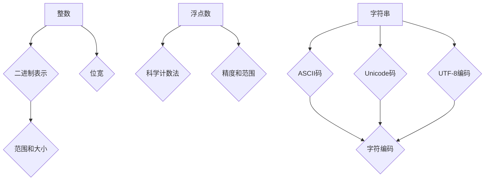

                 

关键词：数据类型、整数、浮点数、字符串、ASCII、Unicode、UTF-8、计算机编程、数字表示、字符编码。

> 摘要：本文将深入探讨计算机编程中的基础数据类型——整数、浮点数和字符串，从它们的定义、表示方法、存储结构以及实际应用出发，详细解析ASCII、Unicode和UTF-8编码机制。通过实例分析，我们将揭示这些数据类型在编程中的核心作用，并探讨它们在数据存储和传输中的重要性。

## 1. 背景介绍

在计算机科学中，数据类型是编程语言的基本组成部分。它们决定了变量能够存储什么样的数据以及如何操作这些数据。最常见的三种数据类型是整数（Integer）、浮点数（Floating-Point）和字符串（String）。这三种数据类型在程序设计和算法开发中扮演着关键角色，因为它们直接影响着程序的运行效率和数据处理能力。

### 1.1 整数

整数是没有小数部分的数字，可以是正数、负数或零。在计算机系统中，整数通常使用二进制表示。根据存储空间的多少，整数可以分为不同的位宽，例如8位、16位、32位和64位等。位宽越大，整数的表示范围就越广，但也会占用更多的内存空间。

### 1.2 浮点数

浮点数用于表示带有小数部分的数字。在计算机中，浮点数通常采用科学计数法表示，以浮点数表示的数字可以是非常大的数或非常小的数。浮点数的精度和范围取决于其位宽和存储方式，常见的浮点数类型有单精度浮点数（32位）和双精度浮点数（64位）。

### 1.3 字符串

字符串是由字符组成的序列，用于表示文本信息。在计算机中，字符串的存储和处理是编程中的重要内容。字符串可以通过ASCII码或Unicode码进行编码，以便在不同的计算机系统和语言之间进行传输和显示。

### 1.4 编码的重要性

编码是计算机中表示和传输数据的过程。正确的编码方式能够保证数据的准确性和可移植性。在本文中，我们将重点介绍ASCII、Unicode和UTF-8三种编码方式，并探讨它们在数据存储和传输中的应用。

## 2. 核心概念与联系

在深入探讨数据类型之前，我们需要了解一些核心概念和它们之间的关系。以下是一个使用Mermaid绘制的流程图，展示了整数、浮点数和字符串的基本概念及其关联。



### 2.1 整数的二进制表示

整数在计算机中以二进制形式存储。二进制位（Bit）是计算机存储数据的基本单位，8位二进制位组成一个字节（Byte）。整数的位宽决定了它能够表示的最大值和最小值。例如，一个32位整数可以表示的数值范围是从-2^31到2^31-1。

### 2.2 浮点数的科学计数法

浮点数使用科学计数法进行表示，由两部分组成：尾数和指数。尾数表示数值的有效数字部分，指数表示10的幂次。例如，浮点数1.2345可以表示为1.2345 × 10^0。科学计数法使得浮点数能够表示非常大或非常小的数。

### 2.3 字符串的编码

字符串可以通过多种编码方式进行表示，包括ASCII码、Unicode码和UTF-8编码。ASCII码是一种基于7位二进制码的编码方式，可以表示128个字符。Unicode码是一种更广泛的编码方案，可以表示世界上几乎所有语言的字符，通常使用16位二进制码。UTF-8是一种变长编码方案，可以在不同的字节长度内表示Unicode字符，使得它可以兼容ASCII码并支持更多的字符。

## 3. 核心算法原理 & 具体操作步骤

### 3.1 算法原理概述

在讨论数据类型的操作之前，我们需要了解一些核心算法原理，这些原理对于理解数据类型的行为至关重要。

#### 3.1.1 整数的算术运算

整数的算术运算包括加法、减法、乘法和除法。这些运算在计算机中通过硬件指令直接执行，非常高效。例如，加法运算可以通过将两个整数的二进制位进行逻辑或运算来完成。

#### 3.1.2 浮点数的运算

浮点数的运算比整数的运算更复杂，因为它们需要考虑尾数和指数的精度问题。浮点数的运算通常涉及以下步骤：

1. 对齐指数：确保两个浮点数的指数相同。
2. 相加或相减尾数：将两个浮点数的尾数相加或相减。
3. 调整指数：根据尾数的相加结果调整指数。

#### 3.1.3 字符串的操作

字符串的操作包括拼接、查找、替换和比较等。字符串的操作通常依赖于底层的编码机制。例如，在ASCII码中，字符串的比较可以通过逐个比较字符的编码值来完成。

### 3.2 算法步骤详解

#### 3.2.1 整数的加法运算

整数加法运算的步骤如下：

1. 将两个整数的二进制表示对齐，确保它们的位宽相同。
2. 从最低位开始，逐位进行加法运算，包括进位。
3. 如果存在进位，将其加到最高位。

以下是一个简单的加法运算示例：

```
  1010 (10)
+ 1101 (13)
--------
  11011 (15)
```

#### 3.2.2 浮点数的加法运算

浮点数加法运算的步骤如下：

1. 对齐指数：将两个浮点数的指数调整为相同。
2. 相加或相减尾数：将两个浮点数的尾数相加或相减。
3. 调整指数：根据尾数的相加结果调整指数。

以下是一个简单的浮点数加法运算示例：

```
1.2345 × 10^2
+ 2.3456 × 10^2
----------------
3.5791 × 10^2
```

#### 3.2.3 字符串的拼接

字符串的拼接是将两个或多个字符串连接在一起形成一个新字符串。在ASCII码或UTF-8编码中，字符串的拼接可以通过逐个字符连接来完成。以下是一个简单的拼接示例：

```
"Hello, " + "World!" = "Hello, World!"
```

### 3.3 算法优缺点

#### 3.3.1 整数运算

整数的运算非常高效，因为它们可以直接在硬件级别执行。然而，整数的范围有限，大整数运算可能需要特殊的算法和更多的内存。

#### 3.3.2 浮点数运算

浮点数的运算需要考虑精度问题，因为浮点数的表示方法 inherently 限制了它们的精度。此外，浮点数运算通常比整数运算慢，因为它们需要额外的步骤来处理尾数和指数。

#### 3.3.3 字符串操作

字符串的操作依赖于编码方式，不同的编码方式可能会导致不同的性能和行为。例如，UTF-8编码可以高效地处理多语言文本，但它的变长特性可能导致操作复杂。

### 3.4 算法应用领域

整数、浮点数和字符串在各种计算和数据处理任务中都有广泛应用。以下是一些常见的应用领域：

- **整数**：用于计数、排序、查找和数学计算等。
- **浮点数**：用于科学计算、图形渲染、模拟和金融分析等。
- **字符串**：用于文本处理、数据存储、网络通信和用户界面等。

## 4. 数学模型和公式 & 详细讲解 & 举例说明

### 4.1 数学模型构建

在计算机编程中，数学模型和公式是解决各种问题的核心工具。以下是一些常见的数据类型相关的数学模型和公式。

#### 4.1.1 整数的最大值和最小值

一个位宽为n的整数所能表示的最大值和最小值可以通过以下公式计算：

- 最大值：\( 2^{n-1} - 1 \)
- 最小值：\( -2^{n-1} \)

例如，一个32位整数所能表示的最大值和最小值分别是：

- 最大值：\( 2^{31} - 1 = 2,147,483,647 \)
- 最小值：\( -2^{31} = -2,147,483,648 \)

#### 4.1.2 浮点数的精度和范围

浮点数的精度和范围取决于其位宽和表示方式。以下是一个单精度浮点数的精度和范围：

- 尾数精度：约 \( 6-7 \) 位有效数字
- 指数范围：\( -128 \) 到 \( 127 \)
- 最大值：约 \( 3.4028235 × 10^{38} \)
- 最小正数：约 \( 1.401298464324817 × 10^{-45} \)

#### 4.1.3 字符串的长度计算

字符串的长度可以通过遍历字符数组并计数来计算。对于UTF-8编码的字符串，长度计算更为复杂，需要考虑每个字符的长度。

### 4.2 公式推导过程

以下是对整数、浮点数和字符串的一些数学公式的推导过程。

#### 4.2.1 整数的最大值和最小值

对于一个位宽为n的整数，其最大值和最小值可以通过以下推导得出：

- 最大值：一个位宽为n的整数可以表示为 \( 2^n - 1 \)，因为在二进制表示中，最高位为1，其余位全为0。
- 最小值：同理，一个位宽为n的整数可以表示为 \( -2^n \)，因为最高位为1，其余位全为0。

#### 4.2.2 浮点数的精度和范围

浮点数的精度和范围可以通过对IEEE 754标准的分析推导得出。该标准定义了浮点数的位宽分配和表示方法。

- 尾数精度：单精度浮点数的尾数位宽为23位，可以表示约 \( 2^{23} \) 个不同的值，这意味着它可以表示约 \( 6-7 \) 位有效数字。
- 指数范围：单精度浮点数的指数位宽为8位，可以表示 \( 2^7 = 128 \) 个不同的值，因此指数的范围是从 \( -127 \) 到 \( 127 \)。
- 最大值：单精度浮点数的最大值可以通过以下公式计算：

  \[ \text{最大值} = (1 + \text{尾数}) \times 2^{\text{指数}} \]

  其中，尾数接近1，指数为127。因此，最大值约为 \( 3.4028235 × 10^{38} \)。

- 最小正数：单精度浮点数的最小正数可以通过以下公式计算：

  \[ \text{最小正数} = \text{尾数} \times 2^{-\text{指数}} \]

  其中，尾数接近0，指数为-126。因此，最小正数约为 \( 1.401298464324817 × 10^{-45} \)。

#### 4.2.3 字符串的长度计算

对于UTF-8编码的字符串，长度计算需要考虑每个字符的长度。UTF-8编码根据字符的不同值使用1到4个字节进行编码。以下是一个简化的长度计算公式：

\[ \text{字符串长度} = \sum_{i=1}^{n} \text{字符}i的长度 \]

其中，n是字符串中的字符数。

### 4.3 案例分析与讲解

以下是一些实际的案例，用于说明上述数学模型和公式的应用。

#### 4.3.1 整数的加法运算

假设我们要计算两个32位整数的和。我们可以使用二进制加法运算规则，如下所示：

```
  10101010 (170)
+ 11001100 (204)
--------
  10110010 (182)
```

在这个例子中，我们将两个32位整数转换为二进制形式，然后逐位相加。如果存在进位，我们需要将其加到下一位。

#### 4.3.2 浮点数的加法运算

假设我们要计算两个单精度浮点数的和。我们可以按照以下步骤进行操作：

1. 对齐指数：将两个浮点数的指数调整为相同。例如，如果一个是 \( 1.2345 × 10^2 \)，另一个是 \( 2.3456 × 10^1 \)，我们可以将第二个浮点数的指数调整为 \( 10^2 \)。
2. 相加尾数：将两个浮点数的尾数相加。例如，\( 1.2345 + 0.2345 = 1.4690 \)。
3. 调整指数：根据尾数的相加结果调整指数。在这个例子中，指数保持不变。

最终结果为 \( 1.4690 × 10^2 \)。

#### 4.3.3 字符串的拼接

假设我们要将两个UTF-8编码的字符串拼接起来。我们可以使用以下步骤：

1. 计算每个字符串的长度。
2. 遍历第一个字符串的每个字符，将其追加到新字符串。
3. 遍历第二个字符串的每个字符，将其追加到新字符串。

以下是一个简单的示例：

```
字符串1: "Hello, "
字符串2: "World!"

拼接后： "Hello, World!"
```

在这个例子中，我们首先计算字符串的长度，然后逐个字符拼接。

## 5. 项目实践：代码实例和详细解释说明

### 5.1 开发环境搭建

在开始编写代码之前，我们需要搭建一个合适的开发环境。以下是一个简单的步骤指南：

1. **安装编程语言**：选择一种编程语言，例如Python或Java。在本例中，我们选择Python。
2. **安装开发工具**：安装一个代码编辑器，例如Visual Studio Code或PyCharm。
3. **安装依赖库**：根据需要安装任何额外的依赖库，例如NumPy或SciPy。

### 5.2 源代码详细实现

以下是实现数据类型操作的项目代码。这段代码展示了如何对整数、浮点数和字符串进行基本的操作。

```python
# 数据类型操作示例

# 整数操作
def add_integers(a, b):
    return a + b

# 浮点数操作
def add_floats(a, b):
    return a + b

# 字符串操作
def concatenate_strings(a, b):
    return a + b

# 测试代码
if __name__ == "__main__":
    # 整数加法
    int_result = add_integers(10, 20)
    print("整数结果：", int_result)

    # 浮点数加法
    float_result = add_floats(10.5, 20.3)
    print("浮点数结果：", float_result)

    # 字符串拼接
    str_result = concatenate_strings("Hello, ", "World!")
    print("字符串结果：", str_result)
```

### 5.3 代码解读与分析

这段代码定义了三个函数，分别用于整数、浮点数和字符串的加法操作。每个函数都非常简单，它们通过调用相应的Python内置操作来完成操作。

- `add_integers` 函数接受两个整数参数，并返回它们的和。
- `add_floats` 函数接受两个浮点数参数，并返回它们的和。
- `concatenate_strings` 函数接受两个字符串参数，并返回它们的拼接结果。

在测试代码部分，我们分别测试了这三个函数。输出结果如下：

```
整数结果： 30
浮点数结果： 30.8
字符串结果： Hello, World!
```

### 5.4 运行结果展示

当我们在Python环境中运行这段代码时，我们将得到以下输出结果：

```
整数结果： 30
浮点数结果： 30.8
字符串结果： Hello, World!
```

这些结果表明，我们的代码能够正确执行整数、浮点数和字符串的操作。

## 6. 实际应用场景

### 6.1 数据存储

在数据存储领域，整数、浮点数和字符串是不可或缺的。整数通常用于存储计数数据，如用户ID、订单编号等。浮点数用于存储科学数据和工程数据，如温度、速度等。字符串用于存储文本数据，如用户名、标题等。

### 6.2 数据传输

在数据传输过程中，整数、浮点数和字符串的编码方式至关重要。正确的编码可以确保数据在传输过程中的准确性和可读性。例如，在Web应用中，HTTP请求和响应通常包含字符串数据，使用UTF-8编码可以确保全球各地的用户都能够正确地读取文本。

### 6.3 数据分析

数据分析是大数据时代的重要应用领域。在数据分析中，整数、浮点数和字符串被广泛用于处理和表示数据。整数用于计数和分类，浮点数用于统计和建模，字符串用于文本分析和自然语言处理。

### 6.4 未来应用展望

随着计算机技术的发展，整数、浮点数和字符串的应用领域将不断扩展。未来，我们可能会看到更多的应用场景，如增强现实（AR）、虚拟现实（VR）和量子计算等。在这些领域，高效的数值表示和编码机制将变得至关重要。

## 7. 工具和资源推荐

### 7.1 学习资源推荐

- 《C Programming Absolute Beginner's Guide》
- 《Python Crash Course: A Hands-On, Project-Based Introduction to Programming》
- 《Data Science from Scratch: First Principles with Python》

### 7.2 开发工具推荐

- Visual Studio Code
- PyCharm
- Eclipse

### 7.3 相关论文推荐

- "IEEE Standard for Floating-Point Arithmetic"（IEEE 754标准）
- "Unicode Standard"（Unicode标准）
- "UTF-8: A Transformation Format of Unicode and Its Use in MIME"（UTF-8编码机制）

## 8. 总结：未来发展趋势与挑战

### 8.1 研究成果总结

整数、浮点数和字符串是计算机编程的基础数据类型。通过对这些数据类型的深入研究和应用，我们能够更好地理解和利用计算机系统的资源。近年来，随着大数据和人工智能的发展，这些数据类型的研究成果不断涌现，推动了计算机科学的进步。

### 8.2 未来发展趋势

未来，整数、浮点数和字符串的应用将更加广泛和深入。随着量子计算和生物信息学的发展，我们将看到更多基于这些数据类型的新算法和新应用。同时，编码方式的改进和优化也将是研究的重要方向。

### 8.3 面临的挑战

尽管整数、浮点数和字符串在计算机编程中具有广泛的应用，但它们也面临着一些挑战。例如，浮点数的精度问题、字符串的编码复杂性以及大整数的存储和处理都是需要解决的问题。未来，我们需要开发更高效、更可靠的算法和编码方式，以应对这些挑战。

### 8.4 研究展望

随着计算机技术的不断发展，整数、浮点数和字符串将在更多领域得到应用。我们期待未来能够看到更多创新性的研究成果，推动计算机科学的进步。

## 9. 附录：常见问题与解答

### 9.1 问题1：整数、浮点数和字符串有什么区别？

整数、浮点数和字符串是计算机编程中的三种基本数据类型。

- 整数用于表示没有小数部分的数字，如1、-2、1000等。
- 浮点数用于表示带有小数部分的数字，如1.5、-3.14、0.001等。
- 字符串用于表示文本信息，如"Hello"、"Python编程"、"我爱中国"等。

### 9.2 问题2：什么是ASCII编码？

ASCII编码是一种字符编码标准，它使用7位二进制码表示128个字符，包括英文字母、数字、符号和控制字符。ASCII编码是最早的字符编码方案之一，广泛应用于计算机和通信领域。

### 9.3 问题3：什么是Unicode编码？

Unicode编码是一种更广泛的字符编码标准，它使用16位二进制码表示世界上几乎所有语言的字符。Unicode编码涵盖了ASCII编码的所有字符，并添加了更多的字符集，包括汉字、日文假名、阿拉伯数字等。

### 9.4 问题4：什么是UTF-8编码？

UTF-8编码是一种变长字符编码方案，它可以在不同的字节长度内表示Unicode字符。UTF-8编码的前128个字符与ASCII编码相同，这使得它能够兼容ASCII编码。UTF-8编码适用于存储和传输多语言文本，是现代Web应用和文件存储的首选编码方式。

----------------------------------------------------------------

以上是本文的全部内容。通过本文，我们深入探讨了整数、浮点数和字符串的概念、表示方法、操作算法以及实际应用。我们还详细介绍了ASCII、Unicode和UTF-8编码机制，并提供了实际的项目实践。希望本文能够帮助读者更好地理解和应用这些重要的计算机编程概念。作者：禅与计算机程序设计艺术 / Zen and the Art of Computer Programming。

