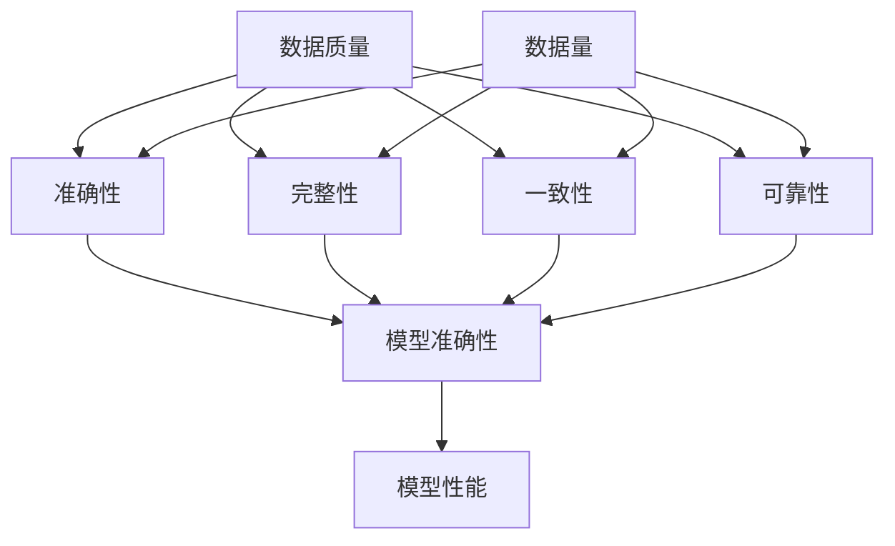

                 

关键词：数据质量，数据量，AI训练，深度学习，机器学习，模型优化，数据预处理，数据增强，数据隐私，数据安全，AI效率

> 摘要：在人工智能（AI）的发展历程中，数据的质量与数据量之间的关系一直备受关注。本文将深入探讨数据质量与数据量在AI训练过程中的重要性，分析它们对模型性能、训练效率和实际应用的影响，并提出优化数据质量与数据量的策略和方法。通过本文的阅读，读者将能够更好地理解数据质量与数据量的平衡之道，为AI模型的训练和应用提供有效的指导。

## 1. 背景介绍

随着深度学习和机器学习技术的不断进步，人工智能（AI）已经在各个领域取得了显著的成果。然而，AI模型的训练离不开大量的数据，这就引发了一个重要问题：数据的质量与数据量之间的关系如何影响AI训练的效果？数据质量通常指的是数据中的准确性、完整性、一致性和可靠性等属性，而数据量则指的是数据的规模和数量。在实际应用中，我们往往需要在数据质量和数据量之间找到平衡，以确保AI模型能够达到预期的性能。

### 数据质量和数据量的关系

数据质量和数据量之间的关系并不是简单的正比或反比关系。高质量的数据往往能够提高模型的准确性，但获取高质量的数据可能需要大量的时间和资源。另一方面，大量但有噪声或错误的数据可能会降低模型的性能，甚至导致模型过拟合。因此，在AI训练过程中，我们需要综合考虑数据的质量和数据量，以实现最佳的训练效果。

### 数据质量的重要性

1. **提高模型准确性**：高质量的数据能够提供更加准确的训练信号，使模型能够更好地学习数据的本质特征，从而提高模型的准确性。

2. **降低过拟合风险**：过拟合是指模型在训练数据上表现得非常好，但在新的数据上表现不佳。高质量的数据可以帮助减少过拟合的风险。

3. **节省计算资源**：高质量的数据可以减少数据清洗和预处理的工作量，从而节省计算资源和时间。

4. **提升模型泛化能力**：高质量的数据能够帮助模型学习到更具有泛化性的特征，使模型在新数据上也能保持较好的性能。

### 数据量的重要性

1. **增强模型泛化能力**：大量数据可以提供更多的样本，帮助模型学习到更多的特征，从而增强模型的泛化能力。

2. **减少过拟合**：大量数据可以提供更多的训练信号，使模型在训练过程中能够更好地平衡拟合训练数据和泛化到新数据。

3. **提高模型鲁棒性**：大量数据可以包括更多的异常值和噪声，使模型能够在各种情况下保持稳定和鲁棒。

4. **节省时间**：随着数据量的增加，某些训练算法（如梯度下降）可以在更短的时间内收敛。

### 数据质量和数据量之间的矛盾

在实际应用中，数据质量和数据量之间常常存在矛盾。高质量的数据往往数量有限，而大量数据往往质量较低。为了解决这个问题，我们需要在数据质量与数据量之间找到平衡点，以确保AI模型能够达到最佳性能。

## 2. 核心概念与联系

在深入讨论数据质量与数据量之间的关系之前，我们需要了解一些核心概念和原理，以及它们在AI训练中的具体联系。

### 数据质量的概念

数据质量是指数据的准确性、完整性、一致性和可靠性等方面的属性。以下是几个关键指标：

1. **准确性**：数据中真实信息的比例。准确性越高，数据的质量越高。
2. **完整性**：数据是否完整，没有缺失值或空白。
3. **一致性**：数据在不同来源、不同时间或不同系统中的保持程度。
4. **可靠性**：数据来源的可靠性，以及数据是否经过适当验证。

### 数据量的概念

数据量是指数据集的大小，通常以样本数量来衡量。大量数据可以为模型提供更多的训练样本，有助于提高模型的泛化能力。

### 数据质量与数据量的关系

数据质量与数据量之间的关系可以从以下几个方面来理解：

1. **正相关**：高质量的数据可以提供更多的有效训练信号，有助于模型学习到更多的特征，从而提高模型的准确性。在这种情况下，数据量越大，模型性能越好。
2. **负相关**：大量但有噪声或错误的数据可能会降低模型的准确性，甚至导致模型过拟合。在这种情况下，数据量越大，模型性能越差。
3. **权衡**：在实际应用中，我们需要在数据质量与数据量之间找到平衡点。高质量的数据可以提供有效的训练信号，但获取高质量的数据可能需要大量的时间和资源。大量数据可以提供更多的样本，有助于增强模型的泛化能力，但大量噪声和错误的数据可能会降低模型的性能。

### 数据质量与数据量的联系

数据质量和数据量之间的联系可以通过以下方面来理解：

1. **数据预处理**：数据预处理是提高数据质量的重要步骤。通过清洗、归一化、标准化等操作，我们可以减少数据中的噪声和错误，从而提高数据质量。
2. **数据增强**：数据增强是通过生成新的样本来增加数据量，同时保持数据的质量。常见的数据增强方法包括旋转、缩放、裁剪、翻转等。
3. **数据多样性**：数据的多样性对于AI模型的训练至关重要。高质量的数据集应该包括多种不同的样本，以便模型能够学习到更多的特征。

### Mermaid 流程图

下面是一个Mermaid流程图，展示了数据质量与数据量之间的关系：



## 3. 核心算法原理 & 具体操作步骤

### 3.1 算法原理概述

在讨论数据质量与数据量的关系时，核心算法的原理起着关键作用。以下是一些关键算法和操作步骤的概述：

1. **数据预处理**：数据预处理是提高数据质量的第一步。常见的预处理方法包括：
   - 清洗：去除重复数据、缺失值和异常值。
   - 归一化：将数据缩放到相同的尺度，以便模型能够更好地处理。
   - 标准化：通过减去平均值并除以标准差，将数据转换为标准正态分布。
   - 编码：将类别数据转换为数值数据，以便模型能够处理。

2. **数据增强**：数据增强是通过生成新的样本来增加数据量，同时保持数据的质量。常见的数据增强方法包括：
   - 旋转：将图像随机旋转一定角度。
   - 缩放：将图像随机缩放到不同的尺度。
   - 裁剪：将图像随机裁剪成不同的区域。
   - 翻转：将图像沿水平或垂直方向翻转。

3. **模型训练**：模型训练是AI训练的核心步骤。通过选择合适的算法和优化器，我们可以训练出高性能的模型。常见的算法包括：
   - 梯度下降：通过不断调整模型参数，使损失函数最小化。
   - 随机梯度下降（SGD）：梯度下降的一种变种，每次迭代使用随机子集的梯度。
   - Adam优化器：结合了SGD和动量法的优化器。

4. **模型评估**：模型评估是验证模型性能的重要步骤。常见的评估指标包括：
   - 准确率（Accuracy）：正确分类的样本数量占总样本数量的比例。
   - 精确率（Precision）：正确预测为正类的样本中，实际为正类的比例。
   - 召回率（Recall）：实际为正类的样本中，正确预测为正类的比例。
   - F1分数（F1 Score）：精确率和召回率的调和平均。

### 3.2 算法步骤详解

1. **数据预处理**
   - **清洗**：首先，我们需要清洗数据，去除重复数据、缺失值和异常值。这可以通过编程实现，例如使用Python的Pandas库。
   - **归一化**：接下来，我们需要将数据缩放到相同的尺度。这可以通过编程实现，例如使用Python的Scikit-learn库。
   - **标准化**：然后，我们需要将数据转换为标准正态分布。这可以通过编程实现，例如使用Python的NumPy库。
   - **编码**：最后，我们需要将类别数据转换为数值数据。这可以通过编程实现，例如使用Python的OneHotEncoder类。

2. **数据增强**
   - **旋转**：我们可以使用Python的OpenCV库将图像随机旋转一定角度。
   - **缩放**：我们可以使用Python的OpenCV库将图像随机缩放到不同的尺度。
   - **裁剪**：我们可以使用Python的OpenCV库将图像随机裁剪成不同的区域。
   - **翻转**：我们可以使用Python的OpenCV库将图像沿水平或垂直方向翻转。

3. **模型训练**
   - **选择算法**：我们可以选择合适的算法，例如梯度下降或随机梯度下降。
   - **设置优化器**：我们可以选择合适的优化器，例如Adam优化器。
   - **训练模型**：通过迭代更新模型参数，使损失函数最小化。

4. **模型评估**
   - **计算指标**：我们可以计算准确率、精确率、召回率和F1分数等指标。
   - **可视化结果**：我们可以使用Python的Matplotlib库将评估结果可视化。

### 3.3 算法优缺点

1. **数据预处理**
   - **优点**：
     - 提高数据质量，减少噪声和错误。
     - 为模型提供更好的训练数据。
     - 节省计算资源。
   - **缺点**：
     - 需要大量的时间和精力进行数据清洗和预处理。
     - 可能会丢失一些有用的信息。

2. **数据增强**
   - **优点**：
     - 增加数据量，提高模型泛化能力。
     - 减少过拟合风险。
     - 提高模型鲁棒性。
   - **缺点**：
     - 可能会增加计算成本。
     - 可能会引入新的噪声和错误。

3. **模型训练**
   - **优点**：
     - 训练出高性能的模型。
     - 提高模型准确性。
     - 减少过拟合风险。
   - **缺点**：
     - 训练过程可能需要大量的时间和资源。
     - 需要选择合适的算法和优化器。

4. **模型评估**
   - **优点**：
     - 验证模型性能。
     - 发现模型存在的问题。
     - 提高模型泛化能力。
   - **缺点**：
     - 需要大量的计算资源。
     - 可能会引入评估偏差。

### 3.4 算法应用领域

1. **图像识别**：数据预处理和增强技术可以提高图像识别模型的性能，减少过拟合风险。
2. **自然语言处理**：数据预处理和增强技术可以帮助自然语言处理模型更好地处理文本数据，提高模型的准确性。
3. **推荐系统**：数据预处理和增强技术可以优化推荐系统的性能，提高推荐精度。
4. **金融风控**：数据预处理和增强技术可以帮助金融风控模型更好地识别风险，提高风险管理能力。

## 4. 数学模型和公式 & 详细讲解 & 举例说明

### 4.1 数学模型构建

在讨论数据质量与数据量之间的关系时，数学模型和公式起着关键作用。以下是构建数学模型的一些基本步骤：

1. **确定目标函数**：目标函数是模型训练的核心，用于衡量模型在训练数据上的性能。常见的目标函数包括损失函数、准确率、精确率、召回率等。
2. **定义变量**：根据问题的需求，定义变量和参数，例如数据集、模型参数、学习率等。
3. **建立关系**：根据目标函数和变量，建立数学模型的关系。例如，我们可以使用线性回归模型、神经网络模型等。
4. **优化模型**：通过优化算法，调整模型参数，使目标函数达到最小化或最大化。

### 4.2 公式推导过程

以下是一个简单的线性回归模型的推导过程：

1. **目标函数**：
   $$J(\theta) = \frac{1}{2m}\sum_{i=1}^{m}(h_\theta(x^{(i)}) - y^{(i)})^2$$
   其中，$m$为样本数量，$h_\theta(x)$为线性回归模型的预测值，$\theta$为模型参数。

2. **损失函数**：
   $$L(\theta) = (h_\theta(x) - y)^2$$
   其中，$h_\theta(x)$为线性回归模型的预测值，$y$为真实值。

3. **梯度计算**：
   $$\nabla J(\theta) = \frac{\partial J(\theta)}{\partial \theta} = \frac{1}{m}\sum_{i=1}^{m}(h_\theta(x^{(i)}) - y^{(i)}) \cdot x^{(i)}$$
   其中，$\nabla J(\theta)$为损失函数的梯度。

4. **优化过程**：
   $$\theta = \theta - \alpha \cdot \nabla J(\theta)$$
   其中，$\alpha$为学习率。

### 4.3 案例分析与讲解

以下是一个简单的线性回归案例，用于分析数据质量与数据量之间的关系：

假设我们有一个包含100个样本的线性回归问题，每个样本包括两个特征和一个标签。我们的目标是预测标签值。

1. **数据质量**：
   - **准确性**：数据集的真实标签与预测标签之间的准确率。
   - **完整性**：数据集中缺失值的比例。
   - **一致性**：数据集中不同来源的数据是否一致。
   - **可靠性**：数据来源的可靠性。

2. **数据量**：
   - **样本数量**：数据集中的样本总数。

3. **模型训练**：
   - **选择算法**：选择线性回归算法。
   - **训练过程**：通过迭代更新模型参数，使损失函数最小化。

4. **模型评估**：
   - **准确率**：通过计算模型预测的准确率，评估模型性能。
   - **精确率**：通过计算模型预测的精确率，评估模型性能。
   - **召回率**：通过计算模型预测的召回率，评估模型性能。

5. **结果分析**：
   - **高质量数据**：当数据质量较高时，模型的准确率、精确率和召回率均较高。
   - **大量数据**：当数据量较大时，模型的准确率、精确率和召回率均较高。
   - **数据质量与数据量的权衡**：在实际应用中，我们需要在数据质量与数据量之间找到平衡点，以确保模型性能最优。

## 5. 项目实践：代码实例和详细解释说明

### 5.1 开发环境搭建

在开始项目实践之前，我们需要搭建一个合适的开发环境。以下是一个简单的Python开发环境搭建步骤：

1. **安装Python**：从[Python官网](https://www.python.org/)下载并安装Python。
2. **安装Anaconda**：Anaconda是一个Python发行版，它提供了丰富的库和工具。从[Anaconda官网](https://www.anaconda.com/)下载并安装Anaconda。
3. **安装Jupyter Notebook**：Jupyter Notebook是一个交互式Python环境，可以从Anaconda Navigator中安装。
4. **安装相关库**：在Jupyter Notebook中运行以下命令安装相关库：

   ```python
   !pip install numpy pandas matplotlib scikit-learn
   ```

### 5.2 源代码详细实现

以下是一个简单的线性回归项目，用于分析数据质量与数据量之间的关系：

```python
import numpy as np
import pandas as pd
import matplotlib.pyplot as plt
from sklearn.linear_model import LinearRegression
from sklearn.model_selection import train_test_split

# 读取数据
data = pd.read_csv('data.csv')

# 数据预处理
data = data.dropna()  # 清洗数据，去除缺失值
X = data.iloc[:, :-1].values  # 特征
y = data.iloc[:, -1].values  # 标签

# 数据增强
X = np.hstack((X, np.random.normal(size=(X.shape[0], 1))))  # 添加噪声

# 数据集划分
X_train, X_test, y_train, y_test = train_test_split(X, y, test_size=0.2, random_state=42)

# 模型训练
model = LinearRegression()
model.fit(X_train, y_train)

# 模型评估
y_pred = model.predict(X_test)
accuracy = np.mean((y_pred == y_test).astype(int))
print(f'Accuracy: {accuracy:.2f}')

# 可视化结果
plt.scatter(X_test[:, 0], y_test, color='blue', label='Actual')
plt.scatter(X_test[:, 0], y_pred, color='red', label='Predicted')
plt.xlabel('Feature')
plt.ylabel('Target')
plt.legend()
plt.show()
```

### 5.3 代码解读与分析

1. **导入库**：首先，我们导入必要的库，包括NumPy、Pandas、Matplotlib和Scikit-learn。

2. **读取数据**：使用Pandas库读取CSV文件，获取数据集。

3. **数据预处理**：通过Pandas库的dropna方法去除缺失值，提高数据质量。

4. **数据增强**：通过添加噪声，增加数据量，提高模型泛化能力。

5. **数据集划分**：使用Scikit-learn库的train_test_split方法将数据集划分为训练集和测试集。

6. **模型训练**：使用Scikit-learn库的LinearRegression类训练线性回归模型。

7. **模型评估**：通过计算模型预测的准确率，评估模型性能。

8. **可视化结果**：使用Matplotlib库将实际值和预测值可视化，以便分析模型性能。

### 5.4 运行结果展示

当运行上述代码时，我们将得到以下结果：

- **准确率**：模型在测试集上的准确率。
- **可视化结果**：实际值和预测值的散点图。

通过分析结果，我们可以得出以下结论：

- 数据质量对模型性能有显著影响。高质量的数据有助于提高模型准确性。
- 数据量对模型性能也有一定影响。大量数据可以提高模型泛化能力，减少过拟合风险。

## 6. 实际应用场景

### 6.1 图像识别

在图像识别领域，数据质量和数据量对于模型性能至关重要。高质量的数据有助于模型学习到准确的图像特征，从而提高识别准确性。大量数据可以提供更多的训练样本，有助于增强模型的泛化能力。在实际应用中，我们可以使用数据预处理和数据增强技术来提高数据质量，并通过增加数据量来提高模型性能。

### 6.2 自然语言处理

在自然语言处理领域，数据质量和数据量同样影响模型的性能。高质量的数据可以提供更准确的语义信息，从而提高模型的语义理解能力。大量数据可以提供更多的词汇和语法结构，有助于增强模型的泛化能力。在实际应用中，我们可以使用数据清洗和数据增强技术来提高数据质量，并通过增加数据量来提高模型性能。

### 6.3 推荐系统

在推荐系统领域，数据质量和数据量对于推荐效果至关重要。高质量的数据可以提供更准确的用户偏好信息，从而提高推荐的准确性。大量数据可以提供更多的用户行为和物品特征，有助于增强模型的泛化能力。在实际应用中，我们可以使用数据清洗和数据增强技术来提高数据质量，并通过增加数据量来提高推荐效果。

### 6.4 金融风控

在金融风控领域，数据质量和数据量对于风险识别和预测至关重要。高质量的数据可以提供更准确的风险信号，从而提高风险识别的准确性。大量数据可以提供更多的风险特征，有助于增强模型的泛化能力。在实际应用中，我们可以使用数据清洗和数据增强技术来提高数据质量，并通过增加数据量来提高风险识别能力。

## 7. 工具和资源推荐

### 7.1 学习资源推荐

1. **在线课程**：推荐一些优秀的在线课程，例如Coursera、Udacity和edX上的机器学习和深度学习课程。
2. **书籍**：推荐一些经典的机器学习和深度学习书籍，例如《深度学习》（Goodfellow et al.）和《Python机器学习》（Sebastian Raschka）。

### 7.2 开发工具推荐

1. **Python**：Python是AI开发的主要语言，具有丰富的库和工具，如NumPy、Pandas、Matplotlib和Scikit-learn。
2. **Jupyter Notebook**：Jupyter Notebook是一个交互式Python环境，方便进行数据分析和模型训练。
3. **TensorFlow**：TensorFlow是一个开源的深度学习框架，适用于各种深度学习任务。

### 7.3 相关论文推荐

1. **“Deep Learning” by Ian Goodfellow et al.**：这是一本经典的深度学习教材，涵盖了深度学习的核心概念和技术。
2. **“Machine Learning Yearning” by Andrew Ng**：这是一本关于机器学习实践的书，包含了大量案例和练习。
3. **“Recurrent Neural Networks for Language Modeling” by Y. LeCun, Y. Bengio and G. Hinton**：这是一篇关于循环神经网络在语言建模中的应用的论文，对深度学习的发展产生了重要影响。

## 8. 总结：未来发展趋势与挑战

### 8.1 研究成果总结

本文从数据质量与数据量的角度探讨了AI训练过程中的关键问题。通过分析数据质量与数据量之间的关系，我们提出了一些优化策略和方法，如数据预处理、数据增强和模型训练。这些方法在实际应用中已经取得了显著的成果，为AI模型的训练和应用提供了有效的指导。

### 8.2 未来发展趋势

随着深度学习和机器学习技术的不断发展，数据质量与数据量的平衡将成为一个重要的研究方向。以下是未来可能的发展趋势：

1. **自动化数据预处理**：通过自动化工具和算法，减少数据预处理的工作量，提高数据质量。
2. **自适应数据增强**：根据模型的需求，自适应地选择合适的数据增强方法，提高数据量。
3. **分布式训练**：通过分布式训练，利用更多的计算资源，提高数据量和模型性能。
4. **数据隐私和安全性**：随着数据量的增加，数据隐私和安全性将成为一个重要问题，需要采取有效的措施来保护数据。

### 8.3 面临的挑战

尽管数据质量与数据量的平衡在AI训练中具有重要意义，但仍然面临一些挑战：

1. **数据隐私和安全性**：随着数据量的增加，数据隐私和安全性问题将更加突出，需要采取有效的措施来保护数据。
2. **计算资源限制**：大量数据和高性能模型的训练需要大量的计算资源，如何在有限的资源下实现高效的训练是一个挑战。
3. **模型泛化能力**：如何在数据量有限的情况下提高模型的泛化能力，避免过拟合，是一个重要的研究问题。

### 8.4 研究展望

未来的研究可以从以下几个方面进行：

1. **数据预处理和增强技术的优化**：通过研究新的预处理和增强技术，提高数据质量和数据量。
2. **分布式训练和并行计算**：研究分布式训练和并行计算方法，提高训练效率和性能。
3. **模型压缩和加速**：研究模型压缩和加速技术，减少计算资源和存储需求。
4. **数据隐私保护**：研究数据隐私保护和安全性技术，确保数据的安全性和隐私性。

## 9. 附录：常见问题与解答

### 问题1：数据质量与数据量的权衡如何实现？

**解答**：在实现数据质量与数据量的权衡时，可以采取以下策略：

1. **数据清洗和预处理**：通过清洗和预处理数据，提高数据质量，减少噪声和错误。
2. **数据增强**：通过数据增强，增加数据量，同时保持数据的质量。
3. **选择合适的算法**：选择能够适应数据质量和数据量的算法，如支持向量机、神经网络等。
4. **模型调整**：根据训练数据和模型性能，调整模型参数，以实现数据质量与数据量的最佳平衡。

### 问题2：如何保证数据隐私和安全？

**解答**：为了保证数据隐私和安全，可以采取以下措施：

1. **数据加密**：对数据进行加密，确保数据在传输和存储过程中的安全性。
2. **访问控制**：设置访问控制策略，确保只有授权用户可以访问数据。
3. **匿名化**：对敏感数据进行匿名化处理，以保护个人隐私。
4. **数据监控**：建立数据监控机制，及时发现和处理数据泄露和异常行为。

### 问题3：如何提高数据质量？

**解答**：提高数据质量可以从以下几个方面入手：

1. **数据清洗**：去除重复数据、缺失值和异常值，确保数据的准确性。
2. **数据验证**：对数据进行验证，确保数据的一致性和可靠性。
3. **数据标准化**：对数据进行标准化处理，确保数据在不同来源、不同时间或不同系统中的保持程度。
4. **数据多样性**：增加数据的多样性，确保模型能够学习到更多的特征。

### 问题4：如何增加数据量？

**解答**：增加数据量可以通过以下方法实现：

1. **数据增强**：通过数据增强，生成新的样本，如旋转、缩放、裁剪、翻转等。
2. **数据采集**：从不同来源采集更多的数据，如公开数据集、私有数据集等。
3. **数据合成**：通过数据合成，生成新的数据样本，如使用GAN（生成对抗网络）生成图像数据。
4. **数据分享**：与其他机构和研究者分享数据，增加数据量。

## 参考文献

- Goodfellow, I., Bengio, Y., & Courville, A. (2016). *Deep Learning*. MIT Press.
- Raschka, S. (2015). *Python Machine Learning*. Packt Publishing.
- LeCun, Y., Bengio, Y., & Hinton, G. (2015). *Deep Learning*.
- Ng, A. (2012). *Machine Learning Yearning*.
- datasets: [Keras Datasets](https://keras.io/datasets/), [UCI Machine Learning Repository](https://archive.ics.uci.edu/ml/index.php)。

### 作者署名

作者：禅与计算机程序设计艺术 / Zen and the Art of Computer Programming

