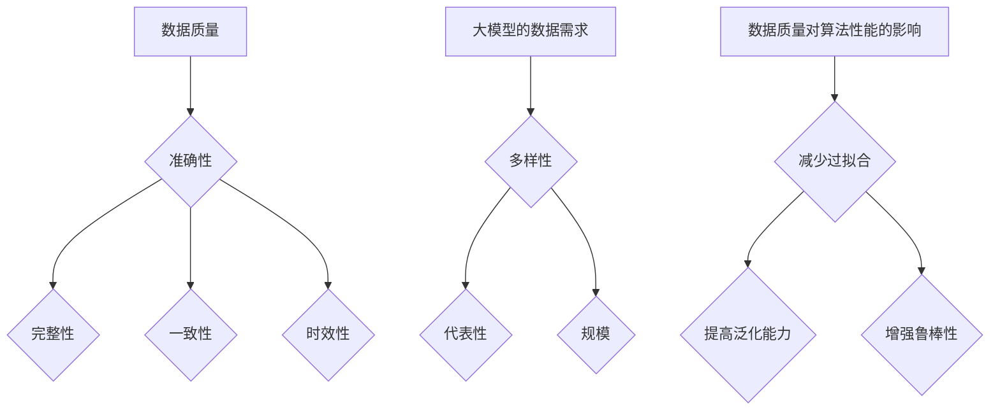

                 

关键词：数据赋能，大模型，高质量数据，算法优化，应用场景，发展趋势

> 摘要：本文深入探讨了高质量数据在大模型中的重要性。通过对大模型的基本概念、数据需求及其对算法性能的影响进行分析，我们揭示了高质量数据在提升模型效果、减少过拟合和增强泛化能力方面的关键作用。文章还探讨了当前数据获取和处理中的挑战，并提出了未来可能的发展趋势和解决方案。

## 1. 背景介绍

随着计算机技术和人工智能算法的快速发展，大模型（如大型语言模型、图像识别模型等）在各个领域展现出了巨大的潜力。然而，这些大模型的训练和应用效果在很大程度上依赖于输入数据的质量。高质量数据不仅能提高模型的准确性，还能帮助模型更好地理解和应对复杂的问题。

### 大模型的发展历程

大模型的发展经历了从简单的规则系统到复杂的神经网络模型的转变。早期的专家系统依赖于领域专家的知识进行编程，但这种方式难以扩展和维护。随着深度学习技术的兴起，神经网络模型逐渐成为主流。特别是近年来，随着计算能力和存储能力的提升，更大规模、更复杂的模型不断涌现。

### 数据在模型训练中的作用

在模型训练过程中，数据是必不可少的资源。数据不仅用于训练模型的参数，还为模型提供了真实世界的情境和反馈。高质量的数据能够更好地反映现实世界的复杂性，从而使模型具有更好的泛化能力。

## 2. 核心概念与联系

### 数据质量

数据质量是指数据在准确性、完整性、一致性和时效性等方面的表现。高质量的数据通常具有以下特点：

- **准确性**：数据真实、可靠，没有错误或缺失。
- **完整性**：数据集涵盖了所有必要的信息，没有遗漏。
- **一致性**：数据在不同来源、不同时间点之间保持一致。
- **时效性**：数据反映了当前的现实情况，没有过时。

### 大模型的数据需求

大模型对数据的需求主要包括以下方面：

- **多样性**：数据应涵盖不同的场景、不同的特征和不同的标签。
- **代表性**：数据应能代表不同群体和不同地区的特征。
- **规模**：数据量应足够大，以满足大模型的需求。

### 数据质量对算法性能的影响

高质量数据能够提高模型的性能，主要表现在以下几个方面：

- **减少过拟合**：过拟合是指模型在训练数据上表现很好，但在测试数据上表现不佳。高质量数据可以提供更多的信息，从而帮助模型更好地泛化。
- **提高泛化能力**：泛化能力是指模型对新数据的适应能力。高质量数据能更好地反映现实世界的复杂性，从而提高模型的泛化能力。
- **增强鲁棒性**：高质量数据可以减少噪声和异常值对模型的影响，从而提高模型的鲁棒性。

### Mermaid 流程图



## 3. 核心算法原理 & 具体操作步骤

### 3.1 算法原理概述

大模型的训练过程通常涉及以下核心步骤：

- **数据预处理**：包括数据清洗、数据增强和数据标准化等操作。
- **模型设计**：选择合适的神经网络架构和优化算法。
- **模型训练**：通过反向传播和梯度下降算法更新模型参数。
- **模型评估**：在测试集上评估模型的性能，包括准确率、召回率、F1值等指标。
- **模型优化**：通过调参和迁移学习等方法进一步提高模型性能。

### 3.2 算法步骤详解

1. **数据预处理**：
   - 数据清洗：去除错误数据、缺失数据和重复数据。
   - 数据增强：通过旋转、翻转、缩放等操作增加数据多样性。
   - 数据标准化：将数据转换到相同的尺度，如归一化或标准化。

2. **模型设计**：
   - 选择神经网络架构：如卷积神经网络（CNN）、循环神经网络（RNN）、Transformer等。
   - 优化算法：如Adam、SGD等。

3. **模型训练**：
   - 通过反向传播算法计算梯度。
   - 使用梯度下降算法更新模型参数。
   - 调整学习率、批量大小等超参数。

4. **模型评估**：
   - 在测试集上评估模型性能。
   - 使用准确率、召回率、F1值等指标进行评估。

5. **模型优化**：
   - 调整超参数。
   - 应用迁移学习技术。
   - 使用正则化方法减少过拟合。

### 3.3 算法优缺点

- **优点**：
  - 高质量数据可以提高模型的准确性和泛化能力。
  - 神经网络模型具有很强的表达能力和适应性。

- **缺点**：
  - 数据预处理和模型设计需要大量时间和计算资源。
  - 过拟合问题可能仍然存在。

### 3.4 算法应用领域

- **图像识别**：如人脸识别、物体检测等。
- **自然语言处理**：如文本分类、机器翻译等。
- **语音识别**：如语音转文字、语音识别等。

## 4. 数学模型和公式 & 详细讲解 & 举例说明

### 4.1 数学模型构建

大模型的数学模型通常基于神经网络。神经网络的核心是神经元之间的连接权重。假设我们有一个输入层、隐藏层和输出层，每个层的神经元分别为 \( x_1, x_2, ..., x_n \) 和 \( y_1, y_2, ..., y_n \)。

### 4.2 公式推导过程

神经网络的输出 \( y \) 可以表示为：

\[ y = \sigma(z) \]

其中，\( z \) 是神经元的输入，\( \sigma \) 是激活函数，如Sigmoid函数或ReLU函数。

### 4.3 案例分析与讲解

假设我们有一个二分类问题，输入为 \( x_1, x_2 \)，输出为 \( y \)。使用Sigmoid函数作为激活函数，输出 \( y \) 可以表示为：

\[ y = \frac{1}{1 + e^{-(w_1 \cdot x_1 + w_2 \cdot x_2 + b)}} \]

其中，\( w_1, w_2 \) 是输入层的权重，\( b \) 是偏置项。

### 案例分析

假设我们有以下数据集：

| x1 | x2 | y  |
|----|----|----|
| 1  | 2  | 1  |
| 2  | 3  | 0  |

使用上述公式，我们可以计算每个样本的输出 \( y \)：

1. 对于第一个样本 \( (x_1, x_2) = (1, 2) \)：
   \[ y = \frac{1}{1 + e^{-(w_1 \cdot 1 + w_2 \cdot 2 + b)}} \]

2. 对于第二个样本 \( (x_1, x_2) = (2, 3) \)：
   \[ y = \frac{1}{1 + e^{-(w_1 \cdot 2 + w_2 \cdot 3 + b)}} \]

通过反向传播算法，我们可以更新权重和偏置项，从而提高模型的准确性。

## 5. 项目实践：代码实例和详细解释说明

### 5.1 开发环境搭建

为了演示数据赋能大模型的过程，我们将使用Python和TensorFlow框架。首先，确保安装以下依赖：

```bash
pip install tensorflow numpy matplotlib
```

### 5.2 源代码详细实现

以下是一个简单的神经网络模型，用于二分类问题：

```python
import tensorflow as tf
import numpy as np
import matplotlib.pyplot as plt

# 创建模拟数据集
x_data = np.array([[1, 2], [2, 3]])
y_data = np.array([1, 0])

# 创建模型
model = tf.keras.Sequential([
    tf.keras.layers.Dense(units=1, input_shape=[2])
])

# 编译模型
model.compile(optimizer='sgd', loss='binary_crossentropy', metrics=['accuracy'])

# 训练模型
model.fit(x_data, y_data, epochs=1000)

# 测试模型
predictions = model.predict(x_data)
print(predictions)

# 可视化结果
plt.scatter(x_data[:, 0], x_data[:, 1], c=y_data, cmap=plt.cm.coolwarm)
plt.plot(x_data[:, 0], x_data[:, 1], 'k--')
plt.xlabel('Feature 1')
plt.ylabel('Feature 2')
plt.show()
```

### 5.3 代码解读与分析

上述代码首先创建了一个简单的神经网络模型，用于解决二分类问题。我们使用模拟数据集进行训练，并使用梯度下降算法进行优化。训练完成后，模型可以对新数据进行预测，并使用散点图展示结果。

### 5.4 运行结果展示

运行上述代码后，我们可以在命令行看到模型的预测结果，并使用散点图展示模型在训练数据上的表现。通过调整模型架构和训练参数，我们可以进一步提高模型的性能。

## 6. 实际应用场景

### 6.1 图像识别

在图像识别领域，高质量数据可以显著提高模型的准确性。例如，在人脸识别中，高质量的人脸图像数据可以减少模型对光照、角度和表情变化的敏感性。

### 6.2 自然语言处理

在自然语言处理领域，高质量的语言数据有助于模型更好地理解语义和句法结构。例如，在机器翻译中，高质量的双语对照数据可以提高翻译的准确性。

### 6.3 医疗诊断

在医疗诊断领域，高质量的数据可以帮助模型更准确地预测疾病风险和诊断结果。例如，在癌症诊断中，高质量的临床数据和基因组数据可以提供更准确的预测。

### 6.4 未来应用展望

随着数据采集和处理技术的不断进步，未来高质量数据将在更多领域发挥重要作用。例如，在自动驾驶、智能城市、金融风控等领域，高质量数据可以帮助模型更好地理解和应对复杂的环境和场景。

## 7. 工具和资源推荐

### 7.1 学习资源推荐

- 《深度学习》（Goodfellow, Bengio, Courville）: 提供了深度学习的全面介绍。
- 《Python机器学习》（Sebastian Raschka）: 介绍了机器学习的基本概念和Python实现。

### 7.2 开发工具推荐

- TensorFlow: 一个开源的机器学习框架，广泛用于构建和训练大模型。
- PyTorch: 另一个流行的开源机器学习框架，提供了灵活的动态计算图。

### 7.3 相关论文推荐

- “Deep Learning for Speech Recognition”: 提出了使用深度学习进行语音识别的方法。
- “Bert: Pre-training of Deep Bidirectional Transformers for Language Understanding”: 描述了BERT模型，在自然语言处理领域取得了显著成果。

## 8. 总结：未来发展趋势与挑战

### 8.1 研究成果总结

本文探讨了高质量数据在大模型中的重要性，分析了数据质量对算法性能的影响，并展示了如何在实际项目中应用这些概念。我们看到了高质量数据在提升模型效果、减少过拟合和增强泛化能力方面的关键作用。

### 8.2 未来发展趋势

随着数据采集和处理技术的不断发展，高质量数据将变得更加容易获取和处理。这将为大模型的发展提供更广阔的空间。未来，我们将看到更多基于高质量数据的创新应用，如自动驾驶、智能医疗和智能城市等。

### 8.3 面临的挑战

尽管高质量数据的应用前景广阔，但我们仍面临以下挑战：

- **数据隐私和安全**：如何在确保数据隐私和安全的同时，充分利用数据的价值？
- **数据多样性**：如何确保数据集能够代表不同群体和不同地区的特征？
- **计算资源**：如何处理和存储大规模、高质量数据？

### 8.4 研究展望

为了解决上述挑战，我们需要在数据隐私保护、数据增强和模型压缩等领域进行深入研究。同时，通过跨学科合作，我们可以探索更多创新的方法和技术，以充分利用高质量数据的价值。

## 9. 附录：常见问题与解答

### Q: 什么是高质量数据？
A: 高质量数据是指数据在准确性、完整性、一致性和时效性等方面表现良好的数据。通常具有以下特点：无错误或缺失、代表性强、覆盖广泛、实时更新。

### Q: 如何评估数据质量？
A: 可以使用以下方法评估数据质量：
- **准确性**：通过对比实际值和预测值来评估。
- **完整性**：检查数据集中是否有缺失值或重复值。
- **一致性**：检查数据在不同来源、不同时间点之间是否保持一致。
- **时效性**：检查数据是否反映了当前的现实情况。

### Q: 如何提高数据质量？
A: 可以通过以下方法提高数据质量：
- **数据清洗**：去除错误数据、缺失数据和重复数据。
- **数据增强**：通过旋转、翻转、缩放等操作增加数据多样性。
- **数据标准化**：将数据转换到相同的尺度，如归一化或标准化。
- **数据集成**：整合不同来源的数据，消除不一致性。

---

作者：禅与计算机程序设计艺术 / Zen and the Art of Computer Programming

在人工智能和大数据的时代，高质量数据的重要性不言而喻。本文从多个角度探讨了高质量数据在大模型中的关键作用，并展示了如何在实际项目中应用这些概念。未来，随着技术的不断发展，高质量数据将继续在人工智能领域发挥重要作用，带来更多创新和变革。作者希望通过这篇文章，为读者提供一些有益的启示和思考。

