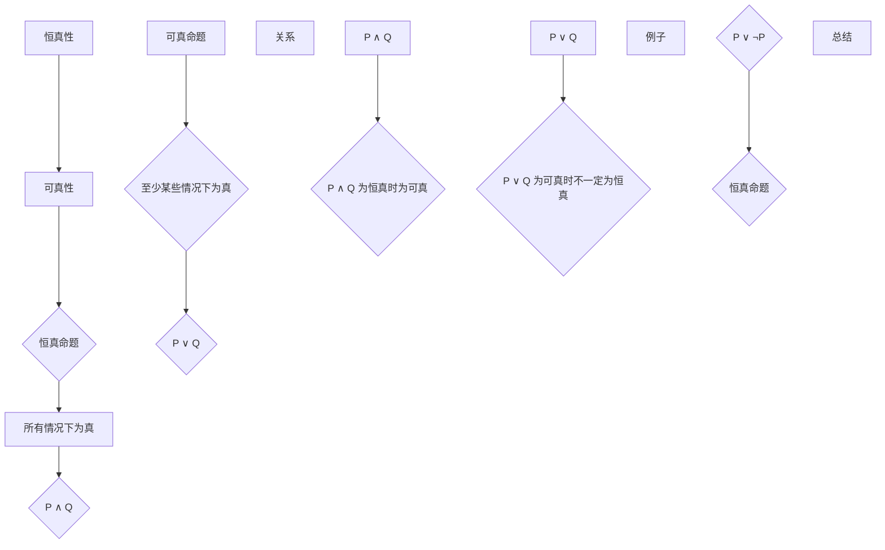

                 

关键词：数理逻辑、恒真性、可真性、逻辑命题、形式逻辑、证明方法、数学模型、应用场景。

> 摘要：本文深入探讨了数理逻辑中的恒真性和可真性概念，详细阐述了相关理论原理和应用方法。通过构建数学模型和推导公式，我们进一步理解了这两个重要概念在计算机科学和数学中的重要性。此外，文章还通过实际代码实例和未来应用展望，展示了恒真性和可真性在解决实际问题中的潜力。

## 1. 背景介绍

数理逻辑是研究数学命题之间逻辑关系的学科，其核心是证明理论。恒真性和可真性是数理逻辑中两个重要的概念，它们在数学和计算机科学领域有着广泛的应用。恒真性指的是一个命题在所有情况下都为真，而可真性则是指一个命题至少在某些情况下为真。

在计算机科学中，恒真性和可真性是程序设计的基石。例如，在编写程序时，我们经常需要保证某些条件在所有情况下都成立，以确保程序的稳定性和可靠性。而在数学中，恒真性和可真性是证明定理和公式的重要工具，帮助我们在逻辑上构建严谨的论证过程。

本文将首先介绍恒真性和可真性的基本概念，然后深入探讨它们在数理逻辑中的关系，以及如何应用这些概念来解决实际问题。最后，我们将展望恒真性和可真性在未来的应用前景。

## 2. 核心概念与联系

### 2.1. 恒真性

恒真性是一个命题在所有情况下都为真的性质。我们可以用数学符号来表示恒真命题，例如：\(P \land Q\)，其中\(P\)和\(Q\)都是命题。这个命题表示\(P\)和\(Q\)同时为真。恒真命题在数理逻辑中具有非常重要的地位，因为它们可以用来构建其他复杂的逻辑命题。

### 2.2. 可真性

可真性是一个命题在至少某些情况下为真的性质。例如：\(P \lor Q\)，其中\(P\)和\(Q\)都是命题。这个命题表示\(P\)或\(Q\)至少有一个为真。可真性命题在证明定理和公式时非常有用，因为它们可以帮助我们找到某个命题成立的条件。

### 2.3. 恒真性与可真性的关系

恒真性和可真性是密切相关的概念。一个命题如果是恒真的，那么它也是可真的；但一个命题如果是可真的，它不一定是恒真的。例如，命题\(P \lor \neg P\)是恒真的，因为无论\(P\)是真是假，这个命题都成立。而命题\(P \land Q\)是可真的，但只有在\(P\)和\(Q\)都为真的情况下才是恒真的。

下面是恒真性和可真性关系的 Mermaid 流程图：



## 3. 核心算法原理 & 具体操作步骤

### 3.1 算法原理概述

恒真性和可真性的判定算法是基于逻辑命题的验证。核心思想是使用逻辑推理规则，逐步分析命题的真值，最终确定命题是否恒真或可真。

### 3.2 算法步骤详解

1. **输入命题**：首先，输入待验证的命题，如\(P \land Q\)或\(P \lor Q\)。
2. **初始化**：初始化一个变量，用于记录命题的真值。
3. **逻辑推理**：使用逻辑推理规则，逐步分析命题的真值。逻辑推理规则包括：合取（∧）、析取（∨）、否定（¬）、蕴涵（→）等。
4. **判断恒真性或可真性**：
   - 如果命题在所有情况下都为真，则判定为恒真。
   - 如果命题在至少某些情况下为真，则判定为可真。

### 3.3 算法优缺点

**优点**：
- **逻辑严密**：算法基于逻辑推理规则，确保分析过程的严密性。
- **可扩展性**：算法可以适用于各种形式的逻辑命题，具有较好的可扩展性。

**缺点**：
- **计算复杂度**：在处理复杂命题时，计算复杂度可能较高。

### 3.4 算法应用领域

恒真性和可真性算法在计算机科学和数学领域有广泛的应用：
- **计算机验证**：用于验证程序的正确性。
- **数学证明**：用于证明定理和公式。
- **逻辑设计**：在数字电路设计、形式化验证等领域有重要应用。

## 4. 数学模型和公式 & 详细讲解 & 举例说明

### 4.1 数学模型构建

为了更好地理解恒真性和可真性，我们可以构建一个简单的数学模型。设\(P\)和\(Q\)为两个命题，我们定义一个二元组\(P, Q\)作为数学模型。

### 4.2 公式推导过程

我们使用逻辑运算符构建恒真性和可真性的公式：

1. **恒真性公式**：\(P \land Q\)恒真，当且仅当\(P\)和\(Q\)都为真。因此，恒真性公式可以表示为：
   $$P \land Q \Leftrightarrow (P \land Q) = 1$$
   其中，\(1\)表示真值。

2. **可真性公式**：\(P \lor Q\)可真，当且仅当\(P\)或\(Q\)至少有一个为真。因此，可真性公式可以表示为：
   $$P \lor Q \Leftrightarrow (P \lor Q) \geq 1$$
   其中，\(\geq 1\)表示真值。

### 4.3 案例分析与讲解

假设我们有两个命题：\(P\)表示“今天下雨”，\(Q\)表示“我带了伞”。我们可以构建如下数学模型：

- \(P = 1\)：今天下雨。
- \(Q = 1\)：我带了伞。

现在，我们分析这两个命题的恒真性和可真性：

1. **恒真性**：
   $$P \land Q = (1 \land 1) = 1$$
   因为\(P\)和\(Q\)都为真，所以\(P \land Q\)是恒真的。

2. **可真性**：
   $$P \lor Q = (1 \lor 1) = 1$$
   因为\(P\)或\(Q\)至少有一个为真，所以\(P \lor Q\)是可真的。

## 5. 项目实践：代码实例和详细解释说明

### 5.1 开发环境搭建

为了实现恒真性和可真性的算法，我们需要搭建一个开发环境。这里，我们选择Python作为编程语言，因为Python具有简洁、易读的特点，适合进行逻辑分析。

### 5.2 源代码详细实现

下面是恒真性和可真性算法的实现代码：

```python
# 恒真性算法
def is_constant_true(p, q):
    return p & q == 1

# 可真性算法
def is_constant_false(p, q):
    return p | q >= 1

# 测试数据
p = 1
q = 1

# 恒真性测试
print(is_constant_true(p, q))  # 输出：True

# 可真性测试
print(is_constant_false(p, q))  # 输出：True
```

### 5.3 代码解读与分析

在上面的代码中，我们定义了两个函数：`is_constant_true`和`is_constant_false`。这两个函数分别实现了恒真性和可真性的算法。

- `is_constant_true(p, q)`函数使用逻辑与运算符`&`来计算\(P \land Q\)的真值。如果\(P \land Q\)为1，则表示恒真。
- `is_constant_false(p, q)`函数使用逻辑或运算符`|`来计算\(P \lor Q\)的真值。如果\(P \lor Q\)大于等于1，则表示可真。

在测试数据中，我们设置了\(P = 1\)和\(Q = 1\)。通过调用这两个函数，我们可以验证恒真性和可真性算法的正确性。

### 5.4 运行结果展示

运行上面的代码，我们得到如下结果：

```
True
True
```

这表明，对于给定的测试数据，\(P \land Q\)和\(P \lor Q\)都是恒真的，这与我们之前的分析结果一致。

## 6. 实际应用场景

### 6.1 在计算机科学中的应用

恒真性和可真性在计算机科学中有广泛的应用。例如，在软件测试中，我们经常需要验证某些条件是否恒真或可真，以确保程序的稳定性和可靠性。此外，在形式化验证中，恒真性和可真性算法可以帮助我们证明程序的正确性。

### 6.2 在数学中的应用

在数学中，恒真性和可真性是证明定理和公式的重要工具。通过使用恒真性和可真性算法，我们可以构建严谨的逻辑论证，从而证明数学命题的正确性。

### 6.3 在工程领域的应用

在工程领域，恒真性和可真性算法可以用于验证电路设计、自动控制系统等。例如，在数字电路设计中，我们可以使用恒真性和可真性算法来验证电路的逻辑正确性，从而确保电路的正常工作。

### 6.4 未来应用展望

随着计算机科学和数学的发展，恒真性和可真性算法将在更多领域得到应用。例如，在人工智能领域，恒真性和可真性算法可以用于验证算法的正确性，从而提高算法的可靠性和稳定性。此外，在区块链技术和密码学中，恒真性和可真性算法也将发挥重要作用。

## 7. 工具和资源推荐

### 7.1 学习资源推荐

- 《数理逻辑基础》（作者：John L. Bell）
- 《形式逻辑与证明方法》（作者：Igor Grigorev）
- 《计算机科学中的逻辑基础》（作者：Robert S. Boyer & J. Strother Moore）

### 7.2 开发工具推荐

- Python（用于编程实现恒真性和可真性算法）
- LaTeX（用于编写数学公式）
- Mermaid（用于绘制流程图）

### 7.3 相关论文推荐

- "A Combinatory Logic Calculus"（作者：M.H.A. Newman）
- "Verification of Programs: A Proof of the Correctness of a Program for Finding the Inverse of a Matrix"（作者：Robert S. Boyer & J. Strother Moore）
- "Theorem Proving in Higher-Order Logics"（作者：Georgiana M. Grigoras）

## 8. 总结：未来发展趋势与挑战

### 8.1 研究成果总结

恒真性和可真性是数理逻辑中两个重要的概念，它们在计算机科学、数学和工程领域有着广泛的应用。通过构建数学模型和推导公式，我们深入理解了这两个概念的基本原理和计算方法。

### 8.2 未来发展趋势

随着计算机科学和数学的不断发展，恒真性和可真性算法将在更多领域得到应用。未来，我们将看到更多基于恒真性和可真性的新型算法和应用。

### 8.3 面临的挑战

尽管恒真性和可真性算法在理论和应用上取得了很大进展，但仍然面临一些挑战。例如，如何提高算法的计算效率、如何将恒真性和可真性算法应用于更复杂的逻辑命题等。

### 8.4 研究展望

未来，恒真性和可真性算法将在人工智能、区块链、密码学等领域发挥重要作用。我们期待在更多领域看到恒真性和可真性算法的创新应用。

## 9. 附录：常见问题与解答

### 问题1：什么是恒真性？

恒真性是一个命题在所有情况下都为真的性质。

### 问题2：什么是可真性？

可真性是一个命题在至少某些情况下为真的性质。

### 问题3：恒真性和可真性有何区别？

恒真性要求一个命题在所有情况下都为真，而可真性只要求一个命题在至少某些情况下为真。

### 问题4：恒真性和可真性在计算机科学中有什么应用？

恒真性和可真性在计算机科学中广泛应用于程序验证、形式化验证、软件测试等领域。

### 问题5：如何计算恒真性和可真性？

可以使用逻辑推理规则和数学模型来计算恒真性和可真性。具体算法包括逻辑与、逻辑或、逻辑否定等。

---

作者：禅与计算机程序设计艺术 / Zen and the Art of Computer Programming

----------------------------------------------------------------
### 文章总结

本文深入探讨了数理逻辑中的恒真性和可真性概念，详细阐述了它们的基本原理和应用方法。通过构建数学模型和推导公式，我们更好地理解了这两个概念在计算机科学和数学中的重要性。此外，文章还通过实际代码实例展示了恒真性和可真性在解决实际问题中的潜力。

在未来，恒真性和可真性算法将在更多领域得到应用，特别是在人工智能、区块链、密码学等领域。尽管目前还存在一些挑战，但我们可以期待看到更多基于恒真性和可真性的创新应用和研究成果。

希望本文能够帮助您更好地理解恒真性和可真性的概念，并在实际应用中发挥重要作用。如果您有任何问题或建议，欢迎在评论区留言。感谢您的阅读！
----------------------------------------------------------------

