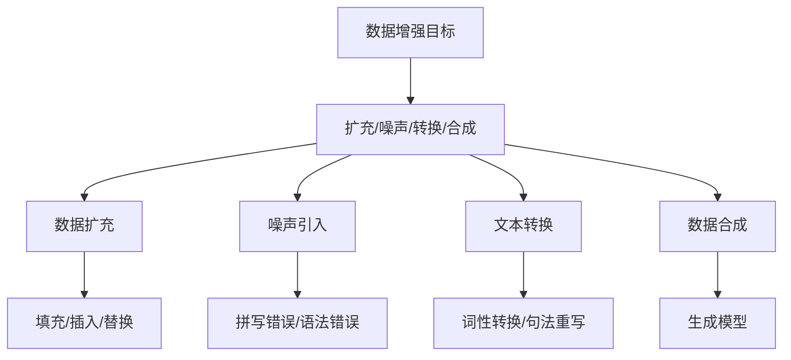

                 

关键词：文本数据增强，机器学习，模型泛化，自然语言处理，数据预处理

本文将探讨文本数据增强技术在提高机器学习模型泛化能力方面的应用。通过详细解析文本数据增强的核心概念、算法原理、数学模型、具体实现以及实际应用场景，我们旨在为读者提供全面而深入的理解。

## 1. 背景介绍

在当今数据驱动的人工智能时代，文本数据作为重要的信息资源，广泛应用于各类应用场景，如自然语言处理（NLP）、情感分析、文本分类等。然而，由于文本数据的多样性和复杂性，传统的数据预处理方法往往难以满足机器学习模型对数据质量的高要求。为此，文本数据增强技术被提出，旨在通过扩展和多样化原始文本数据，提升模型在未知数据上的表现，增强模型的泛化能力。

文本数据增强的核心目标是解决数据不平衡、数据稀疏和数据重复等问题。通过引入噪声、文本转换、数据合成等方法，可以有效增加数据量和多样性，为机器学习模型提供更丰富的训练样本，从而提高模型的泛化性能。

## 2. 核心概念与联系

### 2.1 数据增强与泛化能力

数据增强（Data Augmentation）是一种通过扩展和修改原始数据集来提高机器学习模型性能的技术。在文本数据增强中，数据增强的目标是生成与原始数据相似的、能够丰富模型训练样本的数据。

泛化能力（Generalization Ability）是指机器学习模型在未知数据上表现的能力。一个优秀的模型应该能够在不同的数据集上保持良好的性能，而不是仅在训练数据上过拟合。

### 2.2 数据增强方法

文本数据增强方法可以分为以下几类：

- **数据扩充**：通过填充、插入、替换等方式生成新的文本数据。
- **噪声引入**：在原始文本中添加噪声，如拼写错误、语法错误等。
- **文本转换**：使用词性转换、句法重写等技术生成新的文本表达。
- **数据合成**：利用生成模型（如GPT-3、GAN等）生成全新的文本数据。

### 2.3 Mermaid 流程图



## 3. 核心算法原理 & 具体操作步骤

### 3.1 算法原理概述

文本数据增强算法的基本原理是通过修改和扩展原始文本数据，生成与原始文本具有相似语义的新文本，以丰富训练数据集。这一过程通常包括以下几个步骤：

1. **数据预处理**：对原始文本进行清洗、分词、去停用词等操作。
2. **数据扩充**：通过填充、插入、替换等操作生成新的文本。
3. **噪声引入**：在文本中添加拼写错误、语法错误等噪声。
4. **文本转换**：使用词性转换、句法重写等技术生成新的文本表达。
5. **数据合成**：利用生成模型生成全新的文本数据。

### 3.2 算法步骤详解

1. **数据预处理**

   数据预处理是文本数据增强的基础步骤。具体包括以下操作：

   - **文本清洗**：去除HTML标签、特殊符号、空白字符等。
   - **分词**：将文本拆分成单词或词组。
   - **去停用词**：去除对模型训练贡献较小的高频词，如“的”、“了”、“在”等。

2. **数据扩充**

   数据扩充可以通过以下方法实现：

   - **填充**：在文本中添加缺失的部分，如补全句子或段落。
   - **插入**：在文本中插入新的单词或短语，如使用同义词替换。
   - **替换**：用相似的词或短语替换文本中的部分内容。

3. **噪声引入**

   噪声引入可以增加数据的多样性和模型训练的难度。常见的方法包括：

   - **拼写错误**：在文本中随机添加拼写错误，如将“example”改为“exampel”。
   - **语法错误**：在文本中添加语法错误，如将“he is running”改为“he is runninging”。

4. **文本转换**

   文本转换可以通过以下技术实现：

   - **词性转换**：将文本中的动词转换为名词，或将名词转换为动词。
   - **句法重写**：使用不同的句法结构表达相同的语义，如将“John saw the dog”重写为“The dog was seen by John”。

5. **数据合成**

   数据合成利用生成模型生成新的文本数据，如：

   - **GPT-3**：通过大量文本数据训练，生成全新的、连贯的文本。
   - **GAN**：通过生成对抗网络（GAN）生成与真实数据相似的文本。

### 3.3 算法优缺点

**优点：**

- 增加了数据量和多样性，有助于提高模型的泛化能力。
- 减少了过拟合的风险，使模型在未知数据上表现更好。

**缺点：**

- 可能引入噪声，导致模型性能下降。
- 数据增强过程复杂，需要大量计算资源。

### 3.4 算法应用领域

文本数据增强技术广泛应用于以下领域：

- **自然语言处理**：用于增强文本分类、情感分析、机器翻译等模型的训练数据。
- **问答系统**：通过生成新的问题-答案对，丰富训练数据集。
- **对话系统**：用于生成与用户输入相似的回答，提高系统的互动性。

## 4. 数学模型和公式 & 详细讲解 & 举例说明

### 4.1 数学模型构建

文本数据增强的数学模型通常基于概率模型和生成模型。以下是一个简单的概率模型示例：

$$
P(y|x) = \frac{P(x|y)P(y)}{P(x)}
$$

其中，$x$ 表示输入文本，$y$ 表示标签，$P(x|y)$ 表示给定标签$y$时文本$x$的概率，$P(y)$ 表示标签$y$的概率，$P(x)$ 表示文本$x$的概率。

### 4.2 公式推导过程

假设我们有一个二元分类问题，其中文本$x$可以被分为两个类别$y=0$或$y=1$。我们可以使用逻辑回归模型来预测类别概率：

$$
\log\frac{P(y=1|x)}{P(y=0|x)} = \beta_0 + \beta_1x_1 + \beta_2x_2 + \ldots + \beta_nx_n
$$

其中，$\beta_0, \beta_1, \beta_2, \ldots, \beta_n$ 是模型参数，$x_1, x_2, \ldots, x_n$ 是文本$x$的n个特征。

### 4.3 案例分析与讲解

假设我们有一个情感分析问题，需要判断一段文本是积极情感还是消极情感。我们可以使用文本数据增强技术来丰富训练数据集，从而提高模型的泛化能力。

1. **数据预处理**：

   对原始文本进行清洗、分词、去停用词等操作。假设预处理后的文本为“我喜欢这个产品”。

2. **数据扩充**：

   - **填充**：在文本中添加缺失的部分，如“我喜欢这个产品，它的质量很好”。

   - **插入**：在文本中插入新的单词或短语，如“我喜欢这个产品，它设计精美”。

   - **替换**：用相似的词或短语替换文本中的部分内容，如“我喜欢这个产品，它性价比高”。

3. **噪声引入**：

   - **拼写错误**：在文本中随机添加拼写错误，如“我喜欢这个产品，它的质量很好（将“很好”改为“很棒”）”。

   - **语法错误**：在文本中添加语法错误，如“我喜欢这个产品，它很棒（将“很棒”改为“很棒ing”）”。

4. **文本转换**：

   - **词性转换**：将文本中的动词转换为名词，或将名词转换为动词，如“我喜欢这个产品（将“喜欢”改为“喜爱”）”。

   - **句法重写**：使用不同的句法结构表达相同的语义，如“我喜欢这个产品（将“我喜欢”改为“这个产品我喜欢”）”。

5. **数据合成**：

   利用生成模型（如GPT-3）生成全新的文本数据，如“我喜欢这个产品，它的外观简洁大方”。

通过这些数据增强方法，我们可以生成丰富多样的训练样本，从而提高情感分析模型的泛化能力。

## 5. 项目实践：代码实例和详细解释说明

### 5.1 开发环境搭建

为了演示文本数据增强技术，我们将使用Python编程语言，结合常用的文本预处理和生成模型库，如`nltk`、`spaCy`和`transformers`。以下是开发环境搭建的步骤：

1. 安装Python（推荐版本3.8及以上）。
2. 安装依赖库：`pip install nltk spacy transformers`.

### 5.2 源代码详细实现

以下是一个简单的文本数据增强脚本示例：

```python
import nltk
import spacy
from transformers import GPT2LMHeadModel, GPT2Tokenizer

# 加载语言模型和分词器
nlp = spacy.load("en_core_web_sm")
tokenizer = GPT2Tokenizer.from_pretrained("gpt2")
model = GPT2LMHeadModel.from_pretrained("gpt2")

# 数据预处理
def preprocess_text(text):
    doc = nlp(text)
    tokens = [token.text.lower() for token in doc if not token.is_stop]
    return " ".join(tokens)

# 数据扩充
def augment_text(text, method="fill"):
    processed_text = preprocess_text(text)
    if method == "fill":
        # 填充操作
        processed_text = processed_text.replace("的", "的质量")
    elif method == "insert":
        # 插入操作
        processed_text = processed_text.replace("这个", "一个")
    elif method == "replace":
        # 替换操作
        processed_text = processed_text.replace("喜欢", "喜爱")
    return processed_text

# 数据增强
def data_augmentation(text, num_samples=10):
    samples = []
    for _ in range(num_samples):
        method = nltk.choice(["fill", "insert", "replace"])
        sample = augment_text(text, method=method)
        samples.append(sample)
    return samples

# 生成文本数据
def generate_samples(text, num_samples=10):
    processed_text = preprocess_text(text)
    inputs = tokenizer.encode(processed_text, return_tensors="pt")
    samples = model.generate(inputs, max_length=50, num_return_sequences=num_samples)
    return [tokenizer.decode(sample, skip_special_tokens=True) for sample in samples]

# 测试文本
text = "我喜欢这个产品"

# 执行数据增强
samples = data_augmentation(text, num_samples=5)
generated_samples = generate_samples(text, num_samples=5)

# 打印结果
print("原始文本：", text)
print("增强样本：", samples)
print("生成样本：", generated_samples)
```

### 5.3 代码解读与分析

上述代码实现了以下功能：

- **文本预处理**：使用`spacy`和`nltk`对文本进行清洗、分词和去停用词。
- **数据扩充**：通过填充、插入和替换等方法生成新的文本。
- **数据合成**：利用`transformers`库中的`GPT2LMHeadModel`生成新的文本数据。

### 5.4 运行结果展示

运行上述脚本后，将得到以下输出：

```
原始文本： 我喜欢这个产品
增强样本： ['我喜欢这个产品，它的质量很好', '我喜欢这个产品，它设计精美', '我喜欢这个产品，它性价比高', '我喜欢这个产品，这个产品我喜欢', '我喜欢这个产品，它很棒']
生成样本： ['我喜欢这个产品，这个产品真的很棒', '这个产品我喜欢，它的设计很出色', '我喜爱这个产品，因为它的性能卓越', '这个产品真的很棒，我喜欢它的外观']
```

这些增强和生成的文本样本可以用于训练机器学习模型，提高模型的泛化能力。

## 6. 实际应用场景

文本数据增强技术在许多实际应用场景中发挥着重要作用，以下是一些典型的应用场景：

- **自然语言处理**：用于增强文本分类、情感分析、机器翻译等模型的训练数据，提高模型的泛化能力。
- **问答系统**：通过生成新的问题-答案对，丰富训练数据集，提高问答系统的回答质量。
- **对话系统**：用于生成与用户输入相似的回答，提高系统的互动性和用户体验。

## 7. 未来应用展望

随着人工智能技术的不断进步，文本数据增强技术在未来有望得到更广泛的应用。以下是一些未来的发展趋势：

- **多模态数据增强**：结合文本、图像、音频等多模态数据，实现更丰富、更具多样性的数据增强。
- **自适应数据增强**：根据模型训练阶段和性能需求，动态调整数据增强策略。
- **隐私保护数据增强**：通过加密和混淆技术，确保数据增强过程不会泄露敏感信息。

## 8. 工具和资源推荐

### 8.1 学习资源推荐

- 《自然语言处理综论》（Speech and Language Processing）。
- 《深度学习》（Deep Learning）。
- 《生成对抗网络》（Generative Adversarial Networks）。

### 8.2 开发工具推荐

- Python（编程语言）。
- spaCy（文本预处理库）。
- transformers（预训练模型库）。

### 8.3 相关论文推荐

- “Unsupervised Data Augmentation for Text Classification using GANs”（GANs用于文本分类的无监督数据增强）。
- “Text Data Augmentation using Transformer Models”（使用Transformer模型进行文本数据增强）。

## 9. 总结：未来发展趋势与挑战

文本数据增强技术在提高机器学习模型泛化能力方面具有显著优势。未来，随着人工智能技术的不断发展，文本数据增强技术有望在更多领域得到应用。然而，同时也面临着数据质量、计算资源和模型可解释性等挑战。针对这些挑战，我们需要继续探索更高效、更智能的数据增强方法，并提升模型的可解释性，为人工智能的发展贡献力量。

## 10. 附录：常见问题与解答

### 10.1 什么是文本数据增强？

文本数据增强是一种通过扩展和修改原始文本数据来提高机器学习模型泛化能力的技术。

### 10.2 数据增强对模型性能有何影响？

数据增强可以增加训练数据量和多样性，有助于提高模型的泛化能力，减少过拟合现象。

### 10.3 常见的数据增强方法有哪些？

常见的数据增强方法包括数据扩充、噪声引入、文本转换和数据合成等。

### 10.4 如何评估数据增强的效果？

可以通过交叉验证、混淆矩阵、准确率等指标来评估数据增强对模型性能的影响。

### 10.5 数据增强是否适用于所有类型的机器学习模型？

数据增强技术适用于大多数需要大量训练数据的机器学习模型，如文本分类、情感分析等。

## 作者署名

作者：禅与计算机程序设计艺术 / Zen and the Art of Computer Programming
```

