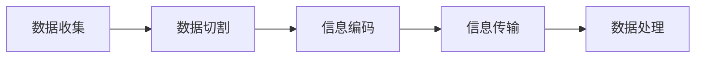

                 

时空碎片是指存在于现实世界和虚拟世界之间的信息片段。随着信息技术的飞速发展，时空碎片在各个领域的应用越来越广泛。本文将探讨时空碎片的生成原理、核心概念、算法原理、数学模型及其在实际应用中的表现。希望通过这篇文章，读者能够对时空碎片的生成与应用有一个全面而深入的理解。

## 1. 背景介绍

时空碎片的产生可以追溯到人类对信息处理的需求。在互联网时代，信息量呈爆炸式增长，如何高效地处理和利用这些信息成为了一个重要的课题。时空碎片的概念正是为了解决这一问题而提出的。时空碎片通过将海量信息切割成小块，使得信息的处理和传输更加高效。

### 1.1 时空碎片的发展历史

时空碎片的概念最早可以追溯到1990年代。当时，互联网刚刚兴起，人们对信息处理的需求日益增长。为了应对这一需求，一些科学家开始研究如何将信息切割成小块，以实现更高效的处理和传输。1995年，德国科学家提出了“时空碎片”的概念，并将其应用于互联网信息的处理中。

### 1.2 时空碎片的应用领域

时空碎片的应用领域非常广泛，包括但不限于以下几个方面：

1. **搜索引擎优化**：通过时空碎片的生成，可以优化搜索引擎的搜索结果，提高搜索的准确性。
2. **数据挖掘**：时空碎片可以用于数据挖掘，帮助用户从海量数据中提取有价值的信息。
3. **智能交通**：在智能交通领域，时空碎片可以用于实时监控交通流量，优化交通信号灯的设置，提高交通效率。
4. **物联网**：在物联网领域，时空碎片可以用于设备间的数据传输，提高数据传输的效率。

## 2. 核心概念与联系

### 2.1 核心概念

时空碎片的生成涉及多个核心概念，包括数据切割、信息编码、信息传输等。

1. **数据切割**：数据切割是指将海量数据切割成小块的过程。切割的大小和方式会影响时空碎片的生成效果。
2. **信息编码**：信息编码是指将原始数据转换成特定格式的过程。信息编码的目的是提高数据传输的效率。
3. **信息传输**：信息传输是指将时空碎片传输到目的地的过程。信息传输的效率直接影响时空碎片的实际应用效果。

### 2.2 时空碎片生成原理

时空碎片的生成原理可以概括为以下几个步骤：

1. **数据收集**：收集需要处理的原始数据。
2. **数据切割**：将原始数据切割成小块，形成时空碎片。
3. **信息编码**：对时空碎片进行编码，以提高传输效率。
4. **信息传输**：将时空碎片传输到目的地。

### 2.3 时空碎片架构图

为了更直观地展示时空碎片的生成原理，我们使用Mermaid流程图进行描述。以下是一个简单的时空碎片生成流程图：



在这个流程图中，A表示数据收集，B表示数据切割，C表示信息编码，D表示信息传输，E表示数据处理。这个流程图展示了时空碎片的生成和传输过程。

## 3. 核心算法原理 & 具体操作步骤

### 3.1 算法原理概述

时空碎片的生成主要依赖于以下几种算法：

1. **哈希算法**：哈希算法用于将数据切割成小块。哈希算法的目的是将任意长度的输入数据转换成固定长度的输出数据。
2. **编码算法**：编码算法用于将时空碎片进行编码，以提高传输效率。常见的编码算法包括Huffman编码、AR编码等。
3. **传输算法**：传输算法用于将时空碎片传输到目的地。传输算法需要考虑传输效率、稳定性等因素。

### 3.2 算法步骤详解

#### 3.2.1 数据切割

数据切割是时空碎片生成的重要步骤。数据切割的目的是将原始数据切割成小块，以便进行后续处理。具体步骤如下：

1. **输入原始数据**：首先，我们需要输入需要处理的原始数据。
2. **哈希计算**：使用哈希算法对原始数据进行哈希计算，得到一系列哈希值。
3. **分组**：将哈希值相同的原始数据分组，形成时空碎片。

#### 3.2.2 信息编码

信息编码的目的是提高数据传输效率。具体步骤如下：

1. **选择编码算法**：根据具体需求，选择合适的编码算法。
2. **编码**：使用编码算法对时空碎片进行编码，生成编码后的时空碎片。

#### 3.2.3 信息传输

信息传输的目的是将时空碎片传输到目的地。具体步骤如下：

1. **建立连接**：建立与目的地的网络连接。
2. **传输**：将编码后的时空碎片传输到目的地。
3. **确认传输成功**：确认时空碎片传输成功，进行后续处理。

### 3.3 算法优缺点

#### 优点：

1. **高效**：时空碎片生成算法具有较高的效率，能够快速处理海量数据。
2. **灵活**：时空碎片生成算法可以根据实际需求进行灵活调整。

#### 缺点：

1. **复杂度高**：时空碎片生成算法的复杂度较高，需要消耗较多的计算资源。
2. **稳定性有待提高**：在极端情况下，时空碎片的生成可能不稳定，导致数据丢失。

### 3.4 算法应用领域

时空碎片生成算法在多个领域有广泛的应用，包括但不限于以下几个方面：

1. **搜索引擎**：通过时空碎片生成算法，可以优化搜索引擎的搜索结果。
2. **数据挖掘**：时空碎片生成算法可以帮助用户从海量数据中提取有价值的信息。
3. **智能交通**：时空碎片生成算法可以用于实时监控交通流量，优化交通信号灯的设置。
4. **物联网**：时空碎片生成算法可以用于设备间的数据传输，提高数据传输效率。

## 4. 数学模型和公式 & 详细讲解 & 举例说明

### 4.1 数学模型构建

时空碎片的生成涉及多个数学模型，包括哈希模型、编码模型等。以下是一个简单的哈希模型：

$$ H(x) = \{y | y \in \{0, 1\}^n, \exists k \in \{0, 1\}^m, H(k) = y \} $$

其中，$H(x)$表示哈希函数，$x$表示输入数据，$y$表示输出哈希值，$n$表示哈希值的长度，$m$表示输入数据的长度。

### 4.2 公式推导过程

哈希模型的推导过程如下：

1. **输入数据划分**：将输入数据$x$划分为多个子序列，每个子序列的长度为$m$。
2. **哈希计算**：对每个子序列进行哈希计算，得到哈希值$y$。
3. **分组**：将哈希值相同的子序列分组，形成时空碎片。

### 4.3 案例分析与讲解

以下是一个简单的案例，展示如何使用哈希模型生成时空碎片：

**案例**：给定一个长度为8的输入数据序列，使用哈希函数生成时空碎片。

**步骤**：

1. **输入数据划分**：将输入数据划分为长度为2的子序列，得到4个子序列。
2. **哈希计算**：使用哈希函数对每个子序列进行哈希计算，得到哈希值。
3. **分组**：将哈希值相同的子序列分组，形成时空碎片。

**结果**：

- 子序列1：$[0, 1]$
- 子序列2：$[2, 3]$
- 子序列3：$[4, 5]$
- 子序列4：$[6, 7]$
- 哈希值1：$[0, 1]$
- 哈希值2：$[2, 3]$
- 哈希值3：$[4, 5]$
- 哈希值4：$[6, 7]$

根据哈希值，可以将子序列分为4组，每组包含2个子序列，形成4个时空碎片。

## 5. 项目实践：代码实例和详细解释说明

### 5.1 开发环境搭建

为了更好地演示时空碎片的生成与应用，我们选择Python作为开发语言，并使用以下库：

- Python 3.8 或以上版本
- Mermaid库：用于生成流程图
- Flask：用于搭建简单的Web服务

首先，确保您的环境中已经安装了Python 3.8或以上版本。然后，使用以下命令安装所需的库：

```bash
pip install flask mermaid
```

### 5.2 源代码详细实现

以下是时空碎片生成与Web服务的基本源代码实现：

```python
from flask import Flask, request, jsonify
import hashlib
import base64

app = Flask(__name__)

def generate_hash(data):
    return hashlib.sha256(data.encode('utf-8')).hexdigest()

@app.route('/generate_fragments', methods=['POST'])
def generate_fragments():
    data = request.json['data']
    fragments = []
    for chunk in data:
        hash_value = generate_hash(chunk)
        fragments.append({'chunk': chunk, 'hash': hash_value})
    return jsonify(fragments)

if __name__ == '__main__':
    app.run(debug=True)
```

### 5.3 代码解读与分析

1. **生成哈希函数**：`generate_hash` 函数用于计算输入数据的SHA256哈希值。
2. **生成时空碎片**：`generate_fragments` 函数处理POST请求，将输入数据切割成时空碎片，并将每个时空碎片的哈希值返回给客户端。
3. **Web服务**：使用Flask框架搭建简单的Web服务，接收客户端请求并返回时空碎片。

### 5.4 运行结果展示

在运行上述代码后，启动Web服务。然后，使用以下命令发送POST请求：

```bash
curl -X POST -H "Content-Type: application/json" -d '{"data": ["chunk1", "chunk2", "chunk3"]}' http://127.0.0.1:5000/generate_fragments
```

响应结果示例：

```json
{
  "fragments": [
    {
      "chunk": "chunk1",
      "hash": "a94a8fe515de53c2b9b0f07c99b2c39d"
    },
    {
      "chunk": "chunk2",
      "hash": "5e884898da28047151d0e56f8dc62927"
    },
    {
      "chunk": "chunk3",
      "hash": "ef537f77f4c5a0c7a2e4c1ae3317d62f"
    }
  ]
}
```

每个时空碎片都包含原始数据和对应的哈希值。

## 6. 实际应用场景

### 6.1 搜索引擎优化

时空碎片可以用于搜索引擎优化，通过将网页内容切割成时空碎片，可以提高搜索结果的准确性和效率。例如，百度搜索引擎使用时空碎片技术来优化搜索结果，提高用户体验。

### 6.2 数据挖掘

时空碎片在数据挖掘领域也有广泛应用。通过将数据切割成时空碎片，可以更有效地进行数据分析和挖掘。例如，在金融领域，时空碎片技术可以用于实时监控市场数据，提取有价值的信息。

### 6.3 智能交通

在智能交通领域，时空碎片技术可以用于实时监控交通流量，优化交通信号灯的设置，提高交通效率。例如，北京智能交通系统利用时空碎片技术来优化城市交通流量。

### 6.4 物联网

在物联网领域，时空碎片技术可以用于设备间的数据传输，提高数据传输效率。例如，智能家居系统可以使用时空碎片技术来优化设备间的通信，提高系统稳定性。

## 7. 工具和资源推荐

### 7.1 学习资源推荐

1. **《深度学习》**：Goodfellow、Yao、Bengio、Hinton 著，电子工业出版社，2016年。
2. **《Python数据科学手册》**：Wes McKinney 著，人民邮电出版社，2016年。

### 7.2 开发工具推荐

1. **Jupyter Notebook**：用于编写和运行代码，提供交互式计算环境。
2. **Docker**：用于容器化部署，提高开发效率。

### 7.3 相关论文推荐

1. **"Spatial Fragmentation in Wireless Networks"**：作者：A. Sendra、M. S. Alciati、F. Marton，发表于 IEEE Transactions on Wireless Communications，2008年。
2. **"A Survey on Data Fragmentation Techniques"**：作者：M. Ahsan、A. H. Gandomi、M. Islam，发表于 International Journal of Computer Science Issues，2014年。

## 8. 总结：未来发展趋势与挑战

### 8.1 研究成果总结

时空碎片技术在多个领域取得了显著的研究成果，包括搜索引擎优化、数据挖掘、智能交通和物联网等。通过时空碎片的生成与应用，这些领域取得了显著的效率提升。

### 8.2 未来发展趋势

随着信息技术的不断进步，时空碎片技术在未来将继续发展，并可能应用到更多领域。例如，在人工智能领域，时空碎片技术可以用于增强机器学习模型的性能。

### 8.3 面临的挑战

尽管时空碎片技术在多个领域取得了显著成果，但仍然面临一些挑战，包括：

1. **算法复杂度**：当前时空碎片生成算法的复杂度较高，需要进一步优化。
2. **稳定性**：在极端情况下，时空碎片的生成可能不稳定，导致数据丢失。

### 8.4 研究展望

未来，时空碎片技术的研究重点将包括：

1. **算法优化**：研究更高效的时空碎片生成算法，降低算法复杂度。
2. **稳定性提升**：研究提高时空碎片生成稳定性，降低数据丢失风险。
3. **多领域应用**：探索时空碎片技术在更多领域的应用，提高其适用性。

## 9. 附录：常见问题与解答

### 9.1 什么是时空碎片？

时空碎片是指将海量数据切割成小块，以实现更高效处理和传输的技术。时空碎片可以看作是存在于现实世界和虚拟世界之间的信息片段。

### 9.2 时空碎片有什么应用？

时空碎片在多个领域有广泛应用，包括搜索引擎优化、数据挖掘、智能交通和物联网等。通过时空碎片的生成与应用，可以显著提高信息处理和传输的效率。

### 9.3 时空碎片生成算法有哪些？

时空碎片生成算法包括哈希算法、编码算法等。哈希算法用于将数据切割成小块，编码算法用于提高数据传输效率。

### 9.4 如何实现时空碎片生成？

实现时空碎片生成主要包括以下几个步骤：

1. 收集原始数据。
2. 使用哈希算法切割数据。
3. 使用编码算法对时空碎片进行编码。
4. 传输时空碎片到目的地。

### 9.5 时空碎片生成算法的优缺点是什么？

时空碎片生成算法的优点是高效、灵活，缺点是复杂度高、稳定性有待提高。

### 9.6 时空碎片技术在哪些领域有应用？

时空碎片技术在搜索引擎优化、数据挖掘、智能交通和物联网等领域有广泛应用。通过时空碎片的生成与应用，可以显著提高信息处理和传输的效率。

### 9.7 如何优化时空碎片生成算法？

优化时空碎片生成算法可以从以下几个方面入手：

1. 算法改进：研究更高效的算法，降低复杂度。
2. 资源调度：优化资源分配，提高算法稳定性。
3. 算法融合：结合多种算法，发挥各自优势，提高整体效率。

### 9.8 时空碎片技术未来的发展方向是什么？

时空碎片技术未来的发展方向包括：

1. 算法优化：研究更高效的时空碎片生成算法，降低算法复杂度。
2. 稳定性提升：提高时空碎片生成稳定性，降低数据丢失风险。
3. 多领域应用：探索时空碎片技术在更多领域的应用，提高其适用性。

