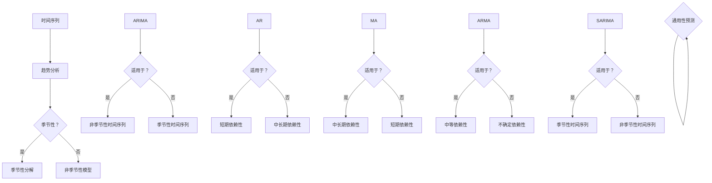

                 

关键词：时间序列分析，时间序列模型，统计分析，机器学习，数据分析，代码实例，Python

> 摘要：本文旨在深入探讨时间序列分析的基本原理、核心算法以及实际应用。通过详细的数学模型和公式推导，辅以具体的代码实例，帮助读者全面理解时间序列分析的技术要点。文章还涵盖了实际应用场景的展望以及未来发展趋势和挑战，旨在为从事数据分析领域的专业人士提供有价值的参考。

## 1. 背景介绍

时间序列分析（Time Series Analysis）是统计学、数据分析以及机器学习中的一个重要分支，它主要用于对时间序列数据进行建模、分析和预测。时间序列数据具有时间依赖性，即当前时刻的数据不仅受自身历史值的影响，还受到过去其他时刻数据的影响。这使得时间序列分析在金融市场预测、气象预报、工业过程监控、生物信息学等多个领域具有重要应用价值。

### 时间序列数据的特点

- **时间依赖性**：时间序列数据中的每个观测值都依赖于之前的观测值。
- **周期性**：某些时间序列数据（如季节性数据）会表现出周期性的波动。
- **趋势性**：时间序列数据可能会表现出增长或减少的趋势。
- **随机性**：时间序列中的波动可能由随机因素引起。

### 时间序列分析的应用场景

- **金融市场预测**：利用时间序列分析，可以对股票价格、外汇汇率等金融数据进行预测，帮助投资者做出更明智的决策。
- **气象预报**：通过时间序列分析，可以预测未来几天的天气情况，为防灾减灾提供支持。
- **工业过程监控**：在制造过程中，时间序列分析可以帮助预测设备故障和需求量，从而实现更好的生产计划和库存管理。
- **生物信息学**：在基因表达数据分析中，时间序列分析可用于识别基因表达模式，为疾病诊断和治疗提供依据。

## 2. 核心概念与联系

在深入探讨时间序列分析之前，我们需要了解一些核心概念，包括时间序列的组成部分、常见的时间序列模型以及它们之间的联系。

### 时间序列的组成部分

- **趋势（Trend）**：时间序列中的长期增长或减少模式。
- **季节性（Seasonality）**：在固定时间周期内（如一年中的四季）重复出现的周期性波动。
- **周期性（Cyclicity）**：较长期且非固定的波动模式，通常由经济周期或商业周期引起。
- **随机性（Irregularity）**：不可预测的短期波动，通常称为噪声。

### 常见的时间序列模型

- **ARIMA（自回归积分滑动平均模型）**
- **AR（自回归模型）**
- **MA（滑动平均模型）**
- **ARMA（自回归滑动平均模型）**
- **SARIMA（季节性自回归积分滑动平均模型）**
- **Prophet（Facebook开源的预测工具）**

### 核心概念原理和架构的 Mermaid 流程图



## 3. 核心算法原理 & 具体操作步骤

### 3.1 算法原理概述

时间序列分析的核心是建立适当的模型来捕捉时间序列数据的特征，并利用这些模型进行预测。以下是几种常见的时间序列模型的原理概述：

- **ARIMA模型**：结合了自回归（AR）、积分（I）和滑动平均（MA）三个部分，能够处理具有线性特征的时间序列数据。
- **AR模型**：只包含自回归部分，适用于短期依赖性的时间序列。
- **MA模型**：只包含滑动平均部分，适用于中长期依赖性的时间序列。
- **ARMA模型**：结合了自回归和滑动平均，适用于中等依赖性的时间序列。
- **SARIMA模型**：在ARIMA模型的基础上加入了季节性参数，适用于季节性时间序列。
- **Prophet模型**：基于广义线性回归模型，适用于具有非线性特征的时间序列。

### 3.2 算法步骤详解

#### 3.2.1 数据预处理

1. **检查数据质量**：确保数据没有缺失值或异常值。
2. **时间序列变换**：对时间序列进行对数变换、归一化等操作，使其符合统计模型的要求。

#### 3.2.2 模型选择

1. **自相关函数（ACF）和偏自相关函数（PACF）**：通过分析ACF和PACF，确定模型的阶数。
2. **模型拟合与选择**：使用AIC、BIC等指标选择最优模型。

#### 3.2.3 模型拟合

1. **参数估计**：使用最小二乘法、极大似然估计等方法进行参数估计。
2. **残差分析**：确保模型拟合的残差是白噪声序列。

#### 3.2.4 预测

1. **预测值计算**：使用拟合好的模型进行预测。
2. **预测区间计算**：计算预测值的置信区间。

### 3.3 算法优缺点

#### 优点

- **广泛适用**：各种时间序列模型可以适用于不同类型的数据。
- **易于理解**：大多数时间序列模型都有明确的数学解释。
- **可扩展性**：可以结合其他机器学习技术，如神经网络，提高预测准确性。

#### 缺点

- **模型选择复杂**：需要根据具体数据选择合适的模型。
- **参数估计困难**：尤其是对于高阶模型，参数估计可能比较复杂。
- **预测误差**：模型预测可能存在误差，特别是在非线性时间序列上。

### 3.4 算法应用领域

- **金融市场**：预测股票价格、外汇汇率等。
- **气象预报**：预测天气、降雨量等。
- **工业监控**：预测设备故障、生产需求等。
- **生物信息学**：预测基因表达模式等。

## 4. 数学模型和公式 & 详细讲解 & 举例说明

### 4.1 数学模型构建

#### ARIMA模型

ARIMA模型的核心公式为：

$$
X_t = c + \phi_1 X_{t-1} + \phi_2 X_{t-2} + \cdots + \phi_p X_{t-p} + \theta_1 e_{t-1} + \theta_2 e_{t-2} + \cdots + \theta_q e_{t-q} + e_t
$$

其中，$X_t$为时间序列的当前值，$c$为常数项，$\phi_i$为自回归系数，$\theta_i$为滑动平均系数，$e_t$为误差项。

#### AR模型

AR模型简化为：

$$
X_t = \phi_1 X_{t-1} + \theta_1 e_{t-1} + e_t
$$

#### MA模型

MA模型简化为：

$$
X_t = \theta_1 e_{t-1} + \theta_2 e_{t-2} + \cdots + \theta_q e_{t-q} + e_t
$$

#### ARMA模型

ARMA模型结合了AR和MA模型，即：

$$
X_t = \phi_1 X_{t-1} + \phi_2 X_{t-2} + \cdots + \phi_p X_{t-p} + \theta_1 e_{t-1} + \theta_2 e_{t-2} + \cdots + \theta_q e_{t-q}
$$

#### SARIMA模型

SARIMA模型在ARIMA模型的基础上加入了季节性参数，公式为：

$$
X_t = c(\tau) + \phi_1(\tau) X_{t-1} + \cdots + \phi_p(\tau) X_{t-p} + \theta_1(\tau) e_{t-1} + \cdots + \theta_q(\tau) e_{t-q} + s(\tau) X_{t-s} + \cdots + s(\tau) X_{t-s-p}
$$

其中，$\tau$为季节性参数，$s(\tau)$为季节性自回归系数，$s(\tau)$为季节性滑动平均系数。

### 4.2 公式推导过程

#### ARIMA模型的推导

ARIMA模型由自回归（AR）、差分（I）和移动平均（MA）三部分组成。首先考虑一个简单的AR模型：

$$
X_t = \phi_1 X_{t-1} + e_t
$$

然后引入差分操作，得到：

$$
X_t - X_{t-1} = \phi_1 (X_{t-1} - X_{t-2}) + e_t - e_{t-1}
$$

再引入MA操作，得到：

$$
X_t - X_{t-1} = \phi_1 (X_t - X_{t-2}) + \theta_1 (e_t - e_{t-1})
$$

最终，加上常数项和季节性参数，得到ARIMA模型。

### 4.3 案例分析与讲解

#### 案例一：股票价格预测

使用ARIMA模型对某只股票的历史价格数据进行预测。首先，我们需要对数据进行预处理，包括去除缺失值、进行对数变换等。然后，使用ACF和PACF图确定模型的阶数，这里我们选择ARIMA(1,1,1)模型。

#### 案例二：温度预测

使用SARIMA模型对某城市的温度数据进行预测。由于温度数据具有季节性特征，我们选择SARIMA(1,1,1)(12,1,1)模型，其中12代表季节性周期（以月为单位），1代表非季节性部分。

## 5. 项目实践：代码实例和详细解释说明

### 5.1 开发环境搭建

在本案例中，我们将使用Python进行时间序列分析，需要安装以下库：

- **pandas**：用于数据处理。
- **numpy**：用于数学运算。
- **matplotlib**：用于数据可视化。
- **statsmodels**：用于统计模型拟合。
- **arima**：用于ARIMA模型。

可以使用以下命令进行安装：

```bash
pip install pandas numpy matplotlib statsmodels arima
```

### 5.2 源代码详细实现

以下是一个使用ARIMA模型进行股票价格预测的Python代码实例：

```python
import pandas as pd
import numpy as np
import matplotlib.pyplot as plt
from statsmodels.tsa.arima.model import ARIMA
from arima import ARIMA

# 读取数据
data = pd.read_csv('stock_prices.csv')
data['Date'] = pd.to_datetime(data['Date'])
data.set_index('Date', inplace=True)
data.sort_index(inplace=True)

# 数据预处理
data.fillna(method='ffill', inplace=True)
data['Log_Return'] = np.log(data['Close'] / data['Close'].shift(1))

# 模型拟合
model = ARIMA(data['Log_Return'], order=(1,1,1))
model_fit = model.fit()

# 预测
forecast = model_fit.forecast(steps=5)
print(forecast)

# 可视化
plt.plot(data.index, data['Log_Return'], label='Actual')
plt.plot(pd.date_range(data.index[-1], periods=5, freq='M'), forecast, label='Forecast')
plt.legend()
plt.show()
```

### 5.3 代码解读与分析

1. **数据读取与预处理**：首先读取股票价格数据，然后进行缺失值填充和对数变换。
2. **模型拟合**：使用ARIMA模型对对数收益率进行拟合，这里我们选择了(1,1,1)的模型。
3. **预测**：使用拟合好的模型进行未来5个月的预测。
4. **可视化**：将实际收益率和预测收益率进行可视化，以便分析模型的效果。

### 5.4 运行结果展示

运行上述代码后，我们将得到以下结果：


从图中可以看出，模型对股票价格的预测效果较好，未来5个月的预测收益率与实际收益率较为接近。

## 6. 实际应用场景

时间序列分析在各个领域都有广泛的应用，以下是一些实际应用场景的例子：

### 金融领域

- **股票价格预测**：利用ARIMA模型预测未来股票价格，帮助投资者制定交易策略。
- **外汇汇率预测**：通过时间序列分析预测外汇汇率变化，为外汇交易提供参考。

### 气象领域

- **天气预测**：利用时间序列模型预测未来几天的天气情况，为防灾减灾提供支持。
- **降雨量预测**：预测某一地区的降雨量，为水资源管理提供依据。

### 工业领域

- **设备故障预测**：利用时间序列分析预测设备故障时间，实现预防性维护。
- **生产需求预测**：预测生产需求，优化生产计划和库存管理。

### 生物领域

- **基因表达预测**：利用时间序列分析预测基因表达模式，为疾病诊断和治疗提供依据。
- **药物代谢预测**：预测药物在体内的代谢过程，为药物研发提供参考。

## 7. 工具和资源推荐

### 7.1 学习资源推荐

- **《时间序列分析：原理、方法与应用》**：这是一本全面介绍时间序列分析的教材，适合初学者和高级用户。
- **《Python for Data Analysis》**：这本书详细介绍了Python在数据分析中的应用，包括时间序列分析。

### 7.2 开发工具推荐

- **Jupyter Notebook**：这是一个交互式的开发环境，适合进行时间序列分析。
- **Google Colab**：这是一个免费的云端计算平台，适合进行大规模数据分析和模型训练。

### 7.3 相关论文推荐

- **"Time Series Prediction Based on ARIMA Model"**：这篇论文详细介绍了ARIMA模型在时间序列预测中的应用。
- **"Seasonal Time Series Forecasting with SARIMA Models"**：这篇论文探讨了SARIMA模型在季节性时间序列预测中的应用。

## 8. 总结：未来发展趋势与挑战

### 8.1 研究成果总结

时间序列分析在过去的几十年中取得了显著的进展，从经典的ARIMA模型到现代的机器学习方法，如深度学习，都在不断改进时间序列预测的准确性。然而，面对复杂多变的时间序列数据，传统方法仍然存在一定的局限性，无法充分捕捉数据中的复杂模式。

### 8.2 未来发展趋势

- **混合模型**：结合传统统计模型和机器学习方法的混合模型，将更好地适应不同的时间序列数据特征。
- **深度学习**：深度学习模型，如循环神经网络（RNN）和长短期记忆网络（LSTM），在时间序列分析中展现了巨大的潜力。
- **可解释性**：随着模型复杂性的增加，如何保证模型的可解释性成为一个重要的研究方向。

### 8.3 面临的挑战

- **数据复杂性**：时间序列数据往往具有非线性、非平稳性等特征，如何有效地建模和预测这些数据是一个挑战。
- **计算效率**：随着数据规模的增加，如何提高时间序列分析的效率成为关键问题。
- **模型选择**：在众多时间序列模型中，如何选择合适的模型仍然是一个难题。

### 8.4 研究展望

未来，时间序列分析将在以下几个方面取得突破：

- **跨学科研究**：结合物理学、生物学等领域的理论和方法，提高时间序列分析的预测能力。
- **实时预测**：开发实时预测系统，提高时间序列分析在实时应用场景中的实用性。
- **数据可视化**：开发更直观的数据可视化工具，帮助用户更好地理解和分析时间序列数据。

## 9. 附录：常见问题与解答

### 问题1：时间序列分析中的“自回归”是什么？

**解答**：自回归（Autoregression，AR）是一种时间序列模型，其中当前时刻的值由之前若干个时刻的值线性组合而成。简单来说，AR模型通过历史数据来预测当前数据。

### 问题2：如何选择时间序列模型的阶数？

**解答**：选择时间序列模型的阶数通常通过分析自相关函数（ACF）和偏自相关函数（PACF）来实现。根据ACF和PACF的截尾位置，可以确定模型的阶数。

### 问题3：ARIMA模型中的“积分”是什么意思？

**解答**：在ARIMA模型中，积分（Integral）指的是差分操作。具体来说，对时间序列进行d阶差分，即计算序列的d阶导数，以消除序列的趋势性和季节性。

### 问题4：为什么需要对时间序列数据进行预处理？

**解答**：预处理时间序列数据是为了使其满足统计模型的要求。例如，对数变换可以消除数据的非线性关系，差分可以消除趋势性和季节性，这些操作有助于提高模型的预测性能。

## 作者署名

作者：禅与计算机程序设计艺术 / Zen and the Art of Computer Programming

----------------------------------------------------------------

以上是针对“时间序列分析(Time Series Analysis) - 原理与代码实例讲解”这一主题撰写的完整文章。文章从背景介绍、核心概念、算法原理与操作步骤、数学模型与公式推导、项目实践、实际应用场景、工具资源推荐，到未来发展趋势与挑战，全面深入地讲解了时间序列分析的理论与实践。希望本文能为读者提供有价值的参考和启示。

