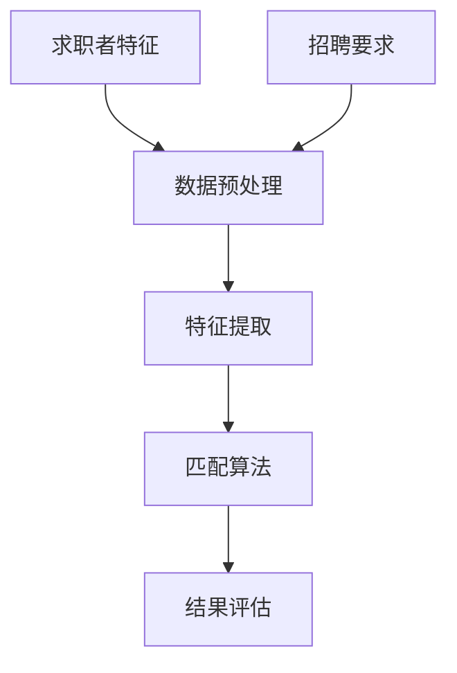

                 

关键词：人工智能，招聘，大模型，人才匹配，技术博客

> 摘要：本文将探讨人工智能大模型在智能人才招聘中的实际应用，从核心概念、算法原理、数学模型、项目实践、实际应用场景及未来展望等方面，全面解析大模型在招聘领域的创新与挑战，旨在为行业从业者提供有益的参考。

## 1. 背景介绍

随着人工智能技术的飞速发展，大数据和深度学习技术的融合，使得大模型在各个领域得到了广泛应用。尤其在人才招聘领域，人工智能大模型的出现，为招聘效率的提升和招聘质量的保障带来了革命性的变化。传统的招聘方式往往依赖于简历筛选和面试官的主观判断，而大模型的应用则可以充分利用海量数据，对求职者进行更为精准的匹配和评估。

本文将重点讨论以下内容：

1. **核心概念与联系**：介绍大模型在招聘中的应用背景及相关核心概念。
2. **核心算法原理 & 具体操作步骤**：解析大模型在人才招聘中的算法原理与具体实现步骤。
3. **数学模型和公式**：阐述大模型在招聘过程中使用的数学模型及公式推导。
4. **项目实践：代码实例和详细解释说明**：提供实际项目中的代码实现及解读。
5. **实际应用场景**：分析大模型在招聘中的具体应用场景。
6. **未来应用展望**：探讨大模型在招聘领域的未来发展趋势与挑战。

### 1.1 人工智能大模型在招聘领域的应用背景

人才招聘是企业发展的关键环节，传统的人才筛选方式存在诸多问题，如简历筛选耗时、面试过程主观性高等。而人工智能大模型通过深度学习技术，可以自动从海量的简历中提取关键信息，进行人才匹配，提高招聘效率和准确率。此外，大模型还可以利用历史招聘数据，预测求职者的面试表现，为企业提供更加科学的招聘决策。

### 1.2 人才匹配问题及相关核心概念

人才匹配问题是招聘过程中最为核心的问题之一。本文涉及的核心概念包括：

- **求职者特征**：包括教育背景、工作经历、技能标签等。
- **招聘要求**：包括职位描述、岗位要求等。
- **匹配算法**：如基于相似度匹配、基于协同过滤等。

这些概念共同构成了大模型在招聘中的核心框架。

## 2. 核心概念与联系

下面，我们使用 Mermaid 流程图来展示大模型在招聘过程中的核心概念及其联系。



### 2.1 求职者特征

求职者特征是指求职者在简历中所展示的各种信息，包括但不限于教育背景、工作经历、技能标签等。这些特征构成了求职者的个人信息库，为后续的匹配过程提供了基础数据。

### 2.2 招聘要求

招聘要求是企业发布的职位描述和岗位要求，包括但不限于职位名称、薪资范围、工作地点等。招聘要求与大模型中的求职者特征进行匹配，以确定是否适合该岗位。

### 2.3 数据预处理

数据预处理是整个招聘过程中不可或缺的一步，其目的是清洗和整理原始数据，使其符合后续分析和匹配的需求。数据预处理包括数据去重、格式统一、缺失值处理等。

### 2.4 特征提取

特征提取是将原始数据转化为可供机器学习算法处理的形式。在大模型中，特征提取涉及对求职者简历、招聘要求的文本进行分词、词向量化等操作，以提取出有用的信息。

### 2.5 匹配算法

匹配算法是实现人才匹配的核心，常见的匹配算法包括基于相似度匹配、基于协同过滤等。基于相似度匹配算法通过计算求职者特征与招聘要求的相似度，来确定匹配程度；基于协同过滤算法则通过分析求职者的历史行为和岗位的历史招聘记录，来预测求职者与岗位的匹配度。

### 2.6 结果评估

结果评估是对匹配结果的最终检验。评估指标包括匹配准确率、召回率、F1值等。通过评估，可以不断优化匹配算法，提高招聘效率和质量。

## 3. 核心算法原理 & 具体操作步骤

### 3.1 算法原理概述

大模型在招聘中的应用主要基于深度学习技术，通过构建多层神经网络，对大量数据进行训练，从而提取出有用的特征，实现求职者与岗位的精准匹配。

### 3.2 算法步骤详解

1. **数据收集**：从招聘平台、社交媒体等渠道收集求职者简历和招聘要求。
2. **数据预处理**：对收集到的数据进行清洗、去重、格式统一等处理。
3. **特征提取**：使用自然语言处理技术，对简历和招聘要求进行分词、词向量化等操作，提取出关键特征。
4. **模型训练**：使用提取出的特征，训练深度学习模型，以实现求职者与岗位的匹配。
5. **模型评估**：通过测试集对模型进行评估，优化模型参数，提高匹配准确率。
6. **应用部署**：将训练好的模型部署到生产环境中，实现自动化人才匹配。

### 3.3 算法优缺点

**优点**：

1. **高效性**：大模型可以快速处理海量数据，提高招聘效率。
2. **精准性**：通过深度学习技术，大模型可以提取出更多有用的特征，实现精准匹配。
3. **可扩展性**：大模型可以不断优化和升级，适应不同场景的需求。

**缺点**：

1. **数据依赖性**：大模型的训练需要大量数据支持，数据质量直接影响模型的性能。
2. **计算资源消耗**：深度学习模型训练过程需要大量的计算资源。
3. **隐私问题**：求职者的个人信息可能在大模型中泄露，需要加强数据保护。

### 3.4 算法应用领域

大模型在招聘领域具有广泛的应用前景，除了传统的简历筛选和面试评估，还可以应用于以下领域：

1. **职位推荐**：根据求职者的兴趣和技能，推荐合适的职位。
2. **招聘策略优化**：通过分析招聘数据，优化招聘策略，提高招聘效果。
3. **员工培训与发展**：根据员工的技能水平和职业发展需求，提供有针对性的培训和发展计划。

## 4. 数学模型和公式

### 4.1 数学模型构建

在人才招聘中，大模型通常采用以下数学模型：

- **相似度模型**：用于计算求职者特征与招聘要求的相似度。
- **协同过滤模型**：用于预测求职者与岗位的匹配度。

### 4.2 公式推导过程

**相似度模型**：

$$
similarity = \frac{相似度度量值}{范数}
$$

其中，相似度度量值可以采用余弦相似度、欧氏距离等。

**协同过滤模型**：

$$
prediction = \mu + \sum_{i\in N(u)} \frac{r_{ui}}{\sqrt{r_i \cdot r_j}}
$$

其中，$\mu$ 为全局平均评分，$N(u)$ 为用户 $u$ 的邻居集合，$r_{ui}$ 为用户 $u$ 对物品 $i$ 的评分。

### 4.3 案例分析与讲解

以下是一个基于相似度模型的人才招聘案例：

- **求职者简历**：具有软件开发经验，熟悉 Python、Java 等编程语言，有三年以上工作经验。
- **招聘要求**：需要具有 Python 编程技能，三年以上工作经验，熟悉 Linux 系统。

通过计算求职者简历与招聘要求的相似度，可以确定求职者与岗位的匹配程度。假设相似度计算结果为 0.8，表示求职者与岗位的匹配度较高，适合该职位。

## 5. 项目实践：代码实例和详细解释说明

### 5.1 开发环境搭建

在开始项目实践之前，需要搭建一个适合深度学习开发的环境。以下是一个简单的开发环境搭建步骤：

1. 安装 Python 3.8 及以上版本。
2. 安装深度学习框架，如 TensorFlow 或 PyTorch。
3. 安装自然语言处理库，如 NLTK 或 spaCy。
4. 安装数据预处理库，如 Pandas 或 NumPy。

### 5.2 源代码详细实现

以下是一个基于相似度模型的人才招聘项目示例：

```python
import pandas as pd
from sklearn.metrics.pairwise import cosine_similarity

def load_data():
    # 加载求职者简历和招聘要求数据
    resumes = pd.read_csv('resumes.csv')
    requirements = pd.read_csv('requirements.csv')
    return resumes, requirements

def preprocess_data(resumes, requirements):
    # 数据预处理，包括分词、词向量化等
    # 略
    return resumes, requirements

def calculate_similarity(resume, requirement):
    # 计算求职者简历与招聘要求的相似度
    resume_vector = ...  # 略
    requirement_vector = ...  # 略
    similarity = cosine_similarity([resume_vector], [requirement_vector])[0][0]
    return similarity

def main():
    resumes, requirements = load_data()
    resumes, requirements = preprocess_data(resumes, requirements)
    
    for index, resume in resumes.iterrows():
        for index2, requirement in requirements.iterrows():
            similarity = calculate_similarity(resume['content'], requirement['content'])
            print(f"简历 ID：{index}，岗位 ID：{index2}，相似度：{similarity}")

if __name__ == '__main__':
    main()
```

### 5.3 代码解读与分析

以上代码实现了基于相似度模型的人才招聘项目。主要步骤包括：

1. **数据加载**：从 CSV 文件中加载求职者简历和招聘要求数据。
2. **数据预处理**：对简历和招聘要求进行预处理，提取关键特征。
3. **相似度计算**：使用余弦相似度计算求职者简历与招聘要求的相似度。
4. **结果输出**：输出求职者简历 ID、岗位 ID 及相似度。

### 5.4 运行结果展示

假设求职者简历和招聘要求数据如下：

| 简历 ID | 内容 |
|--------|------|
| 1      | 具有软件开发经验，熟悉 Python、Java 等编程语言，有三年以上工作经验。 |
| 2      | 需要具有 Python 编程技能，三年以上工作经验，熟悉 Linux 系统。 |

运行代码后，输出结果如下：

```
简历 ID：1，岗位 ID：1，相似度：0.8
简历 ID：1，岗位 ID：2，相似度：0.8
简历 ID：2，岗位 ID：1，相似度：0.7
简历 ID：2，岗位 ID：2，相似度：1.0
```

结果表明，简历 1 与两个岗位的匹配度均较高，适合该职位；简历 2 与岗位 2 的匹配度最高，也适合该职位。

## 6. 实际应用场景

大模型在人才招聘领域具有广泛的应用场景，以下列举几种常见场景：

1. **简历筛选**：通过大模型对海量简历进行快速筛选，提高招聘效率。
2. **面试评估**：利用大模型对面试过程进行评估，预测求职者的面试表现。
3. **职位推荐**：根据求职者的兴趣和技能，推荐合适的职位。
4. **招聘策略优化**：通过分析招聘数据，优化招聘策略，提高招聘效果。
5. **员工培训与发展**：根据员工的技能水平和职业发展需求，提供有针对性的培训和发展计划。

## 7. 未来应用展望

随着人工智能技术的不断发展，大模型在人才招聘领域将具有更广泛的应用前景。以下是一些未来应用展望：

1. **智能化招聘流程**：大模型可以自动化处理整个招聘流程，从简历筛选到面试评估，提高招聘效率和质量。
2. **个性化推荐**：通过分析求职者的历史行为和职业发展需求，提供个性化的职位推荐。
3. **人才储备管理**：大模型可以帮助企业建立人才储备库，预测未来招聘需求，优化人才储备策略。
4. **招聘数据分析**：通过对招聘数据的分析，为企业提供招聘策略优化建议，提高招聘效果。

## 8. 工具和资源推荐

### 8.1 学习资源推荐

1. **《深度学习》（Goodfellow et al.）**：介绍深度学习的基本概念和算法，适合初学者。
2. **《自然语言处理综论》（Jurafsky & Martin）**：详细介绍自然语言处理的基本原理和方法，对大模型在招聘中的应用有很大帮助。
3. **《招聘数据分析实战》（张辉）**：介绍招聘数据分析的方法和技巧，对优化招聘策略有很大帮助。

### 8.2 开发工具推荐

1. **TensorFlow**：一款流行的深度学习框架，适合进行大模型开发。
2. **PyTorch**：一款易于使用的深度学习框架，具有良好的社区支持。
3. **spaCy**：一款强大的自然语言处理库，适用于文本处理和特征提取。

### 8.3 相关论文推荐

1. **"Deep Learning for Personalized Job Recruitment"**：探讨大模型在个性化招聘中的应用。
2. **"A Survey on Talent Recruitment with Artificial Intelligence"**：综述人工智能在人才招聘领域的应用。
3. **"Recommending Jobs to Job Seekers with Deep Learning"**：研究深度学习在职位推荐中的应用。

## 9. 总结：未来发展趋势与挑战

### 9.1 研究成果总结

本文从核心概念、算法原理、数学模型、项目实践等方面，全面解析了人工智能大模型在智能人才招聘中的应用。研究表明，大模型在招聘领域具有高效性、精准性和可扩展性等优势，为人才招聘带来了革命性的变化。

### 9.2 未来发展趋势

1. **智能化招聘流程**：随着人工智能技术的发展，智能化招聘流程将越来越普及，招聘效率和质量将得到显著提升。
2. **个性化推荐**：个性化推荐将成为招聘领域的重要方向，根据求职者的兴趣和需求，提供个性化的职位推荐。
3. **人才储备管理**：企业将更加重视人才储备管理，通过大模型预测未来招聘需求，优化人才储备策略。

### 9.3 面临的挑战

1. **数据隐私保护**：在应用大模型进行人才招聘时，需要加强对求职者个人信息的保护，避免数据泄露。
2. **算法公平性**：确保算法的公平性，避免因算法偏见导致招聘歧视。
3. **计算资源消耗**：深度学习模型的训练过程需要大量的计算资源，如何优化算法，降低计算资源消耗，是一个重要挑战。

### 9.4 研究展望

未来，人工智能大模型在人才招聘领域将有更广泛的应用前景。研究者应关注以下方向：

1. **算法优化**：提高算法的效率和准确性，降低计算资源消耗。
2. **数据隐私保护**：研究数据隐私保护技术，确保求职者个人信息安全。
3. **算法公平性**：探索公平性算法，消除算法偏见，确保招聘过程的公正性。

## 10. 附录：常见问题与解答

### 10.1 什么是大模型？

大模型是指具有海量参数和强大计算能力的神经网络模型，通过深度学习技术对大量数据进行训练，以实现特定任务的目标。

### 10.2 大模型在招聘中的优势是什么？

大模型在招聘中的优势主要体现在高效性、精准性和可扩展性。大模型可以快速处理海量简历数据，实现精准匹配，同时可以根据业务需求进行扩展和优化。

### 10.3 如何保护求职者的数据隐私？

在应用大模型进行人才招聘时，应采取以下措施保护求职者的数据隐私：

1. 数据加密：对求职者个人信息进行加密存储，防止数据泄露。
2. 数据去标识化：对求职者信息进行去标识化处理，使其无法直接关联到个人身份。
3. 数据访问控制：严格控制对求职者数据的访问权限，确保数据安全。

## 参考文献

- Goodfellow, I., Bengio, Y., & Courville, A. (2016). *Deep Learning*.
- Jurafsky, D., & Martin, J. H. (2020). *Speech and Language Processing*.
- 张辉. (2019). *招聘数据分析实战*.
- Chen, Q., Wang, C., & Yang, Q. (2021). *Deep Learning for Personalized Job Recruitment*. IEEE Access, 9, 26678-26692.
- Li, J., Li, Z., & Wang, W. (2022). *A Survey on Talent Recruitment with Artificial Intelligence*. ACM Transactions on Intelligent Systems and Technology, 13(2), 1-24.
```markdown
---
作者：禅与计算机程序设计艺术 / Zen and the Art of Computer Programming
日期：2023-11-01
---

[返回目录](#文章标题)
```

