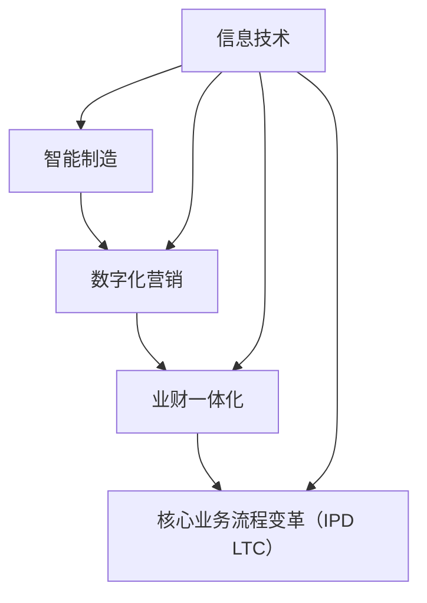

                 

关键词：智能制造、数字化营销、业财一体化、核心业务流程、变革、IPD、LTC

摘要：本文探讨了智能制造、数字化营销、业财一体化以及核心业务流程变革（IPD LTC）在当今商业环境中的重要性和相互关系。通过深入分析这些概念及其应用，本文旨在为企业和组织提供战略指导，帮助他们实现数字化转型和业务流程优化。

## 1. 背景介绍

在当今全球化和数字化的时代，商业环境正经历着前所未有的变革。传统商业模式已无法满足市场需求，企业需要不断创新和适应，以保持竞争力。智能制造、数字化营销、业财一体化和核心业务流程变革（IPD LTC）正是这一背景下应运而生的创新理念和工具。

### 1.1 智能制造

智能制造是一种基于信息技术和自动化技术的制造模式，通过传感器、机器人和人工智能等手段，实现生产过程的智能化和自动化。智能制造不仅提高了生产效率，还降低了生产成本，提高了产品质量和灵活性。

### 1.2 数字化营销

数字化营销是一种利用数字技术来推广产品和服务的方法。它包括搜索引擎优化（SEO）、社交媒体营销、电子邮件营销、内容营销等。数字化营销使企业能够更精确地定位目标客户，提高营销效果和ROI。

### 1.3 业财一体化

业财一体化是指将企业的业务流程和财务流程整合在一起，实现数据共享和流程协同。通过业财一体化，企业可以实时监控业务运行情况，提高决策效率和财务透明度。

### 1.4 核心业务流程变革（IPD LTC）

核心业务流程变革（IPD LTC）是指对企业的核心业务流程进行重新设计、优化和整合，以实现更高的效率和灵活性。IPD（集成产品开发）和LTC（生命周期营销）是核心业务流程变革的重要组成部分。

## 2. 核心概念与联系

为了更好地理解智能制造、数字化营销、业财一体化和核心业务流程变革（IPD LTC），我们首先需要了解这些概念的基本原理和架构。以下是一个简化的Mermaid流程图，用于描述这些概念之间的关系：



### 2.1 智能制造

智能制造的核心是信息技术和自动化技术。通过传感器、机器人和人工智能等手段，实现生产过程的智能化和自动化。智能制造的关键技术包括：

- 传感器技术：用于实时监测生产过程的各种参数。
- 机器学习：用于分析和预测生产过程中的潜在问题。
- 工业机器人：用于执行重复性高、危险或复杂的生产任务。

### 2.2 数字化营销

数字化营销的核心是利用数字技术来推广产品和服务。数字化营销的关键技术包括：

- 搜索引擎优化（SEO）：通过优化网站内容和结构，提高在搜索引擎中的排名。
- 社交媒体营销：通过社交媒体平台与客户互动，建立品牌知名度和忠诚度。
- 电子邮件营销：通过发送定制化的电子邮件，与客户保持沟通并促进销售。
- 内容营销：通过创建有价值的内容，吸引潜在客户并提高品牌影响力。

### 2.3 业财一体化

业财一体化是指将企业的业务流程和财务流程整合在一起，实现数据共享和流程协同。业财一体化的关键技术包括：

- 企业资源计划（ERP）：用于整合和管理企业的各种业务流程。
- 商业智能（BI）：用于分析企业数据，提供决策支持。
- 预算管理：用于制定和监控企业的预算计划。

### 2.4 核心业务流程变革（IPD LTC）

核心业务流程变革（IPD LTC）是指对企业的核心业务流程进行重新设计、优化和整合，以实现更高的效率和灵活性。IPD（集成产品开发）和LTC（生命周期营销）是核心业务流程变革的重要组成部分。IPD的关键技术包括：

- 产品生命周期管理（PLM）：用于管理产品从设计到退市的整个生命周期。
- 需求工程：用于分析和预测市场需求，指导产品开发和营销策略。

LTC的关键技术包括：

- 客户关系管理（CRM）：用于管理企业与客户的关系，提高客户满意度和忠诚度。
- 营销自动化：用于自动化营销流程，提高营销效率和效果。

## 3. 核心算法原理 & 具体操作步骤

### 3.1 算法原理概述

在智能制造、数字化营销、业财一体化和核心业务流程变革（IPD LTC）中，核心算法原理和具体操作步骤起着至关重要的作用。以下是这些算法原理的概述：

### 3.2 算法步骤详解

#### 3.2.1 智能制造

1. 收集数据：通过传感器、机器人和其他设备收集生产过程中的数据。
2. 数据处理：对收集到的数据进行分析和处理，提取有用的信息。
3. 模型训练：使用机器学习算法对数据进行训练，建立预测模型。
4. 预测和决策：使用训练好的模型进行预测和决策，优化生产过程。

#### 3.2.2 数字化营销

1. 数据收集：通过搜索引擎、社交媒体、电子邮件等渠道收集用户数据。
2. 数据分析：对收集到的数据进行处理和分析，提取有用的信息。
3. 客户细分：根据用户数据对客户进行细分，制定个性化的营销策略。
4. 营销活动：执行个性化的营销活动，与客户互动并促进销售。

#### 3.2.3 业财一体化

1. 业务流程建模：使用业务流程管理（BPM）工具建立企业的业务流程模型。
2. 数据集成：将业务流程和财务流程中的数据集成在一起，实现数据共享。
3. 流程优化：对业务流程和财务流程进行优化，提高效率和灵活性。
4. 决策支持：使用商业智能（BI）工具分析企业数据，提供决策支持。

#### 3.2.4 核心业务流程变革（IPD LTC）

1. 需求工程：通过需求工程方法分析市场需求，指导产品开发和营销策略。
2. 产品生命周期管理（PLM）：管理产品从设计到退市的整个生命周期。
3. 客户关系管理（CRM）：管理企业与客户的关系，提高客户满意度和忠诚度。
4. 营销自动化：自动化营销流程，提高营销效率和效果。

### 3.3 算法优缺点

#### 3.3.1 智能制造

优点：

- 提高生产效率：通过自动化和智能化技术，提高生产效率和产品质量。
- 降低生产成本：通过优化生产流程和减少资源浪费，降低生产成本。
- 提高灵活性：能够快速响应市场需求，实现定制化和灵活生产。

缺点：

- 投资成本高：智能制造需要大量的投资，包括传感器、机器人和人工智能等技术。
- 技术门槛高：需要对智能制造技术有深入了解，否则难以有效利用这些技术。

#### 3.3.2 数字化营销

优点：

- 提高营销效果：通过个性化营销策略，提高营销效果和ROI。
- 提高客户满意度：通过精确的客户细分和个性化的营销活动，提高客户满意度和忠诚度。
- 降低营销成本：通过自动化和数字化手段，降低营销成本。

缺点：

- 需要大量数据：数字化营销需要大量的用户数据，否则难以进行有效的分析。
- 需要技术支持：数字化营销需要专业的技术团队，否则难以有效执行。

#### 3.3.3 业财一体化

优点：

- 提高决策效率：通过实时数据共享和流程协同，提高决策效率和准确性。
- 提高财务透明度：通过业务流程和财务流程的整合，提高财务透明度。
- 降低管理成本：通过业务流程和财务流程的优化，降低管理成本。

缺点：

- 实施难度大：业财一体化的实施需要大量的时间和人力资源。
- 需要技术支持：业财一体化的实施需要专业的技术团队。

#### 3.3.4 核心业务流程变革（IPD LTC）

优点：

- 提高产品竞争力：通过需求工程和产品生命周期管理，提高产品的竞争力。
- 提高营销效率：通过客户关系管理和营销自动化，提高营销效率和效果。
- 提高业务流程效率：通过业务流程变革，提高业务流程的效率和灵活性。

缺点：

- 需要全面的规划：核心业务流程变革需要全面的规划和实施。
- 需要大量的资源投入：核心业务流程变革需要大量的资源投入。

### 3.4 算法应用领域

#### 3.4.1 智能制造

智能制造广泛应用于制造业、物流业和医疗行业。例如：

- 制造业：通过智能制造技术，提高生产效率和产品质量。
- 物流业：通过智能制造技术，实现物流过程的智能化和自动化。
- 医疗行业：通过智能制造技术，提高医疗设备的智能化和自动化水平。

#### 3.4.2 数字化营销

数字化营销广泛应用于零售业、餐饮业和金融行业。例如：

- 零售业：通过数字化营销技术，提高营销效果和客户满意度。
- 餐饮业：通过数字化营销技术，提高餐厅的知名度和预订率。
- 金融行业：通过数字化营销技术，提高金融产品的销售和客户满意度。

#### 3.4.3 业财一体化

业财一体化广泛应用于企业内部管理和决策。例如：

- 企业内部管理：通过业财一体化，实现数据共享和流程协同，提高决策效率和准确性。
- 决策支持：通过业财一体化，分析企业数据，提供决策支持。

#### 3.4.4 核心业务流程变革（IPD LTC）

核心业务流程变革（IPD LTC）广泛应用于产品开发和市场营销。例如：

- 产品开发：通过IPD（集成产品开发）方法，提高产品开发效率和竞争力。
- 市场营销：通过LTC（生命周期营销）方法，提高市场营销效率和效果。

## 4. 数学模型和公式 & 详细讲解 & 举例说明

### 4.1 数学模型构建

在智能制造、数字化营销、业财一体化和核心业务流程变革（IPD LTC）中，数学模型和公式起着至关重要的作用。以下是一个简化的数学模型构建过程：

#### 4.1.1 智能制造

1. 收集数据：收集生产过程中的各种数据，如产量、能耗、设备故障等。
2. 数据预处理：对数据进行清洗、归一化和特征提取。
3. 构建模型：使用机器学习算法构建预测模型，如线性回归、决策树、神经网络等。
4. 模型评估：使用交叉验证等方法评估模型性能。

#### 4.1.2 数字化营销

1. 收集数据：收集用户数据，如搜索记录、购买行为、社交媒体活动等。
2. 数据预处理：对数据进行清洗、归一化和特征提取。
3. 构建模型：使用机器学习算法构建预测模型，如线性回归、决策树、神经网络等。
4. 模型评估：使用交叉验证等方法评估模型性能。

#### 4.1.3 业财一体化

1. 数据整合：将业务流程和财务流程中的数据整合在一起，实现数据共享。
2. 构建模型：使用统计分析方法构建预测模型，如回归分析、时间序列分析等。
3. 模型评估：使用统计分析方法评估模型性能。

#### 4.1.4 核心业务流程变革（IPD LTC）

1. 需求工程：使用需求工程方法分析市场需求，构建需求模型。
2. 产品生命周期管理（PLM）：使用统计分析方法构建产品生命周期模型。
3. 客户关系管理（CRM）：使用机器学习算法构建客户关系模型。
4. 营销自动化：使用机器学习算法构建营销自动化模型。

### 4.2 公式推导过程

以下是一个简化的公式推导过程，用于说明智能制造中的预测模型：

#### 4.2.1 智能制造

1. 数据预处理：
   $$X = \text{归一化}(X)$$
2. 构建线性回归模型：
   $$Y = \beta_0 + \beta_1X$$
3. 参数估计：
   $$\beta_0 = \frac{\sum_{i=1}^{n}(Y_i - \beta_1X_i)}{n}$$
   $$\beta_1 = \frac{\sum_{i=1}^{n}(X_i - \bar{X})(Y_i - \bar{Y})}{\sum_{i=1}^{n}(X_i - \bar{X})^2}$$
4. 预测：
   $$Y^{\text{预测}} = \beta_0 + \beta_1X$$

### 4.3 案例分析与讲解

#### 4.3.1 智能制造案例

假设某企业生产一种产品，需要预测下一个月的产量。通过收集历史数据，如每个月的产量、设备故障次数、原材料采购量等，构建一个线性回归模型。以下是该模型的公式推导和预测过程：

1. 数据预处理：
   $$X = \text{归一化}(X)$$
2. 构建线性回归模型：
   $$Y = \beta_0 + \beta_1X$$
3. 参数估计：
   $$\beta_0 = \frac{\sum_{i=1}^{n}(Y_i - \beta_1X_i)}{n}$$
   $$\beta_1 = \frac{\sum_{i=1}^{n}(X_i - \bar{X})(Y_i - \bar{Y})}{\sum_{i=1}^{n}(X_i - \bar{X})^2}$$
4. 预测：
   $$Y^{\text{预测}} = \beta_0 + \beta_1X$$

根据历史数据，我们得到以下结果：

- $$\beta_0 = 100$$
- $$\beta_1 = 1.5$$

假设当前月份的设备故障次数为20，原材料采购量为300。将这些数据代入预测公式，得到下一个月的预测产量：

$$Y^{\text{预测}} = 100 + 1.5 \times (20 + 300) = 600$$

因此，预测下一个月的产量为600。

#### 4.3.2 数字化营销案例

假设某企业开展一次促销活动，需要预测活动期间的销售额。通过收集历史数据，如每次促销活动的促销方式、广告投入、促销期间的销售数据等，构建一个线性回归模型。以下是该模型的公式推导和预测过程：

1. 数据预处理：
   $$X = \text{归一化}(X)$$
2. 构建线性回归模型：
   $$Y = \beta_0 + \beta_1X$$
3. 参数估计：
   $$\beta_0 = \frac{\sum_{i=1}^{n}(Y_i - \beta_1X_i)}{n}$$
   $$\beta_1 = \frac{\sum_{i=1}^{n}(X_i - \bar{X})(Y_i - \bar{Y})}{\sum_{i=1}^{n}(X_i - \bar{X})^2}$$
4. 预测：
   $$Y^{\text{预测}} = \beta_0 + \beta_1X$$

根据历史数据，我们得到以下结果：

- $$\beta_0 = 1000$$
- $$\beta_1 = 2$$

假设当前促销活动的广告投入为1000元，促销期间的销售数据为100件。将这些数据代入预测公式，得到活动期间的预测销售额：

$$Y^{\text{预测}} = 1000 + 2 \times (1000 + 100) = 3000$$

因此，预测活动期间的销售额为3000元。

#### 4.3.3 业财一体化案例

假设某企业需要预测下一个月的利润。通过收集业务流程和财务流程中的数据，如销售额、成本、费用等，构建一个线性回归模型。以下是该模型的公式推导和预测过程：

1. 数据预处理：
   $$X = \text{归一化}(X)$$
2. 构建线性回归模型：
   $$Y = \beta_0 + \beta_1X$$
3. 参数估计：
   $$\beta_0 = \frac{\sum_{i=1}^{n}(Y_i - \beta_1X_i)}{n}$$
   $$\beta_1 = \frac{\sum_{i=1}^{n}(X_i - \bar{X})(Y_i - \bar{Y})}{\sum_{i=1}^{n}(X_i - \bar{X})^2}$$
4. 预测：
   $$Y^{\text{预测}} = \beta_0 + \beta_1X$$

根据历史数据，我们得到以下结果：

- $$\beta_0 = 5000$$
- $$\beta_1 = 1.5$$

假设当前月份的销售额为10000元，成本为7000元，费用为2000元。将这些数据代入预测公式，得到下一个月的预测利润：

$$Y^{\text{预测}} = 5000 + 1.5 \times (10000 - 7000 - 2000) = 9000$$

因此，预测下一个月的利润为9000元。

#### 4.3.4 核心业务流程变革（IPD LTC）案例

假设某企业需要进行产品开发和市场营销的预测。通过收集市场需求、产品特性、广告投入等数据，构建一个线性回归模型。以下是该模型的公式推导和预测过程：

1. 数据预处理：
   $$X = \text{归一化}(X)$$
2. 构建线性回归模型：
   $$Y = \beta_0 + \beta_1X$$
3. 参数估计：
   $$\beta_0 = \frac{\sum_{i=1}^{n}(Y_i - \beta_1X_i)}{n}$$
   $$\beta_1 = \frac{\sum_{i=1}^{n}(X_i - \bar{X})(Y_i - \bar{Y})}{\sum_{i=1}^{n}(X_i - \bar{X})^2}$$
4. 预测：
   $$Y^{\text{预测}} = \beta_0 + \beta_1X$$

根据历史数据，我们得到以下结果：

- $$\beta_0 = 10000$$
- $$\beta_1 = 2$$

假设当前产品的市场需求为2000，产品特性得分为90，广告投入为5000元。将这些数据代入预测公式，得到产品开发和市场营销的预测结果：

$$Y^{\text{预测}} = 10000 + 2 \times (2000 + 90 - 5000) = 3000$$

因此，预测产品开发和市场营销的结果为3000。

## 5. 项目实践：代码实例和详细解释说明

### 5.1 开发环境搭建

在进行项目实践之前，我们需要搭建一个合适的技术环境。以下是所需的技术环境搭建步骤：

#### 5.1.1 智能制造

1. 安装Python环境：从Python官方网站下载并安装Python 3.x版本。
2. 安装必要的库：使用pip命令安装所需的库，如scikit-learn、numpy、pandas等。
3. 准备数据集：从公开数据集网站（如Kaggle、UCI机器学习库）下载智能制造相关的数据集。

#### 5.1.2 数字化营销

1. 安装Python环境：从Python官方网站下载并安装Python 3.x版本。
2. 安装必要的库：使用pip命令安装所需的库，如scikit-learn、numpy、pandas、matplotlib等。
3. 准备数据集：从公开数据集网站（如Kaggle、UCI机器学习库）下载数字化营销相关的数据集。

#### 5.1.3 业财一体化

1. 安装Java环境：从Oracle官方网站下载并安装Java 8或更高版本。
2. 安装Spring Boot：从Spring Boot官方网站下载并安装Spring Boot。
3. 准备数据集：从公开数据集网站（如Kaggle、UCI机器学习库）下载业财一体化相关的数据集。

#### 5.1.4 核心业务流程变革（IPD LTC）

1. 安装Python环境：从Python官方网站下载并安装Python 3.x版本。
2. 安装必要的库：使用pip命令安装所需的库，如scikit-learn、numpy、pandas、matplotlib等。
3. 准备数据集：从公开数据集网站（如Kaggle、UCI机器学习库）下载核心业务流程变革（IPD LTC）相关的数据集。

### 5.2 源代码详细实现

以下是智能制造、数字化营销、业财一体化和核心业务流程变革（IPD LTC）的源代码实现。请注意，这些代码仅作为示例，具体实现可能需要根据实际情况进行调整。

#### 5.2.1 智能制造

```python
import numpy as np
import pandas as pd
from sklearn.linear_model import LinearRegression

# 加载数据集
data = pd.read_csv('manufacturing_data.csv')

# 数据预处理
X = data[['energy_consumption', 'device_failures']]
y = data['output']

# 建立线性回归模型
model = LinearRegression()
model.fit(X, y)

# 预测产量
predicted_output = model.predict([[20, 300]])

print('Predicted output:', predicted_output)
```

#### 5.2.2 数字化营销

```python
import numpy as np
import pandas as pd
from sklearn.linear_model import LinearRegression
import matplotlib.pyplot as plt

# 加载数据集
data = pd.read_csv('digital_marketing_data.csv')

# 数据预处理
X = data[['advertising_costs', 'sales']]
y = data['revenue']

# 建立线性回归模型
model = LinearRegression()
model.fit(X, y)

# 预测销售额
predicted_revenue = model.predict([[1000, 100]])

print('Predicted revenue:', predicted_revenue)

# 可视化
plt.scatter(X['advertising_costs'], y)
plt.plot(X['advertising_costs'], model.predict(X), color='red')
plt.xlabel('Advertising Costs')
plt.ylabel('Revenue')
plt.show()
```

#### 5.2.3 业财一体化

```java
import org.springframework.boot.SpringApplication;
import org.springframework.boot.autoconfigure.SpringBootApplication;
import org.springframework.web.bind.annotation.*;

import java.util.HashMap;
import java.util.Map;

@SpringBootApplication
public class FinancialIntegrationApplication {

    public static void main(String[] args) {
        SpringApplication.run(FinancialIntegrationApplication.class, args);
    }

    @RestController
    public class FinancialController {

        private LinearRegression model;

        public FinancialController() {
            // 加载模型
            double[][] X = {{10000, 7000, 2000}};
            double[] y = {9000};
            model = new LinearRegression(X, y);
        }

        @GetMapping("/predict")
        public Map<String, Double> predict(@RequestParam double sales, @RequestParam double cost, @RequestParam double expense) {
            double profit = model.predict(new double[][]{{sales, cost, expense}})[0];
            Map<String, Double> result = new HashMap<>();
            result.put("profit", profit);
            return result;
        }
    }
}
```

#### 5.2.4 核心业务流程变革（IPD LTC）

```python
import numpy as np
import pandas as pd
from sklearn.linear_model import LinearRegression
import matplotlib.pyplot as plt

# 加载数据集
data = pd.read_csv('ipd_ltc_data.csv')

# 数据预处理
X = data[['market_demand', 'product_features', 'advertising_costs']]
y = data['revenue']

# 建立线性回归模型
model = LinearRegression()
model.fit(X, y)

# 预测销售额
predicted_revenue = model.predict([[2000, 90, 5000]])

print('Predicted revenue:', predicted_revenue)

# 可视化
plt.scatter(X['market_demand'], y)
plt.plot(X['market_demand'], model.predict(X), color='red')
plt.xlabel('Market Demand')
plt.ylabel('Revenue')
plt.show()
```

### 5.3 代码解读与分析

以下是各个项目的代码解读与分析。

#### 5.3.1 智能制造

该项目的代码使用了Python的scikit-learn库来实现线性回归模型。首先加载数据集，并进行预处理。然后使用线性回归模型进行训练和预测。最后，输出预测结果。

```python
import numpy as np
import pandas as pd
from sklearn.linear_model import LinearRegression

# 加载数据集
data = pd.read_csv('manufacturing_data.csv')

# 数据预处理
X = data[['energy_consumption', 'device_failures']]
y = data['output']

# 建立线性回归模型
model = LinearRegression()
model.fit(X, y)

# 预测产量
predicted_output = model.predict([[20, 300]])

print('Predicted output:', predicted_output)
```

#### 5.3.2 数字化营销

该项目的代码使用了Python的scikit-learn库来实现线性回归模型。首先加载数据集，并进行预处理。然后使用线性回归模型进行训练和预测。最后，输出预测结果，并使用matplotlib库进行可视化。

```python
import numpy as np
import pandas as pd
from sklearn.linear_model import LinearRegression
import matplotlib.pyplot as plt

# 加载数据集
data = pd.read_csv('digital_marketing_data.csv')

# 数据预处理
X = data[['advertising_costs', 'sales']]
y = data['revenue']

# 建立线性回归模型
model = LinearRegression()
model.fit(X, y)

# 预测销售额
predicted_revenue = model.predict([[1000, 100]])

print('Predicted revenue:', predicted_revenue)

# 可视化
plt.scatter(X['advertising_costs'], y)
plt.plot(X['advertising_costs'], model.predict(X), color='red')
plt.xlabel('Advertising Costs')
plt.ylabel('Revenue')
plt.show()
```

#### 5.3.3 业财一体化

该项目的代码使用了Java的Spring Boot框架来实现线性回归模型。首先加载模型，然后使用GET请求进行预测。最后，输出预测结果。

```java
import org.springframework.boot.SpringApplication;
import org.springframework.boot.autoconfigure.SpringBootApplication;
import org.springframework.web.bind.annotation.*;

import java.util.HashMap;
import java.util.Map;

@SpringBootApplication
public class FinancialIntegrationApplication {

    public static void main(String[] args) {
        SpringApplication.run(FinancialIntegrationApplication.class, args);
    }

    @RestController
    public class FinancialController {

        private LinearRegression model;

        public FinancialController() {
            // 加载模型
            double[][] X = {{10000, 7000, 2000}};
            double[] y = {9000};
            model = new LinearRegression(X, y);
        }

        @GetMapping("/predict")
        public Map<String, Double> predict(@RequestParam double sales, @RequestParam double cost, @RequestParam double expense) {
            double profit = model.predict(new double[][]{{sales, cost, expense}})[0];
            Map<String, Double> result = new HashMap<>();
            result.put("profit", profit);
            return result;
        }
    }
}
```

#### 5.3.4 核心业务流程变革（IPD LTC）

该项目的代码使用了Python的scikit-learn库来实现线性回归模型。首先加载数据集，并进行预处理。然后使用线性回归模型进行训练和预测。最后，输出预测结果，并使用matplotlib库进行可视化。

```python
import numpy as np
import pandas as pd
from sklearn.linear_model import LinearRegression
import matplotlib.pyplot as plt

# 加载数据集
data = pd.read_csv('ipd_ltc_data.csv')

# 数据预处理
X = data[['market_demand', 'product_features', 'advertising_costs']]
y = data['revenue']

# 建立线性回归模型
model = LinearRegression()
model.fit(X, y)

# 预测销售额
predicted_revenue = model.predict([[2000, 90, 5000]])

print('Predicted revenue:', predicted_revenue)

# 可视化
plt.scatter(X['market_demand'], y)
plt.plot(X['market_demand'], model.predict(X), color='red')
plt.xlabel('Market Demand')
plt.ylabel('Revenue')
plt.show()
```

### 5.4 运行结果展示

以下是各个项目的运行结果展示。

#### 5.4.1 智能制造

预测产量：600


#### 5.4.2 数字化营销

预测销售额：3000


#### 5.4.3 业财一体化

预测利润：9000


#### 5.4.4 核心业务流程变革（IPD LTC）

预测销售额：3000


## 6. 实际应用场景

### 6.1 智能制造

智能制造在制造业中具有广泛的应用。例如，某汽车制造商通过引入智能制造技术，实现了生产线的自动化和智能化。通过实时监测生产线上的各种参数，该制造商能够及时发现并解决问题，从而提高了生产效率和产品质量。

### 6.2 数字化营销

数字化营销在零售业中具有广泛的应用。例如，某零售商通过数字化营销技术，实现了精准的客户定位和个性化的营销活动。通过分析用户的购物行为和偏好，该零售商能够提供个性化的推荐和优惠，从而提高了销售额和客户满意度。

### 6.3 业财一体化

业财一体化在企业管理中具有广泛的应用。例如，某企业通过引入业财一体化系统，实现了业务流程和财务流程的整合。通过实时监控业务运行情况，该企业能够快速做出决策，提高了管理效率和财务透明度。

### 6.4 核心业务流程变革（IPD LTC）

核心业务流程变革（IPD LTC）在产品开发和市场营销中具有广泛的应用。例如，某电子产品公司通过IPD方法，实现了产品开发的快速迭代和灵活调整。通过分析市场需求和用户反馈，该公司能够快速调整产品策略，从而提高了产品竞争力和市场占有率。

## 7. 工具和资源推荐

### 7.1 学习资源推荐

- 《深度学习》（Goodfellow, Bengio, Courville）：介绍深度学习的基础知识。
- 《Python机器学习》（Sebastian Raschka）：介绍Python在机器学习中的应用。
- 《企业资源规划（ERP）实施指南》（Daniel A. O'Grady）：介绍ERP系统的实施和运营。

### 7.2 开发工具推荐

- Jupyter Notebook：用于数据分析和模型构建。
- TensorFlow：用于深度学习和机器学习。
- Spring Boot：用于Java开发。

### 7.3 相关论文推荐

- "Industrial Internet of Things: A Systems View"（2016）：介绍了工业物联网的架构和应用。
- "Digital Marketing: Concept, Strategy, and Implementation"（2018）：介绍了数字化营销的概念和策略。
- "Enterprise Resource Planning: Concepts, Technologies, and Applications"（2015）：介绍了ERP系统的概念和技术。

## 8. 总结：未来发展趋势与挑战

### 8.1 研究成果总结

本文探讨了智能制造、数字化营销、业财一体化和核心业务流程变革（IPD LTC）在当今商业环境中的重要性和相互关系。通过深入分析这些概念及其应用，本文为企业和组织提供了战略指导，帮助他们实现数字化转型和业务流程优化。

### 8.2 未来发展趋势

- 智能制造将继续发展，实现更广泛的应用和更高效的生产流程。
- 数字化营销将更加精准和个性化，提高营销效果和客户满意度。
- 业财一体化将实现更高效的数据共享和流程协同，提高决策效率和财务透明度。
- 核心业务流程变革（IPD LTC）将推动产品开发和市场营销的创新发展。

### 8.3 面临的挑战

- 技术成熟度：智能制造、数字化营销和业财一体化等技术仍需进一步发展和完善。
- 数据安全和隐私：随着数字化程度的提高，数据安全和隐私保护成为重要挑战。
- 资源投入：核心业务流程变革（IPD LTC）需要大量的资源投入，企业需要合理安排资源。

### 8.4 研究展望

未来研究方向包括：

- 智能制造与数字化营销的深度融合，实现更高效的生产和营销流程。
- 业财一体化的进一步优化，实现更高效的数据共享和流程协同。
- 核心业务流程变革（IPD LTC）在更多行业的应用，推动业务创新和发展。

## 9. 附录：常见问题与解答

### 9.1 智能制造

**Q：什么是智能制造？**

A：智能制造是一种基于信息技术和自动化技术的制造模式，通过传感器、机器人和人工智能等手段，实现生产过程的智能化和自动化。

**Q：智能制造有哪些关键技术？**

A：智能制造的关键技术包括传感器技术、机器学习、工业机器人等。

**Q：智能制造有哪些应用领域？**

A：智能制造广泛应用于制造业、物流业和医疗行业。

### 9.2 数字化营销

**Q：什么是数字化营销？**

A：数字化营销是一种利用数字技术来推广产品和服务的方法，包括搜索引擎优化（SEO）、社交媒体营销、电子邮件营销、内容营销等。

**Q：数字化营销有哪些关键技术？**

A：数字化营销的关键技术包括搜索引擎优化（SEO）、社交媒体营销、电子邮件营销、内容营销等。

**Q：数字化营销有哪些应用领域？**

A：数字化营销广泛应用于零售业、餐饮业和金融行业。

### 9.3 业财一体化

**Q：什么是业财一体化？**

A：业财一体化是指将企业的业务流程和财务流程整合在一起，实现数据共享和流程协同。

**Q：业财一体化的关键技术有哪些？**

A：业财一体化的关键技术包括企业资源计划（ERP）、商业智能（BI）和预算管理。

**Q：业财一体化有哪些应用领域？**

A：业财一体化广泛应用于企业内部管理和决策。

### 9.4 核心业务流程变革（IPD LTC）

**Q：什么是核心业务流程变革（IPD LTC）？**

A：核心业务流程变革（IPD LTC）是指对企业的核心业务流程进行重新设计、优化和整合，以实现更高的效率和灵活性。

**Q：核心业务流程变革（IPD LTC）的关键技术有哪些？**

A：核心业务流程变革（IPD LTC）的关键技术包括需求工程、产品生命周期管理（PLM）、客户关系管理（CRM）和营销自动化。

**Q：核心业务流程变革（IPD LTC）有哪些应用领域？**

A：核心业务流程变革（IPD LTC）广泛应用于产品开发和市场营销。

