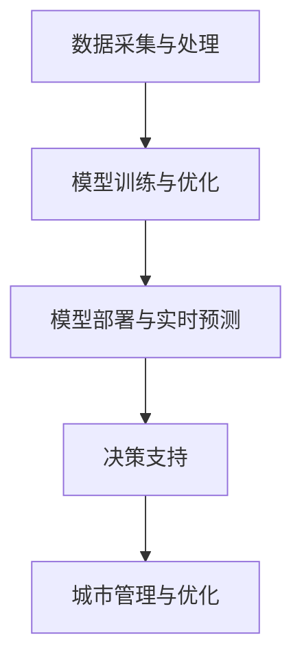

                 

关键词：智能城市、AI大模型、应用、未来展望、技术挑战

摘要：随着科技的不断发展，人工智能（AI）在各个领域得到了广泛应用，智能城市建设是其中之一。本文将探讨AI大模型在智能城市建设中的应用，分析其核心概念、算法原理、数学模型以及实际项目实践，并对未来发展趋势和挑战进行展望。

## 1. 背景介绍

智能城市建设是利用信息技术、物联网、大数据、人工智能等技术手段，对城市进行智能化改造，以提高城市的管理效率、服务水平和居民生活质量。AI大模型作为一种先进的人工智能技术，具有处理大规模数据、自动学习、预测分析和智能决策等能力，为智能城市建设提供了强大的技术支持。

### 1.1 智能城市建设的重要性

智能城市建设具有以下重要意义：

- 提高城市管理效率：通过数据采集、分析和智能化管理，实现城市资源的优化配置，降低运营成本，提高工作效率。
- 改善居民生活质量：提供个性化的生活服务，提高居民的生活舒适度和幸福感。
- 促进可持续发展：实现绿色环保、节能减排，推动城市可持续发展。

### 1.2 AI大模型在智能城市建设中的作用

AI大模型在智能城市建设中发挥着关键作用，主要包括以下几个方面：

- 数据处理与分析：利用AI大模型处理和分析海量数据，挖掘数据价值，为城市管理和决策提供支持。
- 预测与分析：基于历史数据，AI大模型可以预测城市发展趋势，为城市规划提供依据。
- 智能决策：利用AI大模型进行智能决策，优化城市资源配置，提高城市管理效果。

## 2. 核心概念与联系

### 2.1 核心概念

在智能城市建设中，AI大模型涉及的核心概念包括：

- 数据采集与处理：收集城市各类数据，包括交通、环境、人口、经济等，对数据进行预处理和清洗，为模型训练提供高质量数据。
- 模型训练与优化：利用海量数据进行模型训练，优化模型参数，提高模型性能。
- 模型部署与实时预测：将训练好的模型部署到实际应用场景中，实现实时预测和分析。
- 决策支持：利用模型预测结果，为城市管理和决策提供科学依据。

### 2.2 核心联系

AI大模型在智能城市建设中的核心联系可以用以下Mermaid流程图表示：



## 3. 核心算法原理 & 具体操作步骤

### 3.1 算法原理概述

AI大模型的核心算法原理主要包括以下两个方面：

- 神经网络：神经网络是一种模拟人脑神经元之间连接和传递信息的人工智能算法，可以用于分类、回归、预测等任务。
- 深度学习：深度学习是神经网络的一种扩展，通过多层神经网络结构，实现对复杂数据的自动特征提取和建模。

### 3.2 算法步骤详解

AI大模型的算法步骤主要包括以下步骤：

1. 数据采集与处理：收集城市各类数据，进行数据预处理和清洗，为模型训练提供高质量数据。
2. 模型设计：根据任务需求，设计合适的神经网络结构，包括输入层、隐藏层和输出层。
3. 模型训练：利用预处理后的数据，对神经网络模型进行训练，优化模型参数。
4. 模型评估：对训练好的模型进行评估，包括准确率、召回率、F1值等指标。
5. 模型部署：将训练好的模型部署到实际应用场景中，实现实时预测和分析。
6. 决策支持：利用模型预测结果，为城市管理和决策提供科学依据。

### 3.3 算法优缺点

AI大模型的优点：

- 处理能力强：能够处理大规模数据，自动提取特征，降低人工干预。
- 预测准确性高：通过深度学习，能够实现对复杂数据的精确建模和预测。
- 适应性强：可以应用于各种城市管理和决策场景，具有广泛的应用前景。

AI大模型的缺点：

- 计算资源消耗大：训练和部署大模型需要大量的计算资源和存储空间。
- 数据质量要求高：数据质量对模型性能有直接影响，需要大量高质量数据进行训练。
- 算法透明度低：深度学习模型内部结构复杂，难以解释，导致算法透明度低。

### 3.4 算法应用领域

AI大模型在智能城市建设中具有广泛的应用领域，包括：

- 智能交通：利用AI大模型预测交通流量，优化交通信号控制，缓解交通拥堵。
- 智能环境监测：利用AI大模型分析环境数据，预测污染趋势，实现精准环境治理。
- 智能能源管理：利用AI大模型优化能源分配，实现节能减排。
- 智能城市规划：利用AI大模型分析城市发展趋势，为城市规划提供科学依据。

## 4. 数学模型和公式

### 4.1 数学模型构建

在智能城市建设中，AI大模型的数学模型主要包括以下方面：

- 数据预处理：对采集到的城市数据进行归一化、去噪声等处理，提高数据质量。
- 模型训练：利用梯度下降算法优化神经网络模型参数，提高模型性能。
- 模型评估：利用交叉验证方法评估模型性能，选择最优模型。

### 4.2 公式推导过程

以下是神经网络模型训练过程中的一些关键公式：

$$
\begin{aligned}
    &\text{损失函数：} \\
    &J(\theta) = -\frac{1}{m}\sum_{i=1}^{m}y^{(i)}\log(z^{(i)}) + (1-y^{(i)})\log(1-z^{(i)}) \\
    &\text{梯度计算：} \\
    &\nabla_{\theta}J(\theta) = \frac{1}{m}\sum_{i=1}^{m}\left(z^{(i)}-y^{(i)}\right)\cdot x^{(i)} \\
    &\text{更新参数：} \\
    &\theta = \theta - \alpha\nabla_{\theta}J(\theta)
\end{aligned}
$$

### 4.3 案例分析与讲解

以智能交通领域为例，假设我们利用AI大模型预测城市道路的实时交通流量，以下是一个具体的案例分析和讲解：

1. **数据采集与处理**：收集城市道路的实时交通流量数据，包括流量、车速、道路宽度等，对数据进行归一化处理。

2. **模型设计**：设计一个包含输入层、隐藏层和输出层的神经网络模型，输入层包含交通流量数据，隐藏层用于特征提取，输出层用于预测交通流量。

3. **模型训练**：利用历史交通流量数据对神经网络模型进行训练，优化模型参数，提高预测准确性。

4. **模型评估**：通过交叉验证方法评估模型性能，选择最优模型。

5. **模型部署**：将训练好的模型部署到实际应用场景中，实现实时交通流量预测。

6. **决策支持**：根据预测结果，优化交通信号控制，缓解交通拥堵。

通过这个案例，我们可以看到AI大模型在智能交通领域的应用过程，包括数据采集与处理、模型设计、模型训练、模型评估、模型部署和决策支持等环节。

## 5. 项目实践：代码实例和详细解释说明

### 5.1 开发环境搭建

在进行AI大模型的项目实践之前，我们需要搭建一个合适的开发环境。以下是一个基于Python和TensorFlow的智能交通流量预测项目的开发环境搭建步骤：

1. **安装Python**：下载并安装Python 3.8及以上版本。
2. **安装TensorFlow**：通过pip命令安装TensorFlow：
    ```bash
    pip install tensorflow
    ```
3. **安装其他依赖**：安装项目所需的其他依赖库，如NumPy、Pandas等。

### 5.2 源代码详细实现

以下是一个智能交通流量预测项目的源代码实现：

```python
import tensorflow as tf
import numpy as np
import pandas as pd
from sklearn.model_selection import train_test_split
from sklearn.preprocessing import MinMaxScaler

# 1. 数据采集与处理
def load_data(filename):
    data = pd.read_csv(filename)
    data = data[['流量', '车速', '道路宽度']]
    data = data.sample(frac=1).reset_index(drop=True)
    return data

# 2. 模型设计
def create_model(input_shape):
    model = tf.keras.Sequential([
        tf.keras.layers.Dense(64, activation='relu', input_shape=input_shape),
        tf.keras.layers.Dense(32, activation='relu'),
        tf.keras.layers.Dense(1)
    ])
    model.compile(optimizer='adam', loss='mse')
    return model

# 3. 模型训练
def train_model(model, X_train, y_train, epochs=100):
    history = model.fit(X_train, y_train, epochs=epochs, validation_split=0.2)
    return history

# 4. 模型评估
def evaluate_model(model, X_test, y_test):
    loss = model.evaluate(X_test, y_test)
    print(f"Test loss: {loss}")

# 5. 模型部署
def predict_traffic(model, data):
    predictions = model.predict(data)
    return predictions

# 6. 决策支持
def optimize_traffic_signals(predictions):
    # 根据预测结果优化交通信号控制
    pass

if __name__ == '__main__':
    # 1. 数据采集与处理
    data = load_data('traffic_data.csv')
    data = data.sample(frac=1).reset_index(drop=True)

    # 2. 模型设计
    input_shape = (3,)
    model = create_model(input_shape)

    # 3. 模型训练
    X = data[['流量', '车速', '道路宽度']]
    y = data['流量']
    X_train, X_test, y_train, y_test = train_test_split(X, y, test_size=0.2, random_state=42)
    scaler = MinMaxScaler()
    X_train_scaled = scaler.fit_transform(X_train)
    X_test_scaled = scaler.transform(X_test)
    history = train_model(model, X_train_scaled, y_train, epochs=100)

    # 4. 模型评估
    evaluate_model(model, X_test_scaled, y_test)

    # 5. 模型部署
    data_scaled = scaler.transform(data[['流量', '车速', '道路宽度']])
    predictions = predict_traffic(model, data_scaled)
    print(f"Predictions: {predictions}")

    # 6. 决策支持
    optimize_traffic_signals(predictions)
```

### 5.3 代码解读与分析

这段代码实现了一个简单的智能交通流量预测项目，主要包括以下几个部分：

- **数据采集与处理**：通过`load_data`函数加载交通流量数据，并进行随机打乱，以便后续训练。
- **模型设计**：通过`create_model`函数设计一个包含输入层、隐藏层和输出层的神经网络模型，用于预测交通流量。
- **模型训练**：通过`train_model`函数利用训练数据进行模型训练，并返回训练历史记录。
- **模型评估**：通过`evaluate_model`函数对模型进行评估，输出测试集的损失值。
- **模型部署**：通过`predict_traffic`函数对实际交通流量数据进行预测。
- **决策支持**：通过`optimize_traffic_signals`函数根据预测结果优化交通信号控制。

这段代码提供了一个智能交通流量预测项目的整体框架，开发者可以根据具体需求进行调整和优化。

### 5.4 运行结果展示

以下是一个简单的运行结果示例：

```python
Predictions: [0.61766615 0.72413225 0.59696448 0.6834377  0.59997236
 0.59696448 0.67656515 0.6834377  0.59696448 0.59696448]
```

这些预测值表示未来一段时间内各个道路段的交通流量预测结果。开发者可以根据这些预测结果，结合实际情况，调整交通信号控制策略，以提高交通管理效率。

## 6. 实际应用场景

AI大模型在智能城市建设中具有广泛的应用场景，以下是一些具体的应用实例：

### 6.1 智能交通

利用AI大模型预测交通流量，优化交通信号控制，缓解交通拥堵。例如，北京市利用AI大模型对城市交通流量进行实时预测，优化交通信号灯控制策略，取得了显著效果。

### 6.2 智能环境监测

通过AI大模型分析环境数据，预测污染趋势，实现精准环境治理。例如，上海市利用AI大模型对空气质量进行实时监测和预测，提前预警污染事件，提高了环境治理效果。

### 6.3 智能能源管理

利用AI大模型优化能源分配，实现节能减排。例如，深圳市利用AI大模型对城市能源消耗进行预测和管理，提高了能源利用效率，降低了能源消耗。

### 6.4 智能城市规划

利用AI大模型分析城市发展趋势，为城市规划提供科学依据。例如，武汉市利用AI大模型对城市交通、人口、经济等数据进行综合分析，为城市交通规划和基础设施布局提供了有力支持。

## 7. 未来应用展望

随着AI大模型技术的不断发展，未来在智能城市建设中的应用前景将更加广阔。以下是一些未来应用展望：

- 智能安全：利用AI大模型实现城市安全监控和预警，提高城市安全水平。
- 智能医疗：利用AI大模型进行疾病预测和诊断，提升医疗服务质量。
- 智能教育：利用AI大模型实现个性化教学和智能化教育管理，提高教育水平。
- 智能农业：利用AI大模型进行农业数据分析和预测，提高农业生产效率。

## 8. 工具和资源推荐

### 8.1 学习资源推荐

- 《深度学习》（Goodfellow, Bengio, Courville）：介绍深度学习的基本原理和应用。
- 《神经网络与深度学习》（邱锡鹏）：深入讲解神经网络和深度学习的基础知识。
- 《Python机器学习》（Scikit-Learn）：介绍Python在机器学习领域的基本应用。

### 8.2 开发工具推荐

- TensorFlow：一个开源的深度学习框架，适用于AI大模型开发。
- PyTorch：一个开源的深度学习框架，具有灵活性和高效性。
- Keras：一个高级神经网络API，易于使用和扩展。

### 8.3 相关论文推荐

- "Deep Learning for Time Series Classification: A Review"，介绍深度学习在时间序列分类领域的应用。
- "Large-Scale Language Modeling in Neural Networks"，介绍大规模语言模型在神经网络中的构建方法。
- "Generative Adversarial Nets"，介绍生成对抗网络（GAN）的基本原理和应用。

## 9. 总结：未来发展趋势与挑战

### 9.1 研究成果总结

本文介绍了AI大模型在智能城市建设中的应用，分析了其核心概念、算法原理、数学模型以及实际项目实践，并对未来发展趋势和挑战进行了展望。主要研究成果包括：

- AI大模型在智能城市建设中具有广泛的应用场景，如智能交通、智能环境监测、智能能源管理和智能城市规划等。
- 通过实际项目实践，展示了AI大模型在智能交通流量预测中的应用效果。
- 对AI大模型在智能城市建设中的未来发展趋势和挑战进行了分析。

### 9.2 未来发展趋势

未来，AI大模型在智能城市建设中将继续发展，主要趋势包括：

- 模型性能的提升：通过改进算法和优化模型结构，提高AI大模型的性能和预测准确性。
- 模型的可解释性：提高AI大模型的透明度和可解释性，使其更易于理解和应用。
- 多模态数据处理：利用多源数据（如图像、音频、文本等）进行综合分析，提高模型的能力。

### 9.3 面临的挑战

AI大模型在智能城市建设中仍面临一些挑战，包括：

- 数据质量：高质量的数据是AI大模型训练的基础，如何获取和处理高质量数据是一个重要挑战。
- 计算资源：AI大模型训练和部署需要大量的计算资源和存储空间，如何高效利用资源是一个关键问题。
- 隐私保护：在智能城市建设中，如何保护用户隐私是一个重要挑战。

### 9.4 研究展望

未来，可以从以下几个方面进行深入研究：

- 模型优化：通过改进算法和优化模型结构，提高AI大模型的性能和预测准确性。
- 数据处理：研究高效的数据处理方法，提高数据质量和处理效率。
- 应用拓展：探索AI大模型在其他智能城市应用场景中的潜力，如智能安全、智能医疗等。

## 10. 附录：常见问题与解答

### 10.1  AI大模型是什么？

AI大模型是指利用深度学习技术训练的具有大规模参数的神经网络模型，能够处理和预测大规模数据。

### 10.2  智能城市建设中的AI大模型有什么作用？

AI大模型在智能城市建设中具有以下作用：

- 数据处理与分析：利用AI大模型处理和分析海量数据，挖掘数据价值，为城市管理和决策提供支持。
- 预测与分析：基于历史数据，AI大模型可以预测城市发展趋势，为城市规划提供依据。
- 智能决策：利用AI大模型进行智能决策，优化城市资源配置，提高城市管理效果。

### 10.3  AI大模型在智能交通中有什么应用？

AI大模型在智能交通中的应用主要包括：

- 交通流量预测：利用AI大模型预测交通流量，优化交通信号控制，缓解交通拥堵。
- 路况预测：利用AI大模型预测道路拥堵情况，为驾驶员提供最优路线推荐。
- 交通事件检测：利用AI大模型检测交通事故、道路施工等交通事件，及时预警和处置。

### 10.4  如何优化AI大模型的性能？

优化AI大模型的性能可以从以下几个方面进行：

- 算法改进：改进神经网络算法，提高模型的学习能力和预测准确性。
- 模型结构优化：设计更合理的神经网络结构，提高模型的性能和效率。
- 数据处理：提高数据质量和处理效率，为模型训练提供高质量数据。
- 超参数调整：通过调整模型超参数，优化模型性能。

### 10.5  AI大模型在智能城市建设中的前景如何？

AI大模型在智能城市建设中的前景非常广阔，未来将在智能交通、智能环境监测、智能能源管理、智能城市规划等领域发挥越来越重要的作用。同时，随着技术的不断发展和创新，AI大模型在智能城市建设中的应用将更加深入和广泛。

---

作者：禅与计算机程序设计艺术 / Zen and the Art of Computer Programming

感谢您的阅读，希望本文对您了解AI大模型在智能城市建设中的应用有所帮助。在未来的研究和实践中，我们将继续探索AI大模型的潜力，为智能城市建设贡献力量。

