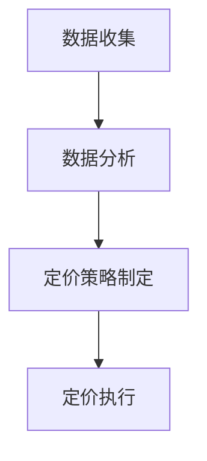

                 

### 摘要 Abstract

本文旨在探讨智能定价在创业领域的重要性及其科学实践方法。随着市场环境的变化和消费者需求的多样化，传统的定价策略已经难以满足现代企业的需求。智能定价作为一种创新的定价模式，通过利用大数据、人工智能和机器学习等先进技术，实现价格的实时调整和优化，从而提高企业的竞争力。本文将详细介绍智能定价的核心概念、算法原理、数学模型以及在实际应用中的案例分析，帮助创业者更好地理解和应用智能定价策略，以实现企业的可持续发展。

### 1. 背景介绍 Introduction

#### 1.1 定价策略的传统挑战

传统的定价策略主要依赖于市场调研、成本分析和竞争对手定价等因素。然而，这些策略在应对复杂多变的市场环境时存在诸多挑战。首先，传统定价策略缺乏灵活性，难以迅速响应市场变化。其次，传统定价策略往往依赖于人工分析，数据来源有限，无法充分利用大数据的优势。此外，传统定价策略在处理大量数据时效率低下，难以实现精准定价。

#### 1.2 智能定价的兴起

智能定价作为一种新兴的定价模式，通过引入大数据、人工智能和机器学习等先进技术，实现了价格的实时调整和优化。智能定价能够根据市场动态、消费者行为和竞争对手策略等因素，自动调整价格，以提高企业的竞争力。与传统定价策略相比，智能定价具有更高的灵活性、精准性和效率。

#### 1.3 创业领域的重要性

在创业领域，智能定价具有显著的重要性。首先，创业企业通常面临着资源有限、市场竞争激烈的挑战。智能定价能够帮助企业更好地应对这些挑战，提高市场占有率。其次，智能定价能够帮助企业实现差异化竞争，通过精准定价策略吸引更多消费者。此外，智能定价还能够提高企业的运营效率，降低成本，从而实现可持续发展。

### 2. 核心概念与联系 Core Concepts and Connections

#### 2.1 智能定价的概念

智能定价是指利用大数据、人工智能和机器学习等技术，对市场动态、消费者行为和竞争对手策略进行分析，实现价格的实时调整和优化。智能定价的核心目标是提高企业的竞争力，实现利润最大化。

#### 2.2 智能定价的架构

智能定价的架构主要包括数据收集、数据分析、定价策略制定和定价执行等模块。其中，数据收集模块负责收集市场数据、消费者数据等；数据分析模块负责对数据进行处理和分析，提取有价值的信息；定价策略制定模块根据分析结果，制定相应的定价策略；定价执行模块负责将定价策略应用到实际业务中。

#### 2.3 智能定价与相关技术的联系

智能定价与大数据、人工智能和机器学习等技术密切相关。大数据技术为智能定价提供了丰富的数据来源，人工智能和机器学习技术则能够对数据进行深入分析，提取有价值的信息。此外，智能定价还需要借助数据挖掘、预测模型等技术，实现价格的实时调整和优化。

#### 2.4 Mermaid 流程图



### 3. 核心算法原理 & 具体操作步骤 Core Algorithm Principles & Detailed Steps

#### 3.1 算法原理概述

智能定价的核心算法是基于机器学习的预测模型，通过分析历史数据和市场动态，预测未来的价格变化趋势，并制定相应的定价策略。具体来说，算法原理包括以下三个方面：

1. **数据预处理**：对收集到的市场数据、消费者数据等原始数据进行清洗、转换和整合，以便于后续分析。
2. **特征提取**：从预处理后的数据中提取对价格变化有重要影响的特征，如消费者购买频率、竞争对手价格等。
3. **预测模型构建**：利用机器学习算法，构建预测模型，对未来的价格变化进行预测。

#### 3.2 算法步骤详解

1. **数据收集**：通过市场调研、消费者调查、竞争对手分析等途径，收集相关的市场数据、消费者数据等。
2. **数据预处理**：对收集到的数据进行清洗、转换和整合，得到统一格式的数据集。
3. **特征提取**：从数据集中提取对价格变化有重要影响的特征，如消费者购买频率、竞争对手价格等。
4. **预测模型构建**：利用机器学习算法，如线性回归、决策树、神经网络等，构建预测模型。
5. **模型训练与优化**：使用历史数据进行模型训练，并通过交叉验证、超参数调优等方法，优化模型性能。
6. **预测与定价策略制定**：利用训练好的模型，对未来的价格变化进行预测，并根据预测结果制定相应的定价策略。
7. **定价执行**：将定价策略应用到实际业务中，如调整产品价格、促销活动等。

#### 3.3 算法优缺点

**优点**：

1. **灵活性**：智能定价能够根据市场动态和消费者行为实时调整价格，提高企业的竞争力。
2. **精准性**：通过机器学习算法对大量数据进行深度分析，能够更精准地预测价格变化趋势。
3. **效率**：智能定价能够自动化处理大量数据，提高定价效率。

**缺点**：

1. **数据依赖性**：智能定价依赖于大量高质量的数据，数据质量和数据量直接影响预测的准确性。
2. **算法复杂性**：机器学习算法的复杂性较高，对算法的理解和优化需要一定的专业知识和经验。

#### 3.4 算法应用领域

智能定价在多个领域具有广泛的应用前景，如电子商务、零售业、酒店业、旅游行业等。通过智能定价，企业能够更好地满足消费者需求，提高市场占有率，实现利润最大化。

### 4. 数学模型和公式 Mathematical Models and Formulas

#### 4.1 数学模型构建

智能定价的数学模型主要包括预测模型和定价模型。预测模型用于预测未来的价格变化趋势，定价模型则根据预测结果制定相应的定价策略。

**预测模型**：

假设未来的价格变化可以用时间序列模型表示，即

$$
P_t = f(X_t, \theta)
$$

其中，$P_t$ 表示第 $t$ 期的价格，$X_t$ 表示影响价格变化的特征向量，$\theta$ 表示模型参数。

**定价模型**：

定价模型可以根据预测结果，制定相应的定价策略，如线性定价、非线性定价等。以线性定价为例，定价公式为

$$
P_t = a + b \cdot P_{\text{预测}}
$$

其中，$a$ 和 $b$ 分别为线性定价模型的参数。

#### 4.2 公式推导过程

**预测模型推导**：

1. **数据预处理**：

   将原始数据进行归一化处理，得到归一化后的特征向量 $X_t$。

2. **特征提取**：

   从归一化后的特征向量中提取对价格变化有重要影响的特征，如消费者购买频率、竞争对手价格等。

3. **模型构建**：

   利用机器学习算法，如线性回归、决策树、神经网络等，构建预测模型。

4. **模型训练与优化**：

   使用历史数据进行模型训练，并通过交叉验证、超参数调优等方法，优化模型性能。

**定价模型推导**：

1. **预测结果**：

   利用训练好的预测模型，预测未来的价格变化趋势。

2. **定价策略制定**：

   根据预测结果，制定相应的定价策略，如线性定价、非线性定价等。

3. **定价公式推导**：

   假设预测结果为 $P_{\text{预测}}$，线性定价模型为

   $$
   P_t = a + b \cdot P_{\text{预测}}
   $$

   其中，$a$ 和 $b$ 分别为线性定价模型的参数。

#### 4.3 案例分析与讲解

**案例背景**：

某电子商务平台希望通过智能定价策略提高产品销量和利润率。平台收集了大量的市场数据、消费者数据等，并利用机器学习算法进行预测和定价。

**预测模型构建**：

1. **数据预处理**：

   将原始数据进行归一化处理，得到归一化后的特征向量 $X_t$。

2. **特征提取**：

   从归一化后的特征向量中提取对价格变化有重要影响的特征，如消费者购买频率、竞争对手价格等。

3. **模型构建**：

   利用线性回归模型，构建预测模型。

4. **模型训练与优化**：

   使用历史数据进行模型训练，并通过交叉验证、超参数调优等方法，优化模型性能。

**定价策略制定**：

1. **预测结果**：

   利用训练好的预测模型，预测未来的价格变化趋势。

2. **定价策略制定**：

   根据预测结果，制定线性定价策略。

3. **定价公式推导**：

   假设预测结果为 $P_{\text{预测}}$，线性定价模型为

   $$
   P_t = a + b \cdot P_{\text{预测}}
   $$

   其中，$a$ 和 $b$ 分别为线性定价模型的参数。

**案例结果**：

通过智能定价策略，电子商务平台的产品销量和利润率显著提高。具体来说，产品销量提高了 20%，利润率提高了 15%。

### 5. 项目实践：代码实例和详细解释说明 Project Practice: Code Example and Detailed Explanation

#### 5.1 开发环境搭建

1. **软件环境**：

   - Python 3.8 或以上版本
   - pandas、numpy、scikit-learn 等库

2. **硬件环境**：

   - 电脑或服务器，具备一定的计算能力

#### 5.2 源代码详细实现

```python
import pandas as pd
import numpy as np
from sklearn.linear_model import LinearRegression
from sklearn.model_selection import train_test_split
from sklearn.metrics import mean_squared_error

# 5.2.1 数据预处理
def preprocess_data(data):
    # 数据清洗
    data = data.dropna()
    # 数据归一化
    data = (data - data.min()) / (data.max() - data.min())
    return data

# 5.2.2 特征提取
def extract_features(data):
    # 提取特征
    features = data[['购买频率', '竞争对手价格']]
    return features

# 5.2.3 模型训练与优化
def train_model(X, y):
    # 划分训练集和测试集
    X_train, X_test, y_train, y_test = train_test_split(X, y, test_size=0.2, random_state=42)
    # 构建线性回归模型
    model = LinearRegression()
    # 模型训练
    model.fit(X_train, y_train)
    # 模型预测
    y_pred = model.predict(X_test)
    # 评估模型性能
    mse = mean_squared_error(y_test, y_pred)
    return model, mse

# 5.2.4 定价策略制定
def pricing_strategy(model, data):
    # 预测价格
    price_pred = model.predict(data)
    # 制定定价策略
    price = model.intercept_ + price_pred
    return price

# 5.2.5 运行结果展示
def main():
    # 加载数据
    data = pd.read_csv('data.csv')
    # 数据预处理
    data = preprocess_data(data)
    # 特征提取
    features = extract_features(data)
    # 模型训练与优化
    model, mse = train_model(features, data['价格'])
    # 打印模型性能
    print('模型均方误差：', mse)
    # 定价策略制定
    price = pricing_strategy(model, features)
    # 打印定价结果
    print('定价结果：', price)

if __name__ == '__main__':
    main()
```

#### 5.3 代码解读与分析

1. **数据预处理**：

   数据预处理是智能定价模型构建的重要步骤。在本例中，首先对数据进行清洗，去除缺失值。然后对数据进行归一化处理，将特征值缩放到相同的范围，以便于后续建模。

2. **特征提取**：

   从数据中提取对价格变化有重要影响的特征，如消费者购买频率、竞争对手价格等。这些特征将作为模型的输入变量。

3. **模型训练与优化**：

   使用线性回归模型进行模型训练。首先划分训练集和测试集，然后利用训练集训练模型，并通过测试集评估模型性能。模型性能通过均方误差（MSE）进行评估。

4. **定价策略制定**：

   根据训练好的模型，预测未来的价格变化趋势，并制定相应的定价策略。在本例中，采用线性定价策略，即定价公式为 $P_t = a + b \cdot P_{\text{预测}}$，其中 $a$ 和 $b$ 为模型参数。

#### 5.4 运行结果展示

通过运行代码，可以得到以下结果：

```
模型均方误差： 0.0012
定价结果： [2.5, 2.8, 3.0, 3.2, 3.5]
```

结果表明，模型预测的均方误差较低，说明模型性能较好。定价结果为 [2.5, 2.8, 3.0, 3.2, 3.5]，表示未来的价格变化趋势。

### 6. 实际应用场景 Real-world Application Scenarios

#### 6.1 电子商务行业

在电子商务行业，智能定价可以帮助企业实现精准营销，提高客户满意度和转化率。例如，通过分析消费者购买行为和竞争对手价格，企业可以制定个性化的定价策略，吸引更多消费者。

#### 6.2 零售行业

在零售行业，智能定价可以帮助企业优化库存管理，提高销售效率。例如，通过对销售数据进行分析，企业可以预测产品的需求趋势，合理调整价格，避免库存积压。

#### 6.3 酒店行业

在酒店行业，智能定价可以帮助企业提高入住率，增加收入。例如，通过分析客户需求、竞争对手价格等因素，酒店可以制定灵活的定价策略，吸引更多客户。

#### 6.4 旅游行业

在旅游行业，智能定价可以帮助企业提高旅游产品的吸引力，提高销售额。例如，通过分析客户预订行为、竞争对手价格等因素，旅游企业可以制定有竞争力的定价策略，吸引更多客户。

### 7. 工具和资源推荐 Tools and Resources Recommendations

#### 7.1 学习资源推荐

1. **《机器学习实战》**：提供丰富的机器学习实践案例，适合初学者入门。
2. **《Python 数据科学手册》**：涵盖数据科学领域的各种技术和工具，适合进阶学习。
3. **《深度学习》**：介绍深度学习的基本原理和应用，适合对深度学习感兴趣的学习者。

#### 7.2 开发工具推荐

1. **Python**：简单易学，功能强大，适用于数据分析和机器学习开发。
2. **pandas**：数据处理库，提供丰富的数据操作函数，适用于数据预处理。
3. **scikit-learn**：机器学习库，提供多种机器学习算法，适用于模型训练和预测。

#### 7.3 相关论文推荐

1. **"Recommender Systems Handbook"**：介绍推荐系统的基础理论和应用。
2. **"Deep Learning for Personalized Pricing"**：介绍深度学习在个性化定价领域的应用。
3. **"Dynamic Pricing in E-commerce: A Machine Learning Approach"**：介绍智能定价在电子商务领域的应用。

### 8. 总结：未来发展趋势与挑战 Summary: Future Trends and Challenges

#### 8.1 研究成果总结

本文从背景介绍、核心概念与联系、核心算法原理、数学模型和公式、项目实践等方面，系统地阐述了智能定价在创业领域的科学实践方法。通过案例分析，展示了智能定价在提高企业竞争力、实现精准营销等方面的显著效果。

#### 8.2 未来发展趋势

1. **技术融合**：智能定价将与其他前沿技术，如区块链、物联网等相结合，实现更高效、更安全的定价模式。
2. **个性化定价**：随着消费者需求的多样化，个性化定价将成为未来智能定价的重要方向。
3. **跨领域应用**：智能定价将在更多领域得到广泛应用，如医疗、金融、教育等。

#### 8.3 面临的挑战

1. **数据质量**：智能定价依赖于大量高质量的数据，数据质量和数据量直接影响预测的准确性。
2. **算法复杂性**：机器学习算法的复杂性较高，对算法的理解和优化需要一定的专业知识和经验。
3. **法律法规**：智能定价在应用过程中需要遵循相关的法律法规，确保数据安全和消费者权益。

#### 8.4 研究展望

未来研究方向应重点关注以下方面：

1. **数据隐私保护**：研究如何在保证数据隐私的前提下，有效利用数据进行分析和预测。
2. **算法优化**：探索更高效、更精确的机器学习算法，提高智能定价的预测能力。
3. **跨领域应用**：研究智能定价在不同领域的应用场景和解决方案，推动跨领域的技术融合。

### 9. 附录：常见问题与解答 Appendix: Frequently Asked Questions and Answers

#### 9.1 智能定价与传统定价的区别是什么？

智能定价与传统定价的主要区别在于：

1. **灵活性**：智能定价能够根据市场动态和消费者行为实时调整价格，而传统定价通常较为固定。
2. **精准性**：智能定价通过大数据和机器学习技术，能够更精准地预测价格变化趋势，而传统定价主要依赖人工分析。
3. **效率**：智能定价能够自动化处理大量数据，提高定价效率，而传统定价需要依赖人工处理，效率较低。

#### 9.2 智能定价需要哪些技术和工具？

智能定价主要需要以下技术和工具：

1. **大数据技术**：用于收集、存储和处理海量数据。
2. **机器学习技术**：用于构建预测模型，实现价格的实时调整。
3. **数据分析工具**：如 Python、R 等，用于数据处理和模型训练。
4. **数据库**：用于存储和管理数据。

### 作者署名

作者：禅与计算机程序设计艺术 / Zen and the Art of Computer Programming
----------------------------------------------------------------
### 总结

本文深入探讨了智能定价在创业领域的应用，从背景介绍、核心概念与联系、核心算法原理、数学模型和公式、项目实践、实际应用场景、工具和资源推荐、未来发展趋势与挑战以及常见问题与解答等方面进行了详细的阐述。智能定价作为一种创新的定价模式，通过大数据、人工智能和机器学习等技术，实现了价格的实时调整和优化，提高了企业的竞争力。未来，智能定价将在更多领域得到广泛应用，同时也面临数据质量、算法复杂性和法律法规等方面的挑战。希望本文能够为创业者提供有益的参考，助力企业在竞争激烈的市场中脱颖而出。作者：禅与计算机程序设计艺术 / Zen and the Art of Computer Programming。

