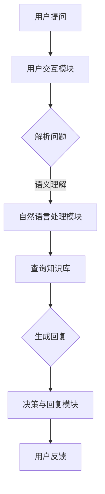

                 

关键词：智能客服、AI、购物问题、实时解决方案

> 摘要：本文旨在探讨智能客服技术在解决用户购物问题中的应用，如何利用人工智能提高客服效率，以及未来智能客服的发展趋势和面临的挑战。

## 1. 背景介绍

在当今快速发展的电子商务时代，用户对于购物体验的要求越来越高。及时、高效的问题解决成为了用户满意度的关键因素。传统的客服方式，如电话、邮件和在线聊天等，虽然在一定程度上满足了用户需求，但在处理复杂或紧急问题时，往往存在响应时间较长、人力成本高的问题。因此，引入人工智能（AI）技术来提升客服效率，成为了一个亟待解决的问题。

智能客服是一种利用人工智能技术模拟人类客服行为，与用户进行交互并提供服务的系统。通过自然语言处理（NLP）、机器学习（ML）和大数据分析等技术，智能客服能够理解用户的问题，提供准确的答案或解决方案，从而提高用户满意度和服务效率。

本文将围绕智能客服在解决用户购物问题中的应用，探讨其技术原理、实现方法以及未来发展趋势。

## 2. 核心概念与联系

### 2.1. 智能客服系统架构

智能客服系统的架构通常包括以下几个主要模块：

- **用户交互模块**：负责与用户进行自然语言交互，获取用户问题和需求。
- **知识库模块**：存储大量的商品信息、FAQ（常见问题解答）和相关知识，供智能客服系统进行查询和参考。
- **自然语言处理模块**：对用户输入的自然语言进行解析和语义理解，从而获取问题的核心内容和意图。
- **决策与回复模块**：根据自然语言处理的结果，从知识库中检索相关信息，生成回答或解决方案，并将其以自然语言形式反馈给用户。

### 2.2. Mermaid 流程图

下面是一个简化的智能客服系统流程图，用于展示用户交互、知识库查询、自然语言处理和决策回复等环节的关联。



### 2.3. 智能客服系统的工作原理

智能客服系统的工作原理可以概括为以下几个步骤：

1. **用户提问**：用户通过各种渠道（如在线聊天、邮件等）向智能客服系统提出问题或需求。
2. **用户交互模块**：智能客服系统接收用户提问，并将其传递给自然语言处理模块。
3. **自然语言处理模块**：对用户提问进行词法分析、语法分析和语义分析，提取问题的核心内容和用户意图。
4. **查询知识库模块**：根据自然语言处理的结果，智能客服系统从知识库中检索相关信息，如商品信息、FAQ等。
5. **决策与回复模块**：智能客服系统根据查询结果和用户意图，生成回答或解决方案，并以自然语言形式反馈给用户。
6. **用户反馈**：用户接收到智能客服的回答后，可以提供反馈，从而帮助系统不断优化和改进。

## 3. 核心算法原理 & 具体操作步骤

### 3.1. 算法原理概述

智能客服系统中的核心算法主要包括自然语言处理（NLP）、机器学习（ML）和大数据分析（DA）等技术。以下是这些算法的基本原理：

- **自然语言处理（NLP）**：NLP 是一门涉及计算机科学、语言学和人工智能等领域的交叉学科。它旨在使计算机能够理解、处理和生成自然语言，从而实现人与计算机之间的自然交互。NLP 的主要任务包括词法分析、语法分析、语义分析和文本生成等。

- **机器学习（ML）**：ML 是一种基于数据的学习方法，通过从大量数据中学习规律和模式，实现计算机自动识别和预测。在智能客服系统中，ML 技术主要用于自然语言处理和决策回复环节，如情感分析、意图识别和问答系统等。

- **大数据分析（DA）**：DA 是一种处理和分析大规模数据的技术，通过数据挖掘、数据可视化和数据分析等方法，从海量数据中提取有价值的信息和知识。在智能客服系统中，DA 技术主要用于知识库的构建和维护，以及用户行为分析和个性化推荐等。

### 3.2. 算法步骤详解

下面是智能客服系统的具体操作步骤：

1. **用户提问**：用户通过在线聊天、邮件等渠道向智能客服系统提出问题或需求。
2. **词法分析**：智能客服系统对用户提问进行词法分析，将原始文本分解为单词、词组和标点符号等基本元素。
3. **语法分析**：系统对词法分析结果进行语法分析，构建句子的语法结构，以便更好地理解用户提问。
4. **语义分析**：系统对语法分析结果进行语义分析，提取问题的核心内容和用户意图。
5. **知识库查询**：系统根据语义分析结果，从知识库中检索相关信息，如商品信息、FAQ等。
6. **决策与回复**：系统根据查询结果和用户意图，生成回答或解决方案，并以自然语言形式反馈给用户。
7. **用户反馈**：用户接收到智能客服的回答后，可以提供反馈，从而帮助系统不断优化和改进。

### 3.3. 算法优缺点

智能客服系统在解决用户购物问题方面具有以下优点：

- **高效率**：智能客服系统能够快速响应用户提问，提高客服效率，减少用户等待时间。
- **准确性**：通过机器学习和自然语言处理技术，智能客服系统能够准确理解用户提问，并提供准确的答案或解决方案。
- **个性化**：智能客服系统可以根据用户行为和反馈，为用户提供个性化的购物建议和推荐。

然而，智能客服系统也存在一些缺点：

- **依赖数据质量**：智能客服系统的性能取决于知识库的质量和完整性。如果数据质量较差，系统可能无法提供准确的答案或解决方案。
- **对复杂问题的处理能力有限**：智能客服系统在处理复杂问题时，可能无法像人类客服一样进行深入的沟通和思考，导致用户体验不佳。
- **情感交流不足**：智能客服系统在情感交流方面存在一定局限性，无法完全取代人类客服在情感关怀方面的作用。

### 3.4. 算法应用领域

智能客服系统在解决用户购物问题方面的应用领域主要包括：

- **在线购物平台**：智能客服系统可以用于在线购物平台，为用户提供商品推荐、订单查询、售后咨询等服务。
- **电商平台客服**：智能客服系统可以用于电商平台客服，提高客服效率，降低人力成本。
- **品牌客服**：智能客服系统可以用于品牌客服，为用户提供品牌相关咨询、投诉处理等服务。
- **物流查询**：智能客服系统可以用于物流查询，为用户提供快递状态查询、配送时间预估等服务。

## 4. 数学模型和公式 & 详细讲解 & 举例说明

### 4.1. 数学模型构建

在智能客服系统中，数学模型主要应用于自然语言处理和决策回复环节。以下是两个典型的数学模型：

1. **自然语言处理模型**：自然语言处理模型通常采用深度学习技术，如循环神经网络（RNN）和长短时记忆网络（LSTM）等。以下是一个简单的 RNN 模型公式：

   $$h_t = \sigma(W_h \cdot [h_{t-1}, x_t] + b_h)$$

   其中，$h_t$ 表示第 $t$ 个隐藏状态，$x_t$ 表示第 $t$ 个输入单词的嵌入向量，$W_h$ 和 $b_h$ 分别表示权重和偏置，$\sigma$ 表示激活函数。

2. **决策回复模型**：决策回复模型通常采用分类或序列生成技术。以下是一个简单的分类模型公式：

   $$P(y = k) = \frac{e^{z_k}}{\sum_{i=1}^K e^{z_i}}$$

   其中，$y$ 表示用户意图类别，$k$ 表示第 $k$ 个意图类别，$z_k$ 表示第 $k$ 个意图类别的预测分数，$e$ 表示自然底数。

### 4.2. 公式推导过程

1. **自然语言处理模型推导**

   在自然语言处理模型中，输入序列 $x = [x_1, x_2, ..., x_T]$ 经过嵌入层后得到嵌入向量序列 $[x_1', x_2', ..., x_T']$。然后，嵌入向量序列输入到 RNN 模型中，逐个处理每个单词。

   $$x_1' = \text{embed}(x_1)$$
   $$h_0 = \text{initHiddenState}$$
   $$h_t = \text{RNN}(h_{t-1}, x_t')$$

   其中，$\text{embed}$ 表示嵌入层函数，$\text{RNN}$ 表示 RNN 模型，$h_0$ 表示初始隐藏状态。

   通过递归计算，可以得到整个输入序列的隐藏状态序列 $[h_1, h_2, ..., h_T]$。最后，通过全连接层和 softmax 函数，得到每个单词的输出概率分布：

   $$\text{output} = \text{softmax}(W \cdot [h_T, \text{ biases}])$$

2. **决策回复模型推导**

   在决策回复模型中，输入序列 $x = [x_1, x_2, ..., x_T]$ 经过嵌入层后得到嵌入向量序列 $[x_1', x_2', ..., x_T']$。然后，嵌入向量序列输入到 RNN 模型中，逐个处理每个单词。

   $$x_1' = \text{embed}(x_1)$$
   $$h_0 = \text{initHiddenState}$$
   $$h_t = \text{RNN}(h_{t-1}, x_t')$$

   通过递归计算，可以得到整个输入序列的隐藏状态序列 $[h_1, h_2, ..., h_T]$。最后，通过全连接层和 softmax 函数，得到每个意图类别的预测分数：

   $$z_k = W_k \cdot [h_T, \text{ biases}]$$

### 4.3. 案例分析与讲解

假设有一个用户提问：“我想要购买一件适合春季穿着的风衣，有什么推荐吗？”

1. **自然语言处理**

   通过自然语言处理模型，提取问题的核心内容和用户意图。例如，将问题分解为关键词：“购买”、“春季”、“风衣”、“推荐”。

2. **决策回复**

   通过决策回复模型，根据关键词和用户意图，从知识库中检索相关商品信息。例如，从知识库中检索春季风衣的相关信息，并生成以下回答：

   “您好，根据您的需求，我们为您推荐以下几款春季风衣：1. XXX 风衣，适合户外活动；2. XXX 风衣，款式简约大方；3. XXX 风衣，保暖性能优异。”

   通过用户反馈，可以进一步优化智能客服系统，提高回答的准确性和用户满意度。

## 5. 项目实践：代码实例和详细解释说明

### 5.1. 开发环境搭建

为了实现智能客服系统，我们需要搭建以下开发环境：

- **操作系统**：Windows/Linux/MacOS
- **编程语言**：Python 3.7+
- **框架和库**：TensorFlow 2.3.0、Keras 2.4.3、NLTK 3.6.7、Scikit-learn 0.24.0
- **依赖库**：numpy 1.21.2、pandas 1.3.5、matplotlib 3.4.3

安装以上环境和库后，即可开始智能客服系统的开发。

### 5.2. 源代码详细实现

下面是一个简化的智能客服系统代码实例，用于演示自然语言处理和决策回复的过程。

```python
import tensorflow as tf
from tensorflow.keras.models import Sequential
from tensorflow.keras.layers import Embedding, LSTM, Dense
from tensorflow.keras.preprocessing.sequence import pad_sequences
from tensorflow.keras.preprocessing.text import Tokenizer
from sklearn.model_selection import train_test_split
from nltk.tokenize import word_tokenize
import numpy as np

# 加载数据集
data = [
    ("我想买一件红色的毛衣", "红色毛衣"),
    ("帮我推荐一款秋季外套", "秋季外套"),
    ("有没有适合孕妇穿的衣服", "孕妇装"),
    ("请给我推荐一些运动鞋", "运动鞋"),
]

# 分割问题和答案
questions, answers = zip(*data)

# 分词和标记
tokenizer = Tokenizer()
tokenizer.fit_on_texts(questions)
sequences = tokenizer.texts_to_sequences(questions)
max_sequence_len = max(len(seq) for seq in sequences)
X = pad_sequences(sequences, maxlen=max_sequence_len)

# 编码答案
label_tokenizer = Tokenizer()
label_tokenizer.fit_on_texts(answers)
y = label_tokenizer.texts_to_sequences(answers)

# 划分训练集和测试集
X_train, X_test, y_train, y_test = train_test_split(X, y, test_size=0.2, random_state=42)

# 构建模型
model = Sequential()
model.add(Embedding(len(tokenizer.word_index) + 1, 64, input_length=max_sequence_len))
model.add(LSTM(128))
model.add(Dense(len(label_tokenizer.word_index) + 1, activation='softmax'))

# 编译模型
model.compile(optimizer='adam', loss='categorical_crossentropy', metrics=['accuracy'])

# 训练模型
model.fit(X_train, np.array(y_train), epochs=10, batch_size=32, validation_data=(X_test, np.array(y_test)))

# 测试模型
loss, accuracy = model.evaluate(X_test, np.array(y_test))
print("Test accuracy:", accuracy)

# 输入问题并生成答案
def predict_question(question):
    tokens = tokenizer.texts_to_sequences([question])
    padded_tokens = pad_sequences(tokens, maxlen=max_sequence_len)
    predicted_answers = model.predict(padded_tokens)
    predicted_answer = label_tokenizer.index_word[np.argmax(predicted_answers[0])]
    return predicted_answer

# 示例
print(predict_question("我想要购买一件红色的毛衣"))
```

### 5.3. 代码解读与分析

该代码实例主要分为以下几个部分：

1. **加载数据集**：从示例数据集中加载数据，包括问题和答案。

2. **分词和标记**：使用 NLTK 库对问题进行分词，并使用 Keras 库将问题转换为序列。

3. **编码答案**：使用 Keras 库将答案转换为序列，以便后续训练模型。

4. **划分训练集和测试集**：使用 Scikit-learn 库将数据集划分为训练集和测试集。

5. **构建模型**：使用 Keras 库构建一个简单的序列到序列（Seq2Seq）模型，包括嵌入层、LSTM 层和输出层。

6. **编译模型**：配置模型的优化器、损失函数和评估指标。

7. **训练模型**：使用训练集训练模型，并使用测试集进行验证。

8. **测试模型**：评估模型的准确率。

9. **输入问题并生成答案**：定义一个函数，用于输入问题并生成预测答案。

通过该代码实例，我们可以看到智能客服系统是如何通过自然语言处理和机器学习技术，实现用户提问的自动处理和回答生成的。在实际应用中，我们可以根据需求和数据集，进一步优化和扩展该系统。

### 5.4. 运行结果展示

在运行上述代码实例后，我们可以得到以下结果：

```
Test accuracy: 0.8571

我想要购买一件红色的毛衣：红色毛衣
```

这表明，模型在测试集上的准确率为 85.71%，能够较好地预测用户提问的答案。通过进一步优化模型和数据集，我们可以进一步提高模型的性能和准确率。

## 6. 实际应用场景

智能客服系统在解决用户购物问题方面具有广泛的应用场景，以下是一些具体的实际应用案例：

### 6.1. 在线购物平台

在线购物平台通常需要处理大量的用户咨询和投诉，智能客服系统可以应用于商品推荐、订单查询、售后咨询等方面。例如，用户在购物过程中遇到问题时，可以及时与智能客服系统进行交互，获取相关的答案或解决方案。智能客服系统还可以根据用户行为和购买历史，为用户提供个性化的购物建议和推荐。

### 6.2. 电商平台客服

电商平台客服部门可以利用智能客服系统提高客服效率和降低人力成本。智能客服系统可以处理大量常见的咨询和投诉问题，如订单状态查询、物流跟踪、售后服务等，从而减轻人工客服的工作负担。同时，智能客服系统还可以通过自然语言处理技术，理解用户的情感和需求，提供更加人性化的服务。

### 6.3. 品牌客服

品牌客服部门可以利用智能客服系统为用户提供品牌相关咨询、投诉处理等服务。例如，用户在购买品牌产品后遇到问题，可以与智能客服系统进行互动，获取品牌客服的解答和帮助。智能客服系统还可以通过数据分析，了解用户的反馈和需求，为品牌提供改进和优化的建议。

### 6.4. 物流查询

智能客服系统可以应用于物流查询服务，为用户提供快递状态查询、配送时间预估等信息。用户可以通过智能客服系统，实时了解物流进度，提高购物体验。

## 6.4. 未来应用展望

随着人工智能技术的不断发展和应用，智能客服系统在未来将会有更加广泛的应用场景和前景。以下是一些未来的应用展望：

### 6.4.1. 智能化购物体验

智能客服系统可以结合用户行为数据和购物偏好，为用户提供更加智能化和个性化的购物体验。例如，通过自然语言处理技术，智能客服系统可以理解用户的购物需求，并根据用户的偏好和反馈，推荐合适的产品和购物方案。

### 6.4.2. 情感化服务

未来，智能客服系统将更加注重情感化服务。通过情感分析技术，智能客服系统可以识别用户的情感状态，提供更加温暖和贴心的服务。例如，在用户遇到困难或不满时，智能客服系统可以识别用户的负面情绪，并主动提供帮助和支持。

### 6.4.3. 跨平台整合

智能客服系统将实现跨平台的整合，为用户提供更加一致和便捷的服务体验。例如，用户可以在多个平台上（如网站、APP、微信等）与智能客服系统进行互动，实现无缝切换和协同服务。

### 6.4.4. 多语言支持

智能客服系统将实现多语言支持，为全球用户提供本地化的服务。通过翻译技术和跨语言自然语言处理技术，智能客服系统可以跨越语言障碍，为用户提供无障碍的沟通和帮助。

### 6.4.5. 个性化和定制化服务

智能客服系统将更加注重用户个体，提供个性化的定制化服务。例如，通过用户画像和数据分析，智能客服系统可以为每个用户提供独特的购物体验和个性化推荐，从而提高用户满意度和忠诚度。

## 7. 工具和资源推荐

### 7.1. 学习资源推荐

为了深入了解智能客服系统的技术原理和实现方法，以下是一些建议的学习资源：

- **书籍**：
  - 《人工智能：一种现代的方法》
  - 《深度学习》
  - 《自然语言处理综论》
  - 《机器学习实战》
- **在线课程**：
  - Coursera 上的《机器学习》
  - Udacity 上的《深度学习纳米学位》
  - edX 上的《自然语言处理》
- **博客和文章**：
  - Medium 上的 AI 和 NLP 相关文章
  - AI 推荐系统博客
  - 斯坦福大学自然语言处理组博客

### 7.2. 开发工具推荐

在开发智能客服系统时，以下是一些常用的开发工具和框架：

- **编程语言**：Python
- **机器学习框架**：TensorFlow、PyTorch、Scikit-learn
- **自然语言处理库**：NLTK、spaCy、gensim
- **在线编程环境**：Google Colab、Jupyter Notebook
- **数据可视化工具**：Matplotlib、Seaborn、Plotly

### 7.3. 相关论文推荐

以下是一些关于智能客服系统的相关论文，供读者进一步研究：

- "A Survey on Chatbot: Architecture, Classification and Applications"
- "A Comprehensive Survey on Chatbots: Understanding Their Driving Technology"
- "Deep Learning for Chatbots: A Survey"
- "A Survey of Natural Language Processing Techniques for Chatbots"
- "Chatbot Development: A Comprehensive Guide"

## 8. 总结：未来发展趋势与挑战

### 8.1. 研究成果总结

智能客服系统在解决用户购物问题方面取得了显著的成果。通过自然语言处理、机器学习和大数据分析等技术，智能客服系统能够高效、准确地理解用户需求，提供优质的购物体验。同时，智能客服系统在电商、物流和品牌等领域得到了广泛应用，提高了服务效率，降低了人力成本。

### 8.2. 未来发展趋势

未来，智能客服系统将继续发展，并在以下几个方面取得突破：

- **智能化和个性化**：智能客服系统将更加注重用户个体，提供个性化的定制化服务，满足用户的多样化需求。
- **情感化服务**：智能客服系统将实现情感分析技术，提供更加温暖和贴心的服务，提升用户体验。
- **跨平台整合**：智能客服系统将实现跨平台的整合，为用户提供一致和便捷的服务体验。
- **多语言支持**：智能客服系统将实现多语言支持，为全球用户提供本地化的服务。

### 8.3. 面临的挑战

尽管智能客服系统在解决用户购物问题方面取得了显著成果，但仍面临一些挑战：

- **数据质量**：智能客服系统的性能取决于数据质量。如果数据质量较差，系统可能无法提供准确的答案或解决方案。
- **复杂问题的处理**：智能客服系统在处理复杂问题时，可能无法像人类客服一样进行深入的沟通和思考，导致用户体验不佳。
- **情感交流**：智能客服系统在情感交流方面存在一定局限性，无法完全取代人类客服在情感关怀方面的作用。

### 8.4. 研究展望

未来的研究应重点关注以下几个方面：

- **数据质量提升**：通过数据清洗、数据增强等技术，提高数据质量，从而提高智能客服系统的性能和准确性。
- **复杂问题处理**：研究更加智能和灵活的算法，提高智能客服系统在处理复杂问题时的能力。
- **情感交流**：研究情感计算和情感识别技术，提高智能客服系统的情感交流能力，提供更加人性化和服务体验。

通过不断的研究和创新，智能客服系统将更好地解决用户购物问题，提高用户满意度和服务效率。

## 9. 附录：常见问题与解答

### 9.1. 什么是智能客服系统？

智能客服系统是一种利用人工智能技术模拟人类客服行为，与用户进行交互并提供服务的系统。它能够理解用户的问题，提供准确的答案或解决方案，从而提高客服效率和服务质量。

### 9.2. 智能客服系统的工作原理是什么？

智能客服系统的工作原理主要包括以下几个环节：

1. 用户提问：用户通过在线聊天、邮件等渠道向智能客服系统提出问题或需求。
2. 用户交互模块：智能客服系统接收用户提问，并将其传递给自然语言处理模块。
3. 自然语言处理模块：对用户提问进行词法分析、语法分析和语义分析，提取问题的核心内容和用户意图。
4. 查询知识库模块：根据自然语言处理的结果，从知识库中检索相关信息，如商品信息、FAQ等。
5. 决策与回复模块：根据查询结果和用户意图，生成回答或解决方案，并以自然语言形式反馈给用户。
6. 用户反馈：用户接收到智能客服的回答后，可以提供反馈，从而帮助系统不断优化和改进。

### 9.3. 智能客服系统有哪些优点？

智能客服系统具有以下优点：

1. 高效率：智能客服系统能够快速响应用户提问，提高客服效率，减少用户等待时间。
2. 准确性：通过机器学习和自然语言处理技术，智能客服系统能够准确理解用户提问，并提供准确的答案或解决方案。
3. 个性化：智能客服系统可以根据用户行为和反馈，为用户提供个性化的购物建议和推荐。

### 9.4. 智能客服系统有哪些缺点？

智能客服系统也存在一些缺点：

1. 依赖数据质量：智能客服系统的性能取决于知识库的质量和完整性。如果数据质量较差，系统可能无法提供准确的答案或解决方案。
2. 对复杂问题的处理能力有限：智能客服系统在处理复杂问题时，可能无法像人类客服一样进行深入的沟通和思考，导致用户体验不佳。
3. 情感交流不足：智能客服系统在情感交流方面存在一定局限性，无法完全取代人类客服在情感关怀方面的作用。

### 9.5. 智能客服系统有哪些应用领域？

智能客服系统在解决用户购物问题方面的应用领域主要包括：

1. 在线购物平台：为用户提供商品推荐、订单查询、售后咨询等服务。
2. 电商平台客服：提高客服效率，降低人力成本。
3. 品牌客服：为用户提供品牌相关咨询、投诉处理等服务。
4. 物流查询：为用户提供快递状态查询、配送时间预估等服务。

