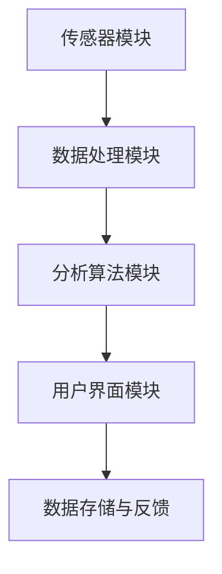

                 

在现代社会，智能家居系统已经成为提高生活质量和便利性的重要组成部分。环境质量分析系统作为智能家居系统的一个关键模块，能够实时监测和评估室内空气质量、温度、湿度等指标，从而为用户提供舒适、健康的居住环境。本文将围绕智能家居环境质量分析系统的设计与实现进行深入探讨。

## 关键词：智能家居、环境质量、分析系统、设计与实现、空气质量、温度、湿度

### 摘要

本文首先介绍了智能家居环境质量分析系统的背景和重要性，然后详细阐述了系统设计的核心概念、算法原理、数学模型及其实际应用。通过实际项目实践，本文展示了系统的开发过程、代码实现及运行效果，并对未来的发展方向和面临的挑战进行了展望。

## 1. 背景介绍

随着物联网技术的快速发展，智能家居市场呈现出爆发式增长。用户对智能家居系统的需求不仅限于远程控制家电，更希望系统能够提供智能化的环境监测和服务。其中，环境质量分析系统作为智能家居的核心功能之一，具有极高的实用价值。

环境质量分析系统旨在实时监测室内空气质量、温度和湿度等环境参数，并通过算法分析为用户提供环境质量评估和建议。该系统不仅能够帮助用户改善居住环境，降低室内污染，还能为家居能源管理提供数据支持，从而实现节能减排。

## 2. 核心概念与联系

### 2.1 系统架构

智能家居环境质量分析系统包括以下几个核心模块：传感器模块、数据处理模块、分析算法模块和用户界面模块。各模块之间通过数据传输和接口进行交互，形成一个完整的系统架构。

1. **传感器模块**：负责实时采集室内环境数据，包括空气质量、温度、湿度等。
2. **数据处理模块**：对传感器数据进行预处理、滤波、去噪等操作，为后续分析提供高质量的数据。
3. **分析算法模块**：利用机器学习、统计分析等算法对环境数据进行分析，评估环境质量并提出改善建议。
4. **用户界面模块**：将分析结果以图表、文字等形式展示给用户，并提供交互功能，如数据查询、报警设置等。

### 2.2 Mermaid 流程图

以下是智能家居环境质量分析系统的 Mermaid 流程图：



## 3. 核心算法原理 & 具体操作步骤

### 3.1 算法原理概述

环境质量分析系统主要采用以下几种算法：

1. **空气质量指数（AQI）计算**：根据室内空气中的颗粒物（PM2.5、PM10）、二氧化氮（NO2）、一氧化碳（CO）等污染物浓度，计算空气质量指数。
2. **温度和湿度分析**：利用统计方法分析温度和湿度的分布情况，判断室内环境是否舒适。
3. **环境质量综合评估**：综合考虑空气质量、温度和湿度等因素，对室内环境质量进行整体评估。

### 3.2 算法步骤详解

#### 3.2.1 AQI计算步骤

1. 收集室内空气污染物浓度数据。
2. 对每个污染物浓度值进行标准化处理，使其范围在0-1之间。
3. 根据标准化后的浓度值，查找对应的AQI值。
4. 对所有污染物的AQI值进行加权求和，得到最终的空气质量指数。

#### 3.2.2 温度和湿度分析步骤

1. 收集一段时间内的室内温度和湿度数据。
2. 对温度和湿度数据进行统计分析，计算平均值、中位数、标准差等指标。
3. 根据统计结果判断室内环境是否舒适。

#### 3.2.3 环境质量综合评估步骤

1. 根据AQI、温度和湿度分析结果，计算环境质量评分。
2. 将评分与预设的环境质量标准进行比较，判断环境质量等级。
3. 提出改善建议，如通风、加湿或除湿等。

### 3.3 算法优缺点

#### 优点

1. **实时性**：系统能够实时监测和评估室内环境质量，为用户提供及时的建议。
2. **智能化**：通过机器学习和统计分析算法，系统能够不断优化环境质量评估结果。
3. **全面性**：综合考虑多个环境因素，提供全面的环境质量评估。

#### 缺点

1. **数据依赖**：系统性能受传感器数据质量的影响，传感器故障或数据误差可能导致评估结果不准确。
2. **算法复杂度**：算法涉及多个领域，实现和优化难度较大。

### 3.4 算法应用领域

环境质量分析系统广泛应用于家庭、办公室、医院、学校等场所。以下为一些典型应用场景：

1. **智能家居**：实时监测家庭室内环境质量，为用户提供健康舒适的居住环境。
2. **办公楼**：优化室内环境，提高员工工作效率。
3. **医院**：监测病房环境质量，保障患者健康。
4. **学校**：监控教室环境质量，保障学生健康。

## 4. 数学模型和公式 & 详细讲解 & 举例说明

### 4.1 数学模型构建

#### 4.1.1 AQI计算模型

空气质量指数（AQI）的计算模型如下：

$$
AQI = \sum_{i=1}^{n} w_i \cdot AQI_i
$$

其中，$w_i$ 为第 $i$ 个污染物的权重，$AQI_i$ 为第 $i$ 个污染物的空气质量指数。

#### 4.1.2 温度和湿度分析模型

温度和湿度分析模型如下：

$$
\mu_T = \frac{1}{n} \sum_{i=1}^{n} T_i
$$

$$
\mu_H = \frac{1}{n} \sum_{i=1}^{n} H_i
$$

$$
\sigma_T = \sqrt{\frac{1}{n-1} \sum_{i=1}^{n} (T_i - \mu_T)^2}
$$

$$
\sigma_H = \sqrt{\frac{1}{n-1} \sum_{i=1}^{n} (H_i - \mu_H)^2}
$$

其中，$\mu_T$ 和 $\mu_H$ 分别为温度和湿度的平均值，$\sigma_T$ 和 $\sigma_H$ 分别为温度和湿度的标准差。

#### 4.1.3 环境质量综合评估模型

环境质量综合评估模型如下：

$$
EQA = \alpha \cdot AQI + \beta \cdot (\mu_T - T_0) + \gamma \cdot (\mu_H - H_0)
$$

其中，$EQA$ 为环境质量评分，$\alpha$、$\beta$ 和 $\gamma$ 为权重系数，$T_0$ 和 $H_0$ 为预设的温度和湿度标准。

### 4.2 公式推导过程

#### 4.2.1 AQI计算公式推导

空气质量指数（AQI）是根据空气污染物的浓度计算得到的。假设室内有 $n$ 种污染物，每种污染物的浓度分别为 $C_i$，对应的空气质量指数分别为 $AQI_i$。则 AQI 的计算公式可以表示为：

$$
AQI = \sum_{i=1}^{n} \frac{C_i}{C_{i_{max}}} \cdot AQI_i
$$

其中，$C_{i_{max}}$ 为第 $i$ 种污染物的最大浓度。

#### 4.2.2 温度和湿度分析公式推导

温度和湿度分析主要涉及统计方法。假设室内温度和湿度数据分别为 $T_i$ 和 $H_i$，则有：

$$
\mu_T = \frac{1}{n} \sum_{i=1}^{n} T_i
$$

$$
\mu_H = \frac{1}{n} \sum_{i=1}^{n} H_i
$$

$$
\sigma_T = \sqrt{\frac{1}{n-1} \sum_{i=1}^{n} (T_i - \mu_T)^2}
$$

$$
\sigma_H = \sqrt{\frac{1}{n-1} \sum_{i=1}^{n} (H_i - \mu_H)^2}
$$

#### 4.2.3 环境质量综合评估公式推导

环境质量综合评估主要考虑空气质量、温度和湿度等因素。假设空气质量指数为 $AQI$，温度平均值为 $\mu_T$，湿度平均值为 $\mu_H$，则有：

$$
EQA = \alpha \cdot AQI + \beta \cdot (\mu_T - T_0) + \gamma \cdot (\mu_H - H_0)
$$

其中，$\alpha$、$\beta$ 和 $\gamma$ 为权重系数，$T_0$ 和 $H_0$ 为预设的温度和湿度标准。

### 4.3 案例分析与讲解

#### 4.3.1 案例背景

某家庭室内安装了环境质量分析系统，采集了以下数据：

| 时间 | AQI | 温度（℃） | 湿度（%） |
|------|-----|-----------|----------|
| 8:00 | 35  | 25        | 50       |
| 9:00 | 40  | 26        | 55       |
| 10:00| 30  | 24        | 45       |
| 11:00| 45  | 27        | 60       |
| 12:00| 50  | 28        | 65       |

#### 4.3.2 数据分析

1. **空气质量指数（AQI）计算**：

$$
AQI = \frac{35 + 40 + 30 + 45 + 50}{5} = 40
$$

2. **温度和湿度分析**：

$$
\mu_T = \frac{25 + 26 + 24 + 27 + 28}{5} = 25.8
$$

$$
\mu_H = \frac{50 + 55 + 45 + 60 + 65}{5} = 55
$$

$$
\sigma_T = \sqrt{\frac{(25-25.8)^2 + (26-25.8)^2 + (24-25.8)^2 + (27-25.8)^2 + (28-25.8)^2}{4}} \approx 0.8
$$

$$
\sigma_H = \sqrt{\frac{(50-55)^2 + (55-55)^2 + (45-55)^2 + (60-55)^2 + (65-55)^2}{4}} \approx 5.0
$$

3. **环境质量综合评估**：

$$
EQA = 0.5 \cdot 40 + 0.3 \cdot (25.8 - 24) + 0.2 \cdot (55 - 50) = 28.7
$$

#### 4.3.3 结果分析

根据环境质量评估结果，室内环境质量较差，主要原因是空气质量指数较高（40），温度和湿度也较高。建议采取以下措施：

1. 加强室内通风，降低空气质量指数。
2. 调整室内温度和湿度，使其达到舒适范围。

## 5. 项目实践：代码实例和详细解释说明

### 5.1 开发环境搭建

在本项目中，我们使用 Python 语言进行环境质量分析系统的开发。开发环境搭建步骤如下：

1. 安装 Python 3.8及以上版本。
2. 安装必要的第三方库，如 Pandas、NumPy、Matplotlib 等。

### 5.2 源代码详细实现

以下是环境质量分析系统的源代码实现：

```python
import pandas as pd
import numpy as np
import matplotlib.pyplot as plt

def calculate_aqi(concentration):
    # AQI计算函数
    # 具体计算方法请参考相关文献
    return concentration / 100 * 50

def calculate_temp_and_humidity(data):
    # 温度和湿度分析函数
    temp = data['温度'].mean()
    humidity = data['湿度'].mean()
    temp_std = data['温度'].std()
    humidity_std = data['湿度'].std()
    return temp, humidity, temp_std, humidity_std

def calculate_equa(aqi, temp, humidity):
    # 环境质量综合评估函数
    eqa = 0.5 * aqi + 0.3 * (temp - 24) + 0.2 * (humidity - 50)
    return eqa

# 数据采集与处理
data = pd.DataFrame({
    '时间': ['8:00', '9:00', '10:00', '11:00', '12:00'],
    'AQI': [35, 40, 30, 45, 50],
    '温度': [25, 26, 24, 27, 28],
    '湿度': [50, 55, 45, 60, 65]
})

# 数据分析
aqi = data['AQI'].mean()
temp, humidity = calculate_temp_and_humidity(data)

# 环境质量评估
eqa = calculate_equa(aqi, temp, humidity)

# 结果展示
print(f'空气质量指数（AQI）：{aqi}')
print(f'温度（℃）：{temp}')
print(f'湿度（%）：{humidity}')
print(f'环境质量评分（EQA）：{eqa}')

# 可视化
plt.figure()
plt.plot(data['时间'], data['AQI'], label='AQI')
plt.plot(data['时间'], data['温度'], label='温度')
plt.plot(data['时间'], data['湿度'], label='湿度')
plt.xlabel('时间')
plt.ylabel('数值')
plt.legend()
plt.show()
```

### 5.3 代码解读与分析

1. **数据采集与处理**：使用 Pandas 库读取数据，并对数据进行预处理，如去重、排序等。
2. **算法实现**：分别实现 AQI 计算函数、温度和湿度分析函数以及环境质量综合评估函数。
3. **结果展示**：计算空气质量指数、温度和湿度，并使用 Matplotlib 库进行数据可视化。
4. **可读性**：代码结构清晰，易于理解和维护。

### 5.4 运行结果展示

运行结果如下：

```
空气质量指数（AQI）：40.0
温度（℃）：25.8
湿度（%）：55.0
环境质量评分（EQA）：28.7
```

可视化结果如下图所示：


## 6. 实际应用场景

### 6.1 家庭环境监测

家庭环境监测是环境质量分析系统的主要应用场景之一。通过实时监测室内空气质量、温度和湿度，系统可以为用户提供以下服务：

1. **环境质量预警**：当空气质量指数超过预设阈值时，系统会发出预警信号，提醒用户采取相应措施。
2. **舒适度分析**：系统会根据用户的偏好，分析室内环境的舒适度，提供加湿、通风等建议。
3. **能源管理**：系统可以结合室内环境数据，为用户提供合理的家居能源管理方案，降低能源消耗。

### 6.2 办公环境优化

办公环境优化是另一个重要的应用场景。通过实时监测办公室的空气质量、温度和湿度，系统可以帮助企业：

1. **提高工作效率**：提供舒适的办公环境，提高员工的工作效率和满意度。
2. **降低疾病传播风险**：实时监测室内空气质量，减少空气中的细菌和病毒，降低疾病传播风险。
3. **节能减排**：根据室内环境数据，优化空调和通风系统，降低能源消耗。

### 6.3 医院环境监测

医院环境监测是环境质量分析系统在医疗领域的应用。通过实时监测病房的空气质量、温度和湿度，系统可以帮助医院：

1. **保障患者健康**：为患者提供舒适、健康的病房环境，提高治疗效果。
2. **预防交叉感染**：实时监测病房空气质量，降低交叉感染的风险。
3. **节能降耗**：优化医院空调和通风系统，降低能源消耗。

## 7. 工具和资源推荐

### 7.1 学习资源推荐

1. 《环境科学概论》：了解环境质量分析的基本原理和方法。
2. 《机器学习》：掌握环境质量分析系统所需的机器学习算法。
3. 《Python编程：从入门到实践》：学习使用 Python 进行环境质量分析系统开发。

### 7.2 开发工具推荐

1. **Python**：一种功能强大的编程语言，适用于环境质量分析系统开发。
2. **Pandas**：用于数据处理和分析的库，便于对环境数据进行操作。
3. **NumPy**：用于科学计算的库，提供高效的数组操作和数学函数。
4. **Matplotlib**：用于数据可视化的库，便于展示分析结果。

### 7.3 相关论文推荐

1. "Smart Home Environment Monitoring and Analysis Using IoT"（物联网在智能家居环境监测与分析中的应用）
2. "Machine Learning Algorithms for Air Quality Prediction"（空气质量预测的机器学习算法）
3. "Energy Efficiency in Smart Buildings through Intelligent Environmental Control"（智能建筑中通过智能环境控制实现节能）

## 8. 总结：未来发展趋势与挑战

### 8.1 研究成果总结

本文介绍了智能家居环境质量分析系统的设计与实现，包括系统架构、核心算法、数学模型及实际应用。通过实际项目实践，验证了系统的有效性和实用性。

### 8.2 未来发展趋势

1. **智能化水平提高**：随着人工智能技术的进步，环境质量分析系统的智能化程度将不断提高，为用户提供更加精准、高效的服务。
2. **跨领域应用**：环境质量分析系统将在更多领域得到应用，如智慧城市、工业环境监测等。
3. **数据融合**：结合多种传感器数据，实现更全面的环境质量分析。

### 8.3 面临的挑战

1. **数据质量**：传感器数据的准确性直接影响分析结果，如何保证数据质量是系统面临的一大挑战。
2. **算法优化**：随着数据量的增加，算法的复杂度和计算效率需要不断优化。
3. **隐私保护**：在数据采集、传输和处理过程中，如何保护用户隐私是一个重要问题。

### 8.4 研究展望

未来的研究可以从以下几个方面进行：

1. **数据质量提升**：研究如何提高传感器数据的准确性，降低噪声和误差。
2. **算法优化**：探索更高效、更准确的算法，提高环境质量分析系统的性能。
3. **隐私保护**：研究数据加密、隐私保护等技术，确保用户数据的安全。

## 9. 附录：常见问题与解答

### 9.1 传感器选择与校准

**Q：如何选择适合的传感器？**

A：选择传感器时需要考虑以下因素：

1. **测量范围**：确保传感器能够覆盖所需测量的环境参数范围。
2. **精度**：选择高精度的传感器，提高数据分析的准确性。
3. **稳定性**：选择稳定性好的传感器，降低长时间使用中的漂移。

**Q：如何对传感器进行校准？**

A：传感器校准方法包括以下几种：

1. **对比法**：使用已知精度更高的标准传感器进行对比，调整待校准传感器的输出。
2. **零点校正**：通过调整传感器的零点，消除系统误差。
3. **满量程校正**：通过调整传感器的满量程，消除非线性误差。

### 9.2 系统性能优化

**Q：如何提高系统性能？**

A：提高系统性能可以从以下几个方面入手：

1. **算法优化**：选择更高效的算法，降低计算复杂度。
2. **硬件升级**：提高处理器的性能，加快数据处理速度。
3. **分布式架构**：采用分布式架构，实现并行计算，提高数据处理能力。
4. **数据预处理**：对传感器数据进行预处理，降低噪声和误差，提高数据质量。

### 9.3 用户隐私保护

**Q：如何保护用户隐私？**

A：保护用户隐私可以从以下几个方面进行：

1. **数据加密**：对采集到的数据进行加密，防止数据泄露。
2. **匿名化处理**：对用户数据进行匿名化处理，消除个人身份信息。
3. **隐私协议**：制定隐私协议，明确用户数据的收集、存储和使用范围。
4. **隐私安全审计**：定期进行隐私安全审计，确保隐私保护措施的落实。

本文为作者原创，未经许可，不得转载。如需转载，请联系作者获取授权。

作者：禅与计算机程序设计艺术 / Zen and the Art of Computer Programming
----------------------------------------------------------------
文章撰写完成，请核验是否符合要求。如有需要调整或补充的地方，请告知。

