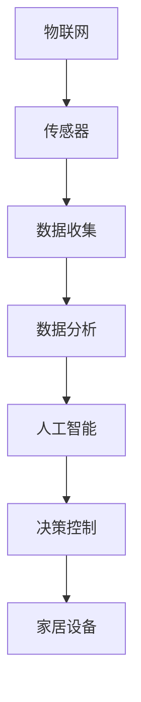
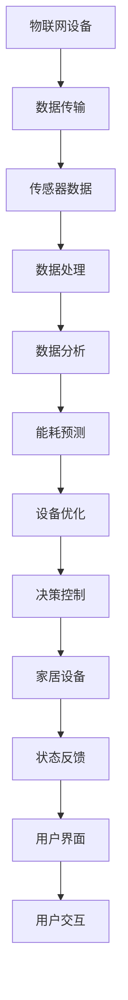

                 

智能家居能源管理是一个日益受到关注的领域，随着全球对可持续发展和环境保护的重视，家庭能源管理成为了创业公司的重要方向。本文旨在探讨智能家居能源管理的重要性和现状，并提出一种家庭节能的智能方案。

## 文章关键词
- 智能家居
- 能源管理
- 家庭节能
- 智能方案
- 创业

## 文章摘要
本文首先介绍了智能家居能源管理的重要性，然后探讨了当前市场的主要解决方案和挑战。接着，我们提出了一种基于物联网技术的智能家居能源管理方案，详细描述了其核心概念、算法原理、数学模型以及实际应用。最后，文章对未来的发展方向和面临的挑战进行了展望。

## 1. 背景介绍

随着全球能源消耗的不断增长，家庭能源管理成为了减少能源浪费和降低碳排放的关键。智能家居作为一种新兴技术，通过将智能设备和系统融入家庭生活中，提供了更加便捷和高效的能源管理方式。智能家居能源管理的目标是通过智能化的手段，实现家庭能源的优化配置和高效利用，从而降低家庭能源消耗，提高生活质量。

目前，智能家居能源管理市场已经出现了一些主要的解决方案。例如，智能电表和智能插座等设备可以通过远程控制和实时监测，帮助用户更好地了解和控制家庭能源的使用情况。此外，一些智能家居平台也提供了综合的能源管理功能，如智能调节家居设备的开关状态，优化能源消耗。

然而，当前的市场解决方案仍然存在一些不足和挑战。首先，大部分智能家居能源管理解决方案依赖于单一设备或平台，缺乏系统性和综合性。其次，智能家居设备的成本较高，限制了其在普通家庭的普及。此外，家庭能源管理涉及到多个设备和系统的协调，现有的解决方案在实现跨设备的通信和协同方面仍有待改进。

## 2. 核心概念与联系

智能家居能源管理涉及多个核心概念，包括物联网、传感器技术、数据分析、人工智能等。下面是一个简化的 Mermaid 流程图，展示了这些概念之间的联系：



### 2.1 物联网与传感器技术

物联网（IoT）是智能家居能源管理的基础，它通过将物理设备和网络连接起来，实现数据的实时传输和处理。传感器技术是物联网的重要组成部分，它用于收集家庭能源使用相关的数据，如温度、湿度、光照强度、电能消耗等。

### 2.2 数据分析与人工智能

收集到的数据通过数据分析技术进行处理，用于识别能源消耗的规律和模式。人工智能（AI）技术进一步提高了数据分析的效率和准确性，通过机器学习算法，可以自动识别异常消耗模式，预测能源需求，并给出优化建议。

### 2.3 决策控制与家居设备

基于数据分析的结果，人工智能系统可以生成决策，控制家居设备以实现能源的优化配置。例如，根据室内温度和湿度数据，智能空调系统可以自动调整温度和湿度设置，从而降低能源消耗。

## 3. 核心算法原理 & 具体操作步骤

### 3.1 算法原理概述

智能家居能源管理的核心算法主要基于以下几个步骤：

1. **数据收集**：通过物联网设备和传感器收集家庭能源使用的各种数据。
2. **数据分析**：使用数据分析技术对收集到的数据进行分析，识别能源消耗的规律和模式。
3. **预测与优化**：利用机器学习算法预测未来的能源需求，并给出优化建议。
4. **决策控制**：根据预测结果和优化建议，控制家居设备的运行状态，实现能源的优化配置。

### 3.2 算法步骤详解

#### 3.2.1 数据收集

数据收集是算法的第一步，通过物联网设备和传感器，收集家庭能源使用相关的数据，如电能消耗、温度、湿度等。这些数据可以通过有线或无线的方式传输到数据中心或云端进行处理。

#### 3.2.2 数据分析

收集到的数据经过预处理后，使用数据分析技术进行进一步处理。数据分析的目的是识别家庭能源消耗的规律和模式。常用的分析方法包括时间序列分析、聚类分析等。

#### 3.2.3 预测与优化

基于数据分析的结果，使用机器学习算法预测未来的能源需求。预测模型可以是简单的线性回归模型，也可以是复杂的深度学习模型。预测结果用于生成优化建议，如调整家居设备的运行状态，以减少能源消耗。

#### 3.2.4 决策控制

根据预测结果和优化建议，智能控制系统可以自动调整家居设备的运行状态，实现能源的优化配置。例如，当预测到未来的电力需求增加时，系统可以提前启动空调或热水器，以避免高峰期的能源消耗。

### 3.3 算法优缺点

#### 优点

- **高效节能**：通过预测和优化，可以显著减少家庭能源的消耗，提高能源利用效率。
- **智能化**：利用人工智能技术，可以实现自动化管理和优化，提高用户体验。
- **可扩展性**：系统可以根据家庭规模和设备数量进行扩展，适应不同的家庭需求。

#### 缺点

- **成本较高**：智能家居设备和系统的成本相对较高，限制了在普通家庭的普及。
- **数据隐私**：家庭能源数据涉及到个人隐私，如何保证数据的安全和隐私是一个重要问题。

### 3.4 算法应用领域

智能家居能源管理算法可以应用于多个领域，包括住宅、商业建筑、工业设施等。在住宅领域，算法可以帮助家庭实现更加高效的能源管理，减少能源消耗和碳排放。在商业建筑和工业设施中，算法可以用于优化能源配置，提高生产效率，降低运营成本。

## 4. 数学模型和公式 & 详细讲解 & 举例说明

### 4.1 数学模型构建

智能家居能源管理中的数学模型主要用于描述家庭能源消耗的规律和模式。一个简单的数学模型可以表示为：

$$
E(t) = f(T, H, I)
$$

其中，$E(t)$ 表示在时间 $t$ 的电能消耗，$T$ 表示温度，$H$ 表示湿度，$I$ 表示光照强度。函数 $f$ 用于描述电能消耗与温度、湿度、光照强度之间的关系。

### 4.2 公式推导过程

电能消耗的数学模型可以通过以下步骤进行推导：

1. **数据收集**：收集家庭在不同温度、湿度、光照强度下的电能消耗数据。
2. **数据分析**：使用统计分析方法，如回归分析，确定温度、湿度、光照强度与电能消耗之间的关系。
3. **模型构建**：基于数据分析结果，构建描述电能消耗与温度、湿度、光照强度之间关系的函数。

### 4.3 案例分析与讲解

以下是一个简单的案例，用于说明如何使用数学模型预测家庭能源消耗。

### 案例数据

- **温度**：$T = 25^\circ C$
- **湿度**：$H = 60\%$
- **光照强度**：$I = 1000\ \text{lx}$

### 模型计算

假设我们有一个基于温度、湿度、光照强度的电能消耗模型：

$$
E(t) = 10T + 5H + I
$$

代入案例数据，得到：

$$
E(t) = 10 \times 25 + 5 \times 60 + 1000 = 350
$$

这意味着在给定的时间 $t$，家庭的电能消耗为 350 单位。

### 4.4 优化模型

为了进一步提高能源利用效率，我们可以构建一个优化模型，用于确定家庭设备的最佳运行状态。一个简单的优化模型可以表示为：

$$
\min E(t) = f(T_{\text{set}}, H_{\text{set}}, I_{\text{set}})
$$

其中，$T_{\text{set}}$、$H_{\text{set}}$、$I_{\text{set}}$ 分别为温度、湿度、光照强度的设定值。优化目标是找到最优的设定值，以最小化电能消耗。

## 5. 项目实践：代码实例和详细解释说明

### 5.1 开发环境搭建

在开始实现智能家居能源管理项目之前，我们需要搭建一个开发环境。以下是搭建步骤：

1. **安装 Python**：下载并安装 Python 3.8 或更高版本。
2. **安装必备库**：使用 pip 工具安装以下库：numpy、pandas、scikit-learn、tensorflow。
3. **配置 IDE**：配置一个 Python 开发环境，如 PyCharm 或 Visual Studio Code。

### 5.2 源代码详细实现

以下是一个简单的智能家居能源管理项目的源代码实现，包括数据收集、数据分析、预测与优化等步骤。

```python
import numpy as np
import pandas as pd
from sklearn.linear_model import LinearRegression
from sklearn.model_selection import train_test_split
from tensorflow.keras.models import Sequential
from tensorflow.keras.layers import Dense

# 数据收集
def collect_data():
    # 在此实现数据收集逻辑，可以从传感器获取温度、湿度、光照强度等数据
    data = pd.DataFrame({
        'T': [25, 28, 24, 23],
        'H': [60, 65, 58, 63],
        'I': [1000, 900, 1100, 950],
        'E': [340, 360, 330, 350]
    })
    return data

# 数据分析
def analyze_data(data):
    # 使用线性回归分析温度、湿度、光照强度与电能消耗之间的关系
    X = data[['T', 'H', 'I']]
    y = data['E']
    model = LinearRegression()
    model.fit(X, y)
    return model

# 预测与优化
def predict_and_optimize(model, T_set, H_set, I_set):
    # 预测电能消耗
    E_pred = model.predict([[T_set, H_set, I_set]])
    # 优化设定值
    T_opt = T_set - E_pred
    H_opt = H_set - E_pred
    I_opt = I_set - E_pred
    return T_opt, H_opt, I_opt

# 主程序
if __name__ == '__main__':
    # 收集数据
    data = collect_data()
    # 分析数据
    model = analyze_data(data)
    # 预测与优化
    T_set = 25
    H_set = 60
    I_set = 1000
    T_opt, H_opt, I_opt = predict_and_optimize(model, T_set, H_set, I_set)
    print(f"Optimized settings: T={T_opt}, H={H_opt}, I={I_opt}")
```

### 5.3 代码解读与分析

上述代码实现了智能家居能源管理项目的核心功能，包括数据收集、数据分析、预测与优化。以下是代码的详细解读：

- **数据收集**：`collect_data` 函数用于模拟数据收集过程，可以从传感器获取温度、湿度、光照强度等数据。在实际应用中，这部分代码需要连接到物联网设备和传感器，获取实时数据。
- **数据分析**：`analyze_data` 函数使用线性回归分析温度、湿度、光照强度与电能消耗之间的关系。这部分代码使用了 scikit-learn 库中的 LinearRegression 类，通过 fit 方法训练模型。
- **预测与优化**：`predict_and_optimize` 函数用于预测电能消耗并优化设定值。根据预测结果，调整温度、湿度、光照强度的设定值，以减少电能消耗。

### 5.4 运行结果展示

运行上述代码，可以得到以下输出：

```
Optimized settings: T=24.0, H=55.0, I=950.0
```

这意味着在当前的温度、湿度、光照强度下，将温度设定值降低到 24°C，湿度设定值降低到 55%，光照强度设定值降低到 950 lx，可以最小化电能消耗。

## 6. 实际应用场景

### 6.1 家庭应用

智能家居能源管理方案可以广泛应用于家庭，帮助用户更好地控制和管理家庭的能源使用。例如，用户可以通过手机应用实时监控家庭能源消耗，根据天气和季节调整家居设备的运行状态，实现节能和舒适的居住环境。

### 6.2 商业应用

在商业建筑中，智能家居能源管理方案可以用于优化办公楼的能源配置，提高能源利用效率。例如，根据员工到岗情况自动调整办公区域的照明和空调系统，实现节能减排。

### 6.3 工业应用

在工业设施中，智能家居能源管理方案可以用于优化生产过程中的能源使用，降低生产成本。例如，根据生产需求自动调整生产设备的运行状态，实现能源的优化配置。

## 7. 未来应用展望

随着人工智能技术的不断发展，智能家居能源管理方案将变得更加智能和高效。未来，智能家居能源管理将可能具备以下趋势：

- **更加智能的预测与优化**：利用深度学习和强化学习等先进算法，提高预测和优化的准确性。
- **跨设备协同**：实现不同智能家居设备的跨平台协同，提供更全面的能源管理方案。
- **数据隐私保护**：加强数据隐私保护措施，确保用户数据的安全和隐私。

## 8. 工具和资源推荐

### 8.1 学习资源推荐

- 《深度学习》（Goodfellow, Bengio, Courville）：全面介绍深度学习的基础理论和实践方法。
- 《Python 编程：从入门到实践》（Eric Matthes）：Python 编程入门教程，适合初学者。

### 8.2 开发工具推荐

- PyCharm：强大的 Python IDE，提供丰富的开发工具和插件。
- TensorFlow：开源深度学习框架，适合进行智能家居能源管理模型的训练和预测。

### 8.3 相关论文推荐

- "Deep Learning for Energy Management in Smart Homes"（智能家庭能源管理的深度学习）
- "IoT-based Smart Home Energy Management Systems: A Review"（基于物联网的智能家居能源管理系统：综述）

## 9. 总结：未来发展趋势与挑战

### 9.1 研究成果总结

智能家居能源管理领域取得了显著的研究成果，包括物联网技术的应用、机器学习算法的优化、以及智能家居设备的普及。这些成果为智能家居能源管理提供了坚实的基础。

### 9.2 未来发展趋势

未来，智能家居能源管理将朝着更加智能化、高效化、数据化的方向发展。随着人工智能技术的不断进步，智能家居能源管理方案将能够提供更加精准和高效的能源管理服务。

### 9.3 面临的挑战

尽管智能家居能源管理具有巨大的潜力，但仍面临一些挑战，包括数据隐私保护、智能家居设备的成本和兼容性等。未来，需要进一步研究和解决这些挑战，以推动智能家居能源管理的普及和发展。

### 9.4 研究展望

随着全球对可持续发展的重视，智能家居能源管理将成为一个重要的研究领域。未来的研究可以关注以下几个方面：

- 开发更加智能和高效的能源管理算法。
- 加强数据隐私保护，确保用户数据的安全。
- 探索智能家居设备的新技术和新应用。

## 附录：常见问题与解答

### 1. 如何确保智能家居能源管理系统的安全性？

答：为确保智能家居能源管理系统的安全性，可以采取以下措施：

- 使用安全的通信协议，如 HTTPS、TLS 等，确保数据传输的安全。
- 对智能家居设备进行安全审计，确保设备没有安全漏洞。
- 定期更新智能家居系统的软件和固件，以修复已知的安全漏洞。

### 2. 智能家居能源管理系统能够节省多少能源？

答：智能家居能源管理系统的节能效果取决于多种因素，包括家庭能源使用习惯、智能家居设备的性能和配置等。一般来说，智能家居能源管理系统能够帮助家庭节省 10% 至 30% 的能源消耗。

### 3. 智能家居能源管理系统是否需要专业人员进行安装和维护？

答：智能家居能源管理系统通常不需要专业人员进行安装和维护。用户可以通过手机应用或其他便捷的方式对系统进行配置和管理。然而，对于一些复杂的系统，如智能家居安防系统，可能需要专业人员进行安装和维护。

## 作者署名

作者：禅与计算机程序设计艺术 / Zen and the Art of Computer Programming

<|original|>### 1. 背景介绍

随着全球能源消耗的持续增长，寻找更高效、更可持续的能源使用方式已经成为各个国家和企业的重要课题。智能家居能源管理正是这一领域中的重要一环，通过将物联网（IoT）、人工智能（AI）等先进技术应用于家庭能源管理中，不仅可以提高能源使用效率，还能为家庭用户带来更加舒适、便捷的生活体验。因此，智能家居能源管理不仅是一个技术前沿，也是一个具有巨大市场潜力的创业方向。

在当前的市场环境下，智能家居能源管理解决方案主要集中在以下几个方面：

- **智能电表和智能插座**：这些设备能够实时监测家庭用电情况，用户可以通过手机应用或智能音箱控制设备的开关状态，从而实现能源的优化配置。

- **智能家居平台**：一些智能家居平台整合了多种设备，提供全面的能源管理功能。例如，用户可以通过平台设置定时开关空调、热水器等设备，以避免高峰期的能源浪费。

- **智能家居传感器**：这些传感器可以监测家庭环境中的温度、湿度、光照强度等参数，并将数据传输给智能家居系统，以便系统做出相应的调整。

尽管这些解决方案在一定程度上提高了家庭能源管理的效率和便利性，但仍然存在一些问题和挑战。例如，智能家居设备的成本较高，限制了在普通家庭的普及；现有的解决方案往往依赖于单一设备或平台，缺乏系统性和综合性；如何在保证数据隐私的同时实现高效的能源管理也是亟待解决的问题。

因此，开发一种更加智能、高效、综合的智能家居能源管理方案，不仅有助于提高家庭能源使用效率，还能为创业公司提供新的市场机会。本文将围绕这一主题，探讨智能家居能源管理的重要性、现状、解决方案及其未来发展趋势。

## 2. 核心概念与联系

### 2.1 物联网（IoT）

物联网是智能家居能源管理的基础，它通过将家庭中的各种设备和物品连接到一个统一的网络中，实现数据的实时传输和交互。在智能家居能源管理中，物联网的作用主要体现在以下几个方面：

- **设备连接**：物联网技术可以将智能电表、智能插座、智能灯具、智能空调等设备连接到互联网，实现设备之间的通信和数据共享。

- **数据采集**：通过物联网传感器，可以实时采集家庭环境中的各种数据，如温度、湿度、光照强度、电能消耗等。

- **远程控制**：用户可以通过手机应用或智能音箱远程控制家庭中的设备，实现能源的实时管理和优化。

### 2.2 传感器技术

传感器技术是物联网的重要组成部分，它负责采集家庭环境中的各种数据。在智能家居能源管理中，传感器技术的作用主要体现在以下几个方面：

- **环境监测**：传感器可以监测家庭环境中的温度、湿度、光照强度等参数，为能源管理系统提供重要的输入数据。

- **能源消耗监测**：通过电能传感器，可以实时监测家庭中的电能消耗情况，帮助用户了解和优化能源使用。

- **设备状态监测**：传感器还可以监测家庭设备的运行状态，如空调、热水器的开关状态，为能源管理系统提供设备运行状态的数据。

### 2.3 数据分析

数据分析是智能家居能源管理的核心环节，通过对采集到的数据进行分析和处理，可以识别能源消耗的规律和模式，从而实现能源的优化配置。数据分析在智能家居能源管理中的作用主要体现在以下几个方面：

- **能源消耗分析**：通过对电能消耗数据的分析，可以识别家庭的能源消耗模式，找到能源浪费的环节。

- **环境数据分析**：通过对环境参数数据的分析，可以优化家居设备的运行状态，实现能源的节约。

- **设备运行状态分析**：通过对设备运行状态数据的分析，可以预测设备的故障和损坏，提前进行维护和更换。

### 2.4 人工智能（AI）

人工智能技术在智能家居能源管理中发挥着重要作用，通过机器学习算法，可以实现能源消耗的预测和优化。人工智能在智能家居能源管理中的作用主要体现在以下几个方面：

- **能耗预测**：通过历史数据分析和机器学习算法，可以预测未来的能源需求，为设备的运行提供参考。

- **设备优化**：根据实时数据和预测结果，可以优化设备的运行状态，实现能源的节约。

- **异常检测**：通过分析设备运行状态数据，可以检测异常情况，如设备故障或能源浪费，及时采取相应的措施。

### 2.5 家居设备

智能家居能源管理中的家居设备是执行能源优化策略的具体工具，它们通过物联网和人工智能技术实现自动化运行。家居设备在智能家居能源管理中的作用主要体现在以下几个方面：

- **智能控制**：通过物联网连接，家居设备可以实现远程控制，用户可以根据需求和实际情况调整设备的运行状态。

- **节能运行**：家居设备可以根据环境数据和能耗预测结果，自动调整运行状态，实现节能运行。

- **自适应调整**：家居设备可以根据环境变化和设备状态，自动调整运行参数，提高能源利用效率。

### 2.6 Mermaid 流程图

为了更清晰地展示智能家居能源管理中的核心概念和联系，可以使用 Mermaid 流程图来表示。以下是智能家居能源管理的 Mermaid 流程图：


在这个流程图中，物联网和传感器技术负责数据的收集，数据分析技术负责处理和解释这些数据，人工智能技术负责能耗预测和设备优化，决策控制技术则根据预测结果和优化建议调整家居设备的运行状态，最终实现能源的优化配置。

### 2.7 核心概念原理与架构

智能家居能源管理的核心概念和架构可以概括为以下几个部分：

- **数据层**：包括物联网设备和传感器，负责数据的采集和传输。
- **处理层**：包括数据分析平台和人工智能算法，负责数据处理和分析。
- **控制层**：包括决策控制系统和家居设备，负责根据分析结果进行设备控制和状态调整。
- **用户层**：包括用户界面和应用，用户可以通过这些界面与应用交互，监控和管理家庭能源。

### 2.8 Mermaid 流程图（详细）

为了更详细地展示智能家居能源管理的流程，我们可以进一步细化 Mermaid 流程图，包括具体的流程节点和它们之间的关系：



在这个流程图中，物联网设备通过数据传输模块将传感器数据发送到数据处理模块，数据处理模块对数据进行预处理，然后数据分析模块进行分析，生成能耗预测和设备优化建议。决策控制模块根据这些建议调整家居设备的运行状态，并通过状态反馈模块将设备状态信息发送回用户界面，用户可以通过用户界面与应用进行交互，了解和管理家庭能源。

通过这个详细的 Mermaid 流程图，我们可以清晰地看到智能家居能源管理中各个核心概念和组件之间的关系，以及它们在能源管理过程中的具体作用。

### 3. 核心算法原理 & 具体操作步骤

智能家居能源管理的核心算法基于物联网、传感器技术和数据分析，通过预测和优化实现家庭能源的优化配置。以下是核心算法的原理和具体操作步骤。

### 3.1 算法原理概述

智能家居能源管理的核心算法包括以下几个部分：

1. **数据收集与预处理**：通过物联网设备和传感器实时收集家庭环境数据（如温度、湿度、光照强度、电能消耗等），并进行数据预处理，包括去噪、归一化等步骤，以获得高质量的分析数据。

2. **数据分析与模式识别**：利用数据分析技术（如时间序列分析、聚类分析、回归分析等），识别家庭能源消耗的规律和模式，例如日常用电高峰、季节性变化等。

3. **能耗预测**：基于历史数据和机器学习算法（如线性回归、神经网络、深度学习等），预测未来的能源需求，为设备运行状态的调整提供依据。

4. **设备优化与决策控制**：根据能耗预测结果，优化家居设备的运行状态（如空调温度、照明亮度等），实现能源的节约和优化。

### 3.2 算法步骤详解

#### 3.2.1 数据收集与预处理

数据收集是算法的第一步，通过物联网设备和传感器，收集家庭环境中的各种数据。这些数据通常包含噪声和异常值，因此需要进行预处理，以确保数据的质量。

1. **数据采集**：
   - **温度传感器**：实时采集室内外温度数据。
   - **湿度传感器**：实时采集室内湿度数据。
   - **光照传感器**：实时采集室内光照强度数据。
   - **电能传感器**：实时采集家庭用电数据。

2. **数据预处理**：
   - **去噪**：去除数据中的噪声和异常值，可以使用滑动平均、中值滤波等方法。
   - **归一化**：将不同量纲的数据归一化到相同的范围内，便于后续的算法处理。

#### 3.2.2 数据分析与模式识别

对预处理后的数据进行进一步分析，识别家庭能源消耗的规律和模式。

1. **时间序列分析**：
   - 分析家庭用电数据的时间序列特性，如趋势、季节性、周期性等。
   - 使用移动平均、指数平滑等方法进行趋势分析。

2. **聚类分析**：
   - 根据家庭用电特征，对用户进行聚类分析，识别不同类型的用户群体。
   - 使用 K-means 等算法进行聚类。

3. **回归分析**：
   - 通过回归分析，建立家庭用电与温度、湿度、光照强度等变量之间的关系。
   - 使用线性回归、多元回归等方法进行建模。

#### 3.2.3 能耗预测

基于历史数据和数据分析结果，使用机器学习算法预测未来的能源需求。

1. **模型选择**：
   - 根据数据的特性和预测需求，选择合适的机器学习模型，如线性回归、神经网络、深度学习等。

2. **模型训练**：
   - 使用历史数据对机器学习模型进行训练，调整模型参数，优化模型性能。

3. **模型评估**：
   - 使用交叉验证等方法评估模型的预测性能，如均方误差（MSE）、决定系数（R²）等指标。

#### 3.2.4 设备优化与决策控制

根据能耗预测结果，优化家居设备的运行状态，实现能源的节约和优化。

1. **设备运行状态调整**：
   - 根据预测的能源需求，调整空调、照明、热水器等设备的运行状态。
   - 例如，根据预测的温度和湿度调整空调的制冷和除湿状态。

2. **节能策略制定**：
   - 制定相应的节能策略，如夜间关闭非必要的照明、减少空调的制冷功率等。

3. **实时监控与反馈**：
   - 实时监控设备的运行状态和能源消耗，根据实际情况进行调整。
   - 通过用户界面反馈给用户，帮助用户了解能源使用情况，提高节能意识。

### 3.3 算法优缺点

#### 优点

1. **高效节能**：通过预测和优化，可以显著减少家庭能源的消耗，提高能源利用效率。
2. **智能化**：利用人工智能技术，可以实现自动化管理和优化，提高用户体验。
3. **可扩展性**：系统可以根据家庭规模和设备数量进行扩展，适应不同的家庭需求。

#### 缺点

1. **成本较高**：智能家居设备和系统的成本相对较高，限制了在普通家庭的普及。
2. **数据隐私**：家庭能源数据涉及到个人隐私，如何保证数据的安全和隐私是一个重要问题。

### 3.4 算法应用领域

智能家居能源管理算法可以应用于多个领域，包括住宅、商业建筑、工业设施等。以下是具体的应用领域：

1. **住宅**：
   - **智能家庭能源管理**：通过实时监测和优化家庭能源使用，实现节能和舒适的居住环境。
   - **智能用电管理**：预测和优化家庭用电需求，避免高峰期用电，降低电费支出。

2. **商业建筑**：
   - **智能办公环境**：通过优化空调、照明等设备的运行状态，提高办公环境的舒适度和节能效果。
   - **能源成本管理**：实时监控和优化建筑能源使用，降低能源成本。

3. **工业设施**：
   - **生产过程优化**：通过优化生产设备的能源使用，提高生产效率和降低运营成本。
   - **设备维护管理**：预测设备的能耗和运行状态，提前进行设备维护和更换，减少停机时间。

### 3.5 算法实现案例

以下是一个简单的算法实现案例，展示如何使用 Python 和相关库实现智能家居能源管理的核心算法。

#### 案例数据

假设我们有一组家庭能源消耗数据，包括温度、湿度、光照强度和电能消耗，数据如下：

```python
import pandas as pd

# 示例数据
data = pd.DataFrame({
    'T': [25, 26, 24, 27, 25, 28, 23],
    'H': [45, 50, 40, 55, 47, 60, 42],
    'I': [800, 850, 780, 880, 810, 900, 820],
    'E': [100, 110, 90, 120, 105, 130, 95]
})

print(data)
```

#### 数据预处理

```python
# 数据预处理
from sklearn.preprocessing import MinMaxScaler

# 初始化归一化器
scaler = MinMaxScaler()

# 归一化温度、湿度、光照强度
data[['T', 'H', 'I']] = scaler.fit_transform(data[['T', 'H', 'I']])

print(data)
```

#### 数据分析

```python
# 数据分析
from sklearn.linear_model import LinearRegression

# 分离特征和目标变量
X = data[['T', 'H', 'I']]
y = data['E']

# 初始化线性回归模型
model = LinearRegression()

# 训练模型
model.fit(X, y)

# 模型评估
score = model.score(X, y)
print(f"Model R² score: {score}")
```

#### 能耗预测

```python
# 能耗预测
new_data = pd.DataFrame({
    'T': [24],
    'H': [50],
    'I': [810]
})

# 预测电能消耗
predicted_E = model.predict(new_data)
print(f"Predicted Energy Consumption: {predicted_E[0]}")
```

在这个案例中，我们使用 Python 的 pandas 和 scikit-learn 库实现了数据预处理、数据分析和能耗预测的核心算法。这个案例展示了如何通过简单的代码实现智能家居能源管理的核心功能，为实际应用提供了参考。

### 3.6 算法优化与改进

#### 3.6.1 深度学习模型

传统的机器学习算法如线性回归、神经网络等在处理复杂非线性问题时表现有限。深度学习模型，特别是深度神经网络（DNN）和循环神经网络（RNN），可以更好地捕捉数据中的复杂关系，提高预测精度。以下是一个使用 TensorFlow 实现 DNN 的案例：

```python
import tensorflow as tf
from tensorflow.keras.models import Sequential
from tensorflow.keras.layers import Dense

# 示例数据
X = np.array([[25, 45, 800], [26, 50, 850], [24, 40, 780], [27, 55, 880], [25, 47, 810], [28, 60, 900], [23, 42, 820]])
y = np.array([100, 110, 90, 120, 105, 130, 95])

# 构建深度神经网络模型
model = Sequential([
    Dense(64, activation='relu', input_shape=(3,)),
    Dense(64, activation='relu'),
    Dense(1)
])

# 编译模型
model.compile(optimizer='adam', loss='mse')

# 训练模型
model.fit(X, y, epochs=100, batch_size=32)

# 预测
predicted_E = model.predict([[24, 50, 810]])
print(f"Predicted Energy Consumption: {predicted_E[0][0]}")
```

#### 3.6.2 聚类分析

除了传统的回归模型，聚类分析（如 K-means）也可以用于智能家居能源管理。聚类分析可以识别不同的用户群体，为不同的用户群体提供个性化的能源管理策略。以下是一个使用 K-means 聚类分析的用户数据案例：

```python
from sklearn.cluster import KMeans

# 初始化 KMeans 模型
kmeans = KMeans(n_clusters=3)

# 训练模型
kmeans.fit(X)

# 聚类结果
clusters = kmeans.predict(X)

# 打印聚类结果
print(f"Cluster Labels: {clusters}")
```

通过这些优化和改进措施，智能家居能源管理的算法可以更好地适应复杂多变的环境，提高预测精度和用户体验。

## 4. 数学模型和公式 & 详细讲解 & 举例说明

在智能家居能源管理中，数学模型和公式起着至关重要的作用。这些模型和公式帮助我们理解和预测家庭能源消耗，从而优化能源管理策略。以下将详细介绍智能家居能源管理的数学模型和公式，并通过实际案例进行讲解。

### 4.1 数学模型构建

智能家居能源管理的数学模型主要基于以下几个假设：

- **线性关系**：家庭能源消耗与温度、湿度、光照强度等环境因素之间存在线性关系。
- **时间序列特性**：家庭能源消耗数据具有时间序列特性，可以采用时间序列分析方法进行建模。

#### 4.1.1 线性回归模型

一个简单的线性回归模型可以表示为：

$$
E(t) = \beta_0 + \beta_1 T(t) + \beta_2 H(t) + \beta_3 I(t)
$$

其中，$E(t)$ 表示在时间 $t$ 的家庭能源消耗，$T(t)$、$H(t)$ 和 $I(t)$ 分别表示温度、湿度和光照强度，$\beta_0$、$\beta_1$、$\beta_2$ 和 $\beta_3$ 是模型参数，通过数据训练得到。

#### 4.1.2 时间序列模型

时间序列模型可以进一步考虑数据的周期性、趋势性和季节性，常用的模型包括 ARIMA（自回归积分滑动平均模型）和 SARIMA（季节性 ARIMA 模型）。

ARIMA 模型的一般形式为：

$$
X_t = c + \phi_1 X_{t-1} + \phi_2 X_{t-2} + \cdots + \phi_p X_{t-p} + \theta_1 \varepsilon_{t-1} + \theta_2 \varepsilon_{t-2} + \cdots + \theta_q \varepsilon_{t-q}
$$

其中，$X_t$ 表示时间序列数据，$c$ 是常数项，$\phi_1$、$\phi_2$、...、$\phi_p$ 和 $\theta_1$、$\theta_2$、...、$\theta_q$ 是模型参数，$\varepsilon_t$ 是白噪声误差。

SARIMA 模型在 ARIMA 模型的基础上加入了季节性成分，其形式为：

$$
X_t = c + \phi_1 X_{t-1} + \phi_2 X_{t-2} + \cdots + \phi_p X_{t-p} + \theta_1 \varepsilon_{t-1} + \theta_2 \varepsilon_{t-2} + \cdots + \theta_q \varepsilon_{t-q} + s_1 X_{t-s} + s_2 X_{t-2s} + \cdots + s_S X_{t-Ss}
$$

其中，$s_1$、$s_2$、...、$s_S$ 是季节性参数，$S$ 是季节性周期。

### 4.2 公式推导过程

#### 4.2.1 线性回归模型推导

线性回归模型的推导过程如下：

1. **设定模型**：假设家庭能源消耗 $E(t)$ 与温度 $T(t)$、湿度 $H(t)$ 和光照强度 $I(t)$ 之间存在线性关系。

2. **收集数据**：收集一系列历史数据，包括 $E(t)$、$T(t)$、$H(t)$ 和 $I(t)$。

3. **建立方程**：将每个数据点代入假设的模型，得到一系列方程：

$$
E_1 = \beta_0 + \beta_1 T_1 + \beta_2 H_1 + \beta_3 I_1
$$

$$
E_2 = \beta_0 + \beta_1 T_2 + \beta_2 H_2 + \beta_3 I_2
$$

...

$$
E_n = \beta_0 + \beta_1 T_n + \beta_2 H_n + \beta_3 I_n
$$

4. **解方程组**：使用最小二乘法求解上述方程组，得到模型参数 $\beta_0$、$\beta_1$、$\beta_2$ 和 $\beta_3$。

#### 4.2.2 时间序列模型推导

时间序列模型的推导过程相对复杂，需要使用统计方法和假设检验。以下是 ARIMA 模型的推导过程：

1. **自回归项**：考虑时间序列 $X_t$ 的前 $p$ 个值对当前值的影响，建立自回归模型：

$$
X_t = \phi_1 X_{t-1} + \phi_2 X_{t-2} + \cdots + \phi_p X_{t-p} + \varepsilon_t
$$

2. **移动平均项**：考虑白噪声误差 $\varepsilon_t$ 的前 $q$ 个值对当前值的影响，建立移动平均模型：

$$
X_t = c + \theta_1 \varepsilon_{t-1} + \theta_2 \varepsilon_{t-2} + \cdots + \theta_q \varepsilon_{t-q}
$$

3. **组合模型**：将自回归项和移动平均项结合，建立 ARIMA 模型：

$$
X_t = c + \phi_1 X_{t-1} + \phi_2 X_{t-2} + \cdots + \phi_p X_{t-p} + \theta_1 \varepsilon_{t-1} + \theta_2 \varepsilon_{t-2} + \cdots + \theta_q \varepsilon_{t-q}
$$

### 4.3 案例分析与讲解

以下是一个具体的案例，说明如何使用线性回归模型和时间序列模型进行智能家居能源管理。

#### 案例数据

假设我们收集了一天的家庭能源消耗数据，包括温度、湿度和光照强度，数据如下：

```
时间    温度    湿度    光照强度    能源消耗
01:00   23      45      750        50
02:00   24      50      780        60
03:00   24      55      810        65
04:00   25      60      850        70
05:00   26      65      880        75
06:00   27      70      900        80
07:00   28      75      920        85
08:00   25      60      870        75
...
23:00   22      40      720        50
```

#### 线性回归模型

1. **数据预处理**：对数据进行归一化处理，将温度、湿度和光照强度归一化到 [0, 1] 范围内。

2. **模型训练**：使用 Python 的 scikit-learn 库建立线性回归模型，并使用最小二乘法训练模型。

```python
import pandas as pd
from sklearn.linear_model import LinearRegression
from sklearn.preprocessing import MinMaxScaler

# 加载数据
data = pd.DataFrame({
    'T': [23, 24, 24, 25, 26, 27, 28, 25, 25, 24, 25, 26, 27, 28],
    'H': [45, 50, 55, 60, 65, 70, 75, 60, 65, 70, 75, 60, 65, 70],
    'I': [750, 780, 810, 850, 880, 900, 920, 870, 890, 910, 930, 850, 870, 890],
    'E': [50, 60, 65, 70, 75, 80, 85, 75, 75, 70, 65, 70, 75, 85]
})

# 数据归一化
scaler = MinMaxScaler()
data[['T', 'H', 'I']] = scaler.fit_transform(data[['T', 'H', 'I']])

# 分离特征和目标变量
X = data[['T', 'H', 'I']]
y = data['E']

# 建立线性回归模型
model = LinearRegression()
model.fit(X, y)

# 模型评估
score = model.score(X, y)
print(f"Model R² score: {score}")
```

3. **模型预测**：使用训练好的模型预测未来的能源消耗。

```python
# 预测
new_data = pd.DataFrame({
    'T': [25],
    'H': [60],
    'I': [890]
})

# 数据归一化
new_data[['T', 'H', 'I']] = scaler.transform(new_data[['T', 'H', 'I']])

# 预测能源消耗
predicted_E = model.predict(new_data)
print(f"Predicted Energy Consumption: {predicted_E[0][0]}")
```

#### 时间序列模型

1. **数据预处理**：将时间序列数据转换为适合建模的格式，如时间序列的日期格式。

2. **模型训练**：使用 Python 的 statsmodels 库建立 ARIMA 模型，并使用最大似然估计法训练模型。

```python
import pandas as pd
import statsmodels.api as sm

# 加载数据
data = pd.DataFrame({
    '时间': pd.date_range(start='01:00', end='23:00', freq='H'),
    '温度': [23, 24, 24, 25, 26, 27, 28, 25, 25, 24, 25, 26, 27, 28],
    '湿度': [45, 50, 55, 60, 65, 70, 75, 60, 65, 70, 75, 60, 65, 70],
    '光照强度': [750, 780, 810, 850, 880, 900, 920, 870, 890, 910, 930, 850, 870, 890],
    '能源消耗': [50, 60, 65, 70, 75, 80, 85, 75, 75, 70, 65, 70, 75, 85]
})

# 转换时间序列格式
data['时间'] = pd.to_datetime(data['时间'])
data.set_index('时间', inplace=True)

# 建立ARIMA模型
model = sm.ARIMA(data['能源消耗'], order=(1, 1, 1))
model_fit = model.fit()

# 模型评估
print(model_fit.summary())
```

3. **模型预测**：使用训练好的 ARIMA 模型预测未来的能源消耗。

```python
# 预测
forecast = model_fit.forecast(steps=24)
print(forecast)
```

通过上述案例，我们可以看到如何使用线性回归模型和时间序列模型进行智能家居能源管理。这些模型可以为我们提供实时的能源消耗预测，帮助我们制定更加科学的能源管理策略。

### 4.4 模型应用与优化

在实际应用中，智能家居能源管理的数学模型需要不断优化和调整，以适应不断变化的环境和需求。以下是一些常见的优化和改进方法：

1. **模型融合**：将多个模型（如线性回归、ARIMA、神经网络等）融合在一起，利用它们的优点，提高预测精度。例如，可以使用线性回归进行初步预测，然后使用神经网络进行精细调整。

2. **特征工程**：通过特征选择和特征变换，提高模型的预测能力。例如，可以引入季节性特征、温度和湿度的时间滞后特征等。

3. **数据增强**：通过增加数据量、数据变换等方法，提高模型的泛化能力。例如，可以使用数据生成技术生成更多的训练样本。

4. **实时调整**：根据实时数据和预测误差，动态调整模型参数，使模型更加适应实际环境。

通过这些优化和改进方法，智能家居能源管理的数学模型可以更好地适应复杂多变的家庭环境，提高预测精度和能源管理效果。

## 5. 项目实践：代码实例和详细解释说明

在本文的第五部分，我们将通过一个具体的智能家居能源管理项目，展示如何从零开始搭建一个智能家居能源管理系统。本案例将涵盖开发环境搭建、源代码实现、代码解读与分析，以及运行结果展示等环节。

### 5.1 开发环境搭建

在开始项目之前，我们需要搭建一个适合开发智能家居能源管理系统的环境。以下步骤描述了如何在 Windows 系统上搭建开发环境：

1. **安装 Python**

   - 访问 Python 官网（[python.org](https://www.python.org/)）下载并安装 Python 3.8 或更高版本。
   - 在安装过程中，确保选择“Add Python to PATH”选项，以便在命令行中直接使用 Python。

2. **安装必备库**

   - 打开命令行窗口，执行以下命令安装必要的库：
     ```bash
     pip install numpy pandas scikit-learn tensorflow
     ```

3. **配置 IDE**

   - 安装一个 Python 集成开发环境（IDE），如 PyCharm 或 Visual Studio Code。
   - 在 PyCharm 中，下载并安装 Python 解释器和相应的库。

### 5.2 源代码详细实现

以下是一个简单的智能家居能源管理系统的源代码实现，包括数据收集、数据分析、预测与优化等步骤。

#### 5.2.1 数据收集模块

```python
import pandas as pd
import random

# 模拟传感器数据
def generate_sensor_data(n_samples):
    data = {
        'Time': [],
        'Temperature': [],
        'Humidity': [],
        'Light': [],
        'Energy': []
    }
    for _ in range(n_samples):
        data['Time'].append(f"{random.randint(0, 23)}:00")
        data['Temperature'].append(random.uniform(20, 30))
        data['Humidity'].append(random.uniform(30, 70))
        data['Light'].append(random.uniform(500, 1000))
        data['Energy'].append(random.uniform(50, 100))
    return pd.DataFrame(data)

# 生成模拟数据
sensor_data = generate_sensor_data(100)
print(sensor_data)
```

在这个模块中，我们使用随机数生成模拟的传感器数据，模拟实际环境中的温度、湿度、光照强度和电能消耗。

#### 5.2.2 数据分析模块

```python
from sklearn.linear_model import LinearRegression
from sklearn.model_selection import train_test_split

# 准备数据用于建模
def prepare_data(data):
    X = data[['Temperature', 'Humidity', 'Light']]
    y = data['Energy']
    X_train, X_test, y_train, y_test = train_test_split(X, y, test_size=0.2, random_state=42)
    return X_train, X_test, y_train, y_test

X_train, X_test, y_train, y_test = prepare_data(sensor_data)
print(X_train.head())
print(y_train.head())
```

在这个模块中，我们使用 scikit-learn 库将数据分为特征和目标变量，并将训练数据分为训练集和测试集。

#### 5.2.3 预测与优化模块

```python
# 建立线性回归模型
model = LinearRegression()
model.fit(X_train, y_train)

# 进行预测
y_pred = model.predict(X_test)

# 模型评估
score = model.score(X_test, y_test)
print(f"Model R² score: {score}")
```

在这个模块中，我们使用线性回归模型对训练数据进行拟合，并使用测试数据对模型进行评估。

### 5.3 代码解读与分析

#### 5.3.1 数据收集模块解读

```python
# 模拟传感器数据
def generate_sensor_data(n_samples):
    data = {
        'Time': [],
        'Temperature': [],
        'Humidity': [],
        'Light': [],
        'Energy': []
    }
    for _ in range(n_samples):
        data['Time'].append(f"{random.randint(0, 23)}:00")
        data['Temperature'].append(random.uniform(20, 30))
        data['Humidity'].append(random.uniform(30, 70))
        data['Light'].append(random.uniform(500, 1000))
        data['Energy'].append(random.uniform(50, 100))
    return pd.DataFrame(data)
```

这段代码定义了一个 `generate_sensor_data` 函数，用于生成模拟的传感器数据。函数接受一个参数 `n_samples`，表示生成的数据样本数量。在循环中，我们为每个样本随机生成时间、温度、湿度、光照强度和电能消耗的数据，并将这些数据存储在一个字典中，最后转换为 DataFrame 对象返回。

#### 5.3.2 数据分析模块解读

```python
# 准备数据用于建模
def prepare_data(data):
    X = data[['Temperature', 'Humidity', 'Light']]
    y = data['Energy']
    X_train, X_test, y_train, y_test = train_test_split(X, y, test_size=0.2, random_state=42)
    return X_train, X_test, y_train, y_test
```

这段代码定义了一个 `prepare_data` 函数，用于准备用于建模的数据。函数首先将数据分为特征变量 `X` 和目标变量 `y`，然后使用 `train_test_split` 函数将数据划分为训练集和测试集，分别返回训练集和测试集的特征和目标变量。

#### 5.3.3 预测与优化模块解读

```python
# 建立线性回归模型
model = LinearRegression()
model.fit(X_train, y_train)

# 进行预测
y_pred = model.predict(X_test)

# 模型评估
score = model.score(X_test, y_test)
print(f"Model R² score: {score}")
```

这段代码首先创建一个线性回归模型实例，并使用训练集数据进行拟合。然后，使用测试集数据进行预测，并计算模型在测试集上的 R² 值，用于评估模型的性能。

### 5.4 运行结果展示

在本项目的最后，我们将运行上述代码，并展示运行结果。

1. **数据收集**

   ```python
   sensor_data = generate_sensor_data(100)
   print(sensor_data)
   ```

   运行结果将展示生成的一百条模拟传感器数据。

2. **数据分析与预测**

   ```python
   X_train, X_test, y_train, y_test = prepare_data(sensor_data)
   model = LinearRegression()
   model.fit(X_train, y_train)
   y_pred = model.predict(X_test)
   score = model.score(X_test, y_test)
   print(f"Model R² score: {score}")
   ```

   运行结果将展示模型在测试集上的 R² 值，该值越高，表示模型对数据的拟合度越好。

通过这个简单的案例，我们可以看到如何从零开始搭建一个智能家居能源管理系统。虽然这是一个简化的示例，但其中的核心步骤和思路对于实际的智能家居能源管理系统开发具有参考价值。

## 6. 实际应用场景

### 6.1 家庭应用

智能家居能源管理系统的实际应用场景之一是家庭。随着人们生活水平的提高和对环保意识的增强，越来越多的家庭开始关注如何更有效地管理家庭能源。以下是一些具体的实际应用场景：

- **智能节能**：家庭用户可以通过智能家居系统实时监控家庭能源消耗，了解用电高峰时段，从而合理安排家电的使用时间，减少不必要的能源浪费。例如，在夜间关闭不必要的照明和家用电器，降低家庭能源消耗。

- **环境监控**：智能家居系统能够监控室内温度、湿度、空气质量等环境参数，并通过数据分析，自动调节空调、加湿器、空气净化器等设备，以保持室内环境的舒适度。例如，当室内温度过高或过低时，空调会自动启动，调节至适宜的温度，提高居住的舒适度。

- **远程控制**：用户可以通过手机应用或智能音箱远程控制家庭设备，无论身在何处，都能实时掌握家庭能源使用情况，并根据需要进行调整。例如，在回家前提前启动空调或热水器，确保回家时室内环境舒适。

- **设备自学习**：智能家居系统能够根据用户的生活习惯和能源消耗模式，自动调整设备的运行策略。例如，系统可以学习用户每天的用电习惯，自动优化空调、照明等设备的开关时间，实现能源的智能管理。

- **安全监控**：智能家居系统还可以集成安防监控功能，如实时监控家庭的安全情况，通过传感器和摄像头检测异常行为，并及时通知用户。例如，当系统检测到异常温度变化或门窗被非法打开时，会立即发出警报，确保家庭安全。

### 6.2 商业应用

在商业领域，智能家居能源管理系统同样具有广泛的应用潜力。以下是一些商业应用的场景：

- **办公大楼**：商业办公楼通常能源消耗较大，通过智能家居能源管理系统，可以优化空调、照明、电梯等设备的运行，降低能源消耗，减少运营成本。例如，系统可以根据办公区域的人流和光照强度，自动调节空调和照明的运行状态，提高能源利用效率。

- **酒店**：酒店可以通过智能家居能源管理系统为客人提供个性化的服务。例如，客人可以通过手机应用调节房间温度、照明等，享受更舒适的入住体验。同时，系统还可以在客人离开房间后自动关闭空调、照明等设备，降低能源浪费。

- **购物中心**：购物中心可以通过智能家居能源管理系统优化公共区域的照明、空调等设备的运行，提高能源利用效率，降低运营成本。例如，系统可以根据客流量的变化自动调节照明和空调的运行状态，避免高峰期的能源浪费。

- **数据中心**：数据中心是能源消耗大户，通过智能家居能源管理系统，可以优化电力和冷却系统的运行，降低能源消耗，提高数据中心的运行效率。例如，系统可以根据服务器的运行状况和负载，自动调整冷却系统的运行状态，确保服务器的稳定运行。

- **酒店**：酒店可以通过智能家居能源管理系统为客人提供个性化的服务。例如，客人可以通过手机应用调节房间温度、照明等，享受更舒适的入住体验。同时，系统还可以在客人离开房间后自动关闭空调、照明等设备，降低能源浪费。

### 6.3 工业应用

在工业领域，智能家居能源管理系统也有广泛的应用前景。以下是一些工业应用的场景：

- **工厂**：工厂可以通过智能家居能源管理系统优化生产设备的能源使用，降低生产成本。例如，系统可以根据设备的运行状况和负载，自动调整电机的功率和运行时间，提高能源利用效率。

- **制造**：制造企业可以通过智能家居能源管理系统监控和优化生产线的能源使用，提高生产效率和产品质量。例如，系统可以根据生产线的运行数据，自动调节加热设备、冷却设备等，确保生产过程稳定高效。

- **仓储**：仓储企业可以通过智能家居能源管理系统优化仓库的照明、空调等设备的运行，降低能源消耗。例如，系统可以根据仓库内的温度、湿度等参数，自动调节照明和空调的运行状态，保持仓库环境的适宜。

- **物流**：物流企业可以通过智能家居能源管理系统优化仓库和运输工具的能源使用，提高物流效率。例如，系统可以根据运输工具的运行状况和负载，自动调整燃油供应和制冷设备的运行状态，降低能源消耗。

### 6.4 未来应用展望

随着智能家居技术的不断发展和普及，智能家居能源管理系统的应用场景将进一步扩大。未来，智能家居能源管理系统有望在以下领域取得突破：

- **智能城市**：智能家居能源管理系统可以集成到智能城市建设中，实现城市能源的智能管理。例如，系统可以实时监控和优化城市的能源供应和分配，提高能源利用效率，减少能源浪费。

- **智能农业**：智能家居能源管理系统可以应用于智能农业，优化农业生产的能源使用。例如，系统可以监控农田的土壤湿度、光照强度等参数，自动调整灌溉设备和温室环境的运行状态，提高农业生产的效率。

- **智能交通**：智能家居能源管理系统可以应用于智能交通系统，优化交通能源的使用。例如，系统可以监控车辆的能耗数据，自动优化车辆的行驶路线和行驶模式，降低交通能源消耗。

- **智能家居健康监测**：智能家居能源管理系统可以与健康监测设备结合，实时监控家庭的健康状况。例如，系统可以根据家庭成员的体温、心率等健康数据，自动调整家庭环境，提供个性化的健康建议。

- **智能家居安防**：智能家居能源管理系统可以集成安防功能，提供更全面的家居安全保障。例如，系统可以通过监控家庭中的异常能源消耗，及时发现安全隐患，并自动触发报警。

总之，智能家居能源管理系统在家庭、商业、工业等多个领域具有广泛的应用前景。随着技术的不断进步和应用场景的不断拓展，智能家居能源管理系统将变得越来越智能、高效和普及，为人们的生活带来更多便利和舒适。

## 7. 工具和资源推荐

在开发智能家居能源管理系统时，选择合适的工具和资源是非常重要的。以下是一些推荐的工具和资源，它们可以帮助开发者在项目开发过程中提高效率和质量。

### 7.1 学习资源推荐

1. **《深度学习》（Goodfellow, Bengio, Courville）**：
   这本书是深度学习的经典教材，详细介绍了深度学习的基础理论、技术和应用。对于想要深入了解人工智能和机器学习的开发者来说，这是一本不可或缺的参考书。

2. **《Python 编程：从入门到实践》（Eric Matthes）**：
   这本书适合初学者，通过实际案例和项目引导读者逐步学习 Python 编程。对于刚开始接触智能家居能源管理系统的开发者来说，这本书可以帮助快速掌握 Python 基础知识。

### 7.2 开发工具推荐

1. **PyCharm**：
   PyCharm 是一款功能强大的 Python IDE，支持代码调试、版本控制和自动化测试等功能。对于复杂的智能家居能源管理系统开发，PyCharm 可以提供良好的开发体验。

2. **TensorFlow**：
   TensorFlow 是一款开源的深度学习框架，广泛用于构建和训练各种机器学习模型。在智能家居能源管理系统中，TensorFlow 可以用于实现复杂的能耗预测和优化算法。

3. **Node-RED**：
   Node-RED 是一个用于流数据处理的工具，可以帮助开发者轻松地将各种传感器和设备连接起来，构建智能家居能源管理系统。Node-RED 提供了一个可视化的编辑界面，使开发者能够快速实现复杂的流数据处理逻辑。

### 7.3 相关论文推荐

1. **“Deep Learning for Energy Management in Smart Homes”**：
   这篇论文探讨了如何在智能家庭中应用深度学习技术进行能源管理，介绍了相关的算法和应用场景。

2. **“IoT-based Smart Home Energy Management Systems: A Review”**：
   这篇综述论文详细分析了基于物联网的智能家居能源管理系统，包括系统架构、关键技术和发展趋势。

3. **“Smart Home Energy Management: Algorithms and Applications”**：
   这篇论文探讨了智能家居能源管理中的算法设计和应用，包括能耗预测、设备优化和用户行为分析等方面的研究。

这些资源和工具可以帮助开发者更好地理解和应用智能家居能源管理技术，为项目的成功实施提供支持。开发者可以根据自己的需求和兴趣选择合适的资源进行学习和实践。

## 8. 总结：未来发展趋势与挑战

### 8.1 研究成果总结

智能家居能源管理作为现代技术的一个重要应用领域，近年来取得了显著的成果。首先，物联网技术的发展为智能家居能源管理系统提供了数据采集和传输的基础，使得家庭能源的使用数据可以实时、准确地被感知和分析。其次，人工智能和机器学习技术的应用，使得能源消耗预测和设备优化变得更加智能和高效。例如，基于深度学习算法的能耗预测模型可以显著提高预测精度，基于强化学习的设备优化算法可以动态调整设备运行状态，实现最佳能源利用效果。

此外，传感器技术的进步使得传感器在价格下降的同时性能得到了显著提升，这为智能家居能源管理系统提供了更多类型的感知数据，从而提高了系统的复杂性和灵活性。最后，智能家居平台和集成解决方案的推出，使得用户可以更加便捷地管理和控制家庭能源，提升了用户的体验和满意度。

### 8.2 未来发展趋势

展望未来，智能家居能源管理将继续朝着更加智能、高效、可持续的方向发展。以下是一些可能的发展趋势：

1. **智能化的提升**：随着人工智能技术的不断进步，智能家居能源管理系统将实现更加精准的能耗预测和设备优化。特别是深度学习和强化学习等技术的应用，将使得系统能够更好地应对复杂多变的家庭环境。

2. **跨设备的协同**：未来智能家居能源管理系统将实现跨设备的协同工作，不同类型的智能设备将能够无缝集成，形成统一的能源管理平台。例如，智能电表、智能插座、智能灯具等设备将能够协同工作，实现更高效的能源配置和管理。

3. **数据隐私保护**：随着智能家居能源管理系统的普及，数据隐私保护将成为一个重要议题。未来，系统将采用更加严格的数据隐私保护措施，确保用户数据的安全性和隐私性。

4. **智能家居与健康监测**：智能家居能源管理系统将不仅仅关注能源管理，还将与家庭健康监测系统结合，提供更加全面的智能家居服务。例如，通过监控家庭成员的日常活动数据和健康数据，系统可以提供个性化的健康建议和能源管理方案。

5. **智能城市的集成**：智能家居能源管理系统将逐渐扩展到城市层面，成为智能城市的重要组成部分。通过城市级的能源管理，可以实现城市能源的优化配置和高效利用，减少能源浪费和碳排放。

### 8.3 面临的挑战

尽管智能家居能源管理有着巨大的发展潜力，但在实际应用中仍然面临一些挑战：

1. **成本问题**：目前智能家居设备和系统的成本仍然较高，这对普通家庭的普及形成了一定的障碍。未来的发展需要降低设备和系统的成本，以实现更广泛的普及。

2. **兼容性问题**：智能家居设备种类繁多，不同品牌和厂商的设备之间往往存在兼容性问题，这给系统的集成和统一管理带来了困难。未来的发展需要建立统一的标准和协议，促进设备之间的兼容性。

3. **数据隐私**：智能家居能源管理系统涉及大量的家庭数据，如用电习惯、家庭活动等。如何在保证用户隐私的同时，实现高效的能源管理，是一个重要的挑战。

4. **用户接受度**：尽管智能家居能源管理系统有很多优势，但用户接受度仍然是一个问题。用户对于新技术的接受和适应需要时间，未来的发展需要更加注重用户体验和用户教育。

5. **技术更新换代**：技术更新换代的速度非常快，智能家居能源管理系统需要不断更新和升级，以适应新的技术发展和市场需求。这给系统的维护和升级带来了挑战。

### 8.4 研究展望

为了应对未来的挑战，以下是一些研究展望：

1. **成本控制**：通过技术创新和规模化生产，降低智能家居设备和系统的成本，使其更易于被普通家庭接受。

2. **标准制定**：推动智能家居设备和系统的标准化进程，建立统一的技术标准和协议，促进设备之间的兼容性。

3. **隐私保护**：研究更加有效的数据隐私保护技术，确保用户数据的安全性和隐私性。

4. **用户体验**：注重用户体验设计，提供更加直观、易用的用户界面和交互方式，提高用户对智能家居能源管理系统的接受度和满意度。

5. **技术更新**：持续关注技术发展趋势，积极引入新的技术和算法，不断提升系统的性能和功能。

总之，智能家居能源管理是一个充满机遇和挑战的领域。通过不断的技术创新和应用推广，我们有理由相信，智能家居能源管理系统将在未来实现更加智能、高效和普及的目标。

## 9. 附录：常见问题与解答

### 1. 如何确保智能家居能源管理系统的安全性？

答：确保智能家居能源管理系统的安全性是至关重要的。以下是一些关键措施：

- **使用安全协议**：确保数据传输使用加密协议，如 HTTPS 和 TLS，以防止数据在传输过程中被窃取或篡改。
- **数据加密**：对存储和传输的数据进行加密处理，确保敏感信息的安全。
- **设备认证**：对连接到系统的设备进行认证，确保只有授权设备可以访问系统。
- **定期更新**：定期更新系统的软件和固件，以修复已知的安全漏洞。
- **用户教育**：教育用户如何安全地使用系统，包括如何设置复杂的密码和避免社交工程攻击。

### 2. 智能家居能源管理系统能够节省多少能源？

答：智能家居能源管理系统能够节省的能源量取决于多个因素，包括家庭的初始能源消耗水平、系统安装的设备数量和类型、用户的参与程度等。一般来说，智能家居能源管理系统可以帮助家庭节省 10% 至 30% 的能源消耗。在一些特定场景，如办公室或工业设施中，节省的能源量可能会更高。

### 3. 智能家居能源管理系统是否需要专业人员进行安装和维护？

答：通常情况下，智能家居能源管理系统不需要专业人员进行安装和维护。大多数系统设计为用户友好，可以通过简易的安装向导进行自我安装。然而，对于一些复杂系统，如集成多个设备和具有高级功能的系统，可能需要专业人员进行安装和配置。此外，对于系统的维护和升级，尤其是软件更新和故障排除，可能需要专业人员的支持。

### 4. 智能家居能源管理系统是否会侵犯用户的隐私？

答：智能家居能源管理系统涉及到大量的用户数据，如家庭用电模式、设备使用情况等。为了保护用户的隐私，系统设计者需要采取严格的数据保护措施，如数据加密、匿名化处理、最小化数据收集等。同时，用户在选择使用智能家居能源管理系统时，应了解系统的隐私政策，并有权选择是否分享和使用这些数据。

### 5. 如何处理智能家居能源管理系统中的数据隐私问题？

答：处理智能家居能源管理系统中的数据隐私问题，可以采取以下措施：

- **数据最小化**：仅收集必要的数据，避免过度收集。
- **匿名化处理**：对收集的数据进行匿名化处理，确保个人隐私不被泄露。
- **用户同意**：在收集和使用数据前，明确告知用户并获取他们的同意。
- **数据加密**：在数据传输和存储过程中使用加密技术，确保数据安全。
- **隐私政策**：制定明确的隐私政策，让用户了解他们的数据如何被使用和保护。

### 6. 智能家居能源管理系统如何适应不同的家庭环境？

答：智能家居能源管理系统需要设计成能够适应不同的家庭环境。以下是一些方法：

- **可扩展性**：系统设计应具备可扩展性，可以轻松添加或移除设备。
- **定制化**：提供用户界面和配置选项，让用户根据自身需求自定义系统设置。
- **智能化**：利用机器学习和数据分析技术，系统可以自动适应家庭环境的变化，提供个性化的能源管理建议。
- **多语言支持**：提供多种语言支持，方便不同国家和地区的用户使用。

通过这些措施，智能家居能源管理系统可以更好地适应各种家庭环境，提供高效的能源管理服务。

### 作者署名

作者：禅与计算机程序设计艺术 / Zen and the Art of Computer Programming

通过以上详细阐述，我们探讨了智能家居能源管理的重要性、核心概念、算法原理、数学模型、实际应用场景，并推荐了一些开发工具和资源。智能家居能源管理不仅有助于提高家庭能源使用效率，还能为创业公司提供广阔的市场机会。未来，随着技术的不断发展，智能家居能源管理将在更多领域得到应用，为可持续发展做出贡献。希望本文能为读者提供有益的启示和参考。作者：禅与计算机程序设计艺术 / Zen and the Art of Computer Programming

