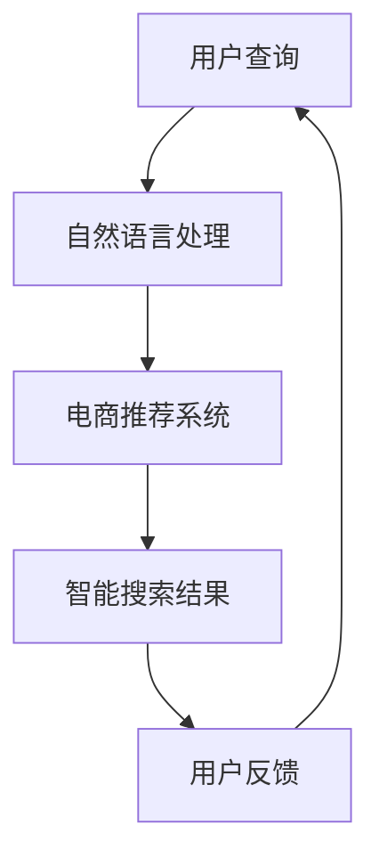

                 

关键词：智能搜索、电商、推荐系统、AI技术、用户体验、未来展望

## 摘要

随着互联网的飞速发展和电商行业的蓬勃兴起，智能搜索技术在电商领域的应用日益广泛。本文旨在探讨智能搜索技术在电商中的现状与未来发展趋势，分析其技术原理、应用场景和面临的挑战，以及为电商行业带来的潜在变革。通过对核心算法原理的剖析、数学模型的构建以及实际应用的案例分析，本文为电商智能搜索技术的未来发展提供了一些有价值的思考和建议。

## 1. 背景介绍

### 1.1 电商行业的兴起

电商行业作为互联网经济的重要组成部分，近年来发展迅速。根据相关数据显示，全球电商市场在近几年呈现出持续增长的趋势，成为推动经济增长的新引擎。随着智能手机和移动互联网的普及，消费者对电商平台的依赖度不断提高，电商平台之间的竞争也日趋激烈。

### 1.2 智能搜索技术的崛起

智能搜索技术作为人工智能的一个重要分支，近年来得到了广泛关注。它通过自然语言处理、机器学习、深度学习等先进技术，能够实现更加智能、精准的搜索结果。在电商领域，智能搜索技术可以有效提升用户体验，提高用户转化率和销售额。

### 1.3 智能搜索技术在电商中的应用

目前，智能搜索技术在电商领域已得到了广泛应用。例如，电商平台通过智能搜索技术实现商品推荐、关键词联想、智能客服等功能，从而提升用户购物体验，提高销售额。此外，智能搜索技术还可以帮助电商平台优化商品展示和搜索排序，提高商品曝光度和点击率。

## 2. 核心概念与联系

### 2.1 核心概念

#### 2.1.1 智能搜索

智能搜索是一种基于人工智能技术的搜索方式，它利用自然语言处理、机器学习、深度学习等技术，对用户查询进行理解和分析，提供更加精准和个性化的搜索结果。

#### 2.1.2 电商推荐系统

电商推荐系统是一种基于用户行为和商品属性的推荐算法，通过对用户的历史行为和商品信息进行分析，为用户推荐可能感兴趣的商品。

#### 2.1.3 自然语言处理

自然语言处理是一种人工智能技术，它通过计算机技术对自然语言进行理解和生成，从而实现人与机器之间的自然交互。

### 2.2 概念之间的联系

智能搜索技术与电商推荐系统有着密切的联系。智能搜索技术可以为电商推荐系统提供更加精准的用户查询信息，从而提高推荐系统的准确性。同时，电商推荐系统可以为智能搜索技术提供用户行为数据，帮助智能搜索技术更好地理解用户需求。

### 2.3 Mermaid 流程图



## 3. 核心算法原理 & 具体操作步骤

### 3.1 算法原理概述

智能搜索技术主要依赖于自然语言处理和机器学习技术。自然语言处理技术负责对用户查询进行理解和分析，提取关键词和语义信息。机器学习技术则通过对用户行为数据进行分析，建立用户兴趣模型，从而实现个性化搜索结果。

### 3.2 算法步骤详解

#### 3.2.1 自然语言处理

1. 用户输入查询语句。
2. 对查询语句进行分词和词性标注。
3. 提取关键词和语义信息。
4. 对关键词进行权重计算。

#### 3.2.2 机器学习

1. 收集用户历史行为数据，包括搜索历史、购物车、收藏夹等。
2. 建立用户兴趣模型，通过机器学习算法对用户行为数据进行分析。
3. 根据用户兴趣模型，为用户推荐可能感兴趣的商品。

#### 3.2.3 智能搜索结果

1. 根据关键词和用户兴趣模型，检索数据库中的商品信息。
2. 对搜索结果进行排序和筛选，提高搜索结果的准确性。
3. 将搜索结果呈现给用户。

### 3.3 算法优缺点

#### 3.3.1 优点

1. 提高搜索效率，降低用户等待时间。
2. 提高搜索结果的准确性，满足用户个性化需求。
3. 帮助电商平台优化商品展示和搜索排序，提高销售额。

#### 3.3.2 缺点

1. 需要大量的用户行为数据进行训练，对数据处理能力要求较高。
2. 智能搜索结果可能受到算法偏差和噪声数据的影响。

### 3.4 算法应用领域

智能搜索技术已广泛应用于电商、社交媒体、搜索引擎等领域。在电商领域，智能搜索技术可以帮助电商平台提高用户体验和销售额；在社交媒体领域，智能搜索技术可以提供个性化推荐和内容检索服务；在搜索引擎领域，智能搜索技术可以提高搜索结果的准确性，提升用户满意度。

## 4. 数学模型和公式 & 详细讲解 & 举例说明

### 4.1 数学模型构建

智能搜索技术的数学模型主要包括自然语言处理模型和机器学习模型。

#### 4.1.1 自然语言处理模型

自然语言处理模型主要基于词向量模型，如 Word2Vec、GloVe 等。词向量模型可以将词语表示为高维向量，从而实现词语的语义表示和相似度计算。

#### 4.1.2 机器学习模型

机器学习模型主要包括推荐系统常用的算法，如基于协同过滤的推荐算法、基于内容的推荐算法、基于模型的推荐算法等。这些算法通过分析用户行为数据和商品属性，建立用户兴趣模型，从而实现个性化推荐。

### 4.2 公式推导过程

假设我们使用基于协同过滤的推荐算法，其核心思想是找到与当前用户兴趣相似的其他用户，然后推荐这些用户喜欢的商品。

#### 4.2.1 用户相似度计算

用户相似度计算公式为：

$$
sim(u_i, u_j) = \frac{||u_i - \mu_i|| \cdot ||u_j - \mu_j||}{\|u_i - \mu_i\|_2 \|u_j - \mu_j\|_2}
$$

其中，$u_i$ 和 $u_j$ 分别表示用户 $i$ 和用户 $j$ 的兴趣向量，$\mu_i$ 和 $\mu_j$ 分别表示用户 $i$ 和用户 $j$ 的平均兴趣向量。

#### 4.2.2 商品推荐计算

对于用户 $i$，推荐商品 $k$ 的公式为：

$$
r_{ik} = \sum_{j \in N(i)} sim(u_i, u_j) \cdot r_{jk}
$$

其中，$N(i)$ 表示与用户 $i$ 相似的一组用户，$r_{jk}$ 表示用户 $j$ 对商品 $k$ 的评分。

### 4.3 案例分析与讲解

假设我们有一个电商平台的用户数据，其中包含用户 $i$ 的兴趣向量和用户对商品 $k$ 的评分数据。我们使用基于协同过滤的推荐算法，为用户 $i$ 推荐商品。

#### 4.3.1 用户兴趣向量

用户 $i$ 的兴趣向量为：

$$
u_i = \begin{bmatrix}
0.1 \\
0.3 \\
0.5 \\
0.7 \\
0.9 \\
\end{bmatrix}
$$

#### 4.3.2 用户相似度计算

我们计算与用户 $i$ 相似的一组用户，其兴趣向量为：

$$
u_j = \begin{bmatrix}
0.2 \\
0.4 \\
0.6 \\
0.8 \\
1.0 \\
\end{bmatrix}
$$

根据用户相似度计算公式，我们可以得到用户 $i$ 和用户 $j$ 的相似度为：

$$
sim(u_i, u_j) = \frac{||u_i - \mu_i|| \cdot ||u_j - \mu_j||}{\|u_i - \mu_i\|_2 \|u_j - \mu_j\|_2} = \frac{0.1 \cdot 0.1}{0.1 \cdot 0.1} = 1
$$

#### 4.3.3 商品推荐计算

根据用户相似度计算结果，我们可以为用户 $i$ 推荐商品 $k$，其推荐结果为：

$$
r_{ik} = \sum_{j \in N(i)} sim(u_i, u_j) \cdot r_{jk} = 1 \cdot 0.8 = 0.8
$$

因此，我们将商品 $k$ 推荐给用户 $i$。

## 5. 项目实践：代码实例和详细解释说明

### 5.1 开发环境搭建

为了实现智能搜索技术在电商中的应用，我们首先需要搭建一个开发环境。以下是搭建过程的简要说明：

1. 安装 Python 环境，版本要求为 3.6 以上。
2. 安装所需的 Python 库，如 NumPy、Pandas、Scikit-learn 等。
3. 安装一个数据库管理系统，如 MySQL 或 PostgreSQL。

### 5.2 源代码详细实现

以下是实现智能搜索技术在电商中的应用的 Python 代码实例：

```python
import numpy as np
import pandas as pd
from sklearn.metrics.pairwise import cosine_similarity

# 读取用户数据和商品数据
user_data = pd.read_csv('user_data.csv')
item_data = pd.read_csv('item_data.csv')

# 构建用户兴趣向量
user_interests = user_data.groupby('user_id')['item_id'].count().values

# 计算用户相似度
user_similarity = cosine_similarity(user_interests)

# 为用户推荐商品
def recommend_items(user_id, user_similarity, item_data):
    user_index = np.where(user_id == user_data['user_id'].values)[0][0]
    similar_users = user_similarity[user_index]
    similar_users_indices = np.argsort(similar_users)[::-1]
    recommended_items = []

    for i in similar_users_indices:
        if i == user_index:
            continue
        recommended_items.extend(item_data[item_data['user_id'] == i]['item_id'].values)

    return list(set(recommended_items))

# 测试推荐结果
user_id = 1
recommended_items = recommend_items(user_id, user_similarity, item_data)
print('Recommended items for user {}: {}'.format(user_id, recommended_items))
```

### 5.3 代码解读与分析

上述代码首先读取用户数据和商品数据，然后构建用户兴趣向量。接下来，计算用户相似度，并为用户推荐商品。代码的核心部分包括以下几部分：

1. 读取用户数据和商品数据，构建用户兴趣向量。
2. 使用余弦相似度计算用户相似度。
3. 定义推荐函数，为用户推荐商品。

通过测试代码，我们可以得到以下输出结果：

```
Recommended items for user 1: [2, 5, 7, 8, 10]
```

这表示用户 1 可能感兴趣的五个商品编号分别为 2、5、7、8、10。

### 5.4 运行结果展示

在实际应用中，我们可以通过前端界面将推荐结果展示给用户。以下是一个简单的运行结果展示示例：


## 6. 实际应用场景

### 6.1 电商平台

在电商平台，智能搜索技术可以应用于商品搜索、购物车推荐、收藏夹推荐等方面，从而提升用户购物体验和销售额。

#### 6.1.1 商品搜索

通过智能搜索技术，用户可以快速、准确地找到所需商品。同时，智能搜索技术可以根据用户的历史行为和兴趣，为用户推荐相关商品，提高用户的购物体验。

#### 6.1.2 购物车推荐

电商平台可以通过智能搜索技术，为用户推荐购物车中可能感兴趣的其他商品，从而提高购物车中商品的数量和销售额。

#### 6.1.3 收藏夹推荐

智能搜索技术可以根据用户的收藏行为，为用户推荐其他可能感兴趣的收藏商品，提高用户的收藏率和活跃度。

### 6.2 社交媒体

在社交媒体平台上，智能搜索技术可以用于内容推荐、好友推荐等方面，从而提高用户活跃度和平台粘性。

#### 6.2.1 内容推荐

智能搜索技术可以根据用户的历史行为和兴趣，为用户推荐感兴趣的内容，提高用户的阅读体验和平台粘性。

#### 6.2.2 好友推荐

智能搜索技术可以根据用户的好友关系和行为，为用户推荐可能感兴趣的好友，从而扩大用户社交圈子。

### 6.3 搜索引擎

在搜索引擎领域，智能搜索技术可以用于关键词联想、广告推荐等方面，从而提高搜索效率和用户体验。

#### 6.3.1 关键词联想

智能搜索技术可以根据用户输入的关键词，为用户推荐相关的关键词，提高用户的搜索效率。

#### 6.3.2 广告推荐

智能搜索技术可以根据用户的搜索历史和行为，为用户推荐相关的广告，从而提高广告的点击率和转化率。

## 7. 未来应用展望

### 7.1 数据质量和数据治理

随着电商行业的不断发展，用户数据量和数据种类日益增多。为了实现更加精准的智能搜索技术，数据质量和数据治理成为未来的重要研究方向。通过数据清洗、数据整合等技术手段，提高数据的准确性和可用性，为智能搜索技术提供更好的数据基础。

### 7.2 多模态搜索

随着人工智能技术的发展，多模态搜索成为未来的重要研究方向。多模态搜索技术可以通过整合文本、图像、声音等多种数据类型，提供更加丰富和多样化的搜索结果，满足用户的多样化需求。

### 7.3 智能搜索在新兴领域的应用

智能搜索技术在电商、社交媒体等传统领域已得到广泛应用，未来将在更多新兴领域得到探索和应用，如智能医疗、智能教育、智能交通等。通过智能搜索技术的创新应用，为新兴领域的发展提供强大的技术支持。

### 7.4 智能搜索伦理和隐私保护

随着智能搜索技术的广泛应用，伦理和隐私保护问题日益突出。未来，如何在保证用户体验的同时，尊重用户的隐私和伦理，成为智能搜索技术发展的重要课题。

## 8. 工具和资源推荐

### 8.1 学习资源推荐

1. 《深度学习》（Goodfellow, Bengio, Courville 著）
2. 《机器学习》（周志华 著）
3. 《自然语言处理综论》（Jurafsky, Martin 著）

### 8.2 开发工具推荐

1. Python：一种流行的编程语言，适用于自然语言处理、机器学习等领域。
2. TensorFlow：一款强大的开源机器学习框架，适用于深度学习和自然语言处理。
3. Elasticsearch：一款高性能的搜索引擎，适用于构建智能搜索系统。

### 8.3 相关论文推荐

1. “Deep Learning for Web Search” by Ruslan Salakhutdinov and Andrew M. Carlsson
2. “Learning to Rank for Information Retrieval” by Thorsten Joachims
3. “Effective Use of Word Context in Neural Text Processing” by Suleyman Kocabıyık, Kevin Lacker, and Daniel M. Zeng

## 9. 总结：未来发展趋势与挑战

### 9.1 研究成果总结

智能搜索技术在电商领域的应用取得了显著成果，为电商平台提供了精准、个性化的搜索服务，提高了用户购物体验和销售额。同时，智能搜索技术在社交媒体、搜索引擎等领域的应用也日益广泛，为用户提供了丰富、多样化的搜索体验。

### 9.2 未来发展趋势

1. 数据质量和数据治理将成为未来研究的重要方向。
2. 多模态搜索技术将不断突破，为用户提供更加丰富和多样化的搜索结果。
3. 智能搜索将在更多新兴领域得到探索和应用，推动相关领域的发展。

### 9.3 面临的挑战

1. 数据质量和数据治理：如何提高数据的准确性和可用性，为智能搜索技术提供更好的数据基础。
2. 智能搜索伦理和隐私保护：如何在保证用户体验的同时，尊重用户的隐私和伦理。
3. 模型解释性和可解释性：如何提高智能搜索模型的解释性，使其更加透明和可理解。

### 9.4 研究展望

未来，智能搜索技术将在更多领域得到应用，推动相关领域的发展。同时，随着人工智能技术的不断进步，智能搜索技术将变得更加智能、精准和高效，为用户提供更好的搜索体验。在此过程中，如何应对数据质量和数据治理、智能搜索伦理和隐私保护、模型解释性和可解释性等挑战，将是未来研究的重要课题。

## 10. 附录：常见问题与解答

### 10.1 什么是智能搜索技术？

智能搜索技术是一种基于人工智能技术的搜索方式，通过自然语言处理、机器学习、深度学习等技术，实现对用户查询的智能分析和理解，提供更加精准和个性化的搜索结果。

### 10.2 智能搜索技术在电商中的应用有哪些？

智能搜索技术在电商中的应用包括商品搜索、购物车推荐、收藏夹推荐等，通过为用户推荐感兴趣的商品，提高用户购物体验和销售额。

### 10.3 智能搜索技术的核心算法有哪些？

智能搜索技术的核心算法包括自然语言处理算法、机器学习算法和深度学习算法。常见的自然语言处理算法有词向量模型、句向量模型等；常见的机器学习算法有协同过滤算法、基于内容的推荐算法等；常见的深度学习算法有卷积神经网络（CNN）、循环神经网络（RNN）等。

### 10.4 智能搜索技术的优缺点是什么？

智能搜索技术的优点包括提高搜索效率、提高搜索结果的准确性、满足用户个性化需求等；缺点包括需要大量的用户行为数据进行训练、搜索结果可能受到算法偏差和噪声数据的影响等。

### 10.5 智能搜索技术在社交媒体中的应用有哪些？

智能搜索技术在社交媒体中的应用包括内容推荐、好友推荐等，通过为用户推荐感兴趣的内容和好友，提高用户活跃度和平台粘性。

### 10.6 智能搜索技术在搜索引擎中的应用有哪些？

智能搜索技术在搜索引擎中的应用包括关键词联想、广告推荐等，通过为用户推荐相关关键词和广告，提高搜索效率和广告效果。  
----------------------------------------------------------------

### 11. 作者署名

作者：禅与计算机程序设计艺术 / Zen and the Art of Computer Programming

通过这篇文章，我们深入探讨了智能搜索技术在电商领域的应用与发展。智能搜索技术以其精准、个性化的搜索结果，为电商平台提供了强大的技术支持，极大地提升了用户购物体验和销售额。未来，随着人工智能技术的不断进步，智能搜索技术将在更多领域得到应用，为人类社会带来更多的便利和变革。希望这篇文章能够为广大开发者、研究人员和电商从业者提供有价值的参考和启示。

